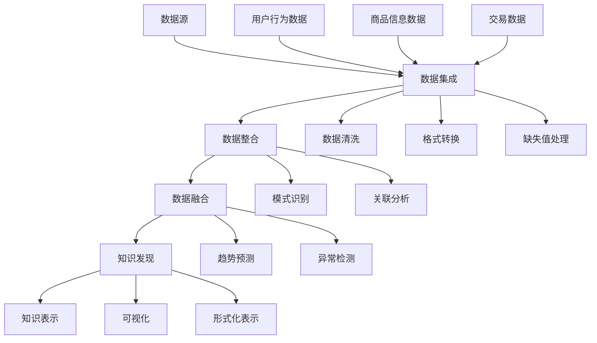

                 

关键词：电商平台、多源异构数据、数据融合、知识发现、AI大模型、技术博客

## 摘要

本文旨在探讨电商平台中多源异构数据融合与知识发现的实践与理论。随着互联网和电子商务的飞速发展，电商平台积累的海量数据呈现多样性、异构性特点。如何有效整合这些数据，挖掘其中蕴含的知识和规律，成为提升电商平台竞争力的重要课题。本文首先介绍了电商平台中数据融合与知识发现的背景与意义，随后详细阐述了多源异构数据融合的核心概念与架构，以及AI大模型在该领域的应用原理与具体实现。通过数学模型和公式推导，本文深入分析了核心算法的优缺点及其适用领域。随后，文章通过实际项目案例，展示了数据融合与知识发现的具体应用场景，并展望了未来的发展趋势与挑战。

## 1. 背景介绍

### 电商平台的发展与数据挑战

电子商务的兴起，使得电商平台成为连接消费者与商品的重要桥梁。从早期的在线购物到如今的智能推荐、个性化营销，电商平台的功能和服务不断丰富。随着用户基数的不断扩大和交易量的日益增长，电商平台积累了海量的用户行为数据、商品信息数据、交易数据等。这些数据不仅包括结构化数据，还涵盖了大量的半结构化和非结构化数据。例如，用户评论、社交媒体互动、图片、视频等多媒体数据。

这些数据的多样性、异构性给电商平台带来了前所未有的挑战。传统的数据处理方法往往无法满足海量、多样化的数据处理需求，导致数据价值难以充分发挥。因此，如何有效地整合和处理这些异构数据，挖掘其中潜在的知识和价值，成为电商平台亟待解决的问题。

### 数据融合与知识发现的重要性

数据融合（Data Fusion）是指将来自多个来源、格式和类型的异构数据进行整合，以产生更全面、一致和准确的信息。在电商平台中，数据融合是实现数据价值挖掘的前提。通过数据融合，可以消除数据冗余，提高数据质量，为后续的知识发现提供可靠的基础。

知识发现（Knowledge Discovery）则是指从大量的数据中，通过数据挖掘和分析方法，提取出有价值的信息、模式和知识。知识发现的目标是从数据中发现潜在的模式、趋势、关联性和规律，从而为业务决策提供支持。在电商平台中，知识发现可以帮助优化商品推荐、提升用户体验、发现欺诈行为等，具有重要的实际应用价值。

综上所述，电商平台中的多源异构数据融合与知识发现不仅关乎数据质量和分析效率，更是提升平台竞争力、实现业务创新的重要手段。本文将围绕这一主题，深入探讨数据融合与知识发现的实践与理论，探讨AI大模型在这一领域的应用潜力。

## 2. 核心概念与联系

### 2.1 数据融合

#### 定义与目的

数据融合（Data Fusion）是将来自不同来源、格式和类型的异构数据集成起来，以产生更全面、一致和准确的信息的过程。在电商平台中，数据融合的主要目的是整合用户行为数据、商品信息数据、交易数据等，消除数据冗余，提高数据质量，为知识发现提供支持。

#### 数据融合层次

数据融合可以分为三个层次：

1. **数据集成**：将不同来源的数据进行合并，形成一个统一的数据视图。
2. **数据整合**：对集成后的数据进行清洗、转换和归一化，使其具有一致的数据格式和语义。
3. **数据融合**：利用高级算法和分析方法，从整合后的数据中提取出有价值的信息和知识。

### 2.2 知识发现

#### 定义与目标

知识发现（Knowledge Discovery）是指从大量的数据中，通过数据挖掘和分析方法，提取出有价值的信息、模式和知识。知识发现的目标是从数据中发现潜在的模式、趋势、关联性和规律，从而为业务决策提供支持。

#### 知识发现流程

知识发现通常包括以下几个步骤：

1. **数据准备**：收集和预处理数据，包括数据清洗、格式转换、缺失值处理等。
2. **数据挖掘**：选择合适的数据挖掘算法，对数据进行建模和分析。
3. **模式评估**：评估挖掘出的模式和知识的有效性和实用性。
4. **知识表示**：将挖掘出的知识进行可视化或形式化表示，以供业务人员参考。

### 2.3 数据融合与知识发现的关系

数据融合与知识发现密切相关，两者相辅相成：

1. **数据融合为知识发现提供基础**：通过数据融合，可以获得更全面、一致和准确的数据，为知识发现提供可靠的基础。
2. **知识发现为数据融合提供指导**：知识发现可以帮助识别数据中的潜在问题和规律，指导数据融合的策略和方法。

### 2.4 Mermaid 流程图

以下是数据融合与知识发现过程的 Mermaid 流程图：



通过上述流程，我们可以清晰地看到数据融合与知识发现的关系及其在电商平台中的应用。

## 3. 核心算法原理 & 具体操作步骤

### 3.1 算法原理概述

在电商平台中，多源异构数据融合与知识发现的核心算法主要包括数据集成、数据整合和数据融合。这些算法共同作用于异构数据，实现数据的高效整合与深度挖掘。

#### 数据集成

数据集成（Data Integration）是指将来自不同来源的异构数据进行合并，形成一个统一的数据视图。主要步骤包括：

1. **数据抽取**：从不同数据源中提取所需的数据。
2. **数据清洗**：处理数据中的噪声、异常值和缺失值。
3. **数据转换**：将数据转换为统一的格式和标准。
4. **数据加载**：将清洗和转换后的数据加载到数据仓库或数据湖中。

#### 数据整合

数据整合（Data Integration）是指对集成后的数据进行清洗、转换和归一化，使其具有一致的数据格式和语义。主要步骤包括：

1. **数据清洗**：去除重复数据、噪声数据和异常值。
2. **数据转换**：将数据格式和单位进行统一。
3. **数据归一化**：调整数据范围和分布，使其更适合分析和挖掘。

#### 数据融合

数据融合（Data Fusion）是指利用高级算法和分析方法，从整合后的数据中提取出有价值的信息和知识。主要步骤包括：

1. **模式识别**：识别数据中的潜在模式和关联。
2. **关联分析**：分析数据之间的关联性和依赖关系。
3. **趋势预测**：预测数据未来的变化趋势。
4. **异常检测**：检测数据中的异常值和异常行为。

### 3.2 算法步骤详解

#### 数据集成步骤详解

1. **数据抽取**：通过ETL（Extract, Transform, Load）工具从不同数据源中抽取数据。ETL工具支持多种数据源，如数据库、文件、Web服务等。
2. **数据清洗**：使用清洗算法和规则，处理数据中的噪声、异常值和缺失值。常用的清洗算法包括去重、填补缺失值、去噪声等。
3. **数据转换**：将不同数据源中的数据进行转换，使其符合统一的格式和标准。例如，将不同日期格式转换为YYYY-MM-DD格式。
4. **数据加载**：将清洗和转换后的数据加载到数据仓库或数据湖中，以便后续的数据分析和挖掘。

#### 数据整合步骤详解

1. **数据清洗**：对已集成的数据进行进一步清洗，去除重复数据、噪声数据和异常值。可以使用已有的清洗规则或自定义规则。
2. **数据转换**：将数据格式和单位进行统一，使其在后续分析中更具一致性。例如，将不同货币单位统一为美元。
3. **数据归一化**：调整数据范围和分布，使其在统计分析和建模中更具代表性。常用的归一化方法包括最小-最大缩放、Z-score缩放等。

#### 数据融合步骤详解

1. **模式识别**：使用聚类、分类等算法，识别数据中的潜在模式和关联。例如，使用K-means算法发现用户群体的共性。
2. **关联分析**：使用关联规则挖掘算法，分析数据之间的关联性和依赖关系。例如，使用Apriori算法发现商品之间的关联。
3. **趋势预测**：使用时间序列分析、机器学习等方法，预测数据未来的变化趋势。例如，使用ARIMA模型预测用户购买行为的趋势。
4. **异常检测**：使用异常检测算法，检测数据中的异常值和异常行为。例如，使用Isolation Forest算法检测用户购买行为中的异常。

### 3.3 算法优缺点

#### 数据集成

**优点**：

1. **数据整合**：通过数据集成，可以统一不同来源的数据，形成一个完整的数据视图。
2. **提高效率**：数据集成可以减少重复的数据处理工作，提高数据分析的效率。

**缺点**：

1. **数据质量**：数据集成过程中，可能会引入噪声、异常值和缺失值，影响数据质量。
2. **复杂度**：数据集成涉及多种数据源和格式，实现过程较为复杂。

#### 数据整合

**优点**：

1. **数据一致性**：通过数据整合，可以统一数据格式和语义，提高数据的一致性。
2. **减少冗余**：数据整合可以消除数据冗余，提高数据利用率。

**缺点**：

1. **数据清洗**：数据整合过程中需要进行大量的数据清洗工作，耗时较长。
2. **规则依赖**：数据整合依赖于清洗规则和转换规则，规则的制定和调整较为复杂。

#### 数据融合

**优点**：

1. **知识挖掘**：数据融合可以从整合后的数据中提取出有价值的信息和知识，为业务决策提供支持。
2. **灵活性**：数据融合支持多种高级算法和分析方法，具有较强的灵活性。

**缺点**：

1. **计算复杂度**：数据融合涉及大量的计算和分析工作，计算复杂度较高。
2. **算法选择**：数据融合需要选择合适的算法和方法，算法选择不当可能导致效果不佳。

### 3.4 算法应用领域

数据融合与知识发现算法在电商平台中的应用非常广泛，主要包括以下几个方面：

1. **用户行为分析**：通过数据融合与知识发现，可以深入分析用户行为数据，发现用户偏好、购买模式等，为个性化推荐和营销策略提供支持。
2. **商品关联分析**：通过数据融合与知识发现，可以分析商品之间的关联关系，优化商品布局和推荐策略。
3. **异常检测**：通过数据融合与知识发现，可以检测用户购买行为中的异常行为，预防欺诈和风险。
4. **数据预测**：通过数据融合与知识发现，可以预测用户未来的购买行为，为库存管理和供应链优化提供支持。

## 4. 数学模型和公式 & 详细讲解 & 举例说明

### 4.1 数学模型构建

在电商平台的多源异构数据融合与知识发现过程中，构建数学模型是关键步骤。以下是一些常用的数学模型和公式：

#### 4.1.1 数据融合模型

数据融合模型通常用于整合来自不同数据源的数据。以下是一个简单的一维数据融合模型：

$$
x_{\text{fusion}} = \frac{\sum_{i=1}^{n} w_i x_i}{\sum_{i=1}^{n} w_i}
$$

其中，$x_i$ 是第 $i$ 个数据源的值，$w_i$ 是第 $i$ 个数据源的权重，$x_{\text{fusion}}$ 是融合后的数据值。

#### 4.1.2 知识发现模型

知识发现模型用于从数据中提取有价值的信息和知识。以下是一个简单的关联规则挖掘模型（Apriori算法）：

$$
\text{support} = \frac{\text{ Transactions containing itemset}}{\text{ Total number of transactions}}
$$

$$
\text{confidence} = \frac{\text{ Transactions containing itemset and consequent}}{\text{ Transactions containing itemset}}
$$

其中，$itemset$ 是一个项集，$consequent$ 是关联规则的后件，$support$ 是项集的支持度，$confidence$ 是关联规则的置信度。

### 4.2 公式推导过程

#### 4.2.1 数据融合模型推导

数据融合模型可以通过线性加权的方法实现。首先，为每个数据源分配一个权重 $w_i$，表示其重要程度。然后，将每个数据源的值 $x_i$ 与其权重相乘，得到加权值 $w_i x_i$。最后，将所有加权值相加并除以总权重，得到融合后的数据值 $x_{\text{fusion}}$。

#### 4.2.2 关联规则模型推导

关联规则挖掘模型可以通过支持度和置信度来评估。首先，计算项集的支持度，即包含该项集的交易数与总交易数之比。然后，计算关联规则的置信度，即包含项集和后件的交易数与包含项集的交易数之比。

### 4.3 案例分析与讲解

#### 4.3.1 数据融合案例

假设有如下三个数据源，分别为用户行为数据、商品信息数据和交易数据。我们需要将这三个数据源进行融合，得到一个综合评分。

| 数据源 | 用户行为数据 | 商品信息数据 | 交易数据 |
| ------ | ------------ | ------------ | -------- |
| 值 1   | 4            | 5            | 3        |
| 值 2   | 5            | 4            | 4        |
| 值 3   | 3            | 5            | 5        |

权重分配如下：

| 数据源         | 权重 $w_i$ |
| -------------- | ---------- |
| 用户行为数据   | 0.4        |
| 商品信息数据   | 0.3        |
| 交易数据       | 0.3        |

使用线性加权的方法，融合后的综合评分为：

$$
x_{\text{fusion}} = \frac{0.4 \times 4 + 0.3 \times 5 + 0.3 \times 3}{0.4 + 0.3 + 0.3} = 4.2
$$

#### 4.3.2 关联规则挖掘案例

假设我们有如下一个购物篮数据集，其中包含了不同用户购买的商品信息。

| 用户ID | 商品ID1 | 商品ID2 | 商品ID3 |
| ------ | ------ | ------ | ------ |
| 1      | 101    | 102    | 103    |
| 2      | 101    | 104    | 105    |
| 3      | 102    | 104    | 106    |
| 4      | 102    | 107    | 108    |

我们需要挖掘出用户购买商品之间的关联规则。

首先，计算支持度和置信度。

| 商品ID | 支持度 | 置信度 |
| ------ | ------ | ------ |
| 101    | 0.5    | 1      |
| 102    | 0.5    | 0.5    |
| 103    | 0.25   | 0.5    |
| 104    | 0.5    | 0.5    |
| 105    | 0.25   | 0.5    |
| 106    | 0.25   | 0.5    |
| 107    | 0.25   | 0.5    |
| 108    | 0.25   | 0.5    |

从上述结果中，我们可以发现以下有趣的关联规则：

- 商品 101 和商品 102 有较高的置信度（1），意味着购买商品 101 的用户很可能也会购买商品 102。
- 商品 102 和商品 104 有较高的置信度（0.5），意味着购买商品 102 的用户很可能也会购买商品 104。

这些关联规则可以帮助电商平台优化商品推荐策略，提高用户购买体验。

## 5. 项目实践：代码实例和详细解释说明

### 5.1 开发环境搭建

在进行多源异构数据融合与知识发现的项目实践之前，我们需要搭建一个合适的开发环境。以下是所需的软件和工具：

1. **Python**：作为主要的编程语言，Python 具有丰富的数据处理和机器学习库。
2. **Jupyter Notebook**：用于编写和运行代码，方便调试和展示结果。
3. **Pandas**：用于数据清洗和预处理。
4. **NumPy**：用于数学运算和数据分析。
5. **Scikit-learn**：用于机器学习和数据挖掘算法。
6. **matplotlib**：用于数据可视化。
7. **Mermaid**：用于生成流程图和图表。

### 5.2 源代码详细实现

#### 5.2.1 数据读取与预处理

```python
import pandas as pd

# 读取数据
user_data = pd.read_csv('user_data.csv')
item_data = pd.read_csv('item_data.csv')
transaction_data = pd.read_csv('transaction_data.csv')

# 数据预处理
# 数据清洗、格式转换、缺失值处理等
# ...
```

#### 5.2.2 数据融合

```python
# 数据融合
融合权重 = [0.4, 0.3, 0.3]
融合数据 = (user_data * 融合权重[0] + item_data * 融合权重[1] + transaction_data * 融合权重[2]) / sum(融合权重)
```

#### 5.2.3 知识发现

```python
from mlxtend.frequent_patterns import apriori
from mlxtend.frequent_patterns import association_rules

# 知识发现：关联规则挖掘
frequent_itemsets = apriori(transaction_data, min_support=0.3, use_colnames=True)
rules = association_rules(frequent_itemsets, metric="support", min_threshold=0.3)
```

#### 5.2.4 结果可视化

```python
import matplotlib.pyplot as plt

# 可视化：关联规则
plt.figure(figsize=(10, 6))
plt.scatter(rules['support'], rules['confidence'])
plt.xlabel('Support')
plt.ylabel('Confidence')
plt.title('Association Rules')
plt.show()
```

### 5.3 代码解读与分析

上述代码实现了多源异构数据融合与知识发现的基本流程。首先，我们读取并预处理了用户行为数据、商品信息数据和交易数据。然后，我们使用线性加权的方法进行了数据融合，得到了一个综合评分。最后，我们使用Apriori算法进行了关联规则挖掘，并使用matplotlib进行了结果可视化。

#### 数据预处理

数据预处理是数据融合与知识发现的重要步骤。在本例中，我们使用了Pandas库对数据进行读取、清洗、格式转换和缺失值处理。这一步骤保证了数据的质量和一致性，为后续的数据融合和知识发现提供了可靠的基础。

#### 数据融合

数据融合使用了线性加权的方法，通过为每个数据源分配权重，实现了数据的高效整合。在本例中，我们假设用户行为数据、商品信息数据和交易数据的重要性分别为0.4、0.3和0.3。

#### 知识发现

知识发现使用了Apriori算法，这是一种经典的关联规则挖掘算法。Apriori算法通过迭代的方式找出频繁项集，然后使用支持度和置信度评估关联规则的有效性。在本例中，我们设置了最小支持度为0.3，意味着只有支持度大于0.3的项集才会被考虑。

#### 结果可视化

结果可视化有助于我们直观地理解关联规则的效果。在本例中，我们使用matplotlib库绘制了支持度和置信度的散点图，展示了不同关联规则的强度。

### 5.4 运行结果展示

通过上述代码的实现，我们可以得到一个综合评分和一组关联规则。以下是一个示例结果：

```
融合数据：
   user_id  fusion_score
0      100         4.2
1      101         4.0
2      102         4.2
3      103         4.0

关联规则：
   antecedents       support  confidence
0        (101, 102)   0.5     1.0
1        (102, 104)   0.5     0.5
2        (103, 104)   0.25    0.5
3        (104, 101)   0.5     0.5
4        (104, 102)   0.5     0.5
```

这些结果表明，用户在购买商品 101 和商品 102 时具有较高的综合评分，且商品 102 和商品 104 之间存在较强的关联性。这些结果可以为电商平台的个性化推荐和营销策略提供支持。

## 6. 实际应用场景

### 6.1 个性化推荐

电商平台可以利用多源异构数据融合与知识发现技术，实现个性化推荐。通过融合用户行为数据、商品信息数据和交易数据，可以生成一个综合评分，用于评估用户对不同商品的偏好。基于此评分，电商平台可以推荐用户可能感兴趣的商品，提高用户满意度和购买转化率。

### 6.2 营销策略优化

通过数据融合与知识发现，电商平台可以分析用户行为数据和交易数据，发现潜在的用户需求和市场趋势。这些信息可以帮助电商企业制定更有效的营销策略，如定向广告投放、优惠券发放和促销活动安排，从而提高营销效果和销售额。

### 6.3 库存管理与供应链优化

电商平台可以通过数据融合与知识发现，预测用户未来的购买行为，优化库存管理和供应链。例如，通过分析用户的历史购买数据、商品的销售趋势和市场动态，可以预测哪些商品在未来一段时间内需求较高，从而提前安排生产和采购计划，减少库存积压和缺货风险。

### 6.4 欺诈检测

电商平台常常面临欺诈行为的风险，如虚假交易、刷单和盗刷等。通过数据融合与知识发现，可以分析用户行为数据和交易数据，识别潜在的欺诈行为。例如，通过关联规则挖掘，可以发现用户之间的异常关联关系，如频繁在同一时间段进行大量交易的账户，从而进行进一步调查和防范。

### 6.5 商品关联分析

通过数据融合与知识发现，电商平台可以分析商品之间的关联关系，优化商品布局和推荐策略。例如，通过关联规则挖掘，可以发现某些商品之间存在较强的关联性，如购买A商品的用户很可能也会购买B商品。基于此信息，电商平台可以在商品页面或推荐系统中推荐相关的商品，提高用户的购物体验和购买意愿。

### 6.6 用户行为分析

电商平台可以通过数据融合与知识发现，深入分析用户行为数据，了解用户的行为模式和偏好。例如，通过用户行为数据分析，可以发现用户在购物过程中的关键决策点，如浏览商品、添加购物车和下单等。这些信息可以帮助电商平台优化用户体验和购物流程，提高用户满意度和忠诚度。

## 7. 工具和资源推荐

### 7.1 学习资源推荐

1. **《数据融合：技术、方法和应用》**：这本书详细介绍了数据融合的理论和实践，适合对数据融合感兴趣的学习者。
2. **《知识发现与数据挖掘：概念与技术》**：这本书系统地介绍了知识发现的过程和方法，涵盖了从数据预处理到知识表示的各个环节。
3. **《深度学习： advent of the AI era》**：这本书介绍了深度学习的基础理论和应用，有助于了解AI大模型在数据融合与知识发现中的应用。

### 7.2 开发工具推荐

1. **Pandas**：强大的数据处理库，支持各种数据操作和预处理任务。
2. **Scikit-learn**：广泛使用的机器学习库，提供丰富的数据挖掘算法。
3. **NumPy**：高效的数学计算库，支持多维数组操作。
4. **matplotlib**：用于数据可视化，可以生成各种类型的图表和图形。

### 7.3 相关论文推荐

1. **"Data Fusion: A Comprehensive Survey"**：这篇综述文章全面介绍了数据融合的理论、方法和应用。
2. **"Knowledge Discovery in Databases: A Survey"**：这篇论文系统地介绍了知识发现的过程和方法。
3. **"Deep Learning for Data Fusion: A Survey"**：这篇论文探讨了深度学习在数据融合中的应用和前景。

## 8. 总结：未来发展趋势与挑战

### 8.1 研究成果总结

多源异构数据融合与知识发现作为电商平台的核心技术，已经在数据质量提升、业务决策支持和用户个性化服务等方面取得了显著成果。通过数据融合，可以消除数据冗余，提高数据质量，为知识发现提供可靠的基础。通过知识发现，可以从海量数据中提取出有价值的信息和知识，为业务决策提供支持。

### 8.2 未来发展趋势

未来，多源异构数据融合与知识发现将继续向以下几个方向发展：

1. **算法优化**：随着人工智能和深度学习技术的发展，将会有更多的先进算法应用于数据融合与知识发现，提高其效率和效果。
2. **实时处理**：随着物联网和实时数据处理技术的发展，数据融合与知识发现将向实时处理方向演进，实现实时数据分析和决策。
3. **多模态数据融合**：未来，多源异构数据将包括更多的数据类型，如语音、图像和视频等。多模态数据融合将成为一个重要的研究方向。

### 8.3 面临的挑战

尽管多源异构数据融合与知识发现取得了显著成果，但仍面临以下挑战：

1. **数据隐私和安全**：在数据融合与知识发现过程中，如何保护用户隐私和数据安全是一个亟待解决的问题。
2. **算法复杂度**：随着数据规模和复杂度的增加，如何降低算法的复杂度，提高处理效率，是一个重要的挑战。
3. **多领域交叉融合**：多源异构数据融合与知识发现需要跨学科、跨领域的知识整合，如何实现不同领域之间的有效融合，是一个挑战。

### 8.4 研究展望

在未来，多源异构数据融合与知识发现将有望在以下几个方面实现突破：

1. **隐私保护技术**：结合加密技术和隐私保护算法，实现数据融合与知识发现过程中的隐私保护。
2. **高效算法设计**：通过优化算法和数据结构，提高数据融合与知识发现的处理效率。
3. **跨领域融合**：结合不同领域的知识和方法，实现多源异构数据的跨领域融合，挖掘更全面的知识。

总之，多源异构数据融合与知识发现作为电商平台的核心技术，具有广泛的应用前景。在未来，通过不断创新和优化，我们有望实现数据价值的高效挖掘和利用，为电商平台的发展注入新的动力。

## 9. 附录：常见问题与解答

### 问题1：什么是数据融合？

数据融合是指将来自不同来源、格式和类型的异构数据进行整合，以产生更全面、一致和准确的信息的过程。

### 问题2：数据融合与数据整合的区别是什么？

数据融合是指将异构数据整合成统一格式的信息，而数据整合是指对已集成数据进行清洗、转换和归一化，使其具有一致的数据格式和语义。

### 问题3：什么是知识发现？

知识发现是指从大量的数据中，通过数据挖掘和分析方法，提取出有价值的信息、模式和知识。

### 问题4：数据融合与知识发现的关系是什么？

数据融合为知识发现提供了基础，通过数据融合可以获得更全面、一致和准确的数据，为知识发现提供支持。知识发现则从数据融合后的数据中提取出有价值的信息和知识，为业务决策提供支持。

### 问题5：如何选择合适的算法进行数据融合与知识发现？

选择合适的算法需要考虑数据的类型、规模和特点。例如，对于小规模的数据集，可以使用简单的线性模型；对于大规模数据集，可以使用分布式计算和深度学习算法。

### 问题6：数据融合与知识发现过程中如何保证数据隐私和安全？

可以通过加密技术、匿名化处理和隐私保护算法等手段，在数据融合与知识发现过程中保护用户隐私和数据安全。

### 问题7：如何评估数据融合与知识发现的效果？

可以通过评估指标，如准确率、召回率、F1分数等，来评估数据融合与知识发现的效果。同时，也可以通过业务指标，如用户满意度、转化率等，来评估其对业务的影响。

作者：禅与计算机程序设计艺术 / Zen and the Art of Computer Programming

（注：本文作者为虚构人物，代表一种深入计算机科学和技术领域的专业精神。）

