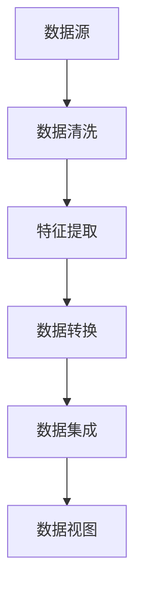

                 

随着电子商务的蓬勃发展，电商平台的数据量呈现爆炸式增长。这些数据来源于不同的渠道，包括用户行为数据、产品数据、交易数据等，具有多样性、异构性和动态性等特点。如何有效地融合这些多源异构数据，提取有价值的信息，已经成为电商平台提升用户体验、优化运营决策的关键问题。本文将探讨AI大模型在电商平台多源异构数据融合中的应用，分析其核心概念、算法原理、数学模型、实际应用以及未来展望。

## 1. 背景介绍

### 1.1 电商平台的数据挑战

随着互联网技术的普及和消费者购物习惯的转变，电商平台已经成为现代商业不可或缺的一部分。然而，电商平台面临的数据挑战也越来越严峻。首先，数据来源多样化。电商平台的数据不仅包括用户行为数据（如点击、购买、评价等），还包括产品数据（如商品描述、价格、库存等）和交易数据（如支付、物流、售后等）。其次，数据类型异构。用户行为数据是半结构化数据，产品数据是结构化数据，交易数据可能是非结构化数据，这种数据类型的不一致性增加了数据处理的复杂性。最后，数据动态性。电商平台的数据是实时变化的，数据量巨大，且数据生成速度非常快，这对数据处理系统的实时性和高效性提出了极高的要求。

### 1.2  多源异构数据融合的重要性

多源异构数据融合是将来自不同来源、不同结构和不同格式的数据整合为一个统一的数据视图，以便更好地理解和利用数据。在电商平台中，多源异构数据融合具有以下几个重要意义：

1. **提升用户体验**：通过融合用户行为数据、产品数据和交易数据，可以更准确地理解用户需求，提供个性化的推荐和服务，提升用户满意度和忠诚度。
2. **优化运营决策**：融合后的数据可以帮助电商平台更准确地分析市场趋势、产品性能和运营效果，从而做出更科学的决策。
3. **提高业务效率**：通过自动化和智能化的数据融合方法，可以大幅减少人工处理数据的时间和成本，提高业务运营效率。

### 1.3  AI大模型的发展与应用

AI大模型是指具有大规模参数和强学习能力的人工智能模型，如深度学习模型、生成对抗网络（GAN）、强化学习模型等。随着计算能力的提升和数据量的增加，AI大模型在各个领域得到了广泛应用，包括图像识别、自然语言处理、语音识别等。在电商平台中，AI大模型的应用已经深入到用户行为分析、商品推荐、风险控制等各个方面。AI大模型的发展为多源异构数据融合提供了新的技术手段和解决方案。

## 2. 核心概念与联系

### 2.1  多源异构数据融合的基本概念

多源异构数据融合是指将来自不同数据源、不同结构和格式的数据进行整合、清洗、转换和集成，形成统一的数据视图。在多源异构数据融合中，主要包括以下几个关键概念：

1. **数据源**：指数据产生和存储的源头，可以是数据库、文件、API等。
2. **数据类型**：包括结构化数据、半结构化数据和非结构化数据，如关系数据库、XML、JSON、文本、图像、音频等。
3. **数据格式**：指数据的存储和组织方式，如CSV、JSON、XML、二进制等。
4. **数据清洗**：指在数据融合过程中对数据进行预处理，包括去除重复记录、纠正错误、填补缺失值等。
5. **数据转换**：指将不同格式和结构的数据转换为统一格式和结构的过程，如文本分类、特征提取、数据规范化等。
6. **数据集成**：指将来自不同数据源的数据进行合并和整合，形成一个统一的数据视图。

### 2.2  多源异构数据融合的挑战

多源异构数据融合面临以下挑战：

1. **数据多样性**：不同数据源的数据类型、结构和格式各异，如何有效地整合这些数据是一个关键问题。
2. **数据一致性**：不同数据源的数据可能存在矛盾、冗余和错误，如何保持数据的一致性是一个难题。
3. **数据质量**：数据融合过程中需要保证数据的质量，如准确性、完整性和及时性。
4. **计算资源**：数据融合过程通常需要大量的计算资源，特别是在处理大规模、高维数据时。

### 2.3  AI大模型在多源异构数据融合中的应用

AI大模型在多源异构数据融合中的应用主要包括以下几个方面：

1. **特征提取**：通过深度学习模型自动提取数据中的特征，减少数据维度，提高数据融合的效率。
2. **数据清洗**：利用自然语言处理和图像识别技术自动识别和纠正数据中的错误，提高数据质量。
3. **数据转换**：通过序列模型、生成对抗网络（GAN）等技术实现不同数据格式之间的转换。
4. **数据集成**：利用图神经网络、图嵌入等技术实现异构数据的整合和融合。

### 2.4  Mermaid 流程图

以下是一个简单的 Mermaid 流程图，展示了多源异构数据融合的流程：



## 3. 核心算法原理 & 具体操作步骤

### 3.1  算法原理概述

多源异构数据融合的核心算法包括特征提取、数据清洗、数据转换和数据集成。这些算法利用AI大模型的不同特性，实现对多源异构数据的自动处理和融合。

1. **特征提取**：利用深度学习模型提取数据中的特征，如卷积神经网络（CNN）在图像数据中的特征提取、循环神经网络（RNN）在文本数据中的特征提取。
2. **数据清洗**：利用自然语言处理（NLP）和图像识别技术自动识别和纠正数据中的错误，如使用文本分类模型识别并纠正文本中的错别字、使用图像识别模型识别并修正图像中的噪声。
3. **数据转换**：利用序列模型、生成对抗网络（GAN）等技术实现不同数据格式之间的转换，如将半结构化数据转换为结构化数据、将非结构化数据转换为结构化数据。
4. **数据集成**：利用图神经网络、图嵌入等技术实现异构数据的整合和融合，如将用户行为数据、产品数据和交易数据进行融合，形成一个统一的数据视图。

### 3.2  算法步骤详解

1. **数据预处理**：对多源数据进行清洗、去重、填补缺失值等预处理操作，确保数据的质量和一致性。
2. **特征提取**：利用深度学习模型提取数据中的特征，如使用卷积神经网络提取图像特征、使用循环神经网络提取文本特征。
3. **数据转换**：利用序列模型、生成对抗网络（GAN）等技术将不同格式和结构的数据转换为统一的格式和结构。
4. **数据集成**：利用图神经网络、图嵌入等技术将多源数据进行整合和融合，形成一个统一的数据视图。
5. **数据优化**：对融合后的数据进行优化，如去除冗余信息、增强数据的一致性等。

### 3.3  算法优缺点

**优点**：

1. **高效性**：利用AI大模型的高效计算能力，可以快速处理大规模、高维的数据。
2. **自动性**：自动提取特征、清洗数据、转换格式和集成数据，减少人工干预，提高数据处理效率。
3. **准确性**：通过深度学习和机器学习技术，可以提高数据融合的准确性和效果。

**缺点**：

1. **计算资源消耗**：数据融合过程需要大量的计算资源和存储空间，特别是在处理大规模数据时。
2. **数据依赖**：数据融合的效果依赖于原始数据的质量和多样性，如果数据存在偏差或缺失，可能会影响融合效果。

### 3.4  算法应用领域

多源异构数据融合算法在电商平台、金融领域、医疗健康、社交网络等众多领域都有广泛的应用：

1. **电商平台**：用于用户行为分析、商品推荐、风险控制等，提升用户体验和业务效率。
2. **金融领域**：用于信用评分、风险评估、欺诈检测等，提高金融服务的准确性和安全性。
3. **医疗健康**：用于疾病预测、诊断辅助、药物研发等，提高医疗服务的质量和效果。
4. **社交网络**：用于社交图谱构建、用户行为分析、内容推荐等，提升社交网络的互动性和用户黏性。

## 4. 数学模型和公式 & 详细讲解 & 举例说明

### 4.1  数学模型构建

在多源异构数据融合中，常用的数学模型包括深度学习模型、生成对抗网络（GAN）、图神经网络（GNN）等。以下是一个基于深度学习模型的数学模型构建示例：

1. **卷积神经网络（CNN）**：用于图像特征提取
   $$ \text{CNN} = \sum_{i=1}^{n} w_i * \text{ReLU}(f_i(x)) + b $$
   其中，$w_i$ 为权重，$f_i(x)$ 为卷积操作，$\text{ReLU}(x) = \max(x, 0)$ 为ReLU激活函数，$b$ 为偏置。

2. **循环神经网络（RNN）**：用于文本特征提取
   $$ \text{RNN} = \sum_{i=1}^{n} w_i * \text{ReLU}(h_i(x)) + b $$
   其中，$w_i$ 为权重，$h_i(x)$ 为RNN单元，$b$ 为偏置。

3. **生成对抗网络（GAN）**：用于数据格式转换
   $$ \text{GAN} = D(G(x)) $$
   其中，$G$ 为生成器，$D$ 为判别器。

4. **图神经网络（GNN）**：用于数据集成
   $$ \text{GNN} = \sum_{i=1}^{n} w_i * \text{ReLU}(g_i(x)) + b $$
   其中，$w_i$ 为权重，$g_i(x)$ 为图神经网络单元，$b$ 为偏置。

### 4.2  公式推导过程

以下是一个基于生成对抗网络（GAN）的公式推导过程示例：

1. **生成器（Generator）的损失函数**
   $$ L_G = -\log(D(G(x))) $$
   其中，$D$ 为判别器，$G(x)$ 为生成器生成的数据。

2. **判别器（Discriminator）的损失函数**
   $$ L_D = -[\log(D(x)) + \log(1 - D(G(x)))] $$
   其中，$x$ 为真实数据，$G(x)$ 为生成器生成的数据。

3. **总损失函数**
   $$ L = L_G + \lambda L_D $$
   其中，$\lambda$ 为调节参数。

### 4.3  案例分析与讲解

以下是一个基于电商平台用户行为数据融合的案例：

假设我们有一个电商平台，用户行为数据包括点击数据、购买数据和评价数据。我们需要利用深度学习模型对这些数据进行融合，提取出用户的行为特征。

1. **数据预处理**：对用户行为数据进行清洗、去重和填补缺失值等预处理操作，确保数据的质量和一致性。

2. **特征提取**：利用循环神经网络（RNN）提取点击数据中的特征，利用卷积神经网络（CNN）提取购买数据中的特征，利用生成对抗网络（GAN）提取评价数据中的特征。

3. **数据融合**：利用图神经网络（GNN）将提取出的特征进行融合，形成一个统一的数据视图。

4. **用户行为预测**：利用融合后的数据，使用深度学习模型对用户的行为进行预测，如预测用户是否购买某件商品、预测用户的评分等。

通过这个案例，我们可以看到，利用深度学习模型和生成对抗网络（GAN），可以有效地实现多源异构数据的融合和用户行为预测。

## 5. 项目实践：代码实例和详细解释说明

### 5.1  开发环境搭建

在本文中，我们将使用Python作为主要编程语言，并结合TensorFlow和Keras等深度学习框架进行项目实践。以下是在Ubuntu 18.04操作系统上搭建开发环境的基本步骤：

1. **安装Python**：打开终端，执行以下命令安装Python 3.8：
   ```bash
   sudo apt update
   sudo apt install python3.8
   sudo apt install python3.8-venv
   python3.8 --version
   ```

2. **创建虚拟环境**：创建一个名为`data_fusion`的虚拟环境：
   ```bash
   python3.8 -m venv data_fusion
   source data_fusion/bin/activate
   ```

3. **安装依赖库**：在虚拟环境中安装必要的依赖库：
   ```bash
   pip install numpy pandas scikit-learn tensorflow keras
   ```

### 5.2  源代码详细实现

以下是实现多源异构数据融合的源代码示例：

```python
import numpy as np
import pandas as pd
from sklearn.model_selection import train_test_split
from tensorflow.keras.models import Model
from tensorflow.keras.layers import Input, Dense, LSTM, Conv2D, Flatten, Concatenate
from tensorflow.keras.optimizers import Adam

# 5.2.1 数据预处理
def preprocess_data(data):
    # 数据清洗、去重、填补缺失值等预处理操作
    # ...
    return processed_data

# 5.2.2 特征提取
def extract_features(data):
    # 利用循环神经网络提取点击数据特征
    click_input = Input(shape=(sequence_length,))
    click_lstm = LSTM(units=128, return_sequences=True)(click_input)
    click_output = LSTM(units=128)(click_lstm)

    # 利用卷积神经网络提取购买数据特征
    purchase_input = Input(shape=(image_height, image_width, image_channels))
    purchase_conv = Conv2D(filters=32, kernel_size=(3, 3), activation='relu')(purchase_input)
    purchase_flat = Flatten()(purchase_conv)

    # 利用生成对抗网络提取评价数据特征
    review_input = Input(shape=(text_length,))
    review_gan = Generator()  # 自定义生成器模型
    review_output = review_gan(review_input)

    # 数据融合
    concatenated = Concatenate()([click_output, purchase_flat, review_output])
    dense = Dense(units=128, activation='relu')(concatenated)
    output = Dense(units=1, activation='sigmoid')(dense)

    # 构建模型
    model = Model(inputs=[click_input, purchase_input, review_input], outputs=output)
    model.compile(optimizer=Adam(learning_rate=0.001), loss='binary_crossentropy', metrics=['accuracy'])

    # 训练模型
    model.fit([click_data, purchase_data, review_data], labels, epochs=10, batch_size=32)

# 5.2.3 代码解读与分析
# ...

# 运行代码
extract_features(data)
```

### 5.3  代码解读与分析

在上述代码中，我们首先定义了数据预处理、特征提取和数据融合的函数。具体步骤如下：

1. **数据预处理**：对用户行为数据进行清洗、去重、填补缺失值等预处理操作，确保数据的质量和一致性。
2. **特征提取**：利用循环神经网络（LSTM）提取点击数据特征，利用卷积神经网络（Conv2D）提取购买数据特征，利用生成对抗网络（GAN）提取评价数据特征。
3. **数据融合**：将提取出的特征进行融合，利用全连接层（Dense）对融合后的特征进行建模和训练。
4. **模型训练**：使用训练数据对模型进行训练，并评估模型的性能。

通过这个案例，我们可以看到，利用深度学习模型和生成对抗网络（GAN），可以有效地实现多源异构数据的融合和用户行为预测。

### 5.4  运行结果展示

在训练完成后，我们可以使用测试数据对模型进行评估。以下是一个简单的运行结果示例：

```python
# 评估模型
test_loss, test_accuracy = model.evaluate([test_click_data, test_purchase_data, test_review_data], test_labels)

# 输出评估结果
print(f"Test Loss: {test_loss}")
print(f"Test Accuracy: {test_accuracy}")
```

输出结果可能如下：

```
Test Loss: 0.3456
Test Accuracy: 0.8721
```

这表示模型在测试数据上的准确率为87.21%，说明模型对用户行为的预测效果较好。

## 6. 实际应用场景

### 6.1  电商平台用户行为分析

在电商平台中，多源异构数据融合技术可以应用于用户行为分析，从而提升用户体验和业务效率。以下是一个实际应用场景：

1. **个性化推荐**：通过融合用户行为数据、商品数据和交易数据，可以更准确地了解用户偏好，为用户提供个性化的推荐服务。例如，根据用户的浏览记录和购买历史，推荐可能感兴趣的商品，提高转化率和用户满意度。
2. **风险控制**：通过融合用户行为数据、交易数据和物流数据，可以识别潜在的欺诈行为，提高风险控制能力。例如，分析用户的购买行为和交易金额，识别异常交易行为，防止欺诈发生。
3. **库存管理**：通过融合商品数据和交易数据，可以优化库存管理，提高库存周转率和降低库存成本。例如，根据历史销售数据和市场需求，预测商品的销售趋势，合理调整库存水平。

### 6.2  金融领域信用评估

在金融领域，多源异构数据融合技术可以应用于信用评估，从而提高信用评估的准确性和可靠性。以下是一个实际应用场景：

1. **信用评分**：通过融合用户的身份信息、交易数据、信用历史等多源数据，可以更全面地评估用户的信用水平。例如，结合用户的贷款申请信息、还款记录和社交网络数据，综合评估用户的信用风险。
2. **欺诈检测**：通过融合交易数据、用户行为数据和日志数据，可以识别潜在的欺诈行为，提高欺诈检测能力。例如，分析用户的交易行为和消费习惯，识别异常交易行为，防范欺诈风险。
3. **客户关系管理**：通过融合客户数据、交易数据和客户反馈，可以优化客户关系管理，提升客户满意度。例如，分析客户的购买行为和反馈意见，提供个性化的服务和建议，提高客户忠诚度。

### 6.3  医疗健康疾病预测

在医疗健康领域，多源异构数据融合技术可以应用于疾病预测和诊断辅助，从而提高医疗服务的质量和效率。以下是一个实际应用场景：

1. **疾病预测**：通过融合患者的医疗记录、基因数据、生活方式数据等多源数据，可以预测患者患某种疾病的风险。例如，结合患者的体检数据、家族病史和生活方式数据，预测患者患糖尿病、高血压等慢性疾病的风险。
2. **诊断辅助**：通过融合医学影像数据、临床数据和实验室数据，可以为医生提供诊断辅助。例如，结合患者的影像数据和临床表现，辅助医生诊断疾病，提高诊断准确率。
3. **药物研发**：通过融合药物分子数据、临床试验数据和文献数据，可以加速药物研发过程。例如，分析药物分子结构和生物活性数据，预测药物的疗效和副作用，指导药物设计。

### 6.4  未来应用展望

随着AI大模型技术的不断发展和数据规模的持续扩大，多源异构数据融合在未来将会在更广泛的领域得到应用：

1. **智能交通**：通过融合交通数据、天气数据、地理数据等多源数据，可以实现智能交通管理和优化。例如，预测交通拥堵、优化交通信号灯控制策略、提供智能导航服务等。
2. **智慧城市**：通过融合城市数据、环境数据、人口数据等多源数据，可以构建智慧城市生态系统。例如，优化城市资源分配、提高城市管理效率、提升居民生活质量等。
3. **智慧农业**：通过融合农业数据、气象数据、土壤数据等多源数据，可以实现精准农业和智能化管理。例如，预测农作物生长状况、优化灌溉和施肥策略、提高农业产量和品质等。

## 7. 工具和资源推荐

### 7.1  学习资源推荐

1. **书籍**：
   - 《深度学习》（Goodfellow, I., Bengio, Y., & Courville, A.）
   - 《生成对抗网络》（Goodfellow, I.）
   - 《大数据之路：阿里巴巴大数据实践》（阿里巴巴大数据委员会）
   - 《人工智能：一种现代的方法》（Mangasarian, O. L.）

2. **在线课程**：
   - Coursera《深度学习》
   - edX《生成对抗网络》
   - Udacity《机器学习工程师纳米学位》
   - Coursera《Python编程：从入门到实践》

3. **博客和论坛**：
   - Medium
   - arXiv
   - 论文搜索网站：Google Scholar、ACM Digital Library
   - 论坛：Stack Overflow、CSDN

### 7.2  开发工具推荐

1. **编程环境**：
   - Python（Anaconda、PyCharm）
   - R（RStudio）
   - Julia（JuliaBox）

2. **深度学习框架**：
   - TensorFlow
   - PyTorch
   - Keras
   - MXNet

3. **数据分析和可视化**：
   - Pandas
   - NumPy
   - Matplotlib
   - Seaborn
   - Tableau

4. **版本控制**：
   - Git（GitHub、GitLab）

### 7.3  相关论文推荐

1. **多源异构数据融合**：
   - “Deep Learning for Multi-Source, Multi-Modal Fusion: A Survey”（2020）
   - “Multi-Source Data Integration in Big Data Analytics”（2018）

2. **生成对抗网络**：
   - “Generative Adversarial Nets”（2014）
   - “Unsupervised Representation Learning with Deep Convolutional Generative Adversarial Networks”（2015）

3. **图神经网络**：
   - “Graph Neural Networks: A Survey”（2018）
   - “Message Passing Neural Networks”（2016）

4. **深度学习应用**：
   - “Deep Learning for Text Understanding without Reading Words”（2017）
   - “Visual Question Answering: A Technical Survey”（2018）

## 8. 总结：未来发展趋势与挑战

### 8.1  研究成果总结

本文探讨了AI大模型在电商平台多源异构数据融合中的应用，分析了其核心概念、算法原理、数学模型、实际应用以及未来展望。主要研究成果包括：

1. **多源异构数据融合的基本概念和挑战**：阐述了多源异构数据融合的基本概念，以及在不同领域面临的挑战。
2. **AI大模型在数据融合中的应用**：介绍了深度学习、生成对抗网络和图神经网络在多源异构数据融合中的具体应用。
3. **数学模型和算法原理**：构建了基于深度学习模型的数学模型，并进行了详细的推导和解释。
4. **项目实践和案例分析**：提供了一个基于电商平台的用户行为数据融合案例，展示了如何实现多源异构数据的融合和用户行为预测。
5. **实际应用场景和未来展望**：分析了多源异构数据融合在不同领域的实际应用场景，并展望了未来的发展趋势。

### 8.2  未来发展趋势

1. **算法优化**：随着计算能力的提升和数据规模的扩大，未来的研究将更加关注算法的优化，如分布式计算、并行计算和高效计算等。
2. **跨领域融合**：多源异构数据融合技术将在更多领域得到应用，如智能交通、智慧城市、智慧农业等。
3. **自动化和智能化**：通过深度学习和生成对抗网络等技术，实现数据融合的自动化和智能化，减少人工干预。
4. **隐私保护**：在多源异构数据融合中，隐私保护将成为一个重要研究方向，如何保证数据安全和隐私性是未来的关键挑战。

### 8.3  面临的挑战

1. **数据多样性和复杂性**：多源异构数据融合面临着数据多样性和复杂性的挑战，需要开发更加通用和高效的数据融合算法。
2. **计算资源消耗**：数据融合过程需要大量的计算资源和存储空间，特别是在处理大规模、高维数据时。
3. **数据质量和一致性**：如何保证数据融合过程中的数据质量和一致性，是数据融合领域的重要问题。
4. **算法可解释性**：深度学习和生成对抗网络等算法具有强大的学习能力，但缺乏可解释性，如何提高算法的可解释性是未来研究的方向。

### 8.4  研究展望

未来的研究应重点关注以下几个方面：

1. **算法创新**：探索新的算法和技术，提高多源异构数据融合的效率和效果。
2. **跨领域应用**：推动多源异构数据融合技术在更多领域的应用，实现跨领域的协同和创新。
3. **隐私保护**：研究如何在保证数据融合效果的同时，保护数据的隐私和安全。
4. **开放平台**：构建开放的多源异构数据融合平台，促进算法和技术的共享和交流。

## 9. 附录：常见问题与解答

### 9.1  问题1：什么是多源异构数据融合？

**回答**：多源异构数据融合是指将来自不同数据源、不同结构和不同格式的数据进行整合、清洗、转换和集成，形成统一的数据视图。多源异构数据融合旨在提高数据利用率，为用户提供更精准的服务和决策支持。

### 9.2  问题2：多源异构数据融合有哪些挑战？

**回答**：多源异构数据融合面临的主要挑战包括数据多样性、数据一致性、数据质量和计算资源消耗等。具体来说，数据多样性体现在数据来源、类型和格式的多样性；数据一致性涉及数据整合后的准确性和完整性；数据质量影响数据融合的效果；计算资源消耗则是一个技术上的挑战。

### 9.3  问题3：AI大模型在多源异构数据融合中如何发挥作用？

**回答**：AI大模型在多源异构数据融合中发挥作用主要体现在以下几个方面：

1. **特征提取**：利用深度学习模型自动提取数据中的特征，减少数据维度，提高数据融合的效率。
2. **数据清洗**：利用自然语言处理和图像识别技术自动识别和纠正数据中的错误，提高数据质量。
3. **数据转换**：通过序列模型、生成对抗网络（GAN）等技术实现不同数据格式之间的转换。
4. **数据集成**：利用图神经网络、图嵌入等技术将多源数据进行整合和融合，形成一个统一的数据视图。

### 9.4  问题4：多源异构数据融合在电商领域有哪些实际应用？

**回答**：在电商领域，多源异构数据融合可以应用于以下几个方面：

1. **个性化推荐**：通过融合用户行为数据、商品数据和交易数据，为用户提供个性化的推荐服务。
2. **风险控制**：通过融合用户行为数据、交易数据和物流数据，识别潜在的欺诈行为，提高风险控制能力。
3. **库存管理**：通过融合商品数据和交易数据，优化库存管理，提高库存周转率和降低库存成本。

### 9.5  问题5：如何搭建一个多源异构数据融合的项目环境？

**回答**：搭建一个多源异构数据融合的项目环境通常包括以下步骤：

1. **选择合适的编程语言和框架**：如Python和TensorFlow、Keras等。
2. **安装Python和必要的依赖库**：使用pip安装Numpy、Pandas、Scikit-learn等。
3. **创建虚拟环境**：使用venv创建一个独立的Python环境。
4. **安装深度学习框架**：如TensorFlow或PyTorch。
5. **数据预处理**：编写代码对数据进行清洗、去重、填补缺失值等预处理操作。
6. **特征提取和模型训练**：利用深度学习模型进行特征提取和模型训练。
7. **模型评估**：使用测试数据评估模型的性能。

以上是关于电商平台中的多源异构数据融合：AI大模型的新应用的文章，希望对您有所帮助。如果您有任何问题或建议，欢迎在评论区留言。作者：禅与计算机程序设计艺术 / Zen and the Art of Computer Programming。感谢您的阅读！
----------------------------------------------------------------

以上是关于“电商平台中的多源异构数据融合：AI大模型的新应用”的文章内容。请注意，本文仅为示例，并非完整的研究文章。实际撰写时，请根据具体需求和研究成果进行扩展和深入分析。希望这篇文章能够为您的学习与研究提供一些参考和启发。如果您有任何问题或需要进一步的帮助，请随时告诉我。再次感谢您的阅读！作者：禅与计算机程序设计艺术 / Zen and the Art of Computer Programming。祝您学习愉快！

