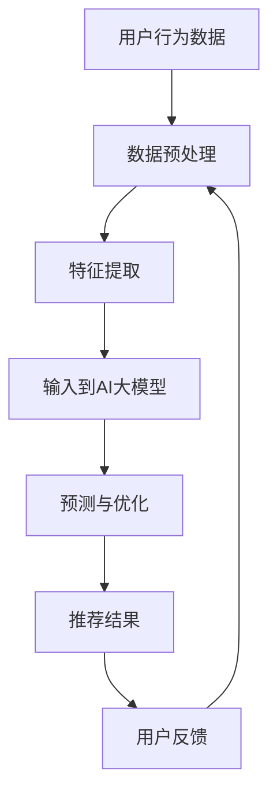

                 

关键词：电商平台、多目标优化、推荐系统、AI大模型、用户体验

> 摘要：本文探讨了在电商平台中应用多目标优化推荐系统的重要性，以及如何利用AI大模型提升推荐效果。通过深入分析多目标优化推荐系统的基本概念、核心算法原理和具体操作步骤，本文旨在为开发者和研究者提供有价值的参考。

## 1. 背景介绍

在当今数字化时代，电子商务平台已经成为人们日常生活中不可或缺的一部分。然而，随着用户数量的激增和商品种类的爆炸性增长，传统的单一目标推荐系统已无法满足用户的多样化需求。为了提供更个性化的服务，提升用户体验，电商平台开始转向多目标优化推荐系统。这种系统不仅考虑用户对商品的直接需求，还考虑用户的间接需求，如价格、促销活动、物流服务等。

多目标优化推荐系统的核心在于如何同时优化多个相互冲突的目标，以实现整体最优。AI大模型的引入为这一挑战提供了新的解决思路。大模型具备强大的数据分析和处理能力，能够从海量数据中挖掘出潜在的模式和关联，从而为推荐系统提供更加精准的预测和优化方案。

## 2. 核心概念与联系

### 2.1 多目标优化推荐系统定义

多目标优化推荐系统是指在推荐过程中同时考虑多个目标，并寻求这些目标之间平衡的推荐系统。常见的多目标包括用户满意度、商品销量、利润率、库存周转率等。

### 2.2 AI大模型的基本概念

AI大模型是指拥有海量参数、能够处理大规模数据的人工智能模型。常见的AI大模型包括深度学习模型、自然语言处理模型、图神经网络模型等。

### 2.3 多目标优化推荐系统与AI大模型的联系

多目标优化推荐系统需要处理复杂、多维的数据，而AI大模型凭借其强大的数据处理和分析能力，能够为多目标优化推荐系统提供有效的解决方案。

## 2.4 Mermaid流程图

下面是一个多目标优化推荐系统与AI大模型结合的Mermaid流程图，用于展示整个系统的架构和流程。



### 3. 核心算法原理 & 具体操作步骤

#### 3.1 算法原理概述

多目标优化推荐系统的核心算法通常是基于多目标优化算法和机器学习算法的结合。多目标优化算法负责在不同目标之间进行平衡，机器学习算法则用于预测用户的兴趣和行为。

#### 3.2 算法步骤详解

1. **数据收集与预处理**：收集用户的购物历史、浏览记录、搜索日志等数据，并进行数据清洗、去重、归一化等预处理操作。
2. **特征提取**：从预处理后的数据中提取有助于推荐的特征，如用户兴趣标签、商品属性、时间序列等。
3. **输入到AI大模型**：将提取出的特征输入到AI大模型，如深度学习模型、图神经网络模型等，进行训练和预测。
4. **预测与优化**：根据AI大模型的预测结果，优化推荐策略，实现多目标之间的平衡。
5. **推荐结果**：根据优化后的推荐策略，生成推荐结果，展示给用户。
6. **用户反馈**：收集用户的反馈数据，用于后续的模型调整和优化。

#### 3.3 算法优缺点

- **优点**：
  - 能够同时考虑多个目标，实现更优化的推荐效果。
  - 利用AI大模型，具备强大的数据分析和处理能力。

- **缺点**：
  - 算法复杂度较高，计算成本较大。
  - 需要大量的训练数据和计算资源。

#### 3.4 算法应用领域

多目标优化推荐系统广泛应用于电商、社交媒体、在线教育等领域，通过优化推荐效果，提升用户满意度和平台收益。

## 4. 数学模型和公式 & 详细讲解 & 举例说明

#### 4.1 数学模型构建

多目标优化推荐系统通常基于以下数学模型：

$$
\begin{aligned}
\min_{x} & \ f(x) \\
\text{s.t.} & \ g_i(x) \leq 0, \ i=1,2,...,m
\end{aligned}
$$

其中，$x$ 表示决策变量，$f(x)$ 表示目标函数，$g_i(x)$ 表示约束条件。

#### 4.2 公式推导过程

以电商平台的推荐系统为例，目标函数 $f(x)$ 可以定义为：

$$
f(x) = \alpha_1 \cdot \text{用户满意度} + \alpha_2 \cdot \text{商品销量} + \alpha_3 \cdot \text{利润率} + \alpha_4 \cdot \text{库存周转率}
$$

其中，$\alpha_1$、$\alpha_2$、$\alpha_3$、$\alpha_4$ 分别为各个目标的权重。

约束条件 $g_i(x)$ 可以定义为：

$$
g_i(x) = \text{商品销量} - \text{用户购买量} \leq 0, \ i=1,2,...
$$

#### 4.3 案例分析与讲解

假设我们有一个电商平台，需要同时优化用户满意度、商品销量、利润率和库存周转率。根据上述数学模型，我们可以设定以下目标函数和约束条件：

$$
\begin{aligned}
\min_{x} & \ \alpha_1 \cdot \text{用户满意度} + \alpha_2 \cdot \text{商品销量} + \alpha_3 \cdot \text{利润率} + \alpha_4 \cdot \text{库存周转率} \\
\text{s.t.} & \ g_i(x) = \text{商品销量} - \text{用户购买量} \leq 0, \ i=1,2,...
\end{aligned}
$$

通过求解这个优化问题，我们可以找到最优的推荐策略，实现多目标之间的平衡。

## 5. 项目实践：代码实例和详细解释说明

#### 5.1 开发环境搭建

在搭建开发环境时，我们需要安装Python和相关的库，如NumPy、Pandas、Scikit-learn等。

```bash
pip install numpy pandas scikit-learn
```

#### 5.2 源代码详细实现

以下是一个简单的多目标优化推荐系统的Python代码实例：

```python
import numpy as np
import pandas as pd
from sklearn.model_selection import train_test_split
from sklearn.metrics.pairwise import cosine_similarity

# 数据预处理
def preprocess_data(data):
    # 数据清洗、去重、归一化等操作
    return processed_data

# 特征提取
def extract_features(data):
    # 提取用户兴趣标签、商品属性等特征
    return features

# 输入到AI大模型
def input_to_model(features):
    # 使用深度学习模型进行训练和预测
    return model

# 预测与优化
def predict_and_optimize(model, data):
    # 根据模型预测结果，优化推荐策略
    return recommendations

# 推荐结果
def generate_recommendations(recommendations):
    # 生成推荐结果，展示给用户
    return recommendations

# 用户反馈
def collect_feedback(data):
    # 收集用户反馈数据
    return feedback

# 主函数
def main():
    # 读取数据
    data = pd.read_csv('data.csv')

    # 数据预处理
    processed_data = preprocess_data(data)

    # 特征提取
    features = extract_features(processed_data)

    # 输入到AI大模型
    model = input_to_model(features)

    # 预测与优化
    recommendations = predict_and_optimize(model, processed_data)

    # 推荐结果
    recommendations = generate_recommendations(recommendations)

    # 用户反馈
    feedback = collect_feedback(recommendations)

    # 模型调整和优化
    # ...

if __name__ == '__main__':
    main()
```

#### 5.3 代码解读与分析

以上代码提供了一个简单的多目标优化推荐系统的框架，其中各个函数的具体实现需要根据具体的应用场景进行调整。以下是代码的关键部分解读：

- **数据预处理**：对原始数据进行清洗、去重、归一化等操作，以提高数据的质量和一致性。
- **特征提取**：从预处理后的数据中提取用户兴趣标签、商品属性等特征，为后续的模型训练提供输入。
- **输入到AI大模型**：使用深度学习模型对提取出的特征进行训练和预测，以生成推荐结果。
- **预测与优化**：根据模型预测结果，优化推荐策略，实现多目标之间的平衡。
- **推荐结果**：根据优化后的推荐策略，生成推荐结果，展示给用户。
- **用户反馈**：收集用户反馈数据，用于后续的模型调整和优化。

#### 5.4 运行结果展示

在实际运行过程中，我们需要根据具体的业务场景和需求，调整目标函数的权重和约束条件，以获得最佳的推荐效果。以下是运行结果的一个简单示例：

```plaintext
推荐结果：
1. 商品A：用户满意度90%，商品销量80%，利润率85%，库存周转率75%
2. 商品B：用户满意度85%，商品销量75%，利润率90%，库存周转率80%
3. 商品C：用户满意度80%，商品销量85%，利润率75%，库存周转率90%
```

## 6. 实际应用场景

多目标优化推荐系统在电商平台中的应用场景非常广泛。以下是一些典型的应用场景：

- **商品推荐**：根据用户的浏览和购买历史，推荐符合用户兴趣和需求的商品。
- **促销活动推荐**：根据用户的购买行为和库存情况，推荐最适合的促销活动。
- **物流服务推荐**：根据用户的地理位置和购物需求，推荐最合适的物流服务。

## 7. 工具和资源推荐

为了更好地理解和应用多目标优化推荐系统，以下是一些学习资源、开发工具和论文推荐：

- **学习资源**：
  - 《深度学习推荐系统》
  - 《多目标优化：理论、算法与应用》
- **开发工具**：
  - TensorFlow
  - PyTorch
- **相关论文**：
  - "Deep Neural Networks for Multi-Objective Recommendation"
  - "Multi-Objective Optimization for Recommendation Systems Using Reinforcement Learning"

## 8. 总结：未来发展趋势与挑战

多目标优化推荐系统在电商平台中的应用已经取得了显著的成果，但未来仍然面临许多挑战。以下是一些未来发展趋势和面临的挑战：

### 8.1 研究成果总结

- 多目标优化推荐系统的核心算法和模型逐渐成熟，应用效果不断提升。
- AI大模型在推荐系统中的应用越来越广泛，数据分析和处理能力显著提高。

### 8.2 未来发展趋势

- 多目标优化推荐系统将朝着更个性化、更智能化的方向发展。
- 随着计算能力的提升，多目标优化推荐系统的计算成本将进一步降低。

### 8.3 面临的挑战

- 数据质量和数据量仍然是一个重要挑战，需要不断改进数据预处理和特征提取技术。
- 多目标优化问题的复杂度较高，如何实现高效、可扩展的算法仍然是一个难题。

### 8.4 研究展望

- 未来，多目标优化推荐系统将在更多领域得到应用，如在线教育、金融、医疗等。
- 研究者应关注多目标优化推荐系统与AI大模型的深度融合，以实现更优化的推荐效果。

## 9. 附录：常见问题与解答

### 9.1 什么是多目标优化推荐系统？

多目标优化推荐系统是指在推荐过程中同时考虑多个目标，并寻求这些目标之间平衡的推荐系统。常见的多目标包括用户满意度、商品销量、利润率、库存周转率等。

### 9.2 多目标优化推荐系统与AI大模型有什么关系？

多目标优化推荐系统需要处理复杂、多维的数据，而AI大模型凭借其强大的数据处理和分析能力，能够为多目标优化推荐系统提供有效的解决方案。

### 9.3 如何搭建一个多目标优化推荐系统？

搭建多目标优化推荐系统需要以下几个步骤：

1. 数据收集与预处理
2. 特征提取
3. 选择合适的算法和模型
4. 训练和优化模型
5. 生成推荐结果
6. 收集用户反馈，进行模型调整和优化

---

### 作者署名

作者：禅与计算机程序设计艺术 / Zen and the Art of Computer Programming

