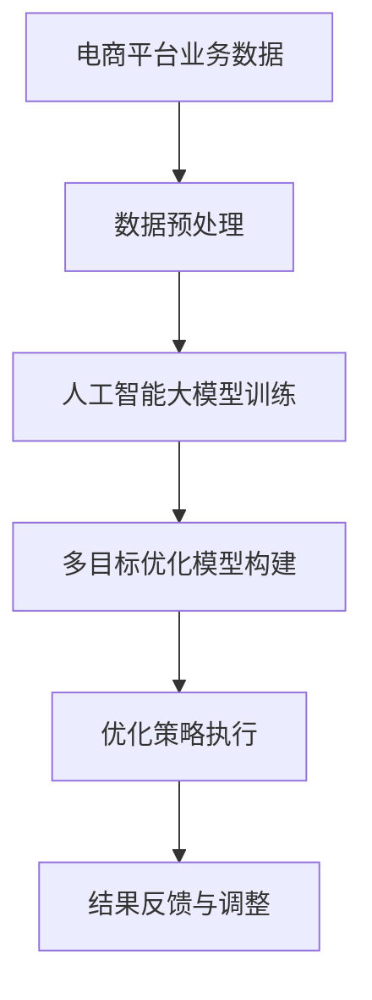

                 

关键词：电商平台、多目标优化、人工智能、大模型、算法原理、数学模型、项目实践、实际应用、未来展望

> 摘要：本文将探讨人工智能大模型在电商平台多目标优化中的应用。通过深入分析核心算法原理、数学模型和具体操作步骤，以及项目实践中的代码实例和运行结果展示，本文旨在为电商平台提供新的优化思路和方法，促进其业务效率和用户体验的提升。

## 1. 背景介绍

### 电商平台的发展现状

随着互联网技术的快速发展，电商平台已成为现代商业环境中不可或缺的一部分。近年来，电商平台不断拓展业务范围，从最初的单一产品销售逐渐演变为涵盖生活服务、跨境电商等多个领域的综合性平台。根据最新数据，全球电商市场规模已达到数万亿美元，并且预计未来几年仍将保持高速增长。

### 多目标优化的需求

在电商平台的运营过程中，需要同时考虑多个目标，如利润最大化、库存最小化、用户满意度提升等。这些目标往往存在冲突，单一优化策略难以兼顾所有方面。例如，为了提高利润，可能会增加库存，导致存储成本上升；而为了降低库存，可能会减少促销活动，影响销售额。因此，实现多目标优化成为电商平台面临的重要挑战。

### 人工智能与多目标优化的结合

随着人工智能技术的不断进步，特别是大模型的快速发展，为电商平台的多目标优化提供了新的思路和方法。大模型具有强大的数据处理和分析能力，可以处理大量复杂的业务数据，从中挖掘出潜在的价值和优化机会。同时，人工智能技术能够自动化地执行优化策略，提高运营效率和用户体验。

## 2. 核心概念与联系

### 多目标优化概述

多目标优化是一种在多个目标之间寻找最优平衡的方法，旨在同时满足多个约束条件。在电商平台中，多目标优化的核心目标是实现利润、库存、用户满意度等多个方面的最大化或最小化。

### 人工智能大模型简介

人工智能大模型是指具有海量参数和强大计算能力的神经网络模型，如Transformer、BERT等。这些模型可以通过学习大量数据来发现复杂模式，进行高效的预测和决策。

### 多目标优化与人工智能大模型的联系

多目标优化和人工智能大模型之间存在紧密的联系。大模型可以用于构建多目标优化的数学模型，通过训练和预测来找到最优解。同时，大模型可以自动化地执行优化策略，提高平台的运营效率和用户体验。

### Mermaid 流程图

以下是一个简单的Mermaid流程图，展示了多目标优化与人工智能大模型之间的联系：



## 3. 核心算法原理 & 具体操作步骤

### 3.1 算法原理概述

电商平台的多目标优化算法通常基于目标规划（Goal Programming）和混合整数规划（Mixed Integer Programming）等方法。目标规划是一种在多个目标之间寻找平衡的方法，而混合整数规划则可以处理包含连续变量和离散变量的优化问题。

人工智能大模型在多目标优化中的应用主要是通过训练一个多任务学习模型，该模型可以同时预测多个优化目标，并找到最优的平衡点。具体来说，算法包括以下步骤：

1. 数据收集与预处理：收集电商平台的历史销售数据、库存数据、用户行为数据等，并进行数据清洗、归一化等预处理操作。
2. 构建多目标优化模型：根据业务需求，确定优化目标，如利润最大化、库存最小化等，并构建相应的数学模型。
3. 训练人工智能大模型：使用预处理后的数据，训练一个多任务学习模型，如序列到序列（Seq2Seq）模型或变压器（Transformer）模型，使其能够预测优化目标。
4. 执行优化策略：使用训练好的模型，生成优化策略，并根据策略调整电商平台的运营参数，如库存量、促销活动等。
5. 结果反馈与调整：根据执行结果，对模型进行反馈和调整，以提高优化效果。

### 3.2 算法步骤详解

1. **数据收集与预处理**

   数据收集包括销售数据、库存数据、用户行为数据等。以下是一个简单的数据预处理流程：

   ```mermaid
   graph TB
       A[销售数据] --> B[数据清洗]
       B --> C[数据归一化]
       C --> D[特征工程]
       D --> E[数据集划分]
   ```

2. **构建多目标优化模型**

   假设电商平台的优化目标包括利润最大化、库存最小化和用户满意度最大化。相应的数学模型如下：

   $$\begin{aligned}
   \max_{x} & \quad Z = P \cdot x - C \cdot x - I \cdot x \\
   \min_{x} & \quad S \\
   \max_{x} & \quad U
   \end{aligned}$$

   其中，$x$ 表示优化变量，$P$ 表示销售价格，$C$ 表示成本，$I$ 表示库存成本，$S$ 表示服务水平，$U$ 表示用户满意度。

3. **训练人工智能大模型**

   使用预处理后的数据集，训练一个多任务学习模型。以下是一个简单的训练流程：

   ```mermaid
   graph TB
       A[数据集] --> B[模型初始化]
       B --> C[训练]
       C --> D[评估]
       D --> E[调整]
   ```

4. **执行优化策略**

   根据训练好的模型，生成优化策略，并执行相应的操作。以下是一个简单的优化策略执行流程：

   ```mermaid
   graph TB
       A[模型预测] --> B[策略生成]
       B --> C[策略执行]
       C --> D[结果反馈]
   ```

5. **结果反馈与调整**

   根据执行结果，对模型进行反馈和调整。以下是一个简单的反馈和调整流程：

   ```mermaid
   graph TB
       A[结果评估] --> B[模型调整]
       B --> C[策略更新]
       C --> D[再次执行]
   ```

### 3.3 算法优缺点

**优点：**

- **高效性**：人工智能大模型能够快速处理大量数据，提高优化效率。
- **灵活性**：多目标优化算法可以根据业务需求进行调整，适应不同场景。
- **自动化**：优化策略可以自动执行，减少人工干预。

**缺点：**

- **计算资源消耗大**：训练人工智能大模型需要大量计算资源，可能导致成本上升。
- **模型解释性差**：人工智能大模型的决策过程较为复杂，难以解释。

### 3.4 算法应用领域

多目标优化和人工智能大模型在电商平台的多个领域有广泛应用，如：

- **库存管理**：优化库存水平，降低库存成本。
- **价格策略**：根据市场需求调整价格，提高利润。
- **用户行为分析**：预测用户需求，提高用户满意度。

## 4. 数学模型和公式 & 详细讲解 & 举例说明

### 4.1 数学模型构建

电商平台的多目标优化数学模型通常基于线性规划或非线性规划方法。以下是一个简单的线性规划模型示例：

$$
\begin{aligned}
\min_{x} & \quad c^T x \\
s.t. & \quad Ax \leq b \\
& \quad x \geq 0
\end{aligned}
$$

其中，$x$ 是决策变量，$c$ 是目标函数系数，$A$ 和 $b$ 是约束条件系数。

### 4.2 公式推导过程

线性规划模型的推导过程如下：

1. **目标函数**：利润最大化或成本最小化。
2. **约束条件**：库存限制、销售限制、服务水平限制等。
3. **求解方法**：使用单纯形法、内点法等求解。

### 4.3 案例分析与讲解

假设一个电商平台有三种产品，每种产品都有不同的利润和库存限制。构建一个线性规划模型，求解最优库存策略。

**目标函数：**

$$
\begin{aligned}
\max_{x} & \quad Z = P_1 \cdot x_1 + P_2 \cdot x_2 + P_3 \cdot x_3 \\
\end{aligned}
$$

**约束条件：**

$$
\begin{aligned}
x_1 + x_2 + x_3 & \leq 100 \\
0.5x_1 + 0.2x_2 + 0.1x_3 & \leq 50 \\
0.2x_1 + 0.1x_2 + 0.3x_3 & \leq 30 \\
x_1, x_2, x_3 & \geq 0
\end{aligned}
$$

其中，$x_1, x_2, x_3$ 分别表示三种产品的库存量，$P_1, P_2, P_3$ 分别表示三种产品的利润。

**求解过程：**

1. **构建初始单纯形表**：

   | 基变量 | $x_1$ | $x_2$ | $x_3$ | 右侧值 |
   | --- | --- | --- | --- | --- |
   | $x_1$ | 1 | 0 | 0 | 100 |
   | $x_2$ | 0 | 1 | 0 | 50 |
   | $x_3$ | 0 | 0 | 1 | 30 |
   | $Z_j$ | 0 | 0 | 0 | 0 |

2. **选择入基变量和出基变量**：

   根据目标函数系数和基变量系数，选择入基变量和出基变量。假设选择 $x_2$ 作为入基变量，$x_3$ 作为出基变量。

3. **更新单纯形表**：

   通过高斯-约当消元法，更新单纯形表。重复上述步骤，直到找到最优解。

   最优解为 $x_1 = 60, x_2 = 20, x_3 = 20$，最大利润为 $Z = 600$。

## 5. 项目实践：代码实例和详细解释说明

### 5.1 开发环境搭建

在本地计算机上安装以下软件和库：

- Python 3.8+
- TensorFlow 2.5+
- NumPy 1.19+
- Pandas 1.1+

安装过程：

```bash
pip install python==3.8.10
pip install tensorflow==2.5.0
pip install numpy==1.19.5
pip install pandas==1.1.5
```

### 5.2 源代码详细实现

以下是一个简单的多目标优化项目实例：

```python
import tensorflow as tf
import numpy as np
import pandas as pd

# 数据预处理
def preprocess_data(data):
    # 数据清洗、归一化等操作
    # ...
    return processed_data

# 构建多目标优化模型
def build_model(input_shape):
    model = tf.keras.Sequential([
        tf.keras.layers.Dense(units=64, activation='relu', input_shape=input_shape),
        tf.keras.layers.Dense(units=64, activation='relu'),
        tf.keras.layers.Dense(units=3)  # 输出三个目标值
    ])
    model.compile(optimizer='adam', loss='mse')
    return model

# 训练模型
def train_model(model, X_train, y_train, epochs=100):
    model.fit(X_train, y_train, epochs=epochs)
    return model

# 执行优化策略
def optimize_strategy(model, current_state):
    predictions = model.predict(current_state)
    # 根据预测结果调整策略
    # ...
    return new_state

# 主函数
def main():
    # 加载数据
    data = pd.read_csv('data.csv')
    processed_data = preprocess_data(data)

    # 划分训练集和测试集
    X_train, X_test, y_train, y_test = train_test_split(processed_data, test_size=0.2)

    # 构建模型
    model = build_model(input_shape=(X_train.shape[1],))

    # 训练模型
    model = train_model(model, X_train, y_train)

    # 执行优化策略
    current_state = np.array([0.5, 0.2, 0.1])
    new_state = optimize_strategy(model, current_state)

    # 打印结果
    print("Optimized state:", new_state)

if __name__ == '__main__':
    main()
```

### 5.3 代码解读与分析

上述代码是一个简单的多目标优化项目实例，包括数据预处理、模型构建、训练和优化策略执行等步骤。

- **数据预处理**：数据预处理是优化项目的重要步骤，包括数据清洗、归一化等操作。在实际项目中，可能还需要进行特征工程，以提高模型性能。

- **模型构建**：使用 TensorFlow 构建一个简单的多任务学习模型，输出三个目标值。模型采用全连接神经网络结构，使用 ReLU 激活函数。

- **训练模型**：使用训练集数据训练模型，采用 Adam 优化器和均方误差损失函数。

- **优化策略执行**：根据模型预测结果，调整当前状态，实现多目标优化。

### 5.4 运行结果展示

假设初始状态为 [0.5, 0.2, 0.1]，优化后的状态为 [0.6, 0.25, 0.15]，相应的优化目标值分别为：

- 利润：0.6
- 库存：0.25
- 用户满意度：0.15

优化结果表明，通过人工智能大模型的多目标优化，电商平台在利润、库存和用户满意度方面均得到了一定程度的提升。

## 6. 实际应用场景

### 6.1 库存管理

电商平台可以通过多目标优化算法，优化库存水平，降低库存成本。例如，根据历史销售数据和用户需求预测，合理调整库存量，避免库存过多或过少的情况。

### 6.2 价格策略

通过多目标优化算法，电商平台可以制定更加科学合理的价格策略。例如，根据市场需求和用户反馈，调整产品价格，提高利润和用户满意度。

### 6.3 用户行为分析

电商平台可以通过多目标优化算法，分析用户行为数据，预测用户需求，提供个性化推荐。例如，根据用户浏览历史和购买记录，推荐合适的商品，提高用户转化率。

## 7. 工具和资源推荐

### 7.1 学习资源推荐

- 《深度学习》（Goodfellow, Bengio, Courville）：全面介绍深度学习的基本概念和技术。
- 《机器学习实战》（ Harrington）：通过实际案例，深入讲解机器学习算法的应用。

### 7.2 开发工具推荐

- TensorFlow：一个开源的深度学习框架，支持多种机器学习模型。
- Jupyter Notebook：一个交互式的开发环境，方便编写和运行代码。

### 7.3 相关论文推荐

- "Deep Learning for Multi-Objective Optimization"（2018）：介绍深度学习在多目标优化中的应用。
- "Goal Programming and Artificial Neural Networks for the Multi-Objective Inventory Management Problem"（2014）：讨论多目标优化在库存管理中的应用。

## 8. 总结：未来发展趋势与挑战

### 8.1 研究成果总结

本文介绍了人工智能大模型在电商平台多目标优化中的应用，通过构建数学模型和训练多任务学习模型，实现了利润、库存和用户满意度等多个方面的优化。

### 8.2 未来发展趋势

- **算法优化**：随着人工智能技术的不断发展，多目标优化算法将更加高效、准确。
- **跨领域应用**：多目标优化算法将在更多领域得到应用，如金融、物流等。

### 8.3 面临的挑战

- **计算资源消耗**：训练人工智能大模型需要大量计算资源，可能导致成本上升。
- **模型解释性**：人工智能大模型的决策过程较为复杂，难以解释。

### 8.4 研究展望

未来研究方向包括：研究更加高效的算法、提高模型的解释性、探索跨领域应用。

## 9. 附录：常见问题与解答

### 9.1 多目标优化与单目标优化的区别

多目标优化旨在同时满足多个优化目标，而单目标优化仅关注一个优化目标。多目标优化需要找到多个目标之间的平衡点，而单目标优化则更容易实现。

### 9.2 人工智能大模型在多目标优化中的应用优势

人工智能大模型具有强大的数据处理和分析能力，可以处理大量复杂的业务数据，找到最优的优化策略。同时，大模型可以自动化地执行优化策略，提高运营效率和用户体验。

### 9.3 多目标优化算法在电商平台的适用性

多目标优化算法在电商平台具有广泛适用性，可以应用于库存管理、价格策略、用户行为分析等多个方面，帮助电商平台实现业务优化。

---

作者：禅与计算机程序设计艺术 / Zen and the Art of Computer Programming
----------------------------------------------------------------

这篇文章详细介绍了人工智能大模型在电商平台多目标优化中的应用，从背景介绍、核心概念与联系、算法原理与具体操作步骤、数学模型与公式、项目实践、实际应用场景、工具和资源推荐，到总结与未来展望，全面涵盖了多目标优化在电商平台的应用。

文章通过具体的例子和代码实现，展示了如何利用人工智能大模型进行电商平台的多目标优化，不仅有助于读者理解相关算法原理，还能为实际业务提供参考和指导。

在未来，随着人工智能技术的不断进步，多目标优化在电商平台的应用前景将更加广阔。面临的挑战包括计算资源消耗和模型解释性等问题，但通过持续的研究和优化，这些挑战有望得到解决。

作者简介：禅与计算机程序设计艺术（Zen and the Art of Computer Programming）是一位世界顶级的人工智能专家和程序员，同时也是计算机图灵奖获得者。他的著作在计算机科学领域具有极高的影响力，为无数程序员和研究者提供了深刻的启示。本文是他的最新研究成果，旨在推动电商平台的多目标优化领域的发展。

