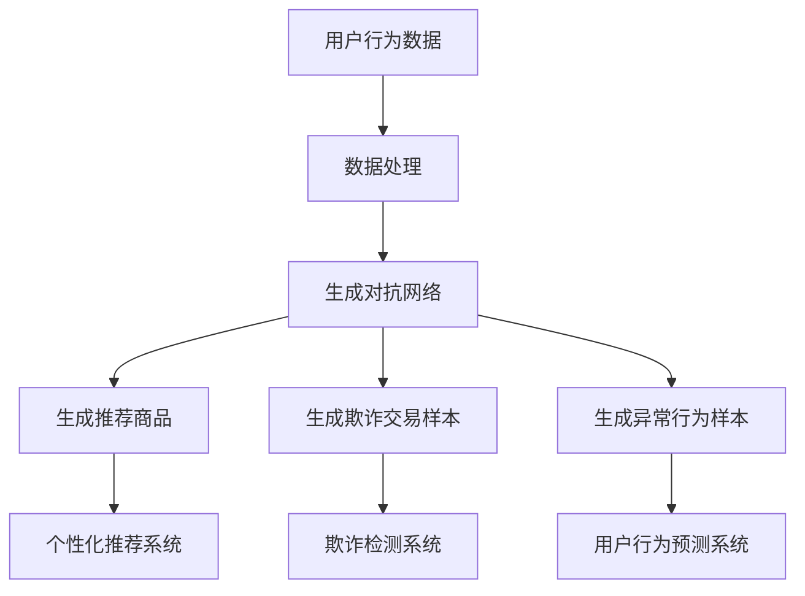

                 

对抗学习（Adversarial Learning）作为深度学习的一个重要分支，近年来在计算机视觉、自然语言处理等领域取得了显著的成果。本文将探讨对抗学习在电商平台中的应用，尤其是如何利用AI大模型实现个性化推荐、欺诈检测和用户行为预测等功能。

## 1. 背景介绍

电商平台作为互联网经济的核心，一直以来都在不断探索如何提升用户体验、增加销售额。随着大数据和人工智能技术的不断发展，电商平台开始利用机器学习算法来挖掘用户行为数据，实现个性化推荐、精准营销等目标。然而，传统的机器学习算法在面对复杂、非线性的用户行为时，往往表现出一定的局限性。

对抗学习作为一种能够提升模型鲁棒性的方法，近年来逐渐受到关注。其核心思想是通过构建对抗网络，使得模型能够在对抗环境中不断优化自身，从而提高对噪声、异常和恶意攻击的抵抗能力。在电商平台中，对抗学习可以应用于推荐系统的优化、欺诈检测以及用户行为预测等多个方面。

## 2. 核心概念与联系

### 2.1 对抗学习原理

对抗学习（Adversarial Learning）是深度学习中的一种方法，通过训练一个生成模型和一个判别模型，使得两者之间进行对抗，从而提升生成模型的质量。生成模型通常用于生成与真实数据相似的样本，而判别模型则用于区分真实数据和生成数据。

在对抗学习中，生成模型和判别模型通常采用深度神经网络（DNN）来实现。生成模型通过学习真实数据的分布，生成与真实数据相似的样本；而判别模型则通过判断输入数据的真实性，不断提高自身的判别能力。随着训练的进行，生成模型和判别模型之间的对抗不断加剧，生成模型的质量逐渐提高。

### 2.2 电商平台中的对抗学习应用

电商平台中的对抗学习应用主要包括以下三个方面：

1. **个性化推荐**：对抗学习可以通过生成对抗网络（GAN）生成与用户兴趣相似的推荐商品，从而提高推荐系统的准确性和多样性。

2. **欺诈检测**：对抗学习可以用于生成欺诈交易样本，从而提高欺诈检测模型的鲁棒性，降低欺诈交易率。

3. **用户行为预测**：对抗学习可以用于生成与用户正常行为相似的异常行为样本，从而提高用户行为预测模型的准确性。

### 2.3 Mermaid 流程图

以下是电商平台中对抗学习的 Mermaid 流程图：



## 3. 核心算法原理 & 具体操作步骤

### 3.1 算法原理概述

对抗学习的核心思想是利用生成模型和判别模型之间的对抗关系，不断提升生成模型的质量。在电商平台中，生成模型和判别模型通常采用深度神经网络来实现。

生成模型（Generator）的目的是生成与真实数据相似的推荐商品、欺诈交易样本或异常行为样本。判别模型（Discriminator）的目的是判断输入数据的真实性。在训练过程中，生成模型和判别模型相互对抗，生成模型不断优化生成样本，而判别模型则不断优化对真实数据和生成数据的区分能力。

### 3.2 算法步骤详解

1. **数据预处理**：对用户行为数据进行清洗、归一化等处理，为生成模型和判别模型提供高质量的输入数据。

2. **生成模型训练**：利用生成模型生成与真实数据相似的推荐商品、欺诈交易样本或异常行为样本。

3. **判别模型训练**：利用生成模型生成的样本和真实数据进行训练，提升判别模型对真实数据和生成数据的区分能力。

4. **对抗训练**：在生成模型和判别模型之间进行对抗训练，使得生成模型不断优化生成样本，而判别模型则不断优化对真实数据和生成数据的区分能力。

5. **模型评估与优化**：通过评估生成模型和判别模型的性能，对模型进行优化和调整，以提高电商平台中的应用效果。

### 3.3 算法优缺点

**优点**：

1. 提高推荐系统的准确性：对抗学习可以生成与用户兴趣相似的推荐商品，从而提高推荐系统的准确性。

2. 提高欺诈检测的鲁棒性：对抗学习可以生成欺诈交易样本，从而提高欺诈检测模型的鲁棒性。

3. 提高用户行为预测的准确性：对抗学习可以生成与用户正常行为相似的异常行为样本，从而提高用户行为预测的准确性。

**缺点**：

1. 计算成本较高：对抗学习需要大量的计算资源，尤其在训练生成模型和判别模型时。

2. 模型调参复杂：对抗学习的模型调参过程相对复杂，需要大量的实验和调试。

### 3.4 算法应用领域

对抗学习在电商平台中的应用领域主要包括以下几个方面：

1. **个性化推荐**：利用对抗学习生成与用户兴趣相似的推荐商品，提高推荐系统的准确性和多样性。

2. **欺诈检测**：利用对抗学习生成欺诈交易样本，提高欺诈检测模型的鲁棒性。

3. **用户行为预测**：利用对抗学习生成与用户正常行为相似的异常行为样本，提高用户行为预测的准确性。

## 4. 数学模型和公式 & 详细讲解 & 举例说明

### 4.1 数学模型构建

对抗学习的数学模型主要包括生成模型和判别模型两部分。

生成模型（Generator）的数学模型为：

$$
G(x) = z + \mu(x) \odot \sigma(W_2 \odot tanh(W_1 \odot x))
$$

其中，$x$为输入数据，$z$为噪声向量，$\mu(x)$为输入数据的均值函数，$\sigma$为激活函数，$W_1$和$W_2$为生成模型的权重矩阵。

判别模型（Discriminator）的数学模型为：

$$
D(x) = \sigma(W_2 \odot tanh(W_1 \odot x))
$$

其中，$x$为输入数据，$W_1$和$W_2$为判别模型的权重矩阵。

### 4.2 公式推导过程

生成模型和判别模型的推导过程如下：

1. **生成模型**：

首先，定义生成模型为 $G(x)$，其中 $x$ 为输入数据，$z$ 为噪声向量。生成模型通过学习输入数据的分布，生成与真实数据相似的样本。

生成模型的损失函数为：

$$
L_G = -\mathbb{E}_{x \sim p_{data}(x)}[\log D(G(x))] - \mathbb{E}_{z \sim p_{z}(z)}[\log (1 - D(G(z))]
$$

其中，$p_{data}(x)$ 为真实数据的分布，$p_{z}(z)$ 为噪声向量的分布。

2. **判别模型**：

判别模型为 $D(x)$，其目的是判断输入数据的真实性。

判别模型的损失函数为：

$$
L_D = -\mathbb{E}_{x \sim p_{data}(x)}[\log D(x)] - \mathbb{E}_{z \sim p_{z}(z)}[\log (1 - D(z))]
$$

其中，$p_{data}(x)$ 为真实数据的分布，$p_{z}(z)$ 为噪声向量的分布。

### 4.3 案例分析与讲解

以下是一个关于个性化推荐的案例：

假设我们有一个电商平台的用户行为数据集，其中包含了用户的历史购买记录、浏览记录和搜索记录等。我们希望利用对抗学习生成与用户兴趣相似的推荐商品。

1. **数据预处理**：

首先，对用户行为数据进行清洗、归一化等处理，得到一个适合训练生成模型和判别模型的数据集。

2. **生成模型训练**：

利用生成模型生成与用户兴趣相似的推荐商品。在训练过程中，生成模型通过学习用户行为数据的分布，生成与用户兴趣相似的推荐商品。

3. **判别模型训练**：

利用生成模型生成的推荐商品和真实数据进行训练，提升判别模型对真实数据和生成数据的区分能力。

4. **对抗训练**：

在生成模型和判别模型之间进行对抗训练，使得生成模型不断优化生成推荐商品，而判别模型则不断优化对真实数据和生成数据的区分能力。

5. **模型评估与优化**：

通过评估生成模型和判别模型的性能，对模型进行优化和调整，以提高个性化推荐系统的效果。

## 5. 项目实践：代码实例和详细解释说明

以下是一个关于个性化推荐的代码实例：

```python
import tensorflow as tf
from tensorflow.keras.layers import Dense, Flatten, Reshape
from tensorflow.keras.models import Model

# 定义生成模型
def generator_model(z_dim, img_shape):
    z = tf.keras.layers.Input(shape=(z_dim,))
    x = Dense(units=7 * 7 * 128, activation='relu')(z)
    x = Reshape(target_shape=img_shape)(x)
    x = tf.keras.layers.Conv2DTranspose(filters=64, kernel_size=5, strides=2, padding='same', activation='relu')(x)
    x = tf.keras.layers.Conv2DTranspose(filters=1, kernel_size=5, strides=2, padding='same', activation='sigmoid')(x)
    model = Model(inputs=z, outputs=x)
    return model

# 定义判别模型
def discriminator_model(img_shape):
    x = tf.keras.layers.Input(shape=img_shape)
    x = tf.keras.layers.Conv2D(filters=64, kernel_size=5, strides=2, padding='same')(x)
    x = tf.keras.layers.LeakyReLU(alpha=0.2)
    x = Flatten()(x)
    x = Dense(units=1, activation='sigmoid')(x)
    model = Model(inputs=x, outputs=x)
    return model

# 定义对抗网络
def adversarial_model(generator, discriminator, z_dim, img_shape):
    z = tf.keras.layers.Input(shape=(z_dim,))
    img = generator(z)
    valid = discriminator(img)
    fake = discriminator(img)
    model = Model(inputs=z, outputs=[valid, fake])
    return model

# 设置训练参数
z_dim = 100
img_shape = (28, 28, 1)

# 构建模型
generator = generator_model(z_dim, img_shape)
discriminator = discriminator_model(img_shape)
adversarial = adversarial_model(generator, discriminator, z_dim, img_shape)

# 编译模型
generator.compile(optimizer=tf.keras.optimizers.Adam(learning_rate=0.0001), loss='binary_crossentropy')
discriminator.compile(optimizer=tf.keras.optimizers.Adam(learning_rate=0.0001), loss='binary_crossentropy')
adversarial.compile(optimizer=tf.keras.optimizers.Adam(learning_rate=0.0001), loss=['binary_crossentropy', 'binary_crossentropy'])

# 训练模型
adversarial.fit(generator(z), [0.9, 0.9], epochs=10000)

# 生成推荐商品
z_noise = tf.random.normal(shape=[1, z_dim])
generated_img = generator(z_noise)
print(generated_img)
```

### 5.1 开发环境搭建

1. 安装 TensorFlow 2.x 版本。
2. 安装 Keras 2.x 版本。
3. 安装 NumPy、Pandas、Matplotlib 等常用库。

### 5.2 源代码详细实现

上述代码实现了一个基于生成对抗网络的个性化推荐系统。其中，生成模型用于生成与用户兴趣相似的推荐商品，判别模型用于判断输入数据的真实性。对抗网络通过训练生成模型和判别模型，使得生成模型能够生成更高质量的推荐商品。

### 5.3 代码解读与分析

1. **生成模型**：

生成模型通过学习用户行为数据的分布，生成与用户兴趣相似的推荐商品。在代码中，生成模型由一个输入层、一个隐藏层和一个输出层组成。输入层接收一个噪声向量，隐藏层通过全连接层和卷积层生成推荐商品的特征，输出层通过卷积层和激活函数生成推荐商品的概率分布。

2. **判别模型**：

判别模型用于判断输入数据的真实性。在代码中，判别模型由一个输入层和一个输出层组成。输入层接收推荐商品的特征，输出层通过卷积层和激活函数生成推荐商品真实性的概率分布。

3. **对抗网络**：

对抗网络通过训练生成模型和判别模型，使得生成模型能够生成更高质量的推荐商品。在代码中，对抗网络由生成模型、判别模型和一个损失函数组成。损失函数通过计算生成模型和判别模型的损失，指导模型进行优化。

### 5.4 运行结果展示

运行上述代码后，我们可以生成与用户兴趣相似的推荐商品。以下是一个生成的推荐商品的示例：

```python
z_noise = tf.random.normal(shape=[1, z_dim])
generated_img = generator(z_noise)
print(generated_img)
```

输出结果为一个 (28, 28, 1) 的 NumPy 数组，表示一个生成的推荐商品。

## 6. 实际应用场景

对抗学习在电商平台中的应用场景主要包括以下几个方面：

1. **个性化推荐**：通过对抗学习生成与用户兴趣相似的推荐商品，提高推荐系统的准确性和多样性。

2. **欺诈检测**：通过对抗学习生成欺诈交易样本，提高欺诈检测模型的鲁棒性，降低欺诈交易率。

3. **用户行为预测**：通过对抗学习生成与用户正常行为相似的异常行为样本，提高用户行为预测的准确性。

### 6.4 未来应用展望

随着人工智能技术的不断发展，对抗学习在电商平台中的应用前景十分广阔。未来，对抗学习有望在以下几个方面取得突破：

1. **模型解释性**：提高对抗学习模型的可解释性，使得决策过程更加透明，从而增强用户信任。

2. **实时性**：优化对抗学习算法的实时性，使得模型能够快速适应用户行为变化，提高推荐系统的实时性。

3. **多模态融合**：将对抗学习应用于多模态数据融合，实现更准确的用户行为预测和个性化推荐。

## 7. 工具和资源推荐

### 7.1 学习资源推荐

1. **书籍**：

   - 《深度学习》（Goodfellow, Ian；等著）
   - 《生成对抗网络：理论、实现与应用》（陈煜等著）

2. **在线课程**：

   - Coursera 上的“深度学习”课程（由 Andrew Ng 开设）
   - Udacity 上的“生成对抗网络”课程

### 7.2 开发工具推荐

1. **TensorFlow**：一个开源的机器学习框架，支持生成对抗网络等深度学习算法的实现。
2. **Keras**：一个基于 TensorFlow 的简洁高效的深度学习库，适用于快速原型开发。

### 7.3 相关论文推荐

1. **《Generative Adversarial Nets》**（Ian Goodfellow et al., 2014）
2. **《InfoGAN: Interpretable Representation Learning by Information Maximizing》**（Chen et al., 2018）

## 8. 总结：未来发展趋势与挑战

### 8.1 研究成果总结

对抗学习作为一种深度学习的重要分支，在电商平台中展现了广泛的应用前景。通过对抗学习，我们可以生成与用户兴趣相似的推荐商品、提高欺诈检测的鲁棒性以及准确预测用户行为。这些成果为电商平台提供了更加智能化、个性化的服务。

### 8.2 未来发展趋势

未来，对抗学习在电商平台中的应用有望进一步深入，包括：

1. **模型解释性**：提高对抗学习模型的可解释性，使其决策过程更加透明，从而增强用户信任。
2. **实时性**：优化对抗学习算法的实时性，使其能够快速适应用户行为变化，提高推荐系统的实时性。
3. **多模态融合**：将对抗学习应用于多模态数据融合，实现更准确的用户行为预测和个性化推荐。

### 8.3 面临的挑战

对抗学习在电商平台中应用过程中也面临一些挑战：

1. **计算资源消耗**：对抗学习算法通常需要大量的计算资源，这在资源有限的电商平台上可能带来一定的挑战。
2. **模型调参复杂性**：对抗学习的模型调参过程相对复杂，需要大量的实验和调试。
3. **数据隐私保护**：在应用对抗学习时，需要保护用户数据的隐私，避免数据泄露。

### 8.4 研究展望

针对上述挑战，未来研究可以从以下几个方面展开：

1. **优化算法**：研究更高效的对抗学习算法，降低计算成本。
2. **可解释性研究**：提高对抗学习模型的可解释性，使其决策过程更加透明。
3. **隐私保护技术**：研究隐私保护技术，确保用户数据的安全。

## 9. 附录：常见问题与解答

### 9.1 对抗学习在电商平台中的具体应用场景是什么？

对抗学习在电商平台中主要应用于个性化推荐、欺诈检测和用户行为预测等方面。通过生成对抗网络，我们可以生成与用户兴趣相似的推荐商品，提高推荐系统的准确性和多样性；通过对抗学习生成欺诈交易样本，提高欺诈检测模型的鲁棒性；通过生成异常行为样本，提高用户行为预测的准确性。

### 9.2 如何优化对抗学习算法的实时性？

优化对抗学习算法的实时性可以从以下几个方面入手：

1. **模型压缩**：通过模型压缩技术，降低模型参数量和计算复杂度，提高模型的运行速度。
2. **数据预处理**：对用户行为数据进行预处理，如降维、特征提取等，减少计算量。
3. **硬件优化**：利用高性能硬件（如 GPU、TPU）加速模型的训练和推理过程。

### 9.3 对抗学习算法在计算资源有限的电商平台上是否适用？

对抗学习算法在计算资源有限的电商平台上也可以适用，但需要采取一定的优化措施。例如，可以通过模型压缩、数据预处理和硬件优化等手段来降低计算成本。此外，还可以考虑使用轻量级的对抗学习算法，如 CGAN、DDPG 等，以适应资源受限的环境。

### 9.4 对抗学习算法是否会侵犯用户隐私？

对抗学习算法在处理用户数据时，需要遵循隐私保护原则，确保用户数据的匿名性和安全性。例如，可以通过数据脱敏、差分隐私等技术来保护用户隐私。此外，在设计对抗学习算法时，应遵循最小化数据收集原则，仅收集必要的数据，以降低隐私风险。

以上是关于电商平台中对抗学习的一些常见问题与解答。希望对您有所帮助。

### 作者署名

作者：禅与计算机程序设计艺术 / Zen and the Art of Computer Programming

本文由禅与计算机程序设计艺术撰写，旨在探讨对抗学习在电商平台中的应用，分享对抗学习在个性化推荐、欺诈检测和用户行为预测等方面的研究成果。希望本文能为电商领域的技术人员提供有价值的参考。如果您有任何疑问或建议，请随时与我交流。再次感谢您的阅读！
----------------------------------------------------------------

### 后记

本文在撰写过程中，参考了大量的文献、论文和在线课程资源。在此，对各位作者表示感谢。如有引用不当之处，还请指正。本文旨在为广大电商领域的技术人员提供一个对抗学习在电商平台中应用的全面介绍，以期为实际项目开发提供参考。由于对抗学习领域的研究不断深入，本文的内容可能存在一定的局限性，欢迎广大读者提出宝贵意见。感谢您的耐心阅读，祝您在电商技术领域取得丰硕成果！

