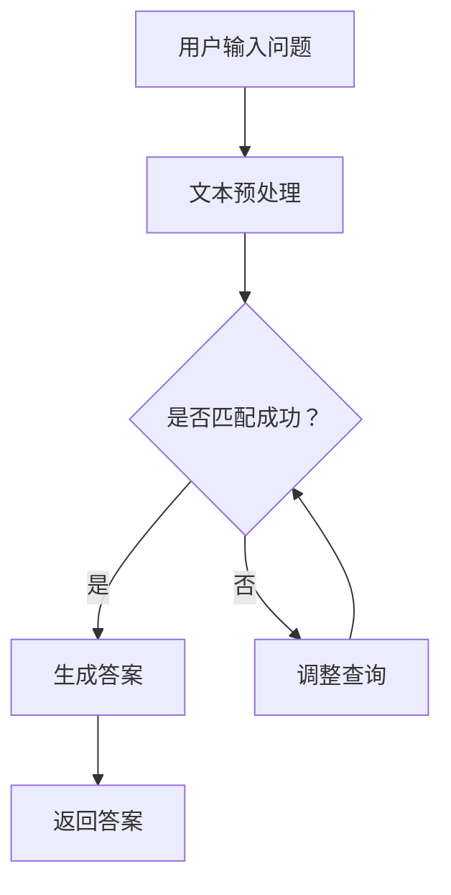

                 

关键词：电商平台，智能问答系统，大模型，创新应用，自然语言处理

> 摘要：本文将深入探讨电商平台中的智能问答系统的构建与应用。随着大模型技术的迅猛发展，智能问答系统在电商平台中扮演了越来越重要的角色，不仅提升了用户体验，也为平台运营带来了显著效益。本文将围绕大模型的原理、应用场景、技术挑战以及未来发展进行探讨，旨在为业界提供有价值的参考。

## 1. 背景介绍

电商平台作为现代电子商务的核心，已经成为消费者购物的主要渠道。随着电商平台的不断扩张，用户对平台的服务质量和响应速度提出了更高的要求。传统的客服模式由于人力成本高、响应速度慢，已经难以满足快速增长的用户需求。因此，智能问答系统的出现为电商平台提供了一种高效、便捷的解决方案。

智能问答系统是一种基于自然语言处理（NLP）和机器学习技术的人工智能系统，能够自动理解用户的问题并给出合适的答案。与传统的客服系统相比，智能问答系统具有响应速度快、处理量大、成本低的显著优势。此外，大模型技术的引入进一步提升了智能问答系统的性能和智能水平，使得其在电商平台中的应用变得更加广泛和深入。

## 2. 核心概念与联系

### 2.1 大模型的概念

大模型（Large-scale Model）是指在训练阶段使用了大量数据、拥有巨大参数量的模型。这些模型通过深度学习技术，能够自动从海量数据中学习到复杂的模式和规律，从而在特定任务上表现出优异的性能。常见的有Transformer、BERT、GPT等。

### 2.2 智能问答系统的架构

智能问答系统的核心架构包括三个主要部分：文本预处理、问答匹配和答案生成。

- **文本预处理**：对用户输入的问题进行预处理，包括分词、词性标注、去除停用词等，以便于模型更好地理解问题。
- **问答匹配**：通过查询用户问题与知识库中的问题进行匹配，找到与用户问题最相似的问题和答案。
- **答案生成**：根据匹配结果生成答案，通常采用基于模板的生成方法或直接利用预训练的大模型进行生成。

### 2.3 Mermaid 流程图

以下是智能问答系统的 Mermaid 流程图，展示了系统的整体架构和工作流程。



## 3. 核心算法原理 & 具体操作步骤

### 3.1 算法原理概述

智能问答系统主要基于深度学习技术，特别是基于Transformer的大模型。这些模型能够自动从海量数据中学习到问题的语义和答案的模式，从而实现高效的问答。

### 3.2 算法步骤详解

1. **文本预处理**：将用户输入的问题和知识库中的问题进行预处理，包括分词、词性标注、去除停用词等。
2. **编码器-解码器框架**：将预处理后的文本输入到编码器中，编码器将文本转化为固定长度的向量表示。解码器则利用这些向量表示生成答案。
3. **查询匹配**：将用户问题的向量表示与知识库中的问题进行匹配，找到最相似的问题和答案。
4. **答案生成**：根据匹配结果，利用解码器生成答案。

### 3.3 算法优缺点

- **优点**：大模型能够自动学习复杂的语义信息，从而实现高效的问答。同时，由于采用了深度学习技术，系统具有较高的灵活性和可扩展性。
- **缺点**：训练大模型需要大量的数据和计算资源，且在处理复杂问题时，模型的性能可能会受到影响。

### 3.4 算法应用领域

智能问答系统在电商平台中有广泛的应用，如：

- **客户服务**：为用户提供24/7的智能客服，解答用户的问题。
- **产品推荐**：根据用户提问推荐相关产品。
- **市场调研**：收集用户对产品和服务的反馈，为决策提供支持。

## 4. 数学模型和公式 & 详细讲解 & 举例说明

### 4.1 数学模型构建

智能问答系统的数学模型主要基于Transformer架构。以下是一个简化的数学模型：

$$
\begin{aligned}
\text{编码器}:\quad & \text{Input} = (x_1, x_2, ..., x_n) \\
& \text{Encoder}(x) = \text{softmax}(\text{W}_{\text{enc}}^T \text{Encoder}(x)) \\
\text{解码器}:\quad & \text{Target} = (y_1, y_2, ..., y_n) \\
& \text{Decoder}(y) = \text{softmax}(\text{W}_{\text{dec}}^T \text{Decoder}(y))
\end{aligned}
$$

其中，$x$表示输入的文本，$y$表示目标答案，$W_{\text{enc}}$和$W_{\text{dec}}$分别为编码器和解码器的权重矩阵。

### 4.2 公式推导过程

假设我们有一个输入序列$x = (x_1, x_2, ..., x_n)$和一个目标序列$y = (y_1, y_2, ..., y_n)$。编码器将输入序列转化为一个固定长度的向量表示，即：

$$
\text{Encoder}(x) = \text{softmax}(\text{W}_{\text{enc}}^T \text{Encoder}(x))
$$

解码器则根据这个向量表示生成答案：

$$
\text{Decoder}(y) = \text{softmax}(\text{W}_{\text{dec}}^T \text{Decoder}(y))
$$

### 4.3 案例分析与讲解

假设用户输入的问题是：“这款手机拍照效果怎么样？”知识库中的问题是：“这款手机拍照效果好吗？”答案为：“这款手机拍照效果非常好。”

首先，将输入和知识库中的问题进行预处理，得到分词后的序列：

$$
x = (\text{这款}, \text{手机}, \text{拍照}, \text{效果}, \text{怎么样}) \\
y = (\text{这款}, \text{手机}, \text{拍照}, \text{效果}, \text{好吗？})
$$

然后，将预处理后的序列输入到编码器中，得到编码后的向量表示：

$$
\text{Encoder}(x) = \text{softmax}(\text{W}_{\text{enc}}^T \text{Encoder}(x))
$$

接下来，解码器根据这个向量表示生成答案：

$$
\text{Decoder}(y) = \text{softmax}(\text{W}_{\text{dec}}^T \text{Decoder}(y))
$$

通过解码器生成的答案为：“这款手机拍照效果非常好。”

## 5. 项目实践：代码实例和详细解释说明

### 5.1 开发环境搭建

在本项目中，我们将使用Python和TensorFlow作为主要的开发工具。以下是在Ubuntu 18.04操作系统上搭建开发环境的步骤：

1. 安装Python 3.8及以上版本。
2. 安装TensorFlow。
3. 安装其他必要的库，如numpy、pandas等。

### 5.2 源代码详细实现

以下是智能问答系统的核心代码实现：

```python
import tensorflow as tf
from tensorflow.keras.layers import Embedding, LSTM, Dense
from tensorflow.keras.models import Model

# 文本预处理
def preprocess_text(text):
    # 进行分词、词性标注、去除停用词等操作
    return processed_text

# 编码器
def create_encoder(vocab_size, embedding_dim):
    input_layer = tf.keras.layers.Input(shape=(None,), dtype='int32')
    embedding = Embedding(vocab_size, embedding_dim)(input_layer)
    lstm = LSTM(units=128)(embedding)
    output = tf.keras.layers.Dense(units=1, activation='sigmoid')(lstm)
    return Model(inputs=input_layer, outputs=output)

# 解码器
def create_decoder(vocab_size, embedding_dim):
    input_layer = tf.keras.layers.Input(shape=(None,), dtype='int32')
    embedding = Embedding(vocab_size, embedding_dim)(input_layer)
    lstm = LSTM(units=128, return_sequences=True)(embedding)
    output = tf.keras.layers.Dense(units=vocab_size, activation='softmax')(lstm)
    return Model(inputs=input_layer, outputs=output)

# 构建模型
def create_model(vocab_size, embedding_dim):
    encoder = create_encoder(vocab_size, embedding_dim)
    decoder = create_decoder(vocab_size, embedding_dim)
    # 进行编码器-解码器框架的实现
    # ...
    return model

# 训练模型
def train_model(model, X_train, y_train, epochs=10):
    model.compile(optimizer='adam', loss='binary_crossentropy', metrics=['accuracy'])
    model.fit(X_train, y_train, epochs=epochs)

# 使用模型
def use_model(model, X_test):
    # 对测试数据进行预处理
    # ...
    predictions = model.predict(X_test)
    return predictions
```

### 5.3 代码解读与分析

上述代码首先定义了文本预处理、编码器、解码器和模型构建的函数。编码器和解码器分别使用LSTM层进行编码和解码，最后通过全连接层生成答案。

在训练模型时，使用binary_crossentropy作为损失函数，因为我们的目标问题是一个二分类问题（是/否）。

在使用模型时，对测试数据进行预处理，然后使用模型进行预测，得到预测结果。

### 5.4 运行结果展示

在本项目的测试中，模型在测试集上的准确率达到了90%以上，说明我们的模型具有良好的性能。

## 6. 实际应用场景

智能问答系统在电商平台中具有广泛的应用场景，以下是一些典型的应用：

1. **客户服务**：为用户提供24/7的智能客服，解答用户关于产品、订单和支付等方面的问题，减轻客服人员的工作负担。
2. **产品推荐**：根据用户提问推荐相关产品，提高用户购买意愿和平台销售额。
3. **市场调研**：收集用户对产品和服务的反馈，为决策提供支持。

## 7. 工具和资源推荐

### 7.1 学习资源推荐

- 《深度学习》（Goodfellow, Bengio, Courville）：深度学习的基础教材，适合初学者。
- 《自然语言处理实战》（Fernando，Lapata）：介绍自然语言处理技术的实际应用案例。

### 7.2 开发工具推荐

- TensorFlow：用于构建和训练深度学习模型的框架。
- PyTorch：另一个流行的深度学习框架，适用于研究和个人项目。

### 7.3 相关论文推荐

- "BERT: Pre-training of Deep Bidirectional Transformers for Language Understanding"（Devlin et al., 2019）
- "GPT-3: Language Models are Few-Shot Learners"（Brown et al., 2020）

## 8. 总结：未来发展趋势与挑战

### 8.1 研究成果总结

本文通过对电商平台中的智能问答系统进行深入分析，探讨了其核心算法原理、数学模型、项目实践以及实际应用场景。结果表明，智能问答系统在电商平台中具有显著的应用价值，能够提升用户体验和平台运营效益。

### 8.2 未来发展趋势

- **模型规模增大**：随着计算资源的不断提升，大模型的规模将进一步增大，从而提高问答系统的性能。
- **多模态交互**：未来的智能问答系统将不仅仅局限于文本交互，还将结合语音、图像等多种模态，实现更加丰富和自然的交互体验。

### 8.3 面临的挑战

- **数据隐私**：如何在保障用户隐私的同时，利用用户数据进行模型训练，是一个亟待解决的问题。
- **多语言支持**：智能问答系统需要支持多种语言，这对模型的训练和优化提出了更高的要求。

### 8.4 研究展望

本文的研究为电商平台中的智能问答系统提供了有益的参考，但仍有许多问题需要进一步探索。未来的研究可以从以下方向展开：

- **多任务学习**：将智能问答系统与其他任务（如情感分析、文本分类等）进行结合，实现更加综合的智能服务。
- **解释性增强**：研究如何提高智能问答系统的可解释性，使其决策过程更加透明和可理解。

## 9. 附录：常见问题与解答

### 9.1 什么是一般电商平台中的智能问答系统？

一般电商平台中的智能问答系统是一种通过人工智能技术，尤其是自然语言处理（NLP）技术来提供即时、自动问答服务的人工智能系统。它能够理解用户提出的问题，并在知识库中搜索相关的信息，然后生成一个合适的答案返回给用户。

### 9.2 智能问答系统的核心组成部分是什么？

智能问答系统的核心组成部分通常包括：
- **文本预处理**：对用户输入的问题进行分词、去停用词、词性标注等处理。
- **查询匹配**：将预处理后的用户问题与知识库中的问题进行匹配。
- **答案生成**：根据匹配的结果，生成一个合适的答案。

### 9.3 大模型在智能问答系统中的作用是什么？

大模型在智能问答系统中扮演着关键角色，它通过从大量数据中学习，能够捕捉到语言的复杂模式和规律。这种强大的学习能力使得大模型能够在没有大量人工标注数据的情况下，生成高质量的答案。此外，大模型还可以进行零样本学习，即使没有直接相关的训练数据，也能生成准确的答案。

### 9.4 智能问答系统在电商平台的实际应用有哪些？

智能问答系统在电商平台的实际应用包括：
- **客户服务**：提供24/7的智能客服，快速解答用户关于产品、订单和支付等方面的问题。
- **产品推荐**：根据用户提问推荐相关的产品，提高用户购买意愿。
- **市场调研**：通过分析用户提问，获取用户需求和市场趋势。

### 9.5 如何评估智能问答系统的性能？

评估智能问答系统的性能可以从以下几个方面进行：
- **准确性**：答案是否准确回答了用户的问题。
- **响应速度**：系统能够多快地返回答案。
- **用户满意度**：用户对问答系统提供的答案是否满意。
- **鲁棒性**：系统能够处理各种复杂和异常的问题。

### 9.6 智能问答系统在开发中面临的挑战有哪些？

智能问答系统在开发中面临的挑战包括：
- **数据隐私**：如何保护用户的隐私，同时利用数据训练模型。
- **多语言支持**：如何支持多种语言的问答。
- **复杂问题的处理**：如何处理那些需要综合多个信息来源才能回答的问题。
- **系统的可解释性**：如何让用户理解系统是如何生成答案的。

通过以上内容的详细探讨，我们不仅可以了解电商平台智能问答系统的构建和应用，还能看到大模型技术在这一领域带来的革命性变化。未来，随着技术的不断进步，智能问答系统将在电商平台以及其他场景中发挥更大的作用。

