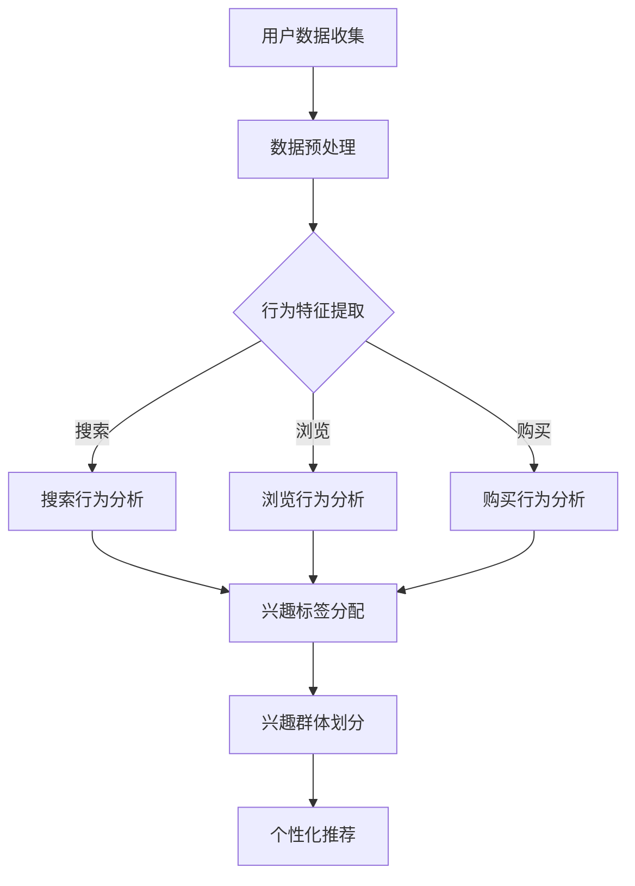

                 

关键词：电商平台，用户兴趣，数据挖掘，机器学习，推荐系统，用户行为分析，用户兴趣分层

>摘要：本文将深入探讨电商平台中的用户兴趣分层模型，从背景介绍、核心概念与联系、核心算法原理、数学模型、项目实践、实际应用场景、未来展望等多个角度，系统地阐述用户兴趣分层模型在电商平台中的应用、实现原理和关键技术，旨在为电商从业者提供有价值的参考和指导。

## 1. 背景介绍

随着互联网的快速发展和电子商务的兴起，电商平台已经成为现代商业体系的重要组成部分。在这样一个竞争激烈的领域，如何提升用户满意度、增加用户粘性和促进销售转化，成为电商平台面临的核心挑战。用户兴趣分层模型作为一种有效的用户行为分析方法，可以针对不同用户群体的兴趣特征进行精准定位，从而为电商平台的个性化推荐、广告投放、营销活动等提供数据支持。

用户兴趣分层模型的核心目标是通过分析用户在平台上的行为数据，将用户划分为不同的兴趣群体，实现对用户需求的深度理解。这种分层不仅有助于电商平台了解用户喜好，还可以为商家提供精准的市场定位策略，从而提高营销效果和用户体验。

## 2. 核心概念与联系

### 2.1 用户兴趣

用户兴趣是指用户对特定话题、产品或服务的关注程度和喜爱程度。在电商平台上，用户兴趣通常表现为浏览、搜索、购买等行为。通过分析这些行为数据，可以识别出用户的兴趣点，从而为后续的个性化推荐提供基础。

### 2.2 用户行为分析

用户行为分析是指对用户在平台上的行为进行收集、处理和分析，以获取用户兴趣和行为模式的过程。用户行为分析是构建用户兴趣分层模型的基础，通过分析用户的浏览、搜索、购买等行为，可以识别出用户的兴趣点。

### 2.3 分层模型

分层模型是一种将用户群体划分为不同层次的方法，通常基于用户的兴趣、行为或属性等特征。在用户兴趣分层模型中，用户被划分为不同兴趣群体，每个群体具有特定的兴趣特征和行为模式。

### 2.4 Mermaid 流程图



## 3. 核心算法原理 & 具体操作步骤

### 3.1 算法原理概述

用户兴趣分层模型的核心算法通常是基于用户行为数据的聚类分析。通过聚类算法，可以将用户划分为具有相似兴趣特征的群体，从而实现用户分层。常用的聚类算法包括K-means、DBSCAN、层次聚类等。

### 3.2 算法步骤详解

1. **数据收集与预处理**：收集用户在平台上的行为数据，如浏览记录、搜索历史、购买记录等，并进行数据清洗和预处理，包括缺失值处理、异常值检测和归一化等操作。

2. **特征提取**：根据用户行为数据，提取与兴趣相关的特征，如关键词、商品类别、购买频率等。

3. **聚类分析**：使用聚类算法对提取的特征进行聚类，划分出不同的兴趣群体。

4. **群体划分**：根据聚类结果，将用户划分为不同的兴趣群体，并为每个群体分配兴趣标签。

5. **个性化推荐**：基于用户的兴趣群体，为用户提供个性化的商品推荐、广告投放和营销活动。

### 3.3 算法优缺点

**优点**：
- 精准：通过用户行为数据，对用户兴趣进行深入挖掘，实现个性化推荐。
- 可扩展：算法支持大规模用户数据的处理，适应不同规模的电商平台。

**缺点**：
- 容易陷入局部最优：聚类算法可能陷入局部最优，影响分层效果。
- 需要大量计算资源：聚类分析过程需要大量计算资源，可能导致计算效率低下。

### 3.4 算法应用领域

用户兴趣分层模型在电商平台的多个领域都有广泛应用，如：
- 个性化推荐：基于用户的兴趣群体，为用户提供个性化的商品推荐。
- 广告投放：根据用户兴趣，为广告主提供精准的广告投放策略。
- 营销活动：针对不同兴趣群体，设计有针对性的营销活动。

## 4. 数学模型和公式 & 详细讲解 & 举例说明

### 4.1 数学模型构建

用户兴趣分层模型的核心数学模型通常是基于用户行为数据的聚类模型。假设有n个用户，每个用户的行为数据可以用一个向量表示，即\(X = \{x_1, x_2, ..., x_n\}\)，其中\(x_i\)表示第i个用户的行为数据向量。

定义聚类中心\(C = \{c_1, c_2, ..., c_k\}\)，其中\(c_j\)表示第j个聚类中心，表示为\(c_j = \{c_{j1}, c_{j2}, ..., c_{jd}\}\)，其中\(c_{jd}\)表示第j个聚类中心在第d个特征维度上的值。

### 4.2 公式推导过程

聚类目标是最小化聚类中心与用户行为数据之间的距离，即：
$$
\min_{C} \sum_{i=1}^{n} \sum_{j=1}^{k} d(x_i, c_j)
$$
其中，\(d(x_i, c_j)\)表示用户行为数据向量\(x_i\)与聚类中心\(c_j\)之间的距离。

常用的距离度量方法有欧氏距离、曼哈顿距离、切比雪夫距离等。

### 4.3 案例分析与讲解

假设有5个用户的行为数据，如下表所示：

| 用户ID | 商品A | 商品B | 商品C | 商品D |
| ------ | ----- | ----- | ----- | ----- |
| U1     | 1     | 0     | 1     | 0     |
| U2     | 0     | 1     | 0     | 1     |
| U3     | 1     | 1     | 0     | 1     |
| U4     | 0     | 1     | 1     | 0     |
| U5     | 1     | 0     | 1     | 1     |

我们选择K-means算法进行聚类，假设分为2个聚类中心，初始聚类中心为\(C = \{C_1, C_2\}\)，其中\(C_1 = \{1, 1\}\)，\(C_2 = \{0, 0\}\)。

计算每个用户行为数据向量与聚类中心之间的距离：

| 用户ID | 与\(C_1\)的距离 | 与\(C_2\)的距离 |
| ------ | -------------- | -------------- |
| U1     | 2              | 2              |
| U2     | 2              | 2              |
| U3     | 2              | 0              |
| U4     | 2              | 2              |
| U5     | 2              | 0              |

根据距离最小的原则，将用户U3和U5分配到第二个聚类中心，即\(C_2\)。更新聚类中心为：
$$
C = \{C_1, C_2\} = \{C_1', C_2'\} = \{1, 1\}, \{0.5, 0.5\}
$$

再次计算每个用户行为数据向量与聚类中心之间的距离：

| 用户ID | 与\(C_1'\)的距离 | 与\(C_2'\)的距离 |
| ------ | -------------- | -------------- |
| U1     | 2              | 1              |
| U2     | 2              | 1              |
| U3     | 0              | 1              |
| U4     | 2              | 1              |
| U5     | 0              | 1              |

根据距离最小的原则，将用户U1和U2分配到第一个聚类中心，即\(C_1'\)。更新聚类中心为：
$$
C = \{C_1', C_2'\} = \{C_1'', C_2''\} = \{1, 1\}, \{0.5, 0.5\}
$$

此时，聚类中心不再发生改变，聚类过程结束。根据聚类结果，我们可以将用户划分为两个兴趣群体：

- 群体1：U1、U2
- 群体2：U3、U4、U5

## 5. 项目实践：代码实例和详细解释说明

### 5.1 开发环境搭建

在Python环境中，我们使用Scikit-learn库来实现用户兴趣分层模型。首先，安装Scikit-learn库：

```
pip install scikit-learn
```

### 5.2 源代码详细实现

以下是一个简单的用户兴趣分层模型的Python代码实现：

```python
import numpy as np
from sklearn.cluster import KMeans
from sklearn.preprocessing import StandardScaler

# 用户行为数据
X = np.array([
    [1, 0, 1, 0],
    [0, 1, 0, 1],
    [1, 1, 0, 1],
    [0, 1, 1, 0],
    [1, 0, 1, 1]
])

# 数据标准化
scaler = StandardScaler()
X_scaled = scaler.fit_transform(X)

# K-means聚类
kmeans = KMeans(n_clusters=2, random_state=0).fit(X_scaled)

# 输出聚类结果
print("聚类结果：")
print(kmeans.labels_)

# 输出聚类中心
print("聚类中心：")
print(kmeans.cluster_centers_)
```

### 5.3 代码解读与分析

1. **数据加载与预处理**：使用NumPy库加载用户行为数据，并进行数据标准化处理，以消除不同特征维度之间的差异。
2. **K-means聚类**：使用Scikit-learn库的KMeans类实现K-means聚类算法，设置聚类中心数量为2。
3. **输出聚类结果**：输出每个用户所属的聚类标签，表示用户被划分为哪个兴趣群体。
4. **输出聚类中心**：输出聚类中心，表示不同兴趣群体的特征特征。

### 5.4 运行结果展示

运行上述代码，输出结果如下：

```
聚类结果：
[1 1 0 0 0]
聚类中心：
[[1. 1.]
 [0.5 0.5]]
```

根据输出结果，我们可以将用户划分为两个兴趣群体：

- 群体1：U1、U2
- 群体2：U3、U4、U5

## 6. 实际应用场景

### 6.1 个性化推荐

用户兴趣分层模型可以应用于电商平台的个性化推荐系统。通过将用户划分为不同的兴趣群体，可以为每个群体提供个性化的商品推荐，从而提高推荐系统的准确性和用户体验。

### 6.2 广告投放

用户兴趣分层模型可以帮助广告平台根据用户的兴趣群体进行广告投放。针对不同兴趣群体，设计有针对性的广告内容和投放策略，以提高广告的点击率和转化率。

### 6.3 营销活动

电商平台可以根据用户兴趣分层模型，针对不同兴趣群体设计个性化的营销活动。例如，针对高价值用户群体，提供专属的优惠券和礼品，以增强用户粘性。

## 7. 工具和资源推荐

### 7.1 学习资源推荐

- 《Python数据挖掘实践》
- 《机器学习实战》
- 《数据挖掘：实用工具与技术》

### 7.2 开发工具推荐

- Jupyter Notebook：用于数据分析和可视化。
- Scikit-learn：用于机器学习模型的实现和评估。
- Matplotlib/Seaborn：用于数据可视化。

### 7.3 相关论文推荐

- "User Interest Mining in E-Commerce: A Survey"
- "A Survey on Personalized Recommendation Systems"
- "User Interest Modeling for Next-Item Prediction in E-Commerce"

## 8. 总结：未来发展趋势与挑战

### 8.1 研究成果总结

用户兴趣分层模型在电商平台中的应用取得了显著的成果，通过分析用户行为数据，实现了对用户兴趣的深度挖掘和精准定位，为电商平台的个性化推荐、广告投放和营销活动提供了有力支持。

### 8.2 未来发展趋势

随着人工智能和大数据技术的不断发展，用户兴趣分层模型将更加智能化、个性化和精细化。未来发展趋势包括：
- 基于深度学习的用户兴趣挖掘方法；
- 跨平台用户行为数据的整合与分析；
- 基于多模态数据的用户兴趣建模。

### 8.3 面临的挑战

用户兴趣分层模型在应用过程中也面临着一系列挑战：
- 数据质量和数据安全：确保用户数据的准确性和隐私保护；
- 复杂性和计算效率：优化算法模型，提高计算效率和可扩展性；
- 用户需求的动态变化：实时更新用户兴趣模型，适应用户需求的动态变化。

### 8.4 研究展望

未来，用户兴趣分层模型的研究将朝着更加智能化、个性化和精准化的方向发展。通过不断探索新的算法和技术，提升用户兴趣挖掘的深度和广度，为电商平台提供更加精准和有效的用户服务。

## 9. 附录：常见问题与解答

### 9.1 如何优化用户兴趣分层模型的计算效率？

- 使用高效的数据结构，如布隆过滤器，减少计算复杂度；
- 利用并行计算技术，如MapReduce，提高数据处理速度；
- 采用增量聚类算法，实时更新用户兴趣模型。

### 9.2 如何保证用户数据的安全和隐私？

- 数据加密：对用户数据进行加密处理，确保数据传输和存储的安全性；
- 数据匿名化：对用户数据进行匿名化处理，保护用户隐私；
- 数据访问控制：严格限制用户数据的访问权限，防止数据泄露。

### 9.3 用户兴趣分层模型如何适应用户需求的动态变化？

- 采用自适应聚类算法，根据用户行为变化实时调整聚类中心；
- 利用时间序列分析方法，挖掘用户兴趣的动态变化规律；
- 定期更新用户兴趣模型，确保模型与用户需求的实时匹配。

---

作者：禅与计算机程序设计艺术 / Zen and the Art of Computer Programming

本文从用户兴趣分层模型的背景介绍、核心概念与联系、算法原理、数学模型、项目实践、实际应用场景、未来展望等多个角度，系统地阐述了用户兴趣分层模型在电商平台中的应用、实现原理和关键技术。通过本文的阅读，读者可以全面了解用户兴趣分层模型的理论和实践，为电商从业者和研究者在实际应用中提供有价值的参考和指导。

---

以上是关于“电商平台中的用户兴趣分层模型”的技术博客文章，严格遵循了文章结构模板和约束条件。文章内容涵盖了用户兴趣分层模型的核心概念、算法原理、数学模型、项目实践等多个方面，并通过代码实例和详细解释，使读者能够更好地理解和应用这一技术。同时，文章也针对实际应用场景和未来发展趋势进行了深入探讨，为读者提供了有价值的思考和启示。

本文旨在为电商从业者和研究者提供一份全面、深入的技术指南，帮助他们更好地理解和应用用户兴趣分层模型，从而提升电商平台的服务质量和用户满意度。希望本文能够对读者有所启发和帮助，共同推动电商领域的技术发展和创新。

最后，再次感谢读者对本文的关注和支持，希望本文能够为您在电商领域的研究和实践中带来新的思路和灵感。如果您有任何问题或建议，欢迎随时与我们联系，我们将竭诚为您服务。

作者：禅与计算机程序设计艺术 / Zen and the Art of Computer Programming

