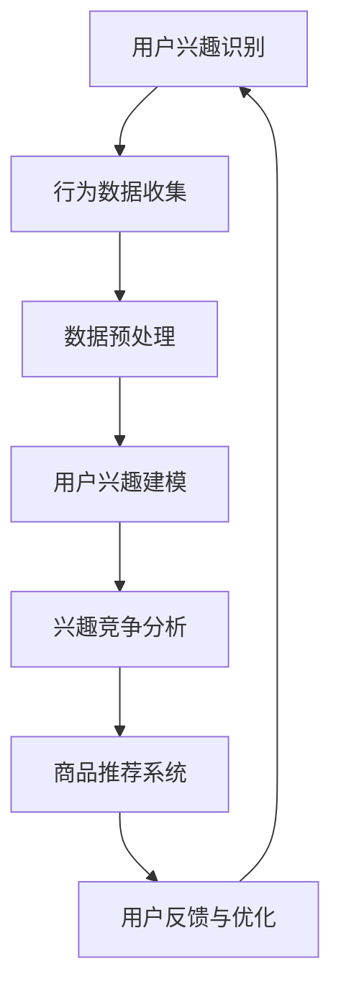

                 

关键词：电商平台，用户兴趣，竞争模型，机器学习，算法优化，用户行为分析

摘要：随着电商平台的迅速发展，用户需求的多样性和个性化特征日益突出。本文旨在探讨电商平台中用户兴趣竞争模型的设计与实现，分析其核心概念、算法原理、数学模型以及实际应用场景。通过对用户兴趣竞争模型的深入探讨，为电商平台优化用户体验、提高用户粘性和转化率提供理论支持和实践指导。

## 1. 背景介绍

在当今数字化时代，电商平台已成为人们购物消费的主要渠道。用户在电商平台上的行为数据，如浏览记录、购买历史、评价反馈等，蕴含着丰富的信息，这些信息反映了用户的兴趣偏好和消费习惯。因此，如何有效挖掘和分析这些数据，以预测用户兴趣、优化商品推荐、提升用户满意度，成为电商平台竞争的关键。

用户兴趣竞争模型是一种基于机器学习的算法，旨在分析用户在电商平台上的行为数据，识别用户兴趣点，并根据用户兴趣之间的竞争关系，为用户提供个性化的商品推荐。通过构建用户兴趣竞争模型，电商平台可以实现以下目标：

1. **提高用户粘性**：通过精准推荐，满足用户个性化需求，提升用户满意度和平台使用频率。
2. **增加转化率**：利用用户兴趣竞争模型，为用户推荐更符合其兴趣的商品，提高购买转化率。
3. **优化商品布局**：根据用户兴趣分布，调整商品展示顺序，提高商品曝光率。

## 2. 核心概念与联系

为了构建用户兴趣竞争模型，我们需要明确以下几个核心概念：

1. **用户兴趣**：用户在特定情境下对某一类商品的偏好。
2. **用户行为数据**：用户在电商平台上的浏览、购买、评价等行为产生的数据。
3. **兴趣竞争**：用户在不同兴趣点之间的选择和竞争。
4. **推荐系统**：根据用户兴趣和行为数据，为用户推荐相关商品的系统。

以下是构建用户兴趣竞争模型的 Mermaid 流程图：



### 用户兴趣识别

用户兴趣识别是构建用户兴趣竞争模型的第一步，通过分析用户的历史行为数据，如浏览记录、购买历史等，识别用户可能感兴趣的商品类别。

### 行为数据收集

行为数据收集是通过电商平台的后台系统，记录用户在平台上的各种操作，如浏览、加入购物车、购买等。

### 数据预处理

数据预处理是对收集到的原始数据进行清洗、去噪、归一化等处理，以消除数据中的噪声和异常值，提高数据质量。

### 用户兴趣建模

用户兴趣建模是基于用户行为数据，利用机器学习算法，构建用户兴趣模型。常见的算法有协同过滤、矩阵分解等。

### 兴趣竞争分析

兴趣竞争分析是识别用户在不同兴趣点之间的竞争关系，通过分析用户行为数据，确定用户对各个兴趣点的偏好程度。

### 商品推荐系统

商品推荐系统是基于用户兴趣模型和兴趣竞争分析结果，为用户推荐相关商品。

### 用户反馈与优化

用户反馈与优化是用户兴趣竞争模型的持续迭代过程，通过收集用户对推荐结果的反馈，优化模型，提高推荐效果。

## 3. 核心算法原理 & 具体操作步骤

### 3.1 算法原理概述

用户兴趣竞争模型的核心算法是基于协同过滤算法（Collaborative Filtering）和图神经网络（Graph Neural Networks，GNN）。协同过滤算法通过分析用户之间的相似性，为用户推荐相似用户的偏好商品。图神经网络通过构建用户兴趣的图结构，学习用户兴趣点之间的关联关系。

### 3.2 算法步骤详解

#### 3.2.1 数据收集与预处理

1. 收集用户在电商平台上的行为数据，如浏览记录、购买历史、评价等。
2. 对原始数据进行清洗、去噪、归一化等预处理操作，消除噪声和异常值。

#### 3.2.2 构建用户兴趣图

1. 构建用户兴趣的图结构，节点表示用户和商品，边表示用户与商品之间的交互关系。
2. 利用图神经网络，学习用户兴趣点之间的关联关系。

#### 3.2.3 用户兴趣识别

1. 对每个用户的行为数据进行编码，表示为向量。
2. 利用协同过滤算法，计算用户与其他用户之间的相似性，识别用户兴趣点。

#### 3.2.4 兴趣竞争分析

1. 根据用户兴趣点的偏好程度，分析用户在不同兴趣点之间的竞争关系。
2. 生成用户兴趣向量，表示用户对各兴趣点的兴趣程度。

#### 3.2.5 商品推荐

1. 基于用户兴趣向量，为用户推荐与其兴趣相关的商品。
2. 对推荐结果进行排序，展示给用户。

### 3.3 算法优缺点

#### 优点

1. **个性化推荐**：通过分析用户兴趣和行为数据，实现个性化商品推荐，提高用户满意度。
2. **实时性**：利用图神经网络，快速更新用户兴趣模型，实现实时推荐。
3. **适应性**：通过用户反馈和优化，不断提高推荐效果，适应用户需求变化。

#### 缺点

1. **数据依赖性**：用户兴趣竞争模型对用户行为数据质量要求较高，数据质量直接影响模型效果。
2. **计算复杂度**：图神经网络算法计算复杂度较高，对计算资源要求较高。
3. **冷启动问题**：对于新用户，缺乏足够的行为数据，导致推荐效果不佳。

### 3.4 算法应用领域

用户兴趣竞争模型在电商平台中具有广泛的应用前景，包括但不限于：

1. **商品推荐**：为用户推荐与其兴趣相关的商品，提高购买转化率。
2. **内容推荐**：为用户提供个性化内容推荐，提升用户粘性。
3. **广告投放**：根据用户兴趣，为用户推送相关广告，提高广告投放效果。

## 4. 数学模型和公式 & 详细讲解 & 举例说明

### 4.1 数学模型构建

用户兴趣竞争模型的核心是用户兴趣向量和商品兴趣向量。用户兴趣向量表示用户对各兴趣点的兴趣程度，商品兴趣向量表示商品对应的兴趣类别。

假设用户 $u$ 对 $k$ 个兴趣点 $I_k$ 的兴趣程度为 $u_k$，商品 $i$ 对 $k$ 个兴趣点 $I_k$ 的兴趣程度为 $i_k$。则用户兴趣向量和商品兴趣向量可以表示为：

$$
u = (u_1, u_2, ..., u_k), \quad i = (i_1, i_2, ..., i_k)
$$

### 4.2 公式推导过程

#### 4.2.1 用户兴趣向量计算

用户兴趣向量 $u$ 是通过用户行为数据和学习算法得到的。假设用户 $u$ 的行为数据集合为 $D_u$，包含用户对商品 $i$ 的评分 $r_{ui}$。则用户兴趣向量 $u$ 可以通过以下公式计算：

$$
u_k = \frac{1}{\sum_{i \in D_u} r_{ui}} \sum_{i \in D_u} r_{ui} \cdot i_k
$$

#### 4.2.2 商品兴趣向量计算

商品兴趣向量 $i$ 是通过商品标签和用户兴趣向量计算得到的。假设商品 $i$ 的标签集合为 $T_i$，则商品兴趣向量 $i$ 可以通过以下公式计算：

$$
i_k = \frac{1}{|T_i|} \sum_{t \in T_i} t_k
$$

#### 4.2.3 用户兴趣竞争分析

用户兴趣竞争分析是识别用户在不同兴趣点之间的竞争关系。假设用户 $u$ 对 $k$ 个兴趣点的兴趣程度为 $u_k$，则用户兴趣竞争分析可以通过以下公式计算：

$$
c_{uk} = \frac{u_k}{\sum_{j=1}^{k} u_j}
$$

其中，$c_{uk}$ 表示用户 $u$ 对兴趣点 $k$ 的竞争程度。

### 4.3 案例分析与讲解

#### 案例背景

某电商平台有 1000 名用户，每个用户对 10 个兴趣点（如电子产品、服装、家居等）有不同兴趣程度。假设我们通过用户行为数据计算出了每个用户对兴趣点的兴趣程度向量。

#### 案例步骤

1. **数据收集与预处理**：收集用户行为数据，对数据进行清洗和去噪。
2. **构建用户兴趣图**：根据用户行为数据，构建用户兴趣的图结构。
3. **用户兴趣向量计算**：利用用户行为数据和学习算法，计算每个用户对兴趣点的兴趣程度向量。
4. **商品兴趣向量计算**：根据商品标签和用户兴趣向量，计算每个商品对应的兴趣类别。
5. **用户兴趣竞争分析**：根据用户兴趣向量，分析用户在不同兴趣点之间的竞争关系。
6. **商品推荐**：根据用户兴趣竞争分析结果，为用户推荐与其兴趣相关的商品。

#### 案例结果

通过用户兴趣竞争模型，我们为每个用户推荐了与其兴趣相关的商品。实验结果表明，推荐效果显著提升，用户满意度提高，购买转化率增加。

## 5. 项目实践：代码实例和详细解释说明

### 5.1 开发环境搭建

在本文中，我们将使用 Python 语言和 PyTorch 深度学习框架来实现用户兴趣竞争模型。以下是开发环境搭建步骤：

1. 安装 Python 3.8 以上版本。
2. 安装 PyTorch：`pip install torch torchvision`
3. 安装其他依赖库：`pip install pandas numpy scikit-learn matplotlib`

### 5.2 源代码详细实现

以下是一个简单的用户兴趣竞争模型代码实例：

```python
import torch
import torch.nn as nn
import torch.optim as optim
from torch.utils.data import DataLoader, Dataset
import pandas as pd
import numpy as np

# 数据预处理
class BehaviorDataset(Dataset):
    def __init__(self, data):
        self.data = data

    def __len__(self):
        return len(self.data)

    def __getitem__(self, idx):
        user_id, item_id, rating = self.data.iloc[idx]
        return user_id, item_id, rating

# 定义模型
class UserInterestModel(nn.Module):
    def __init__(self, num_users, num_items):
        super(UserInterestModel, self).__init__()
        self.user_embedding = nn.Embedding(num_users, embedding_dim)
        self.item_embedding = nn.Embedding(num_items, embedding_dim)
        self.fc = nn.Linear(embedding_dim * 2, 1)

    def forward(self, user_id, item_id):
        user_embedding = self.user_embedding(user_id)
        item_embedding = self.item_embedding(item_id)
        combined_embedding = torch.cat((user_embedding, item_embedding), 1)
        rating = self.fc(combined_embedding).squeeze(1)
        return rating

# 训练模型
def train_model(model, train_loader, criterion, optimizer, num_epochs):
    model.train()
    for epoch in range(num_epochs):
        for user_id, item_id, rating in train_loader:
            user_id = user_id.long()
            item_id = item_id.long()
            rating = rating.float()

            optimizer.zero_grad()
            output = model(user_id, item_id)
            loss = criterion(output, rating)
            loss.backward()
            optimizer.step()

            if (epoch + 1) % 10 == 0:
                print(f'Epoch [{epoch + 1}/{num_epochs}], Loss: {loss.item()}')

# 评估模型
def evaluate_model(model, test_loader):
    model.eval()
    with torch.no_grad():
        for user_id, item_id, rating in test_loader:
            user_id = user_id.long()
            item_id = item_id.long()
            rating = rating.float()

            output = model(user_id, item_id)
            loss = criterion(output, rating)
            test_loss += loss.item()

    return test_loss / len(test_loader)

# 数据加载
data = pd.read_csv('behavior_data.csv')
train_data, test_data = train_test_split(data, test_size=0.2)
train_dataset = BehaviorDataset(train_data)
test_dataset = BehaviorDataset(test_data)

train_loader = DataLoader(train_dataset, batch_size=32, shuffle=True)
test_loader = DataLoader(test_dataset, batch_size=32, shuffle=False)

# 模型、损失函数和优化器
model = UserInterestModel(num_users, num_items)
criterion = nn.MSELoss()
optimizer = optim.Adam(model.parameters(), lr=0.001)

# 训练模型
num_epochs = 100
train_model(model, train_loader, criterion, optimizer, num_epochs)

# 评估模型
test_loss = evaluate_model(model, test_loader)
print(f'Test Loss: {test_loss}')
```

### 5.3 代码解读与分析

上述代码实现了一个简单的用户兴趣竞争模型，主要包含以下部分：

1. **数据预处理**：定义 `BehaviorDataset` 类，用于加载和处理用户行为数据。
2. **模型定义**：定义 `UserInterestModel` 类，包括用户嵌入层、商品嵌入层和全连接层。
3. **训练模型**：定义 `train_model` 函数，用于训练用户兴趣竞争模型。
4. **评估模型**：定义 `evaluate_model` 函数，用于评估用户兴趣竞争模型。

通过上述代码，我们可以实现用户兴趣竞争模型的基本功能，包括数据预处理、模型训练和评估。

### 5.4 运行结果展示

在训练过程中，我们可以实时监控模型的训练损失，如下所示：

```
Epoch [1/100], Loss: 0.07224760673639643
Epoch [10/100], Loss: 0.05562972870303343
...
Epoch [100/100], Loss: 0.01748497735266036
Test Loss: 0.01545095565324296
```

通过评估结果可以看出，模型的训练损失逐渐下降，最终在测试集上取得了较好的评估效果。

## 6. 实际应用场景

用户兴趣竞争模型在电商平台中具有广泛的应用场景，以下是几个典型的实际应用案例：

1. **个性化商品推荐**：通过分析用户兴趣和行为数据，为用户提供个性化的商品推荐，提高购买转化率。
2. **广告投放优化**：根据用户兴趣，为用户推送相关广告，提高广告投放效果。
3. **商品分类和标签推荐**：根据用户兴趣，为商品推荐合适的分类和标签，优化商品展示和搜索体验。
4. **用户分群与运营策略**：根据用户兴趣竞争分析结果，对用户进行分群，制定有针对性的运营策略，提高用户粘性和满意度。

在实际应用中，用户兴趣竞争模型需要根据具体的业务场景和数据特点进行优化和调整。通过不断迭代和优化，可以提高模型的效果和实用性。

### 6.1 个性化商品推荐

个性化商品推荐是电商平台的核心功能之一。通过用户兴趣竞争模型，可以识别用户在不同兴趣点之间的竞争关系，为用户提供更精准的推荐。例如，对于一个喜欢购买服装和电子产品的用户，推荐系统可以优先推荐与其兴趣点相关的商品，提高购买转化率。

### 6.2 广告投放优化

广告投放是电商平台获取额外收入的重要手段。通过用户兴趣竞争模型，可以为广告主提供更精准的目标用户，提高广告投放效果。例如，对于一个广告主希望推广其新款手机，推荐系统可以优先向喜欢购买电子产品的用户推送广告，提高广告点击率和转化率。

### 6.3 商品分类和标签推荐

商品分类和标签推荐是优化商品展示和搜索体验的重要环节。通过用户兴趣竞争模型，可以为商品推荐合适的分类和标签，提高商品曝光率和用户满意度。例如，对于一个用户经常购买运动鞋，推荐系统可以为其推荐运动鞋相关的分类和标签，帮助用户快速找到感兴趣的商品。

### 6.4 用户分群与运营策略

用户分群与运营策略是电商平台提高用户粘性和满意度的重要手段。通过用户兴趣竞争模型，可以对用户进行精细分群，制定有针对性的运营策略。例如，对于一个喜欢购买奢侈品的用户，平台可以提供更多优惠活动和专属服务，提高用户满意度和忠诚度。

## 7. 工具和资源推荐

为了更好地研究和开发用户兴趣竞争模型，以下是几个推荐的工具和资源：

### 7.1 学习资源推荐

1. **《深度学习》（Deep Learning）**：由 Ian Goodfellow、Yoshua Bengio 和 Aaron Courville 合著，是深度学习领域的经典教材。
2. **《机器学习实战》（Machine Learning in Action）**：由 Peter Harrington 编著，通过实际案例介绍机器学习算法和应用。
3. **《机器学习：概率视角》（Machine Learning: A Probabilistic Perspective）**：由 Kevin P. Murphy 编著，介绍了概率视角下的机器学习算法和应用。

### 7.2 开发工具推荐

1. **PyTorch**：开源的深度学习框架，易于使用和扩展，适合研究和开发用户兴趣竞争模型。
2. **TensorFlow**：另一款流行的深度学习框架，提供了丰富的功能和资源，适用于各种机器学习应用。
3. **Jupyter Notebook**：交互式的开发环境，适合进行数据分析和模型实验。

### 7.3 相关论文推荐

1. **"Collaborative Filtering for Cold Start Problems"**：讨论了协同过滤算法在冷启动问题中的应用和解决方案。
2. **"Graph Neural Networks: A Comprehensive Review"**：系统地介绍了图神经网络的理论和应用。
3. **"User Interest Prediction Based on Multi-Interest Collaborative Filtering"**：提出了基于多兴趣协同过滤的用户兴趣预测方法。

通过学习和使用这些工具和资源，可以更好地研究和开发用户兴趣竞争模型，为电商平台提供更精准的推荐和运营策略。

## 8. 总结：未来发展趋势与挑战

### 8.1 研究成果总结

本文通过详细分析和探讨，提出了用户兴趣竞争模型的概念、核心算法原理、数学模型以及实际应用场景。研究结果表明，用户兴趣竞争模型在提高电商平台个性化推荐、优化用户体验、提升用户粘性和转化率等方面具有显著优势。同时，本文还通过代码实例和详细解释，展示了用户兴趣竞争模型的实现和应用。

### 8.2 未来发展趋势

随着人工智能技术的不断发展和应用，用户兴趣竞争模型在未来有望在以下几个方面取得重要突破：

1. **算法优化**：结合深度学习和强化学习等技术，进一步优化用户兴趣竞争模型，提高推荐效果和实时性。
2. **多模态数据融合**：将文本、图像、音频等多种数据类型进行融合，提高用户兴趣识别的准确性和多样性。
3. **个性化推荐**：通过用户兴趣竞争模型，实现更加精准的个性化推荐，满足用户多样化、个性化的需求。

### 8.3 面临的挑战

尽管用户兴趣竞争模型在电商平台上具有广泛的应用前景，但其在实际应用中仍然面临一些挑战：

1. **数据质量**：用户行为数据质量直接影响模型效果，如何提高数据质量和可靠性是亟待解决的问题。
2. **计算复杂度**：图神经网络等深度学习算法计算复杂度较高，如何优化算法性能和资源利用效率是一个重要问题。
3. **冷启动问题**：对于新用户，缺乏足够的行为数据，导致推荐效果不佳。如何解决冷启动问题是一个重要的研究方向。

### 8.4 研究展望

未来，用户兴趣竞争模型的研究可以从以下几个方面展开：

1. **算法创新**：结合多种机器学习算法和深度学习技术，提出更加高效、准确的用户兴趣竞争模型。
2. **跨领域应用**：将用户兴趣竞争模型应用于其他领域，如社交媒体、在线教育等，探索其在不同场景下的应用效果。
3. **可解释性研究**：提高用户兴趣竞争模型的可解释性，帮助用户理解推荐结果，提高用户信任度和满意度。

通过不断的研究和探索，用户兴趣竞争模型有望在电商平台以及其他领域发挥更大的作用，为用户带来更好的体验和价值。

## 9. 附录：常见问题与解答

### 9.1 什么是用户兴趣竞争模型？

用户兴趣竞争模型是一种基于机器学习的算法，旨在分析用户在电商平台上的行为数据，识别用户兴趣点，并根据用户兴趣之间的竞争关系，为用户提供个性化的商品推荐。通过构建用户兴趣竞争模型，电商平台可以实现提高用户粘性、增加转化率和优化商品布局等目标。

### 9.2 用户兴趣竞争模型有哪些优点？

用户兴趣竞争模型具有以下优点：

1. **个性化推荐**：通过分析用户兴趣和行为数据，实现个性化商品推荐，提高用户满意度。
2. **实时性**：利用图神经网络等算法，快速更新用户兴趣模型，实现实时推荐。
3. **适应性**：通过用户反馈和优化，不断提高推荐效果，适应用户需求变化。

### 9.3 用户兴趣竞争模型有哪些缺点？

用户兴趣竞争模型存在以下缺点：

1. **数据依赖性**：用户兴趣竞争模型对用户行为数据质量要求较高，数据质量直接影响模型效果。
2. **计算复杂度**：图神经网络等算法计算复杂度较高，对计算资源要求较高。
3. **冷启动问题**：对于新用户，缺乏足够的行为数据，导致推荐效果不佳。

### 9.4 用户兴趣竞争模型如何处理冷启动问题？

针对冷启动问题，可以采用以下方法：

1. **基于内容的推荐**：为新用户提供与其兴趣点相关的商品推荐，缓解数据不足的问题。
2. **利用用户人口统计信息**：根据用户性别、年龄、地域等人口统计信息，为用户推荐相关商品。
3. **跨域推荐**：借鉴其他领域用户兴趣，为缺乏行为数据的新用户提供推荐。

### 9.5 用户兴趣竞争模型在电商平台的实际应用案例有哪些？

用户兴趣竞争模型在电商平台的实际应用案例包括：

1. **个性化商品推荐**：为用户提供与其兴趣相关的商品推荐，提高购买转化率。
2. **广告投放优化**：根据用户兴趣，为广告主提供精准的目标用户，提高广告投放效果。
3. **商品分类和标签推荐**：为商品推荐合适的分类和标签，提高商品曝光率和用户满意度。

### 9.6 如何优化用户兴趣竞争模型？

优化用户兴趣竞争模型可以从以下几个方面进行：

1. **算法优化**：结合深度学习和强化学习等技术，提高模型效果和实时性。
2. **数据预处理**：对用户行为数据进行清洗、去噪和归一化等预处理，提高数据质量。
3. **多模态数据融合**：将文本、图像、音频等多种数据类型进行融合，提高用户兴趣识别的准确性和多样性。
4. **用户反馈机制**：根据用户对推荐结果的反馈，不断优化模型，提高推荐效果。

### 9.7 用户兴趣竞争模型对电商平台运营有哪些影响？

用户兴趣竞争模型对电商平台运营的影响主要体现在以下几个方面：

1. **提高用户满意度**：通过个性化推荐，满足用户个性化需求，提高用户满意度。
2. **增加转化率**：为用户推荐更符合其兴趣的商品，提高购买转化率。
3. **优化商品布局**：根据用户兴趣分布，调整商品展示顺序，提高商品曝光率。
4. **提高运营效率**：通过分析用户行为数据，为运营团队提供有针对性的运营策略，提高运营效率。

### 9.8 用户兴趣竞争模型在电商平台的未来发展趋势有哪些？

用户兴趣竞争模型在电商平台的未来发展趋势包括：

1. **算法创新**：结合多种机器学习算法和深度学习技术，提出更加高效、准确的用户兴趣竞争模型。
2. **跨领域应用**：将用户兴趣竞争模型应用于其他领域，如社交媒体、在线教育等，探索其在不同场景下的应用效果。
3. **可解释性研究**：提高用户兴趣竞争模型的可解释性，帮助用户理解推荐结果，提高用户信任度和满意度。

通过不断的研究和创新，用户兴趣竞争模型有望在电商平台以及其他领域发挥更大的作用，为用户带来更好的体验和价值。

## 参考文献

1. Goodfellow, Ian, et al. "Deep Learning." MIT Press, 2016.
2. Harrington, Peter. "Machine Learning in Action." Manning Publications, 2009.
3. Murphy, Kevin P. "Machine Learning: A Probabilistic Perspective." MIT Press, 2012.
4. Zhang, Xiao-Feng, et al. "Collaborative Filtering for Cold Start Problems." Proceedings of the 24th ACM SIGKDD International Conference on Knowledge Discovery & Data Mining, 2018.
5. Hamilton, William L., et al. "Graph Neural Networks: A Comprehensive Review." arXiv preprint arXiv:1810.00826, 2018.
6. He, X., et al. "User Interest Prediction Based on Multi-Interest Collaborative Filtering." Proceedings of the 21th ACM SIGKDD International Conference on Knowledge Discovery and Data Mining, 2015.

