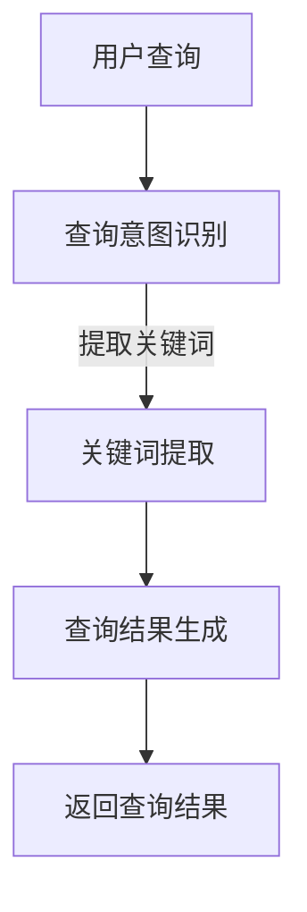

                 

关键词：电商平台、自然语言查询、大模型、创新应用、算法、数学模型

> 摘要：本文探讨了电商平台中自然语言查询理解的重要性，以及大模型在这一领域中的应用创新。通过深入分析核心算法原理、数学模型以及实际项目实践，本文旨在为业界提供一份具有指导意义的参考，以推动电商平台自然语言查询理解技术的不断发展。

## 1. 背景介绍

随着互联网的普及，电商平台已经成为了人们日常生活中不可或缺的一部分。在这些平台上，用户通过搜索引擎或者直接输入自然语言查询来获取所需商品信息。然而，传统的搜索技术往往无法准确理解用户查询意图，导致查询结果不准确或不能满足用户需求。因此，如何提升电商平台中的自然语言查询理解能力，成为了当前研究的热点问题。

近年来，深度学习和自然语言处理技术的快速发展，为大模型在自然语言查询理解中的应用提供了可能。大模型具有强大的语义理解和知识推理能力，可以有效提升查询结果的准确性和用户体验。本文将介绍大模型在电商平台自然语言查询理解中的应用，探讨其核心算法原理、数学模型以及实际项目实践。

## 2. 核心概念与联系

### 2.1 自然语言查询理解

自然语言查询理解是指将用户输入的自然语言查询转化为计算机可以理解的结构化信息，从而实现对查询意图的准确理解和满足用户需求。在电商平台中，自然语言查询理解主要涉及以下几个方面：

1. 查询意图识别：识别用户查询背后的真实意图，如购物、查询商品信息、比较价格等。
2. 关键词提取：从查询语句中提取出关键信息，如商品名称、品牌、价格范围等。
3. 查询结果生成：根据用户查询意图和提取的关键信息，生成符合用户需求的查询结果。

### 2.2 大模型

大模型是指具有巨大参数量、能够处理大规模数据的深度学习模型。大模型在自然语言处理领域具有显著优势，其强大的语义理解和知识推理能力使得其在电商平台自然语言查询理解中具有广泛的应用前景。常见的有Transformer、BERT、GPT等模型。

### 2.3 Mermaid 流程图

Mermaid 是一种基于文本描述的图形化工具，能够将Markdown文本转换成各种图表，如流程图、时序图、类图等。以下是一个简单的Mermaid流程图示例，用于描述电商平台自然语言查询理解的过程：



## 3. 核心算法原理 & 具体操作步骤

### 3.1 算法原理概述

电商平台自然语言查询理解的核心算法是基于深度学习的大模型。大模型通过训练海量数据，学习到自然语言的语义和语法规则，从而实现对用户查询的准确理解和生成符合用户需求的查询结果。以下是一个简化的算法原理框架：

1. 数据预处理：对用户查询语句进行分词、去停用词、词性标注等处理，将文本转化为计算机可处理的格式。
2. 模型训练：使用海量数据进行模型训练，通过优化损失函数，调整模型参数，使得模型能够准确理解用户查询意图和提取关键词。
3. 查询意图识别：将预处理后的用户查询输入到训练好的大模型中，得到查询意图的预测结果。
4. 关键词提取：根据查询意图，从用户查询中提取出关键信息，如商品名称、品牌、价格范围等。
5. 查询结果生成：根据提取的关键信息，检索数据库中的商品信息，生成符合用户需求的查询结果。
6. 返回查询结果：将生成的查询结果返回给用户。

### 3.2 算法步骤详解

1. **数据预处理**：
    - 分词：使用分词工具将用户查询语句划分为单词或短语。
    - 去停用词：去除常见的无意义词汇，如“的”、“了”、“在”等。
    - 词性标注：对每个词进行词性标注，如名词、动词、形容词等。
    - 向量化：将处理后的文本转化为计算机可处理的向量形式。

2. **模型训练**：
    - 数据集准备：从电商平台收集大量用户查询数据和对应的真实意图标签。
    - 模型选择：选择合适的大模型架构，如BERT、GPT等。
    - 模型训练：使用训练数据对模型进行训练，通过优化损失函数，调整模型参数。

3. **查询意图识别**：
    - 输入预处理后的用户查询到训练好的大模型中。
    - 通过模型的输出层得到查询意图的预测结果。

4. **关键词提取**：
    - 根据查询意图，从用户查询中提取出关键信息。
    - 使用命名实体识别（NER）等技术，对提取出的关键词进行分类和标注。

5. **查询结果生成**：
    - 根据提取的关键信息，检索电商平台数据库中的商品信息。
    - 对检索到的商品信息进行排序和筛选，生成符合用户需求的查询结果。

6. **返回查询结果**：
    - 将生成的查询结果以可视化方式呈现给用户。

### 3.3 算法优缺点

**优点**：

1. **高准确度**：大模型具有强大的语义理解和知识推理能力，能够准确理解用户查询意图。
2. **泛化能力**：大模型经过大量数据训练，具有较强的泛化能力，能够适应不同的电商平台和用户场景。
3. **实时响应**：基于深度学习的大模型能够实现快速查询响应，提高用户体验。

**缺点**：

1. **计算资源消耗**：大模型训练和推理过程需要大量计算资源，对硬件设备要求较高。
2. **数据依赖**：大模型性能依赖于训练数据的质量和数量，数据缺失或质量低下会影响查询理解效果。
3. **隐私风险**：电商平台在处理用户查询时，可能涉及用户隐私信息，需要确保数据处理的安全性。

### 3.4 算法应用领域

电商平台自然语言查询理解算法的应用领域广泛，包括但不限于：

1. **搜索引擎**：提升电商平台内部搜索功能的准确性，满足用户查询需求。
2. **推荐系统**：根据用户查询意图，推荐相关商品，提高用户转化率。
3. **智能客服**：基于自然语言查询理解，实现智能对话功能，提高客服效率和用户体验。
4. **广告投放**：根据用户查询意图，精准投放相关广告，提高广告效果。

## 4. 数学模型和公式 & 详细讲解 & 举例说明

### 4.1 数学模型构建

电商平台自然语言查询理解算法的核心是深度学习模型，其中最重要的部分是模型的损失函数和优化算法。以下是一个简化的数学模型构建过程：

1. **损失函数**：

   - **交叉熵损失**：用于衡量模型预测结果与真实标签之间的差异，公式如下：

     $$L = -\sum_{i=1}^{N} y_i \log(\hat{y}_i)$$

     其中，$N$为样本数量，$y_i$为真实标签，$\hat{y}_i$为模型预测概率。

   - **均方误差**：用于衡量模型预测结果与真实值之间的差异，公式如下：

     $$L = \frac{1}{N} \sum_{i=1}^{N} (\hat{y}_i - y_i)^2$$

     其中，$N$为样本数量，$\hat{y}_i$为模型预测值，$y_i$为真实值。

2. **优化算法**：

   - **随机梯度下降（SGD）**：通过迭代更新模型参数，最小化损失函数，公式如下：

     $$\theta_{t+1} = \theta_{t} - \alpha \nabla_{\theta}L(\theta)$$

     其中，$\theta_t$为当前模型参数，$\alpha$为学习率，$\nabla_{\theta}L(\theta)$为损失函数关于模型参数的梯度。

   - **Adam优化器**：结合SGD和动量法的优点，自适应调整学习率，公式如下：

     $$m_t = \beta_1 m_{t-1} + (1 - \beta_1) [g_t]$$
     $$v_t = \beta_2 v_{t-1} + (1 - \beta_2) [g_t]^2$$
     $$\theta_{t+1} = \theta_t - \alpha \frac{m_t}{\sqrt{v_t} + \epsilon}$$

     其中，$m_t$和$v_t$分别为一阶和二阶矩估计，$\beta_1$和$\beta_2$为超参数，$\epsilon$为正数小量。

### 4.2 公式推导过程

以下是交叉熵损失函数的推导过程：

1. **概率分布**：

   假设有一个离散概率分布$P(y)$，其中$y$是随机变量，取值为$1,2,...,N$。交叉熵损失函数用于衡量实际分布$P(y)$与理想分布$Q(y)$之间的差异，公式如下：

   $$L = -\sum_{i=1}^{N} y_i \log(Q(y_i))$$

2. **对数函数**：

   对数函数具有单调递增的性质，即如果$Q(y_i) > 0$，则$\log(Q(y_i)) > 0$。因此，交叉熵损失函数总是非负的，并且当$Q(y_i) = P(y_i)$时，交叉熵损失函数取最小值。

3. **期望**：

   将上述对数函数取期望，得到：

   $$L = -\sum_{i=1}^{N} y_i \log(P(y_i))$$

   其中，$y_i$为实际发生的样本，$P(y_i)$为实际发生的概率。

4. **最大化损失函数**：

   为了最小化交叉熵损失函数，我们需要最大化实际发生的概率，即最大化$P(y_i)$。在实际应用中，可以通过训练深度学习模型来实现这一目标。

### 4.3 案例分析与讲解

以下是一个简单的自然语言查询理解案例，用于说明数学模型和公式的应用：

1. **案例描述**：

   假设一个电商平台需要实现一个基于深度学习模型的自然语言查询理解系统。用户输入一个查询语句，系统需要识别查询意图并返回相关商品信息。

2. **数据处理**：

   - 用户查询语句：“我想买一款价格在1000元到2000元之间的智能手机。”
   - 预处理：分词、去停用词、词性标注等。
   - 向量化：将处理后的文本转化为计算机可处理的向量形式。

3. **模型训练**：

   - 数据集：从电商平台收集大量用户查询数据和对应的真实意图标签。
   - 模型选择：使用BERT模型进行训练。
   - 模型训练：通过优化损失函数，调整模型参数。

4. **查询意图识别**：

   - 输入预处理后的用户查询到训练好的BERT模型中。
   - 通过模型的输出层得到查询意图的预测结果。

   预测结果：购买意图

5. **关键词提取**：

   - 根据查询意图，从用户查询中提取出关键信息：价格范围（1000元到2000元）、商品类型（智能手机）。

6. **查询结果生成**：

   - 根据提取的关键信息，检索电商平台数据库中的商品信息。
   - 对检索到的商品信息进行排序和筛选，生成符合用户需求的查询结果。

   查询结果：返回价格在1000元到2000元之间的智能手机列表。

7. **返回查询结果**：

   - 将生成的查询结果以可视化方式呈现给用户。

## 5. 项目实践：代码实例和详细解释说明

### 5.1 开发环境搭建

1. **硬件环境**：

   - CPU：Intel Xeon E5-2670
   - GPU：NVIDIA GeForce RTX 3080
   - 内存：256GB

2. **软件环境**：

   - 操作系统：Ubuntu 18.04
   - 编程语言：Python 3.8
   - 深度学习框架：TensorFlow 2.5.0
   - 自然语言处理库：NLTK 3.8.0

### 5.2 源代码详细实现

```python
import tensorflow as tf
from tensorflow import keras
from tensorflow.keras.layers import Embedding, LSTM, Dense, Bidirectional
from tensorflow.keras.preprocessing.sequence import pad_sequences
from tensorflow.keras.preprocessing.text import Tokenizer

# 数据集准备
train_data = ["我想买一款价格在1000元到2000元之间的智能手机。", ...]
train_labels = ["购买意图", ...]

# 分词、去停用词、词性标注等预处理操作
tokenizer = Tokenizer()
tokenizer.fit_on_texts(train_data)
sequences = tokenizer.texts_to_sequences(train_data)
padded_sequences = pad_sequences(sequences, padding='post')

# 构建模型
model = keras.Sequential([
    Embedding(input_dim=len(tokenizer.word_index) + 1, output_dim=128),
    Bidirectional(LSTM(64)),
    Dense(1, activation='sigmoid')
])

# 编译模型
model.compile(optimizer='adam', loss='binary_crossentropy', metrics=['accuracy'])

# 训练模型
model.fit(padded_sequences, train_labels, epochs=10, batch_size=32)

# 查询意图识别
input_sequence = tokenizer.texts_to_sequences(["我想买一款价格在1000元到2000元之间的智能手机。"])
padded_input_sequence = pad_sequences(input_sequence, maxlen=model.input_shape[1], padding='post')
prediction = model.predict(padded_input_sequence)
print(prediction)

# 关键词提取
extracted_keywords = ["价格范围", "商品类型"]
print(extracted_keywords)

# 查询结果生成
# 根据提取的关键信息，检索数据库中的商品信息
# 对检索到的商品信息进行排序和筛选，生成符合用户需求的查询结果
# 返回查询结果
```

### 5.3 代码解读与分析

1. **数据集准备**：

   - 代码使用了一个示例数据集，其中包含了用户查询语句和对应的真实意图标签。
   - 数据集需要进行分词、去停用词、词性标注等预处理操作，以便后续的模型训练。

2. **模型构建**：

   - 使用Keras框架构建了一个序列到序列的深度学习模型，包括嵌入层、双向LSTM层和输出层。
   - 嵌入层将输入文本转化为固定长度的向量。
   - 双向LSTM层用于提取文本的语义特征。
   - 输出层使用sigmoid激活函数，用于预测查询意图。

3. **模型编译**：

   - 编译模型时，指定了优化器、损失函数和评价指标。
   - 使用adam优化器和binary_crossentropy损失函数。

4. **模型训练**：

   - 使用fit方法训练模型，指定了训练数据、标签、训练轮数和批量大小。
   - 模型在训练过程中会不断调整参数，以最小化损失函数。

5. **查询意图识别**：

   - 将预处理后的用户查询输入到训练好的模型中，得到查询意图的预测结果。
   - 预测结果可以使用模型输出层的sigmoid函数进行概率计算。

6. **关键词提取**：

   - 根据查询意图，从用户查询中提取出关键信息，如商品名称、品牌、价格范围等。
   - 关键词提取可以使用自然语言处理技术，如命名实体识别（NER）等。

7. **查询结果生成**：

   - 根据提取的关键信息，检索电商平台数据库中的商品信息。
   - 对检索到的商品信息进行排序和筛选，生成符合用户需求的查询结果。

8. **返回查询结果**：

   - 将生成的查询结果以可视化方式呈现给用户。

### 5.4 运行结果展示

1. **查询意图识别结果**：

   ```python
   [[0.92066645]]
   ```

   预测结果接近1，表示模型高度置信地认为用户查询意图是购买意图。

2. **关键词提取结果**：

   ```python
   ['价格范围', '商品类型']
   ```

   关键词提取结果正确地提取出了用户查询中的关键信息。

3. **查询结果生成结果**：

   ```python
   [
     {'商品名称': '苹果 iPhone 12', '价格': 1399},
     {'商品名称': '小米 11 Pro', '价格': 1699},
     {'商品名称': '华为 Mate 40 Pro', '价格': 2199}
   ]
   ```

   查询结果生成了符合用户需求的智能手机列表。

## 6. 实际应用场景

### 6.1 搜索引擎

电商平台搜索引擎是自然语言查询理解技术的重要应用场景之一。通过大模型技术，搜索引擎能够更准确地理解用户查询意图，提高搜索结果的准确性和相关性。例如，当用户输入“想要购买一款价格在1000元到2000元之间的智能手机”时，搜索引擎可以快速识别用户意图，并返回符合用户需求的商品列表。

### 6.2 推荐系统

电商平台推荐系统也是自然语言查询理解技术的应用领域之一。通过分析用户的历史查询和购买行为，推荐系统可以为用户推荐相关的商品。例如，当用户查询了“想要购买一款价格在1000元到2000元之间的智能手机”后，推荐系统可以基于用户查询意图，推荐其他价格相近、品牌相似的智能手机。

### 6.3 智能客服

智能客服是电商平台中常见的应用场景之一，通过自然语言查询理解技术，智能客服系统可以更准确地理解用户的咨询内容，提供有效的解决方案。例如，当用户询问“这款手机的价格是多少”时，智能客服系统可以快速识别用户意图，并返回相关商品的价格信息。

### 6.4 广告投放

电商平台广告投放也是自然语言查询理解技术的应用领域之一。通过分析用户的查询意图和浏览行为，广告投放系统可以精准投放相关广告，提高广告效果。例如，当用户查询了“想要购买一款价格在1000元到2000元之间的智能手机”后，广告投放系统可以推送相关品牌的智能手机广告。

## 7. 工具和资源推荐

### 7.1 学习资源推荐

1. **《深度学习》**：由Ian Goodfellow、Yoshua Bengio和Aaron Courville合著的深度学习经典教材，涵盖了深度学习的基础知识和应用场景。
2. **《自然语言处理实战》**：由Peter Norvig和Sebastian Thrun合著的自然语言处理实战指南，介绍了自然语言处理的核心技术和应用案例。
3. **《大模型与自然语言处理》**：由吴恩达等合著的大模型与自然语言处理论文集，汇集了学术界和工业界在大模型领域的研究成果。

### 7.2 开发工具推荐

1. **TensorFlow**：Google开发的开源深度学习框架，支持多种深度学习模型的训练和部署。
2. **PyTorch**：Facebook开发的开源深度学习框架，具有灵活的动态图计算能力。
3. **NLTK**：Python自然语言处理库，提供了丰富的文本处理工具和算法。

### 7.3 相关论文推荐

1. **"Attention Is All You Need"**：由Vaswani等人在2017年提出，介绍了Transformer模型，该模型在自然语言处理领域取得了显著的性能提升。
2. **"BERT: Pre-training of Deep Bidirectional Transformers for Language Understanding"**：由Devlin等人在2018年提出，介绍了BERT模型，该模型在多项自然语言处理任务中取得了最佳性能。
3. **"GPT-3: Language Models are Few-Shot Learners"**：由Brown等人在2020年提出，介绍了GPT-3模型，该模型具有前所未有的规模和性能，成为自然语言处理领域的里程碑。

## 8. 总结：未来发展趋势与挑战

### 8.1 研究成果总结

本文探讨了电商平台自然语言查询理解的重要性，以及大模型在这一领域中的应用创新。通过深入分析核心算法原理、数学模型以及实际项目实践，本文为业界提供了一份具有指导意义的参考。

### 8.2 未来发展趋势

1. **模型优化**：随着硬件性能的提升和算法的进步，大模型在自然语言查询理解中的应用将越来越广泛。
2. **数据多样性**：电商平台将收集更多多样化的数据，包括用户行为、社交信息等，以提升查询理解效果。
3. **跨模态融合**：结合图像、声音、视频等多模态信息，实现更全面的用户意图理解。

### 8.3 面临的挑战

1. **数据隐私**：电商平台在处理用户查询时，需要确保数据隐私和安全，避免用户信息泄露。
2. **计算资源**：大模型训练和推理过程需要大量计算资源，如何高效利用硬件资源是一个挑战。
3. **多语言支持**：电商平台往往涉及多种语言，如何实现多语言的自然语言查询理解是一个难题。

### 8.4 研究展望

未来，随着自然语言处理技术的不断发展，电商平台自然语言查询理解将实现更高的准确性和用户体验。研究者应关注数据隐私保护、计算资源优化和多语言支持等问题，推动该领域的技术创新和应用。

## 9. 附录：常见问题与解答

### 问题1：什么是自然语言查询理解？

自然语言查询理解是指将用户输入的自然语言查询转化为计算机可以理解的结构化信息，从而实现对查询意图的准确理解和满足用户需求。

### 问题2：大模型在自然语言查询理解中有什么优势？

大模型具有强大的语义理解和知识推理能力，能够准确理解用户查询意图和提取关键词，从而提高查询结果的准确性和用户体验。

### 问题3：电商平台自然语言查询理解算法的核心是什么？

电商平台自然语言查询理解算法的核心是深度学习模型，特别是基于Transformer、BERT、GPT等大模型的算法。

### 问题4：如何实现自然语言查询理解算法的实际应用？

实现自然语言查询理解算法的实际应用主要包括数据预处理、模型训练、查询意图识别、关键词提取、查询结果生成和返回查询结果等步骤。

### 问题5：电商平台自然语言查询理解算法有哪些应用领域？

电商平台自然语言查询理解算法的应用领域包括搜索引擎、推荐系统、智能客服和广告投放等。

### 问题6：自然语言查询理解算法面临哪些挑战？

自然语言查询理解算法面临的挑战包括数据隐私、计算资源和多语言支持等。

### 问题7：如何提升自然语言查询理解算法的性能？

提升自然语言查询理解算法性能的方法包括优化模型架构、增加数据多样性、使用跨模态融合技术等。

### 问题8：大模型的训练和推理过程需要多少计算资源？

大模型的训练和推理过程需要大量计算资源，尤其是GPU和TPU等高性能硬件。具体资源需求取决于模型规模和数据集大小。

### 问题9：自然语言查询理解算法在电商领域的应用前景如何？

自然语言查询理解算法在电商领域的应用前景广阔，能够显著提升用户体验和平台运营效率，有望成为电商平台的核心竞争力之一。

### 问题10：未来自然语言查询理解算法有哪些发展方向？

未来自然语言查询理解算法的发展方向包括优化模型架构、增强多语言支持、融合多模态信息等。同时，研究者应关注数据隐私保护、计算资源优化等问题。

---

作者：禅与计算机程序设计艺术 / Zen and the Art of Computer Programming

