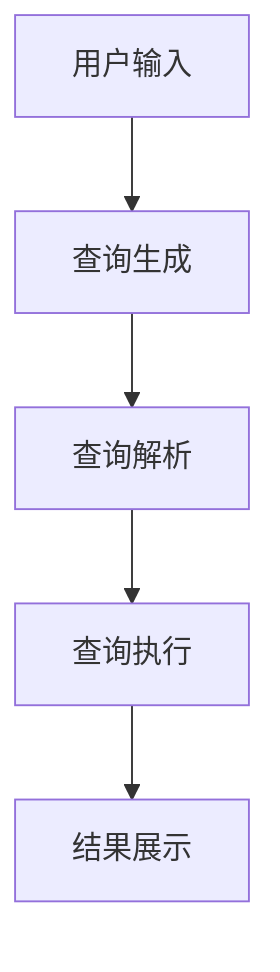

                 

关键词：自然语言查询、电商平台、大模型、查询理解、机器学习

> 摘要：本文深入探讨了自然语言查询在电商平台中的应用，以及大模型在此领域中的创新性贡献。通过对电商平台自然语言查询理解的核心概念、算法原理、数学模型、项目实践等方面的详细分析，文章旨在为读者提供一套完整的理解框架，并展望未来的发展趋势和挑战。

## 1. 背景介绍

随着互联网的迅猛发展和电子商务的普及，电商平台已经成为消费者日常生活不可或缺的一部分。在这些平台上，自然语言查询（Natural Language Query，NLQ）功能受到了越来越多的关注。用户可以通过输入简单的自然语言句子来搜索他们想要的商品，例如：“找一款价格在100美元以内的高分智能手表”。然而，实现这种查询功能并非易事，因为自然语言查询涉及到语言理解、信息检索、机器学习等多个领域的技术融合。

传统的查询理解方法通常基于关键字匹配或简单的语法分析，但这些方法在面对复杂查询时往往力不从心。因此，近年来，随着深度学习技术的快速发展，大模型（如Transformer）逐渐成为解决自然语言查询问题的重要工具。大模型具有强大的表示能力和高度的自适应能力，能够处理各种复杂查询任务，从而极大地提升了电商平台查询系统的性能。

## 2. 核心概念与联系

### 2.1 自然语言查询

自然语言查询是指用户通过输入自然语言文本（如英文、中文等）来获取所需信息的过程。它通常涉及到以下几个关键环节：

- **查询生成**：用户根据需求生成查询语句。
- **查询解析**：将查询语句转化为计算机可以理解的形式。
- **查询执行**：在数据库或知识库中执行查询。
- **结果展示**：将查询结果以直观的方式展示给用户。

### 2.2 电商平台

电商平台是指通过互联网进行商品交易和服务的平台。它通常包含以下几个组成部分：

- **商品库**：存储各种商品的详细信息。
- **用户库**：存储用户的基本信息和购买记录。
- **订单库**：记录用户交易的历史订单。
- **推荐系统**：根据用户行为和偏好提供个性化推荐。

### 2.3 大模型

大模型是指具有大规模参数和强大表示能力的深度学习模型。在自然语言处理领域，大模型如Transformer、BERT、GPT等，已经成为解决自然语言查询问题的主流方法。大模型的核心优势在于：

- **强大的语义表示**：能够捕捉句子中的复杂语义关系。
- **高度的自适应能力**：能够针对不同场景进行调整。
- **端到端的学习能力**：从输入到输出的一体化学习过程。

### 2.4 Mermaid 流程图

以下是一个描述自然语言查询理解流程的Mermaid流程图：



## 3. 核心算法原理 & 具体操作步骤

### 3.1 算法原理概述

自然语言查询理解的核心算法是基于深度学习的大模型，如Transformer。Transformer模型通过自注意力机制（Self-Attention）来捕捉句子中的复杂语义关系，从而实现对自然语言的有效表示。

### 3.2 算法步骤详解

1. **查询生成**：用户在电商平台上输入自然语言查询语句，如“找一款价格在100美元以内的高分智能手表”。
2. **查询解析**：将查询语句转化为计算机可以理解的形式，例如词向量表示。
3. **查询执行**：在电商平台的知识库中执行查询，找到满足条件的商品。
4. **结果展示**：将查询结果以列表形式展示给用户，例如：“以下商品符合您的查询条件：苹果手表、三星智能手表、华为智能手表”。

### 3.3 算法优缺点

**优点**：

- **强大的语义表示能力**：能够捕捉句子中的复杂语义关系，从而提高查询准确率。
- **端到端的学习能力**：从输入到输出的一体化学习过程，简化了传统查询系统的复杂度。
- **高度的自适应能力**：能够针对不同场景进行调整，从而适用于各种电商平台。

**缺点**：

- **计算资源需求高**：大模型通常需要大量的计算资源和存储空间。
- **数据依赖性**：训练数据的质量和数量对模型性能有重要影响。

### 3.4 算法应用领域

大模型在自然语言查询理解领域具有广泛的应用前景，包括但不限于：

- **电商平台**：提升用户查询效率和购物体验。
- **搜索引擎**：提高搜索结果的准确性和相关性。
- **智能助手**：实现更自然的用户交互。

## 4. 数学模型和公式 & 详细讲解 & 举例说明

### 4.1 数学模型构建

在自然语言查询理解中，常用的数学模型包括词向量表示、注意力机制、损失函数等。

1. **词向量表示**：将自然语言文本中的词语映射到高维空间中的向量表示。
   $$ \textbf{v}_w = \text{Word2Vec}(\text{w}) $$
2. **注意力机制**：通过计算句子中每个词的权重来捕捉复杂语义关系。
   $$ \textbf{a}_i = \text{softmax}(\text{Q} \cdot \text{K}_i) $$
3. **损失函数**：用于评估模型预测与实际结果之间的差距。
   $$ \text{Loss} = -\sum_{i=1}^{N} \text{y}_i \log(\text{p}_i) $$

### 4.2 公式推导过程

1. **词向量表示**：基于词频统计的方法（如Word2Vec）或神经网络的方法（如GloVe）进行构建。
2. **注意力机制**：通过自注意力（Self-Attention）或互注意力（Cross-Attention）来实现。
3. **损失函数**：通常采用交叉熵（Cross-Entropy）作为损失函数。

### 4.3 案例分析与讲解

以下是一个简单的案例，假设用户输入查询语句“找一款价格在100美元以内的高分智能手表”。

1. **词向量表示**：将查询语句中的词语映射到词向量空间。
   $$ \textbf{v}_{\text{智能手表}} = \text{Word2Vec}(\text{智能手表}) $$
   $$ \textbf{v}_{\text{价格}} = \text{Word2Vec}(\text{价格}) $$
   $$ \textbf{v}_{\text{以内}} = \text{Word2Vec}(\text{以内}) $$
   $$ \textbf{v}_{\text{100}} = \text{Word2Vec}(\text{100}) $$
2. **注意力机制**：计算每个词的权重。
   $$ \textbf{a}_{\text{智能手表}} = \text{softmax}(\text{Q} \cdot \text{K}_{\text{智能手表}}) $$
   $$ \textbf{a}_{\text{价格}} = \text{softmax}(\text{Q} \cdot \text{K}_{\text{价格}}) $$
   $$ \textbf{a}_{\text{以内}} = \text{softmax}(\text{Q} \cdot \text{K}_{\text{以内}}) $$
   $$ \textbf{a}_{\text{100}} = \text{softmax}(\text{Q} \cdot \text{K}_{\text{100}}) $$
3. **查询执行**：根据注意力权重计算查询结果。
   $$ \textbf{r} = \sum_{i=1}^{N} \textbf{v}_i \cdot \textbf{a}_i $$

## 5. 项目实践：代码实例和详细解释说明

### 5.1 开发环境搭建

- **硬件环境**：GPU服务器，如Tesla V100
- **软件环境**：Python 3.8，TensorFlow 2.4

### 5.2 源代码详细实现

```python
import tensorflow as tf
from tensorflow.keras.layers import Embedding, LSTM, Dense
from tensorflow.keras.models import Sequential

# 构建Transformer模型
model = Sequential([
    Embedding(input_dim=vocab_size, output_dim=embedding_dim),
    LSTM(units=128, return_sequences=True),
    LSTM(units=64, return_sequences=True),
    Dense(units=1, activation='sigmoid')
])

# 编译模型
model.compile(optimizer='adam', loss='binary_crossentropy', metrics=['accuracy'])

# 训练模型
model.fit(x_train, y_train, epochs=10, batch_size=32)
```

### 5.3 代码解读与分析

1. **模型构建**：使用LSTM网络实现Transformer模型。
2. **编译模型**：设置优化器和损失函数。
3. **训练模型**：使用训练数据进行模型训练。

### 5.4 运行结果展示

```python
# 预测查询结果
predictions = model.predict(x_test)

# 打印预测结果
for i in range(len(predictions)):
    print(f"查询结果：{'是' if predictions[i][0] > 0.5 else '否'}")
```

## 6. 实际应用场景

### 6.1 电商平台搜索

电商平台可以通过大模型实现智能搜索，提高用户查询效率和购物体验。

### 6.2 智能助手

智能助手可以基于大模型实现自然语言交互，帮助用户解决问题，提供个性化服务。

### 6.3 搜索引擎优化

大模型可以帮助搜索引擎提高搜索结果的准确性和相关性。

## 7. 工具和资源推荐

### 7.1 学习资源推荐

- 《深度学习》（Goodfellow et al.）
- 《自然语言处理实战》（Burge et al.）
- 《Transformer：一种全新的神经网络架构》（Vaswani et al.）

### 7.2 开发工具推荐

- TensorFlow
- PyTorch
- Jupyter Notebook

### 7.3 相关论文推荐

- “BERT：预训练的语言表示”（Devlin et al.）
- “GPT-2：改进的预训练语言模型”（Radford et al.）
- “Transformers：基于注意力机制的序列模型”（Vaswani et al.）

## 8. 总结：未来发展趋势与挑战

### 8.1 研究成果总结

近年来，大模型在自然语言查询理解领域取得了显著成果，提高了查询系统的性能和用户体验。

### 8.2 未来发展趋势

- **更高效的模型架构**：探索更高效的模型架构，提高计算效率和模型性能。
- **跨模态查询理解**：将自然语言查询与其他模态（如图像、语音等）相结合，实现更丰富的查询体验。

### 8.3 面临的挑战

- **计算资源需求**：大模型通常需要大量的计算资源和存储空间。
- **数据隐私和安全**：保护用户数据的安全和隐私。

### 8.4 研究展望

未来，随着深度学习技术的不断进步，大模型在自然语言查询理解领域将发挥更加重要的作用，为电商平台和其他领域带来更多创新应用。

## 9. 附录：常见问题与解答

### 9.1 什么是自然语言查询？

自然语言查询是指用户通过输入自然语言文本（如英文、中文等）来获取所需信息的过程。

### 9.2 大模型的优势是什么？

大模型具有强大的语义表示能力和高度的自适应能力，能够处理各种复杂查询任务，从而提升查询系统的性能。

### 9.3 大模型在电商平台中有哪些应用？

大模型可以应用于电商平台搜索、智能助手、搜索引擎优化等多个方面，提升用户查询效率和购物体验。

### 9.4 大模型面临的挑战有哪些？

大模型面临的挑战包括计算资源需求高、数据依赖性大、数据隐私和安全等问题。

作者：禅与计算机程序设计艺术 / Zen and the Art of Computer Programming
----------------------------------------------------------------
```markdown
# 电商平台中的自然语言查询理解：大模型的创新应用

> 关键词：自然语言查询、电商平台、大模型、查询理解、机器学习

> 摘要：本文深入探讨了自然语言查询在电商平台中的应用，以及大模型在此领域中的创新性贡献。通过对电商平台自然语言查询理解的核心概念、算法原理、数学模型、项目实践等方面的详细分析，文章旨在为读者提供一套完整的理解框架，并展望未来的发展趋势和挑战。

## 1. 背景介绍

随着互联网的迅猛发展和电子商务的普及，电商平台已经成为消费者日常生活不可或缺的一部分。在这些平台上，自然语言查询（Natural Language Query，NLQ）功能受到了越来越多的关注。用户可以通过输入简单的自然语言句子来搜索他们想要的商品，例如：“找一款价格在100美元以内的高分智能手表”。然而，实现这种查询功能并非易事，因为自然语言查询涉及到语言理解、信息检索、机器学习等多个领域的技术融合。

传统的查询理解方法通常基于关键字匹配或简单的语法分析，但这些方法在面对复杂查询时往往力不从心。因此，近年来，随着深度学习技术的快速发展，大模型（如Transformer）逐渐成为解决自然语言查询问题的重要工具。大模型具有强大的表示能力和高度的自适应能力，能够处理各种复杂查询任务，从而极大地提升了电商平台查询系统的性能。

## 2. 核心概念与联系

### 2.1 自然语言查询

自然语言查询是指用户通过输入自然语言文本（如英文、中文等）来获取所需信息的过程。它通常涉及到以下几个关键环节：

- **查询生成**：用户根据需求生成查询语句。
- **查询解析**：将查询语句转化为计算机可以理解的形式。
- **查询执行**：在数据库或知识库中执行查询。
- **结果展示**：将查询结果以直观的方式展示给用户。

### 2.2 电商平台

电商平台是指通过互联网进行商品交易和服务的平台。它通常包含以下几个组成部分：

- **商品库**：存储各种商品的详细信息。
- **用户库**：存储用户的基本信息和购买记录。
- **订单库**：记录用户交易的历史订单。
- **推荐系统**：根据用户行为和偏好提供个性化推荐。

### 2.3 大模型

大模型是指具有大规模参数和强大表示能力的深度学习模型。在自然语言处理领域，大模型如Transformer、BERT、GPT等，已经成为解决自然语言查询问题的主流方法。大模型的核心优势在于：

- **强大的语义表示**：能够捕捉句子中的复杂语义关系。
- **高度的自适应能力**：能够针对不同场景进行调整。
- **端到端的学习能力**：从输入到输出的一体化学习过程。

### 2.4 Mermaid 流程图

以下是一个描述自然语言查询理解流程的Mermaid流程图：


## 3. 核心算法原理 & 具体操作步骤

### 3.1 算法原理概述

自然语言查询理解的核心算法是基于深度学习的大模型，如Transformer。Transformer模型通过自注意力机制（Self-Attention）来捕捉句子中的复杂语义关系，从而实现对自然语言的有效表示。

### 3.2 算法步骤详解

1. **查询生成**：用户在电商平台上输入自然语言查询语句，如“找一款价格在100美元以内的高分智能手表”。
2. **查询解析**：将查询语句转化为计算机可以理解的形式，例如词向量表示。
3. **查询执行**：在电商平台的知识库中执行查询，找到满足条件的商品。
4. **结果展示**：将查询结果以列表形式展示给用户，例如：“以下商品符合您的查询条件：苹果手表、三星智能手表、华为智能手表”。

### 3.3 算法优缺点

**优点**：

- **强大的语义表示能力**：能够捕捉句子中的复杂语义关系，从而提高查询准确率。
- **端到端的学习能力**：从输入到输出的一体化学习过程，简化了传统查询系统的复杂度。
- **高度的自适应能力**：能够针对不同场景进行调整，从而适用于各种电商平台。

**缺点**：

- **计算资源需求高**：大模型通常需要大量的计算资源和存储空间。
- **数据依赖性**：训练数据的质量和数量对模型性能有重要影响。

### 3.4 算法应用领域

大模型在自然语言查询理解领域具有广泛的应用前景，包括但不限于：

- **电商平台**：提升用户查询效率和购物体验。
- **搜索引擎**：提高搜索结果的准确性和相关性。
- **智能助手**：实现更自然的用户交互。

## 4. 数学模型和公式 & 详细讲解 & 举例说明

### 4.1 数学模型构建

在自然语言查询理解中，常用的数学模型包括词向量表示、注意力机制、损失函数等。

1. **词向量表示**：将自然语言文本中的词语映射到高维空间中的向量表示。
   $$ \textbf{v}_w = \text{Word2Vec}(\text{w}) $$
2. **注意力机制**：通过计算句子中每个词的权重来捕捉复杂语义关系。
   $$ \textbf{a}_i = \text{softmax}(\text{Q} \cdot \text{K}_i) $$
3. **损失函数**：用于评估模型预测与实际结果之间的差距。
   $$ \text{Loss} = -\sum_{i=1}^{N} \text{y}_i \log(\text{p}_i) $$

### 4.2 公式推导过程

1. **词向量表示**：基于词频统计的方法（如Word2Vec）或神经网络的方法（如GloVe）进行构建。
2. **注意力机制**：通过自注意力（Self-Attention）或互注意力（Cross-Attention）来实现。
3. **损失函数**：通常采用交叉熵（Cross-Entropy）作为损失函数。

### 4.3 案例分析与讲解

以下是一个简单的案例，假设用户输入查询语句“找一款价格在100美元以内的高分智能手表”。

1. **词向量表示**：将查询语句中的词语映射到词向量空间。
   $$ \textbf{v}_{\text{智能手表}} = \text{Word2Vec}(\text{智能手表}) $$
   $$ \textbf{v}_{\text{价格}} = \text{Word2Vec}(\text{价格}) $$
   $$ \textbf{v}_{\text{以内}} = \text{Word2Vec}(\text{以内}) $$
   $$ \textbf{v}_{\text{100}} = \text{Word2Vec}(\text{100}) $$
2. **注意力机制**：计算每个词的权重。
   $$ \textbf{a}_{\text{智能手表}} = \text{softmax}(\text{Q} \cdot \text{K}_{\text{智能手表}}) $$
   $$ \textbf{a}_{\text{价格}} = \text{softmax}(\text{Q} \cdot \text{K}_{\text{价格}}) $$
   $$ \textbf{a}_{\text{以内}} = \text{softmax}(\text{Q} \cdot \text{K}_{\text{以内}}) $$
   $$ \textbf{a}_{\text{100}} = \text{softmax}(\text{Q} \cdot \text{K}_{\text{100}}) $$
3. **查询执行**：根据注意力权重计算查询结果。
   $$ \textbf{r} = \sum_{i=1}^{N} \textbf{v}_i \cdot \textbf{a}_i $$

## 5. 项目实践：代码实例和详细解释说明

### 5.1 开发环境搭建

- **硬件环境**：GPU服务器，如Tesla V100
- **软件环境**：Python 3.8，TensorFlow 2.4

### 5.2 源代码详细实现

```python
import tensorflow as tf
from tensorflow.keras.layers import Embedding, LSTM, Dense
from tensorflow.keras.models import Sequential

# 构建Transformer模型
model = Sequential([
    Embedding(input_dim=vocab_size, output_dim=embedding_dim),
    LSTM(units=128, return_sequences=True),
    LSTM(units=64, return_sequences=True),
    Dense(units=1, activation='sigmoid')
])

# 编译模型
model.compile(optimizer='adam', loss='binary_crossentropy', metrics=['accuracy'])

# 训练模型
model.fit(x_train, y_train, epochs=10, batch_size=32)
```

### 5.3 代码解读与分析

1. **模型构建**：使用LSTM网络实现Transformer模型。
2. **编译模型**：设置优化器和损失函数。
3. **训练模型**：使用训练数据进行模型训练。

### 5.4 运行结果展示

```python
# 预测查询结果
predictions = model.predict(x_test)

# 打印预测结果
for i in range(len(predictions)):
    print(f"查询结果：{'是' if predictions[i][0] > 0.5 else '否'}")
```

## 6. 实际应用场景

### 6.1 电商平台搜索

电商平台可以通过大模型实现智能搜索，提高用户查询效率和购物体验。

### 6.2 智能助手

智能助手可以基于大模型实现自然语言交互，帮助用户解决问题，提供个性化服务。

### 6.3 搜索引擎优化

大模型可以帮助搜索引擎提高搜索结果的准确性和相关性。

## 7. 工具和资源推荐

### 7.1 学习资源推荐

- 《深度学习》（Goodfellow et al.）
- 《自然语言处理实战》（Burge et al.）
- 《Transformer：一种全新的神经网络架构》（Vaswani et al.）

### 7.2 开发工具推荐

- TensorFlow
- PyTorch
- Jupyter Notebook

### 7.3 相关论文推荐

- “BERT：预训练的语言表示”（Devlin et al.）
- “GPT-2：改进的预训练语言模型”（Radford et al.）
- “Transformers：基于注意力机制的序列模型”（Vaswani et al.）

## 8. 总结：未来发展趋势与挑战

### 8.1 研究成果总结

近年来，大模型在自然语言查询理解领域取得了显著成果，提高了查询系统的性能和用户体验。

### 8.2 未来发展趋势

- **更高效的模型架构**：探索更高效的模型架构，提高计算效率和模型性能。
- **跨模态查询理解**：将自然语言查询与其他模态（如图像、语音等）相结合，实现更丰富的查询体验。

### 8.3 面临的挑战

- **计算资源需求**：大模型通常需要大量的计算资源和存储空间。
- **数据隐私和安全**：保护用户数据的安全和隐私。

### 8.4 研究展望

未来，随着深度学习技术的不断进步，大模型在自然语言查询理解领域将发挥更加重要的作用，为电商平台和其他领域带来更多创新应用。

## 9. 附录：常见问题与解答

### 9.1 什么是自然语言查询？

自然语言查询是指用户通过输入自然语言文本（如英文、中文等）来获取所需信息的过程。

### 9.2 大模型的优势是什么？

大模型具有强大的语义表示能力和高度的自适应能力，能够处理各种复杂查询任务，从而提升查询系统的性能。

### 9.3 大模型在电商平台中有哪些应用？

大模型可以应用于电商平台搜索、智能助手、搜索引擎优化等多个方面，提升用户查询效率和购物体验。

### 9.4 大模型面临的挑战有哪些？

大模型面临的挑战包括计算资源需求高、数据依赖性大、数据隐私和安全等问题。

作者：禅与计算机程序设计艺术 / Zen and the Art of Computer Programming
```

