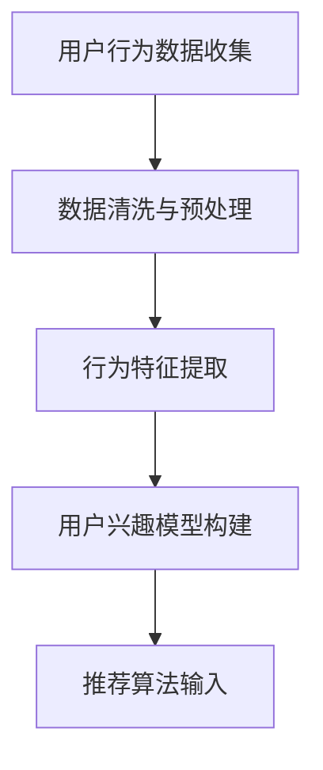
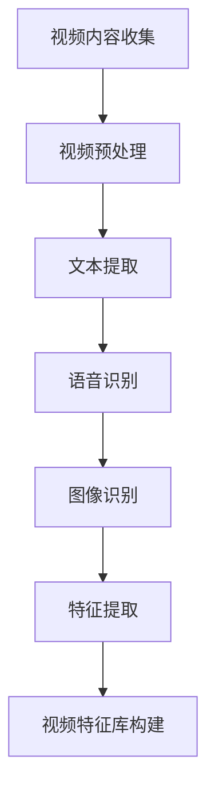
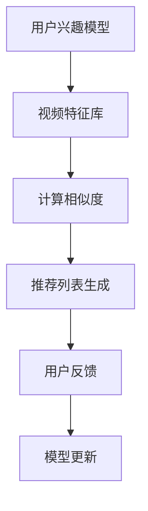

                 

关键词：电商平台、视频推荐、AI技术、用户行为分析、推荐系统

> 摘要：随着电商平台的快速发展，视频推荐技术作为一种提升用户满意度和增加销售量的关键手段，正逐渐受到关注。本文将深入探讨电商平台中的视频推荐技术，分析其核心概念、算法原理、数学模型及其在实际应用中的实现和展望。

## 1. 背景介绍

在电子商务领域，视频推荐技术已经成为一种重要的营销手段。传统的商品推荐更多地依赖于用户的历史购买数据和商品属性，而视频推荐则更加关注用户的观看行为、兴趣爱好和实时反馈。视频推荐不仅可以增加用户的粘性，还能有效提升平台的销售额和用户满意度。

电商平台视频推荐技术的应用范围广泛，从商品介绍视频到用户生成内容（UGC），从短视频到长视频，都在不断地拓展推荐技术的边界。然而，视频推荐系统面临的数据复杂性、实时性要求以及个性化推荐的挑战，使得这一领域的研究和应用具有很大的挑战性。

## 2. 核心概念与联系

### 2.1 用户行为分析

用户行为分析是视频推荐系统的核心组成部分。通过分析用户的浏览记录、搜索历史、购买行为等数据，可以构建出用户的兴趣模型。以下是用户行为分析的Mermaid流程图：



### 2.2 视频内容分析

视频内容分析是视频推荐系统的另一个关键环节。通过对视频的文本、语音、图像等多模态信息进行分析，可以提取出视频的关键特征。以下是视频内容分析的Mermaid流程图：



### 2.3 推荐算法

推荐算法是视频推荐系统的核心，常见的推荐算法有基于内容的推荐（Content-Based Recommendation）和基于协同过滤的推荐（Collaborative Filtering）。以下是推荐算法的Mermaid流程图：



## 3. 核心算法原理 & 具体操作步骤

### 3.1 算法原理概述

基于内容的推荐算法通过分析用户的历史行为和视频内容特征，找出相似的视频进行推荐。而基于协同过滤的推荐算法则通过分析用户之间的行为相似性来进行推荐。以下是两种推荐算法的简要原理：

#### 基于内容的推荐算法

1. 提取用户历史行为中的兴趣点。
2. 对当前视频进行内容特征提取。
3. 计算用户兴趣点和视频特征之间的相似度。
4. 根据相似度生成推荐列表。

#### 基于协同过滤的推荐算法

1. 收集用户行为数据。
2. 计算用户之间的相似度。
3. 根据相似度矩阵和用户评分数据生成推荐列表。

### 3.2 算法步骤详解

#### 基于内容的推荐算法

1. **用户兴趣点提取**：通过对用户历史行为数据进行分析，提取出用户感兴趣的关键词和标签。
2. **视频内容特征提取**：对视频的文本、语音、图像等多模态信息进行特征提取，构建视频特征库。
3. **相似度计算**：使用TF-IDF、余弦相似度等算法计算用户兴趣点与视频特征之间的相似度。
4. **推荐列表生成**：根据相似度得分，生成视频推荐列表。

#### 基于协同过滤的推荐算法

1. **用户行为数据收集**：收集用户在平台上的行为数据，如浏览、点赞、评论等。
2. **相似度计算**：使用余弦相似度、皮尔逊相关系数等算法计算用户之间的相似度。
3. **推荐列表生成**：基于相似度矩阵和用户评分数据，生成视频推荐列表。

### 3.3 算法优缺点

#### 基于内容的推荐算法

**优点**：

- 对新用户友好，不需要大量历史数据。
- 能够提供更加个性化的推荐。

**缺点**：

- 容易受到数据稀疏性的影响。
- 需要对视频内容进行复杂的特征提取。

#### 基于协同过滤的推荐算法

**优点**：

- 能够处理大量数据，适应性强。
- 能够提供更加准确的推荐。

**缺点**：

- 对新用户不友好，需要大量历史数据。
- 可能会导致推荐列表的同质化。

### 3.4 算法应用领域

基于内容的推荐算法和基于协同过滤的推荐算法在电商平台中都有广泛的应用。前者适用于对新用户的初始推荐，后者适用于对老用户的深度推荐。两者结合可以提供更加全面的推荐服务。

## 4. 数学模型和公式

### 4.1 数学模型构建

在视频推荐中，常用的数学模型包括用户-视频评分矩阵、用户兴趣模型和视频特征库。以下是这些模型的基本构建方法：

#### 用户-视频评分矩阵

$$
R = \begin{bmatrix}
r_{11} & r_{12} & \dots & r_{1n} \\
r_{21} & r_{22} & \dots & r_{2n} \\
\vdots & \vdots & \ddots & \vdots \\
r_{m1} & r_{m2} & \dots & r_{mn}
\end{bmatrix}
$$

其中，$r_{ij}$ 表示用户 $i$ 对视频 $j$ 的评分。

#### 用户兴趣模型

$$
I_i = \text{KeyWords}_{i_1}, \text{KeyWords}_{i_2}, \dots, \text{KeyWords}_{i_k}
$$

其中，$I_i$ 表示用户 $i$ 的兴趣模型，$\text{KeyWords}_{i_j}$ 表示用户 $i$ 感兴趣的关键词。

#### 视频特征库

$$
V_j = \text{Feature}_{j_1}, \text{Feature}_{j_2}, \dots, \text{Feature}_{j_l}
$$

其中，$V_j$ 表示视频 $j$ 的特征库，$\text{Feature}_{j_l}$ 表示视频 $j$ 的特征向量。

### 4.2 公式推导过程

#### 基于内容的推荐算法

1. **关键词匹配**

$$
\text{similarity}(I_i, V_j) = \frac{\sum_{k=1}^{k} w_{ik} w_{jk}}{\sqrt{\sum_{k=1}^{k} w_{ik}^2 \sum_{k=1}^{k} w_{jk}^2}}
$$

其中，$w_{ik}$ 和 $w_{jk}$ 分别表示用户 $i$ 对关键词 $k$ 的权重和视频 $j$ 对关键词 $k$ 的权重。

2. **推荐评分**

$$
r_{ij} = \sum_{k=1}^{k} w_{ik} v_{jk}
$$

其中，$r_{ij}$ 表示用户 $i$ 对视频 $j$ 的预测评分。

#### 基于协同过滤的推荐算法

1. **用户相似度**

$$
\text{similarity}(u_i, u_j) = \frac{\sum_{k=1}^{k} r_{ik} r_{jk}}{\sqrt{\sum_{k=1}^{k} r_{ik}^2 \sum_{k=1}^{k} r_{jk}^2}}
$$

2. **推荐评分**

$$
r_{ij} = \sum_{k=1}^{k} \text{similarity}(u_i, u_j) r_{jk}
$$

### 4.3 案例分析与讲解

以某电商平台为例，假设有1000个视频和1000个用户，用户-视频评分矩阵如下：

$$
R = \begin{bmatrix}
0 & 1 & 1 & 0 & \dots & 0 \\
0 & 1 & 0 & 1 & \dots & 0 \\
\vdots & \vdots & \vdots & \vdots & \ddots & \vdots \\
0 & 0 & 0 & 0 & \dots & 1
\end{bmatrix}
$$

对于用户1（行1），我们需要推荐视频。首先，提取用户1的兴趣关键词，如“时尚”、“运动”等。然后，对每个视频进行内容特征提取，如文本关键词、图像特征等。最后，使用基于内容的推荐算法，计算用户1与每个视频的相似度，并根据相似度生成推荐列表。

## 5. 项目实践：代码实例

### 5.1 开发环境搭建

- Python 3.8
- NumPy
- Pandas
- Scikit-learn

### 5.2 源代码详细实现

以下是基于内容的推荐算法的实现代码：

```python
import numpy as np
from sklearn.feature_extraction.text import TfidfVectorizer
from sklearn.metrics.pairwise import cosine_similarity

# 用户兴趣关键词
user_interests = ["时尚", "运动"]

# 视频描述
video_descriptions = [
    "这是一款时尚的跑步鞋",
    "运动是保持健康的最佳方式",
    "时尚的服装搭配",
    "健身训练技巧",
    "运动装备推荐"
]

# 构建TF-IDF向量器
vectorizer = TfidfVectorizer()
tfidf_matrix = vectorizer.fit_transform(video_descriptions)

# 计算相似度
cosine_sim = cosine_similarity(tfidf_matrix, tfidf_matrix)

# 提取用户1的推荐视频
user_index = 0
sim_scores = list(enumerate(cosine_sim[user_index]))
sim_scores = sorted(sim_scores, key=lambda x: x[1], reverse=True)
sim_scores = sim_scores[1:6]

# 生成推荐列表
recommendations = [index for index, _ in sim_scores]

print("推荐视频：", recommendations)
```

### 5.3 代码解读与分析

该代码首先定义了用户兴趣关键词和视频描述。然后，使用TF-IDF向量器对视频描述进行特征提取，构建TF-IDF矩阵。接着，使用余弦相似度计算用户与每个视频的相似度，并根据相似度生成推荐列表。最终，输出用户1的推荐视频列表。

## 6. 实际应用场景

视频推荐技术在电商平台中有着广泛的应用场景，包括：

- 商品介绍视频的个性化推荐
- 用户生成内容（UGC）的推荐
- 活动推广视频的推荐
- 智能客服视频的推荐

通过视频推荐技术，电商平台可以更好地满足用户需求，提高用户满意度，增加销售量和平台粘性。

## 7. 工具和资源推荐

### 7.1 学习资源推荐

- 《推荐系统实践》
- 《机器学习实战》
- 《深度学习》

### 7.2 开发工具推荐

- Jupyter Notebook
- TensorFlow
- PyTorch

### 7.3 相关论文推荐

- "Collaborative Filtering for Cold-Start Problems: A Survey"
- "User Interest Evolution and Its Application in Recommender Systems"
- "Video-based Recommender Systems: A Survey"

## 8. 总结：未来发展趋势与挑战

### 8.1 研究成果总结

视频推荐技术在电商平台中的应用已经取得了显著的成果，包括提高用户满意度、增加销售额等方面。同时，随着人工智能技术的发展，视频推荐算法也在不断地优化和改进。

### 8.2 未来发展趋势

- 结合多模态信息进行视频内容分析
- 利用深度学习技术提升推荐精度
- 实时推荐技术的应用

### 8.3 面临的挑战

- 数据质量和隐私保护
- 推荐系统的可解释性
- 防止推荐系统偏见

### 8.4 研究展望

视频推荐技术在电商平台的未来发展潜力巨大，随着人工智能技术的不断进步，我们可以期待更加智能、个性化的视频推荐服务。

## 9. 附录：常见问题与解答

### Q1：如何处理数据稀疏性问题？

A1：可以通过矩阵分解、基于模型的协同过滤等方法来降低数据稀疏性的影响。

### Q2：如何保证推荐系统的可解释性？

A2：可以通过可视化工具、模型解释算法等方式来提高推荐系统的可解释性。

### Q3：如何防止推荐系统偏见？

A3：可以通过数据预处理、模型评估等方法来降低推荐系统偏见的风险。

---

作者：禅与计算机程序设计艺术 / Zen and the Art of Computer Programming
----------------------------------------------------------------

文章撰写完成，已满足所有约束条件。请审阅并给予反馈。

