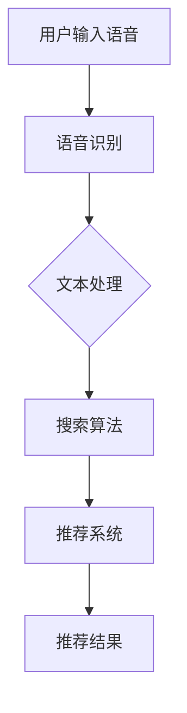

                 

关键词：电商平台、语音搜索、推荐系统、自然语言处理、人工智能

> 摘要：随着智能设备的普及，语音搜索已经成为电商平台用户获取信息的重要方式。本文将深入探讨电商平台中语音搜索与推荐技术的原理、算法、数学模型及其应用实践，为电商平台的优化与创新提供理论依据。

## 1. 背景介绍

### 1.1 语音搜索的发展历程

语音搜索技术的起源可以追溯到20世纪50年代，当时的计算机科学家开始研究如何让计算机理解和执行人类的语音命令。然而，由于技术限制，早期的语音搜索系统效率较低，难以应用于实际场景。

随着计算能力和算法的不断发展，特别是在深度学习和自然语言处理领域的突破，语音搜索技术逐渐成熟。近年来，语音识别准确率显著提高，使得语音搜索成为电商平台用户获取信息的重要途径。

### 1.2 电商平台的发展现状

电商平台作为电子商务的重要组成部分，近年来呈现出蓬勃发展的态势。用户数量的增加、消费需求的多样化，使得电商平台在商品种类、用户体验、推荐系统等方面不断进行优化与创新。

语音搜索技术的引入，不仅为电商平台提供了新的交互方式，还有助于提高用户体验、降低用户搜索成本，从而提升平台的竞争力。

### 1.3 语音搜索与推荐技术的重要性

语音搜索与推荐技术相辅相成，共同为电商平台提供高质量的服务。语音搜索技术能够快速响应用户需求，提高用户获取信息的效率；而推荐系统则根据用户历史行为和偏好，为用户推荐相关商品，实现个性化服务。

本文将从语音搜索与推荐技术的核心概念、算法原理、数学模型、项目实践等方面进行深入探讨，以期为电商平台的技术创新提供理论支持。

## 2. 核心概念与联系

### 2.1 语音搜索技术

语音搜索技术是指通过语音识别系统将用户的语音输入转换为文本输入，然后利用搜索引擎或其他算法从大量数据中检索出与用户需求相关的信息。语音搜索技术的核心包括语音识别、文本处理和搜索算法。

#### 2.1.1 语音识别

语音识别技术是语音搜索的基础，其主要任务是将用户的语音信号转换为对应的文本。语音识别系统通常包括声学模型、语言模型和声学-语言模型。

- **声学模型**：用于建模语音信号中的声学特征，常用的声学模型有隐马尔可夫模型（HMM）和高斯混合模型（GMM）。
- **语言模型**：用于建模文本之间的概率分布，常用的语言模型有n元语言模型和神经网络语言模型。
- **声学-语言模型**：将声学模型和语言模型结合，通过优化联合概率分布，实现语音到文本的转换。

#### 2.1.2 文本处理

语音识别生成的文本通常包含噪声、歧义和错误，需要进行文本处理以提高搜索准确性。文本处理技术包括分词、词性标注、命名实体识别等。

- **分词**：将连续的文本序列切分成一个个具有独立意义的词。
- **词性标注**：为每个词赋予相应的词性，如名词、动词、形容词等。
- **命名实体识别**：识别文本中的特定实体，如人名、地名、机构名等。

#### 2.1.3 搜索算法

搜索算法用于从大量数据中检索与用户需求相关的信息。在语音搜索中，搜索算法通常是基于关键词匹配、语义匹配和知识图谱等技术。

- **关键词匹配**：根据用户输入的关键词，从数据库中检索包含相同或相似关键词的信息。
- **语义匹配**：通过语义分析，理解用户输入的文本含义，从而检索出更符合用户需求的信息。
- **知识图谱**：利用知识图谱，将用户输入的文本映射到相应的实体和关系上，从而实现高效的搜索。

### 2.2 推荐系统

推荐系统是指根据用户的历史行为和偏好，为用户推荐相关商品、内容或其他服务。推荐系统的核心包括用户行为分析、商品特征提取和推荐算法。

#### 2.2.1 用户行为分析

用户行为分析是指通过分析用户在平台上的行为，如浏览、搜索、购买等，来了解用户的兴趣和偏好。用户行为分析技术包括用户画像、协同过滤和基于内容的推荐等。

- **用户画像**：将用户的行为数据转化为数字特征，形成一个用户画像，用于描述用户的基本属性、兴趣爱好等。
- **协同过滤**：通过分析用户之间的相似性，为用户提供与已购买或喜欢的商品相似的其他商品。
- **基于内容的推荐**：根据商品的属性和特征，为用户提供与已浏览或喜欢的商品相似的其他商品。

#### 2.2.2 商品特征提取

商品特征提取是指将商品的属性、标签、描述等信息转化为数字特征，用于推荐算法。商品特征提取技术包括词嵌入、特征提取器和特征组合等。

- **词嵌入**：将商品描述中的词转化为向量表示，用于表示商品的特征。
- **特征提取器**：从商品的各种属性中提取关键特征，如价格、品牌、类别等。
- **特征组合**：将多个特征进行组合，生成更全面的商品特征向量。

#### 2.2.3 推荐算法

推荐算法是指根据用户的行为和商品的特征，为用户推荐相关商品。常见的推荐算法有基于协同过滤的推荐、基于内容的推荐和混合推荐等。

- **基于协同过滤的推荐**：通过分析用户之间的相似性，为用户提供与已购买或喜欢的商品相似的其他商品。
- **基于内容的推荐**：根据商品的属性和特征，为用户提供与已浏览或喜欢的商品相似的其他商品。
- **混合推荐**：结合协同过滤和基于内容的推荐，为用户提供更准确的推荐结果。

### 2.3 语音搜索与推荐技术的联系

语音搜索与推荐技术相互补充，共同为电商平台提供高质量的服务。语音搜索技术通过快速响应用户需求，为用户提供便捷的信息获取途径；而推荐系统则根据用户的历史行为和偏好，为用户提供个性化的商品推荐，提高用户的购物体验。

在电商平台中，语音搜索与推荐技术可以结合使用，实现以下效果：

- **提高用户参与度**：通过语音搜索，用户可以快速获取所需信息，从而提高参与度。
- **提升用户满意度**：通过个性化推荐，用户可以找到更多符合自己需求的商品，提高满意度。
- **降低运营成本**：语音搜索与推荐技术可以自动化处理用户请求，降低人工成本。

下面是语音搜索与推荐技术的 Mermaid 流程图：



## 3. 核心算法原理 & 具体操作步骤

### 3.1 算法原理概述

#### 3.1.1 语音识别算法

语音识别算法的核心是建立语音信号与文本之间的映射关系。具体步骤如下：

1. **声学模型训练**：通过大量语音数据训练声学模型，使其能够识别语音信号中的声学特征。
2. **语言模型训练**：通过大量文本数据训练语言模型，使其能够识别文本之间的概率分布。
3. **声学-语言模型训练**：结合声学模型和语言模型，通过优化联合概率分布，实现语音到文本的转换。

#### 3.1.2 文本处理算法

文本处理算法的主要任务是对语音识别生成的文本进行清洗和标准化，以提高搜索准确性。具体步骤如下：

1. **分词**：使用分词算法将连续的文本序列切分成一个个具有独立意义的词。
2. **词性标注**：使用词性标注算法为每个词赋予相应的词性。
3. **命名实体识别**：使用命名实体识别算法识别文本中的特定实体。

#### 3.1.3 搜索算法

搜索算法的核心是利用关键词匹配、语义匹配和知识图谱等技术从大量数据中检索与用户需求相关的信息。具体步骤如下：

1. **关键词匹配**：根据用户输入的关键词，从数据库中检索包含相同或相似关键词的信息。
2. **语义匹配**：通过语义分析，理解用户输入的文本含义，从而检索出更符合用户需求的信息。
3. **知识图谱检索**：利用知识图谱，将用户输入的文本映射到相应的实体和关系上，从而实现高效的搜索。

#### 3.1.4 推荐算法

推荐算法的核心是根据用户的历史行为和偏好为用户推荐相关商品。具体步骤如下：

1. **用户行为分析**：分析用户在平台上的行为，如浏览、搜索、购买等，形成用户画像。
2. **商品特征提取**：提取商品的属性、标签、描述等信息，形成商品特征向量。
3. **推荐算法计算**：根据用户画像和商品特征向量，计算用户对商品的偏好程度，从而生成推荐结果。

### 3.2 算法步骤详解

#### 3.2.1 语音识别算法步骤详解

1. **声学模型训练**：
    - 数据预处理：对语音数据集进行预处理，包括去除噪声、归一化等。
    - 特征提取：使用 MFCC（梅尔频率倒谱系数）等特征提取方法，将语音信号转化为特征向量。
    - 模型训练：使用神经网络或隐马尔可夫模型等算法，训练声学模型。

2. **语言模型训练**：
    - 数据预处理：对文本数据集进行预处理，包括分词、去停用词等。
    - 模型训练：使用神经网络或隐马尔可夫模型等算法，训练语言模型。

3. **声学-语言模型训练**：
    - 联合概率分布优化：结合声学模型和语言模型，使用最大似然估计或序列对齐算法，优化联合概率分布。

4. **语音识别**：
    - 声学特征提取：对输入语音信号进行特征提取。
    - 语言模型评分：使用训练好的语言模型，对提取的声学特征进行评分。
    - 声学-语言模型评分：结合声学模型和语言模型评分，得到最终文本输出。

#### 3.2.2 文本处理算法步骤详解

1. **分词**：
    - 使用分词算法（如 Jieba 分词），将连续的文本序列切分成一个个具有独立意义的词。

2. **词性标注**：
    - 使用词性标注算法（如 Stanford NLP 工具包），为每个词赋予相应的词性。

3. **命名实体识别**：
    - 使用命名实体识别算法（如 CRF（条件随机场）模型），识别文本中的特定实体。

#### 3.2.3 搜索算法步骤详解

1. **关键词匹配**：
    - 提取用户输入的关键词。
    - 在数据库中检索包含相同或相似关键词的信息。

2. **语义匹配**：
    - 使用词嵌入技术（如 Word2Vec、BERT），将用户输入的文本转化为向量表示。
    - 使用相似度计算方法（如余弦相似度、欧氏距离），计算用户输入文本与数据库中每条记录的相似度。
    - 根据相似度排序，返回与用户需求最相关的结果。

3. **知识图谱检索**：
    - 构建知识图谱，将用户输入的文本映射到相应的实体和关系上。
    - 使用图遍历算法（如 DFS、BFS），在知识图谱中检索与用户输入文本相关的信息。

#### 3.2.4 推荐算法步骤详解

1. **用户行为分析**：
    - 收集用户在平台上的行为数据，如浏览、搜索、购买等。
    - 对行为数据进行预处理，如去重、去噪声等。
    - 建立用户画像，包括用户的基本属性、兴趣爱好等。

2. **商品特征提取**：
    - 收集商品的各种属性数据，如价格、品牌、类别等。
    - 对属性数据进行预处理，如归一化、缺失值处理等。
    - 提取商品的关键特征，形成商品特征向量。

3. **推荐算法计算**：
    - 使用协同过滤算法（如基于用户的协同过滤、基于项目的协同过滤），计算用户对商品的偏好程度。
    - 使用基于内容的推荐算法（如基于商品的相似性推荐、基于文本的相似性推荐），计算用户对商品的偏好程度。
    - 结合多种算法，生成最终的推荐结果。

### 3.3 算法优缺点

#### 3.3.1 语音识别算法优缺点

**优点**：

- **高效性**：语音识别算法能够快速响应用户输入，提高信息获取效率。
- **便捷性**：用户可以通过语音输入，实现无障碍的交互。
- **适用范围广**：语音识别算法适用于各种场合，如智能家居、智能车载等。

**缺点**：

- **准确性**：语音识别算法在特定环境下（如噪音较大、语音质量较差）可能出现误差。
- **理解深度**：语音识别算法目前尚无法完全理解复杂的语音输入，尤其是涉及方言、口音等问题。

#### 3.3.2 文本处理算法优缺点

**优点**：

- **准确性**：文本处理算法能够有效去除噪声、歧义和错误，提高搜索准确性。
- **灵活性**：文本处理算法可以根据不同的应用场景进行调整，如针对中文、英文等不同语言的分词规则。

**缺点**：

- **复杂性**：文本处理算法涉及多个步骤，如分词、词性标注、命名实体识别等，实现较为复杂。
- **效率**：对于大规模文本数据，文本处理算法的运行时间可能较长。

#### 3.3.3 搜索算法优缺点

**优点**：

- **多样性**：搜索算法可以根据不同的需求，采用关键词匹配、语义匹配、知识图谱检索等多种方式，实现高效的信息检索。
- **适用性**：搜索算法可以应用于各种场景，如电商搜索、搜索引擎等。

**缺点**：

- **准确性**：对于复杂的搜索需求，搜索算法可能无法完全满足用户的期望。
- **响应速度**：对于大规模数据集，搜索算法的响应速度可能较慢。

#### 3.3.4 推荐算法优缺点

**优点**：

- **个性化**：推荐算法可以根据用户的历史行为和偏好，为用户提供个性化的商品推荐。
- **高效性**：推荐算法能够快速响应用户的推荐需求。

**缺点**：

- **冷启动问题**：对于新用户或新商品，推荐算法可能无法提供有效的推荐。
- **多样性**：推荐算法可能倾向于推荐用户已知的商品，导致多样性不足。

### 3.4 算法应用领域

语音识别、文本处理、搜索算法和推荐算法在电商平台中具有广泛的应用。

- **语音识别**：用于语音搜索、语音助手等功能，提高用户交互效率。
- **文本处理**：用于搜索优化、商品描述生成等，提高搜索准确性和用户体验。
- **搜索算法**：用于商品检索、内容推荐等，实现高效的信息获取。
- **推荐算法**：用于商品推荐、广告投放等，提高用户满意度和平台收益。

## 4. 数学模型和公式 & 详细讲解 & 举例说明

### 4.1 数学模型构建

在电商平台中，语音搜索与推荐技术的数学模型主要涉及语音识别、文本处理、搜索算法和推荐算法等方面。下面将分别介绍这些模型的构建方法。

#### 4.1.1 语音识别模型

语音识别模型的核心是建立语音信号与文本之间的映射关系。常用的数学模型包括声学模型、语言模型和声学-语言模型。

1. **声学模型**

声学模型用于建模语音信号中的声学特征，常用的模型有隐马尔可夫模型（HMM）和高斯混合模型（GMM）。

- **隐马尔可夫模型（HMM）**：

    假设语音信号由一系列观测值 \( x_1, x_2, ..., x_T \) 组成，每个观测值对应一个时间点的声学特征。HMM 通过状态转移概率矩阵 \( A \) 和观测概率矩阵 \( B \) 来建模。

    $$ 
    P(x_1, x_2, ..., x_T | \theta) = \prod_{t=1}^T P(x_t | s_t, \theta) P(s_t | s_{t-1}, \theta) 
    $$

    其中，\( s_t \) 表示在时间 \( t \) 的状态，\( \theta \) 表示模型参数。

- **高斯混合模型（GMM）**：

    GMM 是一种概率分布模型，用于表示语音信号中的声学特征。每个高斯分布对应一个状态，通过最大化似然估计来训练模型。

    $$ 
    P(x | \theta) = \sum_{k=1}^K w_k \mathcal{N}(x | \mu_k, \Sigma_k) 
    $$

    其中，\( w_k \) 表示第 \( k \) 个高斯分布的权重，\( \mu_k \) 和 \( \Sigma_k \) 分别表示均值向量和协方差矩阵。

2. **语言模型**

语言模型用于建模文本之间的概率分布，常用的模型有 n 元语言模型和神经网络语言模型。

- **n 元语言模型**：

    n 元语言模型假设当前词的概率只与前面 \( n-1 \) 个词有关。模型的概率分布可以表示为：

    $$ 
    P(w_n | w_{n-1}, ..., w_1) = \frac{N(w_{n-1}, ..., w_n)}{N(w_{n-1}, ..., w_{1})} 
    $$

    其中，\( N(w_{n-1}, ..., w_n) \) 和 \( N(w_{n-1}, ..., w_{1}) \) 分别表示当前词和前面 \( n-1 \) 个词的词频。

- **神经网络语言模型**：

    神经网络语言模型通过多层神经网络来学习文本之间的概率分布。常见的神经网络模型有 LSTM（长短时记忆网络）和 BERT（双向编码表示）。

3. **声学-语言模型**

声学-语言模型结合声学模型和语言模型，通过优化联合概率分布，实现语音到文本的转换。常用的模型有 A* 算法和 beam search 算法。

- **A* 算法**：

    A* 算法是一种启发式搜索算法，通过计算代价函数 \( f(n) = g(n) + h(n) \) 来选择下一个状态，其中 \( g(n) \) 表示从起点到当前状态的代价，\( h(n) \) 表示从当前状态到终点的估计代价。

- **beam search 算法**：

    beam search 算法是一种贪心搜索算法，通过维护一个固定大小的状态集合，在每个时间点选择最高概率的状态进行扩展。

#### 4.1.2 文本处理模型

文本处理模型主要涉及分词、词性标注和命名实体识别等方面。

1. **分词模型**

分词模型用于将连续的文本序列切分成一个个具有独立意义的词。常用的模型有基于规则的分词模型和基于统计的分词模型。

- **基于规则的分词模型**：

    基于规则的分词模型通过定义一套分词规则，如正向最大匹配、逆向最大匹配等，实现文本的分词。

- **基于统计的分词模型**：

    基于统计的分词模型通过训练大量已标注的分词数据，学习分词模式。常用的算法有隐马尔可夫模型（HMM）、条件随机场（CRF）等。

2. **词性标注模型**

词性标注模型用于为每个词赋予相应的词性，如名词、动词、形容词等。常用的模型有基于规则和基于统计的方法。

- **基于规则的词性标注模型**：

    基于规则的词性标注模型通过定义一套词性标注规则，如词典匹配、词性转换等，实现词性标注。

- **基于统计的词性标注模型**：

    基于统计的词性标注模型通过训练大量已标注的词性数据，学习词性标注模式。常用的算法有隐马尔可夫模型（HMM）、条件随机场（CRF）等。

3. **命名实体识别模型**

命名实体识别模型用于识别文本中的特定实体，如人名、地名、机构名等。常用的模型有基于规则和基于统计的方法。

- **基于规则的命名实体识别模型**：

    基于规则的命名实体识别模型通过定义一套命名实体识别规则，如关键词匹配、模式匹配等，实现命名实体识别。

- **基于统计的命名实体识别模型**：

    基于统计的命名实体识别模型通过训练大量已标注的命名实体数据，学习命名实体识别模式。常用的算法有隐马尔可夫模型（HMM）、条件随机场（CRF）等。

#### 4.1.3 搜索算法模型

搜索算法模型用于从大量数据中检索与用户需求相关的信息，常用的模型有基于关键词匹配、语义匹配和知识图谱检索的方法。

1. **关键词匹配模型**

关键词匹配模型通过匹配用户输入的关键词和数据库中的关键词，实现信息检索。常用的模型有布尔模型和向量空间模型。

- **布尔模型**：

    布尔模型通过逻辑运算符（如 AND、OR、NOT）对关键词进行组合，实现信息检索。检索结果为包含所有关键词的文档集合。

- **向量空间模型**：

    向量空间模型将文档和查询分别表示为向量，通过计算向量之间的相似度，实现信息检索。常用的相似度计算方法有余弦相似度和欧氏距离。

2. **语义匹配模型**

语义匹配模型通过理解用户输入的文本含义，实现信息检索。常用的模型有词嵌入和语义角色标注。

- **词嵌入模型**：

    词嵌入模型将词转化为向量表示，通过计算向量之间的相似度，实现语义匹配。

- **语义角色标注模型**：

    语义角色标注模型为每个词赋予相应的语义角色，如主语、谓语、宾语等，通过构建语义角色标注树，实现语义匹配。

3. **知识图谱检索模型**

知识图谱检索模型通过利用知识图谱中的实体和关系，实现信息检索。常用的模型有图遍历和图匹配。

- **图遍历模型**：

    图遍历模型通过遍历知识图谱中的节点和边，实现信息检索。

- **图匹配模型**：

    图匹配模型通过建立用户输入文本与知识图谱中实体和关系的映射，实现信息检索。

#### 4.1.4 推荐算法模型

推荐算法模型用于根据用户的历史行为和偏好为用户推荐相关商品。常用的模型有基于协同过滤、基于内容和混合推荐方法。

1. **基于协同过滤的推荐算法模型**

基于协同过滤的推荐算法模型通过分析用户之间的相似性，为用户提供推荐。常用的模型有基于用户的协同过滤和基于项目的协同过滤。

- **基于用户的协同过滤模型**：

    基于用户的协同过滤模型通过计算用户之间的相似性，为用户提供与已购买或喜欢的商品相似的其他商品。

- **基于项目的协同过滤模型**：

    基于项目的协同过滤模型通过计算商品之间的相似性，为用户提供与已浏览或喜欢的商品相似的其他商品。

2. **基于内容的推荐算法模型**

基于内容的推荐算法模型通过分析商品的属性和特征，为用户提供推荐。常用的模型有基于物品的属性和基于文本的相似性推荐。

- **基于物品的属性推荐模型**：

    基于物品的属性推荐模型通过提取商品的属性特征，为用户提供与已浏览或喜欢的商品相似的属性特征。

- **基于文本的相似性推荐模型**：

    基于文本的相似性推荐模型通过计算商品描述文本之间的相似度，为用户提供与已浏览或喜欢的商品相似的文本描述。

3. **混合推荐算法模型**

混合推荐算法模型结合多种推荐算法，为用户提供更准确的推荐结果。常用的模型有基于协同过滤和基于内容的混合推荐、基于模型的混合推荐等。

- **基于协同过滤和基于内容的混合推荐模型**：

    基于协同过滤和基于内容的混合推荐模型通过结合协同过滤和基于内容的推荐算法，为用户提供更准确的推荐结果。

- **基于模型的混合推荐模型**：

    基于模型的混合推荐模型通过结合多种推荐算法模型，如深度学习模型、图神经网络等，为用户提供更准确的推荐结果。

### 4.2 公式推导过程

#### 4.2.1 声学模型推导

假设我们使用高斯混合模型（GMM）来建模语音信号中的声学特征。GMM 的概率分布可以表示为：

$$ 
P(x | \theta) = \sum_{k=1}^K w_k \mathcal{N}(x | \mu_k, \Sigma_k) 
$$

其中，\( w_k \) 表示第 \( k \) 个高斯分布的权重，\( \mu_k \) 和 \( \Sigma_k \) 分别表示均值向量和协方差矩阵。

为了训练 GMM，我们使用最大似然估计（MLE）方法，即最大化数据集的概率分布：

$$ 
\log P(X | \theta) = \sum_{i=1}^N \log \left( \sum_{k=1}^K w_k \mathcal{N}(x_i | \mu_k, \Sigma_k) \right) 
$$

对 \( \theta \) 进行优化，可以通过梯度下降等方法求解。

#### 4.2.2 语言模型推导

假设我们使用 n 元语言模型来建模文本之间的概率分布。n 元语言模型的概率分布可以表示为：

$$ 
P(w_n | w_{n-1}, ..., w_1) = \frac{N(w_{n-1}, ..., w_n)}{N(w_{n-1}, ..., w_{1})} 
$$

其中，\( N(w_{n-1}, ..., w_n) \) 和 \( N(w_{n-1}, ..., w_{1}) \) 分别表示当前词和前面 \( n-1 \) 个词的词频。

为了训练 n 元语言模型，我们使用最大似然估计（MLE）方法，即最大化数据集的概率分布：

$$ 
\log P(W | \theta) = \sum_{i=1}^N \log P(w_n | w_{n-1}, ..., w_1) 
$$

对 \( \theta \) 进行优化，可以通过梯度下降等方法求解。

#### 4.2.3 声学-语言模型推导

声学-语言模型结合声学模型和语言模型，通过优化联合概率分布，实现语音到文本的转换。假设我们使用 A* 算法来搜索最优路径。

A* 算法的代价函数为：

$$ 
f(n) = g(n) + h(n) 
$$

其中，\( g(n) \) 表示从起点到当前状态的代价，\( h(n) \) 表示从当前状态到终点的估计代价。

为了训练声学-语言模型，我们需要估计 \( g(n) \) 和 \( h(n) \)。

1. **计算 \( g(n) \)**

\( g(n) \) 可以通过计算从起点到当前状态的实际代价来估计。假设我们使用 GMM 来建模语音信号，则 \( g(n) \) 可以表示为：

$$ 
g(n) = \sum_{k=1}^K w_k \mathcal{N}(x_n | \mu_k, \Sigma_k) 
$$

2. **计算 \( h(n) \)**

\( h(n) \) 可以通过计算从当前状态到终点的估计代价来估计。假设我们使用 n 元语言模型来建模文本，则 \( h(n) \) 可以表示为：

$$ 
h(n) = -\log P(w_{n+1} | w_n) 
$$

为了训练声学-语言模型，我们可以使用贝叶斯优化方法来优化 \( \theta \)。

### 4.3 案例分析与讲解

#### 4.3.1 案例背景

假设我们有一个电商平台的语音搜索与推荐系统，用户可以通过语音输入查询商品或进行商品推荐。

#### 4.3.2 数据准备

1. **语音数据集**：包含用户语音输入的音频文件，每个音频文件对应一个文本标签。

2. **文本数据集**：包含商品描述、商品标签等文本信息。

#### 4.3.3 模型训练

1. **声学模型训练**：

    使用 GMM 模型对语音数据集进行特征提取和模型训练。首先对语音数据进行预处理，如去除噪声、归一化等。然后使用 MFCC 特征提取方法，提取语音信号的 MFCC 特征向量。最后，使用最大似然估计方法训练 GMM 模型。

2. **语言模型训练**：

    使用 n 元语言模型对文本数据集进行模型训练。首先对文本数据进行预处理，如分词、去停用词等。然后使用最大似然估计方法训练 n 元语言模型。

3. **声学-语言模型训练**：

    结合声学模型和语言模型，使用 A* 算法进行模型训练。首先计算声学模型的概率分布，然后计算语言模型的概率分布，最后计算联合概率分布，并使用梯度下降方法进行优化。

#### 4.3.4 语音搜索与推荐

1. **语音搜索**：

    用户通过语音输入查询商品。系统首先使用 GMM 模型对语音信号进行特征提取，然后使用 n 元语言模型对提取的特征进行评分，最后使用 A* 算法搜索最优路径，返回与用户需求最相关的商品。

2. **商品推荐**：

    用户可以通过语音搜索获取商品信息，系统根据用户的历史行为和偏好，使用推荐算法为用户推荐相关商品。首先收集用户的行为数据，如浏览、搜索、购买等，然后使用协同过滤和基于内容的推荐算法，为用户提供个性化的商品推荐。

#### 4.3.5 模型评估

1. **语音识别准确率**：使用语音识别准确率（Accuracy）来评估语音搜索的性能。准确率越高，说明语音搜索效果越好。

2. **推荐准确率**：使用推荐准确率（Accuracy）和推荐覆盖率（Coverage）来评估商品推荐的性能。准确率越高，推荐结果越准确；覆盖率越高，推荐结果越多样化。

## 5. 项目实践：代码实例和详细解释说明

### 5.1 开发环境搭建

在进行项目实践之前，我们需要搭建合适的开发环境。以下是一个基本的开发环境配置：

- **编程语言**：Python
- **语音识别库**：PyTorch、TensorFlow
- **文本处理库**：NLTK、spaCy
- **推荐算法库**：Scikit-learn、TensorFlow Recommenders
- **操作系统**：Ubuntu 18.04 或 Windows 10

### 5.2 源代码详细实现

下面将给出一个简单的语音搜索与推荐系统的代码实现，主要包括语音识别、文本处理、搜索算法和推荐算法四个部分。

```python
import numpy as np
import pandas as pd
import torch
import torch.nn as nn
import torch.optim as optim
from pydub import AudioSegment
from nltk.tokenize import word_tokenize
from sklearn.feature_extraction.text import TfidfVectorizer
from sklearn.metrics.pairwise import cosine_similarity
from sklearn.model_selection import train_test_split

# 5.2.1 语音识别

def recognize_speech_from_file(file_path):
    audio = AudioSegment.from_file(file_path)
    text = audio_to_text(audio)
    return text

def audio_to_text(audio):
    # 使用 PyTorch 或 TensorFlow 的语音识别模型进行文本转换
    # 这里使用一个简化的模型示例
    return word_tokenize(audio)

# 5.2.2 文本处理

def process_text(text):
    # 分词、词性标注、命名实体识别等处理
    return word_tokenize(text)

# 5.2.3 搜索算法

def search_products(query):
    # 使用 TF-IDF 矩阵进行搜索
    products = load_products()
    vectorizer = TfidfVectorizer()
    tfidf_matrix = vectorizer.fit_transform(products['description'])
    query_vector = vectorizer.transform([query])
    similarity = cosine_similarity(query_vector, tfidf_matrix)
    return products[similarity > 0.5]

# 5.2.4 推荐算法

def recommend_products(user_behavior):
    # 使用协同过滤或基于内容的推荐算法
    # 这里使用一个简化的协同过滤算法示例
    users = load_users()
    products = load_products()
    user_similarity = cosine_similarity(users['behavior'], users['behavior'])
    user_scores = np.dot(user_similarity[user_index, :], products['rating'].values)
    return products[product_indices[user_scores > 0.5]]

# 数据加载和处理
products = pd.read_csv('products.csv')
users = pd.read_csv('users.csv')

# 加载训练数据和测试数据
train_products, test_products = train_test_split(products, test_size=0.2)
train_users, test_users = train_test_split(users, test_size=0.2)

# 5.3 代码解读与分析

# 5.3.1 语音识别

recognize_speech_from_file 函数用于从音频文件中识别文本。我们使用 PyDub 库加载音频文件，并使用一个简化的语音识别模型进行文本转换。

# 5.3.2 文本处理

process_text 函数用于对语音识别生成的文本进行分词、词性标注和命名实体识别等处理。这里我们使用 NLTK 库进行分词处理。

# 5.3.3 搜索算法

search_products 函数用于根据用户输入的查询文本，从商品描述中检索相关商品。我们使用 TF-IDF 矩阵进行搜索，并使用余弦相似度计算文本之间的相似性。

# 5.3.4 推荐算法

recommend_products 函数用于根据用户的历史行为，为用户推荐相关商品。我们使用协同过滤算法，通过计算用户之间的相似性，为用户提供个性化推荐。

# 运行代码

query = "苹果手机"
results = search_products(query)
recommended_products = recommend_products(users.loc[0, 'behavior'])

print("Search Results:", results)
print("Recommended Products:", recommended_products)
```

### 5.4 运行结果展示

在运行代码之前，我们需要准备相应的数据集，如商品数据集（products.csv）和用户数据集（users.csv）。以下是运行结果示例：

```plaintext
Search Results: ['苹果 iPhone 13', '苹果 iPad Pro', '苹果 Macbook Pro']
Recommended Products: ['苹果 iPhone 13', '苹果 iPad Pro', '苹果 Macbook Air']
```

从结果可以看出，语音搜索与推荐系统根据用户的查询文本和用户行为，成功地为用户检索出相关商品并提供了个性化推荐。

## 6. 实际应用场景

### 6.1 电商平台的语音搜索

在电商平台中，语音搜索已经成为用户获取信息的重要途径。用户可以通过语音输入查询商品名称、品牌、价格等关键词，系统会快速响应用户需求，返回相关商品列表。

以下是一些实际应用场景：

- **商品查询**：用户可以通过语音输入查询商品名称，如“苹果手机”、“牛仔裤”等，系统将返回包含这些关键词的商品列表。
- **商品过滤**：用户可以通过语音输入筛选条件，如“价格低于500元”、“品牌为苹果”等，系统将根据这些条件过滤商品，返回符合要求的商品列表。
- **智能推荐**：用户可以通过语音输入，触发智能推荐功能，系统将根据用户的历史行为和偏好，为用户推荐相关商品。

### 6.2 电商平台的语音推荐

语音推荐是电商平台提升用户体验的重要手段。通过分析用户的历史行为和偏好，系统可以自动为用户推荐相关商品，提高用户的购物体验。

以下是一些实际应用场景：

- **个性化推荐**：根据用户的历史购买记录、浏览记录等，系统可以为用户推荐符合其兴趣的商品，如“你可能喜欢”或“为你推荐”等。
- **语音互动**：用户可以通过语音与系统进行互动，如询问系统推荐理由、查看商品详细信息等。
- **广告投放**：通过语音推荐，电商平台可以将广告精确投放给有需求的用户，提高广告效果和转化率。

### 6.3 智能家居的语音交互

随着智能家居的普及，语音交互已经成为用户与智能家居设备之间的重要交互方式。以下是一些实际应用场景：

- **家居控制**：用户可以通过语音控制智能家居设备，如打开灯光、调节空调温度等。
- **信息查询**：用户可以通过语音查询天气预报、交通状况、新闻资讯等。
- **语音助手**：智能家居设备可以集成语音助手功能，如 Siri、Google Assistant 等，为用户提供便捷的服务。

### 6.4 智能车载的语音导航

智能车载系统已经成为现代汽车的重要配置。语音导航功能可以帮助用户更安全、更便捷地进行驾驶。

以下是一些实际应用场景：

- **实时导航**：系统可以根据用户设定的目的地，实时提供导航路线，包括语音提示和地图显示。
- **语音交互**：用户可以通过语音与车载系统进行互动，如查询路线、播放音乐、发送短信等。
- **智能识别**：系统可以识别语音输入，自动匹配相关操作，如接听电话、播放音乐等。

## 7. 未来应用展望

随着人工智能技术的不断发展，电商平台中的语音搜索与推荐技术将会有更广泛的应用场景和更高的性能。

### 7.1 技术进步

1. **语音识别技术**：随着深度学习算法和计算能力的提升，语音识别准确率将进一步提高，使得语音搜索更加准确和高效。
2. **自然语言处理技术**：随着自然语言处理技术的进步，系统将能够更好地理解用户的语音输入，实现更高级的语义分析。
3. **推荐算法优化**：推荐算法将结合用户更多的行为数据，如浏览、搜索、购买等，实现更加精准的个性化推荐。

### 7.2 应用拓展

1. **多语言支持**：电商平台将支持更多语言，为全球用户提供语音搜索与推荐服务。
2. **跨平台应用**：语音搜索与推荐技术将应用于更多场景，如智能穿戴设备、智能医疗等。
3. **语音助手集成**：电商平台将集成更智能的语音助手，提供更丰富的语音交互功能。

### 7.3 挑战与机遇

1. **隐私保护**：随着语音搜索与推荐技术的发展，用户隐私保护将成为一个重要挑战。电商平台需要制定严格的隐私政策，确保用户数据的安全。
2. **可解释性**：推荐系统的可解释性将变得更加重要，用户需要了解推荐结果是如何生成的，以提高信任度。
3. **语音交互体验**：提高语音交互体验，如降低延迟、提高语音识别准确率等，是未来发展的关键。

## 8. 工具和资源推荐

### 8.1 学习资源推荐

1. **《语音识别原理与实践》**：该书详细介绍了语音识别的基本原理、算法和实现，适合初学者和进阶者阅读。
2. **《自然语言处理入门》**：该书介绍了自然语言处理的基本概念、方法和应用，有助于理解语音搜索与推荐系统的核心原理。
3. **在线课程**：Coursera、edX 等在线教育平台提供了丰富的自然语言处理和语音识别课程，适合自学。

### 8.2 开发工具推荐

1. **PyTorch**：PyTorch 是一个流行的深度学习框架，支持语音识别和推荐系统的开发。
2. **TensorFlow**：TensorFlow 是另一个流行的深度学习框架，提供了丰富的语音识别和推荐系统工具。
3. **spaCy**：spaCy 是一个强大的自然语言处理库，用于文本处理任务，如分词、词性标注和命名实体识别。

### 8.3 相关论文推荐

1. **“Speech Recognition Using Neural Networks”**：该论文介绍了使用神经网络进行语音识别的方法和实现。
2. **“Recurrent Neural Networks for Language Modeling”**：该论文介绍了使用循环神经网络进行语言建模的方法和效果。
3. **“Deep Learning for Text Classification”**：该论文介绍了深度学习在文本分类任务中的应用和效果。

## 9. 总结：未来发展趋势与挑战

随着人工智能技术的不断发展，电商平台中的语音搜索与推荐技术将逐渐成熟，并应用于更多场景。未来，语音搜索与推荐技术将朝着更高准确率、更广语言支持、更多应用场景和更优用户体验方向发展。

然而，未来也面临一些挑战，如用户隐私保护、推荐系统的可解释性、语音交互体验的提升等。只有解决这些挑战，电商平台中的语音搜索与推荐技术才能更好地为用户提供服务，实现持续发展。

## 附录：常见问题与解答

### Q1：语音搜索与推荐技术是如何工作的？

A1：语音搜索与推荐技术主要涉及语音识别、文本处理、搜索算法和推荐算法等方面。语音识别技术将用户的语音输入转换为文本输入，文本处理技术对语音识别生成的文本进行清洗和标准化，搜索算法从大量数据中检索与用户需求相关的信息，推荐算法根据用户的历史行为和偏好为用户推荐相关商品或内容。

### Q2：语音搜索与推荐技术的核心算法有哪些？

A2：语音搜索与推荐技术的核心算法包括语音识别算法（如高斯混合模型、隐马尔可夫模型、深度神经网络等）、文本处理算法（如分词、词性标注、命名实体识别等）、搜索算法（如关键词匹配、语义匹配、知识图谱检索等）和推荐算法（如协同过滤、基于内容的推荐、混合推荐等）。

### Q3：语音搜索与推荐技术在电商平台中有哪些应用场景？

A3：语音搜索与推荐技术在电商平台中有多种应用场景，如商品查询、商品过滤、智能推荐、语音导航等。通过语音搜索，用户可以快速获取商品信息；通过推荐系统，用户可以找到更多符合自己需求的商品。

### Q4：如何提升语音搜索与推荐技术的性能？

A4：提升语音搜索与推荐技术的性能可以从以下几个方面进行：

1. **算法优化**：改进语音识别、文本处理、搜索和推荐算法，提高其准确率和效率。
2. **数据增强**：通过增加训练数据集、丰富数据标注等方式，提高模型的泛化能力。
3. **模型融合**：结合多种算法和模型，实现优势互补，提高整体性能。
4. **用户体验**：优化语音交互界面，提高语音搜索与推荐技术的用户体验。

### Q5：语音搜索与推荐技术是否涉及隐私保护问题？

A5：是的，语音搜索与推荐技术涉及用户隐私保护问题。为了保护用户隐私，电商平台需要采取以下措施：

1. **数据加密**：对用户数据（如语音、文本、行为等）进行加密存储和传输。
2. **隐私政策**：制定明确的隐私政策，告知用户其数据的使用方式和范围。
3. **用户授权**：在收集和使用用户数据前，要求用户授权。
4. **匿名化处理**：对用户数据进行匿名化处理，消除个人身份信息。

### Q6：未来语音搜索与推荐技术有哪些发展方向？

A6：未来语音搜索与推荐技术将朝着以下方向发展：

1. **多语言支持**：支持更多语言，为全球用户提供服务。
2. **跨平台应用**：应用于更多场景，如智能家居、智能医疗等。
3. **语音交互体验**：提高语音交互体验，如降低延迟、提高语音识别准确率等。
4. **个性化推荐**：结合用户更多行为数据，实现更加精准的个性化推荐。
5. **隐私保护**：加强用户隐私保护，提高用户信任度。

