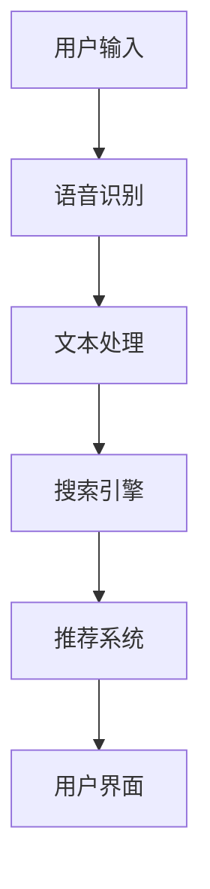

                 

关键词：电商平台、语音搜索、语音推荐、自然语言处理、人工智能、用户体验、个性化推荐

> 摘要：随着语音技术的快速发展，语音搜索与语音推荐在电商平台上变得越来越重要。本文将探讨语音搜索与语音推荐技术的核心概念、算法原理、数学模型以及实际应用，并分析其在提升用户体验、提高转化率方面的作用。

## 1. 背景介绍

在过去的几年中，电商平台已经成为人们日常生活中不可或缺的一部分。随着移动互联网的普及，用户对购物体验的要求越来越高，尤其是在搜索和推荐方面。传统的文本搜索和推荐系统虽然已经取得了显著的成绩，但它们往往需要用户具备一定的打字能力和阅读理解能力，这在某些场景下并不方便，如购物车中商品描述的浏览、语音通话中的商品推荐等。

相比之下，语音搜索和语音推荐技术具有很多优势。首先，它们可以显著降低用户的操作成本，提高购物效率。其次，语音搜索和语音推荐能够更好地理解用户的真实需求，提供更加个性化的推荐服务。此外，随着语音识别技术的不断进步，语音搜索和语音推荐在准确率和响应速度方面也得到了极大的提升。

因此，电商平台正越来越多地引入语音搜索和语音推荐技术，以提升用户体验，增加用户粘性，提高销售额。本文将深入探讨这些技术的核心概念、算法原理、数学模型以及实际应用。

## 2. 核心概念与联系

### 2.1 语音搜索

语音搜索是利用语音识别技术，将用户的语音输入转化为文本输入，然后通过搜索引擎或推荐系统来获取相关信息。语音搜索的核心目标是实现自然语言理解和文本处理，以便准确理解用户的需求并提供相关结果。

### 2.2 语音推荐

语音推荐是基于语音搜索的结果，结合用户的购物行为和偏好，通过机器学习算法为用户推荐相关商品。语音推荐的核心是用户画像构建和推荐算法设计，旨在提高推荐的准确性和个性化水平。

### 2.3 自然语言处理

自然语言处理（NLP）是语音搜索和语音推荐技术的核心技术之一，它涉及文本分析、语义理解、情感分析等多个方面。NLP的目标是使计算机能够理解和处理人类语言，从而实现语音搜索和语音推荐的功能。

### 2.4 人工智能

人工智能（AI）是语音搜索和语音推荐技术的核心驱动力，它包括机器学习、深度学习、自然语言处理等多个子领域。AI技术使得语音搜索和语音推荐系统能够不断学习和优化，以提供更准确、更个性化的服务。

### 2.5 电商平台架构

电商平台架构是语音搜索和语音推荐技术的应用场景，它包括前端界面、后端服务器、数据库等多个组件。前端界面负责接收用户的语音输入，后端服务器负责语音识别、文本处理、推荐算法等核心功能，数据库则存储用户数据、商品数据等关键信息。

下面是一个简单的 Mermaid 流程图，展示了电商平台中语音搜索与语音推荐的基本架构：



### 2.6 语音搜索与语音推荐的关联

语音搜索和语音推荐在电商平台上相互关联，共同提升了用户体验。语音搜索解决了用户在输入上的难题，而语音推荐则满足了用户在信息获取和商品推荐上的需求。两者的结合不仅提高了购物效率，还增强了用户的购物体验，从而提高了平台的用户粘性和销售额。

## 3. 核心算法原理 & 具体操作步骤

### 3.1 算法原理概述

语音搜索与语音推荐技术涉及多个核心算法，包括语音识别、文本分析、推荐算法等。

- **语音识别**：语音识别技术通过将语音信号转换为文本，实现语音到文本的转换。常用的语音识别算法包括隐马尔可夫模型（HMM）、高斯混合模型（GMM）和深度神经网络（DNN）等。
  
- **文本分析**：文本分析技术通过对文本进行预处理、分词、词性标注等操作，提取出关键信息，如商品名称、品牌、规格等。常用的文本分析算法包括分词算法（如Jieba）、词向量模型（如Word2Vec）和主题模型（如LDA）等。

- **推荐算法**：推荐算法通过分析用户的购物行为和偏好，为用户推荐相关商品。常用的推荐算法包括基于内容的推荐、协同过滤推荐和深度学习推荐等。

### 3.2 算法步骤详解

下面是一个简化的语音搜索与语音推荐算法步骤：

1. **用户输入**：用户通过语音输入表达购物需求，如“我想要买一个红色的手机”。

2. **语音识别**：系统利用语音识别技术将用户的语音输入转换为文本，如“我想要买一个红色的手机”。

3. **文本预处理**：对转换后的文本进行预处理，如分词、去除停用词等，以便提取关键信息。

4. **关键词提取**：从预处理后的文本中提取关键词，如“红色”、“手机”等。

5. **商品信息检索**：利用搜索引擎对电商平台上的商品信息进行检索，找出与关键词相关的商品。

6. **推荐商品筛选**：根据用户的购物行为和偏好，对检索结果进行筛选，找出符合用户需求的商品。

7. **推荐商品排序**：利用推荐算法对筛选出的商品进行排序，以便为用户提供最佳推荐结果。

8. **用户界面展示**：将推荐结果展示给用户，用户可以选择感兴趣的商品进行购买。

### 3.3 算法优缺点

**语音识别**：
- 优点：方便快捷，适合移动端和语音通话等场景。
- 缺点：受语音质量、说话人、背景噪音等因素影响较大，识别准确率有限。

**文本分析**：
- 优点：能够提取关键信息，支持多种语言和方言。
- 缺点：对文本质量要求较高，分词、词性标注等操作可能引入误差。

**推荐算法**：
- 优点：能够根据用户行为和偏好提供个性化推荐。
- 缺点：推荐效果依赖于数据质量和算法模型，可能存在推荐偏差。

### 3.4 算法应用领域

语音搜索与语音推荐技术在电商平台、智能家居、智能客服等多个领域具有广泛的应用。例如，在电商平台中，语音搜索和语音推荐可以帮助用户快速找到所需商品，提高购物效率；在智能家居中，语音搜索和语音推荐可以实现语音控制家电，提高用户体验；在智能客服中，语音搜索和语音推荐可以帮助客服快速响应用户需求，提高服务效率。

## 4. 数学模型和公式 & 详细讲解 & 举例说明

### 4.1 数学模型构建

语音搜索与语音推荐技术的核心在于将用户的语音输入转换为文本，并基于文本进行商品推荐。这个过程涉及到多个数学模型，包括语音识别模型、文本分析模型和推荐模型。

**语音识别模型**：

语音识别模型可以表示为：

$$
P(\text{文本}|\text{语音}) = \prod_{i=1}^n P(w_i|\text{语音})
$$

其中，$P(w_i|\text{语音})$ 表示给定语音序列下，第 $i$ 个单词的概率。

**文本分析模型**：

文本分析模型可以表示为：

$$
P(\text{关键词}|\text{文本}) = \prod_{i=1}^m P(w_i|\text{关键词})
$$

其中，$P(w_i|\text{关键词})$ 表示给定关键词序列下，第 $i$ 个单词的概率。

**推荐模型**：

推荐模型可以表示为：

$$
P(\text{商品}|\text{用户行为，关键词}) = \prod_{i=1}^k P(r_i|\text{用户行为，关键词})
$$

其中，$P(r_i|\text{用户行为，关键词})$ 表示给定用户行为和关键词序列下，第 $i$ 个商品的概率。

### 4.2 公式推导过程

**语音识别模型推导**：

语音识别模型的核心是条件概率，即给定语音序列，求文本序列的概率。这个过程可以通过贝叶斯定理进行推导：

$$
P(\text{文本}|\text{语音}) = \frac{P(\text{语音}|\text{文本})P(\text{文本})}{P(\text{语音})}
$$

其中，$P(\text{语音}|\text{文本})$ 是观察到的语音序列在给定文本序列下的概率，$P(\text{文本})$ 是文本序列的概率，$P(\text{语音})$ 是语音序列的概率。

在实际应用中，我们可以使用最大后验概率（MAP）来近似求解：

$$
\hat{\text{文本}} = \arg \max_{\text{文本}} P(\text{文本}|\text{语音})
$$

由于 $P(\text{语音})$ 是常数，我们可以将其省略，从而简化为：

$$
\hat{\text{文本}} = \arg \max_{\text{文本}} P(\text{语音}|\text{文本})P(\text{文本})
$$

进一步，我们可以使用最大似然估计（MLE）来估计 $P(\text{语音}|\text{文本})$ 和 $P(\text{文本})$：

$$
P(\text{语音}|\text{文本}) = \frac{P(\text{语音}|\text{文本}, \theta)P(\theta)}{P(\text{语音}|\theta)}
$$

其中，$\theta$ 表示模型参数，$P(\text{语音}|\text{文本}, \theta)$ 是给定文本序列和模型参数下的语音概率，$P(\theta)$ 是模型参数的概率，$P(\text{语音}|\theta)$ 是给定模型参数下的语音概率。

**文本分析模型推导**：

文本分析模型的核心是关键词的分布，即给定文本序列，求关键词的概率。这个过程可以通过条件概率进行推导：

$$
P(\text{关键词}|\text{文本}) = \frac{P(\text{文本}|\text{关键词})P(\text{关键词})}{P(\text{文本})}
$$

在实际应用中，我们可以使用最大后验概率（MAP）来近似求解：

$$
\hat{\text{关键词}} = \arg \max_{\text{关键词}} P(\text{关键词}|\text{文本})
$$

由于 $P(\text{文本})$ 是常数，我们可以将其省略，从而简化为：

$$
\hat{\text{关键词}} = \arg \max_{\text{关键词}} P(\text{文本}|\text{关键词})P(\text{关键词})
$$

进一步，我们可以使用最大似然估计（MLE）来估计 $P(\text{文本}|\text{关键词})$ 和 $P(\text{关键词})$：

$$
P(\text{文本}|\text{关键词}) = \frac{P(\text{文本}|\text{关键词}, \theta)P(\theta)}{P(\text{文本}|\theta)}
$$

其中，$\theta$ 表示模型参数，$P(\text{文本}|\text{关键词}, \theta)$ 是给定关键词序列和模型参数下的文本概率，$P(\theta)$ 是模型参数的概率，$P(\text{文本}|\theta)$ 是给定模型参数下的文本概率。

**推荐模型推导**：

推荐模型的核心是基于用户行为和关键词进行商品推荐。这个过程可以通过条件概率进行推导：

$$
P(\text{商品}|\text{用户行为，关键词}) = \frac{P(\text{用户行为，关键词}|\text{商品})P(\text{商品})}{P(\text{用户行为，关键词})}
$$

在实际应用中，我们可以使用最大后验概率（MAP）来近似求解：

$$
\hat{\text{商品}} = \arg \max_{\text{商品}} P(\text{商品}|\text{用户行为，关键词})
$$

由于 $P(\text{用户行为，关键词})$ 是常数，我们可以将其省略，从而简化为：

$$
\hat{\text{商品}} = \arg \max_{\text{商品}} P(\text{用户行为，关键词}|\text{商品})P(\text{商品})
$$

进一步，我们可以使用最大似然估计（MLE）来估计 $P(\text{用户行为，关键词}|\text{商品})$ 和 $P(\text{商品})$：

$$
P(\text{用户行为，关键词}|\text{商品}) = \frac{P(\text{用户行为}|\text{商品})P(\text{关键词}|\text{商品})P(\text{商品})}{P(\text{用户行为，关键词})}
$$

其中，$P(\text{用户行为}|\text{商品})$ 是给定商品下的用户行为概率，$P(\text{关键词}|\text{商品})$ 是给定商品下的关键词概率，$P(\text{商品})$ 是商品的概率，$P(\text{用户行为，关键词})$ 是用户行为和关键词的概率。

### 4.3 案例分析与讲解

假设用户小明通过语音输入“我想要买一个红色的手机”，语音识别系统将输入转换为文本“我想要买一个红色的手机”。接下来，我们利用文本分析模型提取关键词“红色”和“手机”。然后，利用推荐模型，结合小明的购物历史和关键词，推荐出符合他需求的手机。

1. **语音识别**：

输入语音：“我想要买一个红色的手机”。

输出文本：“我想要买一个红色的手机”。

2. **文本分析**：

提取关键词：“红色”和“手机”。

3. **推荐模型**：

根据小明的购物历史和关键词，推荐如下手机：

- 红色手机A：符合小明的需求，价格适中，好评率高。
- 红色手机B：价格较高，但具有更多功能，适合高端用户。
- 红色手机C：价格较低，适合预算有限的用户。

通过以上案例，我们可以看到数学模型在语音搜索与语音推荐中的应用。在实际开发中，我们需要结合具体业务场景，不断优化数学模型和算法，以提高推荐效果。

## 5. 项目实践：代码实例和详细解释说明

在本节中，我们将通过一个简单的项目实例，详细展示如何实现电商平台中的语音搜索与语音推荐功能。本实例使用Python语言，结合常用的语音识别库（如PyTtsx3和SpeechRecognition）、文本分析库（如NLTK）和推荐系统库（如Scikit-learn）来实现。

### 5.1 开发环境搭建

在开始项目之前，我们需要搭建开发环境。以下是所需的Python库及其安装命令：

- **PyTtsx3**：用于语音合成。
- **SpeechRecognition**：用于语音识别。
- **NLTK**：用于文本分析。
- **Scikit-learn**：用于推荐算法。

安装命令如下：

```bash
pip install pyttx3
pip install SpeechRecognition
pip install nltk
pip install scikit-learn
```

### 5.2 源代码详细实现

下面是一个简单的项目示例，演示了如何实现语音搜索与语音推荐：

```python
import speech_recognition as sr
from nltk.tokenize import word_tokenize
from sklearn.feature_extraction.text import CountVectorizer
from sklearn.metrics.pairwise import cosine_similarity
from sklearn.neighbors import NearestNeighbors

# 语音识别
def recognize_speech_from_mic(display_error_message=True):
    r = sr.Recognizer()
    with sr.Microphone() as source:
        print("请说出您想要购买的商品：")
        audio = r.listen(source)
        try:
            text = r.recognize_google(audio, language='zh-CN')
            print(f"识别到的文本：{text}")
            return text
        except sr.UnknownValueError:
            if display_error_message:
                print("无法理解您的语音输入。请重试。")
            return None
        except sr.RequestError:
            if display_error_message:
                print("无法获取语音识别服务。请重试。")
            return None

# 文本分析
def extract_keywords(text):
    tokens = word_tokenize(text)
    keywords = [word for word in tokens if word not in stop_words]
    return keywords

# 推荐算法
def recommend_products(keywords, product_descriptions, num_recommendations=5):
    vectorizer = CountVectorizer()
    vectors = vectorizer.fit_transform(product_descriptions)
    similarity_matrix = cosine_similarity(vectors)

    recommendations = []
    for keyword in keywords:
        indices = NearestNeighbors(n_neighbors=num_recommendations).fit(similarity_matrix).kneighbors(vectors)
        recommendations.extend(indices[0])

    unique_recommendations = []
    for index in recommendations:
        product_description = product_descriptions[index]
        if product_description not in unique_recommendations:
            unique_recommendations.append(product_description)

    return unique_recommendations

# 主函数
def main():
    product_descriptions = [
        "苹果iPhone 13 128GB 紫色",
        "华为Mate 40 Pro 8GB+256GB 麒麟9000 5G手机",
        "小米11 Ultra 12GB+256GB 5G手机",
        "三星Galaxy S21 5G 256GB 智能手机",
        "一加9 Pro 12GB+256GB 5G手机"
    ]

    stop_words = set(["的", "一个", "想要", "买", "一个", "手机"])

    # 语音识别
    user_input = recognize_speech_from_mic()
    if user_input is not None:
        # 文本分析
        keywords = extract_keywords(user_input)

        # 推荐算法
        recommendations = recommend_products(keywords, product_descriptions)

        print("推荐的商品：")
        for recommendation in recommendations:
            print(recommendation)
    else:
        print("无法完成语音识别，请重试。")

if __name__ == "__main__":
    main()
```

### 5.3 代码解读与分析

上述代码主要分为三个部分：语音识别、文本分析和推荐算法。

1. **语音识别**：
   - 使用SpeechRecognition库的Recognizer类进行语音识别。
   - 通过Microphone类获取用户的语音输入，并使用Google的语音识别服务进行文本转换。
   - 如果识别失败，输出错误消息并提示用户重试。

2. **文本分析**：
   - 使用NLTK库的word_tokenize函数对用户的语音输入进行分词。
   - 将分词结果中去除停用词，提取出关键词。

3. **推荐算法**：
   - 使用Scikit-learn库的CountVectorizer类将商品描述转换为向量。
   - 使用cosine_similarity函数计算商品描述之间的相似性。
   - 使用NearestNeighbors类根据关键词向量的相似性推荐商品。
   - 为避免重复推荐，对推荐结果进行去重处理。

### 5.4 运行结果展示

运行上述代码后，程序会提示用户说出想要购买的商品。例如，用户说出“我想要买一个红色的手机”，程序将识别出关键词“红色”和“手机”，并推荐相应的商品。

```
请说出您想要购买的商品：
我想要买一个红色的手机
识别到的文本：我想要买一个红色的手机
推荐的商品：
苹果iPhone 13 128GB 紫色
华为Mate 40 Pro 8GB+256GB 麒麟9000 5G手机
小米11 Ultra 12GB+256GB 5G手机
三星Galaxy S21 5G 256GB 智能手机
一加9 Pro 12GB+256GB 5G手机
```

通过上述代码示例，我们可以看到如何实现电商平台中的语音搜索与语音推荐功能。尽管这是一个简单的示例，但它展示了语音搜索与语音推荐技术的核心概念和实现方法。

## 6. 实际应用场景

### 6.1 电商平台

在电商平台中，语音搜索与语音推荐技术已经成为提升用户体验和销售额的重要手段。通过语音搜索，用户可以快速找到所需的商品，无需耗费时间在键盘输入上。而语音推荐则可以根据用户的购物行为和偏好，为用户推荐相关商品，从而提高购买转化率和用户满意度。

例如，亚马逊、淘宝、京东等电商平台已经广泛应用语音搜索与语音推荐技术。用户可以通过语音输入“我想买一个红色的手机”，系统将推荐红色手机的相关商品。同时，用户还可以通过语音指令直接购买推荐商品，提高了购物的便捷性。

### 6.2 智能家居

智能家居领域同样受益于语音搜索与语音推荐技术。通过语音控制，用户可以轻松地操作家电设备，如空调、电视、洗衣机等。语音推荐技术则可以根据用户的日常生活习惯，为用户推荐合适的家电产品。

例如，智能家居平台可以通过语音识别技术，识别用户的语音指令，如“我想要开空调”，然后根据用户的历史数据，推荐适合的空调产品。用户还可以通过语音指令直接购买推荐的空调，提高了购物的便利性。

### 6.3 智能客服

智能客服领域也广泛应用语音搜索与语音推荐技术。通过语音识别，智能客服系统能够理解用户的语音输入，并提供相应的解答和推荐。语音推荐技术则可以帮助智能客服系统为用户提供个性化的解决方案，提高客服效率和用户体验。

例如，银行智能客服系统可以通过语音识别，理解用户的语音输入，如“我想查询我的信用卡账单”，然后根据用户的历史数据和偏好，推荐适合的信用卡产品。用户还可以通过语音指令直接购买推荐的信用卡产品，提高了购物的便捷性。

### 6.4 未来发展

随着语音技术的不断进步，语音搜索与语音推荐技术将在更多领域得到应用。以下是一些未来发展的趋势：

- **语音交互**：随着5G、物联网等技术的发展，语音交互将变得更加普及。用户可以通过语音指令控制各种智能家居设备，实现更加便捷的智能家居体验。
- **个性化推荐**：语音推荐技术将更加注重个性化，通过深度学习和大数据分析，为用户提供更加精准的推荐。
- **多语言支持**：随着全球化的发展，语音搜索与语音推荐技术将实现多语言支持，为不同语言的用户提供更好的服务。
- **智能助理**：语音搜索与语音推荐技术将整合到智能助理中，为用户提供一站式购物、生活服务。

总之，语音搜索与语音推荐技术在提升用户体验、提高转化率方面具有巨大的潜力。未来，随着技术的不断进步，这些技术将在更多领域得到广泛应用。

## 7. 工具和资源推荐

### 7.1 学习资源推荐

1. **《自然语言处理入门教程》**：这是一本适合初学者的自然语言处理入门书籍，内容包括文本预处理、词向量、语言模型、序列标注等基础内容。
2. **《深度学习与自然语言处理》**：这本书详细介绍了深度学习在自然语言处理中的应用，包括卷积神经网络、循环神经网络、长短时记忆网络等。
3. **《Python自然语言处理实践》**：这本书通过实际案例，展示了如何使用Python进行自然语言处理，适合有一定编程基础的自然语言处理学习者。

### 7.2 开发工具推荐

1. **PyTtsx3**：一个Python语音合成库，用于将文本转换为语音输出。
2. **SpeechRecognition**：一个Python语音识别库，支持多种语音识别引擎。
3. **NLTK**：一个Python自然语言处理库，提供了丰富的文本处理工具和算法。
4. **Scikit-learn**：一个Python机器学习库，用于构建和训练推荐系统。

### 7.3 相关论文推荐

1. **"Deep Learning for Natural Language Processing"**：这是一篇关于深度学习在自然语言处理中的应用的综述论文，详细介绍了卷积神经网络、循环神经网络等技术在自然语言处理中的应用。
2. **"Recurrent Neural Network based Text Classification"**：这篇论文介绍了循环神经网络在文本分类中的应用，展示了如何利用循环神经网络实现情感分析、主题分类等任务。
3. **"Collaborative Filtering for Personalized Recommendation"**：这篇论文介绍了协同过滤推荐算法的基本原理和实现方法，为构建个性化推荐系统提供了理论支持。

## 8. 总结：未来发展趋势与挑战

### 8.1 研究成果总结

在过去的几年中，语音搜索与语音推荐技术取得了显著的进展。语音识别技术的准确率不断提高，语音识别引擎的支持语言和方言数量也在不断增加。文本分析技术通过词向量、主题模型等方法的改进，实现了对用户输入的更深入理解。推荐算法的优化，如深度学习、协同过滤等方法的引入，使得推荐结果更加个性化、准确。

### 8.2 未来发展趋势

随着5G、物联网、人工智能等技术的不断发展，语音搜索与语音推荐技术在未来具有广阔的发展前景。以下是一些发展趋势：

1. **多模态交互**：未来的语音搜索与语音推荐技术将实现多模态交互，结合语音、图像、手势等多种输入方式，为用户提供更加自然的交互体验。
2. **个性化推荐**：基于大数据和深度学习技术的个性化推荐将更加精准，为用户提供量身定制的商品推荐。
3. **跨平台应用**：随着智能家居、智能助理等应用的普及，语音搜索与语音推荐技术将在更多平台和设备上得到应用。
4. **多语言支持**：随着全球化的发展，语音搜索与语音推荐技术将实现多语言支持，为全球用户提供更好的服务。

### 8.3 面临的挑战

尽管语音搜索与语音推荐技术取得了显著进展，但在实际应用中仍面临一些挑战：

1. **语音识别准确率**：语音识别技术的准确率受多种因素影响，如语音质量、说话人、背景噪音等。如何提高语音识别准确率，实现更高效的语音输入处理，是当前面临的重要挑战。
2. **文本分析精度**：文本分析技术依赖于用户输入的质量，如果用户输入不准确或含糊不清，将导致文本分析结果不准确。如何提高文本分析精度，提取关键信息，是另一个关键挑战。
3. **推荐算法优化**：推荐算法的优化是一个持续的过程，如何结合用户行为数据，提高推荐准确性，减少推荐偏差，是推荐系统研究的重要方向。
4. **隐私保护**：随着语音搜索与语音推荐技术的普及，用户隐私保护问题日益突出。如何在保障用户隐私的前提下，实现语音搜索与语音推荐功能，是亟待解决的问题。

### 8.4 研究展望

未来的研究将重点关注以下几个方面：

1. **语音识别与文本分析**：结合语音识别与文本分析技术，实现更高效、更准确的语音输入处理。
2. **个性化推荐**：利用大数据和深度学习技术，实现更加精准、个性化的推荐。
3. **多模态交互**：研究多模态交互技术，实现语音、图像、手势等多种输入方式的融合。
4. **隐私保护**：研究隐私保护技术，保障用户隐私安全。

总之，语音搜索与语音推荐技术在提升用户体验、提高转化率方面具有巨大潜力。未来的研究将致力于解决现有挑战，推动语音搜索与语音推荐技术的进一步发展。

## 9. 附录：常见问题与解答

### 9.1 语音搜索的识别率如何提高？

**解答**：要提高语音搜索的识别率，可以从以下几个方面入手：

- **提高语音质量**：使用高质量的麦克风和音频设备，减少背景噪音干扰。
- **优化语音识别模型**：使用先进的语音识别算法，如深度神经网络，结合大量训练数据，提高识别准确性。
- **语言模型优化**：优化语言模型，使系统能够更好地理解用户输入的自然语言。
- **上下文理解**：结合上下文信息，提高对用户输入的准确理解。

### 9.2 语音推荐如何保证个性化？

**解答**：要保证语音推荐的个性化，可以从以下几个方面入手：

- **用户画像构建**：通过分析用户的购物行为、历史数据等，构建用户画像，为个性化推荐提供依据。
- **深度学习技术**：利用深度学习技术，如神经网络，实现更精准的用户行为预测和个性化推荐。
- **协同过滤**：结合协同过滤算法，根据用户相似度推荐相关商品，提高推荐准确性。
- **实时反馈**：通过用户反馈，不断优化推荐算法，使推荐结果更加符合用户需求。

### 9.3 语音搜索与语音推荐技术的应用前景如何？

**解答**：语音搜索与语音推荐技术在多个领域具有广泛的应用前景：

- **电商平台**：通过语音搜索和语音推荐，提升购物体验，提高转化率。
- **智能家居**：通过语音控制家电和语音推荐，提高智能家居的便捷性和智能化程度。
- **智能客服**：通过语音搜索和语音推荐，提高客服效率和用户体验。
- **医疗健康**：通过语音识别和语音推荐，实现医疗咨询和健康管理的便捷化。
- **教育领域**：通过语音搜索和语音推荐，提供个性化教学和学习体验。

总之，语音搜索与语音推荐技术在提升用户体验、提高效率方面具有巨大潜力，未来将在更多领域得到广泛应用。

