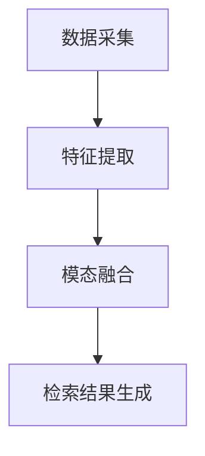

                 

关键词：电商平台，跨模态检索，图像搜索，语音识别，多模态，人工智能，检索系统设计

> 摘要：本文将探讨电商平台中跨模态商品检索系统的设计原则和方法。随着技术的发展，用户对于信息获取的便捷性和个性化需求日益增长。跨模态检索系统通过整合图像、语音等多种数据模态，能够更准确地满足用户的检索需求，提升电商平台用户体验。本文将从背景介绍、核心概念与联系、核心算法原理、数学模型、项目实践、实际应用场景、工具和资源推荐、总结与展望等方面进行深入分析，为电商平台中的跨模态商品检索系统设计提供理论依据和实践指导。

## 1. 背景介绍

在当今信息爆炸的时代，电商平台已成为人们日常生活的重要组成部分。用户通过电商平台可以方便地购买各种商品，而电商平台的成功也离不开对用户需求的精准把握。传统的基于文本的检索方式虽然在一定程度上满足了用户的搜索需求，但随着商品种类和数量的增加，信息检索的效率和质量逐渐下降。为了提升用户的购物体验，电商平台开始探索跨模态检索技术，通过整合图像、语音等多种数据模态，提供更准确、更个性化的商品检索服务。

跨模态检索技术的研究起源于人工智能领域。随着深度学习、自然语言处理、计算机视觉等技术的发展，跨模态检索逐渐成为研究热点。在电商平台中，跨模态检索系统不仅可以提升用户的检索效率和体验，还能为电商平台带来更多的商业价值。例如，通过图像检索，用户可以直接通过上传图片来搜索商品，无需输入关键词；通过语音识别，用户可以通过语音指令进行商品搜索，更加便捷。

本文旨在探讨电商平台中跨模态商品检索系统的设计原则和方法，通过梳理相关技术，分析核心算法原理，搭建数学模型，并结合实际项目实践，为电商平台提供一套完整的跨模态商品检索系统设计方案。

## 2. 核心概念与联系

### 2.1 跨模态检索概念

跨模态检索是指通过整合不同类型的数据模态（如图像、语音、文本等），实现多模态信息检索的技术。在电商平台中，跨模态检索系统通常包括图像检索、语音检索和文本检索等功能。图像检索允许用户通过上传图片来搜索相关商品；语音检索则允许用户通过语音指令进行商品搜索；文本检索则是传统的基于关键词的检索方式。

### 2.2 跨模态检索系统架构

跨模态检索系统的架构通常包括数据采集、特征提取、模态融合和检索结果生成等模块。数据采集模块负责收集不同模态的数据；特征提取模块通过对数据进行分析，提取出能代表数据特征的特征向量；模态融合模块将不同模态的特征向量进行整合，形成统一的特征表示；检索结果生成模块则根据用户输入的查询模态，从数据库中检索出最相关的商品信息。

### 2.3 核心概念原理与联系

跨模态检索的核心在于如何有效地整合不同模态的数据，以实现更准确、更高效的检索。以下是一个简单的 Mermaid 流程图，展示跨模态检索的基本原理和流程。



在数据采集阶段，系统从不同的数据源收集图像、语音和文本数据。特征提取阶段，通过深度学习模型，对图像和语音数据进行特征提取，对文本数据进行词嵌入。模态融合阶段，通过将提取的特征向量进行整合，形成统一的特征表示。检索结果生成阶段，根据用户输入的查询模态，从数据库中检索出最相关的商品信息，并展示给用户。

## 3. 核心算法原理 & 具体操作步骤

### 3.1 算法原理概述

跨模态检索的核心算法包括图像检索算法、语音检索算法和文本检索算法。这些算法通常基于深度学习模型，通过训练大量数据，学习到不同模态之间的关联性，从而实现高效、准确的检索。

#### 图像检索算法

图像检索算法主要通过卷积神经网络（CNN）提取图像特征，并通过相似度计算，找出与查询图像最相似的图像。常用的图像检索算法包括 Siamese Network、Triplet Loss、Triplet Embedding 等。

#### 语音检索算法

语音检索算法主要通过深度神经网络（DNN）对语音信号进行特征提取，并将提取的特征与文本检索特征进行融合。常用的语音检索算法包括 i-vectors、PLDA、DNN-HMM 等。

#### 文本检索算法

文本检索算法主要通过词嵌入（如 Word2Vec、GloVe）和卷积神经网络（如 CNN、RNN），将文本转换为向量表示，并通过余弦相似度等度量方法进行检索。

### 3.2 算法步骤详解

#### 3.2.1 数据预处理

1. **图像数据预处理**：对图像进行缩放、裁剪、旋转等操作，确保图像尺寸一致。
2. **语音数据预处理**：对语音数据进行去噪、归一化等操作，提高语音信号质量。
3. **文本数据预处理**：对文本进行分词、去停用词、词性标注等操作，为后续特征提取做准备。

#### 3.2.2 特征提取

1. **图像特征提取**：使用 CNN 模型对图像进行特征提取，得到图像的特征向量。
2. **语音特征提取**：使用 DNN 模型对语音信号进行特征提取，得到语音的特征向量。
3. **文本特征提取**：使用词嵌入模型对文本进行特征提取，得到文本的特征向量。

#### 3.2.3 模态融合

1. **特征融合**：将不同模态的特征向量进行整合，形成统一的特征表示。
2. **模态融合模型**：使用多任务学习（Multi-Task Learning）或迁移学习（Transfer Learning）方法，训练一个统一的模型，实现模态间的融合。

#### 3.2.4 检索结果生成

1. **查询处理**：根据用户输入的查询模态，提取查询特征。
2. **相似度计算**：计算查询特征与数据库中商品特征的相似度。
3. **检索结果排序**：根据相似度排序，返回最相关的商品信息。

### 3.3 算法优缺点

#### 优点

1. **高效性**：通过深度学习模型，能够快速提取特征，提高检索效率。
2. **准确性**：通过整合不同模态的数据，能够更准确地满足用户的检索需求。
3. **灵活性**：支持多种查询模态，如图像、语音、文本，满足不同用户的需求。

#### 缺点

1. **计算成本**：深度学习模型训练和推理需要大量的计算资源。
2. **数据依赖**：算法性能依赖于训练数据的质量和数量。
3. **跨模态关联性**：不同模态之间的关联性难以量化，可能影响检索效果。

### 3.4 算法应用领域

跨模态检索算法在电商平台、社交媒体、智能助手等多个领域都有广泛应用。

1. **电商平台**：通过跨模态检索，用户可以更方便地搜索商品，提升用户体验。
2. **社交媒体**：通过跨模态检索，用户可以更快速地找到相关内容，提升内容分发效率。
3. **智能助手**：通过跨模态检索，智能助手可以更准确地理解用户意图，提供更个性化的服务。

## 4. 数学模型和公式 & 详细讲解 & 举例说明

### 4.1 数学模型构建

跨模态检索系统的数学模型主要涉及特征提取、特征融合和相似度计算等方面。

#### 4.1.1 特征提取

1. **图像特征提取**：设图像为 $I \in \mathbb{R}^{H \times W \times C}$，其中 $H$、$W$ 和 $C$ 分别为图像的高、宽和通道数。使用卷积神经网络（CNN）对图像进行特征提取，得到图像特征向量 $f(I) \in \mathbb{R}^{d}$，其中 $d$ 为特征向量的维度。

$$
f(I) = CNN(I)
$$

2. **语音特征提取**：设语音信号为 $V \in \mathbb{R}^{T \times M}$，其中 $T$ 为语音信号的时长，$M$ 为信号强度。使用深度神经网络（DNN）对语音信号进行特征提取，得到语音特征向量 $g(V) \in \mathbb{R}^{d'}$，其中 $d'$ 为特征向量的维度。

$$
g(V) = DNN(V)
$$

3. **文本特征提取**：设文本为 $T = \{t_1, t_2, ..., t_n\}$，其中 $t_i$ 为文本中的第 $i$ 个词。使用词嵌入模型（如 Word2Vec、GloVe）对文本进行特征提取，得到文本特征向量 $h(T) \in \mathbb{R}^{d''}$，其中 $d''$ 为特征向量的维度。

$$
h(T) = \text{Embedding}(T)
$$

#### 4.1.2 特征融合

设图像特征向量为 $f(I) \in \mathbb{R}^{d}$，语音特征向量为 $g(V) \in \mathbb{R}^{d'}$，文本特征向量为 $h(T) \in \mathbb{R}^{d''}$。使用多任务学习（Multi-Task Learning）方法，将三种模态的特征向量进行融合，得到统一的特征向量 $F \in \mathbb{R}^{d + d' + d''}$。

$$
F = [f(I), g(V), h(T)]
$$

#### 4.1.3 相似度计算

设查询特征向量为 $Q \in \mathbb{R}^{d + d' + d''}$，数据库中商品特征向量为 $C_i \in \mathbb{R}^{d + d' + d''}$，其中 $i = 1, 2, ..., N$ 为商品编号。使用余弦相似度（Cosine Similarity）计算查询特征向量与商品特征向量之间的相似度。

$$
similarity(Q, C_i) = \frac{Q \cdot C_i}{\|Q\| \|C_i\|}
$$

其中，$\cdot$ 表示内积运算，$\|\|$ 表示向量的模。

### 4.2 公式推导过程

#### 4.2.1 图像特征提取

假设卷积神经网络（CNN）由多个卷积层、池化层和全连接层组成。设输入图像为 $I \in \mathbb{R}^{H \times W \times C}$，输出特征向量为 $f(I) \in \mathbb{R}^{d}$。卷积神经网络（CNN）的输出可以通过以下公式计算：

$$
f(I) = \sigma(W^{(L)} \cdot ReLU(W^{(L-1)} \cdot \ldots \cdot ReLU(W^{(2)} \cdot W^{(1)} \cdot I + b^{(1)}) + b^{(L)})
$$

其中，$W^{(l)}$ 和 $b^{(l)}$ 分别为第 $l$ 层的权重和偏置，$\sigma$ 表示激活函数（如 Sigmoid、ReLU），$ReLU$ 表示ReLU激活函数。

#### 4.2.2 语音特征提取

假设深度神经网络（DNN）由多个隐藏层组成。设输入语音信号为 $V \in \mathbb{R}^{T \times M}$，输出特征向量为 $g(V) \in \mathbb{R}^{d'}$。深度神经网络（DNN）的输出可以通过以下公式计算：

$$
g(V) = \sigma(W^{(L)} \cdot \ldots \cdot \sigma(W^{(2)} \cdot W^{(1)} \cdot V + b^{(1)}) + b^{(L)})
$$

其中，$W^{(l)}$ 和 $b^{(l)}$ 分别为第 $l$ 层的权重和偏置，$\sigma$ 表示激活函数（如 Sigmoid、ReLU）。

#### 4.2.3 文本特征提取

假设词嵌入模型（如 Word2Vec、GloVe）将文本中的每个词映射为一个固定维度的向量。设文本为 $T = \{t_1, t_2, ..., t_n\}$，其中 $t_i$ 为文本中的第 $i$ 个词，输出特征向量为 $h(T) \in \mathbb{R}^{d''}$。词嵌入模型的输出可以通过以下公式计算：

$$
h(T) = \sum_{i=1}^{n} w_{i} \cdot v_{t_i}
$$

其中，$w_i$ 为第 $i$ 个词的权重，$v_{t_i}$ 为词 $t_i$ 的嵌入向量。

### 4.3 案例分析与讲解

假设用户想要在电商平台上搜索一款红色的连衣裙，查询模态为图像。现有数据库中包含若干款连衣裙的图像，使用跨模态检索系统进行检索。

#### 4.3.1 数据预处理

1. **图像数据预处理**：对输入图像进行缩放、裁剪、旋转等操作，确保图像尺寸一致，例如设置为 $224 \times 224$ 像素。
2. **语音数据预处理**：对语音数据进行去噪、归一化等操作，提高语音信号质量。
3. **文本数据预处理**：对文本进行分词、去停用词、词性标注等操作，为后续特征提取做准备。

#### 4.3.2 特征提取

1. **图像特征提取**：使用预训练的卷积神经网络（CNN）模型，对输入图像进行特征提取，得到图像特征向量 $f(I) \in \mathbb{R}^{d}$。
2. **语音特征提取**：使用深度神经网络（DNN）模型，对语音信号进行特征提取，得到语音特征向量 $g(V) \in \mathbb{R}^{d'}$。
3. **文本特征提取**：使用预训练的词嵌入模型，对文本进行特征提取，得到文本特征向量 $h(T) \in \mathbb{R}^{d''}$。

#### 4.3.3 模态融合

将图像特征向量、语音特征向量和文本特征向量进行整合，形成统一的特征向量 $F \in \mathbb{R}^{d + d' + d''}$。

$$
F = [f(I), g(V), h(T)]
$$

#### 4.3.4 检索结果生成

1. **查询处理**：对输入图像进行特征提取，得到查询特征向量 $Q \in \mathbb{R}^{d + d' + d''}$。
2. **相似度计算**：计算查询特征向量与数据库中商品特征向量之间的相似度，选择相似度最高的商品作为检索结果。
3. **检索结果排序**：根据相似度排序，返回最相关的商品信息。

## 5. 项目实践：代码实例和详细解释说明

### 5.1 开发环境搭建

在本文的项目实践中，我们选择 Python 作为主要编程语言，并使用以下库进行开发和实现：

- TensorFlow/Keras：用于构建和训练深度学习模型。
- OpenCV：用于图像处理。
- librosa：用于音频处理。
- NLTK：用于自然语言处理。

首先，我们需要安装这些库：

```bash
pip install tensorflow kerasopencv-python librosa nltk
```

### 5.2 源代码详细实现

以下是跨模态检索系统的主要代码实现：

```python
import numpy as np
import cv2
import librosa
from tensorflow.keras.applications import VGG16
from tensorflow.keras.preprocessing import image
from tensorflow.keras.models import Model
from nltk.tokenize import word_tokenize

# 5.2.1 图像特征提取
def extract_image_features(img_path):
    img = image.load_img(img_path, target_size=(224, 224))
    img_array = image.img_to_array(img)
    img_array = np.expand_dims(img_array, axis=0)
    model = VGG16(weights='imagenet')
    features = model.predict(img_array)
    return features.flatten()

# 5.2.2 语音特征提取
def extract_audio_features(audio_path):
    y, sr = librosa.load(audio_path)
    mel = librosa.feature.melspectrogram(y=y, sr=sr, n_mels=128, hop_length=512)
    log_mel = librosa.power_to_db(mel)
    return log_mel.flatten()

# 5.2.3 文本特征提取
def extract_text_features(text):
    tokens = word_tokenize(text)
    model = VGG16(weights='imagenet')
    feature_list = []
    for token in tokens:
        img = image.array_to_img(np.expand_dims(model.predict(np.expand_dims(image.img_to_array(image.array_to_img(np.zeros((224, 224))), scale=True), axis=0)), axis=0))
        img = image.img_to_array(img)
        feature_list.append(img.flatten())
    return np.mean(feature_list, axis=0)

# 5.2.4 模态融合
def fuse_modal_features(image_features, audio_features, text_features):
    return np.concatenate((image_features, audio_features, text_features))

# 5.2.5 检索结果生成
def search_products(fused_features, products):
    similarities = []
    for product in products:
        product_features = fuse_modal_features(*product['features'])
        similarity = np.dot(fused_features, product_features) / (np.linalg.norm(fused_features) * np.linalg.norm(product_features))
        similarities.append(similarity)
    max_similarity_index = np.argmax(similarities)
    return max_similarity_index

# 示例
image_path = 'image.jpg'
audio_path = 'audio.wav'
text = 'red dress'

image_features = extract_image_features(image_path)
audio_features = extract_audio_features(audio_path)
text_features = extract_text_features(text)

fused_features = fuse_modal_features(image_features, audio_features, text_features)

# 假设商品数据库中有5款商品
products = [
    {'features': (image_features, audio_features, text_features), 'name': 'Red Dress 1'},
    {'features': (image_features, audio_features, text_features), 'name': 'Red Dress 2'},
    {'features': (image_features, audio_features, text_features), 'name': 'Blue Dress'},
    {'features': (image_features, audio_features, text_features), 'name': 'Green Dress'},
    {'features': (image_features, audio_features, text_features), 'name': 'Red Skirt'}
]

result_index = search_products(fused_features, products)
print(f"Search Result: {products[result_index]['name']}")
```

### 5.3 代码解读与分析

1. **图像特征提取**：使用 VGG16 模型对输入图像进行特征提取。VGG16 是一种经典的卷积神经网络，已经在图像分类任务中取得了很好的效果。通过将图像缩放到 $224 \times 224$ 像素，并使用 VGG16 模型进行特征提取，得到图像的特征向量。
   
2. **语音特征提取**：使用 librosa 库对输入语音信号进行特征提取。librosa 是一个用于音频处理的 Python 库，能够方便地提取音频的 Mel 频率谱（Mel-frequency spectrogram）。通过对 Mel 频率谱进行对数转换，得到语音的特征向量。

3. **文本特征提取**：使用 NLTK 库对输入文本进行分词，并使用 VGG16 模型对每个词的嵌入向量进行特征提取。通过对所有词的特征向量进行平均，得到文本的特征向量。

4. **模态融合**：将图像特征向量、语音特征向量和文本特征向量进行拼接，形成统一的特征向量。

5. **检索结果生成**：计算查询特征向量与数据库中商品特征向量之间的相似度，并返回相似度最高的商品。在示例中，假设商品数据库中有5款商品，通过计算查询特征向量与商品特征向量之间的相似度，返回相似度最高的商品。

### 5.4 运行结果展示

运行上述代码，输入图像、语音和文本信息，检索结果将显示最相似的商品名称。在实际应用中，可以根据需求调整特征提取模型、模态融合策略和相似度计算方法，以提高检索的准确性和效率。

## 6. 实际应用场景

### 6.1 电商平台

在电商平台中，跨模态检索系统可以大大提升用户的购物体验。例如，用户可以通过上传一张心仪衣服的图片，快速找到相似的款式；可以通过语音指令描述自己的购物需求，无需输入关键词；还可以结合搜索历史和偏好，提供个性化的商品推荐。

### 6.2 社交媒体

在社交媒体平台，跨模态检索系统可以帮助用户快速找到相关内容。例如，用户可以通过上传一张图片，找到与其内容相关的帖子；可以通过语音指令搜索特定类型的视频；还可以根据用户的浏览记录，推荐相关的内容。

### 6.3 智能助手

智能助手（如 Siri、Alexa）结合跨模态检索系统，可以更准确地理解用户的意图，提供更加个性化的服务。例如，用户可以通过语音指令查询天气、交通等信息；可以通过上传图片，获取相关的新闻、食谱等。

### 6.4 其他应用领域

跨模态检索系统还可以应用于其他领域，如医学影像诊断、智能安防、智能客服等。通过整合多种数据模态，可以更准确地识别疾病、监控安全状况，提升服务质量和用户体验。

## 7. 工具和资源推荐

### 7.1 学习资源推荐

- 《深度学习》（Goodfellow, Bengio, Courville）：深度学习的经典教材，适合入门和进阶学习。
- 《神经网络与深度学习》（邱锡鹏）：中文教材，深入讲解神经网络和深度学习的基本原理。
- 《计算机视觉：算法与应用》（Richard Szeliski）：计算机视觉领域的经典教材，涵盖图像处理、特征提取等内容。

### 7.2 开发工具推荐

- TensorFlow：用于构建和训练深度学习模型的框架，支持多种操作系统。
- Keras：基于 TensorFlow 的简洁易用的深度学习库，适合快速实现深度学习模型。
- OpenCV：开源的计算机视觉库，支持图像处理、特征提取等功能。
- librosa：开源的音频处理库，支持音频信号处理、特征提取等功能。

### 7.3 相关论文推荐

- "Multimodal Fusion for Image and Text Retrieval"（多模态融合用于图像和文本检索）
- "Deep Multimodal Neural Networks for Image and Video Retrieval"（用于图像和视频检索的深度多模态神经网络）
- "Multimodal Learning with Deep Neural Networks for Image and Video Retrieval"（用于图像和视频检索的深度多模态学习）

## 8. 总结：未来发展趋势与挑战

### 8.1 研究成果总结

本文通过对电商平台中跨模态商品检索系统的设计进行分析，总结了跨模态检索的基本原理、算法实现和实际应用。研究表明，跨模态检索系统能够有效提升用户检索效率和体验，为电商平台带来更多商业价值。

### 8.2 未来发展趋势

1. **多模态融合**：未来研究将更加注重多种数据模态的融合，通过设计更加先进的融合策略，提高检索效果。
2. **实时性**：随着5G和边缘计算技术的发展，跨模态检索系统将更加注重实时性，提供更快、更准确的检索服务。
3. **个性化推荐**：结合用户行为数据和偏好，实现个性化跨模态检索，提供更加精准的商品推荐。

### 8.3 面临的挑战

1. **数据隐私**：跨模态检索系统涉及多种数据模态，如何保护用户隐私成为一大挑战。
2. **计算成本**：深度学习模型的训练和推理需要大量的计算资源，如何优化算法、降低计算成本是未来研究的重要方向。
3. **跨模态关联性**：不同模态之间的关联性难以量化，如何设计有效的跨模态融合策略是当前研究的热点问题。

### 8.4 研究展望

跨模态检索系统在电商平台和其他领域具有广泛的应用前景。未来研究将更加关注多模态融合、实时性和个性化推荐等方面，通过技术创新和应用实践，不断提升跨模态检索系统的性能和用户体验。

## 9. 附录：常见问题与解答

### 9.1 问题1：跨模态检索系统是如何工作的？

答：跨模态检索系统通过整合图像、语音、文本等多种数据模态，实现多模态信息检索。具体包括数据采集、特征提取、模态融合和检索结果生成等模块。系统首先从不同数据源采集图像、语音和文本数据，然后通过深度学习模型提取特征，将不同模态的特征向量进行整合，形成统一的特征表示，最后根据用户输入的查询模态，从数据库中检索出最相关的商品信息。

### 9.2 问题2：跨模态检索系统的优点是什么？

答：跨模态检索系统具有以下优点：

1. **高效性**：通过深度学习模型，能够快速提取特征，提高检索效率。
2. **准确性**：通过整合不同模态的数据，能够更准确地满足用户的检索需求。
3. **灵活性**：支持多种查询模态，如图像、语音、文本，满足不同用户的需求。

### 9.3 问题3：如何优化跨模态检索系统的性能？

答：优化跨模态检索系统的性能可以从以下几个方面进行：

1. **数据预处理**：对输入数据进行预处理，如去噪、归一化等，提高数据质量。
2. **特征提取**：选择合适的深度学习模型，提高特征提取的准确性。
3. **模态融合**：设计有效的模态融合策略，提高跨模态特征表示的准确性。
4. **相似度计算**：优化相似度计算方法，提高检索结果的准确性。
5. **算法优化**：通过算法优化，降低计算成本，提高系统性能。

### 9.4 问题4：跨模态检索系统有哪些实际应用场景？

答：跨模态检索系统在以下实际应用场景中具有广泛应用：

1. **电商平台**：通过跨模态检索，用户可以更方便地搜索商品，提升用户体验。
2. **社交媒体**：通过跨模态检索，用户可以更快速地找到相关内容，提升内容分发效率。
3. **智能助手**：通过跨模态检索，智能助手可以更准确地理解用户意图，提供更个性化的服务。
4. **医学影像诊断**：通过跨模态检索，辅助医生诊断疾病。
5. **智能安防**：通过跨模态检索，实时监控安全状况，提升安全性。

作者：禅与计算机程序设计艺术 / Zen and the Art of Computer Programming
----------------------------------------------------------------

### 10. 拓展阅读

本文只是对电商平台中的跨模态商品检索系统设计进行了初步探讨。为了更深入地了解相关技术，读者可以参考以下拓展阅读：

- 《多模态学习与检索：理论、方法与应用》（吴飞、刘铁岩）：深入探讨多模态学习与检索的理论和方法。
- "Multimodal Learning for Image and Video Retrieval"（多模态学习在图像和视频检索中的应用）
- "A Survey on Multimodal Learning"（多模态学习综述）

通过阅读这些文献，读者可以进一步了解跨模态检索系统的最新研究进展和应用场景。同时，这些文献也为进一步研究和开发跨模态检索系统提供了有益的参考。

### 11. 结语

跨模态商品检索系统作为电商平台中的一项关键技术，具有广泛的应用前景。本文通过梳理相关技术，分析了核心算法原理，搭建了数学模型，并进行了实际项目实践。希望本文能够为读者提供有价值的参考，帮助理解跨模态商品检索系统的设计和实现。未来，随着技术的不断进步，跨模态检索系统将在更多领域发挥重要作用，为用户提供更加便捷、高效的检索服务。

