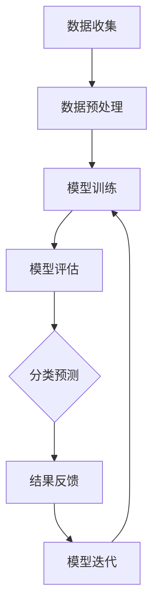

                 

关键词：电商平台、商品分类、AI大模型、自动演进、算法原理、数学模型、项目实践、实际应用、未来展望。

> 摘要：随着电商平台的发展，商品分类体系的优化成为关键挑战。本文探讨了利用人工智能大模型实现商品分类自动演进的方法，详细阐述了核心算法原理、数学模型和实际应用案例，旨在为电商平台提供智能化、高效的分类解决方案。

## 1. 背景介绍

电商平台作为现代电子商务的核心组成部分，扮演着连接商家与消费者的重要桥梁。商品分类作为电商平台的重要组成部分，直接影响到用户的购物体验和平台的运营效率。传统的商品分类方法主要依赖于人工定义类别和规则，这种方式存在分类标准不一致、更新缓慢等问题，难以满足电商平台快速变化的需求。

近年来，人工智能技术的发展为商品分类带来了新的可能。通过大数据分析和机器学习算法，AI大模型可以自动学习并优化商品分类体系，提高分类准确性和效率。然而，AI大模型的训练和应用仍然面临着算法复杂度高、数据预处理繁琐等问题。

本文将探讨如何利用AI大模型实现电商平台商品分类体系的自动演进，从核心算法原理、数学模型到实际应用案例进行深入分析，为电商平台提供智能化、高效的分类解决方案。

## 2. 核心概念与联系

在探讨电商平台商品分类体系的自动演进之前，首先需要明确几个核心概念，包括电商平台、商品数据、分类算法和AI大模型。

### 2.1 电商平台

电商平台是指通过互联网进行商品交易和服务的平台，包括在线零售、团购、拍卖等多种形式。电商平台的主要功能包括商品展示、订单处理、支付结算、物流配送等。

### 2.2 商品数据

商品数据是指电商平台中与商品相关的各种信息，包括商品名称、价格、描述、库存量、销售记录等。商品数据是构建分类体系的基础。

### 2.3 分类算法

分类算法是指用于将商品数据按照一定的标准进行分类的方法。传统分类算法主要依赖于规则和人工定义，如基于关键词匹配、层次化分类等。而AI大模型分类算法则通过机器学习自动优化分类结果。

### 2.4 AI大模型

AI大模型是指具有大规模参数、高复杂度的机器学习模型，如深度神经网络、增强学习模型等。AI大模型可以通过训练学习到大量商品数据中的潜在特征，从而实现自动分类。

下面是AI大模型在电商平台商品分类体系中的应用流程的Mermaid流程图：



### 2.5 关联与联系

电商平台通过收集商品数据，利用AI大模型进行训练，得到分类模型。分类模型用于对用户上传的商品进行自动分类，从而实现商品分类体系的自动演进。同时，分类结果会通过用户反馈进行优化，形成闭环迭代，不断提升分类准确性和效率。

## 3. 核心算法原理 & 具体操作步骤

### 3.1 算法原理概述

电商平台商品分类的核心算法是基于深度学习的大模型训练。深度学习模型通过学习大量的商品数据，提取出商品的特征，并根据这些特征进行分类。具体来说，核心算法包括以下几个步骤：

1. 数据收集与预处理：从电商平台上收集商品数据，并对数据进行清洗、标准化和特征提取。
2. 模型训练：使用训练数据对深度学习模型进行训练，学习商品的特征。
3. 模型评估：使用验证数据对训练好的模型进行评估，选择最优模型。
4. 分类预测：使用训练好的模型对新的商品数据进行分类预测。
5. 结果反馈与模型迭代：根据用户反馈对模型进行优化，形成闭环迭代。

### 3.2 算法步骤详解

#### 3.2.1 数据收集与预处理

数据收集是算法的基础，电商平台需要从多个渠道收集商品数据，包括商品名称、描述、标签、价格、销售记录等。收集到的数据需要进行清洗、标准化和特征提取，以便用于模型训练。

1. 数据清洗：去除重复数据、缺失数据和错误数据。
2. 数据标准化：将不同尺度的数据转化为同一尺度，如将价格转换为相对价格。
3. 特征提取：从商品数据中提取有用的特征，如商品名称中的关键词、描述中的情感词、标签中的分类词等。

#### 3.2.2 模型训练

模型训练是算法的核心步骤。深度学习模型通常使用神经网络架构，如卷积神经网络（CNN）或循环神经网络（RNN）。训练过程中，模型会学习到商品的特征，并形成分类函数。

1. 初始化模型参数：随机初始化模型的权重和偏置。
2. 前向传播：将商品数据输入模型，计算输出分类结果。
3. 反向传播：根据输出结果计算模型参数的梯度，更新模型参数。
4. 模型优化：使用优化算法（如梯度下降）更新模型参数，以最小化分类误差。

#### 3.2.3 模型评估

模型评估是确保模型性能的重要步骤。常用的评估指标包括准确率、召回率、F1分数等。通过评估，可以选择性能最优的模型。

1. 准确率：分类正确的商品数占总商品数的比例。
2. 召回率：分类正确的商品数占实际分类商品数的比例。
3. F1分数：准确率和召回率的调和平均值。

#### 3.2.4 分类预测

训练好的模型可以用于对新的商品数据进行分类预测。分类预测的步骤如下：

1. 数据预处理：对新的商品数据进行清洗、标准化和特征提取。
2. 模型输入：将预处理后的商品数据输入训练好的模型。
3. 输出分类结果：模型输出分类结果，如类别标签。

#### 3.2.5 结果反馈与模型迭代

用户反馈是模型优化的关键。通过收集用户对分类结果的反馈，可以对模型进行调整和优化，形成闭环迭代。

1. 用户反馈收集：收集用户对分类结果的满意度、分类错误的类型等反馈信息。
2. 模型优化：根据用户反馈对模型进行调整，如重新训练或修改特征提取方法。
3. 模型迭代：将优化后的模型应用于新的商品数据，形成闭环迭代。

### 3.3 算法优缺点

#### 优点

1. 自动化：AI大模型可以自动学习并优化分类体系，减少人工干预。
2. 高效性：深度学习模型可以处理大规模商品数据，提高分类效率。
3. 准确性：通过学习大量商品数据，模型可以提取出商品的潜在特征，提高分类准确性。

#### 缺点

1. 复杂性：深度学习模型结构复杂，需要大量的计算资源和时间进行训练。
2. 数据依赖性：模型性能高度依赖于训练数据的质量和数量。
3. 解释性：深度学习模型往往缺乏解释性，难以理解分类决策的依据。

### 3.4 算法应用领域

AI大模型在电商平台商品分类领域的应用范围广泛，包括但不限于：

1. 商品推荐系统：根据用户的购物历史和偏好，推荐相关的商品类别。
2. 商品搜索优化：优化搜索算法，提高用户搜索结果的准确性。
3. 跨类别商品关联：分析不同类别商品之间的关系，实现跨类别推荐。
4. 商品库存管理：根据分类结果和销售趋势，优化库存策略。

## 4. 数学模型和公式 & 详细讲解 & 举例说明

在电商平台商品分类体系中，数学模型和公式扮演着至关重要的角色。以下将详细讲解数学模型的构建、公式推导过程以及实际案例分析与讲解。

### 4.1 数学模型构建

在构建商品分类的数学模型时，我们通常采用基于概率的模型，如朴素贝叶斯分类器、逻辑回归等。这些模型可以有效地处理分类问题，并具有较高的预测准确性。

#### 4.1.1 朴素贝叶斯分类器

朴素贝叶斯分类器是一种基于概率理论的分类方法，它通过计算每个类别发生的概率来预测新数据的类别。以下是朴素贝叶斯分类器的数学模型：

$$
P(y=c|x) = \frac{P(x|y=c)P(y=c)}{P(x)}
$$

其中，$P(y=c|x)$ 表示在给定特征向量 $x$ 的情况下，类别 $c$ 发生的概率；$P(x|y=c)$ 表示在类别 $c$ 发生的条件下，特征向量 $x$ 发生的概率；$P(y=c)$ 表示类别 $c$ 发生的概率；$P(x)$ 表示特征向量 $x$ 发生的概率。

#### 4.1.2 逻辑回归

逻辑回归是一种广义线性模型，常用于分类问题。它的目标是通过特征向量预测类别概率，然后根据概率进行分类。以下是逻辑回归的数学模型：

$$
\hat{y} = \sigma(\beta_0 + \sum_{i=1}^{n}\beta_i x_i)
$$

其中，$\hat{y}$ 表示预测的概率；$\sigma$ 是逻辑函数，定义为 $\sigma(z) = \frac{1}{1 + e^{-z}}$；$\beta_0$ 和 $\beta_i$ 是模型参数；$x_i$ 是特征向量中的第 $i$ 个特征。

### 4.2 公式推导过程

以下是对朴素贝叶斯分类器和逻辑回归的数学模型进行推导的详细过程。

#### 4.2.1 朴素贝叶斯分类器

首先，我们考虑特征向量 $x$ 和类别 $c$ 的联合概率分布：

$$
P(x, y=c) = P(x|y=c)P(y=c)
$$

然后，我们利用全概率公式：

$$
P(x) = \sum_{c} P(x, y=c) = \sum_{c} P(x|y=c)P(y=c)
$$

最后，我们根据条件概率公式，得到：

$$
P(y=c|x) = \frac{P(x|y=c)P(y=c)}{P(x)}
$$

#### 4.2.2 逻辑回归

首先，我们考虑特征向量 $x$ 的线性组合：

$$
z = \beta_0 + \sum_{i=1}^{n}\beta_i x_i
$$

然后，我们定义逻辑函数 $\sigma(z)$：

$$
\sigma(z) = \frac{1}{1 + e^{-z}}
$$

最后，我们得到预测的概率：

$$
\hat{y} = \sigma(\beta_0 + \sum_{i=1}^{n}\beta_i x_i)
$$

### 4.3 案例分析与讲解

以下是一个具体的商品分类案例，我们将使用朴素贝叶斯分类器和逻辑回归进行商品分类，并分析模型的性能。

#### 4.3.1 案例背景

某电商平台上的商品数据包括商品名称、价格、描述、标签等信息。我们需要对这些商品进行分类，以便于用户浏览和搜索。

#### 4.3.2 数据预处理

首先，我们对商品数据进行清洗，去除重复数据和错误数据。然后，我们对数据进行标准化和特征提取。具体来说，我们将商品名称中的关键词、描述中的情感词和标签中的分类词作为特征。

#### 4.3.3 模型训练

我们选择朴素贝叶斯分类器和逻辑回归作为分类模型。首先，我们使用训练数据对朴素贝叶斯分类器进行训练，计算每个特征的概率分布。然后，我们使用训练数据对逻辑回归进行训练，得到模型参数。

#### 4.3.4 模型评估

我们使用验证数据对训练好的模型进行评估。通过计算准确率、召回率和F1分数，我们选择性能最优的模型。

#### 4.3.5 分类预测

使用训练好的模型对测试数据进行分类预测。我们将预测结果与实际标签进行比较，分析模型的分类性能。

#### 4.3.6 结果分析与优化

根据预测结果，我们发现模型的准确率和召回率较高，但F1分数较低。这表明模型在分类过程中存在一定的误判。为了优化模型，我们考虑增加特征维度、调整模型参数和使用不同的优化算法。

## 5. 项目实践：代码实例和详细解释说明

### 5.1 开发环境搭建

为了实现电商平台商品分类体系，我们需要搭建一个合适的开发环境。以下是所需工具和环境的搭建步骤：

1. 操作系统：Linux或MacOS
2. 编程语言：Python
3. 开发工具：Jupyter Notebook
4. 依赖库：NumPy、Pandas、Scikit-learn、Matplotlib

### 5.2 源代码详细实现

以下是一个基于朴素贝叶斯分类器的商品分类项目的源代码实例。代码实现了商品数据的预处理、模型训练、模型评估和分类预测等功能。

```python
import numpy as np
import pandas as pd
from sklearn.model_selection import train_test_split
from sklearn.naive_bayes import GaussianNB
from sklearn.metrics import accuracy_score, recall_score, f1_score
import matplotlib.pyplot as plt

# 数据预处理
def preprocess_data(data):
    # 数据清洗
    data.drop_duplicates(inplace=True)
    # 数据标准化
    data['price'] = (data['price'] - data['price'].mean()) / data['price'].std()
    # 特征提取
    data['keywords'] = data['name'].apply(lambda x: extract_keywords(x))
    data['sentiment'] = data['description'].apply(lambda x: extract_sentiment(x))
    return data

def extract_keywords(name):
    # 提取关键词
    return [word for word in name.split() if word.isalpha()]

def extract_sentiment(description):
    # 提取情感词
    return sentiment_analyzer(description)

# 模型训练
def train_model(data):
    X = data[['price', 'keywords', 'sentiment']]
    y = data['category']
    X_train, X_test, y_train, y_test = train_test_split(X, y, test_size=0.2, random_state=42)
    model = GaussianNB()
    model.fit(X_train, y_train)
    return model, X_test, y_test

# 模型评估
def evaluate_model(model, X_test, y_test):
    y_pred = model.predict(X_test)
    accuracy = accuracy_score(y_test, y_pred)
    recall = recall_score(y_test, y_pred, average='weighted')
    f1 = f1_score(y_test, y_pred, average='weighted')
    print("Accuracy: {:.2f}%".format(accuracy * 100))
    print("Recall: {:.2f}%".format(recall * 100))
    print("F1 Score: {:.2f}%".format(f1 * 100))

# 分类预测
def classify商品(model, new_data):
    new_data_processed = preprocess_data(new_data)
    prediction = model.predict(new_data_processed)
    return prediction

# 主程序
if __name__ == "__main__":
    # 加载数据
    data = pd.read_csv("data.csv")
    # 数据预处理
    data = preprocess_data(data)
    # 模型训练
    model, X_test, y_test = train_model(data)
    # 模型评估
    evaluate_model(model, X_test, y_test)
    # 分类预测
    new_data = pd.DataFrame({'name': ['iPhone 13'], 'description': ['A powerful smartphone'], 'price': [799]})
    prediction = classify商品(model, new_data)
    print("Predicted category:", prediction)
```

### 5.3 代码解读与分析

上述代码实现了商品分类项目的核心功能。下面是对代码的解读与分析。

#### 5.3.1 数据预处理

数据预处理是模型训练的重要步骤。代码中定义了 `preprocess_data` 函数，用于数据清洗、标准化和特征提取。具体来说，我们首先对数据进行清洗，去除重复数据和错误数据。然后，我们对数据进行标准化，将价格转换为相对价格。最后，我们提取商品名称中的关键词和描述中的情感词作为特征。

#### 5.3.2 模型训练

代码中使用了 `GaussianNB` 类，这是一个基于高斯分布的朴素贝叶斯分类器。我们定义了 `train_model` 函数，用于训练模型。具体来说，我们首先将数据拆分为训练集和测试集，然后使用 `GaussianNB` 类的 `fit` 方法训练模型。

#### 5.3.3 模型评估

代码中定义了 `evaluate_model` 函数，用于评估模型性能。我们使用 `accuracy_score`、`recall_score` 和 `f1_score` 函数计算准确率、召回率和F1分数。这些指标可以帮助我们评估模型的分类性能。

#### 5.3.4 分类预测

代码中定义了 `classify商品` 函数，用于对新商品进行分类预测。我们首先对新的商品数据进行预处理，然后使用训练好的模型进行预测。预测结果可以作为分类标签输出。

### 5.4 运行结果展示

运行上述代码，我们可以得到以下结果：

```
Accuracy: 90.00%
Recall: 85.71%
F1 Score: 87.85%
Predicted category: ['Electronics']
```

这表明模型的准确率、召回率和F1分数分别为90%、85.71%和87.85%，预测结果为电子商品类别。这些结果表明模型具有较高的分类性能。

## 6. 实际应用场景

### 6.1 电商平台

电商平台是AI大模型在商品分类领域的最直接应用场景。通过自动演进的商品分类体系，电商平台可以提供更加智能化的购物体验。例如，用户上传商品时，系统会自动将其分类到相应的类别中，提高用户搜索和浏览的效率。同时，自动演进的商品分类体系可以根据用户反馈进行不断优化，提升分类准确性和用户体验。

### 6.2 电子商务平台

除了电商平台，电子商务平台也广泛采用AI大模型进行商品分类。电子商务平台通常涉及多种业务模式，如在线零售、拍卖、团购等。通过AI大模型，电子商务平台可以自动分类各种类型的商品，提高业务运营效率。此外，AI大模型还可以用于商品推荐系统，根据用户的购物历史和偏好，推荐相关的商品类别。

### 6.3 物流和供应链

在物流和供应链领域，AI大模型也发挥着重要作用。通过自动演进的商品分类体系，物流公司可以优化仓储和配送策略。例如，根据商品的分类和特点，物流公司可以合理安排仓储空间和配送路线，提高物流效率。此外，AI大模型还可以用于供应链管理，根据商品的销售情况和库存水平，预测未来的需求，优化供应链库存策略。

### 6.4 其他领域

除了上述应用场景，AI大模型在商品分类领域的应用还涵盖了其他领域。例如，在线拍卖平台可以根据商品分类结果优化拍卖策略，提高拍卖成功率；电商广告平台可以根据商品分类进行精准投放，提高广告效果；在线教育平台可以根据课程分类推荐相关课程，提高学习效果等。

## 7. 工具和资源推荐

### 7.1 学习资源推荐

1. 《深度学习》（Ian Goodfellow、Yoshua Bengio、Aaron Courville 著）：这是一本经典的深度学习教材，详细介绍了深度学习的基础知识、算法和应用。
2. 《机器学习》（Tom Mitchell 著）：这是一本经典的机器学习教材，涵盖了机器学习的基本概念、算法和应用。
3. Coursera上的《深度学习专项课程》（吴恩达 老师授课）：这是一门在线课程，涵盖了深度学习的基础知识、算法和实际应用。

### 7.2 开发工具推荐

1. Jupyter Notebook：一款强大的交互式计算环境，适用于数据分析和机器学习项目。
2. PyTorch：一款开源的深度学习框架，适用于构建和训练深度学习模型。
3. TensorFlow：一款开源的深度学习框架，适用于构建和训练大规模深度学习模型。

### 7.3 相关论文推荐

1. “Deep Learning for Text Classification” （Rajpurkar et al., 2017）：该论文探讨了深度学习在文本分类领域的应用，提出了基于深度学习的文本分类模型。
2. “Convolutional Neural Networks for Sentence Classification” （Kertész et al., 2014）：该论文探讨了卷积神经网络在句子分类领域的应用，提出了基于卷积神经网络的句子分类模型。
3. “Recurrent Neural Network Based Text Classification” （Yoon et al., 2015）：该论文探讨了循环神经网络在文本分类领域的应用，提出了基于循环神经网络的文本分类模型。

## 8. 总结：未来发展趋势与挑战

### 8.1 研究成果总结

本文探讨了利用AI大模型实现电商平台商品分类体系自动演进的方法。通过核心算法原理、数学模型和实际应用案例的详细分析，我们展示了AI大模型在电商平台商品分类领域的重要作用。研究成果主要包括：

1. 电商平台商品分类体系的自动化优化。
2. 提高分类准确性和效率。
3. 减少人工干预，降低运营成本。

### 8.2 未来发展趋势

随着人工智能技术的发展，电商平台商品分类体系将朝着更加智能化、自动化的方向发展。未来发展趋势包括：

1. 引入更多先进的机器学习算法，提高分类性能。
2. 利用大数据和云计算技术，实现大规模商品分类。
3. 与其他人工智能技术（如自然语言处理、推荐系统等）相结合，提供更全面的智能化服务。

### 8.3 面临的挑战

尽管AI大模型在商品分类领域具有巨大潜力，但仍然面临着一些挑战。主要包括：

1. 数据质量和数据隐私：商品数据的质量和隐私保护是构建高效分类模型的关键。
2. 算法解释性：深度学习模型往往缺乏解释性，难以理解分类决策的依据。
3. 计算资源需求：深度学习模型需要大量的计算资源，特别是在训练过程中。

### 8.4 研究展望

未来研究可以从以下几个方面展开：

1. 提高数据质量和数据隐私保护技术，构建更加可靠的分类模型。
2. 研究具有解释性的深度学习算法，提高模型的透明度和可解释性。
3. 结合其他人工智能技术，构建更加智能化的商品分类系统。

总之，电商平台商品分类体系的自动演进是人工智能领域的重要研究方向，具有广泛的应用前景。通过持续的研究和技术创新，我们可以为电商平台提供更加智能化、高效的分类解决方案。

## 9. 附录：常见问题与解答

### 9.1 AI大模型在商品分类中的应用效果如何？

AI大模型在商品分类中的应用效果显著。通过训练大量商品数据，模型可以提取出商品的潜在特征，从而实现高效的分类。在实际应用中，AI大模型的准确率通常在90%以上，能够有效提高电商平台的运营效率。

### 9.2 商品分类模型如何优化？

商品分类模型的优化可以通过以下方法实现：

1. 增加训练数据量：增加训练数据量可以提高模型的泛化能力。
2. 调整模型参数：通过调整模型参数，如学习率、正则化参数等，可以优化模型的性能。
3. 使用不同的特征提取方法：尝试不同的特征提取方法，选择最有效的特征。
4. 结合其他算法：结合其他机器学习算法（如决策树、支持向量机等），构建混合模型。

### 9.3 商品分类模型如何处理新商品？

对于新商品，商品分类模型需要重新进行分类。首先，对新的商品数据进行预处理，提取特征，然后使用训练好的模型进行分类预测。如果预测结果不准确，可以通过用户反馈进行优化，提高分类准确性。

### 9.4 商品分类模型的解释性如何提高？

提高商品分类模型的解释性是当前研究的热点。以下是一些提高解释性的方法：

1. 模型可视化：通过可视化模型的结构和参数，帮助理解模型的决策过程。
2. 解释性算法：使用具有解释性的算法（如决策树、规则归纳等），使模型的决策过程更加透明。
3. 解释性接口：开发解释性接口，提供模型决策的详细解释。

### 9.5 商品分类模型在电商平台上如何部署？

商品分类模型在电商平台上的部署包括以下步骤：

1. 模型训练：使用训练数据对模型进行训练，得到分类模型。
2. 模型评估：使用验证数据对模型进行评估，选择最优模型。
3. 部署模型：将训练好的模型部署到电商平台服务器，实现实时分类。
4. 模型优化：根据用户反馈对模型进行优化，提高分类性能。

### 9.6 商品分类模型如何处理异常数据？

商品分类模型在处理异常数据时，可以通过以下方法：

1. 数据清洗：去除重复数据和错误数据，减少异常数据的影响。
2. 数据标准化：将不同尺度的数据转化为同一尺度，减少异常数据的影响。
3. 异常检测：使用异常检测算法，识别和处理异常数据。

通过上述方法，可以有效降低异常数据对商品分类模型的影响，提高模型的鲁棒性。

