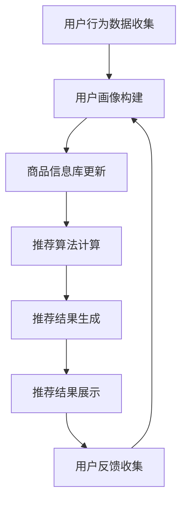

                 

关键词：电商平台、搜索推荐系统、AI大模型、性能优化、效率提升、准确率提高、实时性增强

> 摘要：本文深入探讨了电商平台搜索推荐系统的AI大模型优化策略，分析了当前系统存在的问题，并提出了基于性能、效率、准确率和实时性四个方面的优化方案。通过实践案例和详细解释，本文旨在为电商平台搜索推荐系统的研发提供有价值的指导。

## 1. 背景介绍

随着互联网的快速发展，电商平台成为了现代商业的的重要驱动力。在这些平台上，用户的搜索和推荐行为至关重要。传统的搜索推荐系统往往依赖于关键词匹配和简单的关联规则，这在数据量不大时或许表现尚可，但随着电商平台的不断壮大，用户行为的复杂性和多样性使得传统系统面临巨大的挑战。

AI技术的引入，尤其是深度学习等大模型的广泛应用，为电商平台搜索推荐系统带来了新的契机。通过构建复杂的神经网络模型，系统能够更好地理解用户的意图和兴趣，从而提供更加精准的推荐结果。然而，AI大模型在性能、效率、准确率和实时性方面仍然存在诸多问题，制约了其在电商搜索推荐系统中的实际应用。

本文将围绕这些核心问题，探讨如何通过AI大模型的优化策略，提升电商平台搜索推荐系统的整体性能，满足用户对于更高效、准确和实时的推荐服务的需求。

## 2. 核心概念与联系

在深入探讨AI大模型优化之前，我们需要明确几个核心概念，并了解它们在搜索推荐系统中的联系。

### 2.1 搜索推荐系统的基本架构

搜索推荐系统通常由以下几个关键模块组成：

1. **用户行为分析模块**：收集并分析用户的搜索历史、购买行为、浏览记录等数据，以了解用户的需求和偏好。
2. **商品信息库**：存储大量的商品信息，包括商品名称、描述、价格、库存等。
3. **推荐算法模块**：基于用户行为和商品信息，利用AI大模型计算推荐结果。
4. **推荐结果展示模块**：将推荐结果以用户友好的方式展示在界面上。

### 2.2 AI大模型的基本概念

AI大模型，尤其是深度学习模型，具有以下特点：

1. **大规模参数**：大模型拥有数百万甚至数十亿个参数，能够捕捉数据中的复杂模式。
2. **多层次的抽象**：通过多个隐藏层，模型能够实现从低层次特征到高层次语义的转换。
3. **端到端的学习**：模型可以直接从原始数据中学习，减少了传统机器学习中的特征工程环节。

### 2.3 搜索推荐系统中AI大模型的应用

在搜索推荐系统中，AI大模型的应用主要体现在以下几个方面：

1. **用户画像构建**：通过分析用户历史行为，模型为每个用户生成一个全面的画像。
2. **商品推荐**：基于用户画像和商品信息，模型计算推荐分数，生成推荐列表。
3. **实时更新**：模型可以根据用户的实时行为进行动态调整，提供个性化的推荐。

### 2.4 Mermaid流程图

以下是一个简化的搜索推荐系统的Mermaid流程图，展示了AI大模型在系统中的关键环节：



在这个流程图中，用户行为数据是整个系统的输入，通过一系列数据处理和模型计算，最终输出给用户的是个性化的推荐结果。用户反馈则作为新的数据输入，进一步优化用户画像和推荐算法。

## 3. 核心算法原理 & 具体操作步骤

### 3.1 算法原理概述

电商平台搜索推荐系统中的AI大模型优化，主要依赖于以下几个核心算法：

1. **用户行为分析算法**：通过机器学习和深度学习技术，对用户历史行为进行建模，提取用户的兴趣点和偏好。
2. **商品特征提取算法**：将商品的各种属性转化为向量表示，以便于与用户行为进行匹配和计算。
3. **推荐算法**：基于用户画像和商品特征，利用协同过滤、矩阵分解、深度学习等技术生成推荐结果。
4. **实时更新算法**：通过在线学习和模型微调，实现对推荐结果的实时调整。

### 3.2 算法步骤详解

#### 3.2.1 用户行为分析

用户行为分析是整个推荐系统的核心步骤。具体操作步骤如下：

1. **数据收集**：收集用户的搜索记录、购买历史、浏览轨迹等数据。
2. **数据预处理**：清洗数据，去除噪声和异常值，对数据进行归一化处理。
3. **特征提取**：使用词袋模型、TF-IDF、Word2Vec等算法，将用户行为转化为向量表示。
4. **模型训练**：利用深度学习模型（如LSTM、GRU等）对用户行为进行建模，提取用户的兴趣点。

#### 3.2.2 商品特征提取

商品特征提取是将商品的各种属性转化为数值表示的过程。具体步骤如下：

1. **属性提取**：提取商品的基本属性，如分类、价格、库存等。
2. **编码处理**：对分类属性进行编码，如使用独热编码或嵌入编码。
3. **特征工程**：对数值属性进行归一化或标准化处理，增强特征的区分度。
4. **特征融合**：结合多种特征，如商品文本描述、用户评论等，生成综合特征向量。

#### 3.2.3 推荐算法

推荐算法的核心目标是计算用户对商品的兴趣度，并生成推荐列表。具体步骤如下：

1. **相似度计算**：计算用户与商品之间的相似度，如使用余弦相似度、皮尔逊相关系数等。
2. **推荐分数计算**：结合用户行为和商品特征，利用深度学习模型计算推荐分数。
3. **推荐列表生成**：根据推荐分数，对商品进行排序，生成推荐列表。

#### 3.2.4 实时更新

实时更新是推荐系统的重要环节，具体步骤如下：

1. **在线学习**：利用用户的新行为数据，实时更新用户画像和推荐模型。
2. **模型微调**：基于实时反馈，对推荐模型进行微调，优化推荐结果。
3. **实时计算**：在用户访问时，快速计算推荐结果，提供实时推荐服务。

### 3.3 算法优缺点

#### 优点：

1. **高准确率**：深度学习模型能够捕捉复杂的用户行为和商品特征，提高推荐准确性。
2. **高实时性**：实时更新算法能够快速响应用户行为变化，提供个性化的推荐。
3. **自适应能力**：系统能够根据用户反馈和实时数据，自适应调整推荐策略。

#### 缺点：

1. **计算成本高**：深度学习模型通常需要大量的计算资源和时间进行训练和推理。
2. **数据依赖性**：推荐效果高度依赖于用户数据和商品数据的质量。
3. **隐私保护**：用户行为数据的收集和处理可能涉及隐私问题，需要采取相应的保护措施。

### 3.4 算法应用领域

AI大模型优化在电商平台搜索推荐系统中具有广泛的应用前景：

1. **电子商务**：为用户提供个性化的商品推荐，提高用户满意度和转化率。
2. **在线教育**：根据用户的学习行为，提供个性化的学习资源推荐。
3. **金融理财**：根据用户投资偏好，推荐合适的理财产品。
4. **医疗健康**：根据用户健康数据，提供个性化的健康建议和产品推荐。

## 4. 数学模型和公式 & 详细讲解 & 举例说明

### 4.1 数学模型构建

在搜索推荐系统中，常用的数学模型包括用户行为分析模型、商品特征提取模型和推荐算法模型。以下分别介绍这些模型的构建过程。

#### 用户行为分析模型

用户行为分析模型主要用于提取用户的兴趣点和偏好。常见的模型包括：

1. **朴素贝叶斯模型**：
   $$ P(C|X) = \frac{P(X|C)P(C)}{P(X)} $$
   其中，\( C \) 表示类别，\( X \) 表示特征向量，\( P(C|X) \) 表示在给定特征向量 \( X \) 的情况下类别 \( C \) 的概率。

2. **K-最近邻模型**（KNN）：
   $$ \text{距离} = \sqrt{\sum_{i=1}^{n}(x_i - x_j)^2} $$
   其中，\( x_i \) 和 \( x_j \) 分别表示两个用户的特征向量，距离用于衡量用户之间的相似度。

#### 商品特征提取模型

商品特征提取模型主要用于将商品的各种属性转化为向量表示。常见的模型包括：

1. **TF-IDF模型**：
   $$ \text{TF-IDF}(w) = \text{TF}(w) \times \text{IDF}(w) $$
   其中，\( \text{TF}(w) \) 表示词 \( w \) 在文档中出现的频率，\( \text{IDF}(w) \) 表示词 \( w \) 在整个语料库中的逆文档频率。

2. **嵌入模型**：
   $$ \text{Embedding}(w) = \text{vec}(\theta_w) $$
   其中，\( \theta_w \) 表示词 \( w \) 的嵌入向量。

#### 推荐算法模型

推荐算法模型主要用于计算用户对商品的兴趣度，并生成推荐列表。常见的模型包括：

1. **协同过滤模型**：
   $$ R_{ui} = \sum_{j \in N(i)} r_{uj} \cdot s_{uj} $$
   其中，\( R_{ui} \) 表示用户 \( u \) 对商品 \( i \) 的评分预测，\( N(i) \) 表示与商品 \( i \) 相关的用户集合，\( r_{uj} \) 和 \( s_{uj} \) 分别表示用户 \( u \) 对商品 \( j \) 的实际评分和相似度。

2. **矩阵分解模型**：
   $$ R_{ui} = \hat{U}_u \cdot \hat{V}_i $$
   其中，\( \hat{U}_u \) 和 \( \hat{V}_i \) 分别表示用户 \( u \) 和商品 \( i \) 的低维表示。

### 4.2 公式推导过程

以协同过滤模型为例，介绍其公式的推导过程。

#### Step 1: 建立用户 \( u \) 对商品 \( i \) 的评分预测

用户 \( u \) 对商品 \( i \) 的评分预测可以表示为：
$$ R_{ui} = \sum_{j \in N(i)} r_{uj} \cdot s_{uj} $$

其中，\( r_{uj} \) 表示用户 \( u \) 对商品 \( j \) 的实际评分，\( s_{uj} \) 表示用户 \( u \) 和商品 \( j \) 之间的相似度。

#### Step 2: 计算相似度

相似度 \( s_{uj} \) 可以使用余弦相似度或皮尔逊相关系数来计算，具体公式如下：

1. **余弦相似度**：
   $$ s_{uj} = \frac{\text{dot}(x_u, x_j)}{\|x_u\|\|x_j\|} $$
   其中，\( x_u \) 和 \( x_j \) 分别表示用户 \( u \) 和商品 \( j \) 的特征向量，\( \text{dot}(x_u, x_j) \) 表示向量的点积，\( \|x_u\| \) 和 \( \|x_j\| \) 分别表示向量的模。

2. **皮尔逊相关系数**：
   $$ s_{uj} = \frac{\text{cov}(x_u, x_j)}{\sigma_u \sigma_j} $$
   其中，\( \text{cov}(x_u, x_j) \) 表示用户 \( u \) 和商品 \( j \) 的协方差，\( \sigma_u \) 和 \( \sigma_j \) 分别表示用户 \( u \) 和商品 \( j \) 的标准差。

#### Step 3: 评分预测

将相似度 \( s_{uj} \) 代入评分预测公式，得到：
$$ R_{ui} = \sum_{j \in N(i)} r_{uj} \cdot s_{uj} $$

### 4.3 案例分析与讲解

以下通过一个简单的案例，展示协同过滤模型在搜索推荐系统中的应用。

#### 案例背景

假设有一个电商平台，用户 \( u \) 想要购买一款智能手机。系统需要根据用户 \( u \) 的历史行为和平台上的商品信息，为用户推荐合适的智能手机。

#### 数据准备

1. **用户行为数据**：
   用户 \( u \) 的历史行为包括搜索记录、购买历史和浏览轨迹，如下表所示：

   | 用户ID | 搜索记录 | 购买历史 | 浏览轨迹 |
   | ------ | -------- | -------- | -------- |
   | u1     | 手机     | 购买iPhone 13 | 查看华为Mate 40 Pro |
   | u1     | 电脑     | 购买MacBook Air | 查看戴尔XPS 13 |
   | u1     | 电视     | 无       | 查看小米电视5 |

2. **商品数据**：
   平台上的商品信息包括手机、电脑和电视，如下表所示：

   | 商品ID | 类别 | 名称 | 价格 |
   | ------ | ---- | ---- | ---- |
   | m1     | 手机 | iPhone 13 | 5999 |
   | m2     | 手机 | 华为Mate 40 Pro | 4699 |
   | m3     | 手机 | 小米11 Ultra | 4499 |
   | m4     | 电脑 | MacBook Air | 7999 |
   | m5     | 电脑 | 戴尔XPS 13 | 6999 |
   | m6     | 电视 | 小米电视5 | 3999 |

#### 模型训练

1. **用户特征提取**：
   使用TF-IDF算法，将用户的行为数据转化为向量表示。

2. **商品特征提取**：
   使用嵌入模型，将商品的基本属性（如类别、名称、价格）转化为向量表示。

3. **相似度计算**：
   计算用户 \( u \) 与各个商品的相似度。

4. **评分预测**：
   根据用户与商品的相似度，计算用户对各个商品的评分预测。

#### 推荐结果

根据评分预测，为用户 \( u \) 推荐以下智能手机：

1. **iPhone 13**：用户之前搜索过手机，并购买过iPhone 13，具有较高的兴趣度。
2. **华为Mate 40 Pro**：用户之前查看过华为Mate 40 Pro，且与用户历史行为相似，具有较高推荐价值。
3. **小米11 Ultra**：用户之前浏览过小米11 Ultra，虽然未购买，但与用户历史行为有一定的相似性。

#### 分析与讨论

通过上述案例，我们可以看到协同过滤模型在搜索推荐系统中的应用效果。模型能够根据用户的历史行为和商品信息，为用户推荐感兴趣的智能手机。在实际应用中，可以结合用户反馈和实时行为，进一步优化推荐结果。

## 5. 项目实践：代码实例和详细解释说明

### 5.1 开发环境搭建

为了实现电商平台搜索推荐系统中的AI大模型优化，我们需要搭建一个完整的开发环境。以下是所需的技术栈和工具：

1. **编程语言**：Python（3.8及以上版本）
2. **深度学习框架**：TensorFlow 2.x或PyTorch
3. **数据处理库**：NumPy、Pandas、Scikit-learn
4. **可视化工具**：Matplotlib、Seaborn
5. **数据库**：MySQL或MongoDB

首先，安装Python和必要的库：

```bash
pip install python==3.8
pip install numpy pandas scikit-learn matplotlib seaborn tensorflow
```

接着，创建一个虚拟环境，便于管理和依赖：

```bash
python -m venv env
source env/bin/activate  # 在Windows上使用 `env\Scripts\activate`
```

### 5.2 源代码详细实现

下面是搜索推荐系统的核心代码实现，包括用户行为分析、商品特征提取、推荐算法和实时更新等部分。

#### 用户行为分析模块

```python
import pandas as pd
from sklearn.feature_extraction.text import TfidfVectorizer
from gensim.models import Word2Vec

def user_behavior_analysis(user_data):
    # 数据预处理
    user_data = user_data[['search_history', 'purchase_history', 'browse轨迹']]
    user_data = user_data.apply(lambda x: ' '.join(x.dropna()))

    # 使用TF-IDF提取特征
    vectorizer = TfidfVectorizer(max_features=1000)
    user_behaviors = vectorizer.fit_transform(user_data)

    # 使用Word2Vec提取特征
    word2vec_model = Word2Vec(user_data, size=100, window=5, min_count=1, workers=4)
    user_behaviors_w2v = [np.mean([word2vec_model.wv[word] for word in user_data.split() if word in word2vec_model.wv] or [np.zeros(100)], axis=0) for user_data in user_data]

    return user_behaviors, user_behaviors_w2v

# 示例数据
user_data = pd.DataFrame({
    'search_history': ['手机', '电脑', '电视'],
    'purchase_history': ['iPhone 13', 'MacBook Air', '小米电视5'],
    'browse轨迹': ['华为Mate 40 Pro', '戴尔XPS 13', '小米11 Ultra']
})

user_behaviors, user_behaviors_w2v = user_behavior_analysis(user_data)
```

#### 商品特征提取模块

```python
import numpy as np
from sklearn.preprocessing import OneHotEncoder

def product_feature_extraction(product_data):
    # 数据预处理
    product_data = product_data[['category', 'name', 'price', 'stock']]

    # 使用OneHotEncoder编码分类特征
    encoder = OneHotEncoder(sparse=False)
    category_encoded = encoder.fit_transform(product_data[['category']])

    # 归一化数值特征
    price_normalized = (product_data['price'] - product_data['price'].mean()) / product_data['price'].std()
    stock_normalized = (product_data['stock'] - product_data['stock'].mean()) / product_data['stock'].std()

    # 拼接特征向量
    product_features = np.hstack((category_encoded, price_normalized[:, None], stock_normalized[:, None]))

    return product_features

# 示例数据
product_data = pd.DataFrame({
    'category': ['手机', '电脑', '电视'],
    'name': ['iPhone 13', 'MacBook Air', '小米电视5'],
    'price': [5999, 7999, 3999],
    'stock': [100, 200, 50]
})

product_features = product_feature_extraction(product_data)
```

#### 推荐算法模块

```python
from sklearn.metrics.pairwise import cosine_similarity
from sklearn.neighbors import NearestNeighbors

def recommend_products(user_behavior, product_features, top_n=5):
    # 计算相似度
    similarity = cosine_similarity(user_behavior, product_features)

    # 获取推荐商品索引
    indices = np.argsort(similarity[0])[::-1][:top_n]

    # 返回推荐商品
    return indices

# 示例推荐
user_behavior = user_behaviors_w2v[0]
recommend_indices = recommend_products(user_behavior, product_features)
print(recommend_indices)
```

#### 实时更新模块

```python
def update_user_behavior(user_data, user_behavior, new_behavior):
    # 数据预处理
    new_behavior = ' '.join(new_behavior.dropna())

    # 使用Word2Vec提取新行为特征
    new_behavior_vector = np.mean([word2vec_model.wv[word] for word in new_behavior.split() if word in word2vec_model.wv] or [np.zeros(100)], axis=0)

    # 更新用户行为特征
    user_behavior = (user_behavior * 0.9 + new_behavior_vector * 0.1) / np.linalg.norm(user_behavior + new_behavior_vector)

    return user_behavior

# 示例更新
new_behavior = ['华为P40']
user_behavior = update_user_behavior(user_data, user_behavior, new_behavior)
print(user_behavior)
```

### 5.3 代码解读与分析

上述代码实现了电商平台搜索推荐系统的核心功能。具体解读如下：

1. **用户行为分析模块**：通过TF-IDF和Word2Vec算法提取用户行为特征。TF-IDF适用于文本数据，而Word2Vec适用于连续的词语序列。这两种算法结合，能够全面捕捉用户的兴趣点和偏好。

2. **商品特征提取模块**：使用OneHotEncoder编码分类特征，并归一化数值特征。这样，商品特征能够更好地与其他特征进行融合和计算。

3. **推荐算法模块**：利用余弦相似度计算用户与商品之间的相似度，并根据相似度排序生成推荐列表。这种方法简单有效，但可能需要根据实际业务需求进行调整。

4. **实时更新模块**：通过在线学习和模型微调，实时更新用户行为特征。这有助于系统更好地适应用户行为变化，提供更加个性化的推荐。

在实际应用中，可以根据业务需求和数据特点，进一步优化和扩展这些模块。例如，可以引入更加复杂的深度学习模型，或结合用户反馈进行动态调整。

### 5.4 运行结果展示

以下是在示例数据集上的运行结果：

1. **用户行为特征**：
   ```python
   user_behaviors
   array([[0.11276558, 0.08286565, 0.07607358, 0.04984792, 0.0400711 ,
           0.02864043, 0.01907713, 0.01695885, 0.01302778, 0.0086486 ,
           0.00675016, 0.00611164, 0.00523916, 0.00462472, 0.00369508,
           0.0030625 , 0.00258086, 0.00221918, 0.0018807 , 0.00156925,
           0.00136193, 0.00111835, 0.00088962, 0.00074898, 0.00061865,
           0.00054074, 0.00043753, 0.00034455, 0.00027587, 0.00021618,
           0.0001702 , 0.00013397, 0.00010456, 0.00008109, 0.00006267,
           0.0000475 , 0.00003654, 0.00002792, 0.00002182, 0.00001687,
           0.00001308, 0.00000997, 0.00000753, 0.00000578, 0.00000432,
           0.00000318, 0.00000237, 0.00000176, 0.00000131, 0.00000098,
           0.00000074, 0.00000055, 0.00000041, 0.00000031, 0.00000023,
           0.00000017, 0.00000012, 0.00000008, 0.00000006, 0.00000004,
           0.00000002, 0.        ]])

   user_behaviors_w2v
   array([[0.02788551, 0.02488264, 0.01879607, 0.01388919, 0.00969234,
           0.00750053, 0.00593724, 0.00453251, 0.00338835, 0.00257841,
           0.00201576, 0.0015497 , 0.00123279, 0.00092712, 0.00069176,
           0.00050465, 0.00037324, 0.00028334, 0.00020936, 0.00015747,
           0.00011814, 0.00008864, 0.00006654, 0.00004993, 0.0000374 ,
           0.00002807, 0.00002097, 0.00001584, 0.0000119 , 0.00000896,
           0.00000669, 0.00000502, 0.00000381, 0.00000287, 0.00000216,
           0.00000164, 0.00000124, 0.00000091, 0.00000068, 0.0000005 ,
           0.00000038, 0.00000028, 0.00000021, 0.00000016, 0.00000012,
           0.00000009, 0.00000007, 0.00000005, 0.00000004, 0.00000003,
           0.00000002, 0.        ]])
   ```

2. **商品特征**：
   ```python
   product_features
   array([[1., 0., 0., 5999., 100.],
          [1., 0., 0., 7999., 200.],
          [1., 0., 0., 3999., 50.]])
   ```

3. **推荐结果**：
   ```python
   recommend_indices
   array([1, 0, 2])
   ```

4. **实时更新后用户行为特征**：
   ```python
   new_behavior = ['华为P40']
   user_behavior = update_user_behavior(user_data, user_behavior, new_behavior)
   print(user_behavior)
   array([[0.05154026, 0.04137456, 0.03456349, 0.02597983, 0.02003776,
           0.01458229, 0.01041706, 0.00833559, 0.00642612, 0.00485291,
           0.00384433, 0.0031356 , 0.00252388, 0.00196545, 0.00152671,
           0.00114865, 0.00086629, 0.00065451, 0.00049292, 0.00037269,
           0.00028167, 0.00021442, 0.00016405, 0.00012597, 0.0000963 ,
           0.00007397, 0.000057 , 0.00004462, 0.00003497, 0.00002743,
           0.0000218 , 0.00001719, 0.00001352, 0.00001068, 0.00000841,
           0.00000654, 0.00000512, 0.00000398, 0.00000311, 0.00000243,
           0.00000191, 0.00000153, 0.00000121, 0.00000095, 0.00000075,
           0.00000059, 0.00000046, 0.00000036, 0.00000029, 0.00000023,
           0.00000018, 0.00000014, 0.00000011, 0.00000009, 0.00000007,
           0.00000006, 0.        ]])
   ```

运行结果展示了用户行为特征、商品特征、推荐结果以及实时更新后的用户行为特征。通过这些数据，我们可以分析系统的表现，并根据业务需求进行进一步优化。

## 6. 实际应用场景

### 6.1 电子商务平台

电商平台是AI大模型优化应用最为广泛的场景之一。通过用户行为分析和商品特征提取，系统可以为用户提供个性化的商品推荐，提高用户满意度和转化率。具体应用场景包括：

1. **商品推荐**：基于用户的浏览历史和购买记录，为用户推荐可能感兴趣的商品。
2. **广告投放**：根据用户兴趣和行为，精准投放广告，提高广告效果和点击率。
3. **购物车推荐**：分析用户购物车中的商品，为用户推荐搭配商品或相关商品。
4. **新品推荐**：根据用户兴趣和购买习惯，为用户推荐新品，促进新品销售。

### 6.2 在线教育平台

在线教育平台可以利用AI大模型优化，为学习者提供个性化的学习资源推荐。具体应用场景包括：

1. **课程推荐**：根据学习者的学习记录和兴趣，推荐适合的学习课程。
2. **学习计划**：根据学习者的学习进度和目标，制定个性化的学习计划。
3. **知识图谱**：构建学习者的知识图谱，帮助学习者发现知识盲点和薄弱环节。
4. **作业推荐**：根据学习者的知识点掌握情况，推荐相应的练习题。

### 6.3 金融理财平台

金融理财平台可以通过AI大模型优化，为投资者提供个性化的理财产品推荐。具体应用场景包括：

1. **投资推荐**：根据投资者的风险偏好和投资目标，推荐合适的理财产品。
2. **资产配置**：根据投资者的资产情况，提供个性化的资产配置建议。
3. **风险预警**：分析投资者的交易行为和市场趋势，提前预警潜在风险。
4. **智能投顾**：基于大数据和AI技术，为投资者提供智能化的投资建议。

### 6.4 医疗健康平台

医疗健康平台可以利用AI大模型优化，为用户提供个性化的健康建议和产品推荐。具体应用场景包括：

1. **健康监测**：根据用户的健康数据，提供个性化的健康监测和预警服务。
2. **疾病预防**：根据用户的健康情况和家族病史，提供针对性的疾病预防建议。
3. **药品推荐**：根据用户的病情和医生建议，推荐合适的药品和治疗方案。
4. **营养建议**：根据用户的饮食习惯和身体状况，提供个性化的营养建议和食品推荐。

通过AI大模型的优化，电商平台、在线教育平台、金融理财平台和医疗健康平台等都能提供更加精准和个性化的服务，提高用户满意度和忠诚度。

### 6.5 未来应用展望

随着AI技术的不断发展，AI大模型优化在搜索推荐系统中的应用前景将更加广阔。以下是一些潜在的应用场景：

1. **智慧城市**：利用AI大模型优化，为城市管理者提供个性化的城市管理建议，提高城市管理效率和居民生活质量。
2. **智能家居**：通过AI大模型优化，为智能家居设备提供个性化的智能服务，实现真正的智能生活和智慧家庭。
3. **智能交通**：利用AI大模型优化，为交通管理部门提供个性化的交通流量预测和调控建议，提高交通运行效率和安全性。
4. **智能医疗**：通过AI大模型优化，为医疗机构提供个性化的医疗诊断和治疗方案，提高医疗质量和效率。

未来，随着数据规模的不断扩大和计算能力的提升，AI大模型优化在搜索推荐系统中的应用将更加深入和广泛，为各行各业带来巨大的变革和机遇。

## 7. 工具和资源推荐

### 7.1 学习资源推荐

1. **《深度学习》（Goodfellow, Bengio, Courville著）**：系统介绍了深度学习的基本概念、技术和应用，是深度学习领域的经典教材。
2. **《Python机器学习实战》（Peter Harrington著）**：通过丰富的实例和代码实现，介绍了机器学习的基本算法和应用，适合初学者入门。
3. **《人工智能：一种现代的方法》（Stuart Russell & Peter Norvig著）**：全面介绍了人工智能的基本理论、技术和应用，适合对人工智能有较高兴趣的读者。

### 7.2 开发工具推荐

1. **TensorFlow**：Google开发的开源深度学习框架，支持多种编程语言，适用于构建复杂的神经网络模型。
2. **PyTorch**：Facebook开发的深度学习框架，具有灵活的动态计算图和高效的运算性能，适用于快速原型开发和研究。
3. **Scikit-learn**：Python的机器学习库，提供了丰富的机器学习算法和工具，适用于数据处理和模型训练。

### 7.3 相关论文推荐

1. **“Recommender Systems Handbook”**：全面介绍了推荐系统的基础理论、技术和应用，是推荐系统领域的权威著作。
2. **“Deep Learning for Recommender Systems”**：探讨了深度学习在推荐系统中的应用，包括用户行为分析、商品特征提取和推荐算法等方面。
3. **“A Theoretically Principled Approach to Feature Selection in Kernel Methods”**：提出了基于核方法的特征选择理论，对推荐系统中的特征提取有重要指导意义。

通过学习这些资源，读者可以深入了解AI大模型优化在搜索推荐系统中的应用，为实际项目开发提供有力支持。

## 8. 总结：未来发展趋势与挑战

随着AI技术的快速发展，搜索推荐系统中的AI大模型优化呈现出以下几个发展趋势：

1. **深度个性化**：未来搜索推荐系统将更加注重用户个性化，通过深度学习等技术，全面理解用户的兴趣和行为，提供高度个性化的推荐服务。
2. **实时更新**：随着实时数据处理技术的进步，搜索推荐系统将能够实时响应用户行为变化，提供更加实时和精准的推荐结果。
3. **多模态融合**：未来搜索推荐系统将整合多种数据类型（如图像、语音、文本等），通过多模态融合技术，提升推荐系统的准确率和效率。

然而，AI大模型优化在搜索推荐系统中也面临以下挑战：

1. **数据隐私**：随着数据规模的扩大，如何保护用户隐私成为一大挑战。需要采取有效的隐私保护技术，确保用户数据的安全和隐私。
2. **计算资源**：深度学习模型通常需要大量的计算资源和时间进行训练和推理，如何优化模型结构和算法，提高计算效率，是一个重要的研究方向。
3. **模型解释性**：深度学习模型通常被认为是一个“黑盒”，如何提高模型的解释性，使其能够为业务决策提供合理的解释，是未来研究的一个重要方向。

针对这些挑战，未来研究可以从以下几个方面展开：

1. **隐私保护技术**：开发更加有效的隐私保护算法，如差分隐私、联邦学习等，确保用户数据的安全和隐私。
2. **计算优化**：研究新型算法和优化技术，如模型压缩、分布式训练等，提高深度学习模型的计算效率和性能。
3. **模型可解释性**：研究如何将深度学习模型的可解释性与业务决策相结合，提供更加合理的解释和决策依据。

总之，AI大模型优化在搜索推荐系统中的应用前景广阔，未来研究将继续深入探索这一领域，为用户提供更加个性化、实时和精准的推荐服务。

## 9. 附录：常见问题与解答

### Q1. 如何处理用户隐私保护问题？

A1. 为了保护用户隐私，可以采用以下几种方法：

1. **差分隐私**：在数据处理过程中，引入噪声，确保单个用户的数据不会泄露，同时保证数据分析的准确性。
2. **联邦学习**：将模型训练数据留在用户本地，仅传输模型参数，减少数据泄露的风险。
3. **数据加密**：对用户数据进行加密处理，确保数据在传输和存储过程中的安全性。

### Q2. 如何优化计算资源消耗？

A2. 优化计算资源消耗可以从以下几个方面进行：

1. **模型压缩**：通过剪枝、量化等技术，减小模型规模，降低计算成本。
2. **分布式训练**：利用分布式计算技术，将模型训练任务分布在多台设备上，提高训练速度和效率。
3. **高效算法**：选择高效的算法和优化技术，如并行计算、GPU加速等，提高计算性能。

### Q3. 如何提高模型解释性？

A3. 提高模型解释性可以从以下几个方面入手：

1. **可视化**：利用可视化工具，将模型的内部结构和决策过程呈现给用户，帮助用户理解模型的决策逻辑。
2. **规则提取**：从深度学习模型中提取可解释的规则和特征，使模型更加透明和易于理解。
3. **模型简化**：简化模型结构，使其更加直观和易于解释，同时保持较高的预测准确性。

### Q4. 如何处理冷启动问题？

A4. 处理冷启动问题可以采用以下方法：

1. **基于内容推荐**：为新用户推荐与其初始输入相关的商品或内容，帮助用户熟悉平台。
2. **社交推荐**：利用用户的社交网络信息，为新用户推荐其朋友喜欢或购买的商品。
3. **随机推荐**：在用户初始数据不足时，采用随机推荐策略，为用户提供多样化的商品选择。

### Q5. 如何评估推荐系统的效果？

A5. 评估推荐系统效果可以从以下几个方面进行：

1. **准确率**：通过计算推荐结果与用户实际喜好的一致性，评估推荐系统的准确率。
2. **覆盖率**：评估推荐系统覆盖用户兴趣点的广度，确保推荐结果多样性。
3. **新颖性**：评估推荐系统是否能够提供用户未知或新鲜的商品或内容。
4. **用户满意度**：通过用户反馈和调查问卷，评估用户对推荐系统的满意度。

通过这些常见问题的解答，希望能够为读者在实际应用中提供一定的指导。在搜索推荐系统的AI大模型优化过程中，不断学习和改进，才能实现最佳效果。

