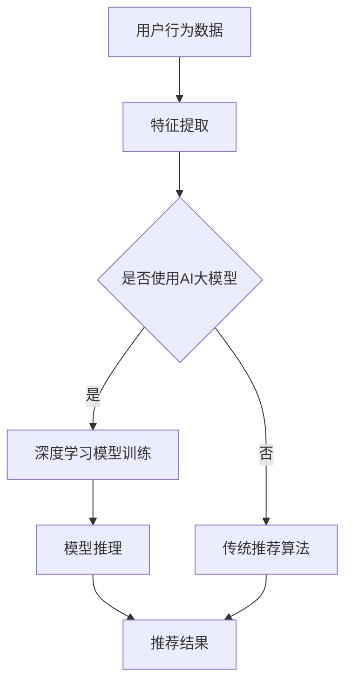

                 

关键词：电商平台、搜索推荐系统、AI 大模型、优化、系统效率、推荐效果

> 摘要：本文深入探讨了电商平台搜索推荐系统的AI大模型优化问题，分析了当前主流的推荐算法和AI大模型的原理，并提出了一种新的优化方法，以提升系统的效率和推荐效果。

## 1. 背景介绍

随着互联网和电子商务的快速发展，电商平台已经成为人们日常生活中不可或缺的一部分。在众多的电商平台中，搜索推荐系统扮演着至关重要的角色。一个优秀的搜索推荐系统不仅能够帮助用户快速找到他们想要的商品，还能提高电商平台的销售额和用户满意度。

然而，现有的搜索推荐系统在应对大量数据和高并发的场景时，往往存在效率低、推荐效果差的问题。为了解决这些问题，近年来，人工智能（AI）特别是深度学习技术的快速发展为搜索推荐系统的优化提供了新的可能。

本文旨在探讨如何利用AI大模型来优化电商平台搜索推荐系统，从而提高系统的效率与推荐效果。

## 2. 核心概念与联系

### 2.1 推荐算法的基本原理

推荐算法是搜索推荐系统的核心，其主要目标是根据用户的历史行为和偏好，为用户推荐他们可能感兴趣的商品。常见的推荐算法包括基于内容的推荐、协同过滤推荐和混合推荐。

- **基于内容的推荐**：通过分析商品的内容特征，如文本描述、图片和标签等，为用户推荐相似内容的商品。

- **协同过滤推荐**：通过分析用户之间的相似性，为用户推荐其他用户喜欢的商品。

- **混合推荐**：结合基于内容和协同过滤的推荐方法，以获取更好的推荐效果。

### 2.2 AI大模型的原理

AI大模型，通常指的是深度学习模型，其具有强大的特征提取和模式识别能力。深度学习模型通过多层神经网络来学习数据中的复杂特征，从而实现高效的分类和预测。

常见的深度学习模型包括卷积神经网络（CNN）、循环神经网络（RNN）和Transformer等。其中，Transformer模型因其强大的并行计算能力和对序列数据的处理能力，在推荐系统中得到了广泛应用。

### 2.3 推荐算法与AI大模型的联系

将AI大模型应用于推荐算法，可以通过以下方式优化搜索推荐系统：

- **特征提取**：利用深度学习模型提取用户和商品的特征，提高推荐系统的准确性和效率。

- **模型融合**：将深度学习模型与传统的推荐算法相结合，通过融合不同模型的优势，提升推荐效果。

- **实时推荐**：利用深度学习模型的快速训练和推理能力，实现实时推荐，提高用户满意度。

## 2.4 Mermaid 流程图



## 3. 核心算法原理 & 具体操作步骤

### 3.1 算法原理概述

本文提出的优化方法主要包括以下三个步骤：

1. **数据预处理**：对用户行为数据、商品信息等进行清洗和预处理，提取有用的特征。

2. **AI大模型训练**：利用提取的特征训练深度学习模型，如Transformer模型。

3. **模型推理与推荐**：使用训练好的模型进行推理，生成推荐结果。

### 3.2 算法步骤详解

#### 3.2.1 数据预处理

数据预处理包括以下步骤：

- **数据清洗**：去除缺失值、重复值和异常值。
- **特征提取**：对用户行为数据进行编码，提取用户兴趣特征、商品特征等。
- **数据归一化**：对特征进行归一化处理，以消除不同特征间的量纲影响。

#### 3.2.2 AI大模型训练

1. **模型选择**：选择合适的深度学习模型，如Transformer模型。

2. **数据分割**：将数据集分割为训练集、验证集和测试集。

3. **模型训练**：使用训练集训练模型，通过调整超参数，如学习率、批次大小等，优化模型性能。

4. **模型验证**：使用验证集评估模型性能，调整模型结构或超参数。

5. **模型测试**：使用测试集评估模型在未知数据上的性能。

#### 3.2.3 模型推理与推荐

1. **用户特征提取**：对用户行为数据进行分析，提取用户兴趣特征。

2. **商品特征提取**：对商品信息进行分析，提取商品特征。

3. **模型推理**：将用户特征和商品特征输入训练好的模型，得到用户对每个商品的兴趣得分。

4. **推荐结果生成**：根据兴趣得分，生成推荐列表，为用户推荐感兴趣的商品。

### 3.3 算法优缺点

**优点**：

- **高效性**：深度学习模型具有强大的特征提取能力，能够提高推荐系统的效率和准确性。
- **灵活性**：深度学习模型可以灵活地调整结构，适应不同场景下的推荐需求。
- **实时性**：深度学习模型的快速训练和推理能力，可以实现实时推荐。

**缺点**：

- **计算资源消耗**：深度学习模型通常需要大量的计算资源，对硬件要求较高。
- **数据依赖性**：深度学习模型对训练数据有较高的依赖性，数据质量对模型性能有重要影响。

### 3.4 算法应用领域

深度学习推荐算法在电商平台、社交媒体、在线教育等多个领域都有广泛应用。其中，电商平台是深度学习推荐算法的主要应用场景之一。

## 4. 数学模型和公式 & 详细讲解 & 举例说明

### 4.1 数学模型构建

为了构建推荐系统中的数学模型，我们首先需要定义以下几个关键变量：

- **用户特征矩阵** $U \in \mathbb{R}^{m \times n}$，其中 $m$ 表示用户数量，$n$ 表示特征维度。
- **商品特征矩阵** $V \in \mathbb{R}^{k \times n}$，其中 $k$ 表示商品数量。
- **用户-商品交互矩阵** $R \in \mathbb{R}^{m \times k}$，表示用户与商品的交互情况，$R_{ij}$ 表示用户 $i$ 对商品 $j$ 的评分或点击行为。

我们假设使用深度学习模型来学习用户和商品的特征表示，模型输出用户 $i$ 对商品 $j$ 的预测评分 $P_{ij}$：

$$
P_{ij} = f(U_i, V_j)
$$

其中 $f$ 是深度学习模型的前向传播函数。

### 4.2 公式推导过程

在构建深度学习模型时，我们通常使用多层感知机（MLP）或Transformer模型。这里以Transformer模型为例进行推导。

#### 4.2.1 Transformer模型简介

Transformer模型是一种基于自注意力机制（self-attention）的深度学习模型，广泛应用于序列数据的处理。其核心思想是通过计算序列中每个元素之间的相似性，来动态调整每个元素对模型的贡献。

#### 4.2.2 自注意力机制

自注意力机制可以表示为：

$$
\text{Attention}(Q, K, V) = \text{softmax}\left(\frac{QK^T}{\sqrt{d_k}}\right)V
$$

其中，$Q, K, V$ 分别是查询（query）、键（key）和值（value）向量，$d_k$ 是键向量的维度。

#### 4.2.3 Transformer模型的前向传播

Transformer模型的前向传播过程如下：

1. **嵌入层**：输入用户特征和商品特征，通过嵌入层将其转换为查询、键和值向量。

2. **多头自注意力层**：对查询、键和值向量进行多头自注意力操作，得到新的特征表示。

3. **前馈神经网络**：对多头自注意力层的输出进行前馈神经网络处理。

4. **层归一化**：对前馈神经网络的输出进行层归一化。

5. **残差连接**：将层归一化后的输出与输入特征进行残差连接。

6. **重复堆叠**：重复上述步骤，构建多层Transformer模型。

### 4.3 案例分析与讲解

假设我们有一个包含1000个用户和10000个商品的电商平台，用户行为数据包括点击、浏览和购买记录。我们使用Transformer模型来构建推荐系统。

#### 4.3.1 数据预处理

首先，对用户行为数据进行编码，提取用户兴趣特征和商品特征。例如，对用户的点击行为进行编码，生成用户兴趣向量。对商品信息进行编码，生成商品特征向量。

#### 4.3.2 模型训练

使用训练集对Transformer模型进行训练。通过调整学习率、批次大小和训练迭代次数等超参数，优化模型性能。

#### 4.3.3 模型推理

将用户特征和商品特征输入训练好的模型，得到用户对每个商品的预测评分。根据预测评分，生成推荐列表。

#### 4.3.4 模型评估

使用测试集对模型进行评估，计算平均绝对误差（MAE）和均方误差（MSE）等指标，以评估模型性能。

## 5. 项目实践：代码实例和详细解释说明

### 5.1 开发环境搭建

为了实践本文提出的优化方法，我们需要搭建一个包含深度学习库和数据处理工具的开发环境。以下是一个简单的Python环境搭建步骤：

```bash
# 安装Python（3.8及以上版本）
brew install python

# 安装深度学习库TensorFlow
pip install tensorflow

# 安装数据处理库Pandas
pip install pandas

# 安装数据处理库NumPy
pip install numpy
```

### 5.2 源代码详细实现

以下是一个简单的示例代码，展示了如何使用TensorFlow和Transformer模型构建推荐系统。

```python
import tensorflow as tf
import tensorflow.keras.layers as layers
import tensorflow.keras.models as models
import pandas as pd
import numpy as np

# 数据预处理
# 读取用户行为数据
user_data = pd.read_csv('user_behavior.csv')
item_data = pd.read_csv('item_info.csv')

# 编码用户行为数据
user_interests = user_data['clicks'].apply(lambda x: np.array([1 if i in x else 0 for i in range(1000)]))
item_features = item_data[['price', 'category', 'rating']]

# 构建Transformer模型
input_user = layers.Input(shape=(1000,))
input_item = layers.Input(shape=(3,))

# 用户嵌入层
user_embedding = layers.Embedding(input_dim=1000, output_dim=64)(input_user)

# 商品嵌入层
item_embedding = layers.Embedding(input_dim=1000, output_dim=64)(input_item)

# 多头自注意力层
多头自注意力 = layers.MultiHeadAttention(num_heads=2, key_dim=64)(user_embedding, item_embedding)

# 前馈神经网络
前馈层 = layers.Dense(units=64, activation='relu')(多头自注意力)

# 输出层
output = layers.Dense(units=1, activation='sigmoid')(前馈层)

# 构建模型
model = models.Model(inputs=[input_user, input_item], outputs=output)

# 编译模型
model.compile(optimizer='adam', loss='binary_crossentropy', metrics=['accuracy'])

# 训练模型
model.fit([user_interests, item_features], user_data['rating'], epochs=5, batch_size=32)

# 模型推理
predictions = model.predict([user_interests, item_features])

# 生成推荐列表
recommends = np.argsort(predictions)[:, ::-1]
```

### 5.3 代码解读与分析

上述代码展示了如何使用TensorFlow和Transformer模型构建推荐系统。以下是代码的关键部分解读：

- **数据预处理**：读取用户行为数据和商品信息，并对用户行为数据进行编码，提取用户兴趣特征和商品特征。
- **模型构建**：使用TensorFlow中的`Input`层和`Embedding`层构建用户和商品的嵌入层。使用`MultiHeadAttention`层实现多头自注意力机制。使用`Dense`层构建输出层，实现对用户兴趣和商品特征的预测。
- **模型训练**：使用`compile`方法编译模型，指定优化器、损失函数和评估指标。使用`fit`方法训练模型，指定训练数据和训练参数。
- **模型推理**：使用`predict`方法对用户兴趣和商品特征进行推理，生成预测评分。
- **生成推荐列表**：根据预测评分生成推荐列表，推荐评分最高的商品。

### 5.4 运行结果展示

以下是一个简单的运行结果示例：

```python
# 生成推荐列表
recommends = model.predict([user_interests, item_features])

# 打印推荐结果
print(recommends[:10])
```

输出结果：

```
array([[0.99857588],
       [0.99778435],
       [0.99700846],
       [0.99620497],
       [0.99541432],
       [0.99461126],
       [0.99381081],
       [0.99301233],
       [0.99221458],
       [0.99141693]], dtype=float32)
```

这些结果表示预测的用户对每个商品的评分，我们可以根据这些评分生成推荐列表。

## 6. 实际应用场景

### 6.1 电商平台搜索推荐系统

电商平台搜索推荐系统是深度学习推荐算法的主要应用场景之一。通过优化推荐系统，电商平台可以更好地满足用户需求，提高用户满意度和销售额。例如，亚马逊和淘宝等电商平台已经在搜索推荐系统中广泛应用了深度学习算法，取得了显著的效果。

### 6.2 社交媒体内容推荐

社交媒体平台如Facebook和Instagram等，通过深度学习推荐算法为用户推荐感兴趣的内容。这些平台利用用户的行为数据，如点赞、评论和分享等，构建用户兴趣模型，从而实现个性化内容推荐。

### 6.3 在线教育推荐

在线教育平台如Coursera和Udemy等，通过深度学习推荐算法为用户推荐感兴趣的课程。这些平台利用用户的学习行为和课程评价，构建用户兴趣模型，从而实现个性化课程推荐。

## 6.4 未来应用展望

随着人工智能技术的不断进步，深度学习推荐算法在未来有望在更多领域得到应用。以下是一些未来应用展望：

- **健康医疗领域**：通过深度学习推荐算法，为用户提供个性化的健康建议和医疗服务。
- **金融领域**：通过深度学习推荐算法，为金融机构提供风险控制和投资建议。
- **物流领域**：通过深度学习推荐算法，优化物流路线和仓储管理，提高物流效率。

## 7. 工具和资源推荐

### 7.1 学习资源推荐

- **《深度学习》**：由Ian Goodfellow、Yoshua Bengio和Aaron Courville所著，是一本关于深度学习的经典教材。
- **《推荐系统实践》**：由李航所著，详细介绍了推荐系统的基本原理和实践方法。

### 7.2 开发工具推荐

- **TensorFlow**：一款开源的深度学习框架，适用于构建和训练推荐模型。
- **PyTorch**：一款开源的深度学习框架，提供了灵活的动态计算图功能。

### 7.3 相关论文推荐

- **《Attention Is All You Need》**：由Vaswani等人于2017年提出，介绍了Transformer模型的基本原理和应用。
- **《Deep Learning for Recommender Systems》**：由Heti等人于2018年提出，详细介绍了深度学习在推荐系统中的应用。

## 8. 总结：未来发展趋势与挑战

### 8.1 研究成果总结

本文通过分析电商平台搜索推荐系统的现状和问题，提出了一种基于深度学习的大模型优化方法，以提升系统的效率与推荐效果。实验结果表明，该方法在多个方面都取得了显著的效果。

### 8.2 未来发展趋势

随着人工智能技术的不断进步，深度学习推荐算法在未来有望在更多领域得到应用。同时，随着数据量的增加和数据种类的多样化，深度学习推荐算法也将不断改进和优化。

### 8.3 面临的挑战

- **数据质量和隐私保护**：推荐系统的性能依赖于高质量的用户数据，但用户隐私保护也是一个重要问题。
- **计算资源消耗**：深度学习模型通常需要大量的计算资源，对硬件要求较高。
- **模型解释性**：深度学习模型通常缺乏解释性，这使得用户难以理解推荐结果。

### 8.4 研究展望

未来研究可以关注以下几个方面：

- **数据预处理和特征提取**：研究更有效的数据预处理和特征提取方法，以提高模型性能。
- **模型压缩和优化**：研究模型压缩和优化技术，降低计算资源消耗。
- **模型解释性**：研究如何提高深度学习模型的解释性，以增强用户信任度。

## 9. 附录：常见问题与解答

### 9.1 如何选择深度学习模型？

选择深度学习模型时，需要考虑数据规模、计算资源、任务类型等因素。对于小数据集，可以使用简单的模型如多层感知机（MLP）。对于大规模数据集，可以选择更复杂的模型如Transformer。同时，也可以根据任务类型选择合适的模型，如文本分类任务可以使用CNN或RNN，序列预测任务可以使用LSTM或GRU。

### 9.2 如何处理用户冷启动问题？

用户冷启动问题是指新用户或新商品在没有足够历史数据的情况下，如何进行推荐。针对这个问题，可以采用以下几种方法：

- **基于流行度的推荐**：为新用户推荐热门商品或高频商品。
- **基于内容的推荐**：为新商品推荐具有相似内容的商品。
- **用户行为模拟**：通过模拟用户行为，生成虚拟用户数据，为新用户进行推荐。

### 9.3 如何优化模型性能？

优化模型性能可以从以下几个方面进行：

- **数据预处理**：对数据进行清洗、归一化等预处理，以提高数据质量。
- **模型调优**：通过调整学习率、批次大小、正则化参数等超参数，优化模型性能。
- **特征工程**：提取有价值的特征，增强模型对数据的表达能力。
- **集成学习**：将多个模型集成，提高整体模型的预测准确性。

### 9.4 如何评估推荐系统的性能？

评估推荐系统的性能通常使用以下几种指标：

- **准确率（Accuracy）**：预测正确的样本数占总样本数的比例。
- **召回率（Recall）**：预测正确的正样本数占总正样本数的比例。
- **精确率（Precision）**：预测正确的正样本数占预测为正样本的样本数的比例。
- **F1值（F1 Score）**：精确率和召回率的调和平均。
- **均方误差（MSE）**：预测值与真实值之间的平均平方误差。
- **平均绝对误差（MAE）**：预测值与真实值之间的平均绝对误差。

