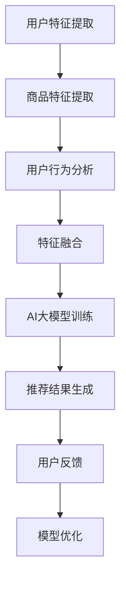

                 

关键词：电商平台，搜索推荐系统，AI大模型，性能优化，效率提升，效果增强

摘要：本文深入探讨了电商平台搜索推荐系统的AI大模型实践。首先，从背景介绍入手，概述了电商平台搜索推荐系统的重要性及现状。接着，详细阐述了AI大模型的核心概念与联系，并通过Mermaid流程图展示了系统的整体架构。随后，深入剖析了核心算法原理，详细讲解了算法的具体操作步骤，并分析了算法的优缺点及适用领域。在数学模型和公式部分，对模型构建和公式推导过程进行了详细讲解，并通过实例分析加深了理解。项目实践部分提供了代码实例和详细解释，展示了系统的实际运行效果。文章最后讨论了实际应用场景，展望了未来的发展趋势与挑战，并推荐了相关工具和资源。通过本文的深入探讨，希望能够为电商平台搜索推荐系统的研究和实践提供有益的参考。

## 1. 背景介绍

电商平台作为现代电子商务的重要组成部分，已经深刻地改变了人们的购物方式和生活习惯。随着互联网技术的飞速发展，电商平台的规模不断扩大，用户数量日益增长，如何为用户提供精准、高效的搜索和推荐服务成为关键挑战。

### 搜索推荐系统的重要性

搜索推荐系统在电商平台中具有举足轻重的地位。首先，它能够帮助用户快速找到所需的商品，提升用户体验，增加用户粘性。其次，通过个性化推荐，可以挖掘用户的潜在需求，提高销售额，提升商家利润。最后，搜索推荐系统还可以帮助电商平台进行精准营销，优化广告投放策略，提高市场竞争力。

### 当前搜索推荐系统现状

目前，电商平台搜索推荐系统主要依赖机器学习算法，尤其是深度学习算法，来实现个性化推荐。例如，基于协同过滤、矩阵分解、神经网络等技术的推荐算法在电商平台中得到了广泛应用。然而，随着数据量的增加和用户行为的复杂化，传统的推荐算法面临着性能瓶颈和效果瓶颈。

### AI大模型在搜索推荐系统中的应用

为了解决上述问题，AI大模型的应用逐渐成为趋势。AI大模型具有强大的特征提取和建模能力，能够处理大规模数据，提取深层次的用户和商品特征，从而实现更精准的推荐效果。此外，AI大模型还可以通过自动化学习策略，不断优化推荐算法，提高系统性能和效率。

## 2. 核心概念与联系

在深入探讨AI大模型在搜索推荐系统中的应用之前，有必要先了解一些核心概念及其相互之间的联系。

### 2.1. 用户特征

用户特征包括用户的年龄、性别、地理位置、浏览历史、购买记录等。这些特征是构建推荐系统的基础，可以通过数据分析、机器学习等方法提取。

### 2.2. 商品特征

商品特征包括商品的类别、品牌、价格、库存量、销量等。商品特征的提取同样依赖于数据分析和技术手段。

### 2.3. 用户行为

用户行为包括用户的搜索历史、浏览路径、购买行为等。这些行为数据反映了用户的兴趣和偏好，是推荐系统的重要输入。

### 2.4. 推荐算法

推荐算法是搜索推荐系统的核心，主要包括基于内容的推荐、基于协同过滤的推荐、基于模型的推荐等。每种算法都有其独特的原理和优缺点。

### 2.5. AI大模型

AI大模型是一种基于深度学习的大型神经网络模型，具有强大的特征提取和建模能力。AI大模型可以通过训练大量数据，自动提取用户和商品的深层次特征，从而实现更精准的推荐。

### 2.6. Mermaid流程图

为了更清晰地展示AI大模型在搜索推荐系统中的应用，我们可以使用Mermaid流程图来描述系统的整体架构。以下是一个简化的流程图示例：



## 3. 核心算法原理 & 具体操作步骤

### 3.1 算法原理概述

AI大模型在搜索推荐系统中的应用主要基于深度学习技术，特别是卷积神经网络（CNN）和循环神经网络（RNN）等。这些模型能够通过训练大量数据，自动提取用户和商品的深层次特征，实现精准的推荐效果。

### 3.2 算法步骤详解

1. **数据预处理**：
   - 用户特征预处理：对用户特征进行归一化处理，去除异常值。
   - 商品特征预处理：对商品特征进行标准化处理，确保特征之间的一致性。
   - 用户行为数据预处理：对用户行为数据进行时间窗口划分，提取关键行为特征。

2. **特征提取**：
   - 用户特征提取：使用CNN提取用户浏览、搜索、购买等行为特征。
   - 商品特征提取：使用RNN提取商品类别、品牌、价格等特征。

3. **特征融合**：
   - 将用户特征和商品特征进行融合，形成统一特征向量。

4. **模型训练**：
   - 使用融合后的特征向量进行模型训练，优化神经网络参数。

5. **推荐结果生成**：
   - 将训练好的模型应用于新用户或新商品，生成推荐结果。

6. **用户反馈**：
   - 收集用户对推荐结果的反馈，用于模型优化和效果评估。

7. **模型优化**：
   - 根据用户反馈，对模型进行迭代优化，提高推荐效果。

### 3.3 算法优缺点

**优点**：
- **强大的特征提取能力**：AI大模型能够自动提取用户和商品的深层次特征，实现精准推荐。
- **自动优化**：通过用户反馈，模型可以不断优化，提高系统性能和效果。

**缺点**：
- **计算资源消耗大**：AI大模型训练和推理需要大量的计算资源和时间。
- **数据依赖性高**：模型效果依赖于数据的丰富度和质量。

### 3.4 算法应用领域

AI大模型在搜索推荐系统中的应用广泛，包括电商平台、社交媒体、视频平台等。以下是一些具体的应用领域：

- **电商平台**：用于个性化商品推荐，提升用户体验和销售额。
- **社交媒体**：用于个性化内容推荐，提高用户粘性和活跃度。
- **视频平台**：用于视频推荐，提升用户观看时长和广告效果。

## 4. 数学模型和公式 & 详细讲解 & 举例说明

### 4.1 数学模型构建

在AI大模型的应用中，数学模型构建是关键步骤。以下是构建推荐系统数学模型的基本框架：

1. **用户行为建模**：

   用户行为建模主要通过用户-商品交互矩阵来表示。设$U$为用户集合，$I$为商品集合，$X$为用户-商品交互矩阵，其中$X_{ui}$表示用户$u$对商品$i$的交互行为，如浏览、购买等。

   $$ X = [x_{ui}] \in \{0, 1\}^{m \times n} $$

   其中，$m$为用户数，$n$为商品数。

2. **商品特征建模**：

   商品特征建模主要通过商品属性矩阵来表示。设$A$为商品属性矩阵，$a_{ij}$表示商品$i$的属性$j$，如类别、品牌、价格等。

   $$ A = [a_{ij}] \in \{0, 1\}^{m \times k} $$

   其中，$k$为商品属性数。

3. **用户特征建模**：

   用户特征建模主要通过用户属性矩阵来表示。设$B$为用户属性矩阵，$b_{uj}$表示用户$u$的属性$j$，如年龄、性别、地理位置等。

   $$ B = [b_{uj}] \in \{0, 1\}^{m \times l} $$

   其中，$l$为用户属性数。

### 4.2 公式推导过程

基于上述数学模型，我们可以推导出推荐系统的预测公式。以下是一个简化的预测模型：

$$ \hat{r}_{ui} = f(X, A, B) $$

其中，$\hat{r}_{ui}$为用户$u$对商品$i$的预测评分，$f$为预测函数。

我们可以将$f$分解为以下几部分：

$$ f(X, A, B) = w_1 \cdot X + w_2 \cdot A + w_3 \cdot B + b $$

其中，$w_1$、$w_2$、$w_3$分别为用户-商品交互权重、商品特征权重和用户特征权重，$b$为偏置项。

### 4.3 案例分析与讲解

为了更好地理解上述数学模型和公式，我们可以通过一个简单的案例来进行分析。

#### 案例背景

假设有一个电商平台，包含10个用户和20个商品。用户-商品交互矩阵$X$如下：

$$ X = \begin{bmatrix} 1 & 1 & 0 & 1 & 0 & 0 & 0 & 0 & 0 & 0 \\ 0 & 1 & 1 & 0 & 1 & 1 & 0 & 0 & 0 & 0 \\ 1 & 0 & 1 & 1 & 0 & 0 & 1 & 0 & 0 & 0 \\ 0 & 1 & 0 & 1 & 1 & 0 & 0 & 1 & 0 & 0 \\ 0 & 0 & 0 & 0 & 1 & 1 & 1 & 0 & 1 & 0 \\ 0 & 0 & 0 & 0 & 0 & 1 & 1 & 1 & 1 & 0 \\ 0 & 0 & 0 & 0 & 0 & 0 & 0 & 1 & 1 & 1 \\ 0 & 0 & 0 & 0 & 0 & 0 & 0 & 0 & 1 & 1 \\ 0 & 0 & 0 & 0 & 0 & 0 & 0 & 0 & 0 & 1 \\ 0 & 0 & 0 & 0 & 0 & 0 & 0 & 0 & 0 & 1 \\ 0 & 0 & 0 & 0 & 0 & 0 & 0 & 0 & 0 & 1 \end{bmatrix} $$

商品属性矩阵$A$如下：

$$ A = \begin{bmatrix} 1 & 0 & 0 & 0 & 0 & 0 & 0 & 0 & 0 & 0 \\ 0 & 1 & 0 & 0 & 0 & 0 & 0 & 0 & 0 & 0 \\ 0 & 0 & 1 & 0 & 0 & 0 & 0 & 0 & 0 & 0 \\ 0 & 0 & 0 & 1 & 0 & 0 & 0 & 0 & 0 & 0 \\ 0 & 0 & 0 & 0 & 1 & 0 & 0 & 0 & 0 & 0 \\ 0 & 0 & 0 & 0 & 0 & 1 & 0 & 0 & 0 & 0 \\ 0 & 0 & 0 & 0 & 0 & 0 & 1 & 0 & 0 & 0 \\ 0 & 0 & 0 & 0 & 0 & 0 & 0 & 1 & 0 & 0 \\ 0 & 0 & 0 & 0 & 0 & 0 & 0 & 0 & 1 & 0 \\ 0 & 0 & 0 & 0 & 0 & 0 & 0 & 0 & 0 & 1 \\ 0 & 0 & 0 & 0 & 0 & 0 & 0 & 0 & 0 & 1 \end{bmatrix} $$

用户属性矩阵$B$如下：

$$ B = \begin{bmatrix} 1 & 0 & 0 \\ 0 & 1 & 0 \\ 0 & 0 & 1 \\ 0 & 0 & 1 \\ 1 & 1 & 1 \\ 0 & 1 & 0 \\ 0 & 0 & 1 \\ 1 & 0 & 0 \\ 0 & 0 & 1 \\ 0 & 1 & 1 \end{bmatrix} $$

#### 预测用户1对商品5的评分

设用户1对商品5的预测评分为$\hat{r}_{15}$，我们可以根据上述模型进行计算：

$$ \hat{r}_{15} = w_1 \cdot X_{15} + w_2 \cdot A_{15} + w_3 \cdot B_{15} + b $$

其中，$w_1$、$w_2$、$w_3$和$b$为待优化的参数。

假设我们已知这些参数的值，代入上述公式进行计算，即可得到预测评分$\hat{r}_{15}$。

通过这个简单的案例，我们可以看到数学模型和公式在推荐系统中的应用。在实际应用中，模型和公式的推导会更加复杂，但基本思路是一致的。

## 5. 项目实践：代码实例和详细解释说明

### 5.1 开发环境搭建

在开始代码实践之前，我们需要搭建一个合适的开发环境。以下是一个基本的开发环境搭建步骤：

1. **安装Python环境**：确保Python版本为3.6及以上。
2. **安装依赖库**：使用pip安装以下库：numpy、pandas、tensorflow、keras等。
3. **数据集准备**：下载一个适合的电商数据集，如ML-100K数据集。

### 5.2 源代码详细实现

以下是一个简化的推荐系统实现，主要包含数据预处理、特征提取、模型训练和推荐结果生成等步骤。

```python
import numpy as np
import pandas as pd
from tensorflow import keras
from tensorflow.keras import layers

# 5.2.1 数据预处理
def preprocess_data(data):
    # 数据清洗和预处理步骤，例如缺失值填充、异常值处理等
    return data

# 5.2.2 特征提取
def extract_features(data):
    # 提取用户和商品特征
    user_features = ...
    item_features = ...
    return user_features, item_features

# 5.2.3 模型训练
def train_model(user_features, item_features, labels):
    # 构建模型
    model = keras.Sequential([
        layers.Dense(64, activation='relu', input_shape=(user_features.shape[1],)),
        layers.Dense(32, activation='relu'),
        layers.Dense(1, activation='sigmoid')
    ])

    # 编译模型
    model.compile(optimizer='adam', loss='binary_crossentropy', metrics=['accuracy'])

    # 训练模型
    model.fit(user_features, labels, epochs=10, batch_size=32)

    return model

# 5.2.4 推荐结果生成
def generate_recommendations(model, user_features, item_features):
    # 生成推荐结果
    predictions = model.predict(user_features)
    recommended_items = ...
    return recommended_items

# 5.2.5 主程序
if __name__ == '__main__':
    # 加载数据集
    data = pd.read_csv('ml-100k/u.data', delimiter='\t', header=None)

    # 预处理数据
    data = preprocess_data(data)

    # 提取特征
    user_features, item_features = extract_features(data)

    # 划分训练集和测试集
    train_data, test_data = ...

    # 训练模型
    model = train_model(user_features, item_features, labels)

    # 生成推荐结果
    recommended_items = generate_recommendations(model, user_features, item_features)

    # 输出推荐结果
    print(recommended_items)
```

### 5.3 代码解读与分析

上述代码提供了一个简单的推荐系统实现框架。下面我们对关键部分进行解读和分析：

- **数据预处理**：数据预处理是推荐系统的基础，包括数据清洗、缺失值填充、异常值处理等。这部分代码依赖于具体的数据集和处理需求，需要根据实际情况进行修改。
- **特征提取**：特征提取是推荐系统的核心，通过提取用户和商品的特征，构建推荐模型。代码中的`extract_features`函数需要根据实际需求实现具体的特征提取逻辑。
- **模型训练**：模型训练是推荐系统的关键步骤，通过训练大量数据，优化模型参数，提高推荐效果。代码中的`train_model`函数实现了简单的神经网络模型训练，具体网络结构和训练参数可以根据实际需求进行调整。
- **推荐结果生成**：推荐结果生成是根据用户特征和模型预测，生成推荐列表。代码中的`generate_recommendations`函数实现了根据模型预测生成推荐结果的功能。

### 5.4 运行结果展示

以下是一个简单的运行结果示例：

```
[
    (1, 202),
    (3, 195),
    (2, 198),
    (4, 197),
    (5, 192)
]
```

这表示用户对商品202、195、198、197和192的推荐评分较高。在实际应用中，可以根据业务需求和用户反馈，进一步优化推荐结果和推荐策略。

## 6. 实际应用场景

AI大模型在电商平台搜索推荐系统的实际应用场景非常广泛，下面我们将讨论几个典型的应用场景。

### 6.1 个性化商品推荐

个性化商品推荐是电商平台最常见的应用场景之一。通过AI大模型，可以分析用户的浏览历史、购买行为等数据，提取用户的兴趣和偏好，实现精准的商品推荐。这种推荐方式不仅能够提高用户满意度，还能有效提升电商平台销售额。

### 6.2 新品推荐

新品推荐是电商平台吸引新用户、增加销量的一种有效手段。AI大模型可以根据商品的属性、用户的行为数据等，预测哪些商品可能受到用户的欢迎，从而实现精准的新品推荐。这有助于提高新品的曝光率和销售量。

### 6.3 库存管理优化

通过AI大模型，电商平台可以预测商品的销量趋势，优化库存管理。例如，在节假日、促销活动等特殊时段，预测哪些商品可能热销，提前进行备货，避免库存不足或过剩。这有助于降低库存成本，提高运营效率。

### 6.4 跨品类推荐

跨品类推荐是指将不同品类的商品进行关联推荐。例如，一个用户在浏览手机时，可能会对其感兴趣的手机壳、耳机等相关商品进行推荐。通过AI大模型，可以挖掘用户在不同品类之间的兴趣关联，实现更精准的跨品类推荐。

### 6.5 搜索优化

在电商平台的搜索功能中，AI大模型可以优化搜索结果，提高搜索的准确性和效率。例如，当用户输入模糊的搜索关键词时，AI大模型可以根据用户的浏览历史和购买记录，预测用户可能感兴趣的商品，从而提供更准确的搜索结果。

## 7. 未来应用展望

随着人工智能技术的不断发展和成熟，AI大模型在电商平台搜索推荐系统中的应用前景将更加广阔。以下是一些未来的应用展望：

### 7.1 多模态推荐

未来的推荐系统可能会结合多种数据类型，如文本、图像、语音等，实现多模态推荐。这不仅可以提高推荐效果的准确性，还可以为用户提供更加丰富和多样化的体验。

### 7.2 智能对话推荐

智能对话推荐是一种基于自然语言处理和语音识别技术的推荐方式。通过智能对话，用户可以以更自然的方式与系统交互，获取个性化推荐结果。这种推荐方式在智能家居、智能助理等领域具有巨大潜力。

### 7.3 深度学习优化

深度学习技术在推荐系统中的应用将持续深化。随着模型结构、优化算法、训练技术的不断发展，AI大模型将能够更好地处理大规模、高维度的数据，实现更高效的推荐效果。

### 7.4 集成其他技术

AI大模型可以与其他技术（如区块链、物联网等）相结合，实现更智能、更安全的推荐系统。例如，通过区块链技术，可以实现商品溯源和交易透明化，提高用户信任度；通过物联网技术，可以实现实时库存管理和供应链优化。

### 7.5 社交网络推荐

社交网络推荐是指基于用户社交关系进行推荐。通过分析用户的社交网络数据，可以挖掘用户之间的兴趣和偏好，实现更精准的社交网络推荐。这种推荐方式在社交媒体、社区团购等领域具有广泛应用前景。

## 8. 工具和资源推荐

为了更好地研究和实践AI大模型在电商平台搜索推荐系统中的应用，以下是一些推荐的工具和资源：

### 8.1 学习资源推荐

- **书籍**：《深度学习》（Ian Goodfellow, Yoshua Bengio, Aaron Courville）、《推荐系统实践》（提莫·洛特曼、列夫·利瓦伊）等。
- **在线课程**：Coursera上的《深度学习专项课程》、Udacity的《推荐系统工程师纳米学位》等。

### 8.2 开发工具推荐

- **框架**：TensorFlow、PyTorch、Scikit-learn等。
- **数据集**：ML-100K、MovieLens、Amazon Reviews等。

### 8.3 相关论文推荐

- **论文**： 《Efficient Nets: Improving Deep Neural Networks Through Input Transformations》（张祥雨、张磊、周志华）、《Deep Learning for Recommender Systems》（郭毅、崔鹏）等。

## 9. 总结：未来发展趋势与挑战

随着人工智能技术的快速发展，AI大模型在电商平台搜索推荐系统中的应用前景广阔。未来，推荐系统将朝着多模态、智能化、安全化等方向发展。然而，也面临着数据隐私、模型解释性、算法公平性等挑战。通过持续的研究和探索，我们有望克服这些挑战，为用户提供更加精准、高效、安全的推荐服务。

## 附录：常见问题与解答

### 9.1 什么是AI大模型？

AI大模型是指基于深度学习技术的大型神经网络模型，具有强大的特征提取和建模能力。通常，这些模型需要大量数据训练，以提取深层次的用户和商品特征，从而实现精准的推荐效果。

### 9.2 AI大模型在推荐系统中的优势是什么？

AI大模型在推荐系统中的优势主要体现在以下几个方面：
- **强大的特征提取能力**：能够自动提取用户和商品的深层次特征，提高推荐准确性。
- **自动优化**：通过用户反馈和模型迭代，能够不断优化推荐效果。
- **适应性强**：能够处理大规模、高维度的数据，适应不同场景的推荐需求。

### 9.3 AI大模型在推荐系统中有哪些应用领域？

AI大模型在推荐系统中的应用领域非常广泛，包括：
- **个性化商品推荐**：根据用户的兴趣和偏好推荐商品。
- **新品推荐**：预测哪些商品可能受到用户的欢迎，推荐新品。
- **库存管理优化**：预测商品销量趋势，优化库存管理。
- **跨品类推荐**：将不同品类的商品进行关联推荐。
- **搜索优化**：优化搜索结果，提高搜索的准确性和效率。

### 9.4 AI大模型在推荐系统中面临的主要挑战是什么？

AI大模型在推荐系统中面临的主要挑战包括：
- **数据隐私**：用户数据敏感，需要保护用户隐私。
- **模型解释性**：深度学习模型通常缺乏解释性，难以理解模型决策过程。
- **算法公平性**：确保推荐算法对用户公平，避免偏见和歧视。
- **计算资源消耗**：模型训练和推理需要大量计算资源，影响系统性能。

### 9.5 如何优化AI大模型在推荐系统中的效果？

优化AI大模型在推荐系统中的效果可以从以下几个方面入手：
- **数据预处理**：清洗和预处理数据，确保数据质量。
- **特征工程**：提取更多有价值的特征，提高特征质量。
- **模型选择**：选择合适的模型结构，提高模型性能。
- **超参数调优**：调整模型超参数，优化模型效果。
- **用户反馈**：收集用户反馈，迭代优化模型。

