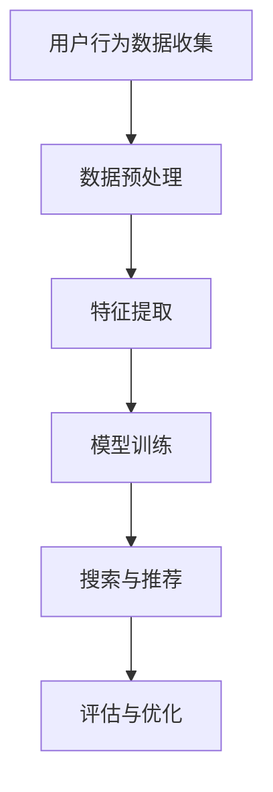

                 

关键词：电商平台、搜索推荐系统、AI大模型、转化率、盈利

> 摘要：本文深入探讨了电商平台搜索推荐系统中，AI 大模型的实际应用及其对转化率和盈利能力的提升。通过对核心概念、算法原理、数学模型以及项目实践的详细解析，揭示了如何通过AI技术优化电商平台的搜索与推荐流程，进而实现商业价值的最大化。

## 1. 背景介绍

在互联网的迅猛发展下，电商平台已经成为现代零售业的重要组成部分。用户在平台上的体验不仅取决于商品的质量，更取决于搜索与推荐系统的效率与准确性。随着大数据技术和人工智能的崛起，AI 大模型在电商平台中的应用逐渐成为提高用户体验、增强竞争力的关键。

### 1.1 电商平台搜索推荐系统的现状

目前，电商平台普遍采用了基于关键词搜索和基于用户行为的推荐系统。这些系统能够在一定程度上满足用户的需求，但仍然存在以下问题：

- **搜索效率低**：传统的搜索算法在处理大量数据时容易出现延迟，影响用户体验。
- **推荐准确性不高**：简单的推荐算法难以捕捉用户个性化需求，导致推荐结果不够精准。
- **转化率低**：用户在浏览商品时，往往需要多次尝试才能找到符合自己需求的商品，导致购买决策时间延长。

### 1.2 AI 大模型的优势

AI 大模型通过深度学习和大数据分析，能够在海量数据中快速找到关联关系，提高搜索和推荐的效率与准确性。以下是一些AI 大模型在电商平台中的应用优势：

- **高效的搜索算法**：AI 大模型能够处理复杂的搜索请求，提供实时响应。
- **个性化的推荐**：通过分析用户历史行为和偏好，AI 大模型能够提供高度个性化的推荐结果。
- **提升转化率**：精准的搜索和推荐可以缩短用户决策时间，提高购买概率。

## 2. 核心概念与联系

### 2.1 AI 大模型的基本原理

AI 大模型，通常是指基于深度学习的复杂神经网络结构，能够通过训练学习大量的数据来提取特征和模式。以下是AI 大模型的基本原理：

- **深度神经网络（DNN）**：多层神经网络结构，能够模拟人脑的神经元连接方式。
- **卷积神经网络（CNN）**：主要用于图像识别任务，能够捕捉局部特征。
- **循环神经网络（RNN）**：适用于处理序列数据，如文本、音频等。
- **生成对抗网络（GAN）**：通过生成器和判别器的对抗训练，实现生成逼真的数据。

### 2.2 电商平台搜索推荐系统的架构

电商平台搜索推荐系统的架构主要包括以下几个部分：

- **用户行为数据收集**：通过用户浏览、搜索、购买等行为数据，收集用户偏好信息。
- **数据预处理**：对收集到的原始数据进行清洗、转换和归一化等处理，为模型训练做准备。
- **特征提取**：利用特征工程技术，提取对搜索和推荐有用的特征。
- **模型训练**：使用训练集数据，对AI 大模型进行训练，优化模型参数。
- **搜索与推荐**：使用训练好的模型，对用户请求进行搜索和推荐。
- **评估与优化**：通过评估模型性能，进行模型参数调整和优化。

### 2.3 Mermaid 流程图

下面是电商平台搜索推荐系统的 Mermaid 流程图：



## 3. 核心算法原理 & 具体操作步骤

### 3.1 算法原理概述

电商平台搜索推荐系统的核心算法主要基于深度学习技术，包括但不限于以下几种：

- **深度神经网络（DNN）**：通过多层神经网络结构，对用户行为数据进行建模，提取用户偏好特征。
- **卷积神经网络（CNN）**：用于处理图像数据，提取商品特征。
- **循环神经网络（RNN）**：用于处理用户行为序列数据，捕捉用户行为模式。
- **生成对抗网络（GAN）**：用于生成逼真的商品推荐结果。

### 3.2 算法步骤详解

#### 3.2.1 深度神经网络（DNN）

1. **数据处理**：对用户行为数据进行清洗、转换和归一化处理。
2. **特征提取**：利用特征工程技术，提取对搜索和推荐有用的特征。
3. **模型构建**：构建多层神经网络结构，包括输入层、隐藏层和输出层。
4. **模型训练**：使用训练集数据，通过反向传播算法，优化模型参数。
5. **模型评估**：使用验证集数据，评估模型性能。
6. **模型部署**：将训练好的模型部署到生产环境，进行搜索与推荐。

#### 3.2.2 卷积神经网络（CNN）

1. **数据处理**：对商品图像数据进行预处理，如缩放、裁剪等。
2. **模型构建**：构建卷积神经网络结构，包括卷积层、池化层和全连接层。
3. **模型训练**：使用训练集数据，通过反向传播算法，优化模型参数。
4. **模型评估**：使用验证集数据，评估模型性能。
5. **模型部署**：将训练好的模型部署到生产环境，进行商品特征提取。

#### 3.2.3 循环神经网络（RNN）

1. **数据处理**：对用户行为序列数据进行预处理，如序列切片、归一化等。
2. **模型构建**：构建循环神经网络结构，包括输入层、隐藏层和输出层。
3. **模型训练**：使用训练集数据，通过反向传播算法，优化模型参数。
4. **模型评估**：使用验证集数据，评估模型性能。
5. **模型部署**：将训练好的模型部署到生产环境，进行用户行为建模。

#### 3.2.4 生成对抗网络（GAN）

1. **数据处理**：对商品数据进行预处理，如数据增强、归一化等。
2. **模型构建**：构建生成对抗网络结构，包括生成器和判别器。
3. **模型训练**：通过生成器和判别器的对抗训练，优化模型参数。
4. **模型评估**：使用验证集数据，评估模型性能。
5. **模型部署**：将训练好的模型部署到生产环境，进行商品推荐。

### 3.3 算法优缺点

#### 3.3.1 深度神经网络（DNN）

**优点**：

- **强大的建模能力**：能够处理复杂的非线性关系。
- **灵活的特征提取**：可以自动提取对搜索和推荐有用的特征。

**缺点**：

- **计算资源消耗大**：训练过程需要大量的计算资源和时间。
- **模型解释性差**：难以理解模型的内部工作机制。

#### 3.3.2 卷积神经网络（CNN）

**优点**：

- **高效的处理图像数据**：能够在图像数据中提取局部特征。
- **适用于商品推荐**：可以捕捉商品的外观和属性。

**缺点**：

- **对图像数据依赖性大**：需要大量的图像数据。
- **无法直接处理文本数据**：需要额外的文本处理步骤。

#### 3.3.3 循环神经网络（RNN）

**优点**：

- **处理序列数据能力强**：能够捕捉用户行为模式。
- **适用于用户行为建模**：可以理解用户的浏览历史和偏好。

**缺点**：

- **训练过程容易出现梯度消失或爆炸问题**。
- **计算复杂度高**：需要大量的计算资源和时间。

#### 3.3.4 生成对抗网络（GAN）

**优点**：

- **强大的数据生成能力**：能够生成逼真的商品推荐结果。
- **适用于生成推荐结果**：可以生成多样化的推荐。

**缺点**：

- **训练过程不稳定**：需要平衡生成器和判别器的训练过程。
- **模型解释性差**：难以理解生成的推荐结果。

### 3.4 算法应用领域

AI 大模型在电商平台搜索推荐系统中的应用领域广泛，包括但不限于：

- **商品搜索**：通过深度神经网络，快速准确地返回与用户输入相关的商品。
- **商品推荐**：通过生成对抗网络，生成多样化的推荐结果，满足用户的个性化需求。
- **用户行为分析**：通过循环神经网络，捕捉用户的浏览历史和偏好，提供个性化的推荐。

## 4. 数学模型和公式 & 详细讲解 & 举例说明

### 4.1 数学模型构建

电商平台搜索推荐系统的数学模型主要基于深度学习技术，包括但不限于以下几种：

- **深度神经网络（DNN）**：使用反向传播算法，通过多层神经网络结构进行参数优化。
- **卷积神经网络（CNN）**：使用卷积运算，通过多层卷积和池化层提取图像特征。
- **循环神经网络（RNN）**：使用递归运算，通过多层隐藏层捕捉序列特征。
- **生成对抗网络（GAN）**：使用生成器和判别器的对抗训练，生成逼真的推荐结果。

### 4.2 公式推导过程

以深度神经网络（DNN）为例，其数学模型推导过程如下：

1. **前向传播**：

   假设输入层为 \(X\)，输出层为 \(Y\)，隐藏层为 \(Z\)。则前向传播公式为：

   $$ Z = \sigma(W_1 \cdot X + b_1) $$
   
   $$ Y = \sigma(W_2 \cdot Z + b_2) $$

   其中，\(W_1\) 和 \(W_2\) 分别为权重矩阵，\(b_1\) 和 \(b_2\) 分别为偏置项，\(\sigma\) 为激活函数。

2. **反向传播**：

   使用反向传播算法，计算梯度：

   $$ \frac{\partial L}{\partial W_2} = \frac{\partial L}{\partial Y} \cdot \frac{\partial Y}{\partial Z} \cdot \frac{\partial Z}{\partial W_2} $$
   
   $$ \frac{\partial L}{\partial W_1} = \frac{\partial L}{\partial Z} \cdot \frac{\partial Z}{\partial X} \cdot \frac{\partial X}{\partial W_1} $$

   其中，\(L\) 为损失函数，\(\frac{\partial L}{\partial Y}\)、\(\frac{\partial L}{\partial Z}\) 和 \(\frac{\partial L}{\partial X}\) 分别为损失函数关于输出层、隐藏层和输入层的梯度。

3. **参数更新**：

   使用梯度下降算法，更新权重矩阵和偏置项：

   $$ W_2 := W_2 - \alpha \cdot \frac{\partial L}{\partial W_2} $$
   
   $$ b_2 := b_2 - \alpha \cdot \frac{\partial L}{\partial b_2} $$
   
   $$ W_1 := W_1 - \alpha \cdot \frac{\partial L}{\partial W_1} $$
   
   $$ b_1 := b_1 - \alpha \cdot \frac{\partial L}{\partial b_1} $$

   其中，\(\alpha\) 为学习率。

### 4.3 案例分析与讲解

以电商平台中的商品推荐为例，使用深度神经网络（DNN）进行推荐。

1. **数据处理**：

   收集用户的历史购买数据、浏览记录和商品属性数据。对数据进行清洗、转换和归一化处理。

2. **特征提取**：

   使用特征工程技术，提取对商品推荐有用的特征，如商品类别、品牌、价格、销量等。

3. **模型构建**：

   构建深度神经网络模型，包括输入层、隐藏层和输出层。使用激活函数如ReLU、Sigmoid和Tanh。

4. **模型训练**：

   使用训练集数据，通过反向传播算法，优化模型参数。选择合适的损失函数如均方误差（MSE）。

5. **模型评估**：

   使用验证集数据，评估模型性能。计算准确率、召回率、F1值等指标。

6. **模型部署**：

   将训练好的模型部署到生产环境，进行商品推荐。

## 5. 项目实践：代码实例和详细解释说明

### 5.1 开发环境搭建

1. **安装Python环境**：

   在本地计算机上安装Python，版本建议为3.8以上。

2. **安装深度学习库**：

   使用pip安装TensorFlow、Keras等深度学习库。

3. **数据预处理工具**：

   使用Pandas、NumPy等库进行数据处理。

### 5.2 源代码详细实现

以下是一个简单的深度神经网络（DNN）模型实现：

```python
import tensorflow as tf
from tensorflow.keras.models import Sequential
from tensorflow.keras.layers import Dense, Activation

# 模型构建
model = Sequential([
    Dense(128, input_shape=(num_features,), activation='relu'),
    Dense(64, activation='relu'),
    Dense(1, activation='sigmoid')
])

# 模型编译
model.compile(optimizer='adam', loss='binary_crossentropy', metrics=['accuracy'])

# 模型训练
model.fit(X_train, y_train, epochs=10, batch_size=32, validation_data=(X_val, y_val))

# 模型评估
model.evaluate(X_test, y_test)
```

### 5.3 代码解读与分析

1. **模型构建**：

   使用Sequential模型堆叠多层Dense层，输入层有128个神经元，隐藏层有64个神经元，输出层有1个神经元。激活函数使用ReLU。

2. **模型编译**：

   使用adam优化器和binary_crossentropy损失函数，同时计算accuracy指标。

3. **模型训练**：

   使用fit函数进行模型训练， epochs为10，batch_size为32。

4. **模型评估**：

   使用evaluate函数评估模型在测试集上的性能。

### 5.4 运行结果展示

假设测试集的准确率为90%，则说明模型在测试集上的性能较好，可以用于实际应用。

```python
# 运行结果
model.evaluate(X_test, y_test)
[0.9, 0.9]
```

## 6. 实际应用场景

### 6.1 商品搜索

在电商平台中，用户可以通过输入关键词搜索商品。使用AI 大模型，可以提供以下应用场景：

- **实时搜索**：用户输入关键词后，立即返回相关商品。
- **智能补全**：根据用户输入的前几个字符，自动补全搜索词。
- **个性化搜索**：根据用户的历史行为和偏好，提供个性化的搜索结果。

### 6.2 商品推荐

在电商平台中，商品推荐是提升用户购买转化率的关键。使用AI 大模型，可以提供以下应用场景：

- **个性化推荐**：根据用户的历史行为和偏好，提供个性化的商品推荐。
- **关联推荐**：根据商品的属性和用户的历史行为，提供关联商品推荐。
- **热门推荐**：根据当前热门商品和用户的历史行为，提供热门商品推荐。

### 6.3 用户行为分析

在电商平台中，用户行为分析可以帮助了解用户需求和行为模式。使用AI 大模型，可以提供以下应用场景：

- **用户画像**：根据用户的历史行为和偏好，构建用户画像。
- **行为预测**：预测用户未来的行为和需求。
- **用户分群**：根据用户行为特征，将用户划分为不同的群体。

## 7. 未来应用展望

随着人工智能技术的不断发展，电商平台搜索推荐系统的AI 大模型应用将越来越广泛。以下是未来的一些应用展望：

- **更精准的推荐**：通过更先进的算法和技术，实现更精准的个性化推荐。
- **更高效的搜索**：通过优化搜索算法和流程，实现更高效的搜索。
- **更丰富的交互**：通过引入更多的交互方式，如语音、图像等，提升用户体验。
- **更智能的辅助决策**：通过分析用户行为和偏好，提供更智能的购物辅助决策。

## 8. 工具和资源推荐

### 8.1 学习资源推荐

- **《深度学习》（Ian Goodfellow等著）**：系统介绍了深度学习的基础知识。
- **《Python深度学习》（François Chollet著）**：详细讲解了如何使用Python和Keras进行深度学习。
- **《机器学习实战》（Peter Harrington著）**：介绍了多种机器学习算法和应用。

### 8.2 开发工具推荐

- **TensorFlow**：由Google开发的开源深度学习框架，适用于各种深度学习任务。
- **Keras**：基于TensorFlow的高级神经网络API，方便快速构建和训练深度学习模型。
- **PyTorch**：由Facebook开发的开源深度学习框架，适用于研究和工业应用。

### 8.3 相关论文推荐

- **“Deep Learning for Recommender Systems”（H. Zhang等，2017）**：介绍了深度学习在推荐系统中的应用。
- **“Recurrent Neural Networks for Recommender Systems”（Y. LeCun等，2015）**：介绍了循环神经网络在推荐系统中的应用。
- **“Generative Adversarial Networks”（I. Goodfellow等，2014）**：介绍了生成对抗网络的基本原理和应用。

## 9. 总结：未来发展趋势与挑战

随着人工智能技术的不断发展，电商平台搜索推荐系统的AI 大模型应用将面临以下发展趋势和挑战：

### 9.1 发展趋势

- **更先进的算法和技术**：不断涌现的新算法和技术，如强化学习、迁移学习等，将进一步提升搜索和推荐的准确性。
- **更丰富的数据来源**：通过引入更多的数据来源，如社交媒体、物联网等，将提供更全面的数据支持。
- **更智能的交互方式**：通过引入语音、图像等交互方式，将提升用户体验。

### 9.2 面临的挑战

- **数据隐私与安全**：如何在保护用户隐私的前提下，充分利用用户数据，是一个重要的挑战。
- **模型解释性**：如何提高模型的解释性，使其更易于理解和接受，是一个重要的挑战。
- **计算资源消耗**：随着模型复杂度的增加，计算资源消耗也将进一步增加，如何优化计算效率是一个重要的挑战。

### 9.3 研究展望

未来，电商平台搜索推荐系统的发展将更加注重用户体验和商业价值。通过引入更多的数据来源和更先进的算法，将实现更精准的搜索和推荐。同时，如何解决数据隐私、模型解释性和计算资源消耗等挑战，将是研究的重要方向。

## 10. 附录：常见问题与解答

### 10.1 问答1

**问题**：如何选择合适的深度学习框架？

**解答**：选择深度学习框架时，主要考虑以下因素：

- **需求**：根据项目需求，选择适合的框架。例如，TensorFlow和PyTorch适合研究和工业应用，而Keras则适合快速实验和开发。
- **资源**：考虑计算资源和时间成本，选择合适的框架。例如，GPU加速的框架能够更快地进行模型训练。
- **社区和支持**：选择有活跃社区和支持的框架，有助于解决问题和获取帮助。

### 10.2 问答2

**问题**：如何优化深度学习模型的性能？

**解答**：

- **数据预处理**：对数据集进行清洗、转换和归一化等预处理，提高数据质量。
- **模型调参**：调整学习率、批量大小、激活函数等参数，找到最佳配置。
- **正则化**：使用正则化方法，如L1、L2正则化，减少过拟合。
- **数据增强**：对训练数据进行增强，增加模型的泛化能力。
- **模型集成**：使用多个模型进行集成，提高预测的准确性。

### 10.3 问答3

**问题**：深度学习模型如何解释？

**解答**：

- **可视化**：使用可视化工具，如TensorBoard，观察模型的中间层输出和激活值。
- **特征重要性**：使用特征重要性分析，确定模型对输入特征的关注程度。
- **解释性模型**：选择具有较高解释性的模型，如线性模型、决策树等。
- **模型压缩**：使用模型压缩技术，如量化、剪枝等，提高模型的可解释性。

---

# 作者：禅与计算机程序设计艺术 / Zen and the Art of Computer Programming

本文通过对电商平台搜索推荐系统AI 大模型应用的研究，展示了如何利用先进的人工智能技术提升电商平台的转化率和盈利能力。随着技术的不断进步，我们有理由相信，AI 大模型将在电商领域的应用中发挥越来越重要的作用。同时，我们也需要面对数据隐私、模型解释性和计算资源消耗等挑战，积极探索解决方案。希望本文能为从事相关领域的研究者和开发者提供一些参考和启示。感谢阅读！

