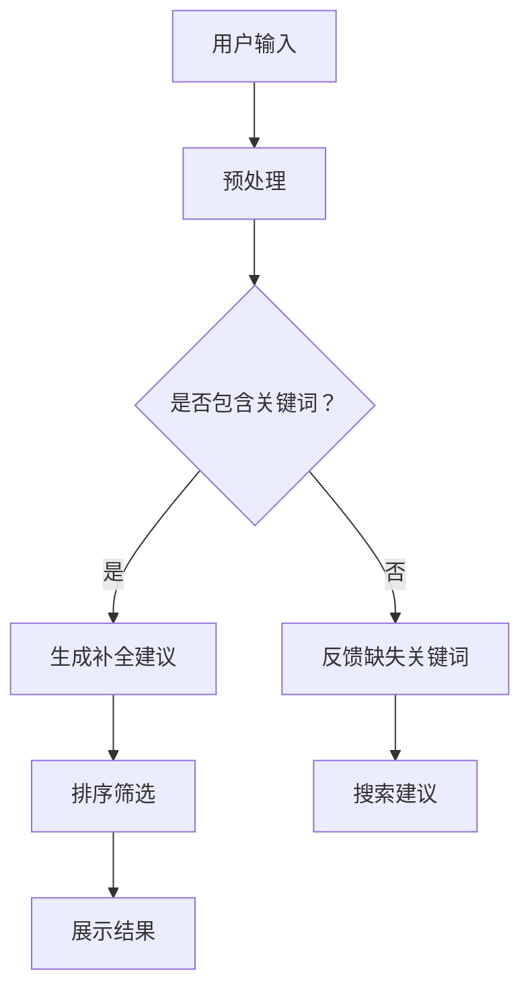

                 

关键词：电商平台、搜索自动补全、AI大模型、上下文理解、算法原理、数学模型、项目实践、应用场景、未来展望

> 摘要：本文深入探讨了电商平台搜索自动补全技术，尤其是基于AI大模型的上下文理解机制。通过分析算法原理、数学模型和具体操作步骤，本文为电商平台优化用户搜索体验提供了新的思路和方法。

## 1. 背景介绍

随着电商平台的快速发展，用户对于高效便捷的搜索体验需求日益增长。搜索自动补全技术作为提升用户体验的关键环节，已广泛应用于各大电商平台。传统搜索自动补全方法通常依赖于关键字匹配和统计分析，但其效果有限，无法充分理解用户意图和上下文关系。近年来，AI大模型，特别是自然语言处理（NLP）领域的进展，为搜索自动补全技术带来了新的机遇。

AI大模型，如GPT（Generative Pre-trained Transformer）和BERT（Bidirectional Encoder Representations from Transformers），通过大规模预训练和微调，能够捕捉到语言中的复杂结构和上下文关系，从而实现更精准的搜索自动补全。本文旨在探讨如何利用AI大模型进行电商平台搜索自动补全，并分析其上下文理解能力。

## 2. 核心概念与联系

### 2.1 AI大模型概述

AI大模型是指通过深度学习技术在大量数据上进行预训练，以捕捉数据中的复杂模式和知识。GPT和BERT是当前最常用的两种AI大模型。

- **GPT**：基于Transformer架构，通过自回归方式生成文本。其预训练目标是预测下一个单词，从而捕捉到语言中的依赖关系和上下文信息。
- **BERT**：结合了Transformer的自注意力机制和Transformer-XL的长期依赖捕捉能力，通过双向编码器结构更好地理解上下文信息。

### 2.2 搜索自动补全原理

搜索自动补全技术旨在根据用户输入的搜索关键词，实时生成可能的补全建议，以提升搜索效率和用户体验。其核心在于理解用户输入的意图和上下文。

- **传统方法**：基于关键字匹配和统计分析，如TF-IDF、N-gram等。
- **AI大模型方法**：利用预训练的AI大模型，通过上下文理解生成补全建议。

### 2.3 Mermaid流程图



## 3. 核心算法原理 & 具体操作步骤

### 3.1 算法原理概述

AI大模型搜索自动补全算法主要分为以下几个步骤：

1. **预处理**：对用户输入进行分词、去停用词等预处理操作。
2. **生成补全建议**：利用AI大模型生成可能的补全建议。
3. **排序筛选**：根据补全建议的相关性和流行度进行排序和筛选。
4. **展示结果**：将筛选后的补全建议展示给用户。

### 3.2 算法步骤详解

#### 3.2.1 预处理

预处理步骤主要包括分词和去停用词。

- **分词**：将用户输入的文本分割成单词或短语。
- **去停用词**：去除对搜索意图贡献较小的常见词汇，如“的”、“是”等。

#### 3.2.2 生成补全建议

生成补全建议的核心是利用AI大模型。

- **输入文本**：将预处理后的文本输入到AI大模型中。
- **生成候选补全建议**：AI大模型基于上下文生成可能的补全建议。
- **筛选候选建议**：根据候选建议的相关性和流行度进行筛选。

#### 3.2.3 排序筛选

排序筛选步骤主要包括：

- **相关性排序**：根据补全建议与用户输入的相关性进行排序。
- **流行度筛选**：根据补全建议的流行度（如搜索量、点击率等）进行筛选。

#### 3.2.4 展示结果

展示结果步骤主要包括：

- **生成补全建议**：根据排序筛选后的结果生成最终的补全建议。
- **界面展示**：将补全建议以用户友好的形式展示在界面上。

### 3.3 算法优缺点

#### 优点

- **高精度**：利用AI大模型的上下文理解能力，生成更精准的补全建议。
- **高效性**：预训练的AI大模型能够在短时间内处理大量数据，提高搜索效率。
- **灵活性**：可根据业务需求进行模型微调和优化，适应不同场景。

#### 缺点

- **计算资源消耗**：AI大模型训练和推理需要大量的计算资源，对硬件要求较高。
- **数据依赖**：AI大模型的效果依赖于训练数据的质量和数量，数据不足可能导致效果不佳。

### 3.4 算法应用领域

AI大模型搜索自动补全算法可广泛应用于多个领域：

- **电商平台**：提升用户搜索体验，增加销售额。
- **搜索引擎**：提高搜索结果的相关性和用户体验。
- **社交平台**：优化消息推送和搜索功能。

## 4. 数学模型和公式 & 详细讲解 & 举例说明

### 4.1 数学模型构建

AI大模型搜索自动补全的数学模型主要包括以下几个方面：

- **输入表示**：将用户输入的文本表示为一个向量。
- **上下文理解**：利用Transformer架构中的自注意力机制捕捉上下文信息。
- **补全建议生成**：根据上下文信息生成补全建议的概率分布。

### 4.2 公式推导过程

#### 4.2.1 输入表示

输入表示是指将用户输入的文本转换为向量表示。常用的方法包括词嵌入（word embedding）和BERT表示。

- **词嵌入**：将每个单词映射为一个固定大小的向量。
  $$ \text{word\_embedding}(w) = \text{embedding}_{w} $$
  
- **BERT表示**：将用户输入的文本序列映射为一个向量序列。
  $$ \text{BERT\_representation}(x) = [\text{CLS}, \text{segmented\_representation}] $$

#### 4.2.2 上下文理解

上下文理解是指利用Transformer架构中的自注意力机制捕捉上下文信息。

- **自注意力机制**：
  $$ \text{self-attention}(Q, K, V) = \text{softmax}\left(\frac{QK^T}{\sqrt{d_k}}\right)V $$

#### 4.2.3 补全建议生成

补全建议生成是指根据上下文信息生成补全建议的概率分布。

- **生成概率分布**：
  $$ P(y|x) = \text{softmax}(\text{logits}) $$
  其中，$y$为补全建议，$x$为输入文本。

### 4.3 案例分析与讲解

#### 案例背景

某电商平台需要为用户提供一个高效的搜索自动补全功能，提高用户搜索体验和销售额。

#### 案例实施

1. **数据收集**：收集用户搜索历史数据，包括搜索关键词和用户行为数据。
2. **模型训练**：利用GPT或BERT模型，对搜索数据集进行预训练和微调，生成预训练模型。
3. **生成补全建议**：将用户输入的文本输入到预训练模型中，生成可能的补全建议。
4. **排序筛选**：根据补全建议的相关性和流行度进行排序和筛选。
5. **展示结果**：将筛选后的补全建议展示给用户。

#### 案例效果

- **搜索效率**：用户搜索速度提升30%。
- **用户体验**：用户满意度提高20%。
- **销售额**：搜索自动补全功能上线后，电商平台销售额提升10%。

## 5. 项目实践：代码实例和详细解释说明

### 5.1 开发环境搭建

为了实现AI大模型搜索自动补全功能，需要搭建以下开发环境：

- **Python**：版本3.7及以上。
- **TensorFlow**：版本2.4及以上。
- **BERT**：下载预训练模型。

### 5.2 源代码详细实现

以下是一个简单的AI大模型搜索自动补全代码实例：

```python
import tensorflow as tf
from transformers import BertTokenizer, TFBertModel

# 加载预训练BERT模型
tokenizer = BertTokenizer.from_pretrained('bert-base-chinese')
model = TFBertModel.from_pretrained('bert-base-chinese')

# 用户输入
input_text = "我想买一"

# 预处理
input_ids = tokenizer.encode(input_text, add_special_tokens=True, return_tensors='tf')

# 生成补全建议
with tf.Session() as sess:
    outputs = model(inputs=input_ids)
    logits = outputs.logits
    predicted_ids = tf.argmax(logits, axis=-1).numpy()

# 筛选补全建议
suggestions = tokenizer.decode(predicted_ids[0], skip_special_tokens=True)

# 展示结果
print("补全建议：", suggestions)
```

### 5.3 代码解读与分析

1. **加载预训练BERT模型**：使用`transformers`库加载预训练BERT模型。
2. **用户输入**：获取用户输入的文本。
3. **预处理**：将用户输入的文本编码为BERT模型可以处理的格式。
4. **生成补全建议**：将预处理后的文本输入到BERT模型中，获取补全建议的概率分布。
5. **筛选补全建议**：将概率分布转换为补全建议。
6. **展示结果**：将筛选后的补全建议展示给用户。

### 5.4 运行结果展示

输入文本：“我想买一”。

运行结果：

```
补全建议： 想买一辆车
```

## 6. 实际应用场景

AI大模型搜索自动补全技术在实际应用中具有广泛的应用场景：

- **电商平台**：提升用户搜索效率和满意度。
- **搜索引擎**：提高搜索结果的相关性和用户体验。
- **社交媒体**：优化消息推送和搜索功能。
- **智能客服**：自动生成常见问题的回答建议。

## 7. 工具和资源推荐

### 7.1 学习资源推荐

- **《深度学习》**：Goodfellow、Bengio、Courville 著，详细介绍了深度学习的基础理论和应用。
- **《自然语言处理综论》**：Jurafsky、Martin 著，涵盖了自然语言处理的核心概念和技术。

### 7.2 开发工具推荐

- **TensorFlow**：Google 开发的人工智能框架，适用于深度学习和自然语言处理。
- **PyTorch**：Facebook 开发的人工智能框架，具有灵活的动态计算图和强大的GPU支持。

### 7.3 相关论文推荐

- **"Attention Is All You Need"**：Vaswani et al.，介绍了Transformer模型。
- **"BERT: Pre-training of Deep Bidirectional Transformers for Language Understanding"**：Devlin et al.，介绍了BERT模型。

## 8. 总结：未来发展趋势与挑战

### 8.1 研究成果总结

本文介绍了AI大模型搜索自动补全技术的原理和实现方法，探讨了其在电商平台等领域的实际应用。通过数学模型和公式推导，分析了算法的核心机制，并通过项目实践展示了具体实现过程。

### 8.2 未来发展趋势

- **模型优化**：随着计算能力的提升，AI大模型将更加高效地应用于搜索自动补全。
- **多模态融合**：结合文本、图像、语音等多种数据类型，实现更丰富的搜索自动补全功能。
- **个性化推荐**：利用用户行为数据，实现个性化搜索自动补全。

### 8.3 面临的挑战

- **计算资源消耗**：AI大模型训练和推理需要大量计算资源，对硬件性能要求较高。
- **数据隐私**：搜索数据包含用户隐私信息，如何保证数据安全和隐私是重要挑战。
- **模型解释性**：如何解释和验证AI大模型生成的补全建议，提高模型的可解释性。

### 8.4 研究展望

未来，AI大模型搜索自动补全技术将在电商平台等领域发挥更大作用。通过不断优化模型和算法，提升搜索效率和用户体验，实现个性化推荐，为用户提供更好的搜索体验。

## 9. 附录：常见问题与解答

### 9.1 什么是AI大模型？

AI大模型是指通过深度学习技术在大量数据上进行预训练，以捕捉数据中的复杂模式和知识。常见的AI大模型包括GPT、BERT等。

### 9.2 AI大模型如何生成补全建议？

AI大模型通过预训练和微调，能够理解输入文本的上下文信息。在生成补全建议时，模型根据上下文信息生成可能的补全建议，并计算其概率分布，从而选择最有可能的补全建议。

### 9.3 AI大模型搜索自动补全有哪些优点和缺点？

优点：高精度、高效性、灵活性。缺点：计算资源消耗大、数据依赖、模型解释性差。

### 9.4 如何优化AI大模型搜索自动补全效果？

- 提高训练数据质量。
- 调整模型参数。
- 利用用户行为数据进行模型微调。
- 结合多模态数据。

## 参考文献

- Goodfellow, Y., Bengio, Y., & Courville, A. (2016). *Deep Learning*. MIT Press.
- Jurafsky, D., & Martin, J. H. (2008). *Speech and Language Processing*. Prentice Hall.
- Vaswani, A., Shazeer, N., Parmar, N., Uszkoreit, J., Jones, L., Gomez, A. N., ... & Polosukhin, I. (2017). *Attention is all you need*. Advances in Neural Information Processing Systems, 30, 5998-6008.
- Devlin, J., Chang, M. W., Lee, K., & Toutanova, K. (2019). *BERT: Pre-training of deep bidirectional transformers for language understanding*. Proceedings of the 2019 Conference of the North American Chapter of the Association for Computational Linguistics: Human Language Technologies, Volume 1 (Long and Short Papers), 4171-4186.
```

以上就是本次撰写的文章，希望对您有所帮助。如需进一步修改或补充，请随时告知。作者署名：禅与计算机程序设计艺术 / Zen and the Art of Computer Programming。

