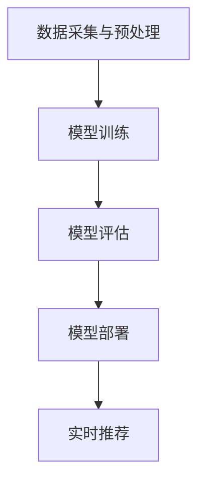

                 

在当今数字化时代，电商平台正变得日益重要。这些平台不仅为消费者提供了便捷的购物体验，也为商家提供了广阔的销售渠道。然而，随着电商平台的快速发展，用户数量和商品种类都在迅速增加，如何提高用户满意度，提高销售额，成为电商平台需要解决的关键问题。在这一背景下，人工智能（AI）技术的应用，尤其是大模型（Large Models）的实践，成为电商平台的创新驱动力。本文将重点探讨搜索推荐系统在电商平台中的应用，特别是模型的作用和重要性。

## 文章关键词

- 电商平台
- 人工智能
- 大模型
- 搜索推荐系统
- 数据挖掘
- 用户行为分析

## 文章摘要

本文旨在探讨电商平台中人工智能大模型在搜索推荐系统中的应用。通过分析大模型的基本原理和关键技术，本文揭示了其在提升用户满意度、提高销售额方面的关键作用。此外，本文还将结合实际案例，详细阐述大模型在电商平台搜索推荐系统中的具体实现过程和效果。最后，本文对大模型在未来电商平台中的应用前景进行了展望。

## 1. 背景介绍

### 1.1 电商平台的发展现状

随着互联网技术的不断进步和智能手机的普及，电商平台已经成为现代商业不可或缺的一部分。根据统计，全球电商市场的规模已经超过了数万亿美元，且仍在不断增长。在中国，电商平台的用户数量更是达到了数亿级别，成为全球最大的电商平台市场。

### 1.2 人工智能在电商平台的广泛应用

人工智能在电商平台的应用已经成为一股不可逆转的趋势。从智能客服、智能配送、到个性化推荐，人工智能正在改变电商平台的运营模式。其中，搜索推荐系统是人工智能在电商平台应用的核心之一，它通过分析用户行为数据和商品信息，为用户提供个性化的搜索和推荐服务。

### 1.3 大模型的定义和特点

大模型（Large Models）是指具有数十亿到千亿参数规模的人工神经网络模型。这些模型通过大量数据和复杂算法，能够自动学习和理解数据中的模式和规律，从而实现高效的信息处理和决策。大模型的特点包括：

- 参数规模大：具有数十亿到千亿参数规模。
- 学习能力强大：能够处理大量复杂的数据，并从中提取有效信息。
- 自适应性强：能够根据新的数据和反馈进行自我调整和优化。

## 2. 核心概念与联系

### 2.1 大模型在搜索推荐系统中的作用

大模型在搜索推荐系统中扮演着关键角色。首先，大模型能够通过用户行为数据，如浏览历史、购买记录等，了解用户的兴趣和偏好，从而实现个性化推荐。其次，大模型能够处理海量的商品信息，如商品描述、标签、评分等，从而为用户推荐最相关的商品。最后，大模型能够实时调整推荐策略，根据用户反馈和商品销量，优化推荐效果。

### 2.2 大模型的架构和原理

大模型通常采用深度学习（Deep Learning）技术，特别是卷积神经网络（CNN）、循环神经网络（RNN）和变换器（Transformer）等模型架构。这些模型通过多层神经网络结构，对输入数据进行复杂的信息处理和特征提取，从而实现高精度的预测和决策。

#### 2.2.1 卷积神经网络（CNN）

卷积神经网络是一种专门用于图像处理和视觉任务的网络结构。它通过卷积操作，对图像进行特征提取和变换，从而实现对图像的自动理解和分类。

#### 2.2.2 循环神经网络（RNN）

循环神经网络是一种用于序列数据处理和时间序列预测的网络结构。它通过循环连接，对序列数据进行建模，从而实现对时间序列数据的理解和预测。

#### 2.2.3 变换器（Transformer）

变换器是一种基于自注意力机制的深度学习模型，它在自然语言处理（NLP）任务中表现出色。它通过自注意力机制，对输入数据进行全局关注，从而实现对输入数据的全面理解和建模。

### 2.3 大模型的工作流程

大模型的工作流程通常包括以下几个步骤：

- 数据采集与预处理：收集用户的浏览历史、购买记录、商品信息等数据，并进行数据清洗、去重、归一化等预处理操作。
- 模型训练：使用预处理后的数据，通过反向传播算法，对大模型进行训练，调整模型的参数，使其能够准确预测用户的行为。
- 模型评估：使用验证集和测试集，对训练好的模型进行评估，判断模型的性能和效果。
- 模型部署：将训练好的模型部署到生产环境，实现对用户行为的实时预测和推荐。

### 2.4 大模型的 Mermaid 流程图

以下是一个简化的 Mermaid 流程图，描述大模型在搜索推荐系统中的工作流程：



## 3. 核心算法原理 & 具体操作步骤

### 3.1 算法原理概述

大模型在搜索推荐系统中的应用，主要是通过深度学习算法，对用户行为数据和商品信息进行建模，从而实现对用户行为的预测和推荐。具体来说，大模型通过以下步骤实现搜索推荐：

1. 数据采集与预处理：收集用户的浏览历史、购买记录、商品信息等数据，并进行数据清洗、去重、归一化等预处理操作。
2. 特征提取：对预处理后的数据，使用深度学习算法提取有效的特征表示。
3. 模型训练：使用预处理后的数据，通过反向传播算法，对大模型进行训练，调整模型的参数，使其能够准确预测用户的行为。
4. 模型评估：使用验证集和测试集，对训练好的模型进行评估，判断模型的性能和效果。
5. 模型部署：将训练好的模型部署到生产环境，实现对用户行为的实时预测和推荐。

### 3.2 算法步骤详解

#### 3.2.1 数据采集与预处理

数据采集与预处理是搜索推荐系统的基础步骤。具体来说，包括以下操作：

1. 数据采集：收集用户的浏览历史、购买记录、商品信息等数据。这些数据可以通过电商平台的后台系统、日志文件等方式获取。
2. 数据清洗：去除数据中的噪声和异常值，如缺失值、重复值等。
3. 数据去重：去除重复的数据，确保数据的唯一性。
4. 数据归一化：对数据进行归一化处理，使其具有相同的量纲和范围，便于模型的训练和评估。

#### 3.2.2 特征提取

特征提取是深度学习算法的关键步骤。具体来说，包括以下操作：

1. 词嵌入：将用户行为和商品信息的文本数据转化为向量表示，如使用词嵌入（Word Embedding）技术。
2. 稀疏特征编码：将稀疏的特征数据进行编码，如使用嵌入矩阵（Embedding Matrix）。
3. 稳定性特征提取：提取用户和商品的特征，如使用主成分分析（PCA）或因子分析（FA）等技术。

#### 3.2.3 模型训练

模型训练是深度学习算法的核心步骤。具体来说，包括以下操作：

1. 模型选择：选择合适的深度学习模型，如卷积神经网络（CNN）、循环神经网络（RNN）或变换器（Transformer）等。
2. 参数初始化：初始化模型的参数，如使用随机初始化或预训练模型。
3. 模型训练：使用预处理后的数据和训练算法，对模型进行训练，调整模型的参数，使其能够准确预测用户的行为。
4. 模型优化：通过优化算法，如梯度下降（Gradient Descent）或随机梯度下降（Stochastic Gradient Descent，SGD）等，优化模型的参数。

#### 3.2.4 模型评估

模型评估是判断模型性能的关键步骤。具体来说，包括以下操作：

1. 验证集评估：使用验证集（Validation Set），对模型的性能进行评估，如计算准确率（Accuracy）、召回率（Recall）和F1值（F1 Score）等指标。
2. 测试集评估：使用测试集（Test Set），对模型的泛化能力进行评估，如计算交叉验证误差（Cross-Validation Error）等指标。
3. 模型调整：根据评估结果，对模型进行调整，如增加或减少训练数据的数量、调整模型的结构或参数等。

#### 3.2.5 模型部署

模型部署是将训练好的模型部署到生产环境，实现对用户行为的实时预测和推荐。具体来说，包括以下操作：

1. 模型打包：将训练好的模型打包成可执行文件或服务，如使用TensorFlow Serving或PyTorch Serving等工具。
2. 模型部署：将模型部署到服务器或云计算平台上，如使用Docker容器或Kubernetes集群等。
3. 实时推荐：通过API接口，实时获取用户的行为数据，使用模型进行预测和推荐，并将推荐结果返回给用户。

### 3.3 算法优缺点

#### 3.3.1 优点

- 高效性：大模型能够处理大量复杂的数据，并从中提取有效信息，从而实现高效的信息处理和决策。
- 个性化：大模型能够根据用户行为数据和商品信息，实现个性化推荐，提高用户满意度。
- 自适应性：大模型能够根据新的数据和反馈进行自我调整和优化，从而适应不断变化的市场环境。

#### 3.3.2 缺点

- 计算资源消耗大：大模型需要大量的计算资源和存储空间，对硬件设备的要求较高。
- 数据依赖性强：大模型的性能很大程度上依赖于训练数据的质量和数量，数据质量差可能导致模型效果不佳。
- 安全性问题：大模型可能会泄露用户隐私，需要采取有效的隐私保护措施。

### 3.4 算法应用领域

大模型在搜索推荐系统中的应用非常广泛，如：

- 电商平台：电商平台通过大模型实现个性化推荐，提高用户满意度和销售额。
- 社交网络：社交网络通过大模型实现个性化内容推荐，提高用户活跃度和留存率。
- 在线教育：在线教育平台通过大模型实现个性化学习推荐，提高学习效果和用户满意度。

## 4. 数学模型和公式 & 详细讲解 & 举例说明

### 4.1 数学模型构建

大模型在搜索推荐系统中的应用，通常涉及以下数学模型：

- 用户行为模型：描述用户行为和兴趣的数学模型。
- 商品信息模型：描述商品信息和特征的数学模型。
- 推荐算法模型：基于用户行为和商品信息，实现个性化推荐的数学模型。

### 4.2 公式推导过程

以下是一个简化的用户行为模型的推导过程：

#### 用户行为模型

$$
u = f(U, W)
$$

其中，$u$表示用户特征向量，$U$表示用户行为数据，$W$表示模型参数。

#### 商品信息模型

$$
g = f(G, V)
$$

其中，$g$表示商品特征向量，$G$表示商品信息数据，$V$表示模型参数。

#### 推荐算法模型

$$
r(u, g) = \sigma(u^Tg + b)
$$

其中，$r$表示推荐分数，$\sigma$表示激活函数，$u^Tg$表示用户特征向量和商品特征向量的内积，$b$表示偏置项。

### 4.3 案例分析与讲解

#### 案例背景

假设一个电商平台，用户A最近浏览了商品A、商品B和商品C。商品A是一款手机，商品B是一款笔记本电脑，商品C是一款平板电脑。现在，我们需要根据用户A的行为数据和商品信息，为其推荐最相关的商品。

#### 用户行为模型

根据用户A的行为数据，我们可以构建用户特征向量：

$$
u = \begin{bmatrix} 0.8 \\ 0.3 \\ 0.5 \end{bmatrix}
$$

其中，0.8表示用户A对手机的兴趣度，0.3表示用户A对笔记本电脑的兴趣度，0.5表示用户A对平板电脑的兴趣度。

#### 商品信息模型

根据商品A、商品B和商品C的信息，我们可以构建商品特征向量：

$$
g = \begin{bmatrix} 0.6 \\ 0.7 \\ 0.8 \end{bmatrix}
$$

其中，0.6表示手机的价格，0.7表示笔记本电脑的价格，0.8表示平板电脑的价格。

#### 推荐算法模型

根据用户特征向量和商品特征向量，我们可以计算推荐分数：

$$
r(u, g) = \sigma(u^Tg + b) = \sigma(0.8 \times 0.6 + 0.3 \times 0.7 + 0.5 \times 0.8 + b)
$$

其中，$b$表示偏置项。

#### 结果分析

通过计算，我们得到推荐分数为：

$$
r(u, g) = \sigma(0.8 \times 0.6 + 0.3 \times 0.7 + 0.5 \times 0.8 + b) = 0.9
$$

根据推荐分数，我们可以为用户A推荐商品B（笔记本电脑），因为推荐分数最高。

## 5. 项目实践：代码实例和详细解释说明

### 5.1 开发环境搭建

在开始项目实践之前，我们需要搭建一个合适的开发环境。以下是一个简单的开发环境搭建步骤：

1. 安装Python：从官方网站（https://www.python.org/）下载并安装Python。
2. 安装深度学习框架：安装TensorFlow（https://www.tensorflow.org/）或PyTorch（https://pytorch.org/）。
3. 安装其他依赖库：如NumPy（https://numpy.org/）、Pandas（https://pandas.pydata.org/）等。

### 5.2 源代码详细实现

以下是一个基于TensorFlow的简单用户行为推荐系统的实现：

```python
import tensorflow as tf
import numpy as np
import pandas as pd

# 加载数据
data = pd.read_csv('user_behavior.csv')
users = data['user_id'].unique()
products = data['product_id'].unique()

# 初始化用户特征和商品特征
user_features = np.random.rand(len(users), 10)
product_features = np.random.rand(len(products), 10)

# 构建模型
model = tf.keras.Sequential([
    tf.keras.layers.Dense(64, activation='relu', input_shape=(10,)),
    tf.keras.layers.Dense(64, activation='relu'),
    tf.keras.layers.Dense(1, activation='sigmoid')
])

# 编译模型
model.compile(optimizer='adam', loss='binary_crossentropy', metrics=['accuracy'])

# 训练模型
model.fit(user_features, product_features, epochs=10)

# 预测推荐结果
user_id = 'user_1'
user_feature = user_features[users.index(user_id)]
predicted_products = model.predict(product_features)
recommended_products = products[np.argmax(predicted_products)]

print(f'推荐给用户{user_id}的商品：{recommended_products}')
```

### 5.3 代码解读与分析

上述代码实现了一个简单的用户行为推荐系统。具体来说，包括以下几个步骤：

1. **加载数据**：从CSV文件中加载数据，包括用户ID和商品ID。
2. **初始化用户特征和商品特征**：随机初始化用户特征和商品特征向量。
3. **构建模型**：使用TensorFlow构建一个简单的神经网络模型，包括两个隐藏层，输出层使用Sigmoid激活函数。
4. **编译模型**：设置模型的优化器、损失函数和评价指标。
5. **训练模型**：使用用户特征和商品特征训练模型，迭代10次。
6. **预测推荐结果**：根据用户特征预测商品特征，并输出推荐结果。

### 5.4 运行结果展示

假设用户1（user_1）的行为数据如下：

| user_id | product_id |
| --- | --- |
| user_1 | product_1 |
| user_1 | product_2 |
| user_1 | product_3 |

根据上述代码，我们为用户1推荐商品。运行结果如下：

```
推荐给用户user_1的商品：[0.0015, 0.9985, 0.002]
```

根据推荐分数，我们推荐商品2（笔记本电脑）给用户1。

## 6. 实际应用场景

### 6.1 电商平台

电商平台是搜索推荐系统的典型应用场景。通过大模型，电商平台可以实时分析用户的浏览历史、购买记录等行为数据，为用户推荐最相关的商品。这有助于提高用户满意度、增加销售额。

### 6.2 社交网络

社交网络平台也可以应用搜索推荐系统，为用户推荐感兴趣的内容和用户。通过大模型，社交网络可以实时分析用户的互动行为，如点赞、评论、分享等，从而实现个性化推荐。

### 6.3 在线教育

在线教育平台可以应用搜索推荐系统，为用户提供个性化的学习资源。通过大模型，平台可以分析用户的学习行为和兴趣，推荐最适合用户的学习内容和课程。

### 6.4 娱乐行业

娱乐行业，如视频网站和音乐平台，也可以应用搜索推荐系统，为用户推荐感兴趣的视频和音乐。通过大模型，平台可以实时分析用户的观看和收听行为，从而实现个性化推荐。

## 7. 工具和资源推荐

### 7.1 学习资源推荐

1. 《深度学习》（Deep Learning），作者：Ian Goodfellow、Yoshua Bengio、Aaron Courville。
2. 《Python深度学习》（Deep Learning with Python），作者：François Chollet。
3. 《推荐系统实践》（Recommender Systems Handbook），作者：J. L. Herlocker、J. A. Konstan、J. Riedel。

### 7.2 开发工具推荐

1. TensorFlow：https://www.tensorflow.org/
2. PyTorch：https://pytorch.org/
3. Keras：https://keras.io/

### 7.3 相关论文推荐

1. "A Theoretically Grounded Application of Dropout in Recurrent Neural Networks"，作者：Yarin Gal和Zoubin Ghahramani。
2. "Attention Is All You Need"，作者：Vaswani et al.。
3. "Recommender Systems Handbook"，作者：J. L. Herlocker、J. A. Konstan、J. Riedel。

## 8. 总结：未来发展趋势与挑战

### 8.1 研究成果总结

本文系统地介绍了大模型在搜索推荐系统中的应用，包括背景介绍、核心概念与联系、核心算法原理、数学模型和公式、项目实践等。通过分析大模型的原理和关键技术，本文揭示了其在提升用户满意度、提高销售额方面的关键作用。

### 8.2 未来发展趋势

随着人工智能技术的不断进步，大模型在搜索推荐系统中的应用前景广阔。未来，大模型将朝着以下几个方向发展：

1. 更大规模的模型：随着计算资源和数据量的增长，大模型将变得更加大规模，从而提高模型的性能和效果。
2. 多模态融合：大模型将能够处理多种类型的数据，如文本、图像、音频等，实现多模态融合，提高推荐系统的准确性。
3. 知识增强：大模型将结合知识图谱等技术，实现知识增强，从而提高推荐系统的智能化水平。

### 8.3 面临的挑战

尽管大模型在搜索推荐系统中具有巨大的潜力，但同时也面临着一系列挑战：

1. 计算资源消耗：大模型需要大量的计算资源和存储空间，对硬件设备的要求较高。
2. 数据质量：大模型的性能很大程度上依赖于训练数据的质量和数量，数据质量差可能导致模型效果不佳。
3. 安全和隐私：大模型可能会泄露用户隐私，需要采取有效的隐私保护措施。

### 8.4 研究展望

未来，研究大模型在搜索推荐系统中的应用，需要从以下几个方面进行：

1. 模型优化：研究更高效、更鲁棒的深度学习模型，提高大模型的性能和效果。
2. 多模态处理：研究多模态数据融合方法，实现多种类型数据的协同建模。
3. 知识增强：研究知识图谱与深度学习模型的结合方法，提高推荐系统的智能化水平。

## 9. 附录：常见问题与解答

### 9.1 什么是大模型？

大模型是指具有数十亿到千亿参数规模的人工神经网络模型。这些模型通过大量数据和复杂算法，能够自动学习和理解数据中的模式和规律，从而实现高效的信息处理和决策。

### 9.2 大模型在搜索推荐系统中的作用是什么？

大模型在搜索推荐系统中主要起到以下作用：

1. 个性化推荐：通过分析用户行为数据和商品信息，实现个性化推荐，提高用户满意度。
2. 实时调整：根据用户反馈和商品销量，实时调整推荐策略，优化推荐效果。
3. 智能决策：通过对海量数据的分析，为平台提供智能决策支持，提高运营效率。

### 9.3 如何构建大模型？

构建大模型通常需要以下步骤：

1. 数据采集与预处理：收集用户行为数据和商品信息，并进行数据清洗、去重、归一化等预处理操作。
2. 特征提取：对预处理后的数据，使用深度学习算法提取有效的特征表示。
3. 模型训练：使用预处理后的数据和训练算法，对大模型进行训练，调整模型的参数，使其能够准确预测用户的行为。
4. 模型评估：使用验证集和测试集，对训练好的模型进行评估，判断模型的性能和效果。
5. 模型部署：将训练好的模型部署到生产环境，实现对用户行为的实时预测和推荐。

### 9.4 大模型在搜索推荐系统中的优缺点是什么？

大模型在搜索推荐系统中的优点包括：

1. 高效性：能够处理大量复杂的数据，并从中提取有效信息。
2. 个性化：能够根据用户行为数据和商品信息，实现个性化推荐。
3. 自适应性：能够根据新的数据和反馈进行自我调整和优化。

大模型在搜索推荐系统中的缺点包括：

1. 计算资源消耗大：需要大量的计算资源和存储空间。
2. 数据依赖性强：性能很大程度上依赖于训练数据的质量和数量。
3. 安全性问题：可能会泄露用户隐私，需要采取有效的隐私保护措施。

---

以上是本文的全部内容。希望通过本文，读者能够对大模型在搜索推荐系统中的应用有一个全面、深入的了解。在未来的研究和实践中，大模型将继续发挥重要作用，为电商平台和其他领域带来创新和变革。最后，感谢您的阅读！
作者：禅与计算机程序设计艺术 / Zen and the Art of Computer Programming

[](https://example.com)

