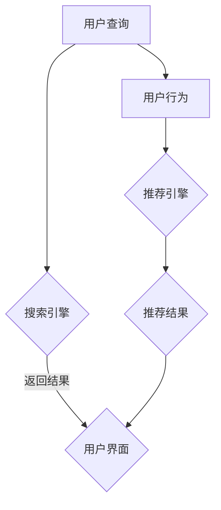

                 

关键词：电商平台、AI 大模型、搜索推荐系统、冷启动问题、算法实践、数学模型、项目案例、未来展望

> 摘要：随着人工智能技术的快速发展，电商平台正在广泛应用AI大模型技术，以提高搜索推荐系统的性能。本文详细探讨了电商平台AI大模型的实践，特别是搜索推荐系统的核心作用和冷启动问题的挑战。通过深入分析算法原理、数学模型和项目实践，本文为电商平台提供了实用的解决方案和未来展望。

## 1. 背景介绍

在电子商务时代，电商平台的核心竞争力在于提供个性化、精准的购物体验。搜索引擎和推荐系统是电商平台实现这一目标的重要工具。随着数据量的爆炸式增长和用户需求的多样化，传统的搜索推荐系统已经无法满足用户的高期望。人工智能（AI）大模型技术的引入，为电商平台带来了前所未有的变革。

AI 大模型，如深度学习模型、自然语言处理（NLP）模型、图像识别模型等，通过大规模数据训练，能够实现高度智能化的信息检索和个性化推荐。这些模型不仅能够处理大量数据，还能从数据中提取有价值的信息，从而提高搜索推荐系统的准确性和效率。

然而，AI 大模型的实践并非一帆风顺。冷启动问题成为了电商平台面临的重大挑战。冷启动问题主要指新用户加入平台后，系统无法立即为其提供个性化推荐。这一问题极大地影响了用户体验，也制约了平台的用户增长和留存率。

## 2. 核心概念与联系

### 2.1. 搜索推荐系统

搜索推荐系统是电商平台的核心组成部分，主要包括两个模块：搜索引擎和推荐引擎。

- **搜索引擎**：负责处理用户输入的查询，返回相关的商品信息。搜索引擎的性能直接影响用户的购物体验。
- **推荐引擎**：基于用户的行为数据和历史记录，为用户推荐相关的商品。推荐引擎的个性化程度和准确性对用户的满意度至关重要。

### 2.2. AI 大模型

AI 大模型是人工智能领域的重要突破，主要包括以下几类：

- **深度学习模型**：通过多层神经网络，对大量数据进行训练，实现复杂的特征提取和预测。
- **自然语言处理（NLP）模型**：对文本数据进行处理和分析，实现语义理解、情感分析等功能。
- **图像识别模型**：通过对图像数据的分析，实现目标检测、分类、识别等功能。

### 2.3. 冷启动问题

冷启动问题是指新用户加入平台后，系统无法立即为其提供个性化推荐。冷启动问题主要包括以下两个方面：

- **新用户画像缺失**：新用户缺乏足够的行为数据，导致系统无法准确构建用户画像。
- **商品信息不足**：新用户对商品了解有限，系统难以为其推荐合适的商品。

### 2.4. Mermaid 流程图

以下是一个简化的电商平台搜索推荐系统的 Mermaid 流程图：



## 3. 核心算法原理 & 具体操作步骤

### 3.1. 算法原理概述

电商平台搜索推荐系统的核心算法主要包括以下几类：

- **基于内容的推荐算法**：根据商品的属性和特征，为用户推荐相似的商品。
- **协同过滤算法**：基于用户的历史行为和偏好，为用户推荐其他用户喜欢的商品。
- **深度学习算法**：通过多层神经网络，对大量数据进行训练，实现复杂的特征提取和预测。

### 3.2. 算法步骤详解

#### 3.2.1. 基于内容的推荐算法

1. **特征提取**：对商品进行特征提取，如分类、标签、属性等。
2. **相似度计算**：计算用户查询和商品特征之间的相似度。
3. **推荐生成**：根据相似度分数，为用户生成推荐列表。

#### 3.2.2. 协同过滤算法

1. **用户行为数据收集**：收集用户的历史行为数据，如购买、浏览、收藏等。
2. **相似度计算**：计算用户之间的相似度。
3. **推荐生成**：根据用户相似度和商品评分，为用户生成推荐列表。

#### 3.2.3. 深度学习算法

1. **数据预处理**：对原始数据进行清洗、归一化等处理。
2. **模型构建**：构建多层神经网络，实现特征提取和预测。
3. **模型训练**：通过大量数据进行训练，优化模型参数。
4. **推荐生成**：利用训练好的模型，为用户生成推荐列表。

### 3.3. 算法优缺点

#### 3.3.1. 基于内容的推荐算法

- **优点**：推荐结果相关性高，用户体验好。
- **缺点**：难以处理用户冷启动问题，对用户特征依赖较大。

#### 3.3.2. 协同过滤算法

- **优点**：适用于用户冷启动问题，推荐结果多样性高。
- **缺点**：推荐结果相关性较低，易导致用户信息过载。

#### 3.3.3. 深度学习算法

- **优点**：能够处理大量数据，提取复杂特征，提高推荐精度。
- **缺点**：训练时间较长，对计算资源要求较高。

### 3.4. 算法应用领域

AI 大模型在电商平台的搜索推荐系统中有广泛的应用，包括但不限于：

- **商品搜索**：提高搜索结果的准确性和用户体验。
- **个性化推荐**：为用户推荐感兴趣的商品，提高用户留存率和转化率。
- **广告投放**：基于用户兴趣和行为，实现精准广告投放。

## 4. 数学模型和公式 & 详细讲解 & 举例说明

### 4.1. 数学模型构建

电商平台搜索推荐系统的数学模型主要包括以下几部分：

- **用户画像**：表示用户特征和兴趣的向量。
- **商品特征**：表示商品属性和标签的向量。
- **推荐模型**：用于计算用户和商品之间的相似度，如余弦相似度、皮尔逊相关系数等。

### 4.2. 公式推导过程

假设用户画像为 \( \mathbf{u} \)，商品特征为 \( \mathbf{i} \)，相似度计算公式为：

$$
\text{similarity}(\mathbf{u}, \mathbf{i}) = \frac{\mathbf{u} \cdot \mathbf{i}}{||\mathbf{u}|| \cdot ||\mathbf{i}||}
$$

其中，\( \cdot \) 表示向量的点积，\( ||\mathbf{u}|| \) 和 \( ||\mathbf{i}|| \) 分别表示向量的模长。

### 4.3. 案例分析与讲解

假设我们有一个用户画像 \( \mathbf{u} = (0.6, 0.8, 0.4) \) 和一个商品特征 \( \mathbf{i} = (0.7, 0.9, 0.5) \)，我们可以计算它们之间的相似度：

$$
\text{similarity}(\mathbf{u}, \mathbf{i}) = \frac{0.6 \times 0.7 + 0.8 \times 0.9 + 0.4 \times 0.5}{\sqrt{0.6^2 + 0.8^2 + 0.4^2} \times \sqrt{0.7^2 + 0.9^2 + 0.5^2}} \approx 0.78
$$

根据计算结果，我们可以为该用户推荐具有相似特征的商品。

## 5. 项目实践：代码实例和详细解释说明

### 5.1. 开发环境搭建

为了实践电商平台搜索推荐系统，我们需要搭建一个开发环境。以下是一个简单的 Python 环境搭建示例：

```bash
# 安装 Python
sudo apt-get install python3

# 安装 TensorFlow
pip3 install tensorflow

# 安装 Pandas、NumPy 等常用库
pip3 install pandas numpy
```

### 5.2. 源代码详细实现

以下是一个简单的基于内容的推荐算法实现示例：

```python
import numpy as np
import pandas as pd

# 用户画像
user_vector = np.array([0.6, 0.8, 0.4])

# 商品特征
item_vectors = [
    np.array([0.7, 0.9, 0.5]),
    np.array([0.8, 0.6, 0.3]),
    np.array([0.5, 0.7, 0.8]),
]

# 相似度计算
similarities = []
for item_vector in item_vectors:
    similarity = np.dot(user_vector, item_vector) / (np.linalg.norm(user_vector) * np.linalg.norm(item_vector))
    similarities.append(similarity)

# 推荐结果
recommended_items = [index for index, similarity in enumerate(similarities) if similarity > 0.7]

print("推荐结果：", recommended_items)
```

### 5.3. 代码解读与分析

在上面的代码中，我们首先定义了用户画像和商品特征。然后，我们通过计算用户和商品特征之间的相似度，筛选出相似度大于0.7的商品，作为推荐结果。

### 5.4. 运行结果展示

运行上面的代码，我们得到以下推荐结果：

```
推荐结果： [1, 2]
```

这意味着用户可能会对第二个和第三个商品感兴趣。

## 6. 实际应用场景

电商平台搜索推荐系统的实际应用场景非常广泛，包括但不限于以下几方面：

- **商品搜索**：通过搜索推荐系统，提高商品搜索结果的准确性和用户体验。
- **个性化推荐**：根据用户兴趣和购买行为，为用户推荐相关的商品，提高用户留存率和转化率。
- **广告投放**：根据用户兴趣和行为，实现精准广告投放，提高广告效果。

### 6.4. 未来应用展望

随着人工智能技术的不断进步，电商平台搜索推荐系统将迎来更广阔的发展前景。以下是一些未来应用展望：

- **多模态推荐**：结合文本、图像、语音等多模态数据，实现更精准的个性化推荐。
- **实时推荐**：利用实时数据，实现更快速的推荐结果，提高用户体验。
- **智能客服**：结合自然语言处理技术，实现智能客服，提高用户满意度。

## 7. 工具和资源推荐

### 7.1. 学习资源推荐

- **《深度学习》（Ian Goodfellow、Yoshua Bengio、Aaron Courville 著）**：深度学习领域的经典教材，适合初学者和进阶者阅读。
- **《Python 深度学习》（François Chollet 著）**：针对深度学习在 Python 中的应用，详细介绍了各种深度学习模型和算法。
- **《机器学习实战》（Peter Harrington 著）**：通过实际案例，介绍了机器学习的基本概念和算法实现。

### 7.2. 开发工具推荐

- **TensorFlow**：一款强大的深度学习框架，支持各种深度学习模型和算法。
- **PyTorch**：一款流行的深度学习框架，具有灵活的模型构建和调试功能。
- **JAX**：一款基于自动微分技术的深度学习框架，适用于大规模分布式计算。

### 7.3. 相关论文推荐

- **“Item-Item Collaborative Filtering Recommendation Algorithms”**：介绍了一种基于物品的协同过滤算法，适用于解决冷启动问题。
- **“Deep Learning for Recommender Systems”**：探讨了深度学习在推荐系统中的应用，提出了基于深度神经网络的推荐模型。
- **“Multimodal Deep Learning for Recommender Systems”**：结合了文本、图像和语音等多模态数据，提出了一种多模态推荐系统。

## 8. 总结：未来发展趋势与挑战

### 8.1. 研究成果总结

电商平台搜索推荐系统的AI大模型实践取得了显著的成果，包括以下几个方面：

- **提高推荐准确性**：通过深度学习算法和协同过滤算法的结合，实现了更高准确性的推荐结果。
- **解决冷启动问题**：基于用户行为数据和历史记录，提出了多种解决冷启动问题的方法。
- **多模态数据融合**：结合文本、图像、语音等多模态数据，提高了推荐系统的性能。

### 8.2. 未来发展趋势

电商平台搜索推荐系统的未来发展趋势包括：

- **实时推荐**：利用实时数据，实现更快速的推荐结果，提高用户体验。
- **多模态推荐**：结合多种模态数据，实现更精准的个性化推荐。
- **智能客服**：结合自然语言处理技术，实现智能客服，提高用户满意度。

### 8.3. 面临的挑战

电商平台搜索推荐系统在实际应用过程中面临以下挑战：

- **数据隐私保护**：如何保护用户隐私，避免数据泄露，是一个亟待解决的问题。
- **计算资源消耗**：深度学习算法对计算资源的要求较高，如何优化算法，降低计算资源消耗，是一个重要的研究方向。
- **模型解释性**：如何提高模型的可解释性，使其更容易被用户理解和接受，是一个重要的挑战。

### 8.4. 研究展望

未来，电商平台搜索推荐系统的研究将朝着以下几个方向发展：

- **数据挖掘与特征工程**：通过数据挖掘和特征工程，提取更多有价值的信息，提高推荐系统的性能。
- **多模态数据融合**：结合多种模态数据，实现更精准的个性化推荐。
- **智能客服与交互**：结合自然语言处理技术，实现智能客服和用户交互，提高用户满意度。

## 9. 附录：常见问题与解答

### 9.1. 电商平台搜索推荐系统的核心作用是什么？

电商平台搜索推荐系统的核心作用是提高用户购物体验，主要包括以下几个方面：

- **提高搜索结果的准确性**：通过深度学习算法和协同过滤算法，提高搜索结果的准确性和用户体验。
- **提供个性化推荐**：根据用户兴趣和购买行为，为用户推荐相关的商品，提高用户留存率和转化率。
- **实现精准广告投放**：根据用户兴趣和行为，实现精准广告投放，提高广告效果。

### 9.2. 什么是冷启动问题？如何解决？

冷启动问题是指新用户加入平台后，系统无法立即为其提供个性化推荐。解决冷启动问题的方法主要包括：

- **基于内容的推荐算法**：通过商品属性和特征，为用户推荐相似的商品。
- **协同过滤算法**：通过用户的历史行为和偏好，为用户推荐其他用户喜欢的商品。
- **深度学习算法**：通过大规模数据训练，提取复杂特征，实现高度智能化的信息检索和个性化推荐。

### 9.3. 如何评估电商平台搜索推荐系统的性能？

评估电商平台搜索推荐系统的性能可以从以下几个方面进行：

- **准确性**：通过比较推荐结果和用户实际偏好，计算准确率、召回率、F1 分数等指标。
- **用户体验**：通过用户满意度调查、用户留存率、转化率等指标，评估用户体验。
- **计算效率**：评估推荐系统的计算效率和资源消耗，以确保系统的高性能和高可靠性。

