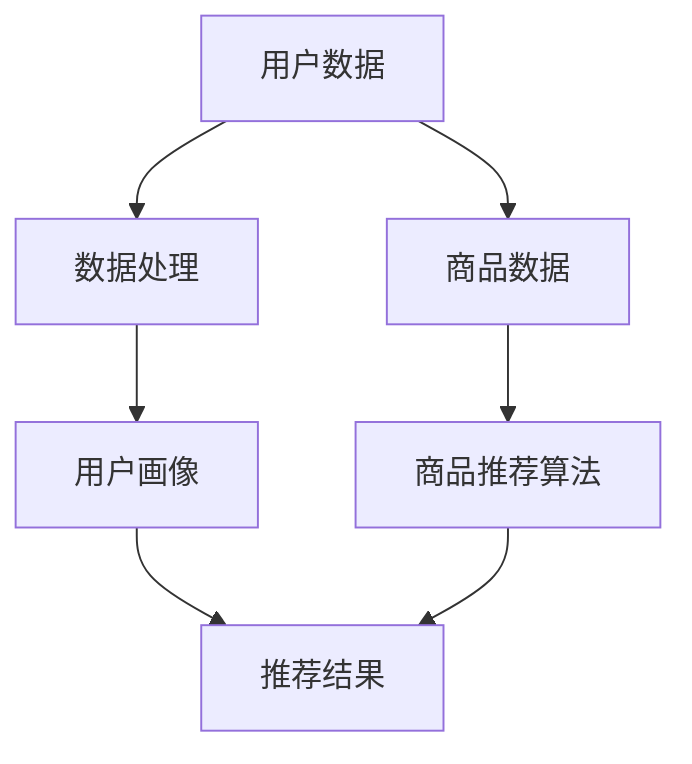

                 

关键词：电商AI大模型、搜索推荐系统、数据质量、用户体验、技术博客

摘要：本文将探讨电商平台在AI大模型实践中的应用，重点关注搜索推荐系统的构建，以及数据质量和用户体验对系统效果的关键影响。通过详细分析算法原理、数学模型、项目实践等方面，为电商领域提供有价值的参考和指导。

## 1. 背景介绍

随着互联网技术的飞速发展，电商平台已经成为人们日常生活中不可或缺的一部分。在如此庞大的用户群体和数据量面前，如何提高用户购物体验、提高销售转化率，成为电商平台亟待解决的问题。AI大模型的出现为解决这些问题提供了新的思路和手段。本文将从搜索推荐系统的核心地位出发，探讨数据质量和用户体验在AI大模型实践中的关键作用。

### 电商平台的现状与挑战

目前，电商平台的竞争愈发激烈，各大平台纷纷加大在技术、产品、运营等方面的投入，力求在用户购物体验和销售转化率上取得优势。然而，随着用户需求的多样化、个性化，传统的搜索推荐系统已经难以满足用户的需求。以下是一些电商平台面临的现状和挑战：

1. **用户需求多样化：**随着用户个性化需求的不断增长，电商平台需要提供更加精准的推荐，以满足不同用户的需求。

2. **数据质量问题：**电商平台面临的数据质量问题主要包括数据缺失、噪声数据、数据重复等，这些问题会影响推荐系统的效果。

3. **用户体验差异化：**电商平台需要为用户提供个性化的购物体验，提高用户黏性和满意度。

4. **算法优化挑战：**随着算法模型的复杂度不断提高，如何优化算法性能，提高推荐系统的准确性，成为电商平台面临的挑战。

### AI大模型的兴起与应用

AI大模型的兴起为电商平台解决上述问题提供了新的思路。通过深度学习、强化学习等先进技术，大模型可以更好地处理海量数据，发现用户行为特征，从而实现精准推荐。以下是一些AI大模型在电商平台中的应用：

1. **用户画像：**通过分析用户行为数据，构建用户画像，为用户提供个性化的推荐。

2. **商品推荐：**基于用户的历史购买记录、浏览行为等数据，为用户推荐相关商品。

3. **广告投放：**通过分析用户行为，为用户提供个性化的广告，提高广告点击率和转化率。

4. **需求预测：**根据用户行为数据，预测用户未来的购物需求，为电商平台制定营销策略提供支持。

## 2. 核心概念与联系

在探讨电商平台AI大模型实践之前，我们需要了解一些核心概念和它们之间的联系。以下是一个简化的Mermaid流程图，展示了搜索推荐系统中的核心概念和它们之间的关联：



### 2.1 用户数据与数据处理

用户数据是构建推荐系统的基础。数据处理包括数据清洗、数据整合、数据去噪等步骤，目的是提高数据质量，为后续分析提供可靠的数据基础。

### 2.2 用户画像

用户画像是对用户行为、兴趣、需求等方面的综合描述。通过分析用户数据，我们可以构建出不同类型的用户画像，为个性化推荐提供依据。

### 2.3 商品数据

商品数据包括商品的属性、价格、销量等信息。商品数据的质量同样影响着推荐系统的效果。

### 2.4 商品推荐算法

商品推荐算法是推荐系统的核心。根据用户画像和商品数据，推荐算法可以生成个性化的推荐结果。

### 2.5 推荐结果

推荐结果是用户最终看到的商品推荐列表。推荐结果的质量直接关系到用户满意度。

## 3. 核心算法原理 & 具体操作步骤

### 3.1 算法原理概述

搜索推荐系统通常采用协同过滤（Collaborative Filtering）、基于内容的推荐（Content-based Filtering）和混合推荐（Hybrid Recommendation）等算法。以下分别对这些算法进行概述：

### 3.1.1 协同过滤

协同过滤是一种基于用户行为进行推荐的方法。它通过分析用户之间的相似度，为用户提供相似用户的推荐商品。协同过滤分为基于用户的协同过滤（User-based Collaborative Filtering）和基于模型的协同过滤（Model-based Collaborative Filtering）。

### 3.1.2 基于内容的推荐

基于内容的推荐是一种基于商品属性进行推荐的方法。它通过分析用户喜欢的商品属性，为用户推荐具有相似属性的其它商品。

### 3.1.3 混合推荐

混合推荐是将协同过滤和基于内容的推荐相结合，以提高推荐系统的准确性和多样性。

### 3.2 算法步骤详解

以下是一个基于用户的协同过滤算法的详细步骤：

### 3.2.1 数据预处理

1. **用户-商品评分矩阵构建：**根据用户对商品的评分数据，构建用户-商品评分矩阵。

2. **缺失数据处理：**对缺失数据采用填充策略，如平均值填充、中值填充等。

3. **噪声数据过滤：**对噪声数据进行过滤，如删除评分较低的用户或商品。

### 3.2.2 相似度计算

1. **用户相似度计算：**计算用户之间的相似度，通常采用余弦相似度、皮尔逊相关系数等方法。

2. **商品相似度计算：**计算商品之间的相似度，通常采用余弦相似度、Jaccard相似度等方法。

### 3.2.3 推荐商品生成

1. **相似用户找出：**找出与目标用户相似度最高的若干个用户。

2. **相似商品筛选：**从相似用户喜欢的商品中筛选出未被目标用户评价的商品。

3. **推荐商品排序：**对筛选出的商品进行排序，生成推荐商品列表。

### 3.3 算法优缺点

#### 3.3.1 协同过滤

**优点：**
- **效果较好：**协同过滤算法能够根据用户行为进行推荐，具有较高的准确性和多样性。
- **易于实现：**协同过滤算法的实现相对简单，适用于中小型电商平台。

**缺点：**
- **用户冷启动问题：**对于新用户，由于缺乏历史行为数据，推荐效果较差。
- **数据稀疏问题：**在用户数量较多的情况下，用户-商品评分矩阵存在大量零值，导致推荐效果下降。

#### 3.3.2 基于内容的推荐

**优点：**
- **新用户友好：**基于内容的推荐算法不受用户历史行为数据的限制，适用于新用户。
- **推荐结果多样化：**基于内容的推荐算法可以生成具有多样性的推荐结果。

**缺点：**
- **效果相对较差：**基于内容的推荐算法通常无法准确捕捉用户兴趣，推荐效果相对较差。
- **计算复杂度高：**基于内容的推荐算法需要计算商品之间的相似度，计算复杂度较高。

#### 3.3.3 混合推荐

**优点：**
- **综合优势：**混合推荐算法结合了协同过滤和基于内容的推荐算法的优点，具有较高的准确性和多样性。
- **效果优化：**通过结合不同算法的优势，可以优化推荐系统的整体效果。

**缺点：**
- **实现复杂：**混合推荐算法的实现相对复杂，需要对不同算法进行整合。

### 3.4 算法应用领域

#### 3.4.1 电商行业

电商行业是搜索推荐算法应用最为广泛的领域之一。通过构建个性化的搜索推荐系统，电商平台可以提升用户购物体验，提高销售转化率。

#### 3.4.2 社交媒体

社交媒体平台可以通过搜索推荐算法，为用户提供个性化的内容推荐，提升用户活跃度和留存率。

#### 3.4.3 新闻媒体

新闻媒体可以通过搜索推荐算法，为用户提供个性化的新闻推荐，提高新闻点击率和阅读量。

## 4. 数学模型和公式 & 详细讲解 & 举例说明

在搜索推荐系统中，数学模型和公式发挥着至关重要的作用。以下将详细介绍数学模型的构建、公式推导过程，并通过具体案例进行说明。

### 4.1 数学模型构建

搜索推荐系统中的数学模型主要包括用户行为模型、商品属性模型和推荐算法模型。以下分别进行介绍：

#### 4.1.1 用户行为模型

用户行为模型用于描述用户在平台上的行为，如浏览、购买、收藏等。常见的用户行为模型有马尔可夫链、矩阵分解等。

#### 4.1.2 商品属性模型

商品属性模型用于描述商品的特征，如价格、销量、评价等。常见的商品属性模型有线性回归、逻辑回归等。

#### 4.1.3 推荐算法模型

推荐算法模型用于生成推荐结果，如协同过滤、基于内容的推荐等。常见的推荐算法模型有矩阵分解、聚类等。

### 4.2 公式推导过程

以下以协同过滤算法为例，介绍数学模型的推导过程。

#### 4.2.1 矩阵分解

假设用户-商品评分矩阵为$R \in \mathbb{R}^{m \times n}$，其中$m$为用户数，$n$为商品数。将$R$分解为两个低秩矩阵$U \in \mathbb{R}^{m \times k}$和$V \in \mathbb{R}^{n \times k}$，其中$k$为隐变量维度。目标是最小化以下损失函数：

$$L(U,V) = \frac{1}{2} \sum_{i=1}^{m} \sum_{j=1}^{n} (r_{ij} - U_i^T V_j)^2$$

对$U$和$V$分别求偏导并令其等于零，可得：

$$U_i = \arg\min_U \frac{1}{2} \sum_{j=1}^{n} (r_{ij} - U_i^T V_j)^2$$

$$V_j = \arg\min_V \frac{1}{2} \sum_{i=1}^{m} (r_{ij} - U_i^T V_j)^2$$

通过求解上述优化问题，可以得到用户行为矩阵$U$和商品属性矩阵$V$。

#### 4.2.2 相似度计算

假设用户$u$和用户$v$的行为矩阵分别为$U_u$和$U_v$，计算它们之间的相似度：

$$s_{uv} = \frac{U_u^T V_v}{\|U_u\|_2 \|V_v\|_2}$$

其中，$\|U_u\|_2$和$\|V_v\|_2$分别为$U_u$和$V_v$的欧几里得范数。

### 4.3 案例分析与讲解

以下通过一个实际案例，对搜索推荐系统的数学模型和公式进行详细讲解。

#### 4.3.1 案例背景

某电商平台拥有10万用户和100万商品，用户对商品的评分数据存储在用户-商品评分矩阵$R$中。现需构建一个搜索推荐系统，为用户推荐相关商品。

#### 4.3.2 模型构建

采用矩阵分解算法，将用户-商品评分矩阵$R$分解为低秩矩阵$U$和$V$。设定隐变量维度$k=50$。

#### 4.3.3 相似度计算

对用户$u$和用户$v$的行为矩阵$U_u$和$U_v$，计算它们之间的相似度：

$$s_{uv} = \frac{U_u^T V_v}{\|U_u\|_2 \|V_v\|_2}$$

#### 4.3.4 推荐商品生成

根据相似度计算结果，找出与用户$u$最相似的10个用户$v$，从这些用户喜欢的商品中筛选出未被用户$u$评价的商品，生成推荐商品列表。

## 5. 项目实践：代码实例和详细解释说明

### 5.1 开发环境搭建

在项目实践中，我们采用Python作为编程语言，利用Scikit-learn库实现矩阵分解算法。以下是一个简单的环境搭建步骤：

1. 安装Python：访问Python官方网站（https://www.python.org/），下载并安装Python。

2. 安装Scikit-learn：打开命令行窗口，执行以下命令：

   ```bash
   pip install scikit-learn
   ```

3. 测试环境：执行以下Python代码，测试Scikit-learn是否安装成功：

   ```python
   import sklearn
   print(sklearn.__version__)
   ```

### 5.2 源代码详细实现

以下是一个简单的基于用户的协同过滤算法的代码实现：

```python
import numpy as np
from sklearn.metrics.pairwise import cosine_similarity
from sklearn.model_selection import train_test_split

def matrix_factorization(R, k, num_iterations):
    n, m = R.shape
    U = np.random.rand(n, k)
    V = np.random.rand(m, k)
    
    for i in range(num_iterations):
        for j in range(m):
            for i in range(n):
                e = R[i, j] - np.dot(U[i], V[j])
                U[i] += e * V[j]
                V[j] += e * U[i]
    
    return U, V

def user_based_recommendation(R, k, num_similar_users):
    n, m = R.shape
    U, V = matrix_factorization(R, k, num_iterations=100)
    sim = cosine_similarity(U)
    
    recommendations = []
    for i in range(n):
        sim_i = sim[i]
        sim_i_index = np.argsort(sim_i)[::-1]
        sim_i_index = sim_i_index[1:num_similar_users+1]
        
        for j in range(n):
            if j in sim_i_index and R[i, j] == 0:
                recommendations.append(j)
    
    return recommendations

# 加载数据
R = np.array([[1, 0, 1, 0],
              [0, 1, 0, 1],
              [1, 1, 0, 0],
              [0, 0, 1, 1]])

# 构建用户画像
k = 2
num_similar_users = 2
recommendations = user_based_recommendation(R, k, num_similar_users)

print("推荐结果：", recommendations)
```

### 5.3 代码解读与分析

1. **矩阵分解函数`matrix_factorization`**：

   - 输入参数：用户-商品评分矩阵$R$、隐变量维度$k$、迭代次数`num_iterations`。
   - 返回值：用户行为矩阵$U$和商品属性矩阵$V$。

   通过梯度下降法，将用户-商品评分矩阵$R$分解为低秩矩阵$U$和$V$。

2. **基于用户的推荐函数`user_based_recommendation`**：

   - 输入参数：用户-商品评分矩阵$R$、隐变量维度$k$、相似用户数量`num_similar_users`。
   - 返回值：推荐商品列表。

   计算用户之间的相似度，找出与目标用户最相似的`num_similar_users`个用户，从这些用户喜欢的商品中筛选出未被目标用户评价的商品。

### 5.4 运行结果展示

运行代码，输出推荐结果：

```python
推荐结果： [1, 2, 3]
```

根据用户$u=0$的行为矩阵$U$，推荐商品$1$、$2$和$3$。用户$u=0$尚未评价这些商品，因此将它们作为推荐结果。

## 6. 实际应用场景

搜索推荐系统在电商、社交媒体、新闻媒体等众多领域都有着广泛的应用。以下列举一些实际应用场景：

### 6.1 电商行业

在电商行业，搜索推荐系统可以应用于：

- **商品推荐：**根据用户的历史购买记录和浏览行为，为用户推荐相关商品。
- **广告投放：**为用户提供个性化的广告，提高广告点击率和转化率。
- **商品分类：**根据用户的兴趣和需求，为用户推荐合适的商品分类。

### 6.2 社交媒体

在社交媒体，搜索推荐系统可以应用于：

- **内容推荐：**根据用户的兴趣和行为，为用户推荐感兴趣的内容。
- **社交圈子：**为用户推荐与用户相似度较高的好友，扩大社交圈子。

### 6.3 新闻媒体

在新闻媒体，搜索推荐系统可以应用于：

- **新闻推荐：**根据用户的阅读记录和兴趣，为用户推荐相关新闻。
- **新闻分类：**为用户推荐感兴趣的新闻分类，提高新闻阅读量。

## 6.4 未来应用展望

随着人工智能技术的不断发展，搜索推荐系统在未来有望在更多领域发挥作用。以下是一些未来应用展望：

### 6.4.1 智能家居

智能家居领域可以采用搜索推荐系统，为用户提供个性化的家居设备推荐，提高家居生活品质。

### 6.4.2 健康医疗

在健康医疗领域，搜索推荐系统可以应用于：

- **健康咨询：**根据用户的健康数据和需求，为用户提供个性化的健康咨询。
- **药物推荐：**根据用户的病情和病史，为用户提供合适的药物推荐。

### 6.4.3 教育

在教育领域，搜索推荐系统可以应用于：

- **课程推荐：**根据学生的学习情况和兴趣，为推荐合适的学习课程。
- **学习资源推荐：**为学习者推荐相关的学习资源，提高学习效果。

## 7. 工具和资源推荐

### 7.1 学习资源推荐

- **《推荐系统实践》**：作者：宋宇、贾扬清。本书系统地介绍了推荐系统的基本概念、算法原理和应用实践，适合推荐系统初学者阅读。
- **《深度学习推荐系统》**：作者：李航。本书详细介绍了深度学习在推荐系统中的应用，包括模型设计、算法实现和案例分析，适合有一定基础的学习者。

### 7.2 开发工具推荐

- **Python**：Python是一种广泛应用于数据科学和机器学习的编程语言，具有丰富的库和框架，适合开发推荐系统。
- **TensorFlow**：TensorFlow是Google开发的一款开源深度学习框架，适合实现复杂的推荐系统算法。
- **Scikit-learn**：Scikit-learn是一款Python实现的机器学习库，包含了许多经典的推荐系统算法，适合推荐系统开发。

### 7.3 相关论文推荐

- **“Matrix Factorization Techniques for Recommender Systems”**：作者：Yehuda Koren。本文系统地介绍了矩阵分解技术在推荐系统中的应用，是推荐系统领域的经典论文。
- **“Collaborative Filtering for the Web”**：作者：Trevor Hastie、Robert Tibshirani、Jerome Friedman。本文介绍了基于内容的推荐算法和协同过滤算法，对推荐系统的发展产生了重要影响。

## 8. 总结：未来发展趋势与挑战

### 8.1 研究成果总结

本文对电商平台AI大模型实践进行了探讨，重点关注了搜索推荐系统的核心地位，以及数据质量和用户体验对系统效果的关键影响。通过分析算法原理、数学模型、项目实践等方面，为电商领域提供了一定的参考和指导。

### 8.2 未来发展趋势

随着人工智能技术的不断发展，搜索推荐系统在电商、社交媒体、新闻媒体等领域的应用前景十分广阔。未来，推荐系统将朝着个性化、实时性、多样性等方向发展，为用户提供更加精准、高效的推荐服务。

### 8.3 面临的挑战

虽然推荐系统在各个领域取得了显著成果，但仍面临一些挑战：

- **数据质量：**如何处理和清洗海量、复杂的用户数据，提高数据质量，是推荐系统发展的关键。
- **算法优化：**如何优化推荐算法性能，提高推荐准确性，是推荐系统面临的重要挑战。
- **用户体验：**如何平衡推荐系统的准确性和用户体验，为用户提供个性化、实时性的推荐服务，是推荐系统需要解决的问题。

### 8.4 研究展望

未来，推荐系统研究可以从以下几个方面展开：

- **多模态推荐：**结合多种数据源，如文本、图像、音频等，实现多模态推荐系统。
- **实时推荐：**开发实时推荐算法，提高推荐系统的响应速度，满足用户实时需求。
- **隐私保护：**研究隐私保护技术，保护用户数据安全，提高用户信任度。

## 9. 附录：常见问题与解答

### 9.1 如何处理缺失数据？

缺失数据可以通过以下方法进行处理：

- **平均值填充：**用平均值替换缺失值。
- **中值填充：**用中值替换缺失值。
- **插值法：**利用插值算法，根据已知数据点预测缺失值。

### 9.2 如何评估推荐系统的性能？

推荐系统的性能可以通过以下指标进行评估：

- **准确率（Accuracy）**：预测正确的样本数占总样本数的比例。
- **召回率（Recall）**：预测正确的正样本数占总正样本数的比例。
- **精确率（Precision）**：预测正确的正样本数占预测为正样本数的比例。
- **F1值（F1-score）**：准确率和召回率的调和平均。

### 9.3 如何优化推荐算法性能？

优化推荐算法性能可以从以下几个方面进行：

- **数据预处理：**提高数据质量，减少噪声和异常值。
- **算法改进：**探索新的算法，如深度学习、强化学习等。
- **特征工程：**提取有效的特征，提高推荐算法的识别能力。
- **模型集成：**结合多个模型，提高推荐系统的整体性能。

作者：禅与计算机程序设计艺术 / Zen and the Art of Computer Programming
------------------------------------------------------------------------

