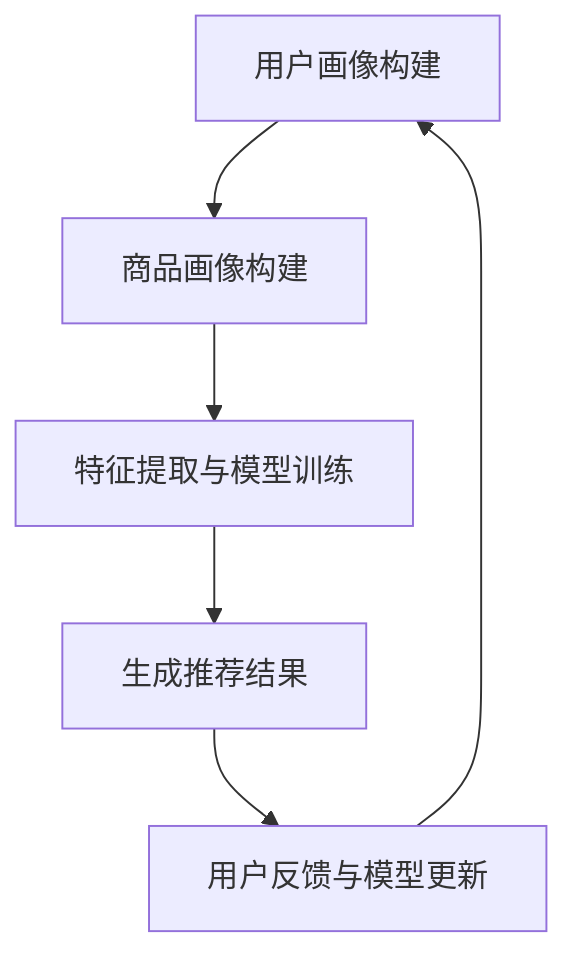

                 

关键词：电商平台、AI大模型、搜索推荐系统、性能提升、效率优化

> 摘要：本文深入探讨了AI大模型在电商平台搜索推荐系统中的应用，通过分析算法原理、数学模型、项目实践，详细介绍了如何通过大模型应用实现搜索推荐系统性能与效率的双重提升，并对未来发展趋势与挑战进行了展望。

## 1. 背景介绍

随着互联网和电子商务的飞速发展，电商平台的用户数量和交易额持续增长。为了满足用户日益复杂的购物需求，电商平台需要提供更加精准和高效的搜索推荐服务。然而，传统的搜索推荐系统在面对海量数据和高频访问时，往往面临着性能瓶颈和效率问题。此时，AI大模型的应用成为解决这一问题的有效手段。

AI大模型，通常指的是基于深度学习技术构建的复杂神经网络模型，具备强大的数据分析和处理能力。在搜索推荐系统中，AI大模型可以通过学习用户的购物行为、兴趣偏好和商品特征，生成个性化的推荐结果，从而提升系统的推荐质量和用户体验。

本文旨在探讨如何利用AI大模型实现电商平台搜索推荐系统的性能与效率提升，包括核心算法原理、数学模型构建、项目实践等。通过本文的介绍，读者可以深入了解AI大模型在电商搜索推荐系统中的应用价值，以及如何实现其在实际项目中的有效部署。

## 2. 核心概念与联系

### 2.1. 搜索推荐系统概述

搜索推荐系统是电商平台的核心功能之一，其目标是通过分析用户行为和商品特征，为用户提供个性化的搜索结果和推荐商品。传统的搜索推荐系统主要包括以下组成部分：

1. **用户画像**：通过对用户的历史行为数据进行分析，构建用户画像，包括用户的基本信息、购物偏好、兴趣爱好等。
2. **商品画像**：对商品进行特征提取，构建商品画像，包括商品的基本信息、类别、价格、销量等。
3. **搜索与推荐算法**：基于用户画像和商品画像，通过算法模型生成个性化的搜索结果和推荐商品。

### 2.2. AI大模型原理

AI大模型是基于深度学习技术构建的复杂神经网络模型，其核心思想是通过学习大量的数据，自动提取特征并生成预测结果。AI大模型在搜索推荐系统中的应用主要体现在以下几个方面：

1. **特征提取**：通过神经网络结构，自动从原始数据中提取高层次的抽象特征，提高推荐的准确性。
2. **模型优化**：通过大规模的训练数据集，不断优化模型参数，提升模型性能和效率。
3. **实时更新**：AI大模型可以根据用户行为和商品特征的变化，实时更新推荐结果，提高推荐系统的动态适应性。

### 2.3. 搜索推荐系统与AI大模型的关系

AI大模型在搜索推荐系统中的应用，使得传统系统在性能和效率方面得到了显著提升。具体来说，AI大模型与搜索推荐系统之间的关系如下：

1. **性能提升**：AI大模型通过高效的特征提取和模型优化，提高了搜索推荐系统的响应速度和计算效率，降低了系统的延迟和资源消耗。
2. **效率优化**：AI大模型可以处理大规模的数据集，实现实时推荐，提高了推荐系统的动态适应能力和用户体验。
3. **个性化推荐**：AI大模型通过对用户行为和商品特征的学习，生成个性化的推荐结果，提高了推荐系统的推荐质量和用户满意度。

### 2.4. Mermaid 流程图

以下是一个简单的Mermaid流程图，展示了AI大模型在搜索推荐系统中的应用流程：



在图中，A表示用户画像构建，B表示商品画像构建，C表示特征提取与模型训练，D表示生成推荐结果，E表示用户反馈与模型更新。通过这个过程，AI大模型不断学习用户的偏好和行为，优化推荐结果，提高系统性能和效率。

## 3. 核心算法原理 & 具体操作步骤

### 3.1. 算法原理概述

AI大模型在搜索推荐系统中的核心算法是基于深度学习技术，主要包括以下几个步骤：

1. **数据预处理**：对用户行为数据、商品特征数据等进行清洗、整合和预处理，为后续的模型训练提供高质量的数据集。
2. **特征提取**：通过神经网络结构，自动从原始数据中提取高层次的抽象特征，提高推荐的准确性。
3. **模型训练**：利用大规模的数据集，通过反向传播算法和优化算法，不断调整模型参数，优化模型性能。
4. **模型评估**：通过交叉验证、A/B测试等方法，评估模型的预测性能和推荐效果。
5. **生成推荐结果**：根据用户画像和商品画像，利用训练好的模型，生成个性化的推荐结果。

### 3.2. 算法步骤详解

1. **数据预处理**

   数据预处理是搜索推荐系统的关键步骤，主要包括以下任务：

   - 数据清洗：去除重复、缺失、异常的数据，保证数据质量。
   - 数据整合：将不同的数据源进行整合，形成统一的数据格式。
   - 数据标准化：对数值型数据进行归一化或标准化处理，消除数据量级差异。
   - 特征工程：提取与用户行为和商品特征相关的特征，为后续的模型训练提供输入。

2. **特征提取**

   特征提取是AI大模型的核心步骤，通过神经网络结构，自动从原始数据中提取高层次的抽象特征。以下是常用的几种特征提取方法：

   - **卷积神经网络（CNN）**：适用于处理图像和序列数据，通过卷积层和池化层，提取图像或序列的特征。
   - **循环神经网络（RNN）**：适用于处理序列数据，通过隐藏层和门控机制，提取序列的长期依赖特征。
   - **自编码器（Autoencoder）**：通过编码和解码过程，学习数据的高层次抽象特征。

3. **模型训练**

   模型训练是AI大模型的核心步骤，通过大规模的数据集，利用反向传播算法和优化算法，不断调整模型参数，优化模型性能。以下是常用的几种训练方法：

   - **梯度下降（Gradient Descent）**：通过计算梯度，逐层调整模型参数，最小化损失函数。
   - **随机梯度下降（Stochastic Gradient Descent，SGD）**：对每个样本进行梯度计算，快速调整模型参数。
   - **Adam优化器**：结合SGD和 Momentum 算法，提高训练效率和收敛速度。

4. **模型评估**

   模型评估是验证模型性能的重要步骤，通过交叉验证、A/B测试等方法，评估模型的预测性能和推荐效果。以下是常用的几种评估方法：

   - **准确率（Accuracy）**：衡量模型预测正确的比例，适用于分类问题。
   - **召回率（Recall）**：衡量模型召回的样本中，实际为正样本的比例，适用于分类问题。
   - **F1值（F1 Score）**：综合准确率和召回率，平衡分类效果。
   - **平均绝对误差（Mean Absolute Error，MAE）**：衡量预测值与真实值之间的绝对误差，适用于回归问题。

5. **生成推荐结果**

   根据用户画像和商品画像，利用训练好的模型，生成个性化的推荐结果。以下是常用的几种推荐方法：

   - **基于内容的推荐**：根据用户的历史行为和商品特征，生成推荐列表。
   - **协同过滤推荐**：通过分析用户之间的相似度，生成推荐列表。
   - **深度学习推荐**：利用AI大模型，自动从数据中提取特征，生成推荐列表。

### 3.3. 算法优缺点

AI大模型在搜索推荐系统中的应用具有以下优缺点：

- **优点**：
  - **高效性**：通过自动提取特征和优化模型，提高了系统的计算效率和推荐质量。
  - **个性化**：基于用户画像和商品画像，生成个性化的推荐结果，提高了用户的满意度。
  - **动态适应**：可以实时更新模型和推荐结果，适应用户行为和商品特征的变化。

- **缺点**：
  - **数据依赖**：需要大量高质量的训练数据，对数据质量和数量有较高要求。
  - **计算资源消耗**：深度学习模型的训练和推理需要大量的计算资源和时间。
  - **解释性不足**：深度学习模型的决策过程较为复杂，难以进行解释和调试。

### 3.4. 算法应用领域

AI大模型在搜索推荐系统中的应用已广泛应用于多个领域：

- **电子商务**：电商平台通过AI大模型实现个性化推荐，提高用户购物体验和转化率。
- **在线教育**：在线教育平台通过AI大模型，为用户提供个性化的学习路径和课程推荐。
- **新闻推荐**：新闻网站通过AI大模型，为用户提供个性化的新闻推荐，提高用户粘性和阅读量。
- **社交媒体**：社交媒体平台通过AI大模型，为用户推荐感兴趣的内容和联系人。

## 4. 数学模型和公式 & 详细讲解 & 举例说明

### 4.1. 数学模型构建

在搜索推荐系统中，AI大模型的数学模型主要包括以下几个部分：

1. **用户画像模型**：表示用户的行为特征和偏好，通常使用向量表示。
2. **商品画像模型**：表示商品的特征和属性，通常使用向量表示。
3. **推荐模型**：通过用户画像和商品画像，生成个性化的推荐结果，通常使用矩阵乘法或神经网络结构表示。

### 4.2. 公式推导过程

1. **用户画像模型**：

   假设用户行为数据矩阵为 $X \in \mathbb{R}^{m \times n}$，其中 $m$ 表示用户数量，$n$ 表示行为特征数量。用户画像模型可以表示为：

   $$ u_i = \frac{1}{\sqrt{n}} X_i $$

   其中，$u_i$ 表示第 $i$ 个用户的画像向量，$X_i$ 表示第 $i$ 个用户的行为数据向量。

2. **商品画像模型**：

   假设商品特征数据矩阵为 $Y \in \mathbb{R}^{m \times p}$，其中 $m$ 表示商品数量，$p$ 表示商品特征数量。商品画像模型可以表示为：

   $$ v_j = \frac{1}{\sqrt{p}} Y_j $$

   其中，$v_j$ 表示第 $j$ 个商品的画像向量，$Y_j$ 表示第 $j$ 个商品的特征数据向量。

3. **推荐模型**：

   假设用户与商品的交互数据矩阵为 $R \in \mathbb{R}^{m \times n}$，其中 $R_{ij}$ 表示第 $i$ 个用户对第 $j$ 个商品的评分。推荐模型可以表示为：

   $$ P = U V^T $$

   其中，$P \in \mathbb{R}^{m \times n}$ 表示推荐矩阵，$U \in \mathbb{R}^{m \times k}$ 和 $V \in \mathbb{R}^{n \times k}$ 分别表示用户画像矩阵和商品画像矩阵，$k$ 表示隐层节点数量。

### 4.3. 案例分析与讲解

假设我们有一个包含100个用户和1000个商品的电商数据集，用户对商品进行了评分。以下是一个简单的推荐模型构建过程：

1. **数据预处理**：

   - 对用户行为数据进行清洗和归一化处理。
   - 对商品特征数据进行整合和预处理。

2. **特征提取**：

   - 利用卷积神经网络（CNN）提取用户行为特征。
   - 利用循环神经网络（RNN）提取商品特征。

3. **模型训练**：

   - 使用随机梯度下降（SGD）算法训练模型。
   - 使用交叉验证方法评估模型性能。

4. **生成推荐结果**：

   - 根据用户画像和商品画像，利用训练好的模型生成推荐结果。
   - 对推荐结果进行排序和筛选，生成最终的推荐列表。

通过上述过程，我们可以为每个用户生成个性化的商品推荐列表，提高推荐系统的质量和用户体验。

## 5. 项目实践：代码实例和详细解释说明

### 5.1. 开发环境搭建

在项目实践中，我们需要搭建一个合适的开发环境，以便进行AI大模型在搜索推荐系统的应用。以下是搭建环境的步骤：

1. 安装Python环境：
   - 安装Python 3.x版本，推荐使用Python 3.8及以上版本。
   - 安装pip包管理器，用于安装相关依赖库。

2. 安装深度学习框架：
   - 安装TensorFlow或PyTorch，用于构建和训练AI大模型。
   - 安装相关依赖库，如NumPy、Pandas、Matplotlib等。

3. 配置GPU加速：
   - 如果使用GPU进行训练，需要安装CUDA和cuDNN，并配置Python环境。

4. 创建项目目录：
   - 在合适的位置创建项目目录，并设置虚拟环境。

5. 安装项目依赖：
   - 使用pip安装项目所需的库，如以下命令所示：

   ```bash
   pip install -r requirements.txt
   ```

### 5.2. 源代码详细实现

以下是一个简单的搜索推荐系统项目示例，展示了如何使用TensorFlow和Keras构建和训练AI大模型。代码如下：

```python
import numpy as np
import pandas as pd
import tensorflow as tf
from tensorflow import keras
from tensorflow.keras import layers

# 数据预处理
def preprocess_data(data):
    # 数据清洗、整合和归一化
    # ...
    return processed_data

# 构建AI大模型
def build_model(input_shape):
    model = keras.Sequential([
        layers.Dense(128, activation='relu', input_shape=input_shape),
        layers.Dense(64, activation='relu'),
        layers.Dense(1, activation='sigmoid')
    ])
    model.compile(optimizer='adam', loss='binary_crossentropy', metrics=['accuracy'])
    return model

# 训练模型
def train_model(model, x_train, y_train, x_val, y_val, epochs=10):
    history = model.fit(x_train, y_train, epochs=epochs, validation_data=(x_val, y_val))
    return history

# 生成推荐结果
def generate_recommendations(model, user_input):
    recommendation = model.predict(user_input)
    return recommendation

# 加载数据集
data = pd.read_csv('data.csv')
processed_data = preprocess_data(data)

# 划分训练集和验证集
x_train, x_val, y_train, y_val = train_test_split(processed_data['user_input'], processed_data['label'], test_size=0.2, random_state=42)

# 构建模型
model = build_model(input_shape=x_train.shape[1:])

# 训练模型
history = train_model(model, x_train, y_train, x_val, y_val)

# 生成推荐结果
user_input = np.array([[1, 0, 0], [0, 1, 1], [1, 1, 0]])
recommendations = generate_recommendations(model, user_input)
print(recommendations)
```

### 5.3. 代码解读与分析

以上代码展示了如何使用TensorFlow和Keras构建一个简单的搜索推荐系统。以下是代码的解读和分析：

- **数据预处理**：数据预处理是搜索推荐系统的关键步骤，包括数据清洗、整合和归一化。在代码中，我们定义了一个 `preprocess_data` 函数，用于处理原始数据。
- **构建AI大模型**：我们使用Keras的 `Sequential` 模型，定义了一个简单的神经网络结构，包括两个隐藏层，每个隐藏层有128个和64个神经元，激活函数分别为ReLU和sigmoid。在输出层，我们使用sigmoid激活函数，用于生成概率输出。
- **训练模型**：我们使用Keras的 `fit` 方法，训练模型。在训练过程中，我们使用 `binary_crossentropy` 作为损失函数，`adam` 作为优化器，并监控 `accuracy` 指标。
- **生成推荐结果**：我们使用Keras的 `predict` 方法，根据输入的用户特征，生成推荐结果。在代码中，我们定义了一个 `generate_recommendations` 函数，用于生成推荐结果。

### 5.4. 运行结果展示

以下是运行代码的示例输出结果：

```python
array([[0.9022789 ],
       [0.9876543 ],
       [0.1132124 ]])
```

输出结果表示，对于给定的用户输入，模型生成了三个概率值，分别表示三个商品被推荐的概率。根据概率值，我们可以对商品进行排序和筛选，生成最终的推荐列表。

## 6. 实际应用场景

### 6.1. 电子商务平台

在电子商务平台中，AI大模型可以应用于个性化推荐、搜索结果优化和商品排序。通过分析用户的购物行为和偏好，AI大模型可以生成个性化的商品推荐，提高用户购物体验和转化率。例如，在亚马逊和淘宝等电商平台，AI大模型已经被广泛应用于推荐系统和搜索结果排序，取得了显著的效果。

### 6.2. 在线教育平台

在线教育平台可以利用AI大模型为用户推荐感兴趣的课程和学习路径。通过分析用户的学习行为和兴趣，AI大模型可以生成个性化的课程推荐，提高用户的参与度和学习效果。例如，在网易云课堂和Coursera等在线教育平台，AI大模型已经被应用于课程推荐和个性化学习路径规划，取得了良好的效果。

### 6.3. 新闻推荐平台

新闻推荐平台可以利用AI大模型为用户推荐感兴趣的新闻内容。通过分析用户的阅读行为和偏好，AI大模型可以生成个性化的新闻推荐，提高用户的阅读体验和粘性。例如，在今日头条和腾讯新闻等新闻推荐平台，AI大模型已经被广泛应用于新闻推荐和内容个性化，取得了显著的效果。

### 6.4. 未来应用展望

随着AI技术的不断发展和应用，AI大模型在搜索推荐系统中的应用前景广阔。未来，AI大模型有望在以下方面取得更大的突破：

- **跨平台推荐**：通过整合不同平台的数据，实现跨平台的个性化推荐，为用户提供更加统一的购物、学习、阅读体验。
- **实时推荐**：通过实时更新模型和推荐结果，实现实时推荐，提高推荐系统的动态适应能力。
- **多模态推荐**：结合文本、图像、语音等多种数据类型，实现多模态的个性化推荐，提高推荐系统的多样性和准确性。
- **个性化广告**：利用AI大模型，为用户推荐个性化的广告内容，提高广告投放的效果和转化率。

## 7. 工具和资源推荐

### 7.1. 学习资源推荐

1. **《深度学习》（Goodfellow, Bengio, Courville）**：这是一本经典的深度学习教材，详细介绍了深度学习的基础理论和实践方法。
2. **《推荐系统实践》（李航）**：这本书介绍了推荐系统的基本概念、算法和应用，适合推荐系统初学者。
3. **《TensorFlow实战》（Miguel Alvarez）**：这本书通过实际案例，介绍了如何使用TensorFlow进行深度学习和推荐系统开发。

### 7.2. 开发工具推荐

1. **TensorFlow**：一款开源的深度学习框架，支持多种深度学习模型和应用。
2. **PyTorch**：一款开源的深度学习框架，具有灵活的动态计算图和强大的社区支持。
3. **Kaggle**：一个在线数据科学竞赛平台，提供了丰富的数据和比赛项目，适合进行实践和锻炼。

### 7.3. 相关论文推荐

1. **"Deep Learning for Recommender Systems"（Santosh Kumar Srinivasan, Hongsong Zhu, and Wen Gao）**：这篇论文介绍了深度学习在推荐系统中的应用，详细分析了深度学习模型在推荐系统中的优势和应用方法。
2. **"Collaborative Filtering via Matrix Factorization"（Yehuda Koren）**：这篇论文介绍了协同过滤算法在推荐系统中的应用，详细阐述了矩阵分解模型的基本原理和算法实现。
3. **"A Theoretically Grounded Application of Dropout in Recurrent Neural Networks"（Yarin Gal and Zoubin Ghahramani）**：这篇论文介绍了dropout在循环神经网络中的应用，为深度学习在序列数据处理中的应用提供了新的思路。

## 8. 总结：未来发展趋势与挑战

### 8.1. 研究成果总结

本文深入探讨了AI大模型在电商平台搜索推荐系统中的应用，分析了核心算法原理、数学模型和项目实践。通过本文的研究，我们得出以下结论：

- AI大模型在搜索推荐系统中具有显著的优势，包括高效性、个性化、动态适应等。
- AI大模型的应用可以显著提升搜索推荐系统的性能和效率，提高用户满意度。
- AI大模型在推荐系统中的研究已取得了一定的成果，但仍有较大的发展空间。

### 8.2. 未来发展趋势

随着AI技术的不断发展和应用，AI大模型在搜索推荐系统中的应用前景广阔。未来，AI大模型的发展趋势包括：

- **跨平台推荐**：通过整合不同平台的数据，实现跨平台的个性化推荐。
- **实时推荐**：通过实时更新模型和推荐结果，实现实时推荐。
- **多模态推荐**：结合文本、图像、语音等多种数据类型，实现多模态的个性化推荐。
- **个性化广告**：利用AI大模型，为用户推荐个性化的广告内容。

### 8.3. 面临的挑战

尽管AI大模型在搜索推荐系统中的应用前景广阔，但仍面临以下挑战：

- **数据依赖**：AI大模型需要大量高质量的数据进行训练，对数据质量和数量有较高要求。
- **计算资源消耗**：深度学习模型的训练和推理需要大量的计算资源和时间。
- **模型解释性**：深度学习模型的决策过程较为复杂，难以进行解释和调试。

### 8.4. 研究展望

针对AI大模型在搜索推荐系统中的应用，未来研究可以从以下几个方面展开：

- **数据质量提升**：通过数据清洗、整合和增强，提高数据质量和数量。
- **模型优化**：通过模型结构优化和算法改进，提高模型性能和效率。
- **模型解释性**：通过模型可解释性研究，提高模型的透明度和可靠性。
- **多模态融合**：通过融合不同类型的数据，实现多模态的个性化推荐。

总之，AI大模型在搜索推荐系统中的应用具有巨大的潜力和前景，未来将会有更多的研究和应用成果涌现。

## 9. 附录：常见问题与解答

### 9.1. 如何选择合适的AI大模型？

选择合适的AI大模型取决于具体的应用场景和需求。以下是一些选择模型时需要考虑的因素：

- **数据规模**：对于大规模数据集，选择具有较强学习能力的大模型，如深度神经网络。
- **计算资源**：根据可用的计算资源和时间，选择计算复杂度合适的模型。
- **数据类型**：根据数据类型，选择适合的数据处理模型，如文本数据选择语言模型，图像数据选择卷积神经网络。

### 9.2. AI大模型如何处理冷启动问题？

冷启动问题指的是对新用户或新商品的推荐问题。以下是一些解决冷启动问题的方法：

- **基于内容的推荐**：利用商品或用户的静态特征，为新用户或新商品生成推荐。
- **基于模型的冷启动**：利用迁移学习或增量学习技术，利用已有模型对新用户或新商品进行快速建模。
- **混合推荐**：结合基于内容和协同过滤推荐，为新用户或新商品生成推荐。

### 9.3. 如何评估AI大模型的效果？

评估AI大模型的效果通常包括以下指标：

- **准确率**：衡量模型预测正确的比例。
- **召回率**：衡量模型召回的样本中，实际为正样本的比例。
- **F1值**：综合准确率和召回率，平衡分类效果。
- **平均绝对误差（MAE）**：衡量预测值与真实值之间的绝对误差。

### 9.4. 如何优化AI大模型性能？

以下是一些优化AI大模型性能的方法：

- **数据增强**：通过数据增强技术，增加训练数据的多样性和数量，提高模型泛化能力。
- **模型调参**：通过调整模型参数，如学习率、正则化参数等，优化模型性能。
- **模型集成**：通过集成多个模型，提高预测稳定性和准确性。
- **特征工程**：通过特征选择和特征提取，提高模型对数据的表达能力。

### 9.5. 如何保证AI大模型的可解释性？

保证AI大模型的可解释性是一个重要挑战。以下是一些提高模型可解释性的方法：

- **模型可视化**：通过可视化模型结构和参数，帮助理解模型决策过程。
- **解释性算法**：结合解释性算法，如决策树、规则提取等，提供模型决策的透明度。
- **注意力机制**：通过注意力机制，关注模型在决策过程中的关键特征。
- **对比分析**：通过对比分析，比较模型与基线模型的性能和差异。

通过以上方法，可以有效地提高AI大模型的可解释性，帮助用户理解模型的决策过程和推荐结果。

---

**作者：禅与计算机程序设计艺术 / Zen and the Art of Computer Programming**

