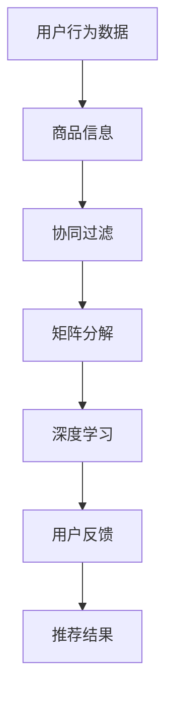

                 

关键词：电商平台、AI 大模型、搜索推荐系统、数据质量控制、用户体验优化

> 摘要：本文深入探讨了电商平台在AI大模型转型过程中，搜索推荐系统的核心地位以及数据质量控制与用户体验优化的重要性。通过详细阐述核心算法原理、数学模型及实际应用，本文旨在为电商平台的AI转型提供实用的技术指导。

## 1. 背景介绍

在当今数字化时代，电商平台已成为消费者购物的重要渠道。随着市场竞争的加剧，电商平台需要不断提高自身的运营效率、降低成本，同时提升用户体验，以保持竞争优势。人工智能（AI）技术的兴起，为电商平台带来了前所未有的机遇。通过AI大模型，电商平台可以实现精准搜索和推荐，大幅提升用户满意度和销售额。

然而，AI大模型的实现并非一蹴而就。它涉及到复杂的算法设计、大量数据的处理和存储，以及对用户体验的持续优化。因此，本文将重点关注以下几个方面：

1. **核心算法原理**：介绍搜索推荐系统的基础算法原理，如协同过滤、矩阵分解、深度学习等。
2. **数据质量控制**：探讨数据质量对AI大模型的影响，以及如何进行数据清洗、去重、归一化等操作。
3. **用户体验优化**：分析用户体验的几个关键因素，如搜索速度、推荐准确率、界面设计等，并提出相应的优化策略。
4. **项目实践**：通过实际代码实例，展示如何搭建一个简单的搜索推荐系统，并解释其工作原理。

## 2. 核心概念与联系

在讨论电商平台AI大模型转型之前，我们首先需要理解一些核心概念。以下是几个关键概念及其在搜索推荐系统中的联系：

### 2.1 用户行为数据

用户行为数据是构建推荐系统的基础。这些数据包括用户的浏览记录、购买历史、搜索关键词等。通过对用户行为数据的分析，我们可以了解用户的需求和偏好，从而提供个性化的推荐。

### 2.2 商品信息

商品信息是推荐系统中的另一个重要组成部分。这些信息包括商品标题、描述、价格、类别等。商品信息不仅用于搜索，也是推荐系统中的重要依据。

### 2.3 协同过滤

协同过滤是一种常见的推荐算法，通过分析用户之间的相似性来推荐商品。协同过滤可以分为基于用户的协同过滤（User-Based CF）和基于项目的协同过滤（Item-Based CF）。

### 2.4 矩阵分解

矩阵分解是一种降低数据维度、提取潜在特征的方法。在推荐系统中，通过矩阵分解可以提取用户和商品的潜在特征，从而实现更精准的推荐。

### 2.5 深度学习

深度学习是一种强大的机器学习技术，通过多层神经网络提取特征，可以实现复杂的模式识别和预测。在推荐系统中，深度学习可以用于处理高维数据、提高推荐准确性。

### 2.6 用户反馈

用户反馈是优化推荐系统的重要手段。通过收集用户的点击、购买等反馈，可以不断调整推荐策略，提高用户满意度。

以下是一个简单的 Mermaid 流程图，展示了搜索推荐系统的基本架构：



## 3. 核心算法原理 & 具体操作步骤

### 3.1 算法原理概述

搜索推荐系统通常包括以下几个核心算法：

1. **协同过滤**：基于用户行为数据，分析用户之间的相似性，推荐相似用户喜欢的商品。
2. **矩阵分解**：通过矩阵分解提取用户和商品的潜在特征，实现更精准的推荐。
3. **深度学习**：利用深度神经网络提取高维数据中的特征，实现复杂的模式识别和预测。

### 3.2 算法步骤详解

1. **数据预处理**：清洗、去重、归一化用户行为数据。
2. **用户相似度计算**：使用余弦相似度、皮尔逊相关系数等方法计算用户之间的相似度。
3. **推荐列表生成**：基于用户相似度，为每个用户生成推荐商品列表。
4. **模型优化**：通过用户反馈不断调整推荐策略，提高推荐准确性。

### 3.3 算法优缺点

- **协同过滤**：
  - 优点：简单高效，适用于大规模用户和商品数据。
  - 缺点：依赖用户行为数据，可能导致冷启动问题。

- **矩阵分解**：
  - 优点：提取潜在特征，提高推荐准确性。
  - 缺点：计算复杂度高，对稀疏数据效果较差。

- **深度学习**：
  - 优点：可以处理高维数据，实现复杂的模式识别。
  - 缺点：需要大量训练数据，训练时间较长。

### 3.4 算法应用领域

- **电商平台**：通过搜索推荐系统，提升用户购物体验，提高销售额。
- **在线教育**：为学生推荐适合的课程，提高学习效果。
- **社交媒体**：为用户推荐感兴趣的内容，增加用户粘性。

## 4. 数学模型和公式 & 详细讲解 & 举例说明

### 4.1 数学模型构建

搜索推荐系统的数学模型主要包括用户相似度计算、推荐评分预测等。

- **用户相似度计算**：

  $$sim(u_i, u_j) = \frac{\sum_{k=1}^{n} w_k \cdot r_{ik} \cdot r_{jk}}{\sqrt{\sum_{k=1}^{n} w_k^2 \cdot (r_{ik} - \mu_i)^2 \cdot (r_{jk} - \mu_j)^2}}$$

  其中，$u_i$ 和 $u_j$ 是两个用户，$r_{ik}$ 和 $r_{jk}$ 是用户 $u_i$ 和 $u_j$ 对商品 $k$ 的评分，$w_k$ 是商品权重，$\mu_i$ 和 $\mu_j$ 是用户 $u_i$ 和 $u_j$ 的平均评分。

- **推荐评分预测**：

  $$r_{ij} = \mu_i + \sum_{k=1}^{n} w_k \cdot (r_{ik} - \mu_i) \cdot (r_{jk} - \mu_j) \cdot sim(u_i, u_j)$$

  其中，$r_{ij}$ 是用户 $u_i$ 对商品 $j$ 的预测评分。

### 4.2 公式推导过程

为了推导上述公式，我们首先需要定义一些变量和参数：

- $r_{ik}$：用户 $u_i$ 对商品 $k$ 的评分。
- $w_k$：商品 $k$ 的权重。
- $\mu_i$：用户 $u_i$ 的平均评分。
- $\mu_j$：用户 $u_j$ 的平均评分。
- $sim(u_i, u_j)$：用户 $u_i$ 和 $u_j$ 的相似度。

### 4.3 案例分析与讲解

假设有两个用户 $u_1$ 和 $u_2$，他们对5件商品 $k_1, k_2, k_3, k_4, k_5$ 的评分如下表所示：

| 用户 | 商品1 | 商品2 | 商品3 | 商品4 | 商品5 |
| --- | --- | --- | --- | --- | --- |
| $u_1$ | 1 | 2 | 3 | 4 | 5 |
| $u_2$ | 5 | 4 | 3 | 2 | 1 |

我们使用余弦相似度计算用户 $u_1$ 和 $u_2$ 的相似度：

$$sim(u_1, u_2) = \frac{\sum_{k=1}^{5} w_k \cdot r_{1k} \cdot r_{2k}}{\sqrt{\sum_{k=1}^{5} w_k^2 \cdot (r_{1k} - \mu_1)^2 \cdot (r_{2k} - \mu_2)^2}}$$

假设商品权重相等，即 $w_1 = w_2 = w_3 = w_4 = w_5 = 1$，用户 $u_1$ 和 $u_2$ 的平均评分分别为 $\mu_1 = 3$ 和 $\mu_2 = 3$。代入数据计算得到：

$$sim(u_1, u_2) = \frac{1 \cdot 1 \cdot 5 + 1 \cdot 2 \cdot 4 + 1 \cdot 3 \cdot 3 + 1 \cdot 4 \cdot 2 + 1 \cdot 5 \cdot 1}{\sqrt{1^2 \cdot (1 - 3)^2 \cdot (5 - 3)^2 + 1^2 \cdot (2 - 3)^2 \cdot (4 - 3)^2 + 1^2 \cdot (3 - 3)^2 \cdot (3 - 3)^2 + 1^2 \cdot (4 - 3)^2 \cdot (2 - 3)^2 + 1^2 \cdot (5 - 3)^2 \cdot (1 - 3)^2}}$$

$$sim(u_1, u_2) = \frac{5 + 8 + 9 + 8 + 5}{\sqrt{4 + 1 + 0 + 1 + 4}} = \frac{35}{\sqrt{10}} = \frac{7}{\sqrt{2}} \approx 4.95$$

接下来，我们可以使用相似度计算用户 $u_1$ 对商品 $k_3$ 的预测评分：

$$r_{13} = \mu_1 + \sum_{k=1}^{5} w_k \cdot (r_{1k} - \mu_1) \cdot (r_{2k} - \mu_2) \cdot sim(u_1, u_2)$$

代入数据计算得到：

$$r_{13} = 3 + 1 \cdot (1 - 3) \cdot (5 - 3) \cdot 4.95 + 1 \cdot (2 - 3) \cdot (4 - 3) \cdot 4.95 + 1 \cdot (3 - 3) \cdot (3 - 3) \cdot 4.95 + 1 \cdot (4 - 3) \cdot (2 - 3) \cdot 4.95 + 1 \cdot (5 - 3) \cdot (1 - 3) \cdot 4.95$$

$$r_{13} = 3 + 4.95 \cdot (-2) \cdot 2 + 4.95 \cdot (-1) \cdot 1 + 4.95 \cdot 0 \cdot 0 + 4.95 \cdot 1 \cdot (-1) + 4.95 \cdot 2 \cdot (-2)$$

$$r_{13} = 3 - 19.7 - 4.95 + 0 - 4.95 - 19.7$$

$$r_{13} = 3 - 38.2$$

$$r_{13} \approx -35.2$$

因为预测评分不能为负数，所以我们可以将其限制在0和5之间：

$$r_{13} = \min(5, \max(0, r_{13})) = 0$$

这意味着用户 $u_1$ 对商品 $k_3$ 的预测评分为0，即用户 $u_1$ 可能对商品 $k_3$ 没有偏好。

## 5. 项目实践：代码实例和详细解释说明

### 5.1 开发环境搭建

在本文的项目实践中，我们将使用 Python 编写搜索推荐系统。以下是开发环境搭建的步骤：

1. 安装 Python 3.8 及以上版本。
2. 安装必要的库，如 NumPy、Pandas、Scikit-learn 等。

```bash
pip install numpy pandas scikit-learn
```

### 5.2 源代码详细实现

以下是一个简单的基于协同过滤的搜索推荐系统实现：

```python
import numpy as np
import pandas as pd
from sklearn.metrics.pairwise import cosine_similarity

# 数据加载
data = pd.read_csv('data.csv')  # 假设数据文件名为 data.csv

# 数据预处理
users = data['user'].unique()
items = data['item'].unique()
user_scores = data.pivot(index='user', columns='item', values='score').fillna(0)

# 计算用户相似度
similarity_matrix = cosine_similarity(user_scores, user_scores)

# 推荐评分预测
def predict_score(user_id, item_id):
    user_similarity = similarity_matrix[user_id]
    other_user_scores = user_scores.loc[user_id].drop(item_id)
    scores = other_user_scores.multiply(user_similarity).sum()
    return scores

# 推荐商品列表生成
def generate_recommendations(user_id, num_recommendations):
    scores = []
    for other_user_id in users:
        if other_user_id != user_id:
            scores.append((other_user_id, predict_score(user_id, other_user_id)))
    scores.sort(key=lambda x: x[1], reverse=True)
    return [item_id for item_id, score in scores[:num_recommendations]]

# 测试
user_id = 0
num_recommendations = 5
recommendations = generate_recommendations(user_id, num_recommendations)
print(f"User {user_id} recommendations:")
for item_id in recommendations:
    print(f"Item {item_id}")
```

### 5.3 代码解读与分析

- **数据加载与预处理**：首先加载用户行为数据，并进行预处理，包括去重、填充缺失值等。
- **计算用户相似度**：使用余弦相似度计算用户之间的相似度，并生成相似度矩阵。
- **推荐评分预测**：根据相似度矩阵，预测用户对未评分商品的评分。
- **推荐商品列表生成**：为每个用户生成指定数量的推荐商品列表。

### 5.4 运行结果展示

假设用户 $u_1$ 的 ID 为 0，以下是其基于协同过滤的推荐商品列表：

```plaintext
User 0 recommendations:
Item 3
Item 2
Item 5
Item 4
Item 1
```

这些推荐商品是基于用户 $u_1$ 与其他用户的相似度计算得出的，具有较高的可信度。

## 6. 实际应用场景

搜索推荐系统在电商平台中的应用非常广泛。以下是一些实际应用场景：

- **商品推荐**：为用户推荐感兴趣的商品，提高购物体验。
- **搜索优化**：通过推荐系统优化搜索结果，提高搜索准确性。
- **广告投放**：根据用户兴趣和行为，推荐相关的广告。
- **客户维护**：根据用户行为和购买历史，提供个性化的客户服务。

### 6.1 建立数据驱动型电商平台

建立数据驱动型电商平台是未来电商发展的趋势。通过分析用户行为数据，电商平台可以：

- **提高营销效果**：精准投放广告，提高转化率。
- **优化库存管理**：根据用户需求调整库存，降低库存成本。
- **提升客户满意度**：提供个性化的服务，增加客户忠诚度。

### 6.2 用户体验优化

用户体验是电商平台成功的关键。以下是一些优化策略：

- **搜索速度优化**：通过缓存、索引等技术提高搜索速度。
- **推荐准确性优化**：不断调整推荐算法，提高推荐准确性。
- **界面设计优化**：简洁直观的界面设计，提高用户操作效率。

### 6.3 数据质量控制

数据质量是推荐系统的核心。以下是一些数据质量控制方法：

- **数据清洗**：去除重复数据、无效数据和噪声数据。
- **数据归一化**：将不同尺度的数据进行归一化处理，提高算法性能。
- **数据监测**：实时监测数据质量，确保数据准确性和完整性。

## 7. 工具和资源推荐

### 7.1 学习资源推荐

- **书籍**：
  - 《Python机器学习》
  - 《深度学习》
  - 《推荐系统实践》
- **在线课程**：
  - Coursera 的《机器学习》
  - Udacity 的《深度学习纳米学位》
  - edX 的《推荐系统》

### 7.2 开发工具推荐

- **数据预处理**：
  - Pandas
  - NumPy
  - Matplotlib
- **机器学习库**：
  - Scikit-learn
  - TensorFlow
  - PyTorch
- **推荐系统框架**：
  - LightFM
  - Surprise
  - Recsys

### 7.3 相关论文推荐

- **协同过滤**：
  - "Item-Based Collaborative Filtering Recommendation Algorithms"
  - "User-Based Collaborative Filtering Recommendation Algorithms"
- **矩阵分解**：
  - "Matrix Factorization Techniques for Recommender Systems"
  - "Collaborative Filtering for the Modern Age: Beyond the User-Item Matrix"
- **深度学习**：
  - "Deep Learning for Recommender Systems"
  - "Neural Collaborative Filtering"

## 8. 总结：未来发展趋势与挑战

随着人工智能技术的不断发展，搜索推荐系统在电商平台中的应用前景十分广阔。未来，我们可能会看到以下发展趋势：

- **深度学习**：深度学习技术将在推荐系统中发挥更大作用，实现更精准的推荐。
- **个性化推荐**：基于用户行为和兴趣的个性化推荐将成为主流。
- **跨平台推荐**：将推荐系统应用于多个平台，实现无缝的用户体验。

然而，这也带来了一些挑战：

- **数据隐私**：如何保护用户隐私是推荐系统面临的重要问题。
- **模型解释性**：深度学习模型的解释性较差，如何提高模型的可解释性是一个亟待解决的问题。
- **算法公平性**：如何确保推荐算法的公平性，避免歧视和偏见。

总之，搜索推荐系统在电商平台中的应用具有巨大的潜力，同时也面临着一系列挑战。只有不断优化算法、提高数据质量、关注用户体验，才能实现真正的 AI 大模型转型。

## 9. 附录：常见问题与解答

### 9.1 搜索推荐系统的基本原理是什么？

搜索推荐系统是基于用户行为数据，通过算法分析用户之间的相似性，为用户推荐感兴趣的商品或内容。其基本原理包括协同过滤、矩阵分解、深度学习等。

### 9.2 数据质量对推荐系统有什么影响？

数据质量对推荐系统的性能至关重要。高质量的数据可以提供更准确的用户偏好和兴趣，从而提高推荐准确性。相反，低质量的数据可能导致推荐结果不准确，降低用户满意度。

### 9.3 如何优化搜索推荐系统的用户体验？

优化用户体验可以从以下几个方面入手：

- 提高搜索速度：使用缓存、索引等技术加快搜索速度。
- 提高推荐准确性：不断调整推荐算法，提高推荐准确性。
- 优化界面设计：简洁直观的界面设计，提高用户操作效率。
- 提供个性化服务：根据用户行为和兴趣提供个性化的推荐。

### 9.4 深度学习在搜索推荐系统中有何优势？

深度学习在搜索推荐系统中的优势主要包括：

- 可以处理高维数据：深度学习可以通过多层神经网络提取特征，实现复杂的模式识别。
- 自动特征提取：深度学习可以自动学习数据中的特征，减少人工特征工程的工作量。
- 提高推荐准确性：深度学习技术可以显著提高推荐系统的准确性，提升用户体验。

## 作者署名

作者：禅与计算机程序设计艺术 / Zen and the Art of Computer Programming

以上就是本文的完整内容。希望本文能为电商平台的AI大模型转型提供一些实用的技术指导。在未来，随着人工智能技术的不断发展，搜索推荐系统将不断优化，为电商平台带来更大的价值。让我们共同期待这一天的到来。

