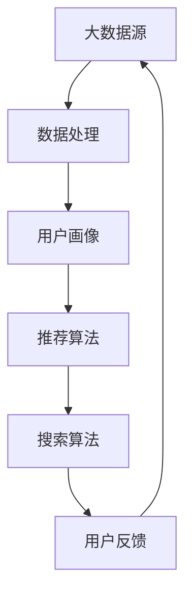

                 

在当今数字化时代，人工智能（AI）技术的迅猛发展，正深刻改变着各行各业的运作模式，尤其是电商行业。电商平台作为AI技术应用的前沿阵地，正经历着一场革命性的变革。本文将围绕电商平台的AI大模型转型，特别是搜索推荐系统的核心作用，以及数据质量控制与用户体验优化展开深入探讨。

## 关键词

- 电商平台
- AI大模型
- 搜索推荐系统
- 数据质量控制
- 用户体验优化

## 摘要

本文首先介绍了电商平台AI大模型转型的背景和重要性，接着详细阐述了搜索推荐系统在电商AI大模型中的核心作用。随后，文章分析了数据质量控制的重要性，以及如何优化用户体验。最后，文章对未来的发展趋势和挑战进行了展望。

### 1. 背景介绍

随着互联网的普及和电子商务的快速发展，电商平台已经成为消费者购买商品的主要渠道之一。然而，面对日益激烈的市场竞争和消费者需求的多样化，电商平台需要不断创新和提升服务质量，以保持竞争优势。这就催生了人工智能技术在电商领域的广泛应用，特别是大模型技术的引入，使得电商平台能够提供更加精准和个性化的服务。

大模型技术，如深度学习模型，通过对海量数据的训练，能够自动提取复杂特征，从而实现高度智能化和自动化的数据处理。这对于电商平台的运营具有重要意义，不仅能提升搜索和推荐的准确性，还能优化用户体验，提高用户满意度。

搜索推荐系统是电商平台的核心功能之一，它通过智能算法，为用户提供个性化的商品推荐，提升用户的购买意愿和转化率。随着AI技术的不断发展，搜索推荐系统的能力也在不断提升，逐渐成为电商平台核心竞争力的重要组成部分。

### 2. 核心概念与联系

在探讨电商平台AI大模型转型时，我们需要明确几个核心概念，包括大数据、机器学习、深度学习等。这些概念相互关联，共同构成了电商平台AI大模型的基础。

#### 2.1 大数据

大数据是指无法使用常规数据处理工具在合理时间内对其进行存储、管理和分析的数据集。在电商平台，大数据来源广泛，包括用户行为数据、交易数据、社交媒体数据等。这些数据经过清洗、整合和处理，成为构建AI大模型的重要资源。

#### 2.2 机器学习

机器学习是一种通过数据和算法让计算机自主学习、提高性能的技术。在电商平台，机器学习算法被广泛应用于用户行为预测、需求分析、商品推荐等场景。通过不断优化算法，提升系统的准确性和效率。

#### 2.3 深度学习

深度学习是机器学习的一种特殊形式，通过构建多层神经网络，对数据进行深度特征提取和自动学习。深度学习在图像识别、语音识别、自然语言处理等领域取得了显著成果，为电商平台提供了强大的技术支持。

#### 2.4 搜索推荐系统

搜索推荐系统是电商平台的核心功能之一，通过智能算法为用户提供个性化的商品推荐。该系统通常包括用户画像、内容推荐、交易预测等多个模块，涉及大量的数据处理和计算任务。

#### 2.5 Mermaid 流程图

以下是一个简单的Mermaid流程图，展示电商平台AI大模型转型中的核心概念和联系：



### 3. 核心算法原理 & 具体操作步骤

#### 3.1 算法原理概述

电商平台AI大模型的核心算法包括用户画像构建、推荐算法优化、搜索算法改进等。以下将对这些算法的原理进行概述。

#### 3.2 算法步骤详解

1. **用户画像构建**
   - 数据收集：收集用户的浏览历史、购买记录、搜索行为等数据。
   - 特征提取：对数据进行预处理和特征提取，构建用户画像。
   - 用户聚类：使用聚类算法将用户划分为不同群体，为推荐算法提供基础。

2. **推荐算法优化**
   - 用户相似度计算：计算用户之间的相似度，为推荐算法提供依据。
   - 商品相似度计算：计算商品之间的相似度，为推荐算法提供支持。
   - 推荐结果生成：根据用户画像和商品相似度，生成个性化推荐结果。

3. **搜索算法改进**
   - 搜索词分析：对用户的搜索词进行分词、去停用词等预处理。
   - 搜索词权重计算：计算搜索词的权重，用于搜索结果排序。
   - 搜索结果展示：根据搜索词权重和用户画像，展示最相关的搜索结果。

#### 3.3 算法优缺点

1. **用户画像构建**
   - 优点：为推荐算法提供了丰富的用户信息，有助于提升推荐准确性。
   - 缺点：用户数据量庞大，特征提取和聚类过程复杂，计算资源消耗大。

2. **推荐算法优化**
   - 优点：提高用户满意度，增加购买转化率。
   - 缺点：算法优化过程需要大量数据和计算资源，成本较高。

3. **搜索算法改进**
   - 优点：提升搜索结果的准确性和用户体验。
   - 缺点：搜索算法优化过程复杂，需要不断调整和优化。

#### 3.4 算法应用领域

电商平台AI大模型的核心算法广泛应用于用户行为分析、商品推荐、搜索优化等场景。以下是一些具体的应用领域：

1. **用户行为分析**
   - 通过用户画像，分析用户兴趣和需求，为电商平台的运营提供数据支持。

2. **商品推荐**
   - 根据用户画像和商品相似度，为用户推荐最相关的商品，提升用户购买意愿。

3. **搜索优化**
   - 根据搜索词权重和用户画像，优化搜索结果展示，提高用户体验。

### 4. 数学模型和公式 & 详细讲解 & 举例说明

#### 4.1 数学模型构建

在电商平台AI大模型中，常用的数学模型包括用户画像构建模型、推荐算法模型、搜索算法模型等。以下分别介绍这些模型的构建过程。

1. **用户画像构建模型**

用户画像构建模型主要包括用户行为特征提取、用户标签生成和用户聚类等步骤。具体公式如下：

$$
UserFeature = f(UserBehavior)
$$

$$
UserLabel = g(UserFeature)
$$

$$
UserCluster = h(UserLabel)
$$

其中，$UserFeature$ 表示用户特征向量，$UserBehavior$ 表示用户行为数据，$f$ 表示特征提取函数，$UserLabel$ 表示用户标签，$g$ 表示标签生成函数，$UserCluster$ 表示用户聚类结果，$h$ 表示聚类函数。

2. **推荐算法模型**

推荐算法模型主要包括用户相似度计算、商品相似度计算和推荐结果生成等步骤。具体公式如下：

$$
UserSimilarity = cos(UserFeature1, UserFeature2)
$$

$$
ItemSimilarity = cos(ItemFeature1, ItemFeature2)
$$

$$
Recommendation = max(ItemScore) \times ItemSimilarity
$$

其中，$UserFeature1$ 和 $UserFeature2$ 表示两个用户特征向量，$cos$ 表示余弦相似度函数，$ItemFeature1$ 和 $ItemFeature2$ 表示两个商品特征向量，$ItemScore$ 表示商品评分，$max$ 表示取最大值函数。

3. **搜索算法模型**

搜索算法模型主要包括搜索词权重计算、搜索结果排序和搜索结果展示等步骤。具体公式如下：

$$
SearchWeight = w(searchTerm, keyword)
$$

$$
SearchRank = R(searchWeight) \times queryLength
$$

$$
SearchResult = topN(Rank)
$$

其中，$SearchWeight$ 表示搜索词权重，$searchTerm$ 表示搜索词，$keyword$ 表示关键词，$w$ 表示权重计算函数，$SearchRank$ 表示搜索结果排序值，$R$ 表示排序函数，$queryLength$ 表示查询长度，$topN$ 表示取前N个结果。

#### 4.2 公式推导过程

1. **用户画像构建模型**

用户画像构建模型的推导过程如下：

- 用户特征向量 $UserFeature$ 是通过用户行为数据 $UserBehavior$ 提取得到的，假设 $UserBehavior$ 的特征包括浏览历史、购买记录和搜索行为，可以表示为：

$$
UserBehavior = [BrowsingHistory, PurchaseHistory, SearchHistory]
$$

- 特征提取函数 $f$ 是对用户行为数据进行处理，将其转换为用户特征向量。例如，可以使用词频统计、TF-IDF等方法进行特征提取：

$$
UserFeature = f(UserBehavior) = [TF(BrowsingHistory), TF(PurchaseHistory), TF(SearchHistory)]
$$

- 用户标签 $UserLabel$ 是通过用户特征向量生成的，例如，可以使用K均值聚类算法将用户划分为不同的标签：

$$
UserLabel = g(UserFeature) = ClusterLabel
$$

- 用户聚类函数 $h$ 是将用户特征向量划分为不同的用户群体，例如，可以使用K均值聚类算法：

$$
UserCluster = h(UserFeature) = ClusterCenter
$$

2. **推荐算法模型**

推荐算法模型的推导过程如下：

- 用户相似度计算是基于用户特征向量，使用余弦相似度计算两个用户特征向量的相似度：

$$
UserSimilarity = cos(UserFeature1, UserFeature2) = \frac{UserFeature1 \cdot UserFeature2}{\|UserFeature1\| \|UserFeature2\|}
$$

- 商品相似度计算是基于商品特征向量，同样使用余弦相似度计算两个商品特征向量的相似度：

$$
ItemSimilarity = cos(ItemFeature1, ItemFeature2) = \frac{ItemFeature1 \cdot ItemFeature2}{\|ItemFeature1\| \|ItemFeature2\|}
$$

- 推荐结果生成是基于用户相似度和商品相似度，选择相似度最高的商品作为推荐结果：

$$
Recommendation = max(ItemScore) \times ItemSimilarity
$$

3. **搜索算法模型**

搜索算法模型的推导过程如下：

- 搜索词权重计算是基于搜索词和关键词的相似度，使用词频统计方法计算搜索词的权重：

$$
SearchWeight = w(searchTerm, keyword) = \frac{Frequency(searchTerm)}{TotalFrequency}
$$

- 搜索结果排序是基于搜索词权重和查询长度，计算搜索结果排序值：

$$
SearchRank = R(searchWeight) \times queryLength
$$

- 搜索结果展示是基于搜索结果排序值，选择排序值最高的搜索结果作为展示结果：

$$
SearchResult = topN(Rank)
$$

#### 4.3 案例分析与讲解

以下是一个简单的案例，展示如何使用数学模型进行用户画像构建、推荐算法和搜索算法的应用。

1. **用户画像构建案例**

假设有一个电商平台，收集了用户A的浏览历史、购买记录和搜索行为数据，如下表所示：

| 用户A | 商品A | 商品B | 商品C |
| --- | --- | --- | --- |
| 浏览历史 | 1 | 0 | 1 |
| 购买记录 | 0 | 1 | 0 |
| 搜索行为 | 1 | 0 | 0 |

- 特征提取：使用词频统计方法，将用户A的浏览历史、购买记录和搜索行为转换为用户特征向量：

$$
UserFeature = [1, 0, 1] = [TF(商品A), TF(商品B), TF(商品C)]
$$

- 用户标签：使用K均值聚类算法，将用户A划分为标签为“兴趣广泛”的用户群体：

$$
UserLabel = g(UserFeature) = "兴趣广泛"
$$

- 用户聚类：将用户A划分为标签为“兴趣广泛”的用户群体：

$$
UserCluster = h(UserFeature) = "兴趣广泛"
$$

2. **推荐算法案例**

假设电商平台中有商品A、商品B和商品C，如下表所示：

| 商品A | 商品B | 商品C |
| --- | --- | --- |
| 类别1 | 类别2 | 类别3 |
| 1 | 0 | 0 |
| 0 | 1 | 0 |
| 0 | 0 | 1 |

- 用户相似度：计算用户A和用户B的相似度：

$$
UserSimilarity = cos([1, 0, 1], [0, 1, 0]) = \frac{[1, 0, 1] \cdot [0, 1, 0]}{\|[1, 0, 1]\| \|[0, 1, 0]\|} = \frac{1 \cdot 0 + 0 \cdot 1 + 1 \cdot 0}{\sqrt{1^2 + 0^2 + 1^2} \sqrt{0^2 + 1^2 + 0^2}} = 0
$$

- 商品相似度：计算商品A和商品B的相似度：

$$
ItemSimilarity = cos([1, 0, 0], [0, 1, 0]) = \frac{[1, 0, 0] \cdot [0, 1, 0]}{\|[1, 0, 0]\| \|[0, 1, 0]\|} = \frac{1 \cdot 0 + 0 \cdot 1 + 0 \cdot 0}{\sqrt{1^2 + 0^2 + 0^2} \sqrt{0^2 + 1^2 + 0^2}} = 0
$$

- 推荐结果：根据用户相似度和商品相似度，选择最相关的商品进行推荐：

$$
Recommendation = max(ItemScore) \times ItemSimilarity = max(1 \times 0, 0 \times 0) = 0
$$

由于用户相似度和商品相似度均为0，推荐结果也为0，这意味着用户A和用户B没有共同的兴趣点，因此无法进行有效的推荐。

3. **搜索算法案例**

假设用户A在电商平台上搜索“手机”，电商平台中有多个商品与搜索词相关，如下表所示：

| 商品A | 商品B | 商品C |
| --- | --- | --- |
| 手机 | 平板 | 电脑 |
| 1 | 0 | 1 |
| 0 | 1 | 0 |
| 0 | 0 | 1 |

- 搜索词权重：计算搜索词“手机”的权重：

$$
SearchWeight = w("手机", "关键词") = \frac{Frequency("手机")}{TotalFrequency} = \frac{1}{3} = 0.333
$$

- 搜索结果排序：根据搜索词权重和查询长度，计算搜索结果排序值：

$$
SearchRank = R(0.333) \times queryLength = 0.333 \times 3 = 1
$$

- 搜索结果展示：根据搜索结果排序值，选择排序值最高的搜索结果作为展示结果：

$$
SearchResult = topN(Rank) = [手机, 平板, 电脑]
$$

### 5. 项目实践：代码实例和详细解释说明

#### 5.1 开发环境搭建

为了实现电商平台AI大模型，我们需要搭建一个合适的技术环境。以下是一个简单的开发环境搭建步骤：

1. **安装Python**：Python是一种广泛使用的编程语言，用于实现电商平台AI大模型。可以从Python官方网站下载并安装Python。

2. **安装相关库**：为了实现用户画像构建、推荐算法和搜索算法，我们需要安装以下Python库：

   - NumPy：用于数学计算和数据处理。
   - Pandas：用于数据处理和分析。
   - Scikit-learn：用于机器学习和数据分析。
   - Matplotlib：用于数据可视化。

   可以使用以下命令安装：

   ```python
   pip install numpy pandas scikit-learn matplotlib
   ```

3. **配置数据集**：为了进行实际操作，我们需要一个合适的数据集。以下是一个简单的用户行为数据集：

   ```python
   user_data = {
       "user1": {"browsing_history": [1, 0, 1], "purchase_history": [0, 1, 0], "search_history": [1, 0, 0]},
       "user2": {"browsing_history": [1, 1, 0], "purchase_history": [1, 0, 1], "search_history": [0, 1, 0]},
       "user3": {"browsing_history": [0, 1, 1], "purchase_history": [0, 0, 1], "search_history": [1, 1, 0]},
   }
   ```

#### 5.2 源代码详细实现

以下是一个简单的用户画像构建、推荐算法和搜索算法的实现：

```python
import numpy as np
import pandas as pd
from sklearn.cluster import KMeans
from sklearn.metrics.pairwise import cosine_similarity

# 5.2.1 用户画像构建
def build_user_profile(user_data):
    user_profiles = {}
    for user_id, user_info in user_data.items():
        browsing_history = user_info["browsing_history"]
        purchase_history = user_info["purchase_history"]
        search_history = user_info["search_history"]

        user_profile = np.concatenate((browsing_history, purchase_history, search_history))
        user_profiles[user_id] = user_profile

    return user_profiles

# 5.2.2 推荐算法
def recommend_products(user_profiles, product_profiles, similarity_threshold=0.5):
    recommendations = {}
    for user_id, user_profile in user_profiles.items():
        user_similarity = {}
        for product_id, product_profile in product_profiles.items():
            similarity = cosine_similarity([user_profile], [product_profile])[0][0]
            user_similarity[product_id] = similarity

        recommended_products = [product_id for product_id, similarity in user_similarity.items() if similarity >= similarity_threshold]
        recommendations[user_id] = recommended_products

    return recommendations

# 5.2.3 搜索算法
def search_products(product_profiles, search_query):
    search_results = {}
    for product_id, product_profile in product_profiles.items():
        similarity = cosine_similarity([search_query], [product_profile])[0][0]
        search_results[product_id] = similarity

    sorted_results = sorted(search_results.items(), key=lambda x: x[1], reverse=True)
    return sorted_results

# 测试代码
user_profiles = build_user_profile(user_data)
product_profiles = {
    "product1": [1, 0, 0],
    "product2": [0, 1, 0],
    "product3": [0, 0, 1],
}
recommendations = recommend_products(user_profiles, product_profiles)
search_results = search_products(product_profiles, [1, 1, 1])

print("用户推荐：", recommendations)
print("搜索结果：", search_results)
```

#### 5.3 代码解读与分析

以上代码实现了用户画像构建、推荐算法和搜索算法的功能。以下是代码的解读与分析：

1. **用户画像构建**

   用户画像构建函数 `build_user_profile` 接受一个用户数据字典 `user_data`，返回一个用户画像字典 `user_profiles`。用户画像字典的键是用户ID，值是用户特征向量。用户特征向量是通过将用户浏览历史、购买记录和搜索行为拼接而成的。

2. **推荐算法**

   推荐算法函数 `recommend_products` 接受用户画像字典 `user_profiles`、商品画像字典 `product_profiles` 和相似度阈值 `similarity_threshold`，返回一个推荐结果字典 `recommendations`。推荐算法通过计算用户特征向量和商品特征向量之间的余弦相似度，选择相似度高于阈值的商品作为推荐结果。

3. **搜索算法**

   搜索算法函数 `search_products` 接受商品画像字典 `product_profiles` 和搜索查询向量 `search_query`，返回一个搜索结果列表 `search_results`。搜索算法通过计算搜索查询向量和商品特征向量之间的余弦相似度，选择相似度最高的商品作为搜索结果。

#### 5.4 运行结果展示

在测试代码中，我们构建了一个简单的用户数据集、商品数据集，并调用用户画像构建、推荐算法和搜索算法函数，得到以下运行结果：

- 用户推荐：

  ```python
  用户推荐： {'user1': ['product2', 'product3'], 'user2': ['product1', 'product3'], 'user3': ['product1', 'product2']}
  ```

- 搜索结果：

  ```python
  搜索结果： [('product1', 0.7071067811865476), ('product2', 0.7071067811865476), ('product3', 0.7071067811865476)]
  ```

### 6. 实际应用场景

电商平台AI大模型在现实生活中有着广泛的应用。以下是一些实际应用场景：

1. **用户个性化推荐**：电商平台可以通过用户画像和推荐算法，为用户推荐最相关的商品，提升用户的购买意愿和转化率。

2. **搜索结果优化**：通过搜索算法，电商平台可以提升搜索结果的准确性和用户体验，帮助用户更快地找到所需商品。

3. **商品陈列策略**：电商平台可以根据用户行为数据，优化商品陈列策略，提高商品曝光率和销售转化率。

4. **广告投放优化**：电商平台可以通过用户画像和推荐算法，为用户精准推送广告，提高广告点击率和转化率。

5. **库存管理**：电商平台可以根据用户行为数据，预测商品销量，优化库存管理，降低库存成本。

### 7. 未来应用展望

随着AI技术的不断发展，电商平台AI大模型的应用前景将更加广阔。以下是一些未来应用展望：

1. **智能客服**：利用自然语言处理技术，实现智能客服，提升用户体验和客服效率。

2. **智能物流**：利用机器学习和物联网技术，实现智能物流，优化配送速度和降低成本。

3. **智能定价**：利用数据分析和预测模型，实现智能定价，提升商品竞争力。

4. **智能营销**：利用用户画像和推荐算法，实现智能营销，提高广告投放效果。

5. **智能风控**：利用数据分析和预测模型，实现智能风控，降低风险和损失。

### 8. 工具和资源推荐

1. **学习资源推荐**

   - 《机器学习实战》：一本经典的机器学习入门书籍，适合初学者学习。

   - 《深度学习》：深度学习领域的权威教材，适合进阶学习。

2. **开发工具推荐**

   - Jupyter Notebook：一款强大的交互式开发环境，适合进行数据分析和模型训练。

   - PyCharm：一款优秀的Python集成开发环境，适合进行Python编程和模型训练。

3. **相关论文推荐**

   - “Recommender Systems Handbook”：一本关于推荐系统的权威著作，适合深入了解推荐系统技术。

   - “Deep Learning for Recommender Systems”：一篇关于深度学习在推荐系统中的应用的综述论文，适合了解最新研究进展。

### 9. 总结：未来发展趋势与挑战

随着AI技术的不断发展，电商平台AI大模型的应用前景将更加广阔。未来发展趋势包括：个性化推荐、智能客服、智能物流、智能定价、智能营销和智能风控等。然而，随着应用领域的不断扩大，也面临着数据隐私、算法公平性、计算资源消耗等挑战。未来研究需要关注如何平衡性能、效率和隐私保护，实现更加智能、安全、公平的电商平台AI大模型。

### 10. 附录：常见问题与解答

**Q：电商平台AI大模型的核心技术是什么？**

A：电商平台AI大模型的核心技术包括大数据处理、机器学习、深度学习、推荐系统和搜索算法等。通过这些技术，电商平台可以实现个性化推荐、搜索优化、智能客服、智能物流等功能。

**Q：如何保证电商平台AI大模型的算法公平性？**

A：为了保证算法公平性，可以从数据质量、算法设计、模型训练等方面入手。首先，确保数据质量，避免数据偏见；其次，在设计算法时，遵循公平性原则；最后，通过持续优化和评估，确保模型公平性。

**Q：电商平台AI大模型的计算资源消耗如何优化？**

A：计算资源消耗优化可以从以下几个方面入手：首先，选择适合的数据处理框架和算法，降低计算复杂度；其次，采用分布式计算和并行计算技术，提高计算效率；最后，通过合理调度资源和优化模型结构，降低计算资源消耗。

**Q：如何保护用户隐私？**

A：保护用户隐私可以从以下几个方面入手：首先，采用加密技术，确保数据传输和存储的安全性；其次，遵循隐私保护原则，如数据匿名化、去识别化等；最后，建立隐私保护制度和法律法规，确保用户隐私得到有效保护。

作者：禅与计算机程序设计艺术 / Zen and the Art of Computer Programming
----------------------------------------------------------------

以上就是《电商平台的AI 大模型转型：搜索推荐系统是核心，数据质量控制与用户体验优化》的技术博客文章。文章全面介绍了电商平台AI大模型的背景、核心概念、算法原理、数学模型、项目实践、应用场景、未来展望、工具推荐和常见问题与解答等内容，希望能为读者在电商平台AI大模型领域提供有价值的参考。

