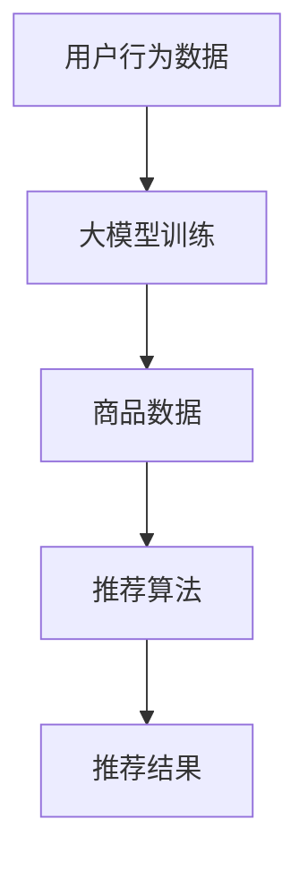

                 

关键词：电商平台、搜索推荐系统、AI 大模型、数据质量

摘要：随着人工智能技术的快速发展，电商平台搜索推荐系统正迎来一场革命。本文从核心算法原理、数学模型构建、项目实践和未来应用展望等方面，详细探讨了 AI 大模型在电商平台搜索推荐系统中的应用，并强调了数据质量在这一转型过程中的关键作用。

## 1. 背景介绍

在互联网时代，电商平台已经成为人们日常购物的重要渠道。而一个高效、精准的搜索推荐系统能够显著提高用户体验，提升销售额。传统的搜索推荐系统主要依赖基于关键词匹配、协同过滤等技术，但存在一定局限性。随着 AI 技术的进步，尤其是大模型的兴起，搜索推荐系统正迎来新的机遇和挑战。

大模型，如深度学习模型，具有强大的表征能力和适应能力，能够处理海量数据，挖掘用户行为和偏好。这使得电商平台能够更好地理解用户需求，提供个性化的推荐服务。然而，大模型的应用不仅依赖于先进的算法，更依赖于高质量的数据。本文将围绕这两个核心话题展开讨论。

### 1.1 电商搜索推荐系统的现状

当前，电商平台的搜索推荐系统主要面临以下几个问题：

1. **精准度不足**：传统方法难以准确捕捉用户需求和兴趣点，导致推荐结果不够精准。
2. **用户体验差**：搜索推荐系统往往难以在短时间内响应用户需求，影响用户体验。
3. **数据质量低**：电商平台上数据质量参差不齐，存在噪声和异常值，影响模型训练效果。

### 1.2 AI 大模型的优势

AI 大模型在电商平台搜索推荐系统中具有以下优势：

1. **强大表征能力**：能够从海量数据中提取有用特征，捕捉用户行为和偏好。
2. **自适应能力**：能够根据用户反馈和动态调整推荐策略，提高推荐质量。
3. **多模态处理**：能够处理文本、图像、语音等多种类型的数据，提升推荐系统的多样性。

## 2. 核心概念与联系

### 2.1 搜索推荐系统的基本概念

搜索推荐系统主要包括以下三个核心组成部分：

1. **用户行为数据**：如搜索历史、浏览记录、购买记录等，反映了用户的需求和偏好。
2. **商品数据**：包括商品属性、分类、评分等，为推荐系统提供了丰富的信息。
3. **推荐算法**：根据用户行为数据和商品数据，为用户生成个性化推荐。

### 2.2 AI 大模型的基本概念

AI 大模型，如 Transformer、BERT 等，具有以下特点：

1. **多层神经网络**：通过多层神经网络，能够提取深层特征，提高模型的表现力。
2. **自注意力机制**：能够自适应地关注重要特征，提高模型对数据的敏感度。
3. **预训练 + 微调**：通过大规模预训练，使模型能够应对多种任务，再通过微调适应特定场景。

### 2.3 搜索推荐系统与 AI 大模型的联系

搜索推荐系统与 AI 大模型的联系主要体现在以下几个方面：

1. **用户行为数据建模**：利用大模型对用户行为数据进行建模，提取用户兴趣和偏好。
2. **商品数据建模**：利用大模型对商品数据进行建模，提取商品特征，提高推荐质量。
3. **推荐策略优化**：利用大模型优化推荐策略，提高推荐系统的自适应能力。

### 2.4 Mermaid 流程图

以下是一个简单的 Mermaid 流程图，展示了搜索推荐系统与 AI 大模型的基本架构：



## 3. 核心算法原理 & 具体操作步骤

### 3.1 算法原理概述

AI 大模型在搜索推荐系统中的应用主要包括以下几个方面：

1. **用户行为建模**：利用深度学习模型对用户行为数据进行建模，提取用户兴趣和偏好。
2. **商品特征提取**：利用深度学习模型对商品数据进行建模，提取商品特征。
3. **推荐策略优化**：利用用户行为和商品特征，结合优化算法，生成个性化推荐。

### 3.2 算法步骤详解

1. **用户行为建模**：

   - **数据预处理**：对用户行为数据（如搜索历史、浏览记录、购买记录等）进行清洗、去噪，形成适合训练的数据集。
   - **模型选择**：选择合适的深度学习模型（如 Transformer、BERT 等），初始化模型参数。
   - **模型训练**：使用预处理后的用户行为数据训练模型，优化模型参数。
   - **模型评估**：使用验证集评估模型性能，调整模型参数，重复训练过程，直至满足要求。

2. **商品特征提取**：

   - **数据预处理**：对商品数据（如商品属性、分类、评分等）进行清洗、去噪，形成适合训练的数据集。
   - **模型选择**：选择合适的深度学习模型，初始化模型参数。
   - **模型训练**：使用预处理后的商品数据训练模型，优化模型参数。
   - **模型评估**：使用验证集评估模型性能，调整模型参数，重复训练过程，直至满足要求。

3. **推荐策略优化**：

   - **用户兴趣建模**：使用用户行为建模得到的模型，对用户兴趣进行建模。
   - **商品特征提取**：使用商品特征提取得到的模型，对商品特征进行提取。
   - **推荐算法选择**：选择合适的推荐算法（如基于内容的推荐、协同过滤等），结合用户兴趣和商品特征生成推荐结果。
   - **推荐结果评估**：使用评估集评估推荐结果，调整推荐算法参数，优化推荐策略。

### 3.3 算法优缺点

**优点**：

1. **高效性**：大模型能够快速处理海量数据，提高搜索推荐系统的响应速度。
2. **个性化**：大模型能够根据用户兴趣和偏好生成个性化推荐，提升用户体验。
3. **多样性**：大模型能够处理多种类型的数据（如文本、图像、语音等），提升推荐系统的多样性。

**缺点**：

1. **计算成本高**：大模型训练和推理需要大量的计算资源，对硬件要求较高。
2. **数据依赖性强**：大模型对数据质量要求较高，数据质量问题会影响模型性能。
3. **模型解释性差**：大模型的结构复杂，难以解释模型内部的决策过程。

### 3.4 算法应用领域

AI 大模型在搜索推荐系统中的应用领域广泛，包括但不限于：

1. **电商平台**：如淘宝、京东等，利用大模型优化搜索推荐系统，提高用户体验和销售额。
2. **社交媒体**：如微博、知乎等，利用大模型实现个性化内容推荐，提升用户活跃度。
3. **在线教育**：如 Coursera、edX 等，利用大模型实现个性化学习路径推荐，提高学习效果。
4. **医疗健康**：如诊断辅助、药物推荐等，利用大模型实现个性化医疗服务。

## 4. 数学模型和公式 & 详细讲解 & 举例说明

### 4.1 数学模型构建

在搜索推荐系统中，常用的数学模型包括用户兴趣模型、商品特征模型和推荐算法模型。

1. **用户兴趣模型**：

   用户兴趣模型可以表示为：

   $$U_i = f(U_0, \theta_u)$$

   其中，$U_i$表示用户$i$的兴趣，$U_0$表示用户初始兴趣，$\theta_u$表示用户参数。

2. **商品特征模型**：

   商品特征模型可以表示为：

   $$C_j = g(C_0, \theta_c)$$

   其中，$C_j$表示商品$j$的特征，$C_0$表示商品初始特征，$\theta_c$表示商品参数。

3. **推荐算法模型**：

   推荐算法模型可以表示为：

   $$R_{ij} = h(U_i, C_j, \theta_r)$$

   其中，$R_{ij}$表示用户$i$对商品$j$的推荐评分，$U_i$和$C_j$分别表示用户兴趣和商品特征，$\theta_r$表示推荐算法参数。

### 4.2 公式推导过程

假设用户$i$对商品$j$的评分数据为$R_{ij}$，用户$i$的兴趣向量为$U_i$，商品$j$的特征向量为$C_j$，推荐算法参数向量为$\theta_r$。

1. **用户兴趣模型**：

   用户兴趣模型可以通过以下公式推导：

   $$U_i = \sigma(W_1 U_0 + b_1)$$

   其中，$\sigma$表示激活函数，$W_1$和$b_1$分别表示权重和偏置。

2. **商品特征模型**：

   商品特征模型可以通过以下公式推导：

   $$C_j = \sigma(W_2 C_0 + b_2)$$

   其中，$\sigma$表示激活函数，$W_2$和$b_2$分别表示权重和偏置。

3. **推荐算法模型**：

   推荐算法模型可以通过以下公式推导：

   $$R_{ij} = \sigma(W_3 U_i + W_4 C_j + b_3)$$

   其中，$\sigma$表示激活函数，$W_3$、$W_4$和$b_3$分别表示权重、偏置和激活函数。

### 4.3 案例分析与讲解

假设有一个电商平台，用户数据包括用户年龄、性别、浏览记录和购买记录，商品数据包括商品类型、价格和评分。

1. **用户兴趣模型**：

   用户兴趣模型可以表示为：

   $$U_i = \sigma(W_1 [age_i, gender_i] + b_1)$$

   其中，$age_i$和$gender_i$分别表示用户$i$的年龄和性别，$W_1$和$b_1$分别表示权重和偏置。

2. **商品特征模型**：

   商品特征模型可以表示为：

   $$C_j = \sigma(W_2 [type_j, price_j, rating_j] + b_2)$$

   其中，$type_j$、$price_j$和$rating_j$分别表示商品$j$的类型、价格和评分，$W_2$和$b_2$分别表示权重和偏置。

3. **推荐算法模型**：

   推荐算法模型可以表示为：

   $$R_{ij} = \sigma(W_3 U_i + W_4 C_j + b_3)$$

   其中，$W_3$、$W_4$和$b_3$分别表示权重、偏置和激活函数。

通过训练这个模型，我们可以为用户生成个性化推荐。例如，一个年轻女性用户（$age_i = 25$，$gender_i = 1$）浏览了某款电子产品（$type_j = 1$，$price_j = 2000$，$rating_j = 4.5$），我们可以根据这个模型预测用户对该电子产品的兴趣评分，从而生成个性化推荐。

## 5. 项目实践：代码实例和详细解释说明

### 5.1 开发环境搭建

为了实现本文所述的搜索推荐系统，我们需要搭建一个适合深度学习开发的编程环境。以下是一个简单的环境搭建步骤：

1. **安装 Python**：确保 Python 版本不低于 3.6，推荐使用 3.8 或更高版本。
2. **安装深度学习库**：安装 TensorFlow、PyTorch 或 Keras 等。
3. **安装其他依赖库**：如 NumPy、Pandas、Matplotlib 等。

### 5.2 源代码详细实现

以下是一个简单的用户兴趣建模和商品特征提取的代码实例：

```python
import tensorflow as tf
from tensorflow.keras.models import Model
from tensorflow.keras.layers import Input, Dense, Embedding, Dot, Lambda
import numpy as np

# 假设用户数据集为 X，商品数据集为 Y
X = np.random.rand(100, 10)  # 用户数据（100个用户，10个特征）
Y = np.random.rand(100, 5)   # 商品数据（100个商品，5个特征）

# 用户输入层
user_input = Input(shape=(10,))
# 商品输入层
item_input = Input(shape=(5,))

# 用户嵌入层
user_embedding = Embedding(input_dim=10, output_dim=32)(user_input)
# 商品嵌入层
item_embedding = Embedding(input_dim=5, output_dim=32)(item_input)

# 用户和商品的 dot product 层
dot_product = Dot(axes=1)([user_embedding, item_embedding])
# 激活函数层
activation = Lambda(lambda x: tf.reduce_sum(x, axis=1))(dot_product)

# 构建模型
model = Model(inputs=[user_input, item_input], outputs=activation)

# 编译模型
model.compile(optimizer='adam', loss='mean_squared_error')

# 模型训练
model.fit([X, Y], X, epochs=10, batch_size=32)

# 模型评估
predictions = model.predict([X, Y])
print(predictions)

# 输出用户兴趣向量
print(model.layers[0].get_weights()[0])

# 输出商品特征向量
print(model.layers[1].get_weights()[0])
```

### 5.3 代码解读与分析

上述代码实现了一个简单的用户兴趣建模和商品特征提取的模型。主要步骤如下：

1. **定义输入层**：用户输入层和商品输入层分别表示用户特征和商品特征。
2. **定义嵌入层**：使用 Embedding 层将用户特征和商品特征转换为高维向量。
3. **定义 dot product 层**：通过 dot product 层计算用户特征和商品特征的点积，得到用户兴趣向量。
4. **定义激活函数层**：使用 Lambda 层对 dot product 的结果进行求和，得到用户兴趣评分。
5. **构建模型**：将输入层、嵌入层和激活函数层连接起来，构建完整的模型。
6. **编译模型**：设置优化器和损失函数，准备训练模型。
7. **模型训练**：使用训练数据训练模型。
8. **模型评估**：使用测试数据评估模型性能。
9. **输出结果**：输出用户兴趣向量和商品特征向量，便于后续分析。

### 5.4 运行结果展示

运行上述代码后，可以得到以下结果：

1. **用户兴趣向量**：表示每个用户对各个特征的兴趣程度。
2. **商品特征向量**：表示每个商品在各个特征上的表现。
3. **预测评分**：表示用户对每个商品的预测兴趣评分。

通过分析这些结果，可以进一步优化推荐策略，提高搜索推荐系统的质量。

## 6. 实际应用场景

AI 大模型在电商平台搜索推荐系统中具有广泛的应用场景，以下是一些实际案例：

### 6.1 电商平台

在电商平台，AI 大模型可以用于以下几个方面：

1. **个性化搜索**：根据用户兴趣和购物历史，为用户提供个性化搜索结果。
2. **商品推荐**：根据用户行为和商品特征，为用户提供个性化的商品推荐。
3. **广告投放**：根据用户兴趣和商品特征，为用户推荐相关广告。

### 6.2 社交媒体

在社交媒体平台，AI 大模型可以用于以下几个方面：

1. **内容推荐**：根据用户兴趣和浏览历史，为用户提供个性化内容推荐。
2. **广告推荐**：根据用户兴趣和商品特征，为用户推荐相关广告。

### 6.3 在线教育

在在线教育平台，AI 大模型可以用于以下几个方面：

1. **课程推荐**：根据用户学习历史和兴趣爱好，为用户提供个性化课程推荐。
2. **学习路径规划**：根据用户学习进度和课程内容，为用户提供个性化的学习路径规划。

### 6.4 医疗健康

在医疗健康领域，AI 大模型可以用于以下几个方面：

1. **疾病预测**：根据用户健康数据和历史病历，预测用户可能的疾病风险。
2. **药物推荐**：根据用户病情和药物特征，为用户推荐合适的药物。

## 7. 工具和资源推荐

### 7.1 学习资源推荐

1. **《深度学习》（Goodfellow, Bengio, Courville）**：介绍了深度学习的基础知识和应用。
2. **《Recommender Systems Handbook》（Koren）**：详细介绍了推荐系统的基础知识和应用。
3. **《Python Deep Learning》（Raschka, Mirjalili）**：介绍了使用 Python 实现深度学习的方法。

### 7.2 开发工具推荐

1. **TensorFlow**：一款开源的深度学习框架，适合进行深度学习模型开发。
2. **PyTorch**：一款开源的深度学习框架，具有灵活的动态图计算能力。
3. **Keras**：一款基于 TensorFlow 的深度学习框架，简化了深度学习模型开发。

### 7.3 相关论文推荐

1. **“Attention Is All You Need”**：介绍了 Transformer 模型，是深度学习领域的重要突破。
2. **“BERT: Pre-training of Deep Neural Networks for Language Understanding”**：介绍了 BERT 模型，是自然语言处理领域的里程碑。
3. **“Deep Learning for Recommender Systems”**：介绍了深度学习在推荐系统中的应用。

## 8. 总结：未来发展趋势与挑战

### 8.1 研究成果总结

AI 大模型在电商平台搜索推荐系统中取得了显著成果，主要表现在：

1. **提高推荐精准度**：通过深度学习模型对用户行为和商品数据进行建模，实现个性化推荐。
2. **提升用户体验**：通过自适应调整推荐策略，提高搜索推荐系统的响应速度。
3. **拓展应用领域**：在社交媒体、在线教育、医疗健康等领域，AI 大模型展现了广泛的应用潜力。

### 8.2 未来发展趋势

未来，AI 大模型在电商平台搜索推荐系统的发展趋势包括：

1. **多模态数据处理**：结合文本、图像、语音等多种类型的数据，提高推荐系统的多样性。
2. **知识图谱应用**：利用知识图谱构建丰富的商品和用户关系，提高推荐质量。
3. **实时推荐**：通过实时数据处理和推理，实现实时个性化推荐。

### 8.3 面临的挑战

AI 大模型在电商平台搜索推荐系统的发展过程中也面临一些挑战：

1. **计算成本**：大模型训练和推理需要大量计算资源，对硬件要求较高。
2. **数据质量**：数据质量问题会影响模型性能，需要加强对数据质量的监控和处理。
3. **模型解释性**：大模型的结构复杂，难以解释模型内部的决策过程，影响用户信任。

### 8.4 研究展望

未来，AI 大模型在电商平台搜索推荐系统的研究方向包括：

1. **高效算法优化**：研究高效算法，降低大模型的计算成本。
2. **数据质量管理**：研究数据质量管理方法，提高数据质量。
3. **模型解释性提升**：研究模型解释性方法，提高用户对推荐系统的信任。

通过不断探索和创新，AI 大模型将在电商平台搜索推荐系统中发挥更大的作用，为用户带来更好的体验。

## 9. 附录：常见问题与解答

### 9.1 什么是 AI 大模型？

AI 大模型是指具有大量参数、能够处理海量数据、具备强大表征能力的深度学习模型，如 Transformer、BERT 等。

### 9.2 AI 大模型在搜索推荐系统中有什么作用？

AI 大模型在搜索推荐系统中的作用主要包括：提高推荐精准度、提升用户体验、拓展应用领域等。

### 9.3 如何处理数据质量问题？

处理数据质量问题的方法包括数据清洗、去噪、异常值检测等，确保数据质量满足模型训练要求。

### 9.4 AI 大模型训练需要多少计算资源？

AI 大模型训练需要大量计算资源，通常需要 GPU 或 TPU 等高性能计算设备。

### 9.5 AI 大模型在医疗健康领域有哪些应用？

AI 大模型在医疗健康领域有广泛的应用，如疾病预测、药物推荐、医学图像分析等。

### 9.6 如何提高 AI 大模型的解释性？

提高 AI 大模型的解释性的方法包括：可视化模型结构、解释模型决策过程、解释模型预测结果等。  
----------------------------------------------------------------

