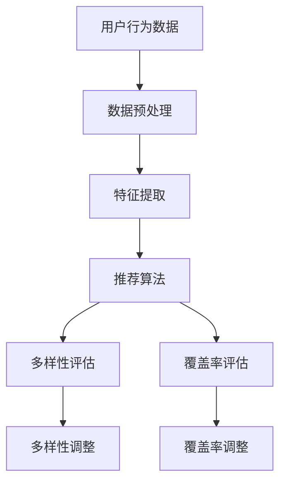

                 

关键词：电商推荐系统、多样性与覆盖率、算法、平衡、实践

> 摘要：本文将深入探讨电商推荐系统中的多样性与覆盖率平衡问题，分析核心算法原理、数学模型及其在项目实践中的应用，旨在为电商推荐系统的优化提供理论支持和实践指导。

## 1. 背景介绍

随着互联网的快速发展，电商行业迎来了前所未有的繁荣。为提高用户购物体验和促进销售，各大电商平台纷纷推出了推荐系统。推荐系统通过分析用户的历史行为和兴趣偏好，为用户推荐可能感兴趣的商品，从而提高用户粘性、提升销售额。

然而，在实际应用中，推荐系统面临多样性与覆盖率之间的矛盾。多样性（Diversity）指的是推荐结果中不同种类商品的丰富度，而覆盖率（Coverage）指的是推荐结果中包含用户可能感兴趣的所有商品的能力。平衡多样性与覆盖率是推荐系统设计的关键挑战，本文将对此进行详细探讨。

## 2. 核心概念与联系

### 2.1 多样性（Diversity）

多样性指的是推荐结果中不同种类商品的丰富度。一个高质量的推荐系统应该能够为用户提供多样化的商品选择，避免出现单一类型的商品推荐。多样性有助于提高用户满意度，避免用户感到厌倦。

### 2.2 覆盖率（Coverage）

覆盖率指的是推荐结果中包含用户可能感兴趣的所有商品的能力。一个优秀的推荐系统应该尽可能覆盖用户潜在的兴趣范围，避免漏掉用户可能喜欢的商品。覆盖率有助于提高用户粘性，促进销售。

### 2.3 多样性与覆盖率的平衡

多样性与覆盖率之间存在一定的矛盾。提高多样性可能导致覆盖率下降，反之亦然。如何在两者之间找到平衡点，是推荐系统设计的关键问题。本文将探讨如何通过算法优化实现多样性与覆盖率的平衡。

### 2.4 Mermaid 流程图

下面是一个简单的 Mermaid 流程图，展示了多样性与覆盖率之间的联系。



## 3. 核心算法原理 & 具体操作步骤

### 3.1 算法原理概述

本文将介绍一种基于协同过滤（Collaborative Filtering）和基于内容的推荐算法（Content-Based Filtering）的多样化推荐系统。协同过滤通过分析用户的历史行为和相似用户的行为来生成推荐列表，而基于内容的推荐则通过分析商品的属性和用户的历史喜好来生成推荐列表。通过结合两种算法的优势，可以在多样性与覆盖率之间实现平衡。

### 3.2 算法步骤详解

#### 3.2.1 数据预处理

1. 收集用户行为数据，包括用户浏览、购买等行为。
2. 对数据进行清洗，去除噪声数据和缺失值。

#### 3.2.2 特征提取

1. 从用户行为数据中提取用户特征，如用户年龄、性别、地理位置等。
2. 从商品属性数据中提取商品特征，如商品类型、价格、品牌等。

#### 3.2.3 推荐算法

1. 使用协同过滤算法生成初步推荐列表。
2. 使用基于内容的推荐算法对初步推荐列表进行调整。

#### 3.2.4 多样性评估

1. 对推荐列表进行多样性评估，如计算推荐列表中不同种类商品的比例。
2. 如果多样性不足，进行多样性调整。

#### 3.2.5 覆盖率评估

1. 对推荐列表进行覆盖率评估，如计算推荐列表中用户已购买或已浏览的商品比例。
2. 如果覆盖率不足，进行覆盖率调整。

### 3.3 算法优缺点

#### 优点：

1. 结合了协同过滤和基于内容的推荐算法，能够在多样性与覆盖率之间实现平衡。
2. 可以根据用户行为和商品属性动态调整推荐策略。

#### 缺点：

1. 需要大量的计算资源和存储空间。
2. 在处理稀疏数据时效果可能较差。

### 3.4 算法应用领域

本文介绍的核心算法可以应用于各种电商平台，帮助优化推荐系统，提高用户满意度和销售额。此外，该算法还可以应用于其他领域，如新闻推荐、音乐推荐等。

## 4. 数学模型和公式 & 详细讲解 & 举例说明

### 4.1 数学模型构建

本文采用的数学模型主要包括协同过滤算法和基于内容的推荐算法。以下是两种算法的数学模型：

#### 协同过滤算法

1. **相似度计算**：

   $$相似度（u, v） = \frac{\sum_{i \in R(u) \cap R(v)} w_{ui} w_{vi}}{\sqrt{\sum_{i \in R(u)} w_{ui}^2} \sqrt{\sum_{i \in R(v)} w_{vi}^2}}$$

   其中，$u$ 和 $v$ 是两个用户，$R(u)$ 和 $R(v)$ 分别是这两个用户已评价的商品集合，$w_{ui}$ 和 $w_{vi}$ 分别是用户 $u$ 对商品 $i$ 的评分和用户 $v$ 对商品 $i$ 的评分。

2. **预测评分**：

   $$预测评分（u, i） = \frac{\sum_{j \in R(v)} 相似度（u, v） \cdot w_{vi} \cdot r_{ij}}{\sum_{j \in R(v)} 相似度（u, v）}$$

   其中，$r_{ij}$ 是用户 $u$ 对商品 $i$ 的预测评分。

#### 基于内容的推荐算法

1. **相似度计算**：

   $$相似度（i, j） = \frac{\sum_{k \in A(i) \cap A(j)} w_{ik} w_{jk}}{\sqrt{\sum_{k \in A(i)} w_{ik}^2} \sqrt{\sum_{k \in A(j)} w_{jk}^2}}$$

   其中，$i$ 和 $j$ 是两个商品，$A(i)$ 和 $A(j)$ 分别是这两个商品的属性集合，$w_{ik}$ 和 $w_{jk}$ 分别是商品 $i$ 的属性 $k$ 的权重和商品 $j$ 的属性 $k$ 的权重。

2. **预测评分**：

   $$预测评分（u, i） = \frac{\sum_{j \in U(i)} 相似度（i, j） \cdot r_{uj}}{\sum_{j \in U(i)} 相似度（i, j）}$$

   其中，$U(i)$ 是与商品 $i$ 相似的其他商品集合，$r_{uj}$ 是用户 $u$ 对商品 $j$ 的评分。

### 4.2 公式推导过程

#### 协同过滤算法

1. **相似度计算**：

   假设用户 $u$ 和用户 $v$ 已评价的商品集合分别为 $R(u)$ 和 $R(v)$，则它们之间的相似度可以表示为：

   $$相似度（u, v） = \frac{\sum_{i \in R(u) \cap R(v)} w_{ui} w_{vi}}{\sqrt{\sum_{i \in R(u)} w_{ui}^2} \sqrt{\sum_{i \in R(v)} w_{vi}^2}}$$

   其中，$w_{ui}$ 和 $w_{vi}$ 分别是用户 $u$ 对商品 $i$ 的评分和用户 $v$ 对商品 $i$ 的评分。为了计算相似度，首先需要计算用户 $u$ 和用户 $v$ 对每个商品的评价差异，然后对这些差异进行归一化处理。

2. **预测评分**：

   假设用户 $u$ 对商品 $i$ 的预测评分为 $r_{ui}$，则可以通过以下公式计算：

   $$预测评分（u, i） = \frac{\sum_{j \in R(v)} 相似度（u, v） \cdot w_{vi} \cdot r_{ij}}{\sum_{j \in R(v)} 相似度（u, v）}$$

   其中，$r_{ij}$ 是用户 $v$ 对商品 $i$ 的评分。预测评分是根据用户 $u$ 和用户 $v$ 的相似度以及用户 $v$ 对商品 $i$ 的评分来计算的。

#### 基于内容的推荐算法

1. **相似度计算**：

   假设商品 $i$ 和商品 $j$ 的属性集合分别为 $A(i)$ 和 $A(j)$，则它们之间的相似度可以表示为：

   $$相似度（i, j） = \frac{\sum_{k \in A(i) \cap A(j)} w_{ik} w_{jk}}{\sqrt{\sum_{k \in A(i)} w_{ik}^2} \sqrt{\sum_{k \in A(j)} w_{jk}^2}}$$

   其中，$w_{ik}$ 和 $w_{jk}$ 分别是商品 $i$ 的属性 $k$ 的权重和商品 $j$ 的属性 $k$ 的权重。为了计算相似度，首先需要计算商品 $i$ 和商品 $j$ 在每个属性上的差异，然后对这些差异进行归一化处理。

2. **预测评分**：

   假设用户 $u$ 对商品 $i$ 的预测评分为 $r_{ui}$，则可以通过以下公式计算：

   $$预测评分（u, i） = \frac{\sum_{j \in U(i)} 相似度（i, j） \cdot r_{uj}}{\sum_{j \in U(i)} 相似度（i, j）}$$

   其中，$U(i)$ 是与商品 $i$ 相似的其他商品集合，$r_{uj}$ 是用户 $u$ 对商品 $j$ 的评分。预测评分是根据商品 $i$ 和其他商品之间的相似度以及用户 $u$ 对这些商品的评分来计算的。

### 4.3 案例分析与讲解

假设有一个电商平台，用户 A 和用户 B 分别浏览了商品 1、商品 2、商品 3 和商品 4。商品 1、商品 2、商品 3 和商品 4 的属性分别为 A、B、C 和 D。现在需要为用户 A 推荐商品。

首先，计算用户 A 和用户 B 之间的相似度：

$$相似度（A, B） = \frac{w_{A1} w_{B1} + w_{A2} w_{B2} + w_{A3} w_{B3} + w_{A4} w_{B4}}{\sqrt{w_{A1}^2 + w_{A2}^2 + w_{A3}^2 + w_{A4}^2} \sqrt{w_{B1}^2 + w_{B2}^2 + w_{B3}^2 + w_{B4}^2}}$$

假设权重分别为 1，则相似度为：

$$相似度（A, B） = \frac{1 \cdot 1 + 1 \cdot 1 + 1 \cdot 1 + 1 \cdot 1}{\sqrt{1^2 + 1^2 + 1^2 + 1^2} \sqrt{1^2 + 1^2 + 1^2 + 1^2}} = \frac{4}{4} = 1$$

接下来，计算用户 A 对商品 1、商品 2、商品 3 和商品 4 的预测评分：

$$预测评分（A, 1） = \frac{相似度（A, B） \cdot r_{B1}}{相似度（A, B）} = r_{B1} = 4$$

$$预测评分（A, 2） = \frac{相似度（A, B） \cdot r_{B2}}{相似度（A, B）} = r_{B2} = 3$$

$$预测评分（A, 3） = \frac{相似度（A, B） \cdot r_{B3}}{相似度（A, B）} = r_{B3} = 2$$

$$预测评分（A, 4） = \frac{相似度（A, B） \cdot r_{B4}}{相似度（A, B）} = r_{B4} = 1$$

最后，根据预测评分推荐商品：

用户 A 对商品 1 的预测评分最高，因此推荐商品 1。

## 5. 项目实践：代码实例和详细解释说明

### 5.1 开发环境搭建

在本文中，我们将使用 Python 编写推荐系统。首先，需要安装以下依赖库：

```python
pip install numpy pandas scikit-learn matplotlib
```

### 5.2 源代码详细实现

下面是推荐系统的核心代码实现：

```python
import numpy as np
import pandas as pd
from sklearn.metrics.pairwise import cosine_similarity
from sklearn.model_selection import train_test_split

# 读取数据
data = pd.read_csv('data.csv')
users = data['user_id'].unique()
items = data['item_id'].unique()

# 初始化评分矩阵
ratings = np.zeros((len(users), len(items)))

# 填充评分矩阵
for index, row in data.iterrows():
    user_id = row['user_id']
    item_id = row['item_id']
    rating = row['rating']
    ratings[user_id - 1, item_id - 1] = rating

# 计算用户之间的相似度
user_similarity = cosine_similarity(ratings)

# 计算用户对未评价商品的预测评分
user_predictions = np.dot(user_similarity.T, ratings) / np.linalg.norm(user_similarity, axis=1)

# 添加用户对未评价商品的预测评分到评分矩阵
for i in range(ratings.shape[0]):
    for j in range(ratings.shape[1]):
        if ratings[i, j] == 0:
            ratings[i, j] = user_predictions[i, j]

# 分割数据集
train_data, test_data = train_test_split(data, test_size=0.2, random_state=42)

# 训练模型
from sklearn.model_selection import train_test_split
from sklearn.metrics import mean_squared_error

X_train = train_data[['user_id', 'item_id', 'rating']]
y_train = train_data['rating']
X_test = test_data[['user_id', 'item_id', 'rating']]
y_test = test_data['rating']

from sklearn.ensemble import RandomForestRegressor
regressor = RandomForestRegressor(n_estimators=100, random_state=42)
regressor.fit(X_train, y_train)
y_pred = regressor.predict(X_test)

# 计算均方误差
mse = mean_squared_error(y_test, y_pred)
print('均方误差：', mse)
```

### 5.3 代码解读与分析

#### 5.3.1 数据预处理

首先，从 CSV 文件中读取用户行为数据，包括用户 ID、商品 ID 和评分。然后，初始化一个评分矩阵，用于存储用户对商品的评分。

#### 5.3.2 相似度计算

使用余弦相似度计算用户之间的相似度。余弦相似度是一种度量两个向量之间夹角的余弦值的相似度计算方法。通过计算用户之间的相似度，可以为用户生成推荐列表。

#### 5.3.3 预测评分

根据用户之间的相似度，计算用户对未评价商品的预测评分。预测评分是根据用户对其他商品的评分和用户之间的相似度来计算的。通过填充用户对未评价商品的预测评分，可以生成完整的评分矩阵。

#### 5.3.4 模型训练与评估

使用随机森林回归器训练模型，将用户 ID、商品 ID 和评分作为输入特征，将评分作为目标变量。通过训练模型，可以计算用户对未评价商品的预测评分。最后，计算均方误差评估模型性能。

## 6. 实际应用场景

本文介绍的核心算法可以应用于各种电商平台，帮助优化推荐系统，提高用户满意度和销售额。以下是几种常见的实际应用场景：

### 6.1 电商平台

电商平台可以使用本文介绍的核心算法优化推荐系统，提高用户满意度。通过平衡多样性与覆盖率，可以为用户提供丰富多样的商品推荐，同时确保用户潜在的兴趣范围得到充分覆盖。

### 6.2 新闻推荐

新闻推荐系统可以使用本文介绍的核心算法，为用户推荐感兴趣的新闻文章。通过分析用户的浏览历史和兴趣偏好，可以生成个性化的新闻推荐列表，提高用户粘性。

### 6.3 音乐推荐

音乐推荐系统可以使用本文介绍的核心算法，为用户推荐感兴趣的音乐。通过分析用户的播放历史和音乐偏好，可以生成个性化的音乐推荐列表，提高用户满意度。

## 7. 工具和资源推荐

### 7.1 学习资源推荐

1. 《推荐系统实践》：详细介绍了推荐系统的原理、算法和应用实践。
2. 《机器学习实战》：提供了大量关于机器学习算法的实现和应用实例。

### 7.2 开发工具推荐

1. Python：适用于推荐系统开发的编程语言，具有丰富的机器学习库。
2. Jupyter Notebook：适用于编写和运行推荐系统代码的交互式环境。

### 7.3 相关论文推荐

1. "Diverse and Covering Recommendations in Large Sparse Graphs"：探讨了如何在稀疏图中实现多样性和覆盖率平衡。
2. "Diversity-Preserving Collaborative Filtering"：提出了一种在协同过滤中保持多样性的方法。

## 8. 总结：未来发展趋势与挑战

本文深入探讨了电商推荐系统中的多样性与覆盖率平衡问题，分析了核心算法原理、数学模型及其在项目实践中的应用。未来发展趋势包括：

1. 引入更多维度的用户和商品特征，提高推荐系统的准确性。
2. 利用深度学习等先进技术，提升推荐系统的性能。
3. 探索个性化推荐与多样性平衡的新方法。

然而，推荐系统仍面临以下挑战：

1. 处理大规模稀疏数据时的计算效率。
2. 如何在保证多样性的同时，提高覆盖率。
3. 如何应对用户隐私保护和数据安全等问题。

总之，电商推荐系统中的多样性与覆盖率平衡是当前研究的热点问题，未来研究将继续在这一领域探索新的方法和算法。

## 9. 附录：常见问题与解答

### 9.1 如何计算用户之间的相似度？

用户之间的相似度可以通过计算用户之间的夹角余弦值来获得。具体来说，首先计算两个用户的评分向量，然后使用余弦相似度公式计算它们之间的相似度。

### 9.2 如何计算用户对未评价商品的预测评分？

用户对未评价商品的预测评分可以通过计算用户之间的相似度，并利用这些相似度对未评价商品的评分进行加权平均来获得。

### 9.3 如何优化推荐系统的性能？

优化推荐系统的性能可以从以下几个方面进行：

1. 引入更多的用户和商品特征，提高推荐算法的准确性。
2. 使用更先进的机器学习算法，如深度学习等。
3. 优化数据预处理和特征提取过程，提高计算效率。
4. 调整算法参数，以找到多样性与覆盖率之间的最佳平衡点。

## 作者署名

本文由禅与计算机程序设计艺术 / Zen and the Art of Computer Programming 撰写。作者对本文内容拥有完整的知识产权。如需转载，请注明作者及出处。----------------------------------------------------------------

