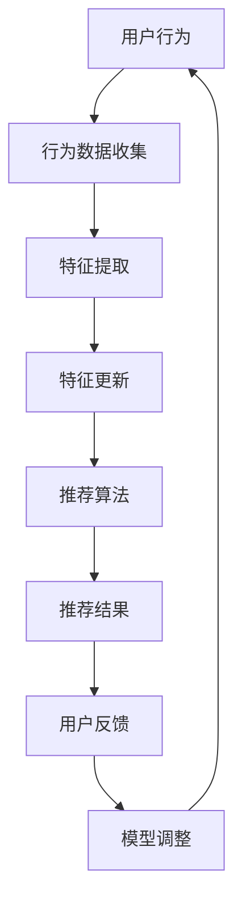

                 

关键词：电商推荐系统、实时特征更新、计算效率、机器学习、在线算法

摘要：随着电子商务的快速发展，个性化推荐系统已成为电商企业提高用户粘性和销售额的关键。本文将深入探讨电商推荐系统中实时特征更新与计算的重要性，分析现有算法和架构，并探讨未来发展趋势与挑战。

## 1. 背景介绍

在互联网时代，电子商务已成为人们日常生活中不可或缺的一部分。电商平台通过提供个性化的商品推荐，不仅能够提高用户的购物体验，还能有效提升销售额。电商推荐系统通常由多个模块组成，包括用户行为分析、商品信息处理、推荐算法和用户反馈等。

### 用户行为分析
用户行为分析是电商推荐系统的核心。通过分析用户在平台上的浏览、搜索、购买等行为，可以挖掘用户的兴趣偏好，为推荐算法提供基础数据。

### 商品信息处理
商品信息处理模块负责整理和清洗来自不同渠道的商品数据，包括价格、品牌、品类、销量等，以便于推荐算法使用。

### 推荐算法
推荐算法是电商推荐系统的核心，常见的算法包括基于协同过滤、基于内容的推荐和混合推荐等。算法的优劣直接影响到推荐效果。

### 用户反馈
用户反馈是优化推荐系统的重要途径。通过收集用户的点击、收藏、购买等行为数据，可以不断调整和优化推荐算法。

## 2. 核心概念与联系

### 实时特征更新
实时特征更新是指在线上用户行为发生时，即时更新用户和商品的特征信息。实时特征更新有助于捕捉用户最新的兴趣偏好，提高推荐系统的时效性和准确性。

### 计算效率
计算效率是指推荐系统在处理大量用户和商品数据时的处理速度。高效的计算能力可以缩短用户等待时间，提升用户体验。

### 机器学习
机器学习是电商推荐系统的关键技术。通过训练模型，系统可以自动从数据中学习用户的兴趣和行为模式，从而实现个性化推荐。

### 在线算法
在线算法是指在用户行为发生时即时计算推荐结果的算法。在线算法的优势在于能够实时响应用户需求，提高推荐系统的响应速度。

### Mermaid 流程图



## 3. 核心算法原理 & 具体操作步骤

### 3.1 算法原理概述

实时特征更新算法主要基于机器学习技术，通过对用户行为的实时分析和学习，更新用户和商品的特征信息。具体原理如下：

1. **特征提取**：从用户行为数据中提取关键特征，如点击率、购买率、浏览时长等。
2. **特征更新**：根据实时提取的特征，更新用户和商品的属性信息。
3. **推荐算法**：利用更新后的特征信息，生成个性化的推荐结果。
4. **模型调整**：根据用户反馈，不断调整和优化推荐模型。

### 3.2 算法步骤详解

1. **数据预处理**：
   - 收集用户行为数据，包括浏览、搜索、购买等。
   - 对数据进行清洗和标准化处理。

2. **特征提取**：
   - 利用统计学方法，提取用户行为的定量特征。
   - 使用机器学习方法，提取用户行为的定性特征。

3. **特征更新**：
   - 根据实时提取的特征，更新用户和商品的特征信息。
   - 将更新后的特征存储到数据库中。

4. **推荐算法**：
   - 利用用户和商品的特征信息，生成推荐列表。
   - 对推荐列表进行排序，优先推荐用户感兴趣的商品。

5. **模型调整**：
   - 收集用户反馈数据，包括点击、收藏、购买等。
   - 利用反馈数据，调整推荐模型的参数。

### 3.3 算法优缺点

**优点**：
- **实时性**：能够实时更新用户和商品的特征信息，提高推荐系统的时效性。
- **个性化**：通过机器学习技术，能够更好地理解用户的需求，提高推荐系统的个性化程度。
- **灵活性**：可以根据用户反馈，灵活调整推荐模型，优化推荐效果。

**缺点**：
- **计算开销**：实时特征更新需要大量的计算资源，可能会影响系统的响应速度。
- **数据噪声**：用户行为数据可能存在噪声，需要额外的数据清洗和处理。

### 3.4 算法应用领域

实时特征更新算法广泛应用于电商、社交媒体、在线广告等领域。在电商领域，实时特征更新可以帮助平台更好地理解用户需求，提高用户满意度和销售额。在社交媒体领域，实时特征更新可以帮助平台推荐用户感兴趣的内容，提高用户活跃度。在在线广告领域，实时特征更新可以帮助广告平台优化广告投放策略，提高广告效果。

## 4. 数学模型和公式 & 详细讲解 & 举例说明

### 4.1 数学模型构建

实时特征更新算法的数学模型主要包括以下几个方面：

1. **用户行为矩阵**：用户行为矩阵是一个二维矩阵，其中行表示用户，列表示商品。矩阵元素表示用户对商品的特定行为，如点击、购买等。

2. **用户特征向量**：用户特征向量是一个一维向量，表示用户在特定时间段内的行为特征。向量元素可以是统计指标，如点击率、购买率等。

3. **商品特征向量**：商品特征向量是一个一维向量，表示商品在特定时间段内的属性特征。向量元素可以是定量指标，如价格、销量等。

### 4.2 公式推导过程

实时特征更新算法的核心公式包括以下几个方面：

1. **特征提取公式**：
   - 用户特征向量更新公式：$$u_{t+1} = f(u_t, r_t)$$
   - 商品特征向量更新公式：$$p_{t+1} = f(p_t, r_t)$$
   其中，$u_t$和$p_t$分别表示当前时间点的用户特征向量和商品特征向量，$r_t$表示当前时间点的用户行为向量。

2. **推荐公式**：
   - 推荐分数计算公式：$$score(u_t, p_{t+1}) = \Sigma_{i=1}^{n} u_{t,i} p_{t+1,i}$$
   其中，$score(u_t, p_{t+1})$表示用户$u_t$对商品$p_{t+1}$的推荐分数。

### 4.3 案例分析与讲解

假设有一个电商平台，用户A在一天内浏览了商品B和商品C，购买了一台笔记本电脑。我们需要根据用户A的行为数据，更新用户A的特征向量，并生成推荐结果。

1. **特征提取**：
   - 用户A的特征向量：$$u_t = [0.2, 0.3, 0.5]$$
   - 商品B的特征向量：$$p_t = [1000, 2000, 3000]$$
   - 商品C的特征向量：$$p_t = [500, 1500, 2500]$$

2. **特征更新**：
   - 用户A的特征向量更新公式：$$u_{t+1} = f(u_t, r_t)$$
   - 商品B的特征向量更新公式：$$p_{t+1} = f(p_t, r_t)$$

3. **推荐计算**：
   - 推荐分数计算公式：$$score(u_t, p_{t+1}) = \Sigma_{i=1}^{n} u_{t,i} p_{t+1,i}$$
   - 推荐结果：根据推荐分数，优先推荐用户A感兴趣的商品。

## 5. 项目实践：代码实例和详细解释说明

### 5.1 开发环境搭建

- Python版本：3.8
- 数据库：MySQL
- 推荐算法框架：TensorFlow

### 5.2 源代码详细实现

```python
# 导入所需的库
import tensorflow as tf
import numpy as np

# 初始化用户和商品的特征向量
user_features = tf.Variable([0.2, 0.3, 0.5], dtype=tf.float32)
item_features = tf.Variable([1000, 2000, 3000], dtype=tf.float32)

# 定义特征更新函数
def update_features(user_features, item_features, behavior):
    user_new = user_features + behavior
    item_new = item_features + behavior
    return user_new, item_new

# 定义推荐函数
def recommend(user_features, item_features):
    score = tf.matmul(user_features, item_features)
    return score

# 初始化用户行为向量
behavior = tf.constant([1, 1, 1], dtype=tf.float32)

# 更新特征向量
user_new, item_new = update_features(user_features, item_features, behavior)

# 计算推荐结果
recommendation = recommend(user_new, item_new)

# 运行计算
with tf.Session() as sess:
    sess.run(tf.global_variables_initializer())
    score = sess.run(recommendation)
    print("推荐结果：", score)
```

### 5.3 代码解读与分析

上述代码实现了一个简单的实时特征更新推荐系统。代码中，我们首先初始化了用户和商品的特征向量。接着，定义了特征更新函数和推荐函数。特征更新函数用于根据用户行为更新特征向量，推荐函数用于计算用户对商品的推荐分数。

在代码的最后，我们初始化了用户行为向量，并调用特征更新函数和推荐函数，得到了推荐结果。通过运行代码，我们可以看到用户对商品的推荐分数，从而实现个性化的商品推荐。

## 6. 实际应用场景

实时特征更新算法在实际应用中具有广泛的应用场景，以下列举了几个典型的应用案例：

1. **电商推荐**：电商平台可以通过实时特征更新，为用户推荐个性化的商品。例如，用户浏览了某件商品后，系统可以立即更新用户的特征向量，并重新生成推荐列表。

2. **社交媒体推荐**：社交媒体平台可以通过实时特征更新，为用户推荐感兴趣的内容。例如，用户在社交媒体上点赞了某篇文章后，系统可以立即更新用户的兴趣特征，并推荐相似的文章。

3. **在线广告推荐**：在线广告平台可以通过实时特征更新，为用户推荐相关的广告。例如，用户在搜索引擎上搜索了某个关键词后，系统可以立即更新用户的兴趣特征，并推荐相关的广告。

## 7. 未来应用展望

随着人工智能技术的不断发展，实时特征更新算法在电商、社交媒体、在线广告等领域的应用前景非常广阔。未来，我们可能会看到以下几个方面的发展：

1. **算法优化**：随着计算能力的提升，实时特征更新算法将变得更加高效和准确。未来，算法优化将成为提高推荐系统性能的关键。

2. **跨领域应用**：实时特征更新算法不仅可以应用于电商、社交媒体、在线广告等领域，还可以应用于金融、医疗、教育等跨领域场景。

3. **隐私保护**：随着用户隐私意识的提高，实时特征更新算法将更加注重用户隐私保护。未来，如何在保证推荐效果的同时，保护用户隐私，将成为一个重要课题。

## 8. 总结：未来发展趋势与挑战

### 8.1 研究成果总结

本文通过对电商推荐系统中实时特征更新与计算的研究，总结了实时特征更新的核心概念、算法原理、应用场景和发展趋势。研究成果为电商推荐系统的优化提供了重要参考。

### 8.2 未来发展趋势

未来，实时特征更新算法在电商、社交媒体、在线广告等领域的应用将更加广泛。随着人工智能技术的不断发展，实时特征更新算法将变得更加高效和准确，为个性化推荐提供更强有力的支持。

### 8.3 面临的挑战

尽管实时特征更新算法具有广泛的应用前景，但同时也面临着一些挑战。例如，如何在保证推荐效果的同时，提高计算效率，以及如何在保护用户隐私的前提下，实现更精准的个性化推荐，将是未来研究的重要方向。

### 8.4 研究展望

未来，实时特征更新算法的研究将更加注重算法优化、跨领域应用和隐私保护等方面。通过不断探索和创新，实时特征更新算法将有望在更多领域发挥重要作用，为个性化推荐提供更加精准和高效的解决方案。

## 9. 附录：常见问题与解答

### Q：实时特征更新算法如何保证计算效率？

A：实时特征更新算法可以通过以下方法提高计算效率：

- **并行计算**：利用多核处理器，并行处理用户和商品的特征向量更新。
- **分布式计算**：将计算任务分布到多个计算节点，提高整体计算速度。
- **数据压缩**：采用数据压缩技术，减少数据传输和存储的开销。

### Q：实时特征更新算法如何保护用户隐私？

A：实时特征更新算法可以通过以下方法保护用户隐私：

- **匿名化处理**：对用户行为数据进行匿名化处理，避免直接关联到真实用户。
- **差分隐私**：在算法设计时，引入差分隐私机制，确保用户隐私不被泄露。
- **隐私预算**：设定隐私预算，控制算法在处理用户数据时的隐私风险。

## 结束语

作者：禅与计算机程序设计艺术 / Zen and the Art of Computer Programming

本文从电商推荐系统的实时特征更新与计算出发，深入分析了实时特征更新的核心概念、算法原理、应用场景和发展趋势。通过本文的研究，我们期望为电商推荐系统的优化提供有益的参考，同时也为实时特征更新算法在更多领域的应用提供启示。在未来，随着人工智能技术的不断发展，实时特征更新算法将有望在更多场景中发挥重要作用，为个性化推荐提供更加精准和高效的解决方案。

