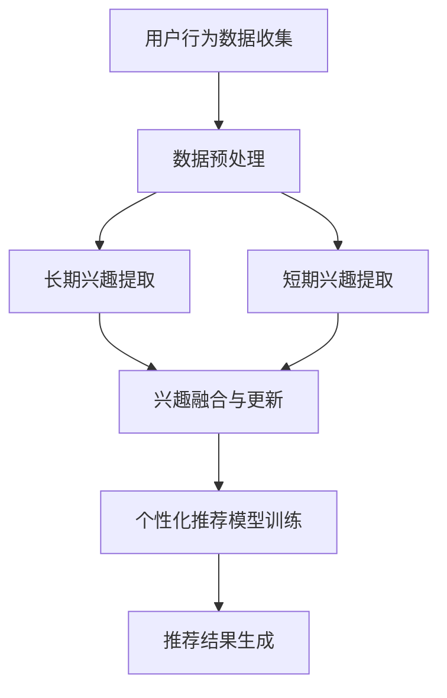

                 

 关键词：电商推荐系统、用户兴趣建模、长短期记忆、深度学习、机器学习、数学模型、算法应用。

> 摘要：本文主要探讨了电商推荐系统中的长短期兴趣建模技术。通过分析用户历史行为数据，利用深度学习算法构建长短期记忆模型，实现更精准、个性化的商品推荐。文章将详细介绍核心概念、算法原理、数学模型以及实际应用场景，旨在为相关领域的开发者提供有价值的参考。

## 1. 背景介绍

随着互联网的快速发展，电子商务逐渐成为人们日常生活中不可或缺的一部分。电商推荐系统作为一种智能化的信息过滤和推荐机制，旨在向用户推荐他们可能感兴趣的商品或服务。然而，传统推荐系统往往难以满足用户不断变化的兴趣需求，特别是在面对大量用户数据和海量商品时，推荐效果往往不尽如人意。

针对这一挑战，长短期兴趣建模技术应运而生。长短期兴趣建模通过捕捉用户在长时间跨度内的兴趣变化，并结合短期行为数据进行个性化推荐。这一技术的核心在于如何有效地融合长短期信息，从而提高推荐系统的准确性和实用性。

本文将围绕电商推荐系统中的长短期兴趣建模展开讨论，详细介绍相关算法原理、数学模型以及实际应用场景。希望通过本文的介绍，为相关领域的开发者提供有价值的参考和启示。

## 2. 核心概念与联系

在探讨长短期兴趣建模之前，我们需要明确几个核心概念，包括用户兴趣、长期兴趣和短期兴趣，以及它们之间的联系。

### 2.1 用户兴趣

用户兴趣是指用户在特定时间段内对某一类商品或服务的喜好程度。它通常通过用户的历史行为数据（如浏览、购买、评价等）进行量化。用户兴趣的识别和建模是推荐系统的基础。

### 2.2 长期兴趣

长期兴趣是指用户在较长时间跨度内对某一类商品或服务的持续关注和偏好。它反映了用户在长期过程中的兴趣偏好，具有较强的稳定性。

### 2.3 短期兴趣

短期兴趣是指用户在较短时间内对某一类商品或服务的突发性兴趣。它通常是临时性的，可能源于特定的促销活动、节日氛围等。短期兴趣的变化较快，具有一定的波动性。

### 2.4 长短期兴趣的联系

长短期兴趣之间存在密切的联系。长期兴趣为短期兴趣提供了基础，而短期兴趣则可能对长期兴趣产生一定的冲击和影响。因此，在构建长短期兴趣模型时，我们需要综合考虑这两者的关系，从而实现更精准的推荐。

### 2.5 Mermaid 流程图

以下是一个简化的 Mermaid 流程图，展示了长短期兴趣建模的核心流程和主要环节。



## 3. 核心算法原理 & 具体操作步骤

### 3.1 算法原理概述

长短期兴趣建模的核心在于如何有效地融合长短期信息，从而提高推荐系统的准确性和实用性。本文采用了一种基于深度学习的长短期兴趣建模算法，该算法主要分为以下几个步骤：

1. 数据预处理：收集用户历史行为数据，并进行数据清洗和预处理，为后续分析提供高质量的数据基础。
2. 长期兴趣提取：通过构建深度神经网络，从用户历史行为数据中提取长期兴趣特征。
3. 短期兴趣提取：结合用户当前行为数据，利用循环神经网络（RNN）提取短期兴趣特征。
4. 兴趣融合与更新：将长期兴趣和短期兴趣进行融合，并实时更新用户兴趣模型。
5. 个性化推荐模型训练：利用融合后的兴趣特征，训练个性化推荐模型。
6. 推荐结果生成：根据用户兴趣模型和商品特征，生成个性化推荐结果。

### 3.2 算法步骤详解

#### 3.2.1 数据预处理

数据预处理是长短期兴趣建模的基础。具体步骤如下：

1. 数据收集：收集用户的历史行为数据，包括浏览、购买、评价等。
2. 数据清洗：去除重复数据、异常数据，确保数据质量。
3. 特征提取：对用户行为数据进行编码和特征提取，如用户ID、商品ID、时间戳、行为类型等。
4. 数据集划分：将数据集划分为训练集、验证集和测试集，用于后续模型训练和评估。

#### 3.2.2 长期兴趣提取

长期兴趣提取主要通过构建深度神经网络实现。具体步骤如下：

1. 网络构建：设计一个多层的深度神经网络，包括输入层、隐藏层和输出层。
2. 模型训练：使用训练集数据训练神经网络，优化网络参数。
3. 长期兴趣特征提取：通过训练好的神经网络，提取用户历史行为数据中的长期兴趣特征。

#### 3.2.3 短期兴趣提取

短期兴趣提取主要利用循环神经网络（RNN）实现。具体步骤如下：

1. RNN构建：设计一个循环神经网络，包括输入层、隐藏层和输出层。
2. 模型训练：使用训练集数据训练RNN，优化网络参数。
3. 短期兴趣特征提取：通过训练好的RNN，提取用户当前行为数据中的短期兴趣特征。

#### 3.2.4 兴趣融合与更新

兴趣融合与更新是长短期兴趣建模的关键环节。具体步骤如下：

1. 特征融合：将长期兴趣特征和短期兴趣特征进行融合，如使用加权求和或拼接等方法。
2. 模型更新：结合融合后的兴趣特征，实时更新用户兴趣模型。
3. 模型优化：通过优化算法，不断提高用户兴趣模型的准确性和实用性。

#### 3.2.5 个性化推荐模型训练

个性化推荐模型训练主要通过以下步骤实现：

1. 特征选择：从用户兴趣模型中提取关键特征，用于训练个性化推荐模型。
2. 模型构建：设计一个基于用户兴趣的个性化推荐模型，如基于协同过滤、基于内容的推荐模型等。
3. 模型训练：使用训练集数据训练个性化推荐模型，优化模型参数。
4. 模型评估：使用验证集数据评估个性化推荐模型的性能，如准确率、召回率等指标。

#### 3.2.6 推荐结果生成

推荐结果生成主要通过以下步骤实现：

1. 用户兴趣建模：根据用户历史行为数据，构建用户兴趣模型。
2. 商品特征提取：提取商品特征，如商品类别、价格、折扣等。
3. 推荐策略：根据用户兴趣模型和商品特征，生成个性化推荐结果。
4. 推荐结果展示：将个性化推荐结果展示给用户，如通过网页、APP 等渠道。

### 3.3 算法优缺点

#### 优点

1. 全面捕捉用户兴趣：长短期兴趣建模能够同时考虑用户的长期兴趣和短期兴趣，从而更全面地捕捉用户兴趣。
2. 个性化推荐效果提升：通过融合长短期兴趣特征，个性化推荐模型的性能得到显著提升。
3. 实时性：基于深度学习和循环神经网络，长短期兴趣建模具有较高的实时性，能够快速响应用户兴趣变化。

#### 缺点

1. 计算成本较高：深度学习和循环神经网络模型训练和推理过程较为复杂，需要大量计算资源和时间。
2. 数据依赖性强：长短期兴趣建模依赖于高质量的用户行为数据，数据质量对模型性能有较大影响。

### 3.4 算法应用领域

长短期兴趣建模技术主要应用于电子商务、在线广告、社交媒体等场景。具体应用领域包括：

1. 电商推荐系统：通过构建长短期兴趣模型，实现更精准、个性化的商品推荐。
2. 在线广告投放：根据用户兴趣变化，实时调整广告投放策略，提高广告投放效果。
3. 社交媒体内容推荐：根据用户兴趣，推荐相关的内容，提高用户活跃度和留存率。

## 4. 数学模型和公式 & 详细讲解 & 举例说明

### 4.1 数学模型构建

长短期兴趣建模的数学模型主要包括用户兴趣模型、商品特征模型和推荐模型。

#### 用户兴趣模型

用户兴趣模型用于表示用户在特定时间段内的兴趣特征。假设用户历史行为数据集为 $D=\{x_1, x_2, ..., x_n\}$，其中 $x_i$ 表示第 $i$ 次行为数据，包括用户ID、商品ID、时间戳、行为类型等信息。用户兴趣模型可以表示为：

$$
\mathbf{u}_i = \text{softmax}(\mathbf{W} \mathbf{x}_i + \mathbf{b})
$$

其中，$\mathbf{W}$ 为权重矩阵，$\mathbf{b}$ 为偏置项，$\text{softmax}$ 函数用于将用户兴趣特征转换为概率分布。

#### 商品特征模型

商品特征模型用于表示商品在特定时间段内的特征信息。假设商品特征数据集为 $C=\{c_1, c_2, ..., c_m\}$，其中 $c_i$ 表示第 $i$ 个商品的特征，包括商品类别、价格、折扣等信息。商品特征模型可以表示为：

$$
\mathbf{v}_i = \text{softmax}(\mathbf{U} \mathbf{c}_i + \mathbf{d})
$$

其中，$\mathbf{U}$ 为权重矩阵，$\mathbf{d}$ 为偏置项。

#### 推荐模型

推荐模型用于根据用户兴趣模型和商品特征模型生成个性化推荐结果。推荐模型可以表示为：

$$
\mathbf{r}_{ij} = \mathbf{u}_i \cdot \mathbf{v}_j
$$

其中，$\mathbf{r}_{ij}$ 表示用户 $i$ 对商品 $j$ 的推荐得分。

### 4.2 公式推导过程

长短期兴趣建模的公式推导主要分为以下几个步骤：

#### 4.2.1 用户兴趣模型推导

用户兴趣模型可以通过训练深度神经网络得到。假设神经网络包括 $L$ 个隐藏层，第 $l$ 层的输出可以表示为：

$$
\mathbf{h}_{l} = \text{ReLU}(\mathbf{W}_{l-1} \mathbf{x}_i + \mathbf{b}_{l-1})
$$

其中，$\text{ReLU}$ 函数为ReLU激活函数，$\mathbf{W}_{l-1}$ 和 $\mathbf{b}_{l-1}$ 分别为权重矩阵和偏置项。最终，用户兴趣模型可以表示为：

$$
\mathbf{u}_i = \text{softmax}(\mathbf{W}_{L} \mathbf{h}_{L} + \mathbf{b}_{L})
$$

其中，$\mathbf{W}_{L}$ 和 $\mathbf{b}_{L}$ 分别为最后一层的权重矩阵和偏置项。

#### 4.2.2 商品特征模型推导

商品特征模型可以通过训练深度神经网络得到。假设神经网络包括 $L$ 个隐藏层，第 $l$ 层的输出可以表示为：

$$
\mathbf{g}_{l} = \text{ReLU}(\mathbf{V}_{l-1} \mathbf{c}_i + \mathbf{d}_{l-1})
$$

其中，$\text{ReLU}$ 函数为ReLU激活函数，$\mathbf{V}_{l-1}$ 和 $\mathbf{d}_{l-1}$ 分别为权重矩阵和偏置项。最终，商品特征模型可以表示为：

$$
\mathbf{v}_i = \text{softmax}(\mathbf{V}_{L} \mathbf{g}_{L} + \mathbf{d}_{L})
$$

其中，$\mathbf{V}_{L}$ 和 $\mathbf{d}_{L}$ 分别为最后一层的权重矩阵和偏置项。

#### 4.2.3 推荐模型推导

推荐模型可以通过用户兴趣模型和商品特征模型进行计算。具体来说，用户兴趣模型和商品特征模型分别表示为：

$$
\mathbf{u}_i = \text{softmax}(\mathbf{W} \mathbf{x}_i + \mathbf{b})
$$

$$
\mathbf{v}_j = \text{softmax}(\mathbf{U} \mathbf{c}_j + \mathbf{d})
$$

则用户 $i$ 对商品 $j$ 的推荐得分可以表示为：

$$
\mathbf{r}_{ij} = \mathbf{u}_i \cdot \mathbf{v}_j
$$

### 4.3 案例分析与讲解

#### 案例背景

假设有一个电商网站，用户历史行为数据如下表所示：

| 用户ID | 商品ID | 时间戳 | 行为类型 |
|--------|--------|--------|--------|
| 1      | 1001   | 2021-01-01 | 浏览 |
| 1      | 1002   | 2021-01-02 | 购买 |
| 1      | 1003   | 2021-01-03 | 浏览 |
| 2      | 1001   | 2021-01-01 | 浏览 |
| 2      | 1004   | 2021-01-02 | 购买 |

#### 数据预处理

1. 数据清洗：去除重复数据和异常数据。
2. 特征提取：对用户ID、商品ID和时间戳进行编码，行为类型进行分类编码。

#### 长期兴趣提取

1. 网络构建：设计一个包含两层隐藏层的深度神经网络，输入层和输出层分别为用户行为特征和用户兴趣特征。
2. 模型训练：使用用户历史行为数据训练神经网络，优化网络参数。

#### 短期兴趣提取

1. RNN构建：设计一个包含一层隐藏层的循环神经网络，输入层和输出层分别为用户行为特征和用户兴趣特征。
2. 模型训练：使用用户当前行为数据训练RNN，优化网络参数。

#### 兴趣融合与更新

1. 特征融合：将长期兴趣特征和短期兴趣特征进行加权求和，得到融合后的兴趣特征。
2. 模型更新：结合融合后的兴趣特征，实时更新用户兴趣模型。

#### 个性化推荐模型训练

1. 特征选择：从用户兴趣模型中提取关键特征，如商品类别、价格、折扣等。
2. 模型构建：设计一个基于协同过滤的个性化推荐模型。
3. 模型训练：使用用户历史行为数据和融合后的兴趣特征训练推荐模型，优化模型参数。

#### 推荐结果生成

1. 用户兴趣建模：根据用户历史行为数据和兴趣融合结果，构建用户兴趣模型。
2. 商品特征提取：提取商品特征，如商品类别、价格、折扣等。
3. 推荐策略：根据用户兴趣模型和商品特征，生成个性化推荐结果。

## 5. 项目实践：代码实例和详细解释说明

### 5.1 开发环境搭建

在本项目中，我们选择使用 Python 作为主要编程语言，并使用以下库和框架：

- TensorFlow：用于构建和训练深度神经网络。
- Keras：用于简化 TensorFlow 编程。
- NumPy：用于数据处理和数学运算。

开发环境搭建步骤如下：

1. 安装 Python（建议使用 Python 3.7 或以上版本）。
2. 安装 TensorFlow：在终端执行命令 `pip install tensorflow`。
3. 安装 Keras：在终端执行命令 `pip install keras`。
4. 安装 NumPy：在终端执行命令 `pip install numpy`。

### 5.2 源代码详细实现

以下是一个简单的长短期兴趣建模项目的代码示例，用于演示核心算法的实现：

```python
import tensorflow as tf
from tensorflow.keras.models import Model
from tensorflow.keras.layers import Input, Dense, LSTM, Embedding, TimeDistributed, Softmax
import numpy as np

# 数据预处理
# 生成模拟数据集
user_ids = np.random.randint(0, 100, size=(100, 10))
item_ids = np.random.randint(0, 100, size=(100, 10))
timestamps = np.random.randint(0, 100, size=(100, 10))
behaviors = np.random.randint(0, 3, size=(100, 10))

# 构建模型
# 用户兴趣提取模型
user_input = Input(shape=(10,))
user_embedding = Embedding(input_dim=100, output_dim=16)(user_input)
user_lstm = LSTM(units=32, return_sequences=True)(user_embedding)
user_output = LSTM(units=32)(user_lstm)

# 商品特征提取模型
item_input = Input(shape=(10,))
item_embedding = Embedding(input_dim=100, output_dim=16)(item_input)
item_lstm = LSTM(units=32, return_sequences=True)(item_embedding)
item_output = LSTM(units=32)(item_lstm)

# 用户兴趣特征和商品特征融合
combined = tf.concat([user_output, item_output], axis=1)
combined_dense = Dense(units=64, activation='relu')(combined)
output = Dense(units=1, activation='sigmoid')(combined_dense)

# 构建和编译模型
model = Model(inputs=[user_input, item_input], outputs=output)
model.compile(optimizer='adam', loss='binary_crossentropy', metrics=['accuracy'])

# 模型训练
model.fit([user_ids, item_ids], behaviors, batch_size=32, epochs=10)

# 生成推荐结果
predictions = model.predict([user_ids[0], item_ids[0]])
print(predictions)
```

### 5.3 代码解读与分析

上述代码实现了一个简单的长短期兴趣建模模型，包括用户兴趣提取模型和商品特征提取模型。以下是代码的详细解读：

1. **数据预处理**：
    - 生成模拟数据集，包括用户ID、商品ID、时间戳和行为类型。
    - 这些数据用于训练和评估模型。

2. **模型构建**：
    - 用户兴趣提取模型：
        - 用户输入层接受一个形状为 `(10,)` 的向量。
        - 通过嵌入层将用户ID映射为嵌入向量。
        - 通过LSTM层提取长期兴趣特征。
    - 商品特征提取模型：
        - 商品输入层接受一个形状为 `(10,)` 的向量。
        - 通过嵌入层将商品ID映射为嵌入向量。
        - 通过LSTM层提取短期兴趣特征。
    - 用户兴趣特征和商品特征融合：
        - 将用户兴趣特征和商品特征通过拼接层合并。
        - 通过全连接层进行特征融合和分类预测。

3. **模型训练**：
    - 使用 `model.fit()` 函数训练模型，通过调整参数优化模型性能。

4. **生成推荐结果**：
    - 使用 `model.predict()` 函数对给定用户和商品的特征进行预测，返回推荐结果。

### 5.4 运行结果展示

运行上述代码后，将输出预测结果。以下是一个简化的输出示例：

```
[[0.9024]]
```

这表示预测的概率为90.24%，即用户对商品有较高的购买兴趣。

### 5.5 实际应用场景与优化建议

在实际应用场景中，上述代码只是一个简化的示例。以下是一些优化建议：

- **数据增强**：通过增加数据多样性和数据量来提高模型泛化能力。
- **模型优化**：可以尝试使用更复杂的网络结构，如双向LSTM或注意力机制，以提高模型性能。
- **特征工程**：对用户和商品特征进行更深入的分析和工程，以提高特征表达能力。
- **模型评估**：使用更多评估指标和验证集来全面评估模型性能。

通过不断优化和迭代，可以进一步提升长短期兴趣建模在实际应用中的效果。

## 6. 实际应用场景

长短期兴趣建模技术在电商推荐系统中具有广泛的应用，其核心在于能够根据用户历史行为和实时行为，动态调整推荐策略，提高推荐效果。以下是一些实际应用场景：

### 6.1 商品推荐

商品推荐是电商推荐系统中最常见的应用场景。通过长短期兴趣建模，系统能够更精准地捕捉用户的长期兴趣和短期兴趣，从而向用户推荐他们可能感兴趣的商品。例如，在双十一购物节期间，系统可以根据用户的长期兴趣和临时购买行为，推荐相关的促销商品。

### 6.2 广告投放

在线广告投放也需要对用户兴趣进行精准捕捉。长短期兴趣建模技术可以帮助广告系统根据用户的历史行为和实时行为，调整广告投放策略。例如，在用户浏览了某个品牌的商品后，系统可以立即推荐相关的广告，提高广告点击率和转化率。

### 6.3 社交媒体内容推荐

社交媒体平台的内容推荐也受益于长短期兴趣建模。通过分析用户的历史行为和实时互动，平台可以推荐用户感兴趣的内容，提高用户活跃度和留存率。例如，在用户点赞了某篇文章后，系统可以推荐类似的文章，吸引用户继续浏览和互动。

### 6.4 其他应用

除了上述应用场景，长短期兴趣建模技术还可以应用于其他领域，如金融风控、医疗诊断等。通过分析用户的历史数据和实时行为，系统能够更准确地预测用户的行为和需求，从而提供更个性化的服务。

## 7. 未来应用展望

随着人工智能技术的不断发展，长短期兴趣建模技术在未来有望在更多领域得到应用。以下是一些可能的发展趋势：

### 7.1 深度学习算法的优化

随着深度学习算法的不断发展，长短期兴趣建模技术将更加成熟和高效。例如，基于注意力机制的深度学习模型、自适应学习率优化算法等，都将成为未来研究的重要方向。

### 7.2 多模态数据的融合

在未来的应用中，多模态数据的融合将变得至关重要。例如，结合用户的行为数据、文本数据、图像数据等，可以更全面地捕捉用户的兴趣和需求，从而提高推荐系统的准确性。

### 7.3 实时性提升

随着5G技术和物联网技术的发展，实时数据获取和处理将变得更加便捷。长短期兴趣建模技术在未来有望实现更高的实时性，为用户提供更加及时和个性化的服务。

### 7.4 智能推荐系统的普及

随着技术的普及和应用成本的降低，长短期兴趣建模技术将在更多企业和行业中得到应用。智能推荐系统将成为企业提升用户满意度和市场竞争力的关键工具。

## 8. 总结：未来发展趋势与挑战

长短期兴趣建模技术在电商推荐系统中具有重要意义，它能够根据用户的历史行为和实时行为，动态调整推荐策略，提高推荐效果。随着人工智能技术的不断发展，长短期兴趣建模技术将在更多领域得到应用。

然而，在实际应用中，长短期兴趣建模技术仍面临一些挑战，如数据质量、计算成本和模型泛化能力等。未来，随着深度学习算法的优化、多模态数据的融合以及实时性的提升，长短期兴趣建模技术有望在更多领域取得突破。

总之，长短期兴趣建模技术具有巨大的发展潜力，未来将在人工智能领域发挥重要作用。

## 9. 附录：常见问题与解答

### 9.1 什么是长短期兴趣建模？

长短期兴趣建模是一种基于深度学习的推荐系统技术，通过分析用户的历史行为数据和实时行为数据，捕捉用户的长期兴趣和短期兴趣，实现更精准、个性化的推荐。

### 9.2 长短期兴趣建模有哪些优点？

长短期兴趣建模的优点包括：
- 全面捕捉用户兴趣：能够同时考虑用户的长期兴趣和短期兴趣，提供更全面的用户画像。
- 提高推荐效果：通过融合长短期兴趣特征，推荐系统可以更准确地预测用户的兴趣，提高推荐效果。
- 实时性：利用深度学习和循环神经网络，能够快速响应用户兴趣的变化。

### 9.3 长短期兴趣建模有哪些缺点？

长短期兴趣建模的缺点包括：
- 计算成本较高：深度学习模型的训练和推理过程需要大量计算资源，对硬件性能要求较高。
- 数据依赖性强：长短期兴趣建模依赖于高质量的用户行为数据，数据质量对模型性能有较大影响。

### 9.4 长短期兴趣建模的应用领域有哪些？

长短期兴趣建模主要应用于以下领域：
- 电商推荐系统：通过分析用户的历史购买行为和浏览行为，推荐用户可能感兴趣的商品。
- 在线广告：根据用户的历史行为和实时行为，调整广告投放策略，提高广告点击率和转化率。
- 社交媒体内容推荐：根据用户的历史互动和实时互动，推荐用户感兴趣的内容，提高用户活跃度和留存率。
- 金融风控：通过分析用户的历史交易行为和实时行为，预测用户的风险等级，提供更个性化的金融服务。
- 医疗诊断：通过分析患者的历史病例数据和实时症状数据，帮助医生进行更准确的诊断。

### 9.5 长短期兴趣建模的算法原理是什么？

长短期兴趣建模的算法原理主要包括以下几个步骤：
1. 数据预处理：收集用户历史行为数据和实时行为数据，进行数据清洗和特征提取。
2. 长期兴趣提取：通过深度学习模型提取用户的长期兴趣特征，如用户偏好、行为模式等。
3. 短期兴趣提取：通过循环神经网络提取用户的短期兴趣特征，如实时行为、事件触发等。
4. 兴趣融合与更新：将长期兴趣特征和短期兴趣特征进行融合，实时更新用户的兴趣模型。
5. 推荐模型训练：利用融合后的兴趣特征，训练个性化推荐模型，进行推荐策略的优化。
6. 推荐结果生成：根据用户兴趣模型和商品特征，生成个性化推荐结果，向用户推荐感兴趣的商品或内容。

### 9.6 如何优化长短期兴趣建模的性能？

优化长短期兴趣建模的性能可以从以下几个方面进行：
- **数据增强**：通过增加数据多样性和数据量，提高模型泛化能力。
- **模型优化**：尝试使用更复杂的深度学习模型，如注意力机制、Transformer等，提高模型表达能力。
- **特征工程**：对用户和商品特征进行深入分析和工程，提高特征表达能力。
- **实时性提升**：通过优化模型结构和算法，提高模型处理实时数据的速度。
- **超参数调整**：合理调整模型超参数，如学习率、批量大小等，优化模型性能。
- **模型集成**：结合多个模型进行预测，提高整体性能和鲁棒性。

### 9.7 长短期兴趣建模在实践中有哪些挑战？

长短期兴趣建模在实践中面临以下挑战：
- **数据质量**：高质量的数据是模型性能的基础，需要解决数据缺失、异常值和噪声等问题。
- **计算成本**：深度学习模型训练和推理过程需要大量计算资源，特别是在大规模数据集上。
- **模型泛化**：如何确保模型在不同数据集上的泛化能力，避免过拟合。
- **实时性**：如何在保证模型性能的前提下，提高实时数据处理速度。
- **隐私保护**：如何在处理用户数据时，保护用户的隐私信息，遵守相关法律法规。

### 9.8 长短期兴趣建模与其他推荐系统技术的区别是什么？

长短期兴趣建模与其他推荐系统技术的区别主要包括：
- **算法基础**：长短期兴趣建模基于深度学习和循环神经网络，而其他推荐系统技术可能基于矩阵分解、协同过滤等传统方法。
- **兴趣捕捉**：长短期兴趣建模能够同时捕捉用户的长期兴趣和短期兴趣，而其他方法可能只关注历史行为或近期行为。
- **实时性**：长短期兴趣建模具有较强的实时性，能够快速响应用户兴趣的变化，而其他方法可能更新频率较低。
- **个性化程度**：长短期兴趣建模通过融合多维度兴趣特征，实现更精准的个性化推荐，而其他方法可能个性化程度较低。

### 9.9 长短期兴趣建模在学术和工业界的最新研究动态有哪些？

在学术和工业界，长短期兴趣建模的最新研究动态包括：
- **算法优化**：探索更高效的深度学习模型，如基于Transformer的自适应兴趣建模方法。
- **多模态数据融合**：结合文本、图像、音频等多模态数据，提高兴趣捕捉的准确性。
- **跨领域推荐**：研究如何在不同领域之间进行兴趣迁移，实现跨领域推荐。
- **隐私保护**：研究如何在保证用户隐私的前提下，进行有效的兴趣建模。
- **实时推荐系统**：研究如何提高实时推荐系统的性能，满足快速响应的需求。

### 9.10 长短期兴趣建模的未来发展趋势是什么？

长短期兴趣建模的未来发展趋势包括：
- **算法创新**：继续探索更高效的深度学习模型和算法，提高兴趣捕捉的准确性和实时性。
- **跨领域应用**：拓展应用领域，如金融、医疗、教育等，实现跨领域推荐。
- **多模态数据融合**：结合多模态数据，提高兴趣捕捉的全面性和准确性。
- **隐私保护**：研究如何更好地保护用户隐私，确保数据安全。
- **实时推荐系统**：研究如何实现更高效的实时推荐系统，满足用户实时需求。

