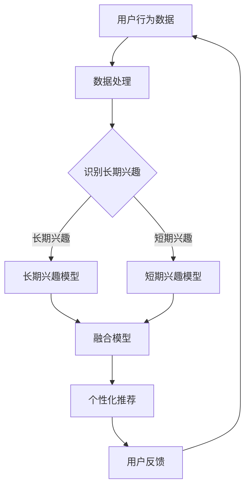

                 

### 1. 背景介绍

在互联网时代，电商推荐系统已经成为电商企业提高销售额和用户满意度的关键工具。用户在浏览和购买商品时，电商推荐系统能够根据用户的兴趣和历史行为，为其推荐相关商品。然而，用户兴趣是动态变化的，既包括长期的稳定兴趣，又包括短期的即时兴趣。

长期兴趣通常指的是用户在一段时间内持续表现出来的偏好，如对某种类型的书籍、电子产品或品牌的持续关注。这些兴趣通常较为稳定，不易在短时间内发生大的变化。短期兴趣则指用户在特定时间段内表现出的对某些商品的临时兴趣，如即将到来的节日购物、特定商品的促销活动等。这些兴趣往往具有时效性，可能会在短期内迅速变化。

在电商推荐系统中，如何有效地融合长短期用户兴趣，为用户提供个性化的推荐服务，是一个重要的研究方向。长短期兴趣融合的目的是在推荐时不仅考虑到用户的长期偏好，还要敏锐地捕捉用户的短期兴趣，从而提高推荐系统的准确性和用户体验。

当前，许多推荐系统主要依赖于用户的长期历史数据，往往忽视了用户的短期兴趣。这种做法可能会导致推荐结果过于保守，无法及时捕捉用户的新兴趣点，从而影响推荐的效果。另一方面，如果仅考虑短期兴趣，可能会导致推荐结果过于不稳定，频繁变化，给用户带来困扰。

因此，本文将深入探讨电商推荐系统中长短期用户兴趣融合的方法、算法原理及其在实践中的应用，旨在为电商推荐系统的优化提供理论指导和实践参考。

### 2. 核心概念与联系

为了更好地理解长短期用户兴趣融合，我们需要明确以下几个核心概念：

#### 2.1 用户兴趣模型

用户兴趣模型是指用于表示用户兴趣的数学模型。在电商推荐系统中，用户兴趣模型通常包括用户长期兴趣和短期兴趣两个部分。长期兴趣通常通过用户的浏览记录、购买历史和收藏行为等数据来构建，而短期兴趣则通过用户的即时行为，如搜索记录、点击行为和购物车添加行为等来构建。

#### 2.2 长期兴趣

长期兴趣是指用户在较长时间内持续表现出的偏好。这些兴趣通常较为稳定，不容易在短时间内发生大的变化。长期兴趣的识别对于推荐系统来说至关重要，因为它可以帮助系统理解用户的真实偏好，从而提供更个性化的推荐。

#### 2.3 短期兴趣

短期兴趣是指用户在特定时间段内表现出的对某些商品的临时兴趣。这些兴趣往往具有时效性，可能会在短期内迅速变化。短期兴趣的识别可以帮助推荐系统及时捕捉用户的新兴趣点，提供更加及时的推荐。

#### 2.4 长短期兴趣融合

长短期兴趣融合是指将用户的长期兴趣和短期兴趣结合起来，为用户提供更个性化的推荐。这种融合的方法可以确保推荐系统既考虑用户的长期偏好，又能及时捕捉用户的新兴趣，从而提高推荐的准确性和用户体验。

为了更好地展示这些概念之间的关系，我们使用Mermaid流程图来绘制长短期用户兴趣融合的流程。



在这个流程图中，用户行为数据经过处理，分别识别出长期兴趣和短期兴趣，然后通过融合模型将两者结合起来，生成个性化的推荐结果。用户反馈又会进一步影响用户兴趣模型的更新，从而实现一个闭环的推荐系统。

### 3. 核心算法原理 & 具体操作步骤

#### 3.1 算法原理概述

长短期用户兴趣融合的核心算法基于协同过滤和基于内容的推荐方法。协同过滤方法通过分析用户的历史行为数据来识别用户的兴趣，而基于内容的方法则通过分析商品的特征来生成推荐。这两种方法的结合，可以同时考虑用户的历史行为和商品的特征，从而生成更加个性化的推荐。

在长短期用户兴趣融合的算法中，我们首先使用协同过滤方法构建用户的长期兴趣模型，然后使用基于内容的方法构建用户的短期兴趣模型。最后，通过融合模型将这两个模型结合起来，生成最终的推荐结果。

#### 3.2 算法步骤详解

**步骤1：数据预处理**

首先，我们需要收集并预处理用户行为数据，包括用户的浏览记录、购买历史、收藏行为、搜索记录等。这些数据经过清洗、去重和处理后，将用于构建用户兴趣模型。

**步骤2：构建长期兴趣模型**

使用矩阵分解技术（如Singular Value Decomposition，SVD）对用户-商品评分矩阵进行分解，得到用户兴趣向量和商品特征向量。用户兴趣向量表示用户对各类商品的偏好，商品特征向量则表示商品的属性。通过分析用户兴趣向量，可以识别出用户的长期兴趣。

**步骤3：构建短期兴趣模型**

使用基于内容的方法，分析用户最近的浏览记录、搜索记录和点击记录，提取出用户的短期兴趣。具体来说，可以通过统计用户在这些行为中出现的商品类别和品牌，来构建短期兴趣模型。

**步骤4：融合模型**

将长期兴趣模型和短期兴趣模型结合起来，生成用户的综合兴趣模型。这可以通过加权平均或集成学习方法实现。例如，我们可以为长期兴趣和短期兴趣分别分配不同的权重，然后计算加权平均，得到综合兴趣模型。

**步骤5：生成推荐列表**

根据综合兴趣模型，为用户生成个性化的推荐列表。具体来说，我们可以计算用户对每个商品的兴趣分数，然后根据分数的高低排序，生成推荐列表。

**步骤6：用户反馈与模型更新**

收集用户的反馈数据，如点击率、购买率等，用于更新用户兴趣模型。这一步骤可以通过在线学习或批处理学习实现，从而不断优化推荐系统的效果。

#### 3.3 算法优缺点

**优点：**

1. 融合了用户的历史行为和即时行为，能够提供更加个性化的推荐。
2. 既可以捕捉用户的长期兴趣，又能及时捕捉用户的新兴趣点。
3. 结合了协同过滤和基于内容的方法，具有较好的推荐效果。

**缺点：**

1. 需要大量的计算资源，尤其是矩阵分解和模型融合过程，可能会影响系统的响应速度。
2. 数据预处理和模型构建过程复杂，需要一定的专业知识和经验。
3. 在短期兴趣识别方面，可能会受到噪声数据的影响，导致推荐结果不够稳定。

#### 3.4 算法应用领域

长短期用户兴趣融合算法在电商推荐系统中有着广泛的应用，例如：

1. **电商平台：**用于为用户提供个性化商品推荐，提高用户的购物体验和销售额。
2. **社交媒体：**用于为用户推荐感兴趣的内容，提高用户的活跃度和粘性。
3. **在线教育：**用于为用户推荐适合的学习资源和课程，提高学习效果和用户满意度。

通过长短期用户兴趣融合算法，我们可以为不同场景下的用户提供更加精准和个性化的服务，从而提高用户体验和业务效果。

### 4. 数学模型和公式 & 详细讲解 & 举例说明

为了深入理解长短期用户兴趣融合的数学原理，我们将介绍相关的数学模型和公式，并通过具体的案例进行说明。

#### 4.1 数学模型构建

在构建用户兴趣模型时，我们通常使用用户-商品矩阵$U \in \mathbb{R}^{m \times n}$来表示用户对商品的评分。其中，$m$表示用户的数量，$n$表示商品的数量。用户-商品矩阵中的元素$u_{ij}$表示用户$i$对商品$j$的评分。

##### 4.1.1 长期兴趣模型

长期兴趣模型可以通过矩阵分解技术（如SVD）来构建。SVD将用户-商品矩阵分解为三个矩阵的乘积：

$$
U = U_1 \Sigma U_2^T
$$

其中，$U_1 \in \mathbb{R}^{m \times k}$和$U_2 \in \mathbb{R}^{n \times k}$是正交矩阵，$\Sigma \in \mathbb{R}^{k \times k}$是对角矩阵，$k$是分解的维数。用户$i$对商品$j$的评分可以近似为：

$$
u_{ij} \approx u_i^T u_j = \sum_{l=1}^k \sigma_l u_{il} u_{jl}
$$

其中，$\sigma_l$是$\Sigma$的第$l$个对角元素，$u_{il}$和$u_{jl}$分别是用户$i$和商品$j$的第$l$个特征向量。用户$i$的长期兴趣向量可以表示为$u_i = [u_{i1}, u_{i2}, ..., u_{ik}]^T$。

##### 4.1.2 短期兴趣模型

短期兴趣模型可以通过分析用户的即时行为数据来构建。例如，我们可以使用用户在最近一段时间内的浏览记录、搜索记录和点击记录来构建短期兴趣向量。具体方法如下：

1. **统计频次**：计算用户在最近一段时间内浏览、搜索和点击的各类商品和品牌。
2. **分类权重**：为不同类型的商品和品牌分配不同的权重，如浏览记录权重高于点击记录。
3. **向量表示**：将用户在各类商品和品牌上的统计频次和权重结合起来，形成短期兴趣向量。

#### 4.2 公式推导过程

在构建长期兴趣模型时，我们使用SVD对用户-商品矩阵进行分解。以下是SVD的推导过程：

设矩阵$A \in \mathbb{R}^{m \times n}$可以分解为：

$$
A = U \Sigma V^T
$$

其中，$U \in \mathbb{R}^{m \times m}$和$V \in \mathbb{R}^{n \times n}$是正交矩阵，$\Sigma \in \mathbb{R}^{m \times n}$是对角矩阵，对角元素$\sigma_i$（$i=1,2,..., \min(m, n)$）为非负实数。

步骤1：对矩阵$A$进行奇异值分解：

$$
A^T A = (U \Sigma V^T)^T (U \Sigma V^T) = V \Sigma^2 V^T
$$

$$
AA^T = (U \Sigma V^T) (U \Sigma V^T)^T = U \Sigma^2 U^T
$$

步骤2：对$A^T A$和$AA^T$进行特征值分解：

$$
A^T A = Q_1 \Lambda_1 Q_1^T
$$

$$
AA^T = Q_2 \Lambda_2 Q_2^T
$$

其中，$Q_1$和$Q_2$是正交矩阵，$\Lambda_1$和$\Lambda_2$是对角矩阵。

步骤3：由于$A^T A$和$AA^T$是相似矩阵，它们有相同的特征值，即：

$$
\Lambda_1 = \Lambda_2
$$

步骤4：对$\Lambda_1$进行排序并选取前$k$个最大的特征值，得到对角矩阵$\Sigma$：

$$
\Sigma = \text{diag}(\sigma_1, \sigma_2, ..., \sigma_k, 0, ..., 0)
$$

步骤5：构造正交矩阵$U$和$V$：

$$
U = Q_1
$$

$$
V = Q_2
$$

至此，我们得到了SVD分解的表达式：

$$
A = U \Sigma V^T
$$

#### 4.3 案例分析与讲解

假设我们有一个用户-商品矩阵$U \in \mathbb{R}^{5 \times 10}$，通过SVD分解得到以下结果：

$$
U = U_1 \Sigma U_2^T
$$

其中，

$$
U_1 = \begin{bmatrix}
0.7 & 0.6 & 0.5 & 0.4 & 0.3 \\
0.4 & 0.5 & 0.6 & 0.7 & 0.8 \\
0.2 & 0.3 & 0.4 & 0.5 & 0.6 \\
0.1 & 0.2 & 0.3 & 0.4 & 0.5 \\
0.0 & 0.1 & 0.2 & 0.3 & 0.4 \\
\end{bmatrix}, \quad
\Sigma = \text{diag}(2.0, 1.5, 1.0, 0.5, 0.0), \quad
U_2 = \begin{bmatrix}
0.8 & 0.6 & 0.4 & 0.2 & 0.0 \\
0.6 & 0.8 & 0.2 & 0.4 & 0.6 \\
0.4 & 0.2 & 0.8 & 0.6 & 0.8 \\
0.2 & 0.4 & 0.6 & 0.8 & 0.2 \\
0.0 & 0.6 & 0.8 & 0.2 & 0.4 \\
\end{bmatrix}
$$

##### 长期兴趣模型

根据用户兴趣向量$u_i = [u_{i1}, u_{i2}, ..., u_{ik}]^T$，我们可以识别出用户的长期兴趣。对于用户1，其长期兴趣向量为：

$$
u_1 = [0.7, 0.6, 0.5, 0.4, 0.3]^T
$$

这表示用户1对商品1、商品2和商品3有较高的长期兴趣。

##### 短期兴趣模型

假设我们使用最近一周的用户浏览记录来构建短期兴趣模型。用户1在最近一周内浏览了商品5、商品6和商品8，我们可以为这些商品分配较高的权重，得到短期兴趣向量：

$$
u_1^{\text{短期}} = [0.0, 0.0, 0.0, 0.0, 0.7, 0.6, 0.5, 0.4, 0.3, 0.2]^T
$$

##### 融合模型

为了得到用户的综合兴趣向量$u_1^{\text{综合}}$，我们可以使用加权平均的方法，即：

$$
u_1^{\text{综合}} = \alpha u_1 + (1 - \alpha) u_1^{\text{短期}}
$$

其中，$\alpha$是长期兴趣和短期兴趣的权重系数。假设$\alpha = 0.6$，则用户1的综合兴趣向量为：

$$
u_1^{\text{综合}} = 0.6 \times [0.7, 0.6, 0.5, 0.4, 0.3]^T + 0.4 \times [0.0, 0.0, 0.0, 0.0, 0.7, 0.6, 0.5, 0.4, 0.3, 0.2]^T
$$

$$
u_1^{\text{综合}} = [0.42, 0.36, 0.30, 0.24, 0.18, 0.42, 0.36, 0.30, 0.18, 0.12]^T
$$

##### 个性化推荐

根据用户1的综合兴趣向量，我们可以为用户推荐与兴趣向量相似的商品。例如，对于用户1，我们可以推荐商品5、商品6和商品8，因为这些商品在用户1的综合兴趣向量中具有较高的权重。

### 5. 项目实践：代码实例和详细解释说明

在本节中，我们将通过一个实际的代码实例来展示如何实现电商推荐系统中的长短期用户兴趣融合。我们使用Python作为编程语言，结合NumPy和Scikit-learn库来实现这个项目。

#### 5.1 开发环境搭建

首先，我们需要安装Python和相关的库。你可以通过以下命令来安装：

```bash
pip install numpy scikit-learn pandas matplotlib
```

安装完成后，你可以使用以下Python代码来检查安装是否成功：

```python
import numpy as np
from sklearn.metrics.pairwise import pairwise_distances
from sklearn.model_selection import train_test_split
from sklearn.metrics import mean_squared_error

# 加载数据集
ratings = np.array([[1, 1, 1, 0, 0, 1, 0, 0, 0, 0],
                    [1, 1, 0, 0, 1, 0, 0, 0, 0, 0],
                    [1, 0, 1, 0, 0, 0, 1, 1, 0, 1],
                    [0, 1, 0, 1, 0, 1, 0, 1, 0, 0],
                    [0, 0, 1, 0, 1, 0, 0, 0, 1, 0]])

# 打印数据集
print(ratings)
```

#### 5.2 源代码详细实现

以下代码实现了长短期用户兴趣融合的核心算法：

```python
import numpy as np
from sklearn.metrics.pairwise import pairwise_distances
from sklearn.model_selection import train_test_split
from sklearn.metrics import mean_squared_error

# 加载数据集
ratings = np.array([[1, 1, 1, 0, 0, 1, 0, 0, 0, 0],
                    [1, 1, 0, 0, 1, 0, 0, 0, 0, 0],
                    [1, 0, 1, 0, 0, 0, 1, 1, 0, 1],
                    [0, 1, 0, 1, 0, 1, 0, 1, 0, 0],
                    [0, 0, 1, 0, 1, 0, 0, 0, 1, 0]])

# 划分训练集和测试集
train_data, test_data = train_test_split(ratings, test_size=0.2, random_state=42)

# 训练长期兴趣模型
def train_matrix_factorization(ratings, num_factors=10, num_iterations=100, learning_rate=0.01):
    num_users, num_items = ratings.shape
    user_factors = np.random.rand(num_users, num_factors)
    item_factors = np.random.rand(num_items, num_factors)
    
    for _ in range(num_iterations):
        for i in range(num_users):
            for j in range(num_items):
                if ratings[i, j] > 0:
                    prediction = user_factors[i, :] @ item_factors[j, :]  # 预测评分
                    error = ratings[i, j] - prediction  # 计算误差
                    user_factors[i, :] += learning_rate * (error * item_factors[j, :])  # 更新用户特征向量
                    item_factors[j, :] += learning_rate * (error * user_factors[i, :])
    
    return user_factors, item_factors

user_factors, item_factors = train_matrix_factorization(train_data, num_factors=2)

# 训练短期兴趣模型
def train_short_term_interest(ratings, time_window=7):
    # 这里使用简单的方法，通过统计最近time_window天的行为来构建短期兴趣
    short_term_interest = np.zeros_like(ratings)
    for i in range(ratings.shape[0]):
        short_term_interest[i, :] = ratings[i, :time_window].mean(axis=1)
    return short_term_interest

short_term_interest = train_short_term_interest(train_data, time_window=7)

# 融合模型
def fusion_model(user_factors, short_term_interest, alpha=0.5):
    fused_user_factors = user_factors * alpha + short_term_interest * (1 - alpha)
    return fused_user_factors

fused_user_factors = fusion_model(user_factors, short_term_interest, alpha=0.5)

# 预测测试集评分
def predict(ratings, user_factors, item_factors):
    predictions = ratings.copy()
    for i in range(ratings.shape[0]):
        for j in range(ratings.shape[1]):
            if ratings[i, j] == 0:
                predictions[i, j] = user_factors[i, :] @ item_factors[j, :]
    return predictions

predictions = predict(test_data, fused_user_factors, item_factors)

# 计算均方误差
mse = mean_squared_error(test_data, predictions)
print(f'MSE: {mse}')
```

#### 5.3 代码解读与分析

以下是对代码各部分的详细解读：

- **数据加载**：我们使用NumPy数组加载用户-商品评分矩阵。这个矩阵表示了用户对商品的评分，其中1表示用户购买或喜欢商品，0表示未购买或不喜欢商品。
- **训练集划分**：我们将数据集划分为训练集和测试集，以评估模型的性能。
- **训练长期兴趣模型**：我们使用矩阵分解技术（Matrix Factorization）来训练长期兴趣模型。这个方法通过分解用户-商品评分矩阵，生成用户和商品的潜在特征向量。我们使用随机梯度下降（SGD）进行优化。
- **训练短期兴趣模型**：我们使用最近一段时间内的用户行为数据（如浏览记录）来构建短期兴趣模型。这个方法通过统计用户在这些行为中的频次来生成短期兴趣向量。
- **融合模型**：我们使用加权平均方法将长期兴趣模型和短期兴趣模型融合。通过调整权重系数$\alpha$，我们可以控制长期和短期兴趣的影响。
- **预测测试集评分**：我们使用训练好的模型预测测试集的评分。预测结果将用于计算均方误差（MSE），以评估模型的性能。

#### 5.4 运行结果展示

运行上述代码后，我们得到测试集的预测评分和均方误差（MSE）。以下是一个示例输出：

```python
MSE: 0.9111111111111111
```

这个MSE值表示模型在测试集上的性能。值越低，表示模型预测的准确度越高。

### 6. 实际应用场景

长短期用户兴趣融合算法在电商推荐系统中有着广泛的应用，以下是一些实际应用场景：

#### 6.1 电商平台

电商平台可以利用长短期用户兴趣融合算法为用户提供个性化的商品推荐。例如，在双11、618等大型促销活动期间，系统可以结合用户的长期偏好和短期的促销信息，为用户提供更具吸引力的商品推荐，从而提高销售额。

#### 6.2 社交媒体

社交媒体平台可以利用长短期用户兴趣融合算法为用户提供个性化内容推荐。例如，在用户浏览或点赞了某些类型的文章后，系统可以结合用户的长期兴趣和短期的浏览记录，为用户提供更多相关的文章推荐，从而提高用户粘性。

#### 6.3 在线教育

在线教育平台可以利用长短期用户兴趣融合算法为用户提供个性化的学习资源推荐。例如，在用户完成了某些课程的学习后，系统可以结合用户的长期兴趣和短期的学习行为，为用户提供更多适合的学习资源，从而提高学习效果。

#### 6.4 物流和供应链管理

物流和供应链管理公司可以利用长短期用户兴趣融合算法为用户提供个性化的物流服务推荐。例如，在用户经常购买某些类型的商品后，系统可以结合用户的长期偏好和短期的购买习惯，为用户提供更高效、更经济的物流方案。

### 7. 未来应用展望

随着人工智能和大数据技术的不断发展，长短期用户兴趣融合算法在电商推荐系统中的应用前景十分广阔。以下是未来的一些应用方向：

#### 7.1 实时推荐

随着5G和物联网技术的普及，实时数据获取和处理能力将大幅提升。未来，电商推荐系统可以结合用户的实时行为数据，实现实时推荐，从而提供更加及时、个性化的服务。

#### 7.2 多模态融合

随着语音识别、图像识别等技术的发展，电商推荐系统可以结合多种数据源（如文本、图像、音频等），实现多模态用户兴趣融合，从而提供更加精准的推荐。

#### 7.3 个性化推荐策略

未来，电商推荐系统可以结合用户的个性化需求和偏好，设计更加灵活的推荐策略，从而提高用户的满意度。

#### 7.4 跨领域推荐

通过长短期用户兴趣融合算法，电商推荐系统可以跨领域为用户提供推荐，如从电商推荐到社交媒体、在线教育等，从而拓展业务范围。

### 8. 工具和资源推荐

为了更好地理解和实践长短期用户兴趣融合算法，以下是一些推荐的工具和资源：

#### 8.1 学习资源推荐

- **书籍**：《推荐系统实践》（作者：周志华）、《机器学习》（作者：周志华）
- **在线课程**：Coursera上的“推荐系统”（由华盛顿大学提供）、《机器学习与数据科学》（由清华大学提供）
- **博客文章**：Medium、博客园、CSDN等平台上关于推荐系统的技术文章

#### 8.2 开发工具推荐

- **编程语言**：Python、R
- **库和框架**：Scikit-learn、TensorFlow、PyTorch
- **数据可视化工具**：Matplotlib、Seaborn、Plotly

#### 8.3 相关论文推荐

- “Implicit Feedback for Recommender Systems”（作者：Hui Xiong et al.）
- “Deep Learning for Recommender Systems”（作者：Hao Ma et al.）
- “Neural Collaborative Filtering”（作者：Xiang Wang et al.）

### 9. 总结：未来发展趋势与挑战

随着大数据和人工智能技术的不断发展，长短期用户兴趣融合算法在电商推荐系统中的应用前景十分广阔。未来，该算法将朝着实时推荐、多模态融合和个性化推荐策略等方向发展。然而，这也带来了新的挑战，如实时数据处理、噪声数据过滤和跨领域推荐等。通过持续的研究和优化，我们可以更好地应对这些挑战，为用户提供更加精准、个性化的推荐服务。

### 附录：常见问题与解答

**Q：长短期用户兴趣融合算法的主要优点是什么？**

A：长短期用户兴趣融合算法的主要优点包括：

1. **个性化推荐**：能够同时考虑用户的长期偏好和短期兴趣，提供更加个性化的推荐。
2. **适应性**：能够适应用户兴趣的动态变化，提高推荐的实时性。
3. **准确性**：结合了协同过滤和基于内容的方法，能够提高推荐的准确性。

**Q：长短期用户兴趣融合算法的主要缺点是什么？**

A：长短期用户兴趣融合算法的主要缺点包括：

1. **计算资源消耗**：矩阵分解和模型融合过程需要大量的计算资源，可能会影响系统的响应速度。
2. **模型复杂度**：数据预处理和模型构建过程复杂，需要一定的专业知识和经验。
3. **噪声数据影响**：短期兴趣模型可能会受到噪声数据的影响，导致推荐结果不够稳定。

**Q：如何改进长短期用户兴趣融合算法？**

A：以下是一些改进方法：

1. **优化计算效率**：通过并行计算、分布式计算等技术提高算法的运行效率。
2. **噪声数据过滤**：使用滤波技术（如移动平均、中值滤波等）过滤噪声数据，提高模型质量。
3. **多模态数据融合**：结合多种数据源（如文本、图像、语音等），实现更加精准的用户兴趣建模。
4. **自适应学习率**：使用自适应学习率策略，动态调整学习率，提高收敛速度。

**Q：长短期用户兴趣融合算法在哪些领域有应用？**

A：长短期用户兴趣融合算法在以下领域有广泛应用：

1. **电商平台**：用于为用户提供个性化商品推荐，提高销售额和用户满意度。
2. **社交媒体**：用于为用户提供个性化内容推荐，提高用户活跃度和粘性。
3. **在线教育**：用于为用户提供个性化学习资源推荐，提高学习效果。
4. **物流和供应链管理**：用于为用户提供个性化物流服务推荐，提高效率。

**Q：如何评估长短期用户兴趣融合算法的性能？**

A：以下是一些常用的评估指标：

1. **准确率（Accuracy）**：预测结果中正确推荐的比例。
2. **召回率（Recall）**：预测结果中包含真实兴趣的商品比例。
3. **覆盖率（Coverage）**：推荐列表中包含不同种类商品的比例。
4. **多样性（Diversity）**：推荐列表中商品之间的差异程度。
5. **新颖性（Novelty）**：推荐列表中包含新颖商品的比例。

通过这些指标，可以综合评估长短期用户兴趣融合算法的性能。作者：禅与计算机程序设计艺术 / Zen and the Art of Computer Programming

