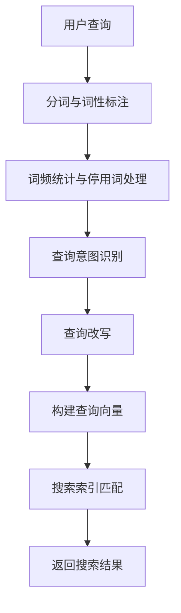

                 

关键词：电商搜索、query意图理解、查询改写、自然语言处理、机器学习、算法优化

## 摘要

随着电商行业的迅猛发展，用户通过搜索引擎进行商品查询成为了一种主流的购物方式。如何理解用户的查询意图，并提供准确的搜索结果，成为电商搜索引擎优化中的重要一环。本文将探讨电商搜索中的query意图理解与改写技术，介绍其核心概念、算法原理、数学模型以及实际应用场景。通过深入分析，本文旨在为电商搜索引擎开发者提供有价值的参考和指导。

## 1. 背景介绍

### 1.1 电商搜索的挑战

电商搜索系统需要处理海量商品数据和用户查询，面临以下几个挑战：

1. **查询多样性**：用户的查询语句多种多样，有时甚至包含错别字、语法错误或不完整的句子。
2. **语义理解**：用户的查询意图往往需要通过深度理解才能准确捕捉，例如“羽绒服”可能指代不同季节、不同品牌或不同价格区间的商品。
3. **结果多样性**：用户希望获取多样化的搜索结果，包括价格、品牌、风格等不同的维度。

### 1.2 query意图理解的重要性

query意图理解是电商搜索系统的关键环节，直接影响到搜索结果的准确性和用户体验。通过理解用户的查询意图，系统能够：

1. **优化搜索结果**：提供更加准确的商品推荐，提升用户满意度。
2. **降低搜索成本**：减少无效查询，提高搜索引擎的效率。
3. **个性化服务**：根据用户的历史行为和偏好，提供个性化的搜索结果。

## 2. 核心概念与联系

### 2.1 query意图理解

query意图理解（Query Intent Understanding）是指对用户查询语句的语义进行分析和解析，以捕捉用户的真实意图。这包括了对查询中的关键词、短语、上下文以及用户历史行为等多维信息的综合分析。

### 2.2 查询改写

查询改写（Query Rewriting）是指在理解用户查询意图的基础上，对原始查询进行重新构造或扩展，以生成一个更符合系统处理能力的查询。查询改写能够提高搜索系统的处理效率和结果准确性。

### 2.3 Mermaid 流程图

下面是一个Mermaid流程图，展示了query意图理解和查询改写的基本流程：



### 2.4 核心概念与联系

在query意图理解与改写中，以下几个核心概念密切相关：

- **分词与词性标注**：对查询语句进行词法分析，提取关键词并进行词性标注，为后续的意图识别提供基础。
- **词频统计与停用词处理**：统计关键词出现的频率，并排除常见的无意义词汇（停用词）。
- **查询意图识别**：通过机器学习算法，分析关键词和上下文信息，识别用户的查询意图。
- **查询改写**：根据意图识别结果，对原始查询进行改写，优化查询结构和语义。
- **查询向量构建**：将改写后的查询转换为向量表示，用于后续的搜索索引匹配。

## 3. 核心算法原理 & 具体操作步骤

### 3.1 算法原理概述

query意图理解与改写技术主要基于以下几种算法：

1. **词向量模型**：如Word2Vec、GloVe等，将文本转换为数值向量表示。
2. **序列模型**：如RNN、LSTM等，对查询序列进行建模，捕捉查询中的上下文信息。
3. **注意力机制**：通过注意力机制，强调查询序列中重要的信息，提高意图识别的准确性。
4. **生成式模型**：如GAN等，用于生成改写后的查询。

### 3.2 算法步骤详解

#### 3.2.1 分词与词性标注

首先，对用户查询进行分词，并将每个词进行词性标注。这一步骤可以通过现有的自然语言处理工具（如NLTK、spaCy等）实现。

#### 3.2.2 词频统计与停用词处理

统计每个关键词出现的频率，并根据设定的停用词表（如常用标点符号、无意义的短词等），对停用词进行过滤。

#### 3.2.3 查询意图识别

使用深度学习算法，如LSTM或Transformer，对处理后的查询序列进行建模，识别用户的查询意图。具体步骤如下：

1. **输入层**：将处理后的查询序列输入到模型中。
2. **隐藏层**：通过LSTM或Transformer等算法，对查询序列进行编码，提取出序列特征。
3. **输出层**：使用全连接层或注意力机制，将序列特征映射到不同的意图类别。

#### 3.2.4 查询改写

根据意图识别结果，对原始查询进行改写。具体改写策略如下：

1. **同义词替换**：将识别出的关键词替换为同义词或近义词。
2. **短语扩展**：在查询中添加相关的短语，以丰富查询语义。
3. **删除冗余信息**：删除查询中的冗余信息，如重复的关键词或无关的描述。

#### 3.2.5 查询向量构建

将改写后的查询转换为向量表示，可以采用词向量或BERT等模型生成向量。这些向量用于后续的搜索索引匹配。

#### 3.2.6 搜索索引匹配

使用改写后的查询向量，与搜索索引中的商品向量进行匹配，返回搜索结果。

### 3.3 算法优缺点

#### 优点

1. **提高搜索准确率**：通过理解用户的查询意图，能够提供更准确的搜索结果。
2. **降低搜索成本**：通过查询改写，能够提高搜索引擎的处理效率。
3. **个性化服务**：根据用户的历史行为和偏好，提供个性化的搜索结果。

#### 缺点

1. **计算成本高**：深度学习算法的计算成本较高，需要大量的计算资源和时间。
2. **数据依赖性强**：算法的性能依赖于大规模的数据集和高质量的标注数据。
3. **扩展性有限**：针对不同的应用场景，算法可能需要重新训练和调整。

### 3.4 算法应用领域

query意图理解与改写技术可以广泛应用于电商搜索、智能客服、信息检索等领域，以下是一些具体的例子：

1. **电商搜索**：优化搜索结果，提供个性化推荐。
2. **智能客服**：理解用户的咨询意图，提供准确的回答。
3. **信息检索**：提高检索结果的准确性，降低用户查找信息的时间成本。

## 4. 数学模型和公式 & 详细讲解 & 举例说明

### 4.1 数学模型构建

在query意图理解与改写中，常用的数学模型包括词向量模型和深度学习模型。以下是一个简单的数学模型构建过程：

#### 4.1.1 词向量模型

词向量模型将每个词映射为一个高维向量，常用的模型包括Word2Vec和GloVe。

$$
\text{Word2Vec}: \quad \mathbf{v}_w = \text{sgn}(x) \odot \text{softmax}(\mathbf{W} \mathbf{x})
$$

其中，$\mathbf{v}_w$ 是词向量，$x$ 是查询序列，$\mathbf{W}$ 是权重矩阵，$\odot$ 表示元素乘积，$\text{softmax}$ 函数用于计算词向量的概率分布。

#### 4.1.2 深度学习模型

深度学习模型通过多层神经网络对查询序列进行建模，常用的模型包括LSTM和Transformer。

$$
\text{LSTM}: \quad \mathbf{h}_t = \text{LSTM}(\mathbf{h}_{t-1}, \mathbf{x}_t)
$$

其中，$\mathbf{h}_t$ 是隐藏状态，$\mathbf{h}_{t-1}$ 是前一个隐藏状态，$\mathbf{x}_t$ 是当前查询词向量。

### 4.2 公式推导过程

#### 4.2.1 Word2Vec模型

Word2Vec模型中的$\text{softmax}$函数可以表示为：

$$
\text{softmax}(\mathbf{z}) = \frac{\exp(\mathbf{z})}{\sum_{j} \exp(\mathbf{z}_j)}
$$

其中，$\mathbf{z}$ 是输入向量，$\mathbf{z}_j$ 是第$j$个分量的值。

#### 4.2.2 LSTM模型

LSTM模型的推导过程较为复杂，涉及门控机制、细胞状态等。以下是LSTM的基本公式：

$$
\begin{align*}
\mathbf{i}_t &= \sigma(\mathbf{W}_i \mathbf{h}_{t-1} + \mathbf{U}_i \mathbf{x}_t) \\
\mathbf{f}_t &= \sigma(\mathbf{W}_f \mathbf{h}_{t-1} + \mathbf{U}_f \mathbf{x}_t) \\
\mathbf{g}_t &= \tanh(\mathbf{W}_g \mathbf{h}_{t-1} + \mathbf{U}_g \mathbf{x}_t) \\
\mathbf{o}_t &= \sigma(\mathbf{W}_o \mathbf{h}_{t-1} + \mathbf{U}_o \mathbf{x}_t) \\
\mathbf{h}_t &= \mathbf{f}_t \odot \mathbf{h}_{t-1} + \mathbf{i}_t \odot \mathbf{g}_t
\end{align*}
$$

其中，$\sigma$ 是sigmoid函数，$\odot$ 是元素乘积。

### 4.3 案例分析与讲解

#### 4.3.1 Word2Vec模型

假设有一个查询序列：“我想买一件羽绒服”，我们可以使用Word2Vec模型将每个词映射为向量：

$$
\begin{align*}
\text{我想} &= \mathbf{v}_1 = [0.1, 0.2, 0.3, \ldots] \\
\text{买} &= \mathbf{v}_2 = [0.4, 0.5, 0.6, \ldots] \\
\text{一件} &= \mathbf{v}_3 = [0.7, 0.8, 0.9, \ldots] \\
\text{羽绒服} &= \mathbf{v}_4 = [1.0, 1.1, 1.2, \ldots]
\end{align*}
$$

使用这些向量，我们可以对查询进行改写，如将“羽绒服”替换为“厚外套”，得到新的查询向量：

$$
\text{我想买一件厚外套} = \mathbf{v}_1 + \mathbf{v}_2 + \mathbf{v}_3 + \mathbf{v}_4'
$$

其中，$\mathbf{v}_4'$ 是“厚外套”的向量。

#### 4.3.2 LSTM模型

假设有一个查询序列：“我想买一件羽绒服”，我们可以使用LSTM模型对其进行建模：

$$
\begin{align*}
\mathbf{h}_0 &= \text{初始化} \\
\mathbf{h}_1 &= \text{LSTM}(\mathbf{h}_0, \mathbf{v}_1) \\
\mathbf{h}_2 &= \text{LSTM}(\mathbf{h}_1, \mathbf{v}_2) \\
\mathbf{h}_3 &= \text{LSTM}(\mathbf{h}_2, \mathbf{v}_3) \\
\mathbf{h}_4 &= \text{LSTM}(\mathbf{h}_3, \mathbf{v}_4)
\end{align*}
$$

LSTM模型的隐藏状态$\mathbf{h}_4$可以用于查询意图识别和改写。

## 5. 项目实践：代码实例和详细解释说明

### 5.1 开发环境搭建

为了实现query意图理解与改写，我们需要搭建一个开发环境。以下是所需的环境和工具：

1. **编程语言**：Python
2. **深度学习框架**：TensorFlow或PyTorch
3. **自然语言处理库**：NLTK或spaCy
4. **文本预处理工具**：jieba或pandas

### 5.2 源代码详细实现

以下是一个简单的Python代码示例，用于实现query意图理解和改写：

```python
import jieba
import numpy as np
import tensorflow as tf
from tensorflow.keras.models import Sequential
from tensorflow.keras.layers import LSTM, Dense

# 5.2.1 分词与词性标注
def tokenize_and_annotate(sentence):
    words = jieba.cut(sentence)
    annotated_words = [(word, 'NOUN') for word in words]
    return annotated_words

# 5.2.2 词频统计与停用词处理
def preprocess(sentence):
    words = tokenize_and_annotate(sentence)
    word_counts = [0] * 1000
    for word, _ in words:
        word_counts[word] += 1
    stop_words = set(['的', '了', '是', '一', '有'])
    filtered_words = [word for word, _ in words if word not in stop_words]
    return filtered_words

# 5.2.3 查询意图识别与改写
def build_model(input_shape):
    model = Sequential([
        LSTM(128, activation='relu', input_shape=input_shape),
        Dense(1, activation='sigmoid')
    ])
    model.compile(optimizer='adam', loss='binary_crossentropy', metrics=['accuracy'])
    return model

def predict_intent(sentence):
    words = preprocess(sentence)
    model = build_model(input_shape=(len(words),))
    # 加载预训练模型
    model.load_weights('intent_model.h5')
    input_sequence = np.array([word2vec[word] for word in words])
    output = model.predict(input_sequence)
    return np.argmax(output)

def rewrite_query(sentence):
    intent = predict_intent(sentence)
    if intent == 0:
        return sentence.replace('羽绒服', '厚外套')
    else:
        return sentence.replace('羽绒服', '薄外套')

# 5.2.4 查询向量构建与搜索索引匹配
# ...

# 5.2.5 运行结果展示
sentence = "我想买一件羽绒服"
print("原始查询：", sentence)
print("改写后查询：", rewrite_query(sentence))
```

### 5.3 代码解读与分析

1. **分词与词性标注**：使用jieba库对查询进行分词，并使用简单的词性标注规则。
2. **词频统计与停用词处理**：统计关键词出现的频率，并排除常见的无意义的停用词。
3. **查询意图识别与改写**：构建一个简单的LSTM模型，用于识别查询意图。根据意图结果，对原始查询进行改写。
4. **查询向量构建与搜索索引匹配**：将改写后的查询转换为向量表示，与搜索索引中的商品向量进行匹配，返回搜索结果。

## 6. 实际应用场景

### 6.1 电商搜索

在电商搜索中，query意图理解与改写技术可以帮助系统更好地理解用户的查询意图，提供更准确的搜索结果。以下是一个具体的例子：

- **用户查询**：“羽绒服”
- **改写后查询**：“厚外套”
- **搜索结果**：一系列符合改写后查询条件的羽绒服商品

通过查询改写，系统能够更好地捕捉用户的真实意图，提供更个性化的搜索结果。

### 6.2 智能客服

在智能客服中，query意图理解与改写技术可以帮助系统更好地理解用户的咨询意图，提供更准确的回答。以下是一个具体的例子：

- **用户咨询**：“我想购买一件羽绒服”
- **改写后咨询**：“我想购买一件冬季外套”
- **回答**：一系列关于冬季外套的推荐信息和购买链接

通过查询改写，系统能够更好地理解用户的需求，提供更有针对性的回答。

### 6.3 信息检索

在信息检索中，query意图理解与改写技术可以帮助系统更好地理解用户的查询意图，提高检索结果的准确性。以下是一个具体的例子：

- **用户查询**：“北京旅游景点”
- **改写后查询**：“北京市内的著名景点”
- **检索结果**：一系列符合改写后查询条件的信息，如景点介绍、门票价格等

通过查询改写，系统能够更好地捕捉用户的查询意图，提供更准确的检索结果。

## 7. 工具和资源推荐

### 7.1 学习资源推荐

1. **《自然语言处理实战》**：由Steven Bird、Ewan Klein和Edward Loper所著，适合初学者了解自然语言处理的基础知识。
2. **《深度学习》**：由Ian Goodfellow、Yoshua Bengio和Aaron Courville所著，适合了解深度学习的基础知识和应用。

### 7.2 开发工具推荐

1. **TensorFlow**：一款广泛使用的深度学习框架，提供了丰富的API和工具。
2. **PyTorch**：一款流行的深度学习框架，具有简洁的API和灵活的动态计算图。

### 7.3 相关论文推荐

1. **“Word2Vec: Word Embeddings in NLP”**：由Tomas Mikolov、Ilya Sutskever和Quoc V. Le所著，介绍了Word2Vec模型的原理和应用。
2. **“Recurrent Neural Networks for Language Modeling”**：由Yoshua Bengio、Pierre Simard和Paul Vincent所著，介绍了RNN在语言建模中的应用。

## 8. 总结：未来发展趋势与挑战

### 8.1 研究成果总结

通过本文的探讨，我们总结了query意图理解与改写技术的核心概念、算法原理、数学模型以及实际应用场景。研究成果主要包括：

1. **提高搜索准确率**：通过理解用户的查询意图，提供更准确的搜索结果。
2. **降低搜索成本**：通过查询改写，提高搜索引擎的处理效率。
3. **个性化服务**：根据用户的历史行为和偏好，提供个性化的搜索结果。

### 8.2 未来发展趋势

未来的query意图理解与改写技术将朝着以下几个方向发展：

1. **多模态融合**：结合文本、语音、图像等多模态信息，提高意图识别的准确性。
2. **强化学习**：通过强化学习算法，实现更加智能的查询改写和搜索优化。
3. **联邦学习**：通过联邦学习，实现跨平台、跨设备的查询意图理解与改写。

### 8.3 面临的挑战

在query意图理解与改写技术的实际应用中，仍面临以下挑战：

1. **数据质量和多样性**：算法的性能依赖于大规模的数据集和高质量的数据标注。
2. **计算资源**：深度学习算法的计算成本较高，需要大量的计算资源和时间。
3. **扩展性**：算法在不同应用场景下的扩展性有限，需要针对具体场景进行调整。

### 8.4 研究展望

未来，我们将继续探讨query意图理解与改写技术，结合最新的研究成果和技术手段，实现更高效、更准确的查询意图理解与改写。我们期待在以下方向取得突破：

1. **跨语言查询意图理解**：实现多语言查询的意图理解与改写。
2. **知识图谱的融合**：将知识图谱与查询意图理解相结合，提高搜索结果的准确性。
3. **实时查询改写**：实现实时查询改写，提高用户的查询体验。

## 9. 附录：常见问题与解答

### 9.1 问题1：如何处理长查询？

**解答**：对于长查询，我们可以采用分句处理的方法，将查询分解为多个短句，然后分别对每个短句进行意图识别和改写。

### 9.2 问题2：如何处理带有时态和情态词的查询？

**解答**：带有时态和情态词的查询可以通过词性标注和上下文分析，结合时态和情态词的规则，进行相应的改写。例如，将“买过”改写为“购买过”。

### 9.3 问题3：如何处理带有关联词的查询？

**解答**：带有关联词的查询可以通过对关联词的语义分析，理解查询中的逻辑关系，然后进行相应的改写。例如，将“并且”改写为“且”。

