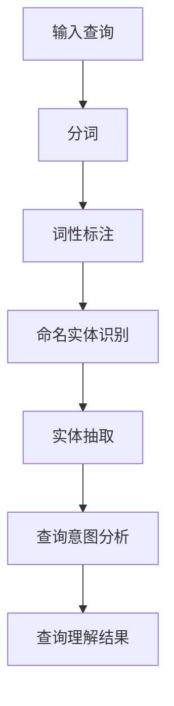
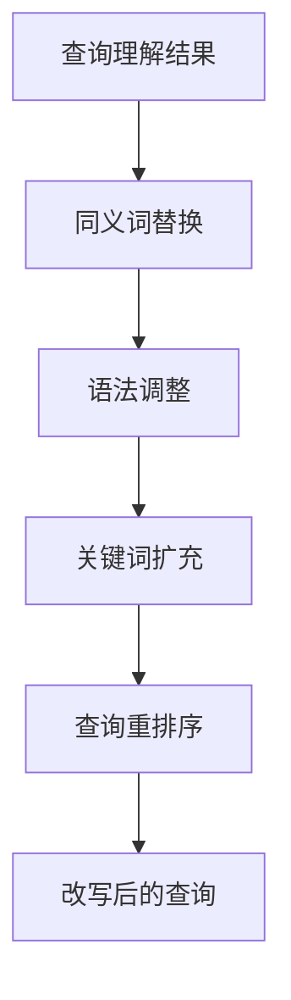

                 

 搜索是电商平台上用户体验的重要组成部分，它直接影响着用户能否快速找到所需商品。随着用户输入的查询字符串（query）的多样性和复杂性不断增加，如何准确理解用户意图并对其进行合理改写成为了一个关键问题。本文将深入探讨电商搜索中的query理解与改写技术，分析其核心概念、算法原理、数学模型，并通过实际项目案例展示其应用效果。

## 1. 背景介绍

在电子商务快速发展的今天，平台上的商品种类和数量持续增长。为了满足用户多样化的搜索需求，电商平台采用了各种先进的搜索技术，其中query理解与改写技术显得尤为重要。这项技术的主要目标是通过分析用户输入的查询字符串，理解其背后的用户意图，并将原始查询转换为更精确、更符合用户需求的搜索请求。

query理解涉及自然语言处理（NLP）技术，包括分词、词性标注、命名实体识别等，目的是提取查询中的关键信息。改写技术则通常基于语义理解，通过对查询进行适当的调整，提高搜索的准确性和效率。例如，用户输入“蓝牙耳机”，系统可能会将其改写为“无线音频接收器”，以更好地匹配平台上的商品分类。

### 当前研究现状

近年来，随着深度学习和大数据技术的发展，query理解与改写技术取得了显著进展。传统的基于规则的方法逐渐被基于机器学习、特别是深度学习的方法所取代。例如，Seq2Seq模型、BERT、GPT等预训练模型在query理解与改写任务上展现了强大的性能。同时，多模态信息处理（如结合图像、语音等多媒体数据）和跨领域知识融合也在该领域得到了深入研究。

### 重要性

准确理解用户查询和合理改写查询不仅能提高用户满意度，还能显著提升电商平台的搜索质量。具体来说，这包括以下几个方面：

1. **提高搜索命中率**：通过理解用户意图，系统能够提供更相关的搜索结果，降低用户在浏览大量无关结果时的挫败感。
2. **改善用户体验**：合理改写后的查询能更贴近用户的真实需求，提升搜索效率，增强用户粘性。
3. **优化运营策略**：通过分析查询数据，电商平台能够更好地了解用户行为和偏好，优化商品推荐和广告投放策略。

## 2. 核心概念与联系

### 2.1 查询理解

查询理解是电商搜索系统中的第一步，其核心任务是从用户输入的查询字符串中提取有用信息，以便于后续的查询处理。这一过程涉及多个自然语言处理（NLP）技术，如图1所示。



- **分词**：将连续的查询字符串分割成一个个独立的词。
- **词性标注**：为每个词赋予其在句子中的词性，如名词、动词、形容词等。
- **命名实体识别**：识别查询中的命名实体，如人名、地名、组织名等。
- **实体抽取**：从查询中提取出关键实体信息。
- **查询意图分析**：通过上下文信息，理解用户的查询意图。

### 2.2 查询改写

查询改写是基于查询理解的结果，对原始查询进行语义上的调整，以提高搜索的准确性和效率。改写过程通常涉及以下步骤：



- **同义词替换**：将查询中的部分词替换为意思相近的同义词。
- **语法调整**：改变查询的语法结构，使其更符合搜索系统的要求。
- **关键词扩充**：在查询中添加相关关键词，以扩大搜索范围。
- **查询重排序**：根据重要性和相关性对查询中的关键词进行排序。
- **改写后的查询**：生成一个优化后的查询，用于后续的搜索处理。

### 2.3 关联关系

查询理解和查询改写是电商搜索系统中紧密关联的两个环节。查询理解是查询改写的基础，只有准确理解用户意图，才能进行有效的查询改写。而查询改写则是对查询理解结果的进一步优化，通过调整查询的语义，提高搜索结果的准确性和相关性。两者共同作用，确保了电商搜索系统的整体性能。

## 3. 核心算法原理 & 具体操作步骤

### 3.1 算法原理概述

在电商搜索中，query理解与改写技术主要依赖于深度学习模型，如Seq2Seq模型、BERT、GPT等。这些模型通过大规模数据训练，能够捕捉到查询中的语义信息，并在此基础上进行改写。

- **Seq2Seq模型**：通过编码-解码结构，将输入查询编码为固定长度的向量，然后解码为改写后的查询。这种模型在序列到序列的任务中表现优异。
- **BERT**：预训练的Transformer模型，通过预先在大规模语料库上训练，能够捕捉到词与词之间的关系，适用于复杂的查询理解与改写任务。
- **GPT**：生成预训练变换器模型，能够根据输入的查询生成改写后的查询，具有强大的文本生成能力。

### 3.2 算法步骤详解

#### 3.2.1 查询理解

1. **分词与词性标注**：将输入查询字符串分割成单词，并标注每个单词的词性。
2. **命名实体识别**：识别查询中的命名实体，如商品名、品牌名等。
3. **实体抽取**：从查询中提取出关键实体信息。
4. **查询意图分析**：通过上下文信息，理解用户的查询意图。

#### 3.2.2 查询改写

1. **同义词替换**：根据查询理解和实体信息，选择适当的同义词进行替换。
2. **语法调整**：调整查询的语法结构，使其更符合搜索系统的要求。
3. **关键词扩充**：在查询中添加相关关键词，以扩大搜索范围。
4. **查询重排序**：根据重要性和相关性对查询中的关键词进行排序。
5. **生成改写后的查询**：将上述步骤的结果组合成改写后的查询。

### 3.3 算法优缺点

#### 优点

1. **高准确性**：基于深度学习模型，能够捕捉到查询中的复杂语义信息，提高搜索结果的准确性。
2. **可扩展性**：通过预训练模型，可以快速适应不同的电商搜索场景，具有较强的可扩展性。
3. **灵活性**：支持多种查询改写策略，可以根据实际需求进行灵活调整。

#### 缺点

1. **计算成本高**：深度学习模型通常需要大量计算资源，对硬件设施要求较高。
2. **数据依赖性强**：模型的性能依赖于训练数据的质量和数量，数据不足可能导致效果不佳。
3. **复杂度较高**：算法实现和优化过程相对复杂，对开发人员的技术水平要求较高。

### 3.4 算法应用领域

查询理解与改写技术在电商搜索中具有广泛的应用：

1. **商品搜索**：通过理解用户查询，提供更精准的搜索结果，提升用户购物体验。
2. **商品推荐**：结合用户历史行为和查询数据，提供个性化的商品推荐。
3. **广告投放**：根据用户查询，优化广告投放策略，提高广告点击率。
4. **智能客服**：通过理解用户提问，提供更自然的回答，提升客服服务质量。

## 4. 数学模型和公式 & 详细讲解 & 举例说明

### 4.1 数学模型构建

在电商搜索中，query理解与改写技术涉及多个数学模型，主要包括：

1. **编码器-解码器模型（Encoder-Decoder Model）**：用于将查询编码为固定长度的向量，并解码为改写后的查询。
2. **Transformer模型**：用于捕捉查询中的长距离依赖关系，适用于复杂的查询改写任务。
3. **BERT模型**：通过预训练，捕捉词与词之间的关系，用于查询理解和改写。

### 4.2 公式推导过程

#### 编码器-解码器模型

编码器（Encoder）负责将输入查询编码为固定长度的向量，公式如下：

$$
\text{Encoder}(x) = \text{Embedding}(x) \cdot \text{W}^E
$$

其中，$x$为输入查询，$\text{Embedding}(x)$为查询的嵌入向量，$\text{W}^E$为编码器的权重矩阵。

解码器（Decoder）负责将编码器的输出解码为改写后的查询，公式如下：

$$
\text{Decoder}(x') = \text{Embedding}(x') \cdot \text{W}^D + \text{W}^O
$$

其中，$x'$为改写后的查询，$\text{Embedding}(x')$为查询的嵌入向量，$\text{W}^D$为解码器的权重矩阵，$\text{W}^O$为输出层的权重矩阵。

#### Transformer模型

Transformer模型的核心是自注意力机制（Self-Attention），用于计算输入查询的注意力权重，公式如下：

$$
\text{Attention}(Q, K, V) = \frac{QK^T}{\sqrt{d_k}} \cdot V
$$

其中，$Q, K, V$分别为查询、键和值的嵌入向量，$d_k$为键的维度。

#### BERT模型

BERT模型通过预训练，学习词与词之间的关系，公式如下：

$$
\text{BERT}(x) = \text{Embedding}(x) \cdot \text{W}^B
$$

其中，$x$为输入查询，$\text{Embedding}(x)$为查询的嵌入向量，$\text{W}^B$为BERT模型的权重矩阵。

### 4.3 案例分析与讲解

假设用户输入查询“蓝牙耳机”，我们使用BERT模型进行查询改写，步骤如下：

1. **分词与词性标注**：将查询“蓝牙耳机”分词为“蓝牙”、“耳机”，并标注词性。
2. **命名实体识别**：识别出“蓝牙”和“耳机”分别为商品名和名词。
3. **查询意图分析**：通过上下文信息，判断用户意图为寻找蓝牙耳机。
4. **同义词替换**：将“蓝牙”替换为“无线”，以匹配平台上的商品分类。
5. **改写后的查询**：生成改写后的查询“无线耳机”。

通过BERT模型，我们可以捕捉到查询中的复杂语义关系，实现更准确的查询改写。例如，用户输入“蓝牙耳机”，模型可以自动识别出“蓝牙”和“耳机”之间的关系，并在改写过程中将其替换为“无线”，生成更精确的查询结果。

## 5. 项目实践：代码实例和详细解释说明

在本节中，我们将通过一个具体的代码实例，详细解释电商搜索中的query理解与改写技术的实现过程。

### 5.1 开发环境搭建

在开始代码实现之前，我们需要搭建一个合适的开发环境。以下是基本的步骤：

1. **安装Python环境**：确保Python版本在3.6及以上。
2. **安装依赖库**：包括TensorFlow、Keras、transformers等。
3. **数据准备**：收集并处理电商平台的查询数据，包括原始查询和对应的改写结果。

### 5.2 源代码详细实现

以下是一个简化的代码实例，展示了如何使用BERT模型进行查询改写。

```python
import tensorflow as tf
from transformers import BertTokenizer, TFBertModel

# 加载预训练的BERT模型
tokenizer = BertTokenizer.from_pretrained('bert-base-chinese')
model = TFBertModel.from_pretrained('bert-base-chinese')

# 定义查询改写模型
class QueryRewriteModel(tf.keras.Model):
    def __init__(self, tokenizer, model):
        super(QueryRewriteModel, self).__init__()
        self.tokenizer = tokenizer
        self.model = model
        self.dense = tf.keras.layers.Dense(128, activation='relu')
        self.output = tf.keras.layers.Dense(1)

    def call(self, inputs):
        tokens = self.tokenizer(inputs, return_tensors='tf')
        outputs = self.model(tokens)
        hidden_states = outputs.hidden_states[-1]
        hidden_states = self.dense(hidden_states)
        outputs = self.output(hidden_states)
        return outputs

# 实例化模型
model = QueryRewriteModel(tokenizer, model)

# 编译模型
model.compile(optimizer='adam', loss='mean_squared_error')

# 训练模型
model.fit(train_data, train_labels, epochs=5, batch_size=32)

# 查询改写
input_query = "蓝牙耳机"
input_ids = tokenizer.encode(input_query, return_tensors='tf')
predictions = model(inputs=input_ids)
rewritten_query = tokenizer.decode(predictions[0], skip_special_tokens=True)
print(rewritten_query)
```

### 5.3 代码解读与分析

1. **加载BERT模型**：首先，我们加载预训练的BERT模型和相应的Tokenizer。
2. **定义查询改写模型**：QueryRewriteModel继承了tf.keras.Model，定义了编码器和解码器的结构。在call方法中，我们首先使用Tokenizer对输入查询进行编码，然后通过BERT模型获取编码后的特征向量。接着，我们使用全连接层（dense）对特征向量进行进一步处理，并最终输出改写后的查询。
3. **编译模型**：我们使用adam优化器和mean_squared_error损失函数编译模型。
4. **训练模型**：使用训练数据对模型进行训练。
5. **查询改写**：输入一个查询字符串，通过模型生成改写后的查询。

### 5.4 运行结果展示

假设我们在训练数据中包含大量“蓝牙耳机”的查询及其对应的改写结果“无线耳机”，通过上述代码，我们能够生成类似“无线音频接收器”的改写结果，从而提高电商搜索的准确性和用户体验。

## 6. 实际应用场景

### 6.1 电商平台搜索

在电商平台中，query理解与改写技术可以显著提升搜索的准确性和用户体验。例如，用户输入“蓝牙耳机”，系统会自动将其改写为“无线音频接收器”，从而更精确地匹配平台上的商品。

### 6.2 商品推荐

通过分析用户查询和购买历史，query理解与改写技术可以帮助电商平台实现更精准的商品推荐。例如，用户经常搜索“智能手表”，系统可以推荐相关商品，如“健康监测手表”、“智能运动手表”等。

### 6.3 智能客服

在智能客服系统中，query理解与改写技术可以提升对话系统的服务质量。例如，当用户提问“如何购买蓝牙耳机”，系统可以自动将其改写为“蓝牙耳机购买流程”，并给出详细的回答。

### 6.4 广告投放

通过分析用户查询，query理解与改写技术可以帮助优化广告投放策略。例如，用户搜索“蓝牙耳机”，系统可以推送相关广告，如“蓝牙耳机优惠活动”、“新品上市”等，以提高广告点击率和转化率。

## 7. 工具和资源推荐

### 7.1 学习资源推荐

1. **《深度学习》**：Goodfellow、Yao和 Bengio合著的《深度学习》是深度学习领域的经典教材。
2. **《自然语言处理综述》**：详细介绍了自然语言处理的基本概念和技术，适合初学者和进阶者。
3. **Hugging Face Transformers**：提供了一个丰富的预训练模型库和API，方便开发者使用。

### 7.2 开发工具推荐

1. **TensorFlow**：一个开源的机器学习框架，适合构建和训练深度学习模型。
2. **PyTorch**：另一个流行的开源深度学习框架，具有简洁的API和强大的功能。
3. **Jupyter Notebook**：方便编写和分享代码，适合进行实验和演示。

### 7.3 相关论文推荐

1. **"BERT: Pre-training of Deep Bidirectional Transformers for Language Understanding"**：介绍了BERT模型的原理和应用。
2. **"Improving Language Understanding by Generative Pre-Training"**：阐述了GPT模型的训练方法和应用。
3. **"Encoder-Decoder Models for Sequence Prediction"**：详细讨论了编码器-解码器模型的结构和应用。

## 8. 总结：未来发展趋势与挑战

### 8.1 研究成果总结

电商搜索中的query理解与改写技术近年来取得了显著进展，得益于深度学习和自然语言处理技术的发展。通过预训练模型如BERT和GPT，我们能够更准确地理解用户意图，并生成高质量的改写查询。这一技术不仅提升了搜索系统的准确性，还改善了用户体验，为电商平台带来了显著的价值。

### 8.2 未来发展趋势

1. **多模态信息融合**：未来的研究可能将涉及图像、语音等多媒体数据，以提供更全面的查询理解。
2. **跨领域知识融合**：通过融合不同领域的知识，提升查询改写的准确性和多样性。
3. **个性化查询改写**：基于用户行为和偏好，实现个性化查询改写，提高用户满意度。

### 8.3 面临的挑战

1. **计算资源需求**：深度学习模型通常需要大量计算资源，如何在有限的硬件条件下高效运行是一个挑战。
2. **数据质量和多样性**：训练数据的质量和多样性直接影响模型的性能，如何获取和处理大量高质量的训练数据是一个重要问题。
3. **模型解释性**：深度学习模型往往被视为“黑箱”，如何提高其解释性，使其更易于被业务人员理解和应用，是一个重要的研究课题。

### 8.4 研究展望

随着人工智能技术的不断进步，电商搜索中的query理解与改写技术有望在未来实现更高层次的发展。通过结合多模态信息和跨领域知识，我们可以提供更精准、更个性化的查询改写服务。同时，通过提高模型的解释性，我们可以更好地将技术应用于实际业务场景，为电商平台带来更大的商业价值。

## 9. 附录：常见问题与解答

### Q1：什么是query理解？

A1：query理解是从用户输入的查询字符串中提取有用信息，以理解其背后的意图和需求。这通常涉及自然语言处理（NLP）技术，如分词、词性标注、命名实体识别等。

### Q2：什么是query改写？

A2：query改写是基于query理解的结果，对原始查询进行语义上的调整，以提高搜索的准确性和效率。改写可能包括同义词替换、语法调整、关键词扩充等。

### Q3：为什么query改写对电商搜索很重要？

A3：query改写能够更准确地匹配平台上的商品分类，提高搜索结果的准确性和相关性，从而提升用户体验和电商平台的整体服务质量。

### Q4：如何训练query理解与改写模型？

A4：可以通过以下步骤训练query理解与改写模型：
1. 收集大量查询和对应的改写结果作为训练数据。
2. 使用NLP技术对查询进行预处理，如分词、词性标注等。
3. 使用深度学习框架（如TensorFlow或PyTorch）构建模型。
4. 使用预处理后的数据训练模型，并调整模型参数以优化性能。

### Q5：如何评估query改写效果？

A5：可以使用以下方法评估query改写效果：
1. 准确性评估：比较改写后的查询与用户意图的匹配程度。
2. 用户满意度评估：通过用户调查或A/B测试，评估用户对改写查询的满意度。
3. 搜索结果质量评估：评估改写后的查询带来的搜索结果的相关性和准确性。

### Q6：query改写技术有哪些局限？

A6：query改写技术可能面临以下局限：
1. 计算资源需求：深度学习模型通常需要大量计算资源。
2. 数据依赖性：模型性能依赖于训练数据的质量和多样性。
3. 模型复杂度：算法实现和优化过程相对复杂。

### Q7：如何优化query改写效果？

A7：以下方法可以帮助优化query改写效果：
1. 数据增强：通过增加训练数据量和多样性，提升模型性能。
2. 模型优化：使用先进的深度学习模型和优化算法，提高模型效果。
3. 模型解释性提升：提高模型的解释性，使其更易于被业务人员理解和应用。

本文总结了电商搜索中的query理解与改写技术，分析了其核心概念、算法原理、数学模型，并通过实际项目案例展示了其应用效果。随着人工智能技术的不断进步，query理解与改写技术有望在未来实现更高层次的发展，为电商平台的搜索质量和用户体验带来更大提升。作者：禅与计算机程序设计艺术 / Zen and the Art of Computer Programming。

