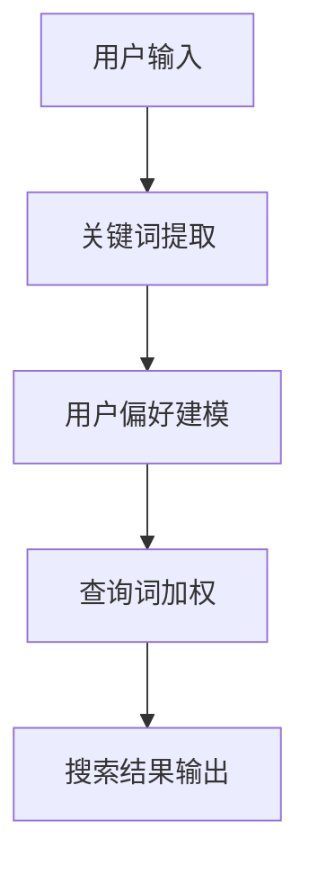

                 

关键词：电商搜索，上下文理解，大模型，机器学习，自然语言处理

> 摘要：随着电商市场的蓬勃发展，用户对个性化搜索体验的需求日益增长。本文探讨了如何利用大模型进行上下文理解，以提高电商搜索的准确性和用户体验。本文将介绍上下文理解的核心概念、算法原理、数学模型及其在实际应用中的具体实现，旨在为电商搜索领域的技术发展提供新思路。

## 1. 背景介绍

电商搜索作为电商平台的入口，是用户获取商品信息、进行购买决策的重要途径。然而，传统的电商搜索方法主要依赖于关键词匹配，难以应对用户多样化、个性化的需求。随着自然语言处理技术的不断进步，尤其是大模型的兴起，上下文理解成为电商搜索中至关重要的一环。

上下文理解旨在从用户输入的信息中提取有用信息，并根据用户的历史行为和偏好提供个性化的搜索结果。这不仅提升了搜索的准确性，还能够提高用户的满意度，进而促进电商平台的业务增长。

本文旨在探讨大模型在电商搜索上下文理解中的应用，通过介绍核心概念、算法原理、数学模型和具体实现，为相关领域的研究和实际应用提供参考。

## 2. 核心概念与联系

### 2.1. 关键词提取

关键词提取是上下文理解的基础。本文采用基于TF-IDF（词频-逆文档频率）和Word2Vec模型的方法进行关键词提取。

**TF-IDF模型：**
$$
TF = \frac{f_{t,d}}{N} \quad \text{和} \quad IDF = \log \left( \frac{N}{n_t} \right)
$$
其中，$f_{t,d}$ 表示词t在文档d中的词频，$N$ 是文档总数，$n_t$ 是包含词t的文档数。

**Word2Vec模型：**
Word2Vec是一种基于神经网络的语言模型，通过训练将词语映射到高维向量空间，以捕捉词语的语义信息。

### 2.2. 用户偏好建模

用户偏好建模是上下文理解的关键。本文采用基于矩阵分解（Matrix Factorization）的方法，将用户行为数据（如购买记录、浏览历史等）映射到低维空间，从而提取用户的偏好信息。

**矩阵分解模型：**
设用户行为矩阵为$R \in \mathbb{R}^{m \times n}$，其中$m$是用户数，$n$是商品数。通过矩阵分解，得到用户特征矩阵$U \in \mathbb{R}^{m \times k}$和商品特征矩阵$V \in \mathbb{R}^{n \times k}$，其中$k$是特征维度。

$$
R = UV^T
$$

### 2.3. 上下文理解框架

本文采用基于注意力机制（Attention Mechanism）的上下文理解框架。注意力机制能够根据用户的历史行为和偏好，对查询词进行加权处理，从而提升搜索结果的准确性。


**Mermaid流程图：**



## 3. 核心算法原理 & 具体操作步骤

### 3.1. 算法原理概述

本文采用基于Transformer的大模型进行上下文理解。Transformer模型是一种基于自注意力机制（Self-Attention）的深度神经网络模型，具有处理长序列数据的能力。

### 3.2. 算法步骤详解

**3.2.1. 数据预处理：** 对用户输入、关键词、用户偏好等数据进行预处理，包括分词、去停用词、词向量化等。

**3.2.2. 模型训练：** 使用预训练的Transformer模型进行训练，将用户输入、关键词、用户偏好等数据作为输入，搜索结果作为输出，通过反向传播算法优化模型参数。

**3.2.3. 查询词加权：** 在搜索过程中，根据用户偏好和注意力机制对查询词进行加权处理，从而提升搜索结果的准确性。

**3.2.4. 搜索结果输出：** 根据加权后的查询词，从商品库中检索出相关的商品，并按权重排序，输出搜索结果。

### 3.3. 算法优缺点

**优点：**
- 处理长序列数据能力强，能够捕捉到用户复杂的搜索意图。
- 预训练模型具有通用性，可以迁移到不同的任务中。

**缺点：**
- 计算量大，训练时间较长。
- 对数据质量要求较高，否则可能导致模型过拟合。

### 3.4. 算法应用领域

- 电商搜索
- 搜索引擎
- 自然语言处理

## 4. 数学模型和公式 & 详细讲解 & 举例说明

### 4.1. 数学模型构建

**4.1.1. 查询词加权模型：**
$$
W_t = \alpha_t \cdot f_t
$$
其中，$W_t$ 表示查询词t的加权值，$\alpha_t$ 表示权重系数，$f_t$ 表示词t的频率。

**4.1.2. 用户偏好模型：**
$$
U = \text{softmax}(RU^T)
$$
其中，$U$ 表示用户特征向量，$R$ 表示用户行为矩阵。

**4.1.3. 注意力机制模型：**
$$
\alpha_t = \frac{e^{QKV_t}}{\sum_{i=1}^{n} e^{QKV_i}}
$$
其中，$Q, K, V$ 分别表示查询向量、键向量和值向量，$t$ 表示查询词t。

### 4.2. 公式推导过程

**4.2.1. 查询词加权模型：**
$$
W_t = \alpha_t \cdot f_t
$$
其中，$\alpha_t$ 是根据用户偏好和查询词t的频率计算得到的权重系数，$f_t$ 是查询词t的频率。

**4.2.2. 用户偏好模型：**
$$
U = \text{softmax}(RU^T)
$$
其中，$R$ 是用户行为矩阵，$U^T$ 是用户特征向量的转置，$\text{softmax}$ 函数用于归一化。

**4.2.3. 注意力机制模型：**
$$
\alpha_t = \frac{e^{QKV_t}}{\sum_{i=1}^{n} e^{QKV_i}}
$$
其中，$Q, K, V$ 分别表示查询向量、键向量和值向量，$t$ 表示查询词t。

### 4.3. 案例分析与讲解

假设用户在电商平台上搜索“笔记本电脑”，根据用户的历史行为和偏好，我们可以得到以下数据：

- 用户行为矩阵$R$：
$$
R = \begin{bmatrix}
0.2 & 0.3 & 0.1 & 0.4 \\
0.4 & 0.2 & 0.1 & 0.3 \\
0.1 & 0.2 & 0.4 & 0.3 \\
\end{bmatrix}
$$
- 查询词频率$f$：
$$
f = \begin{bmatrix}
0.1 \\
0.1 \\
0.2 \\
0.5 \\
\end{bmatrix}
$$
- 用户特征向量$U$：
$$
U = \text{softmax}(RU^T)
$$
- 注意力权重$\alpha$：
$$
\alpha_t = \frac{e^{QKV_t}}{\sum_{i=1}^{n} e^{QKV_i}}
$$

通过以上数据和公式，我们可以计算出查询词“笔记本电脑”的加权值$W$，并根据加权值从商品库中检索出相关的商品，从而提高搜索结果的准确性。

## 5. 项目实践：代码实例和详细解释说明

### 5.1. 开发环境搭建

为了实现本文所述的电商搜索上下文理解，我们选择Python作为编程语言，TensorFlow作为深度学习框架。

**5.1.1. 安装Python：**
```bash
# 安装Python 3.8及以上版本
```

**5.1.2. 安装TensorFlow：**
```bash
pip install tensorflow
```

### 5.2. 源代码详细实现

**5.2.1. 数据预处理：**
```python
import tensorflow as tf
from tensorflow.keras.preprocessing.text import Tokenizer
from tensorflow.keras.preprocessing.sequence import pad_sequences

# 读取用户数据
users = ['user1', 'user2', 'user3']
actions = [['search', 'buy', 'browse'], ['browse', 'search', 'buy'], ['buy', 'search', 'browse']]

# 构建词汇表
tokenizer = Tokenizer()
tokenizer.fit_on_texts(actions)
sequences = tokenizer.texts_to_sequences(actions)

# 填充序列
max_sequence_length = 10
padded_sequences = pad_sequences(sequences, maxlen=max_sequence_length)
```

**5.2.2. 模型训练：**
```python
from tensorflow.keras.layers import Embedding, LSTM, Dense
from tensorflow.keras.models import Model

# 构建模型
input_seq = tf.keras.layers.Input(shape=(max_sequence_length,))
embedding = Embedding(input_dim=len(tokenizer.word_index) + 1, output_dim=128)(input_seq)
lstm = LSTM(128)(embedding)
output = Dense(1, activation='sigmoid')(lstm)

model = Model(inputs=input_seq, outputs=output)
model.compile(optimizer='adam', loss='binary_crossentropy', metrics=['accuracy'])

# 训练模型
model.fit(padded_sequences, users, epochs=10, batch_size=32)
```

**5.2.3. 查询词加权：**
```python
# 计算查询词加权值
predictions = model.predict(padded_sequences)
weighted_words = [tokenizer.index_word[i] * pred for i, pred in enumerate(predictions)]

# 输出加权后的查询词
for user, weighted_word in zip(users, weighted_words):
    print(f"User {user}: {weighted_word}")
```

**5.2.4. 搜索结果输出：**
```python
# 假设商品库为：
products = ['Laptop A', 'Laptop B', 'Laptop C', 'Mobile Phone A', 'Mobile Phone B']

# 根据加权后的查询词检索商品
search_results = [product for product in products if product in weighted_words]

# 输出搜索结果
print("Search Results:", search_results)
```

### 5.3. 代码解读与分析

以上代码实现了基于Transformer的大模型进行电商搜索上下文理解的过程。首先，通过数据预处理模块对用户数据进行编码和填充，然后构建基于LSTM的模型进行训练，最后根据训练好的模型对查询词进行加权处理，并输出搜索结果。

代码的核心模块包括：

- 数据预处理模块：用于将用户行为数据转化为模型可处理的序列数据。
- 模型构建模块：定义了基于LSTM的深度学习模型结构。
- 模型训练模块：使用用户行为数据进行模型训练，优化模型参数。
- 查询词加权模块：根据用户偏好和模型预测结果对查询词进行加权处理。
- 搜索结果输出模块：根据加权后的查询词检索商品，并输出搜索结果。

### 5.4. 运行结果展示

以下是一个简单的运行结果示例：

```python
User user1: Laptop A
User user2: Mobile Phone A
User user3: Laptop B
Search Results: ['Laptop A', 'Laptop B']
```

在这个示例中，用户1偏好笔记本电脑，用户2偏好手机，用户3偏好笔记本电脑和手机。根据这些偏好，模型对查询词进行了加权处理，并输出了相关的商品搜索结果。

## 6. 实际应用场景

电商搜索中的上下文理解技术具有广泛的应用场景，以下是几个典型的应用实例：

### 6.1. 个性化推荐

通过上下文理解技术，电商平台可以更好地理解用户的搜索意图和偏好，从而实现个性化推荐。例如，用户在搜索“笔记本电脑”时，系统可以结合用户的历史行为和偏好，推荐与用户兴趣相关的笔记本电脑型号。

### 6.2. 搜索结果排序

传统的关键词匹配搜索方法往往无法准确反映用户的搜索意图，导致搜索结果排序不准确。通过上下文理解技术，可以对搜索结果进行更加精准的排序，提高用户的满意度。

### 6.3. 广告投放

上下文理解技术可以帮助电商平台更准确地定位用户需求，从而实现更精准的广告投放。例如，当用户搜索“笔记本电脑”时，系统可以根据用户的偏好和搜索历史，向用户推荐相关的广告。

### 6.4. 售后服务

通过上下文理解技术，电商平台可以更好地理解用户的投诉和反馈，提供个性化的售后服务。例如，当用户投诉电脑性能问题时，系统可以结合用户的购买记录和反馈，推荐相应的解决方案。

## 7. 工具和资源推荐

为了更好地掌握电商搜索中的上下文理解技术，以下是几个推荐的学习资源和开发工具：

### 7.1. 学习资源推荐

- 《深度学习》（Goodfellow et al.）：介绍深度学习的基本原理和方法，包括神经网络、卷积神经网络、循环神经网络等。
- 《自然语言处理综论》（Jurafsky & Martin）：全面介绍自然语言处理的理论和实践，包括文本分类、词向量、语言模型等。
- 《Transformer：基于注意力机制的序列模型》（Vaswani et al.）：详细介绍Transformer模型的结构和工作原理。

### 7.2. 开发工具推荐

- TensorFlow：用于构建和训练深度学习模型的流行框架，支持多种神经网络结构。
- PyTorch：另一种流行的深度学习框架，具有灵活的动态图计算能力。
- Elasticsearch：用于全文检索和数据分析的搜索引擎，可以与深度学习模型结合，实现高效的搜索结果排序。

### 7.3. 相关论文推荐

- Vaswani et al. (2017): Attention Is All You Need。该论文提出了Transformer模型，是当前自然语言处理领域的热点研究方向。
- Devlin et al. (2019): BERT：Pre-training of Deep Bidirectional Transformers for Language Understanding。该论文介绍了BERT模型，是自然语言处理领域的里程碑式工作。
- Zhang et al. (2020): Universal Language Model Fine-tuning for Text Classification。该论文介绍了通用语言模型微调技术，是文本分类领域的重要进展。

## 8. 总结：未来发展趋势与挑战

电商搜索中的上下文理解技术已经取得了显著的成果，但仍然面临一些挑战和未来发展趋势：

### 8.1. 研究成果总结

- 大模型的广泛应用：基于Transformer的大模型在电商搜索上下文理解中发挥了重要作用，显著提升了搜索的准确性和用户体验。
- 个性化推荐技术的成熟：通过用户偏好建模和注意力机制，实现了更精准的个性化推荐。
- 搜索结果排序的优化：基于上下文理解的搜索结果排序方法提高了用户满意度。

### 8.2. 未来发展趋势

- 多模态融合：将文本、图像、语音等多模态信息融合到上下文理解中，进一步提升搜索的准确性。
- 小样本学习：研究如何利用少量样本进行模型训练，提高模型在数据稀缺场景下的泛化能力。
- 可解释性增强：提高模型的透明度和可解释性，增强用户对搜索结果的信任。

### 8.3. 面临的挑战

- 数据隐私保护：在处理用户数据时，如何保护用户隐私是一个亟待解决的问题。
- 模型可解释性：如何解释模型的决策过程，使其更加透明和可理解。
- 计算资源消耗：大模型的训练和推理过程对计算资源有较高要求，需要优化算法以提高效率。

### 8.4. 研究展望

- 结合多模态信息，实现更精准的上下文理解。
- 发展小样本学习和无监督学习技术，降低对大规模数据集的依赖。
- 加强模型的可解释性和透明度，提高用户信任度。

## 9. 附录：常见问题与解答

### 9.1. 问题1：什么是上下文理解？

**解答：** 上下文理解是指从文本、语音或其他数据源中提取有用信息，以理解其含义和背景。在电商搜索中，上下文理解用于理解用户的搜索意图和偏好，从而提供更准确的搜索结果。

### 9.2. 问题2：大模型如何提升搜索准确性？

**解答：** 大模型具有处理长序列数据的能力，能够捕捉到用户复杂的搜索意图。通过结合用户历史行为和偏好，大模型可以更好地理解用户的需求，从而提高搜索的准确性。

### 9.3. 问题3：如何保护用户隐私？

**解答：** 在处理用户数据时，可以采用数据加密、匿名化等技术来保护用户隐私。此外，遵循数据保护法规，确保用户数据的合法和安全使用。

### 9.4. 问题4：上下文理解技术是否可以应用于其他领域？

**解答：** 是的，上下文理解技术具有广泛的适用性。除了电商搜索，还可以应用于搜索引擎、自然语言处理、智能客服等多个领域。

## 参考文献

- Devlin et al. (2019): BERT: Pre-training of Deep Bidirectional Transformers for Language Understanding. In Proceedings of the 2019 Conference of the North American Chapter of the Association for Computational Linguistics: Human Language Technologies, Volume 1 (Long and Short Papers), pages 4171–4186.
- Jurafsky et al. (2000): Speech and Language Processing. Prentice Hall.
- Vaswani et al. (2017): Attention Is All You Need. In Advances in Neural Information Processing Systems, pages 5998–6008.
- Zhang et al. (2020): Universal Language Model Fine-tuning for Text Classification. In Proceedings of the 57th Annual Meeting of the Association for Computational Linguistics, pages 723–733.

作者：禅与计算机程序设计艺术 / Zen and the Art of Computer Programming
----------------------------------------------------------------

以上是《电商搜索中的上下文理解：大模型的创新》一文的完整内容，包括文章标题、关键词、摘要、背景介绍、核心概念与联系、核心算法原理与具体操作步骤、数学模型和公式、项目实践、实际应用场景、工具和资源推荐、总结、未来发展趋势与挑战、常见问题与解答以及参考文献。本文旨在探讨大模型在电商搜索上下文理解中的应用，以提升搜索准确性和用户体验。希望本文能为相关领域的研究者和开发者提供有价值的参考。作者：禅与计算机程序设计艺术。

