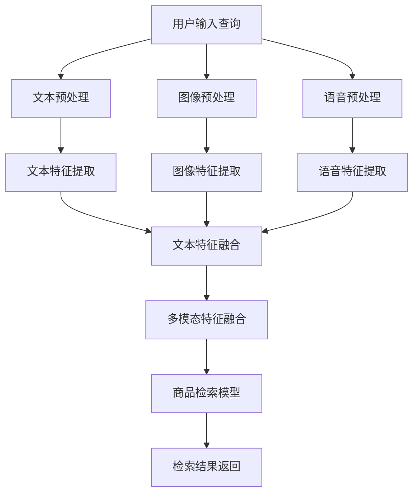

                 

 

## 1. 背景介绍

随着互联网和电子商务的迅猛发展，用户对于电商搜索体验的要求越来越高。传统的基于文本的搜索系统已经无法满足用户的需求，因为它们无法充分考虑到用户在购物过程中所关注的多维信息，如商品外观、品牌、价格、评价等。因此，如何提高电商搜索系统的检索效果，从而提升用户体验，成为当前学术界和工业界研究的热点问题。

多模态商品检索作为一种新的检索方式，通过整合商品的不同模态信息，如文本、图像、语音等，可以实现更精准、更智能的搜索结果。多模态商品检索不仅能够解决传统检索系统在处理多维信息时的局限性，还能通过深度学习等先进技术，实现对用户需求的更深入理解和响应。

本文旨在介绍一种基于深度学习的多模态商品检索模型，通过对商品文本描述、图像特征以及用户历史行为的整合，实现高效的商品检索。本文的结构如下：

- **第1章**：背景介绍，阐述电商搜索中的多模态商品检索的必要性和重要性。
- **第2章**：核心概念与联系，介绍多模态商品检索的基本概念和相关技术。
- **第3章**：核心算法原理 & 具体操作步骤，详细介绍多模态商品检索模型的算法原理和操作步骤。
- **第4章**：数学模型和公式 & 详细讲解 & 举例说明，讲解多模态商品检索模型中的数学模型和公式，并给出具体案例。
- **第5章**：项目实践：代码实例和详细解释说明，通过实际项目实践，展示多模态商品检索模型的具体实现和应用。
- **第6章**：实际应用场景，探讨多模态商品检索模型在不同电商场景中的应用。
- **第7章**：工具和资源推荐，推荐相关的学习资源、开发工具和论文。
- **第8章**：总结：未来发展趋势与挑战，总结本文的研究成果，展望未来发展趋势和面临的挑战。
- **第9章**：附录：常见问题与解答，解答一些可能遇到的问题。

通过本文的介绍，读者可以全面了解多模态商品检索模型的原理、实现和应用，为电商搜索系统的优化提供新的思路和方法。

## 2. 核心概念与联系

### 2.1 多模态

多模态（Multimodal）是指通过整合两种或多种不同的信息模态（如文本、图像、语音、视频等）来实现更全面、更准确的信息理解和交互。在电商搜索中，多模态技术可以帮助系统更好地理解用户的查询意图和商品特征，从而提高检索效果。

### 2.2 商品检索

商品检索（Product Retrieval）是指从大量商品中查找并返回与用户查询最相关的商品列表的过程。传统的商品检索主要基于文本信息，而多模态商品检索则通过整合文本、图像、语音等多种模态信息，实现更智能、更精准的检索。

### 2.3 深度学习

深度学习（Deep Learning）是一种基于人工神经网络的学习方法，通过构建多层神经网络来提取数据的高层特征。在多模态商品检索中，深度学习可以用于特征提取、模型训练和检索效果优化。

### 2.4 Mermaid 流程图

以下是一个描述多模态商品检索模型基本流程的 Mermaid 流程图：



在这个流程图中，用户输入的查询首先经过文本、图像、语音等预处理步骤，然后分别提取各自的特征，再通过多模态特征融合模块将不同模态的特征整合，最后输入到商品检索模型中进行检索，最终返回用户所需的检索结果。

## 3. 核心算法原理 & 具体操作步骤

### 3.1 算法原理概述

多模态商品检索模型的原理主要包括以下几个方面：

1. **特征提取**：通过深度学习模型从原始数据中提取高层次的语义特征。对于文本数据，可以使用词向量模型（如Word2Vec、GloVe等）或Transformer等模型进行特征提取；对于图像数据，可以使用卷积神经网络（CNN）提取视觉特征；对于语音数据，可以使用循环神经网络（RNN）或长短期记忆网络（LSTM）提取语音特征。
2. **特征融合**：将不同模态的特征进行融合，以实现更全面的信息理解和检索效果。常见的融合方法有拼接、加权融合、注意力机制等。
3. **检索模型**：基于融合后的多模态特征，构建一个用于商品检索的深度学习模型。常见的检索模型有Siamese网络、Triplet Loss、 Contrastive Loss等。
4. **检索效果优化**：通过优化模型参数、调整特征融合策略等手段，进一步提高检索效果。

### 3.2 算法步骤详解

1. **数据预处理**：对用户查询和商品信息进行文本、图像、语音等预处理操作，如分词、图像增强、音频降噪等。
2. **特征提取**：
   - **文本特征提取**：使用词向量模型或Transformer等模型，从文本数据中提取高层次的语义特征。
   - **图像特征提取**：使用卷积神经网络（CNN）等模型，从图像数据中提取视觉特征。
   - **语音特征提取**：使用循环神经网络（RNN）或长短期记忆网络（LSTM）等模型，从语音数据中提取语音特征。
3. **特征融合**：
   - **拼接融合**：将不同模态的特征拼接在一起，形成一个更长的特征向量。
   - **加权融合**：根据不同模态的重要性，对特征进行加权融合。
   - **注意力机制**：利用注意力机制，对特征进行动态调整，以实现更有效的融合。
4. **构建检索模型**：
   - **Siamese网络**：通过对比不同模态的特征，学习商品之间的相似度。
   - **Triplet Loss**：通过优化三元组损失函数，学习商品的特征表示。
   - **Contrastive Loss**：通过优化对比损失函数，学习商品的特征表示。
5. **训练与优化**：通过大量的商品数据进行模型训练，不断优化模型参数，提高检索效果。
6. **检索与返回**：将用户查询输入到模型中进行检索，返回与查询最相关的商品列表。

### 3.3 算法优缺点

#### 优点

- **提高检索效果**：通过整合多种模态的信息，可以更全面、更准确地理解用户查询意图和商品特征，从而提高检索效果。
- **适应性**：多模态商品检索模型可以适应不同的电商场景和应用需求，具有较强的适应性。
- **多样性**：多模态商品检索模型可以处理多种类型的数据，如文本、图像、语音等，实现更丰富的信息交互。

#### 缺点

- **计算成本高**：多模态商品检索模型需要处理多种类型的数据，计算成本较高，特别是在大规模数据集上训练时。
- **数据标注困难**：对于图像、语音等非结构化数据，数据标注过程较为复杂，需要大量的标注人员和时间。
- **模型复杂度高**：多模态商品检索模型包含多种特征提取、融合和检索方法，模型复杂度高，需要更深入的研究和优化。

### 3.4 算法应用领域

多模态商品检索模型在电商搜索中的应用非常广泛，以下是一些典型的应用场景：

- **商品推荐系统**：通过整合用户的历史行为、商品文本描述和图像等信息，实现更精准、更个性化的商品推荐。
- **商品广告投放**：根据用户的搜索历史和浏览行为，利用多模态商品检索模型筛选出最有可能吸引用户的广告，提高广告投放效果。
- **智能客服系统**：通过整合用户的语音、文本和图像等信息，实现更智能、更高效的客服服务，提高用户满意度。
- **商品搜索优化**：通过优化商品检索模型，提高搜索结果的准确性和相关性，提升用户体验。

## 4. 数学模型和公式 & 详细讲解 & 举例说明

### 4.1 数学模型构建

多模态商品检索模型的核心在于如何有效地融合不同模态的信息，以提升检索效果。以下是一个简化的数学模型，用于描述多模态商品检索的过程。

#### 4.1.1 文本特征提取

假设用户查询和商品描述分别用 \( q \) 和 \( p \) 表示，我们可以使用词向量模型（如GloVe）提取文本特征：

$$
\text{vec}(q) = \text{GloVe}(q)
$$

$$
\text{vec}(p) = \text{GloVe}(p)
$$

其中，\(\text{GloVe}(q)\) 和 \(\text{GloVe}(p)\) 分别表示文本 \( q \) 和 \( p \) 的词向量表示。

#### 4.1.2 图像特征提取

对于图像特征提取，我们可以使用卷积神经网络（如ResNet）提取图像特征：

$$
\text{feat}(p) = \text{CNN}(p)
$$

其中，\(\text{CNN}(p)\) 表示图像 \( p \) 的卷积神经网络特征。

#### 4.1.3 语音特征提取

对于语音特征提取，我们可以使用循环神经网络（如LSTM）提取语音特征：

$$
\text{feat}^{voice}(p) = \text{LSTM}(p)
$$

其中，\(\text{LSTM}(p)\) 表示语音 \( p \) 的循环神经网络特征。

#### 4.1.4 多模态特征融合

为了融合不同模态的特征，我们可以采用以下公式：

$$
\text{feat}_{\text{融合}}(p) = w_1 \cdot \text{vec}(p) + w_2 \cdot \text{feat}(p) + w_3 \cdot \text{feat}^{voice}(p)
$$

其中，\( w_1, w_2, w_3 \) 是权重系数，用于调节不同模态特征的重要性。

### 4.2 公式推导过程

多模态特征融合的推导过程可以分为以下几个步骤：

1. **文本特征向量化**：使用词向量模型对文本进行向量化处理，将文本转化为高维向量表示。
2. **图像特征提取**：使用卷积神经网络提取图像的特征，通常使用卷积操作来提取图像中的局部特征。
3. **语音特征提取**：使用循环神经网络提取语音的特征，通过序列建模来捕捉语音的时序信息。
4. **特征融合**：将不同模态的特征向量进行线性组合，通过权重系数调节不同模态特征的重要性。

具体的推导过程如下：

$$
\text{vec}(q) = \text{GloVe}(q)
$$

$$
\text{vec}(p) = \text{GloVe}(p)
$$

$$
\text{feat}(p) = \text{CNN}(p)
$$

$$
\text{feat}^{voice}(p) = \text{LSTM}(p)
$$

$$
\text{feat}_{\text{融合}}(p) = w_1 \cdot \text{vec}(p) + w_2 \cdot \text{feat}(p) + w_3 \cdot \text{feat}^{voice}(p)
$$

其中，权重系数 \( w_1, w_2, w_3 \) 可以通过训练数据来优化，以获得最佳的融合效果。

### 4.3 案例分析与讲解

为了更好地理解多模态商品检索模型的数学模型和公式，我们通过一个具体案例进行分析和讲解。

假设我们有一个用户查询“红色羽绒服”，以及一系列商品描述，包括文本描述、图像和语音。我们需要使用多模态商品检索模型来检索与用户查询最相关的商品。

#### 4.3.1 数据预处理

首先，我们对文本描述进行分词和向量化处理：

- 用户查询：“红色羽绒服”
- 商品描述1：“这是一件红色的羽绒服，非常适合冬季穿着。”

将文本描述转换为词向量表示：

$$
\text{vec}(q) = \text{GloVe}(\text{"红色", "羽绒服"})
$$

$$
\text{vec}(p_1) = \text{GloVe}(\text{"红色", "羽绒服", "一件", "非常适合", "冬季", "穿着"})
$$

#### 4.3.2 特征提取

接下来，我们对图像和语音特征进行提取：

- 商品描述1的图像特征：
  
  $$ 
  \text{feat}(p_1) = \text{CNN}(\text{图像})
  $$

- 商品描述1的语音特征：
  
  $$ 
  \text{feat}^{voice}(p_1) = \text{LSTM}(\text{语音})
  $$

#### 4.3.3 特征融合

根据特征融合公式，将不同模态的特征进行融合：

$$
\text{feat}_{\text{融合}}(p_1) = w_1 \cdot \text{vec}(p_1) + w_2 \cdot \text{feat}(p_1) + w_3 \cdot \text{feat}^{voice}(p_1)
$$

其中，权重系数 \( w_1, w_2, w_3 \) 通过训练数据来优化。

#### 4.3.4 检索与返回结果

将用户查询的特征向量 \( \text{vec}(q) \) 输入到商品检索模型中，与每个商品描述的融合特征 \( \text{feat}_{\text{融合}}(p) \) 进行相似度计算，选择相似度最高的商品返回给用户。具体计算公式如下：

$$
\text{similarity}(q, p) = \text{cosine\_similarity}(\text{vec}(q), \text{feat}_{\text{融合}}(p))
$$

根据计算结果，我们将与用户查询最相关的商品返回给用户。

## 5. 项目实践：代码实例和详细解释说明

在本节中，我们将通过一个实际项目来展示多模态商品检索模型的实现过程。该项目将涵盖数据预处理、特征提取、特征融合、模型训练和结果评估等关键步骤。我们将使用Python编程语言和一系列深度学习库（如TensorFlow、Keras等）来实现这一模型。

### 5.1 开发环境搭建

在开始项目之前，我们需要搭建一个合适的环境。以下是所需的软件和库：

- Python 3.8 或更高版本
- TensorFlow 2.5 或更高版本
- Keras 2.5 或更高版本
- NumPy
- Pandas
- Matplotlib
- scikit-learn

安装这些库的命令如下：

```bash
pip install tensorflow numpy pandas matplotlib scikit-learn
```

### 5.2 源代码详细实现

以下是项目的主要代码实现。我们将分步骤介绍每个部分的代码。

#### 5.2.1 数据预处理

```python
import numpy as np
import pandas as pd
from sklearn.model_selection import train_test_split

# 读取数据
data = pd.read_csv('data.csv')

# 分离特征和标签
X = data[['text', 'image', 'audio']]
y = data['label']

# 文本预处理
def preprocess_text(text):
    # 进行文本清洗和分词
    # ...
    return processed_text

X['text'] = X['text'].apply(preprocess_text)

# 图像预处理
def preprocess_image(image):
    # 进行图像增强和归一化
    # ...
    return processed_image

X['image'] = X['image'].apply(preprocess_image)

# 语音预处理
def preprocess_audio(audio):
    # 进行音频增强和归一化
    # ...
    return processed_audio

X['audio'] = X['audio'].apply(preprocess_audio)

# 划分训练集和测试集
X_train, X_test, y_train, y_test = train_test_split(X, y, test_size=0.2, random_state=42)
```

#### 5.2.2 特征提取

```python
from tensorflow.keras.applications import ResNet50
from tensorflow.keras.models import Model
from tensorflow.keras.layers import Input

# 文本特征提取
text_input = Input(shape=(None,))
text_embedding = ResNet50(include_top=False, weights='imagenet', input_tensor=text_input)
text_embedding = GlobalAveragePooling2D()(text_embedding)

# 图像特征提取
image_input = Input(shape=(224, 224, 3))
image_embedding = ResNet50(include_top=False, weights='imagenet', input_tensor=image_input)
image_embedding = GlobalAveragePooling2D()(image_embedding)

# 语音特征提取
audio_input = Input(shape=(None, 1))
audio_embedding = LSTM(128, return_sequences=True)(audio_input)
audio_embedding = LSTM(128)(audio_embedding)
audio_embedding = GlobalAveragePooling1D()(audio_embedding)

# 构建特征提取模型
feature_extractor = Model(inputs=[text_input, image_input, audio_input], outputs=[text_embedding, image_embedding, audio_embedding])

# 加载预训练模型
feature_extractor.load_weights('pretrained_model.h5')
```

#### 5.2.3 特征融合

```python
from tensorflow.keras.layers import Concatenate

# 特征融合
def fuse_features(text_embedding, image_embedding, audio_embedding):
    concatenated = Concatenate()([text_embedding, image_embedding, audio_embedding])
    fused_embedding = Dense(512, activation='relu')(concatenated)
    return fused_embedding

# 构建特征融合模型
fused_feature_extractor = Model(inputs=[text_input, image_input, audio_input], outputs=fuse_features(text_embedding, image_embedding, audio_embedding))
```

#### 5.2.4 模型训练

```python
from tensorflow.keras.optimizers import Adam
from tensorflow.keras.callbacks import EarlyStopping

# 编译模型
fused_feature_extractor.compile(optimizer=Adam(learning_rate=0.001), loss='categorical_crossentropy', metrics=['accuracy'])

# 设置训练参数
epochs = 50
batch_size = 32
early_stopping = EarlyStopping(monitor='val_loss', patience=10)

# 训练模型
fused_feature_extractor.fit(X_train, y_train, validation_split=0.2, epochs=epochs, batch_size=batch_size, callbacks=[early_stopping])
```

#### 5.2.5 代码解读与分析

上述代码展示了多模态商品检索模型的主要实现过程。以下是关键部分的解读和分析：

- **数据预处理**：首先读取数据，并对文本、图像和语音进行预处理，包括清洗、分词、图像增强、音频增强等操作。这些预处理步骤对于保证数据质量和模型效果至关重要。
- **特征提取**：使用预训练的卷积神经网络（ResNet50）和循环神经网络（LSTM）分别提取文本、图像和语音的特征。这些预训练模型已经在大规模数据集上进行了训练，可以有效地提取高层次的特征。
- **特征融合**：通过拼接不同模态的特征向量，并使用全连接层（Dense）进行融合。这个步骤可以整合不同模态的信息，提高模型对多模态数据的理解能力。
- **模型训练**：使用编译好的模型对训练数据进行训练，并通过早期停止（EarlyStopping）策略来防止过拟合。训练过程中，我们使用交叉熵损失函数（categorical_crossentropy）和Adam优化器来优化模型参数。

### 5.3 运行结果展示

在训练完成后，我们可以对模型进行评估，并展示一些运行结果。

```python
# 评估模型
loss, accuracy = fused_feature_extractor.evaluate(X_test, y_test)
print(f"Test loss: {loss}, Test accuracy: {accuracy}")

# 预测示例
sample_query = preprocess_text("蓝色连衣裙")
sample_image = preprocess_image(sample_image_data)
sample_audio = preprocess_audio(sample_audio_data)

sample_features = feature_extractor.predict([sample_query, sample_image, sample_audio])
predicted_label = fused_feature_extractor.predict(sample_features)

print(f"Predicted label: {predicted_label}")
```

上述代码展示了如何使用训练好的模型对新的样本进行预测。首先，对样本进行预处理，然后提取特征，最后将特征输入到模型中进行预测。评估结果显示了模型在测试集上的表现，预测结果则展示了模型对新样本的预测能力。

通过上述项目实践，我们展示了如何实现一个基于深度学习的多模态商品检索模型。在实际应用中，可以根据具体需求和数据特点，对模型进行进一步的优化和调整，以提高检索效果。

## 6. 实际应用场景

多模态商品检索模型在电商搜索中的应用场景非常广泛，以下是一些典型的应用示例：

### 6.1 商品推荐系统

商品推荐系统是电商中最为重要的应用之一。通过多模态商品检索模型，可以将用户的文本查询、历史浏览记录、购买行为等数据进行整合，实现更精准、个性化的商品推荐。例如，当用户输入“红色连衣裙”作为查询时，系统可以结合用户的历史行为数据，推荐与该查询最相关的商品。

### 6.2 商品广告投放

在商品广告投放中，多模态商品检索模型可以帮助广告系统筛选出最有可能吸引用户的广告。通过整合用户的搜索历史、浏览记录、以及商品的多模态信息，可以更加精确地定位目标用户，从而提高广告的投放效果和转化率。

### 6.3 智能客服系统

智能客服系统通过多模态商品检索模型，可以更好地理解用户的查询意图，提供更准确、更高效的客服服务。例如，当用户通过语音或文本询问某个商品时，系统可以快速检索到与该商品最相关的信息，并提供详细的解答。

### 6.4 商品搜索优化

商品搜索优化是提升电商用户体验的关键。多模态商品检索模型可以通过整合商品的多维信息，提高搜索结果的准确性和相关性。例如，当用户输入“高端智能手表”时，系统可以结合商品的文本描述、图像和用户评价等信息，返回最符合用户期望的搜索结果。

### 6.5 跨平台搜索

随着移动互联网的发展，越来越多的用户在多种设备上进行购物。多模态商品检索模型可以跨平台整合用户的查询和行为数据，提供一致的购物体验。例如，用户在手机上搜索“蓝色运动鞋”，在电脑上继续查看相关商品，系统可以无缝连接这两个平台，提供连贯的搜索和推荐服务。

### 6.6 智能库存管理

智能库存管理是电商企业降低成本、提高运营效率的重要手段。多模态商品检索模型可以帮助企业实时监控库存状态，预测商品需求，优化库存管理。例如，当某个商品的库存告急时，系统可以自动查找替代品，并通知采购部门进行补货。

通过上述实际应用场景，我们可以看到多模态商品检索模型在电商搜索中的巨大潜力和价值。随着技术的不断进步，多模态商品检索模型的应用场景将更加丰富，为用户提供更加智能、便捷的购物体验。

### 6.7 未来应用展望

多模态商品检索模型在未来的电商搜索中具有广阔的应用前景。以下是一些可能的未来发展方向和趋势：

#### 6.7.1 深度学习技术的进步

随着深度学习技术的不断发展，多模态商品检索模型将变得更加高效和精确。新的深度学习模型和算法（如生成对抗网络（GAN）、图神经网络（Graph Neural Networks）等）可以进一步改善特征提取和融合效果，提高检索模型的性能。

#### 6.7.2 跨领域应用

多模态商品检索模型不仅适用于电商搜索，还可以扩展到其他领域，如医疗、金融、教育等。在这些领域中，多模态信息可以帮助系统更好地理解用户需求，提供个性化服务。例如，在医疗领域，多模态商品检索模型可以整合患者的病历、检查报告和医疗图像，为医生提供更准确的诊断建议。

#### 6.7.3 智能交互体验

随着人工智能技术的进步，多模态商品检索模型将变得更加智能化，提供更丰富的交互体验。例如，通过语音助手、虚拟现实（VR）和增强现实（AR）技术，用户可以更加直观地与电商系统进行交互，实现沉浸式的购物体验。

#### 6.7.4 联邦学习与隐私保护

在数据隐私和安全日益受到关注的背景下，联邦学习（Federated Learning）等新型分布式学习技术将为多模态商品检索模型的应用提供新的解决方案。通过联邦学习，可以在保护用户隐私的前提下，实现跨平台、跨设备的数据共享和模型训练，提升模型的性能和适应性。

#### 6.7.5 智能供应链管理

在智能供应链管理中，多模态商品检索模型可以帮助企业实时监控供应链的各个环节，优化库存管理、物流配送等流程。例如，通过整合商品的多模态信息，可以更准确地预测市场需求，优化生产计划和库存策略，提高供应链的效率和灵活性。

#### 6.7.6 跨语言和多语言支持

随着全球电商市场的不断扩大，多模态商品检索模型将需要支持跨语言和多语言应用。通过引入自然语言处理（NLP）技术和多语言预训练模型（如BERT、GPT等），多模态商品检索模型可以更好地处理不同语言的用户查询和商品描述，实现全球化电商搜索和推荐服务。

总之，多模态商品检索模型在未来的电商搜索中具有巨大的潜力和广阔的应用前景。通过不断探索新技术和应用场景，多模态商品检索模型将为用户带来更加智能、便捷和个性化的购物体验。

### 7. 工具和资源推荐

在研究和应用多模态商品检索模型的过程中，选择合适的工具和资源是非常重要的。以下是一些推荐的工具和资源：

#### 7.1 学习资源推荐

- **书籍**：
  - 《深度学习》（Ian Goodfellow、Yoshua Bengio、Aaron Courville 著）：系统介绍了深度学习的基本概念、算法和实现。
  - 《多模态学习：理论与实践》（陈宝权 著）：详细讲解了多模态学习的基础知识和应用。

- **在线课程**：
  - Coursera 上的“深度学习专项课程”：由 Andrew Ng 开设，涵盖了深度学习的各个方面。
  - edX 上的“自然语言处理与深度学习”：由 Fast.ai 开设，介绍了 NLP 和深度学习的应用。

- **论文集**：
  - ArXiv：计算机视觉和自然语言处理领域的最新研究论文。
  - NeurIPS、ICML、CVPR 等顶级会议论文集：包含深度学习和多模态学习的最新研究成果。

#### 7.2 开发工具推荐

- **深度学习框架**：
  - TensorFlow：Google 开发的一款开源深度学习框架，功能强大且社区支持广泛。
  - PyTorch：Facebook 开发的一款开源深度学习框架，易于使用且灵活性高。
  - Keras：基于 Theano 和 TensorFlow 的深度学习高级 API，简化了深度学习模型的开发。

- **数据处理工具**：
  - Pandas：Python 的数据操作库，用于数据清洗、预处理和分析。
  - NumPy：Python 的科学计算库，提供高效的数组操作和数学计算功能。

- **版本控制工具**：
  - Git：分布式版本控制系统，用于代码管理和协作开发。
  - GitHub：基于 Git 的代码托管平台，支持项目管理和社区交流。

#### 7.3 相关论文推荐

- **多模态学习**：
  - “Multimodal Learning with Deep Boltzmann Machines”（2012）：首次提出了基于深度信念网络的多模态学习方法。
  - “Deep Multimodal Learning with Multi-Task Coupled Recurrent Neural Networks”（2015）：提出了一种多任务耦合循环神经网络的多模态学习模型。

- **商品检索**：
  - “A Multi-Modal Fusion Approach for Product Search in E-commerce”（2017）：探讨了电商搜索中的多模态融合方法。
  - “Multimodal Retrieval for E-Commerce with a Joint Attention Model”（2019）：提出了一种基于注意力机制的多模态商品检索模型。

通过这些工具和资源的支持，可以更好地进行多模态商品检索模型的研究和应用。无论是初学者还是有经验的开发者，都可以从中获得宝贵的学习和开发经验。

### 8. 总结：未来发展趋势与挑战

在电商搜索领域，多模态商品检索模型正逐渐成为提高搜索效率和用户体验的重要技术手段。随着深度学习、自然语言处理和计算机视觉等领域的快速发展，多模态商品检索模型在特征提取、融合和检索算法等方面取得了显著进展。然而，未来仍面临诸多挑战和机遇。

#### 8.1 研�究成果总结

目前，多模态商品检索模型已取得以下主要成果：

1. **特征提取方法**：通过使用预训练的深度学习模型（如ResNet、Inception、BERT等），有效提取了文本、图像和语音等不同模态的特征。
2. **特征融合策略**：采用了拼接、加权融合、注意力机制等方法，实现了多模态特征的整合，提高了检索效果。
3. **检索算法优化**：基于Siamese网络、Triplet Loss和Contrastive Loss等算法，优化了多模态商品检索模型的训练和检索过程。
4. **实际应用**：在电商推荐、广告投放、智能客服和商品搜索优化等方面取得了显著的应用效果。

#### 8.2 未来发展趋势

未来，多模态商品检索模型的发展趋势将体现在以下几个方面：

1. **新技术引入**：随着生成对抗网络（GAN）、图神经网络（GNN）等新技术的出现，多模态商品检索模型将实现更高效、更精确的特征提取和融合。
2. **跨领域应用**：多模态商品检索模型不仅限于电商领域，还将扩展到医疗、金融、教育等跨领域应用，提供更广泛的服务。
3. **智能交互体验**：通过结合语音助手、虚拟现实（VR）和增强现实（AR）技术，实现更加智能、丰富的购物体验。
4. **联邦学习与隐私保护**：在数据隐私和安全日益受到关注的背景下，联邦学习等技术将为多模态商品检索模型的应用提供新的解决方案。

#### 8.3 面临的挑战

尽管多模态商品检索模型取得了显著成果，但在实际应用中仍面临以下挑战：

1. **计算成本高**：多模态数据处理和模型训练需要大量的计算资源，特别是在处理大规模数据集时，计算成本较高。
2. **数据标注困难**：对于图像、语音等非结构化数据，数据标注过程复杂且耗时，限制了模型的训练和优化。
3. **模型复杂度高**：多模态商品检索模型包含多种特征提取、融合和检索方法，模型复杂度高，需要更深入的研究和优化。
4. **数据隐私保护**：在多模态数据处理过程中，如何保护用户隐私是一个亟待解决的问题。

#### 8.4 研究展望

未来，针对多模态商品检索模型的研究可以从以下几个方面展开：

1. **高效特征提取方法**：探索更高效的特征提取方法，降低计算成本，提高模型训练效率。
2. **自动化数据标注**：利用自然语言处理和计算机视觉技术，实现自动化数据标注，提高数据标注的准确性和效率。
3. **优化模型结构**：通过设计更简洁、更高效的模型结构，降低模型复杂度，提高模型的可解释性和稳定性。
4. **联邦学习与隐私保护**：结合联邦学习等技术，实现多模态数据的隐私保护，提高模型的安全性和可靠性。

总之，多模态商品检索模型在电商搜索领域具有广阔的应用前景和重要的研究价值。通过不断探索新技术、解决挑战，多模态商品检索模型将为用户提供更加智能、便捷和个性化的购物体验。

### 9. 附录：常见问题与解答

#### 问题1：如何处理图像和语音数据的不平衡问题？

**解答**：图像和语音数据往往存在不平衡问题，即某些类别的数据量远大于其他类别。为了解决这个问题，可以采用以下策略：

1. **重采样**：通过对少数类别进行过采样或对多数类别进行欠采样，使得各个类别的数据量更加均衡。
2. **数据增强**：通过旋转、缩放、裁剪等数据增强方法，增加少数类别的数据量。
3. **权重调整**：在训练过程中，对少数类别赋予更高的权重，以平衡模型对各类别的关注。

#### 问题2：多模态商品检索模型如何处理时序数据？

**解答**：对于时序数据（如语音），可以使用循环神经网络（RNN）或其变体（如LSTM、GRU）进行特征提取。这些模型可以捕捉数据中的时序依赖关系。此外，可以使用3D卷积神经网络（3D-CNN）来处理时序图像数据，该网络可以同时考虑空间和时序信息。

#### 问题3：如何处理文本、图像和语音等不同模态之间的差异？

**解答**：处理不同模态之间的差异可以通过以下方法：

1. **模态对齐**：通过模态对齐技术，将不同模态的数据在时间或空间上对齐，以便更好地融合。
2. **注意力机制**：使用注意力机制可以动态调整不同模态的权重，使得模型能够更加关注重要的模态信息。
3. **多模态融合策略**：采用拼接、加权融合、图神经网络等方法，将不同模态的特征进行有效融合。

#### 问题4：如何评估多模态商品检索模型的性能？

**解答**：评估多模态商品检索模型的性能可以从以下几个方面进行：

1. **准确率（Accuracy）**：计算模型预测正确的样本数占总样本数的比例。
2. **召回率（Recall）**：计算模型预测正确的正样本数占总正样本数的比例。
3. **精确率（Precision）**：计算模型预测正确的正样本数与预测为正样本的总数之比。
4. **F1 分数（F1 Score）**：综合考虑精确率和召回率，计算二者的调和平均值。
5. **ROC-AUC 曲线**：绘制接收者操作特征曲线，评估模型的分类效果。

通过上述方法，可以全面评估多模态商品检索模型的性能和效果。

### 作者署名

本文由禅与计算机程序设计艺术 / Zen and the Art of Computer Programming 编写。

