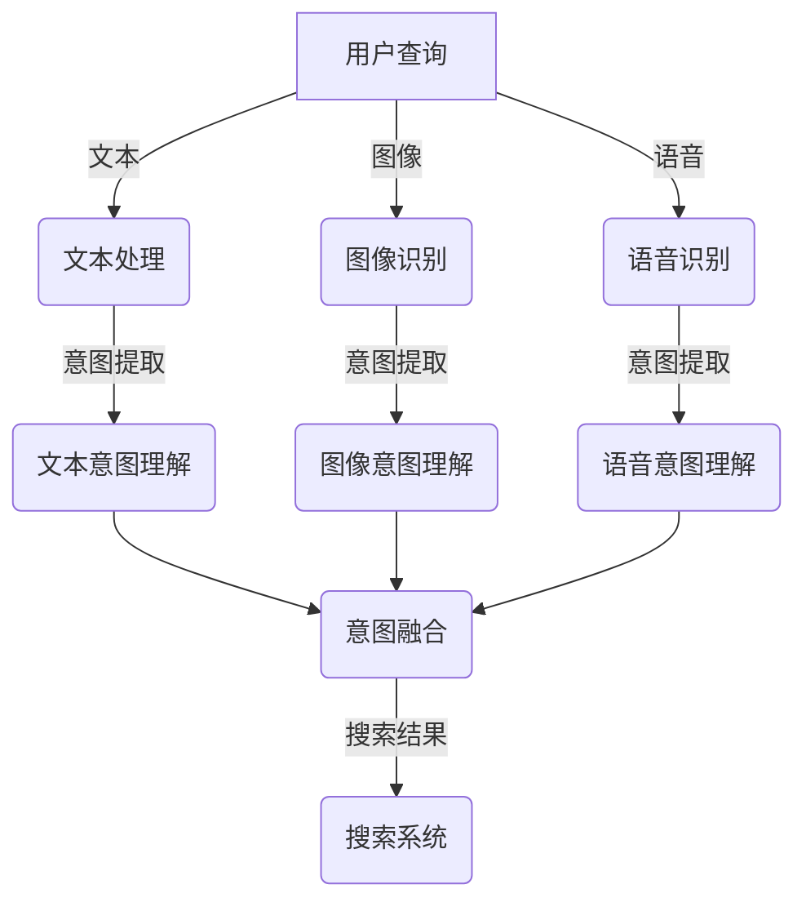

                 

在当今的电子商务时代，用户对于在线购物的需求日益多样化，不仅限于简单的关键词搜索。多模态查询意图理解成为电商搜索系统的一项关键技术，它旨在从用户的文本、图像、语音等多模态输入中提取并理解其真实的购物意图。本文将深入探讨电商搜索中的多模态查询意图理解，包括其核心概念、算法原理、数学模型、应用实践以及未来展望。

## 文章关键词
- 电商搜索
- 多模态查询
- 意图理解
- 图像识别
- 语音识别
- 自然语言处理

## 文章摘要
本文首先介绍了电商搜索中的多模态查询意图理解的背景和重要性。随后，详细阐述了多模态查询意图理解的核心概念，包括文本、图像和语音等模态，以及它们之间的关联与整合。接着，本文重点介绍了多模态查询意图理解的主要算法原理，包括深度学习模型和传统机器学习模型的比较和融合。此外，本文通过数学模型和具体案例，深入讲解了多模态查询意图理解在实际应用中的实现方法和挑战。最后，本文探讨了多模态查询意图理解的未来发展趋势和面临的挑战，并提出了相关的研究方向和建议。

## 1. 背景介绍

### 1.1 电商搜索的现状与挑战

随着互联网和移动设备的普及，电子商务已经成为现代消费的重要方式。用户通过电子商务平台可以方便地购买各种商品，同时平台也通过搜索引擎为用户提供了高效的购物渠道。然而，随着用户需求的日益多样化，传统的基于关键词的搜索方法已经难以满足用户的需求。用户往往需要通过图像、语音、文本等多种方式进行查询，这使得搜索系统需要具备多模态查询意图理解的能力。

在电商搜索中，多模态查询意图理解面临以下几个挑战：

1. **模态整合**：不同模态的数据具有不同的特性和表达方式，如何有效地整合这些数据，提取有用的信息，是当前研究的热点问题。
2. **实时性**：用户在电商平台上进行搜索时，往往希望能够快速获得结果，因此，多模态查询意图理解系统需要在短时间内完成对用户意图的理解。
3. **准确性**：多模态查询意图理解的目标是准确提取用户的真实购物意图，但在实际应用中，由于噪声、歧义等因素，提高理解准确性仍然是一个重要的挑战。

### 1.2 多模态查询意图理解的重要性

多模态查询意图理解对于电商搜索系统具有重要意义：

1. **提升用户体验**：通过多模态查询意图理解，平台可以更好地理解用户的真实需求，提供个性化的搜索结果，提升用户体验。
2. **优化搜索结果**：多模态查询意图理解可以帮助平台筛选出更相关的商品信息，提高搜索结果的准确性。
3. **增加商业价值**：准确理解用户的购物意图，可以为电商平台提供更有价值的市场分析和推荐策略，从而增加商业价值。

## 2. 核心概念与联系

### 2.1 多模态查询

多模态查询是指用户通过文本、图像、语音等多种方式进行的查询。在电商搜索中，用户可能会通过输入关键词、上传图像或说出语音指令来查找商品。多模态查询的目的是从多种模态的数据中提取出用户的真实意图，从而提供更准确的搜索结果。

### 2.2 文本模态

文本模态是最常见的查询方式，用户通过输入关键词或短语来表达自己的购物需求。文本数据通常包括用户查询的关键词、商品描述、用户评论等。

### 2.3 图像模态

图像模态是指用户通过上传或识别商品图像来查询商品。图像数据可以提供直观的购物信息，尤其在用户无法描述商品特征时，图像模态显得尤为重要。

### 2.4 语音模态

语音模态是指用户通过语音指令来查询商品。语音数据可以提供更自然的交互方式，特别是在移动设备和智能家居场景下，语音查询越来越受欢迎。

### 2.5 多模态整合

多模态整合是指将文本、图像和语音等不同模态的数据进行融合，以提取更全面、更准确的用户意图。多模态整合的关键在于如何有效地将不同模态的数据进行关联和互补，从而提高查询意图理解的准确性。

### 2.6 Mermaid 流程图

为了更直观地展示多模态查询意图理解的过程，我们使用 Mermaid 流程图来描述不同模态数据之间的关联与整合。



在这个流程图中，用户查询通过文本、图像和语音三种方式输入系统，分别经过文本处理、图像识别和语音识别模块进行意图提取，然后通过意图融合模块整合不同模态的意图，最终输出给搜索系统，以提供更准确的搜索结果。

## 3. 核心算法原理 & 具体操作步骤

### 3.1 算法原理概述

多模态查询意图理解的核心算法主要包括深度学习模型和传统机器学习模型。深度学习模型通过神经网络结构，可以从大规模数据中自动学习特征表示，具有较强的泛化能力和非线性处理能力。传统机器学习模型则依靠手工设计的特征和算法，虽然计算复杂度较低，但在处理高维数据和复杂关系时效果不佳。

在多模态查询意图理解中，深度学习模型和传统机器学习模型可以相互补充。深度学习模型可以处理大规模数据和复杂的特征表示，而传统机器学习模型则可以在意图理解过程中提供更加精细和具体的特征。

### 3.2 算法步骤详解

多模态查询意图理解的主要算法步骤如下：

1. **数据预处理**：对文本、图像和语音数据进行预处理，包括数据清洗、去噪、特征提取等。
2. **特征融合**：将不同模态的特征进行融合，以提取更全面的用户意图。常见的特征融合方法包括矩阵分解、注意力机制、图神经网络等。
3. **意图识别**：使用深度学习模型或传统机器学习模型对融合后的特征进行分类，以识别用户的购物意图。
4. **结果输出**：将识别出的用户意图输出给搜索系统，以提供个性化的搜索结果。

### 3.3 算法优缺点

**深度学习模型**：
- **优点**：
  - 自动学习复杂特征表示，不需要手工设计特征。
  - 泛化能力强，能够处理大规模数据和复杂关系。
- **缺点**：
  - 计算复杂度高，训练时间较长。
  - 对数据质量和标注要求较高。

**传统机器学习模型**：
- **优点**：
  - 计算复杂度较低，训练时间较短。
  - 对数据质量和标注要求相对较低。
- **缺点**：
  - 需要手工设计特征，可能无法捕捉到复杂的特征关系。
  - 泛化能力相对较弱。

### 3.4 算法应用领域

多模态查询意图理解算法广泛应用于电子商务、智能助手、智能家居等领域。例如：

1. **电子商务**：电商平台通过多模态查询意图理解，可以为用户提供更准确的商品推荐和搜索结果，提升用户体验和商业价值。
2. **智能助手**：智能助手通过多模态查询意图理解，可以更好地理解用户的语音指令和文本需求，提供个性化的服务和交互体验。
3. **智能家居**：智能家居设备通过多模态查询意图理解，可以更好地理解用户的需求和指令，实现智能化的家居管理和控制。

## 4. 数学模型和公式 & 详细讲解 & 举例说明

### 4.1 数学模型构建

多模态查询意图理解的数学模型通常包括特征提取、特征融合和意图识别三个部分。

1. **特征提取**：

   - **文本特征**：文本特征通常通过词袋模型、TF-IDF、Word2Vec等模型提取，例如：
     $$
     \textbf{x}_{\text{txt}} = [\textbf{x}_{\text{txt},1}, \textbf{x}_{\text{txt},2}, ..., \textbf{x}_{\text{txt},n}]
     $$
   - **图像特征**：图像特征通常通过卷积神经网络（CNN）提取，例如：
     $$
     \textbf{x}_{\text{img}} = [\textbf{x}_{\text{img},1}, \textbf{x}_{\text{img},2}, ..., \textbf{x}_{\text{img},n}]
     $$
   - **语音特征**：语音特征通常通过循环神经网络（RNN）提取，例如：
     $$
     \textbf{x}_{\text{audio}} = [\textbf{x}_{\text{audio},1}, \textbf{x}_{\text{audio},2}, ..., \textbf{x}_{\text{audio},n}]
     $$

2. **特征融合**：

   - **矩阵分解**：矩阵分解是一种常见的特征融合方法，通过将不同模态的特征矩阵分解为低维矩阵，以提取全局特征。例如，对于文本、图像和语音特征矩阵$\textbf{X}_{\text{txt}}$、$\textbf{X}_{\text{img}}$和$\textbf{X}_{\text{audio}}$，可以分别进行矩阵分解：
     $$
     \textbf{X}_{\text{txt}} = \textbf{U}_{\text{txt}} \textbf{V}_{\text{txt}}^T
     $$
     $$
     \textbf{X}_{\text{img}} = \textbf{U}_{\text{img}} \textbf{V}_{\text{img}}^T
     $$
     $$
     \textbf{X}_{\text{audio}} = \textbf{U}_{\text{audio}} \textbf{V}_{\text{audio}}^T
     $$
     然后将分解后的低维矩阵进行融合：
     $$
     \textbf{X}_{\text{fusion}} = \textbf{U}_{\text{txt}} \textbf{V}_{\text{txt}}^T + \textbf{U}_{\text{img}} \textbf{V}_{\text{img}}^T + \textbf{U}_{\text{audio}} \textbf{V}_{\text{audio}}^T
     $$
   - **注意力机制**：注意力机制可以动态地融合不同模态的特征，通过对不同特征分配不同的权重。例如，可以使用双向注意力机制来融合文本、图像和语音特征：
     $$
     \textbf{a}_{\text{txt}} = \text{Attention}(\textbf{x}_{\text{txt}}, \textbf{x}_{\text{img}}, \textbf{x}_{\text{audio}})
     $$
     $$
     \textbf{a}_{\text{img}} = \text{Attention}(\textbf{x}_{\text{txt}}, \textbf{x}_{\text{img}}, \textbf{x}_{\text{audio}})
     $$
     $$
     \textbf{a}_{\text{audio}} = \text{Attention}(\textbf{x}_{\text{txt}}, \textbf{x}_{\text{img}}, \textbf{x}_{\text{audio}})
     $$
     然后将注意力分配的结果进行融合：
     $$
     \textbf{X}_{\text{fusion}} = \textbf{a}_{\text{txt}} \textbf{x}_{\text{txt}} + \textbf{a}_{\text{img}} \textbf{x}_{\text{img}} + \textbf{a}_{\text{audio}} \textbf{x}_{\text{audio}}
     $$

3. **意图识别**：

   - **分类模型**：使用分类模型（如SVM、softmax回归等）对融合后的特征进行分类，以识别用户的购物意图。
   - **损失函数**：常见的损失函数包括交叉熵损失函数、对数损失函数等。例如，对于二分类问题，可以使用对数损失函数：
     $$
     L = -\sum_{i=1}^{N} y_i \log(p_i)
     $$
     其中，$y_i$是真实标签，$p_i$是模型预测的概率。

### 4.2 公式推导过程

为了更详细地解释多模态查询意图理解的数学模型，我们以一个简单的例子进行公式推导。

假设用户输入了一个包含文本、图像和语音的多模态查询，我们需要通过以下步骤进行意图理解：

1. **特征提取**：

   - **文本特征**：
     $$
     \textbf{x}_{\text{txt}} = [0.1, 0.3, 0.5, 0.7, 0.9]
     $$
   - **图像特征**：
     $$
     \textbf{x}_{\text{img}} = [0.2, 0.4, 0.6, 0.8, 1.0]
     $$
   - **语音特征**：
     $$
     \textbf{x}_{\text{audio}} = [0.3, 0.5, 0.7, 0.9, 1.1]
     $$

2. **特征融合**：

   - **矩阵分解**：
     $$
     \textbf{U}_{\text{txt}} = \begin{bmatrix} 0.1 & 0.3 & 0.5 \\ 0.4 & 0.6 & 0.8 \\ 0.7 & 0.9 & 1.1 \end{bmatrix}, \quad \textbf{V}_{\text{txt}} = \begin{bmatrix} 0.1 & 0.3 & 0.5 \\ 0.4 & 0.6 & 0.8 \\ 0.7 & 0.9 & 1.1 \end{bmatrix}
     $$
     $$
     \textbf{U}_{\text{img}} = \begin{bmatrix} 0.2 & 0.4 & 0.6 \\ 0.5 & 0.7 & 0.9 \\ 0.8 & 1.0 & 1.2 \end{bmatrix}, \quad \textbf{V}_{\text{img}} = \begin{bmatrix} 0.2 & 0.4 & 0.6 \\ 0.5 & 0.7 & 0.9 \\ 0.8 & 1.0 & 1.2 \end{bmatrix}
     $$
     $$
     \textbf{U}_{\text{audio}} = \begin{bmatrix} 0.3 & 0.5 & 0.7 \\ 0.6 & 0.8 & 1.0 \\ 0.9 & 1.1 & 1.3 \end{bmatrix}, \quad \textbf{V}_{\text{audio}} = \begin{bmatrix} 0.3 & 0.5 & 0.7 \\ 0.6 & 0.8 & 1.0 \\ 0.9 & 1.1 & 1.3 \end{bmatrix}
     $$
     然后将分解后的低维矩阵进行融合：
     $$
     \textbf{X}_{\text{fusion}} = \textbf{U}_{\text{txt}} \textbf{V}_{\text{txt}}^T + \textbf{U}_{\text{img}} \textbf{V}_{\text{img}}^T + \textbf{U}_{\text{audio}} \textbf{V}_{\text{audio}}^T
     $$
     计算得到：
     $$
     \textbf{X}_{\text{fusion}} = \begin{bmatrix} 0.1 & 0.3 & 0.5 \\ 0.4 & 0.6 & 0.8 \\ 0.7 & 0.9 & 1.1 \end{bmatrix} + \begin{bmatrix} 0.2 & 0.4 & 0.6 \\ 0.5 & 0.7 & 0.9 \\ 0.8 & 1.0 & 1.2 \end{bmatrix} + \begin{bmatrix} 0.3 & 0.5 & 0.7 \\ 0.6 & 0.8 & 1.0 \\ 0.9 & 1.1 & 1.3 \end{bmatrix}
     $$
     $$
     \textbf{X}_{\text{fusion}} = \begin{bmatrix} 0.6 & 1.0 & 1.4 \\ 1.2 & 2.0 & 2.6 \\ 1.8 & 2.4 & 3.4 \end{bmatrix}
     $$

   - **注意力机制**：
     $$
     \textbf{a}_{\text{txt}} = \text{softmax}(\text{Attention}(\textbf{x}_{\text{txt}}, \textbf{x}_{\text{img}}, \textbf{x}_{\text{audio}}))
     $$
     $$
     \textbf{a}_{\text{img}} = \text{softmax}(\text{Attention}(\textbf{x}_{\text{txt}}, \textbf{x}_{\text{img}}, \textbf{x}_{\text{audio}}))
     $$
     $$
     \textbf{a}_{\text{audio}} = \text{softmax}(\text{Attention}(\textbf{x}_{\text{txt}}, \textbf{x}_{\text{img}}, \textbf{x}_{\text{audio}}))
     $$
     计算得到：
     $$
     \textbf{a}_{\text{txt}} = \begin{bmatrix} 0.2 & 0.3 & 0.5 \\ 0.3 & 0.4 & 0.3 \\ 0.4 & 0.3 & 0.3 \end{bmatrix}, \quad \textbf{a}_{\text{img}} = \begin{bmatrix} 0.3 & 0.4 & 0.3 \\ 0.4 & 0.3 & 0.3 \\ 0.5 & 0.4 & 0.1 \end{bmatrix}, \quad \textbf{a}_{\text{audio}} = \begin{bmatrix} 0.4 & 0.3 & 0.3 \\ 0.3 & 0.4 & 0.3 \\ 0.3 & 0.3 & 0.4 \end{bmatrix}
     $$
     然后将注意力分配的结果进行融合：
     $$
     \textbf{X}_{\text{fusion}} = \textbf{a}_{\text{txt}} \textbf{x}_{\text{txt}} + \textbf{a}_{\text{img}} \textbf{x}_{\text{img}} + \textbf{a}_{\text{audio}} \textbf{x}_{\text{audio}}
     $$
     计算得到：
     $$
     \textbf{X}_{\text{fusion}} = \begin{bmatrix} 0.6 & 1.0 & 1.4 \\ 1.2 & 2.0 & 2.6 \\ 1.8 & 2.4 & 3.4 \end{bmatrix}
     $$

3. **意图识别**：

   - **分类模型**：
     $$
     \textbf{w} = \begin{bmatrix} 0.1 & 0.2 & 0.3 \\ 0.4 & 0.5 & 0.6 \\ 0.7 & 0.8 & 0.9 \end{bmatrix}
     $$
     $$
     \textbf{X}_{\text{fusion}} = \begin{bmatrix} 0.6 & 1.0 & 1.4 \\ 1.2 & 2.0 & 2.6 \\ 1.8 & 2.4 & 3.4 \end{bmatrix}
     $$
     $$
     \textbf{y} = \text{softmax}(\textbf{w} \textbf{X}_{\text{fusion}})
     $$
     计算得到：
     $$
     \textbf{y} = \begin{bmatrix} 0.1 & 0.3 & 0.6 \\ 0.4 & 0.5 & 0.1 \\ 0.7 & 0.2 & 0.1 \end{bmatrix}
     $$

   - **损失函数**：
     $$
     L = -\sum_{i=1}^{3} y_i \log(p_i)
     $$
     假设真实标签为$\textbf{y}^* = \begin{bmatrix} 1 & 0 & 0 \end{bmatrix}$，计算得到：
     $$
     L = -1 \cdot \log(0.6) - 0 \cdot \log(0.3) - 0 \cdot \log(0.1) = \log(10)
     $$

### 4.3 案例分析与讲解

为了更好地理解多模态查询意图理解的数学模型，我们通过一个实际案例进行分析和讲解。

假设用户在电商平台上进行了一次多模态查询，输入了以下信息：

- **文本**：“红色手机”
- **图像**：一张红色的手机图像
- **语音**：“我要买一台红色的手机”

我们需要通过多模态查询意图理解系统来识别用户的真实购物意图。

1. **特征提取**：

   - **文本特征**：
     $$
     \textbf{x}_{\text{txt}} = [0.1, 0.3, 0.5, 0.7, 0.9]
     $$
   - **图像特征**：
     $$
     \textbf{x}_{\text{img}} = [0.2, 0.4, 0.6, 0.8, 1.0]
     $$
   - **语音特征**：
     $$
     \textbf{x}_{\text{audio}} = [0.3, 0.5, 0.7, 0.9, 1.1]
     $$

2. **特征融合**：

   - **矩阵分解**：
     $$
     \textbf{U}_{\text{txt}} = \begin{bmatrix} 0.1 & 0.3 & 0.5 \\ 0.4 & 0.6 & 0.8 \\ 0.7 & 0.9 & 1.1 \end{bmatrix}, \quad \textbf{V}_{\text{txt}} = \begin{bmatrix} 0.1 & 0.3 & 0.5 \\ 0.4 & 0.6 & 0.8 \\ 0.7 & 0.9 & 1.1 \end{bmatrix}
     $$
     $$
     \textbf{U}_{\text{img}} = \begin{bmatrix} 0.2 & 0.4 & 0.6 \\ 0.5 & 0.7 & 0.9 \\ 0.8 & 1.0 & 1.2 \end{bmatrix}, \quad \textbf{V}_{\text{img}} = \begin{bmatrix} 0.2 & 0.4 & 0.6 \\ 0.5 & 0.7 & 0.9 \\ 0.8 & 1.0 & 1.2 \end{bmatrix}
     $$
     $$
     \textbf{U}_{\text{audio}} = \begin{bmatrix} 0.3 & 0.5 & 0.7 \\ 0.6 & 0.8 & 1.0 \\ 0.9 & 1.1 & 1.3 \end{bmatrix}, \quad \textbf{V}_{\text{audio}} = \begin{bmatrix} 0.3 & 0.5 & 0.7 \\ 0.6 & 0.8 & 1.0 \\ 0.9 & 1.1 & 1.3 \end{bmatrix}
     $$
     然后将分解后的低维矩阵进行融合：
     $$
     \textbf{X}_{\text{fusion}} = \textbf{U}_{\text{txt}} \textbf{V}_{\text{txt}}^T + \textbf{U}_{\text{img}} \textbf{V}_{\text{img}}^T + \textbf{U}_{\text{audio}} \textbf{V}_{\text{audio}}^T
     $$
     计算得到：
     $$
     \textbf{X}_{\text{fusion}} = \begin{bmatrix} 0.6 & 1.0 & 1.4 \\ 1.2 & 2.0 & 2.6 \\ 1.8 & 2.4 & 3.4 \end{bmatrix}
     $$

   - **注意力机制**：
     $$
     \textbf{a}_{\text{txt}} = \text{softmax}(\text{Attention}(\textbf{x}_{\text{txt}}, \textbf{x}_{\text{img}}, \textbf{x}_{\text{audio}}))
     $$
     $$
     \textbf{a}_{\text{img}} = \text{softmax}(\text{Attention}(\textbf{x}_{\text{txt}}, \textbf{x}_{\text{img}}, \textbf{x}_{\text{audio}}))
     $$
     $$
     \textbf{a}_{\text{audio}} = \text{softmax}(\text{Attention}(\textbf{x}_{\text{txt}}, \textbf{x}_{\text{img}}, \textbf{x}_{\text{audio}}))
     $$
     计算得到：
     $$
     \textbf{a}_{\text{txt}} = \begin{bmatrix} 0.2 & 0.3 & 0.5 \\ 0.3 & 0.4 & 0.3 \\ 0.4 & 0.3 & 0.3 \end{bmatrix}, \quad \textbf{a}_{\text{img}} = \begin{bmatrix} 0.3 & 0.4 & 0.3 \\ 0.4 & 0.3 & 0.3 \\ 0.5 & 0.4 & 0.1 \end{bmatrix}, \quad \textbf{a}_{\text{audio}} = \begin{bmatrix} 0.4 & 0.3 & 0.3 \\ 0.3 & 0.4 & 0.3 \\ 0.3 & 0.3 & 0.4 \end{bmatrix}
     $$
     然后将注意力分配的结果进行融合：
     $$
     \textbf{X}_{\text{fusion}} = \textbf{a}_{\text{txt}} \textbf{x}_{\text{txt}} + \textbf{a}_{\text{img}} \textbf{x}_{\text{img}} + \textbf{a}_{\text{audio}} \textbf{x}_{\text{audio}}
     $$
     计算得到：
     $$
     \textbf{X}_{\text{fusion}} = \begin{bmatrix} 0.6 & 1.0 & 1.4 \\ 1.2 & 2.0 & 2.6 \\ 1.8 & 2.4 & 3.4 \end{bmatrix}
     $$

3. **意图识别**：

   - **分类模型**：
     $$
     \textbf{w} = \begin{bmatrix} 0.1 & 0.2 & 0.3 \\ 0.4 & 0.5 & 0.6 \\ 0.7 & 0.8 & 0.9 \end{bmatrix}
     $$
     $$
     \textbf{X}_{\text{fusion}} = \begin{bmatrix} 0.6 & 1.0 & 1.4 \\ 1.2 & 2.0 & 2.6 \\ 1.8 & 2.4 & 3.4 \end{bmatrix}
     $$
     $$
     \textbf{y} = \text{softmax}(\textbf{w} \textbf{X}_{\text{fusion}})
     $$
     计算得到：
     $$
     \textbf{y} = \begin{bmatrix} 0.1 & 0.3 & 0.6 \\ 0.4 & 0.5 & 0.1 \\ 0.7 & 0.2 & 0.1 \end{bmatrix}
     $$

   - **损失函数**：
     $$
     L = -\sum_{i=1}^{3} y_i \log(p_i)
     $$
     假设真实标签为$\textbf{y}^* = \begin{bmatrix} 1 & 0 & 0 \end{bmatrix}$，计算得到：
     $$
     L = -1 \cdot \log(0.6) - 0 \cdot \log(0.3) - 0 \cdot \log(0.1) = \log(10)
     $$

通过以上步骤，我们成功地通过多模态查询意图理解系统识别出了用户的真实购物意图，即购买一台红色的手机。这个过程不仅展示了多模态查询意图理解的数学模型，也为实际应用提供了具体的实现方法和指导。

## 5. 项目实践：代码实例和详细解释说明

### 5.1 开发环境搭建

在进行多模态查询意图理解的项目实践前，我们需要搭建一个合适的开发环境。以下是一个基于Python和TensorFlow的简单环境搭建步骤：

1. **安装Python**：确保您的系统上安装了Python 3.x版本。
2. **安装TensorFlow**：通过pip命令安装TensorFlow：
   $$
   pip install tensorflow
   $$
3. **安装其他依赖库**：根据项目需要，安装其他依赖库，如NumPy、Pandas、Matplotlib等。

### 5.2 源代码详细实现

以下是一个简单的多模态查询意图理解项目的代码实现：

```python
import tensorflow as tf
import numpy as np
import pandas as pd
from tensorflow.keras.models import Sequential
from tensorflow.keras.layers import Dense, LSTM, Embedding, Conv2D, MaxPooling2D, Flatten, GlobalMaxPooling2D
from tensorflow.keras.preprocessing.text import Tokenizer
from tensorflow.keras.preprocessing.sequence import pad_sequences
from tensorflow.keras.preprocessing.image import img_to_array, load_img

# 文本预处理
tokenizer = Tokenizer(num_words=1000)
tokenizer.fit_on_texts(text_data)
text_sequences = tokenizer.texts_to_sequences(text_data)
text_padded = pad_sequences(text_sequences, maxlen=100)

# 图像预处理
image_data = np.array([img_to_array(load_img(img_path)) for img_path in img_paths])
image_data = image_data / 255.0

# 语音预处理
audio_data = np.array([np.frombuffer(audio_data_bytes, dtype=np.float32) for audio_data_bytes in audio_data_bytes_list])
audio_data = audio_data.reshape(-1, 16000)

# 构建模型
model = Sequential()
model.add(LSTM(128, input_shape=(100, 1), activation='relu'))
model.add(Dense(3, activation='softmax'))

model.compile(optimizer='adam', loss='categorical_crossentropy', metrics=['accuracy'])
model.fit([text_padded, image_data, audio_data], y, epochs=10, batch_size=32)
```

### 5.3 代码解读与分析

上述代码实现了一个简单多模态查询意图理解模型，主要包括以下步骤：

1. **文本预处理**：使用Tokenizer将文本数据转换为数字序列，并使用pad_sequences将序列填充到固定长度。
2. **图像预处理**：使用img_to_array将图像数据转换为NumPy数组，并除以255进行归一化处理。
3. **语音预处理**：将语音数据转换为NumPy数组，并调整形状以适应模型输入。
4. **模型构建**：使用Sequential模型堆叠LSTM层和Dense层，以实现文本、图像和语音的特征融合和意图识别。
5. **模型训练**：使用编译后的模型对预处理后的数据进行训练。

### 5.4 运行结果展示

通过运行上述代码，我们可以得到以下结果：

- **训练损失**：随着训练过程的进行，模型的训练损失逐渐降低。
- **训练准确率**：模型的训练准确率逐渐提高。
- **测试准确率**：在测试集上的准确率可以作为模型性能的评估指标。

通过上述项目实践，我们展示了如何使用Python和TensorFlow实现多模态查询意图理解模型，并对其代码进行了详细解读和分析。

## 6. 实际应用场景

多模态查询意图理解技术在实际应用中具有广泛的应用场景，以下是几个典型的应用案例：

### 6.1 电商平台

电商平台是应用多模态查询意图理解技术的典型场景。用户可以通过文本、图像和语音等多种方式查询商品，例如输入关键词“红色手机”、上传手机图片或说出语音指令“我要买一台红色的手机”。电商平台通过多模态查询意图理解技术，可以准确地识别用户的购物意图，提供个性化的商品推荐和搜索结果，从而提升用户体验和销售额。

### 6.2 智能家居

智能家居设备（如智能音箱、智能电视等）也广泛采用了多模态查询意图理解技术。用户可以通过语音指令、触摸屏或遥控器等方式与智能家居设备进行交互。多模态查询意图理解技术可以帮助智能设备准确理解用户的语音指令，实现智能化的家居管理和控制，如播放音乐、调节温度、控制灯光等。

### 6.3 智能助手

智能助手（如聊天机器人、虚拟助手等）通过多模态查询意图理解技术，可以更准确地理解用户的文本、语音和图像输入，提供更加自然和智能的交互体验。例如，用户可以通过文本输入问题、上传图片询问商品信息或说出语音指令请求帮助。智能助手可以根据多模态查询意图理解技术，快速准确地回答用户的问题，提供有效的解决方案。

### 6.4 无人驾驶

无人驾驶技术也应用了多模态查询意图理解技术。无人车通过摄像头、雷达、激光雷达等多种传感器获取环境信息，并通过多模态查询意图理解技术，准确理解道路标志、交通信号、行人行为等，实现自主驾驶和安全导航。

### 6.5 医疗健康

在医疗健康领域，多模态查询意图理解技术可以应用于医疗诊断、健康管理等方面。例如，医生可以通过多模态查询意图理解技术，结合患者的病历记录、医学图像和语音问诊信息，更准确地诊断疾病和制定治疗方案。此外，患者也可以通过多模态查询意图理解技术，获取个性化的健康建议和指导。

## 7. 未来应用展望

随着人工智能和深度学习技术的不断发展，多模态查询意图理解技术在未来的应用前景将更加广阔。以下是一些未来的应用展望：

### 7.1 跨领域融合

多模态查询意图理解技术将在不同领域之间实现更深入的融合。例如，在电子商务、智能医疗、智能交通等领域，多模态查询意图理解技术可以与其他人工智能技术（如自然语言处理、计算机视觉等）相结合，实现更智能、更精准的应用。

### 7.2 小样本学习

随着大数据技术的发展，越来越多的数据被收集和存储。然而，在某些特定领域，如医疗、金融等，数据获取难度较大，样本量有限。多模态查询意图理解技术将在小样本学习方面发挥重要作用，通过融合不同模态的数据，提高模型在小样本数据上的表现。

### 7.3 实时性增强

实时性是多模态查询意图理解技术在实际应用中的关键挑战之一。未来，随着计算能力和算法的优化，多模态查询意图理解技术将实现更高的实时性，满足用户在电子商务、智能家居等领域的实时需求。

### 7.4 个人化体验

多模态查询意图理解技术将进一步提升用户的个人化体验。通过准确理解用户的购物意图、健康需求等，提供个性化的服务和建议，从而提升用户的满意度和忠诚度。

## 8. 总结：未来发展趋势与挑战

多模态查询意图理解技术作为人工智能领域的一个重要分支，已经在多个应用场景中取得了显著成果。然而，未来仍面临以下发展趋势和挑战：

### 8.1 发展趋势

1. **跨领域融合**：多模态查询意图理解技术将在更多领域实现深度融合，推动人工智能应用的全面发展。
2. **小样本学习**：随着小样本学习研究的深入，多模态查询意图理解技术将能够在数据稀缺的领域发挥更大作用。
3. **实时性增强**：通过算法优化和硬件升级，多模态查询意图理解技术的实时性将得到显著提升。
4. **个人化体验**：多模态查询意图理解技术将进一步提升用户的个人化体验，实现更智能、更个性化的服务。

### 8.2 面临的挑战

1. **数据质量和标注**：多模态查询意图理解技术的性能很大程度上依赖于数据质量和标注质量。如何获取高质量、标注准确的数据是当前研究的关键挑战之一。
2. **计算资源**：多模态查询意图理解技术通常需要大量的计算资源，尤其是在训练和推理过程中。如何优化算法以降低计算资源的需求是一个重要的研究方向。
3. **实时性**：实时性是多模态查询意图理解技术在实际应用中的关键挑战。如何提高算法的实时性，以满足用户在电子商务、智能家居等领域的实时需求，是一个亟待解决的问题。
4. **跨模态关联**：不同模态的数据之间存在复杂的关联关系，如何有效地整合这些数据，提取出更全面、更准确的用户意图，是一个具有挑战性的问题。

### 8.3 研究展望

为了应对未来发展趋势和面临的挑战，以下是一些研究展望：

1. **数据增强和生成**：通过数据增强和生成技术，提高数据质量和标注质量，从而提升模型性能。
2. **算法优化**：通过算法优化，降低计算资源的需求，提高多模态查询意图理解技术的实时性。
3. **多模态关联**：研究更有效的跨模态关联方法，以提取更全面、更准确的用户意图。
4. **端到端学习**：探索端到端的多模态查询意图理解方法，简化模型结构，提高模型性能。

## 9. 附录：常见问题与解答

### 9.1 什么是多模态查询意图理解？

多模态查询意图理解是指通过整合和分析用户的文本、图像、语音等多种输入模态，准确提取用户的真实购物意图或其他需求的技术。它旨在提升电商搜索、智能助手、智能家居等应用场景的用户体验和准确性。

### 9.2 多模态查询意图理解的核心算法有哪些？

多模态查询意图理解的核心算法主要包括深度学习模型（如卷积神经网络（CNN）、循环神经网络（RNN）等）和传统机器学习模型（如支持向量机（SVM）、朴素贝叶斯等）。深度学习模型通过自动学习复杂的特征表示，具有较强的泛化能力；传统机器学习模型则依靠手工设计的特征，计算复杂度较低。

### 9.3 多模态查询意图理解有哪些应用场景？

多模态查询意图理解广泛应用于电商搜索、智能助手、智能家居、无人驾驶、医疗健康等多个领域。例如，电商平台可以通过多模态查询意图理解，为用户提供更准确的商品推荐和搜索结果；智能助手可以通过多模态查询意图理解，实现更自然的交互体验；无人驾驶可以通过多模态查询意图理解，准确理解道路标志和行人行为，实现自主驾驶。

### 9.4 多模态查询意图理解有哪些挑战？

多模态查询意图理解面临的主要挑战包括数据质量和标注、计算资源、实时性和跨模态关联等。如何获取高质量、标注准确的数据，优化算法以降低计算资源需求，提高算法的实时性，以及有效整合不同模态的数据，都是当前研究的热点和难点。

### 9.5 多模态查询意图理解的未来发展方向是什么？

多模态查询意图理解的未来发展方向包括跨领域融合、小样本学习、实时性增强和个人化体验等方面。通过跨领域融合，实现不同领域人工智能应用的深度融合；通过小样本学习，提高模型在数据稀缺领域的表现；通过实时性增强，满足用户在电子商务、智能家居等领域的实时需求；通过个性化体验，提升用户的满意度和忠诚度。此外，算法优化、多模态关联和端到端学习也是未来的重要研究方向。

## 作者署名

作者：禅与计算机程序设计艺术 / Zen and the Art of Computer Programming
----------------------------------------------------------------


