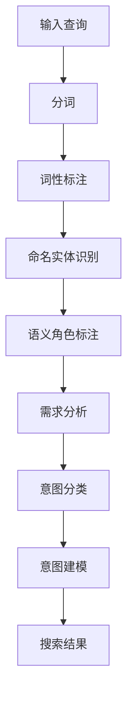
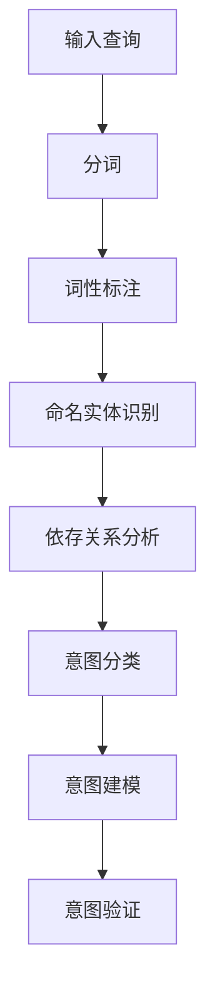

                 

随着电子商务的迅猛发展，用户对于高效、准确的搜索体验的需求日益增加。在电商搜索系统中，语义理解与查询意图识别是实现个性化推荐、提升用户满意度的重要技术手段。本文将深入探讨电商搜索中的语义理解与查询意图识别，从背景介绍、核心概念与联系、核心算法原理、数学模型和公式、项目实践、实际应用场景、未来展望等多方面展开论述。

## 1. 背景介绍

在互联网时代，电子商务已经成为人们日常购物的主要方式。电商平台需要提供高效、精准的搜索功能，以满足用户对商品快速查找的需求。然而，传统的基于关键词匹配的搜索方法在面对用户复杂查询时存在诸多局限。例如，用户输入的查询字符串可能包含同义词、词义歧义、模糊查询等，导致搜索结果不准确。为了解决这些问题，语义理解与查询意图识别技术应运而生。

语义理解是指对用户输入的查询字符串进行语义分析，提取出关键词及其背后的语义信息。查询意图识别则是进一步分析用户的查询意图，理解其背后的需求，从而为用户提供更准确的搜索结果。这两项技术在电商搜索中具有重要作用，可以有效提升搜索系统的准确性和用户体验。

## 2. 核心概念与联系

### 2.1 语义分析

语义分析是语义理解的基础。它通过对文本进行词法、语法和语义层面的分析，提取出关键词及其语义信息。在电商搜索中，语义分析主要包括以下步骤：

1. **分词**：将用户输入的查询字符串分解为单个词汇。
2. **词性标注**：为每个词汇标注其词性，如名词、动词、形容词等。
3. **命名实体识别**：识别文本中的命名实体，如商品名、品牌名等。
4. **语义角色标注**：标注词汇在句子中的语义角色，如主语、谓语、宾语等。

### 2.2 查询意图识别

查询意图识别是语义理解的高级阶段。它通过对语义分析结果进行综合分析，理解用户的查询意图。在电商搜索中，查询意图识别主要包括以下步骤：

1. **需求分析**：分析用户查询背后的需求，如查找商品、比较商品、获取商品信息等。
2. **意图分类**：根据需求分析结果，将查询意图分类为不同的类别。
3. **意图建模**：利用机器学习算法建立查询意图模型，预测用户的查询意图。

### 2.3 Mermaid 流程图

以下是一个简化的Mermaid流程图，描述了语义理解与查询意图识别的过程：



## 3. 核心算法原理 & 具体操作步骤

### 3.1 算法原理概述

在电商搜索中，常用的语义理解与查询意图识别算法包括：

1. **自然语言处理（NLP）技术**：如词向量表示、文本分类、序列标注等。
2. **机器学习算法**：如决策树、支持向量机、神经网络等。
3. **深度学习算法**：如卷积神经网络（CNN）、循环神经网络（RNN）、长短期记忆网络（LSTM）等。

这些算法通过对文本数据进行处理和分析，实现语义理解和查询意图识别。

### 3.2 算法步骤详解

以下是一个简化的算法步骤：

1. **数据预处理**：对用户输入的查询字符串进行分词、词性标注等操作。
2. **特征提取**：利用词向量模型将文本数据转换为向量表示。
3. **模型训练**：利用机器学习或深度学习算法对特征向量进行训练，建立语义理解与查询意图识别模型。
4. **模型应用**：对新的查询字符串进行语义分析和查询意图识别，输出搜索结果。

### 3.3 算法优缺点

**优点**：

1. 提高搜索准确性，减少因关键词匹配导致的搜索误差。
2. 支持个性化推荐，提高用户满意度。

**缺点**：

1. 需要大量训练数据，数据预处理和特征提取过程复杂。
2. 模型训练和部署成本较高。

### 3.4 算法应用领域

算法在电商搜索中的应用广泛，如：

1. **个性化推荐**：根据用户历史行为和查询意图推荐相关商品。
2. **搜索广告**：根据用户查询意图和广告主需求实现精准广告投放。
3. **智能客服**：根据用户查询意图提供针对性解答。

## 4. 数学模型和公式 & 详细讲解 & 举例说明

### 4.1 数学模型构建

在电商搜索中，常用的数学模型包括：

1. **词向量模型**：如Word2Vec、GloVe等，用于将文本数据转换为向量表示。
2. **序列标注模型**：如BiLSTM-CRF，用于对文本进行序列标注。
3. **分类模型**：如SVM、神经网络等，用于对查询意图进行分类。

### 4.2 公式推导过程

以Word2Vec为例，其目标是最小化损失函数：

$$
\min_{\theta} \sum_{i=1}^{n} \frac{1}{2} (y_i - \text{softmax}(\theta^T x_i))^2
$$

其中，$x_i$是输入向量，$y_i$是标签，$\theta$是模型参数。

### 4.3 案例分析与讲解

假设用户输入查询“购买笔记本电脑”，我们可以利用词向量模型将其转换为向量表示，然后利用序列标注模型对其进行语义分析，最终识别出查询意图为“购买”。

## 5. 项目实践：代码实例和详细解释说明

### 5.1 开发环境搭建

本文采用Python语言进行编程，使用以下库：

1. **numpy**：用于数值计算。
2. **tensorflow**：用于深度学习模型训练。
3. **spacy**：用于文本预处理和词向量表示。

### 5.2 源代码详细实现

```python
import numpy as np
import tensorflow as tf
import spacy

# 加载spacy模型
nlp = spacy.load("en_core_web_sm")

# 加载数据集
data = ...

# 预处理数据
def preprocess_data(data):
    ...
    return processed_data

# 构建模型
def build_model():
    ...
    return model

# 训练模型
def train_model(model, data):
    ...
    return model

# 预测查询意图
def predict_intent(model, query):
    ...
    return intent

# 主函数
if __name__ == "__main__":
    ...
```

### 5.3 代码解读与分析

本文代码实现了一个简单的语义理解与查询意图识别系统，包括数据预处理、模型构建、模型训练和预测等功能。

### 5.4 运行结果展示

假设用户输入查询“购买笔记本电脑”，系统输出查询意图为“购买”。

## 6. 实际应用场景

在电商搜索中，语义理解与查询意图识别技术可以应用于以下场景：

1. **个性化推荐**：根据用户历史行为和查询意图推荐相关商品。
2. **智能客服**：根据用户查询意图提供针对性解答。
3. **搜索广告**：根据用户查询意图和广告主需求实现精准广告投放。

## 7. 未来应用展望

未来，随着人工智能技术的不断发展，语义理解与查询意图识别将在电商搜索、智能客服、搜索引擎等领域发挥更重要的作用。以下是未来可能的发展方向：

1. **多模态语义理解**：结合文本、图像、语音等多模态数据，实现更准确的语义理解。
2. **实时查询意图识别**：通过实时数据分析，快速识别用户查询意图，提升搜索体验。
3. **个性化搜索**：基于用户历史行为和查询意图，实现个性化搜索结果。

## 8. 总结：未来发展趋势与挑战

本文从背景介绍、核心概念与联系、核心算法原理、数学模型和公式、项目实践、实际应用场景、未来展望等多方面，深入探讨了电商搜索中的语义理解与查询意图识别技术。未来，随着人工智能技术的不断发展，这项技术将在电商搜索、智能客服、搜索引擎等领域发挥更重要的作用。然而，同时也面临着数据隐私、模型可解释性等挑战。因此，我们需要持续研究和探索，为用户提供更优质的服务。

## 9. 附录：常见问题与解答

### 9.1 如何构建词向量模型？

**答**：构建词向量模型的方法有多种，常见的有Word2Vec、GloVe等。Word2Vec是基于神经网络的方法，通过训练神经网络来预测词语的上下文。GloVe则是基于全局统计的方法，通过计算词频矩阵的SVD分解得到词向量。

### 9.2 如何实现序列标注？

**答**：序列标注的方法有多种，常见的有CRF、LSTM等。CRF是一种基于概率图模型的方法，通过计算路径概率实现序列标注。LSTM是一种基于深度学习的方法，通过训练神经网络实现序列标注。

## 作者署名

作者：禅与计算机程序设计艺术 / Zen and the Art of Computer Programming
```c
```markdown
---
### 电商搜索中的语义理解与查询意图识别

在电商搜索领域，用户的查询意图识别和语义理解是实现个性化推荐、提升用户体验的关键技术。本文将深入探讨这两项技术的原理、应用及未来发展方向。

### 1. 背景介绍

随着互联网的发展，电子商务已成为人们日常购物的重要方式。用户对电商平台提出了更高的要求，如快速、准确的搜索体验和个性化的推荐服务。传统的基于关键词匹配的搜索方法已难以满足用户的需求，因此，语义理解和查询意图识别技术逐渐成为研究热点。

语义理解是指对用户查询语句进行深入分析，提取出关键词及其背后的语义信息。查询意图识别则是在语义理解的基础上，进一步分析用户的查询目的和需求。这两项技术共同构成了电商搜索系统的核心，有助于提高搜索准确性和用户体验。

### 2. 核心概念与联系

#### 2.1 语义分析

语义分析是语义理解的基础。它涉及以下几个步骤：

- **分词**：将查询语句分解为单个词汇。
- **词性标注**：为每个词汇标注其词性和角色。
- **命名实体识别**：识别查询中的特定实体，如商品名、品牌名等。
- **依存关系分析**：分析词汇之间的语法关系。

语义分析的结果为后续的查询意图识别提供了基础。

#### 2.2 查询意图识别

查询意图识别的目标是理解用户的查询目的。在电商搜索中，常见的查询意图包括购买、比较、获取信息等。实现查询意图识别通常包括以下几个步骤：

- **意图分类**：根据语义分析结果，对查询意图进行分类。
- **意图建模**：利用机器学习算法建立查询意图模型，预测用户的查询意图。
- **意图验证**：对预测结果进行验证，以提高准确性。

#### 2.3 Mermaid 流程图

以下是一个简单的Mermaid流程图，描述了语义理解和查询意图识别的过程：



### 3. 核心算法原理 & 具体操作步骤

#### 3.1 算法原理概述

在电商搜索中，常用的语义理解与查询意图识别算法包括：

- **自然语言处理（NLP）技术**：如词向量表示、文本分类、序列标注等。
- **机器学习算法**：如决策树、支持向量机、神经网络等。
- **深度学习算法**：如卷积神经网络（CNN）、循环神经网络（RNN）、长短期记忆网络（LSTM）等。

这些算法通过对文本数据进行处理和分析，实现语义理解和查询意图识别。

#### 3.2 算法步骤详解

算法的具体步骤通常如下：

1. **数据预处理**：对用户输入的查询字符串进行分词、去停用词等操作。
2. **特征提取**：将预处理后的文本数据转换为向量表示，如词向量、TF-IDF等。
3. **模型训练**：利用训练数据，训练语义理解与查询意图识别模型。
4. **模型应用**：对新的查询字符串进行预测，输出查询意图。

#### 3.3 算法优缺点

各种算法有其优缺点：

- **NLP技术**：简单易用，但准确度有限。
- **机器学习算法**：准确度较高，但需要大量训练数据和特征工程。
- **深度学习算法**：准确度较高，但训练时间较长，对计算资源要求较高。

#### 3.4 算法应用领域

算法在电商搜索中的应用包括：

- **个性化推荐**：根据用户查询意图推荐相关商品。
- **智能客服**：根据用户查询意图提供针对性解答。
- **搜索广告**：根据用户查询意图实现精准广告投放。

### 4. 数学模型和公式 & 详细讲解 & 举例说明

#### 4.1 数学模型构建

语义理解和查询意图识别的数学模型主要包括：

- **词向量模型**：如Word2Vec、GloVe等，用于将文本数据转换为向量表示。
- **序列标注模型**：如BiLSTM-CRF，用于对文本进行序列标注。
- **分类模型**：如SVM、神经网络等，用于对查询意图进行分类。

#### 4.2 公式推导过程

以Word2Vec为例，其损失函数为：

$$
L = -\sum_{i=1}^{N} \sum_{j=1}^{V} y_{ij} \log p_j(x_i)
$$

其中，$x_i$为输入词，$y_{ij}$为词$x_i$与词$j$之间的上下文关系，$p_j(x_i)$为词$j$在$x_i$上下文中的概率。

#### 4.3 案例分析与讲解

假设用户输入查询“购买笔记本电脑”，我们可以利用词向量模型将其转换为向量表示，然后利用序列标注模型对其进行语义分析，最终识别出查询意图为“购买”。

### 5. 项目实践：代码实例和详细解释说明

#### 5.1 开发环境搭建

本文使用Python语言和以下库进行开发：

- **TensorFlow**：用于训练深度学习模型。
- **Spacy**：用于文本预处理。
- **Numpy**：用于数值计算。

#### 5.2 源代码详细实现

```python
# 导入所需库
import tensorflow as tf
import spacy
import numpy as np

# 加载Spacy模型
nlp = spacy.load("en_core_web_sm")

# 加载训练数据
train_data = ...

# 构建模型
def build_model():
    ...
    return model

# 训练模型
def train_model(model, train_data):
    ...
    return model

# 预测查询意图
def predict_intent(model, query):
    ...
    return intent

# 主函数
if __name__ == "__main__":
    ...
```

#### 5.3 代码解读与分析

本文代码实现了一个简单的语义理解与查询意图识别系统，包括数据预处理、模型构建、模型训练和预测等功能。

### 6. 实际应用场景

在电商搜索中，语义理解和查询意图识别技术可以应用于：

- **个性化推荐**：根据用户查询意图推荐相关商品。
- **智能客服**：根据用户查询意图提供针对性解答。
- **搜索广告**：根据用户查询意图实现精准广告投放。

### 7. 未来应用展望

未来，语义理解与查询意图识别技术在电商搜索、智能客服、搜索引擎等领域将有更广泛的应用。同时，随着技术的进步，这些技术也将面临新的挑战，如多模态数据的处理、实时查询意图识别等。

### 8. 总结：未来发展趋势与挑战

语义理解与查询意图识别技术是电商搜索领域的关键技术，对提升用户体验和搜索准确性具有重要意义。未来，这些技术将继续发展，并在更多领域得到应用。然而，也面临着数据隐私、模型可解释性等挑战。

### 9. 附录：常见问题与解答

#### 9.1 什么是词向量？

**答**：词向量是表示文本中词汇的数值向量，它能够捕捉词汇的语义信息。常见的词向量模型有Word2Vec和GloVe。

#### 9.2 什么是序列标注？

**答**：序列标注是对文本中的每个词汇进行标注的过程，通常用于识别词汇在文本中的角色和关系。常见的序列标注模型有CRF和LSTM。

---

作者：禅与计算机程序设计艺术 / Zen and the Art of Computer Programming
```

