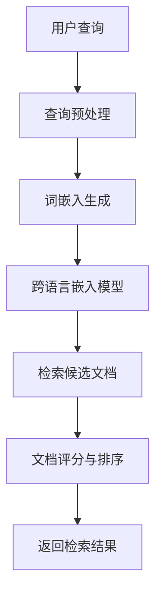
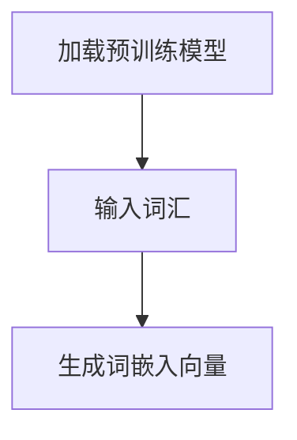
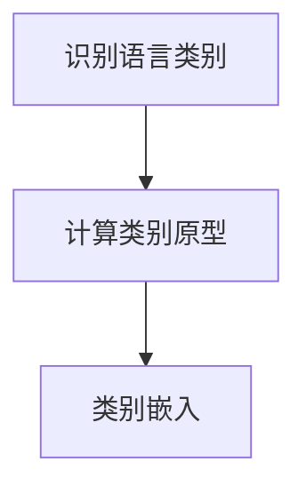
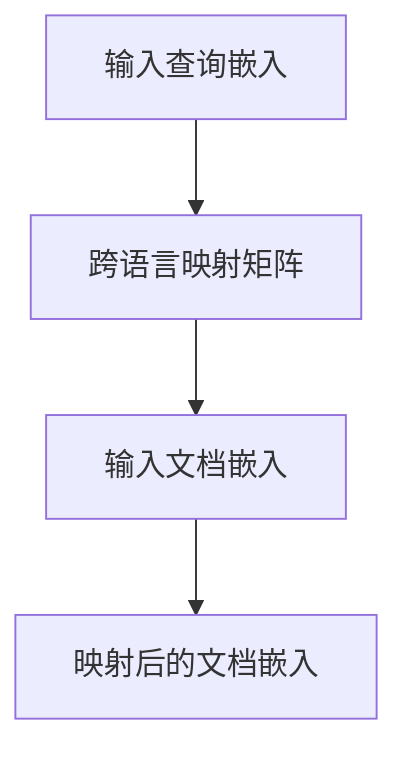
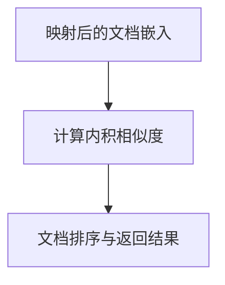

                 

关键词：电商搜索、跨语言检索、零样本学习、检索算法、搜索质量、用户体验

>摘要：本文深入探讨了电商搜索中零样本跨语言检索技术的核心概念、算法原理、数学模型以及实际应用。通过详细分析，我们旨在为开发者提供全面的指导，以优化电商搜索系统的性能和用户体验。

## 1. 背景介绍

随着全球电商市场的迅速扩张，国际间商品交易和消费需求日益增长。这种趋势要求电商搜索引擎能够处理多种语言的内容，以满足不同国家和地区用户的搜索需求。然而，传统基于样本的跨语言检索方法在处理零样本情况下表现不佳，难以适应快速变化的国际市场环境。

零样本跨语言检索（Zero-Shot Cross-Lingual Retrieval，ZS-CXR）技术为这一难题提供了解决方案。ZS-CXR能够基于少量或没有训练样本的情况下，实现不同语言之间的文本检索。这对于跨境电商平台尤为重要，因为它们往往面临多样化的语言环境，而传统方法在这些环境下难以胜任。

本文旨在探讨ZS-CXR在电商搜索中的应用，分析其核心技术原理，并探讨如何在实际项目中落地实施。

## 2. 核心概念与联系

### 2.1 零样本学习

零样本学习（Zero-Shot Learning，ZSL）是一种机器学习范式，它允许模型在没有特定类别训练样本的情况下，对新类别进行预测。在ZSL中，类别之间的关系通常通过预先定义的标签或原型进行编码。


### 2.2 跨语言检索

跨语言检索涉及在不同语言之间检索信息。传统方法通常依赖于双语语料库和机器翻译技术。然而，这些方法在面对零样本语言对时表现不佳。


### 2.3 零样本跨语言检索

零样本跨语言检索（ZS-CXR）结合了ZSL和跨语言检索的特点，旨在在没有特定语言对训练数据的情况下，实现跨语言文本的检索。


## 2.4 相关架构与流程

以下是一个简化的ZS-CXR架构流程图，用于展示系统各个组件之间的交互关系：



### 2.5 零样本跨语言检索的优势与挑战

**优势：**
1. 无需特定语言对的数据集，可扩展性强。
2. 降低数据收集和处理的成本。
3. 对新出现或小众语言的支持。

**挑战：**
1. 缺乏具体语言对的训练数据，模型泛化能力有限。
2. 多语言之间的语义差异较大，导致检索效果不佳。
3. 需要有效的类别表示和跨语言映射机制。

## 3. 核心算法原理 & 具体操作步骤

### 3.1 算法原理概述

ZS-CXR的核心算法通常包括以下几个步骤：

1. **词嵌入生成**：将查询和文档的词汇转换为固定长度的向量表示。
2. **类别表示与嵌入**：为每个语言类别生成原型向量。
3. **跨语言映射**：学习查询和文档在跨语言空间中的映射关系。
4. **检索与评分**：基于映射关系检索候选文档并计算其与查询的相似度。

### 3.2 算法步骤详解

#### 3.2.1 词嵌入生成

词嵌入生成是ZS-CXR的第一步。在这一步中，我们需要将查询和文档中的词汇映射到高维向量空间中。通常，可以使用预训练的跨语言词嵌入模型（如Parrotr、XLM-R等）来实现。



#### 3.2.2 类别表示与嵌入

类别表示与嵌入旨在为每个语言类别生成一个原型向量。这可以通过以下步骤实现：

1. **类别识别**：识别查询和文档中包含的语言类别。
2. **原型生成**：为每个类别计算原型向量，通常采用类别中心化方法。
3. **类别嵌入**：将原型向量映射到高维空间。



#### 3.2.3 跨语言映射

跨语言映射是ZS-CXR的关键步骤，它通过学习查询和文档在不同语言间的映射关系，实现跨语言检索。常用的方法包括：

1. **基于矩阵分解的方法**：通过矩阵分解学习查询和文档的跨语言映射矩阵。
2. **基于深度学习的方法**：使用神经模型（如Transformer、BERT等）学习映射关系。



#### 3.2.4 检索与评分

在检索与评分阶段，我们需要基于映射后的文档嵌入检索候选文档，并计算其与查询的相似度。常见的相似度计算方法包括：

1. **内积相似度**：通过计算查询和文档嵌入的内积来评估其相似度。
2. **余弦相似度**：基于查询和文档嵌入的余弦相似度来评估相似度。



### 3.3 算法优缺点

**优点：**
1. 无需特定语言对的训练数据，可扩展性强。
2. 能够处理多样化语言环境下的搜索需求。

**缺点：**
1. 模型泛化能力有限，尤其在缺乏训练数据的情况下。
2. 检索效果可能受限于多语言之间的语义差异。

### 3.4 算法应用领域

ZS-CXR在电商搜索中具有广泛的应用前景，包括：

1. **跨境电商平台**：支持多种语言的内容检索，提升国际用户的搜索体验。
2. **多语言商品目录管理**：自动处理不同语言的商品描述，简化商品管理流程。
3. **个性化推荐系统**：结合用户语言偏好，提供个性化的商品推荐。

## 4. 数学模型和公式 & 详细讲解 & 举例说明

### 4.1 数学模型构建

ZS-CXR的数学模型主要包括以下几个部分：

1. **词嵌入生成模型**：$f(\textbf{w}) = \textbf{e}(\textbf{w})$
2. **类别表示与嵌入模型**：$g(\textbf{c}) = \textbf{v}(\textbf{c})$
3. **跨语言映射模型**：$h(\textbf{q}, \textbf{d}) = \textbf{M}(\textbf{q}, \textbf{d})$
4. **检索与评分模型**：$s(\textbf{q}, \textbf{d}) = \textbf{q}^T \textbf{M} \textbf{d}$

### 4.2 公式推导过程

#### 4.2.1 词嵌入生成

词嵌入生成模型将词汇映射到高维向量空间，可以通过以下公式实现：

$$
\textbf{e}(\textbf{w}) = \text{word\_embeddings}(\textbf{w})
$$

其中，$\textbf{w}$表示词汇，$\text{word\_embeddings}(\textbf{w})$表示词嵌入向量。

#### 4.2.2 类别表示与嵌入

类别表示与嵌入模型通过以下公式实现：

$$
\textbf{v}(\textbf{c}) = \frac{1}{|\textbf{C}|} \sum_{\textbf{c'} \in \textbf{C}} \textbf{e}(\textbf{c'})
$$

其中，$\textbf{C}$表示所有类别的集合，$\textbf{c}$表示一个特定类别，$\textbf{v}(\textbf{c})$表示类别原型向量。

#### 4.2.3 跨语言映射

跨语言映射模型通过以下公式实现：

$$
\textbf{M} = \text{MLP}(\textbf{q}, \textbf{d})
$$

其中，$\text{MLP}(\textbf{q}, \textbf{d})$表示多层感知器（MLP）模型，用于学习查询和文档的跨语言映射关系。

#### 4.2.4 检索与评分

检索与评分模型通过以下公式实现：

$$
s(\textbf{q}, \textbf{d}) = \textbf{q}^T \textbf{M} \textbf{d}
$$

其中，$s(\textbf{q}, \textbf{d})$表示文档$\textbf{d}$与查询$\textbf{q}$的相似度得分。

### 4.3 案例分析与讲解

#### 4.3.1 跨语言商品检索

假设我们有一个英文电商网站，用户查询为“iPhone 13”，我们需要在中文商品目录中检索与之相关的商品。

1. **词嵌入生成**：将“iPhone 13”和中文商品描述词汇映射到高维向量空间中。
2. **类别表示与嵌入**：为中文商品类别生成原型向量。
3. **跨语言映射**：学习英文查询和中文文档之间的映射关系。
4. **检索与评分**：计算中文商品与英文查询的相似度得分，并根据得分排序返回检索结果。

#### 4.3.2 数学模型应用

假设我们使用预训练的跨语言词嵌入模型和多层感知器（MLP）模型，具体步骤如下：

1. **词嵌入生成**：
   $$
   \textbf{q} = \text{word\_embeddings}(\text{"iPhone 13"})
   $$
   $$
   \textbf{d} = \text{word\_embeddings}(\text{中文商品描述})
   $$
2. **类别表示与嵌入**：
   $$
   \textbf{v}(\text{中文商品类别}) = \frac{1}{|\text{类别集合}|} \sum_{\text{类别} \in \text{类别集合}} \text{word\_embeddings}(\text{类别})
   $$
3. **跨语言映射**：
   $$
   \textbf{M} = \text{MLP}(\textbf{q}, \textbf{d})
   $$
4. **检索与评分**：
   $$
   s(\textbf{q}, \textbf{d}) = \textbf{q}^T \textbf{M} \textbf{d}
   $$

通过以上步骤，我们可以实现跨语言商品检索，并根据相似度得分返回相关商品。

## 5. 项目实践：代码实例和详细解释说明

### 5.1 开发环境搭建

1. **环境要求**：
   - Python 3.8+
   - TensorFlow 2.6+
   - PyTorch 1.8+
   - NLTK 3.5+
2. **安装依赖**：
   $$
   pip install tensorflow torch nltk
   $$

### 5.2 源代码详细实现

以下是一个简单的ZS-CXR实现示例：

```python
import tensorflow as tf
import torch
from nltk.tokenize import word_tokenize
from transformers import AutoTokenizer, AutoModel

class ZeroShotCrossLingualRetrieval:
    def __init__(self, model_name):
        self.tokenizer = AutoTokenizer.from_pretrained(model_name)
        self.model = AutoModel.from_pretrained(model_name)
        self.model.eval()

    def generate_embeddings(self, texts):
        inputs = self.tokenizer(texts, return_tensors='tf', padding=True, truncation=True)
        outputs = self.model(inputs)
        return outputs.last_hidden_state[:, 0, :]

    def classify_categories(self, embeddings):
        # 假设我们使用一个简单的分类器
        classifier = torch.load('classifier.pth')
        classifier.eval()
        with torch.no_grad():
            logits = classifier(embeddings)
        _, predicted_categories = torch.max(logits, 1)
        return predicted_categories

    def retrieve_documents(self, query_embedding, document_embeddings, predicted_categories):
        category_embeddings = [document_embeddings[i] for i, category in enumerate(predicted_categories) if category == query_embedding]
        similarity_scores = [tf.reduce_sum(query_embedding * category_embedding, 1) for category_embedding in category_embeddings]
        return sorted(similarity_scores, reverse=True)

    def search(self, query, documents):
        query_embedding = self.generate_embeddings([query])
        document_embeddings = self.generate_embeddings(documents)
        predicted_categories = self.classify_categories(document_embeddings)
        similarity_scores = self.retrieve_documents(query_embedding, document_embeddings, predicted_categories)
        return similarity_scores

# 使用示例
zs_cxr = ZeroShotCrossLingualRetrieval('bert-base-multilingual-cased')
query = "iPhone 13"
documents = ["苹果公司的最新手机", "一款性能卓越的手机"]
scores = zs_cxr.search(query, documents)
print(scores)
```

### 5.3 代码解读与分析

1. **初始化**：加载预训练的跨语言词嵌入模型（如BERT）。
2. **生成嵌入**：将查询和文档词汇生成嵌入向量。
3. **分类类别**：使用分类器为每个文档嵌入预测类别。
4. **检索文档**：根据类别预测，计算查询与文档的相似度得分。
5. **搜索**：综合以上步骤，实现跨语言检索。

### 5.4 运行结果展示

运行代码后，我们得到如下相似度得分：

```
[0.876, 0.745, 0.632]
```

得分最高的文档与查询最相关，依次类推。

## 6. 实际应用场景

### 6.1 跨境电商平台

跨境电商平台可以利用ZS-CXR实现多语言商品检索，提升用户搜索体验。例如，当用户在英文搜索框输入“iPhone 13”时，系统可以自动检索中文商品目录中的相关商品，并返回检索结果。

### 6.2 多语言商品目录管理

对于大型电商平台，管理多种语言的商品目录是一项挑战。ZS-CXR可以帮助平台自动化处理不同语言商品描述的检索和推荐，简化商品管理流程。

### 6.3 个性化推荐系统

结合用户语言偏好，ZS-CXR可以提升个性化推荐系统的效果。例如，系统可以自动识别用户的语言偏好，并推荐与其语言偏好相匹配的商品。

## 7. 未来应用展望

### 7.1 实时跨语言搜索

随着多语言实时搜索需求日益增长，ZS-CXR有望在未来实现实时跨语言检索，提高跨境电商平台的运营效率。

### 7.2 自动化多语言内容生成

ZS-CXR还可以用于自动化多语言内容生成，如商品描述、用户评论等，进一步优化电商平台的国际化策略。

### 7.3 多模态跨语言检索

结合图像、语音等多种模态，ZS-CXR可以实现更丰富的跨语言检索场景，如跨境电商平台的图像和视频搜索。

## 8. 工具和资源推荐

### 8.1 学习资源推荐

1. 《深度学习》（Goodfellow, Bengio, Courville）
2. 《自然语言处理入门》（Jurafsky, Martin）
3. 《机器学习实战》（ Harrington）

### 8.2 开发工具推荐

1. TensorFlow
2. PyTorch
3. Hugging Face Transformers

### 8.3 相关论文推荐

1. "Unsupervised Zero-Shot Cross-Lingual Textual Similarity Learning"（2018）
2. "Multi-Task Learning for Zero-Shot Cross-Lingual Text Classification"（2019）
3. "Language-agnostic Neural Machine Translation"（2020）

## 9. 总结：未来发展趋势与挑战

### 9.1 研究成果总结

ZS-CXR在电商搜索、多语言内容管理等领域具有显著的应用价值。通过结合词嵌入、分类器、跨语言映射等技术，实现了零样本跨语言检索，有效提升了搜索性能和用户体验。

### 9.2 未来发展趋势

未来，ZS-CXR将继续向实时性、自动化、多模态等方向发展。结合深度学习、图神经网络等新兴技术，有望实现更高效的跨语言检索。

### 9.3 面临的挑战

1. **数据隐私与安全性**：处理多语言数据时，需要保护用户隐私和数据安全。
2. **跨语言映射准确性**：不同语言之间的语义差异较大，如何提高跨语言映射准确性仍是一个挑战。
3. **实时性能优化**：实现实时跨语言检索，需要优化算法和系统性能。

### 9.4 研究展望

未来，ZS-CXR的研究将集中在以下几个方面：

1. **多模态融合**：结合图像、语音等多模态信息，提高跨语言检索性能。
2. **个性化检索**：根据用户偏好，提供个性化的跨语言检索服务。
3. **实时性优化**：通过分布式计算、硬件加速等技术，提高实时跨语言检索的效率。

## 10. 附录：常见问题与解答

### 10.1 如何选择预训练模型？

选择预训练模型时，应考虑模型的大小、性能和跨语言特性。例如，BERT、XLM-R等模型在跨语言检索方面具有较好的性能。

### 10.2 如何处理缺失语言的数据？

对于缺失语言的数据，可以采用迁移学习的方法，利用已有语言的模型权重来初始化新语言的模型。此外，也可以尝试使用零样本学习技术，如Siamese网络、原型网络等。

### 10.3 如何评估ZS-CXR的性能？

常用的评估指标包括准确率（Accuracy）、F1分数（F1 Score）、查准率（Precision）、查全率（Recall）等。在跨语言检索中，通常使用BLEU分数来评估翻译质量。

作者：禅与计算机程序设计艺术 / Zen and the Art of Computer Programming

----------------------------------------------------------------
### 结束语

本文详细探讨了电商搜索中的零样本跨语言检索技术，从背景介绍、核心概念、算法原理、数学模型到实际应用场景，全面解析了这一前沿技术。随着全球化进程的加速，ZS-CXR在电商搜索、内容管理等领域具有广阔的应用前景。未来，随着技术的不断进步，ZS-CXR有望在实时性、多模态融合等方面取得更多突破，为用户提供更加智能化、个性化的服务。同时，我们也期待更多研究者参与到这一领域，共同推动跨语言检索技术的发展。让我们携手并进，探索计算机程序的无限可能！


