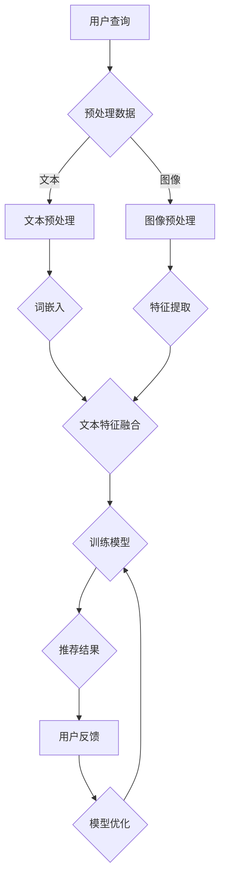

                 

关键词：电商搜索推荐、AI大模型、多模态融合、自然语言处理、计算机视觉、数据挖掘、深度学习、神经网络、推荐系统

## 摘要

随着互联网技术的飞速发展和电子商务的蓬勃兴起，电商搜索推荐系统已经成为提升用户满意度和增加销售额的关键因素。本文将探讨一种新兴的AI技术——大模型多模态融合技术在电商搜索推荐中的应用。通过融合自然语言处理、计算机视觉和数据挖掘等领域的先进算法，本文旨在为电商推荐系统提供更精准、更智能的推荐服务，从而提升用户体验和商业价值。本文将首先介绍电商搜索推荐系统的基础知识，然后深入分析多模态融合技术的原理、算法和实现方法，并探讨其在电商搜索推荐中的应用实例，最后展望未来的发展趋势与挑战。

## 1. 背景介绍

### 电商搜索推荐系统的基本概念

电商搜索推荐系统是一种通过分析用户行为、商品特征和搜索历史等数据，为用户个性化推荐相关商品的技术。它广泛应用于各类电商平台，如亚马逊、淘宝、京东等，成为提高用户满意度和增加销售额的重要手段。

电商搜索推荐系统的核心功能包括：

1. **搜索功能**：用户通过关键词或商品名称进行搜索，系统返回相关的商品列表。
2. **推荐功能**：根据用户的兴趣和行为，系统为用户推荐可能感兴趣的商品。
3. **个性化服务**：系统根据用户的偏好和历史行为，为用户提供个性化的推荐。

### 电商搜索推荐系统的发展历程

电商搜索推荐系统的发展经历了以下几个阶段：

1. **基于规则的推荐**：早期推荐系统主要依赖于人工定义的规则，如基于关键词匹配、商品分类等。
2. **基于协同过滤的推荐**：协同过滤方法通过分析用户的行为数据，发现用户之间的相似性，为用户推荐相似用户的喜欢的商品。
3. **基于内容的推荐**：该方法通过分析商品的属性和描述，为用户推荐具有相似属性或内容的商品。
4. **混合推荐**：结合多种推荐方法，以提高推荐系统的准确性和覆盖度。

### 当前电商搜索推荐系统的挑战与机遇

随着电商市场的不断扩大和用户需求的日益多样，当前电商搜索推荐系统面临以下挑战：

1. **数据多样性**：用户数据、商品数据、行为数据等越来越丰富，如何有效整合和处理这些数据成为一大挑战。
2. **实时性**：用户行为的实时性要求推荐系统能够快速响应用户需求，提供实时推荐。
3. **个性化**：如何准确捕捉用户的个性化需求，为用户提供真正感兴趣的商品。

同时，随着人工智能技术的发展，特别是深度学习、多模态融合等技术的引入，电商搜索推荐系统也面临着前所未有的机遇：

1. **智能推荐**：通过深度学习算法，推荐系统可以更好地理解和预测用户的兴趣，提供更智能的推荐。
2. **多模态融合**：融合自然语言处理、计算机视觉等多种数据类型，为推荐系统提供更全面、更精准的数据输入。
3. **个性化体验**：通过多模态融合技术，推荐系统可以更准确地捕捉用户的个性化需求，提供更加个性化的推荐服务。

### 人工智能技术在电商搜索推荐中的应用

人工智能技术在电商搜索推荐中的应用主要包括以下几个方面：

1. **自然语言处理**：通过自然语言处理技术，可以理解用户输入的关键词，提取关键词的情感、意图等信息，从而为推荐提供更精准的输入。
2. **计算机视觉**：通过计算机视觉技术，可以分析商品图片，提取商品的属性、特征等信息，从而为推荐提供更丰富的数据输入。
3. **数据挖掘**：通过数据挖掘技术，可以从海量数据中提取有用的信息，为推荐提供数据支持。
4. **深度学习**：通过深度学习技术，可以建立复杂的模型，对用户行为、商品特征等进行深度学习，从而提高推荐的准确性。

### 多模态融合技术的概念与发展

多模态融合技术是指将不同模态的数据（如文本、图像、声音等）进行整合和处理，以实现更全面、更准确的信息理解和任务完成。

多模态融合技术经历了以下几个发展阶段：

1. **数据融合**：早期多模态融合主要采用简单的叠加方法，将不同模态的数据进行合并。
2. **特征融合**：随着深度学习技术的发展，特征融合成为多模态融合的主要方法，通过提取不同模态的特征，然后进行融合。
3. **模型融合**：在模型层面进行融合，通过联合训练多个模型，实现多模态信息的融合。

### 多模态融合技术在电商搜索推荐中的应用前景

多模态融合技术在电商搜索推荐中具有广泛的应用前景：

1. **提高推荐准确性**：通过融合多种数据类型，可以更全面地捕捉用户的兴趣和需求，提高推荐的准确性。
2. **提升用户体验**：通过多模态融合，可以为用户提供更加丰富、多样化的推荐服务，提升用户体验。
3. **增强个性化推荐**：通过多模态融合，可以更准确地捕捉用户的个性化需求，提供更加个性化的推荐。

## 2. 核心概念与联系

在探讨电商搜索推荐中的AI大模型多模态融合技术之前，我们需要了解几个核心概念，包括自然语言处理（NLP）、计算机视觉（CV）、数据挖掘（DM）以及深度学习（DL）等。这些概念不仅构成了多模态融合技术的基础，而且在实际应用中相互关联、相互补充。

### 2.1 自然语言处理（NLP）

自然语言处理是人工智能的一个分支，主要研究如何让计算机理解、处理和生成自然语言。在电商搜索推荐中，NLP技术主要用于分析用户输入的查询语句，提取关键词、情感和意图等，从而为推荐提供语义层面的理解。

- **关键词提取**：通过词频分析、TF-IDF等方法，从用户查询中提取出关键词。
- **情感分析**：利用情感分析算法，判断用户查询中的情感倾向，如正面、负面或中性。
- **实体识别**：识别查询中的实体，如商品名称、品牌等，以便进行更精准的推荐。

### 2.2 计算机视觉（CV）

计算机视觉是研究如何使计算机“看”见和理解周围环境的技术。在电商搜索推荐中，CV技术主要用于分析商品图片，提取商品的属性和特征，从而为推荐提供视觉层面的信息。

- **图像分类**：对商品图片进行分类，如衣服、电子产品等。
- **目标检测**：识别图像中的特定目标，如识别图片中的商品。
- **特征提取**：提取图像中的关键特征，如颜色、纹理等，用于后续的推荐。

### 2.3 数据挖掘（DM）

数据挖掘是一种从大量数据中发现有用信息的方法。在电商搜索推荐中，数据挖掘技术主要用于从用户行为数据、商品数据中提取有价值的信息，为推荐提供数据支持。

- **用户行为分析**：分析用户在电商平台上的行为，如浏览、点击、购买等，以了解用户的需求和偏好。
- **关联规则挖掘**：发现用户行为数据中的关联关系，如“购买了商品A的用户还可能购买商品B”。
- **聚类分析**：将用户或商品进行分类，以便进行更精准的推荐。

### 2.4 深度学习（DL）

深度学习是一种基于多层神经网络的学习方法，能够自动提取数据中的特征和模式。在电商搜索推荐中，深度学习技术广泛应用于构建推荐模型，提高推荐准确性。

- **深度神经网络**：用于构建复杂的推荐模型，如多层的感知机、卷积神经网络（CNN）等。
- **生成对抗网络（GAN）**：用于生成新的商品图像，提高推荐系统的多样性。
- **强化学习**：用于优化推荐策略，使推荐系统在动态环境中做出更好的决策。

### 2.5 多模态融合技术的原理与架构

多模态融合技术的核心思想是将不同模态的数据进行整合，以实现更全面、更准确的信息理解。以下是多模态融合技术的原理和架构：

1. **数据预处理**：对来自不同模态的数据进行预处理，如图像的去噪、文本的词向量化等。
2. **特征提取**：使用不同的算法，从不同模态的数据中提取特征，如NLP中的词嵌入、CV中的卷积特征等。
3. **特征融合**：将不同模态的特征进行融合，如通过拼接、加权平均等方法。
4. **模型训练**：使用融合后的特征，训练多模态模型，如深度神经网络。
5. **模型评估与优化**：评估模型性能，通过调整参数、改进算法等方法，优化模型。

### 2.6 Mermaid 流程图

以下是多模态融合技术在电商搜索推荐中的应用流程图：



通过这个流程图，我们可以清晰地看到多模态融合技术在电商搜索推荐中的应用步骤，包括数据预处理、特征提取、特征融合、模型训练、推荐结果生成、用户反馈和模型优化等环节。

## 3. 核心算法原理 & 具体操作步骤

### 3.1 算法原理概述

在电商搜索推荐中，AI大模型多模态融合技术通过整合自然语言处理、计算机视觉和数据挖掘等领域的算法，实现对用户兴趣和商品特征的深度理解和精准匹配。以下是该技术的核心算法原理：

1. **自然语言处理（NLP）算法**：
   - **词嵌入（Word Embedding）**：将文本中的词语映射到高维向量空间，以便于计算机处理。
   - **情感分析（Sentiment Analysis）**：分析用户查询的情感倾向，如正面、负面或中性。
   - **命名实体识别（Named Entity Recognition, NER）**：识别查询中的实体，如商品名称、品牌等。

2. **计算机视觉（CV）算法**：
   - **卷积神经网络（CNN）**：用于提取图像中的特征，如边缘、纹理等。
   - **目标检测（Object Detection）**：识别图像中的特定目标，如商品。
   - **图像生成（Image Generation）**：使用生成对抗网络（GAN）生成新的商品图像，提高推荐多样性。

3. **数据挖掘（DM）算法**：
   - **协同过滤（Collaborative Filtering）**：通过分析用户行为数据，发现用户之间的相似性，进行推荐。
   - **关联规则挖掘（Association Rule Mining）**：发现用户行为数据中的关联关系，为推荐提供支持。
   - **聚类分析（Cluster Analysis）**：将用户或商品进行分类，以便进行更精准的推荐。

4. **深度学习（DL）算法**：
   - **多输入神经网络**：整合NLP和CV的特征，训练多模态模型。
   - **强化学习（Reinforcement Learning）**：优化推荐策略，提高推荐效果。

### 3.2 算法步骤详解

#### 步骤1：数据预处理

数据预处理是整个算法的基础，包括对文本、图像等数据的清洗、归一化等操作。

- **文本预处理**：去除停用词、标点符号，对文本进行分词、词性标注等。
- **图像预处理**：对图像进行缩放、裁剪、增强等操作，以适应后续的特征提取。

#### 步骤2：特征提取

特征提取是从原始数据中提取有用的信息，以供后续处理。

- **文本特征提取**：使用词嵌入算法（如Word2Vec、GloVe等）将词语映射到向量空间。
- **图像特征提取**：使用卷积神经网络（如VGG、ResNet等）提取图像中的特征。

#### 步骤3：特征融合

特征融合是将不同模态的特征进行整合，以提高推荐效果。

- **拼接融合**：将文本和图像的特征进行拼接，形成多维特征向量。
- **加权融合**：根据特征的重要程度，对文本和图像的特征进行加权融合。

#### 步骤4：模型训练

模型训练是通过已标注的数据集，训练多模态模型，以实现推荐任务。

- **多输入神经网络**：使用深度学习框架（如TensorFlow、PyTorch等）搭建多输入神经网络，训练模型。
- **损失函数**：使用交叉熵损失函数（Cross-Entropy Loss）优化模型。

#### 步骤5：推荐结果生成

推荐结果生成是根据用户特征和商品特征，为用户生成推荐列表。

- **相似度计算**：计算用户和商品的相似度，如使用余弦相似度、欧氏距离等。
- **排序算法**：使用排序算法（如Top-K算法等），为用户生成推荐列表。

#### 步骤6：用户反馈与模型优化

用户反馈与模型优化是提高推荐系统效果的关键。

- **用户反馈收集**：收集用户对推荐结果的评价，如点击、购买等。
- **模型优化**：根据用户反馈，调整模型参数，优化推荐效果。

### 3.3 算法优缺点

#### 优点

1. **提高推荐准确性**：通过整合多种数据类型，可以更全面地捕捉用户的兴趣和需求，提高推荐的准确性。
2. **提升用户体验**：通过多模态融合，可以为用户提供更加丰富、多样化的推荐服务，提升用户体验。
3. **增强个性化推荐**：通过多模态融合，可以更准确地捕捉用户的个性化需求，提供更加个性化的推荐。

#### 缺点

1. **计算成本高**：多模态融合技术涉及多种算法和模型，计算成本较高。
2. **数据质量要求高**：多模态融合技术对数据质量要求较高，需要确保文本、图像等数据的一致性和完整性。
3. **实时性挑战**：实时性要求较高，需要优化算法和模型，以提高推荐速度。

### 3.4 算法应用领域

多模态融合技术在电商搜索推荐中的应用广泛，不仅限于电商领域，还可以应用于以下领域：

1. **社交媒体推荐**：通过整合用户文本、图片等多模态数据，为用户推荐感兴趣的内容。
2. **医疗诊断**：通过整合医学影像、文本报告等多模态数据，提高诊断准确率。
3. **金融风控**：通过整合用户行为、交易记录等多模态数据，提高风险识别能力。
4. **智能问答系统**：通过整合文本、语音等多模态数据，提高问答系统的准确性和交互性。

## 4. 数学模型和公式 & 详细讲解 & 举例说明

### 4.1 数学模型构建

在电商搜索推荐中的多模态融合技术，我们可以构建一个综合模型，以整合来自自然语言处理、计算机视觉和数据挖掘的多种数据类型。以下是该模型的数学描述：

#### 4.1.1 用户和商品特征表示

1. **用户特征表示**：假设用户特征矩阵为U ∈ R^m×d，其中m是用户数量，d是用户特征的维度。
2. **商品特征表示**：假设商品特征矩阵为V ∈ R^n×e，其中n是商品数量，e是商品特征的维度。

#### 4.1.2 特征提取和融合

- **文本特征**：使用词嵌入算法，将用户查询文本转化为向量，得到用户文本特征矩阵W ∈ R^m×f，其中f是词嵌入的维度。
- **图像特征**：使用卷积神经网络提取商品图像特征，得到商品图像特征矩阵G ∈ R^n×g，其中g是图像特征的维度。
- **数据挖掘特征**：通过协同过滤等方法提取用户行为数据中的特征，得到用户行为特征矩阵B ∈ R^m×h，其中h是行为特征的维度。

#### 4.1.3 多模态融合模型

融合以上特征，构建多模态融合模型，通过深度学习框架（如PyTorch）实现：

```python
class MultiModalFusionModel(nn.Module):
    def __init__(self, user_dim, text_dim, image_dim, behavior_dim):
        super(MultiModalFusionModel, self).__init__()
        self.user_embedding = nn.Embedding(user_dim, text_dim)
        self.text_embedding = nn.Embedding(text_dim, text_dim)
        self.image_embedding = nn.Linear(image_dim, text_dim)
        self.behavior_embedding = nn.Linear(behavior_dim, text_dim)
        self.fc = nn.Linear(2 * text_dim + image_dim, 1)
        
    def forward(self, user_ids, text_inputs, image_inputs, behavior_inputs):
        user_embeddings = self.user_embedding(user_ids)
        text_embeddings = self.text_embedding(text_inputs)
        image_embeddings = self.image_embedding(image_inputs)
        behavior_embeddings = self.behavior_embedding(behavior_inputs)
        
        fused_embeddings = torch.cat((user_embeddings, text_embeddings, image_embeddings, behavior_embeddings), dim=1)
        outputs = self.fc(fused_embeddings)
        return outputs
```

### 4.2 公式推导过程

在多模态融合模型中，我们使用损失函数来优化模型参数。以下是一个简化的损失函数推导过程：

#### 4.2.1 损失函数定义

假设我们使用交叉熵损失函数（Cross-Entropy Loss）来优化模型：

$$
L = -\sum_{i=1}^{N} \sum_{c=1}^{C} y_i(c) \cdot \log(p_i(c))
$$

其中，$y_i(c)$是标签，$p_i(c)$是模型预测的概率分布。

#### 4.2.2 预测概率计算

预测概率$p_i(c)$是通过多模态融合模型计算得到的：

$$
p_i(c) = \frac{e^{z_i(c)}}{\sum_{j=1}^{C} e^{z_i(j)}}
$$

其中，$z_i(c)$是模型对第i个样本在第c个类别上的预测值。

#### 4.2.3 模型参数优化

使用反向传播算法（Backpropagation）来优化模型参数。以下是损失函数对模型参数的梯度计算：

$$
\frac{\partial L}{\partial \theta} = \sum_{i=1}^{N} \sum_{c=1}^{C} y_i(c) \cdot (p_i(c) - 1)
$$

其中，$\theta$是模型参数的集合。

### 4.3 案例分析与讲解

#### 案例背景

假设有一个电商平台的搜索推荐系统，需要为用户推荐商品。系统收集了以下数据：

1. **用户数据**：包括用户ID、性别、年龄、地理位置等。
2. **文本数据**：包括用户的搜索查询。
3. **图像数据**：包括用户浏览过的商品图片。
4. **行为数据**：包括用户的购买记录、浏览记录等。

#### 模型构建

根据以上数据，构建多模态融合模型，包括用户嵌入层、文本嵌入层、图像嵌入层和行为嵌入层。以下是一个简化的模型结构：

```python
class MultiModalFusionModel(nn.Module):
    def __init__(self, user_dim, text_dim, image_dim, behavior_dim):
        super(MultiModalFusionModel, self).__init__()
        self.user_embedding = nn.Embedding(user_dim, text_dim)
        self.text_embedding = nn.Embedding(text_dim, text_dim)
        self.image_embedding = nn.Linear(image_dim, text_dim)
        self.behavior_embedding = nn.Linear(behavior_dim, text_dim)
        self.fc = nn.Linear(4 * text_dim, 1)
        
    def forward(self, user_ids, text_inputs, image_inputs, behavior_inputs):
        user_embeddings = self.user_embedding(user_ids)
        text_embeddings = self.text_embedding(text_inputs)
        image_embeddings = self.image_embedding(image_inputs)
        behavior_embeddings = self.behavior_embedding(behavior_inputs)
        
        fused_embeddings = torch.cat((user_embeddings, text_embeddings, image_embeddings, behavior_embeddings), dim=1)
        outputs = self.fc(fused_embeddings)
        return outputs
```

#### 模型训练

使用PyTorch框架进行模型训练，包括以下步骤：

1. **数据预处理**：将用户、文本、图像和行为数据进行编码、归一化等预处理。
2. **模型定义**：定义多模态融合模型。
3. **损失函数和优化器**：选择交叉熵损失函数和Adam优化器。
4. **训练过程**：迭代训练模型，更新参数。

```python
model = MultiModalFusionModel(user_dim, text_dim, image_dim, behavior_dim)
criterion = nn.BCELoss()
optimizer = optim.Adam(model.parameters(), lr=0.001)

for epoch in range(num_epochs):
    for user_ids, text_inputs, image_inputs, behavior_inputs, labels in train_loader:
        optimizer.zero_grad()
        outputs = model(user_ids, text_inputs, image_inputs, behavior_inputs)
        loss = criterion(outputs, labels)
        loss.backward()
        optimizer.step()
```

#### 模型评估

使用验证集对模型进行评估，包括以下指标：

1. **准确率（Accuracy）**：预测正确的样本比例。
2. **召回率（Recall）**：预测为正类的正类样本比例。
3. **精确率（Precision）**：预测为正类的正类样本比例。

```python
with torch.no_grad():
    correct = 0
    total = 0
    for user_ids, text_inputs, image_inputs, behavior_inputs, labels in val_loader:
        outputs = model(user_ids, text_inputs, image_inputs, behavior_inputs)
        predicted = (outputs >= 0.5).float()
        total += labels.size(0)
        correct += (predicted == labels).sum().item()

print('Accuracy of the model on the validation set: {} %'.format(100 * correct / total))
```

通过以上案例，我们可以看到多模态融合技术在电商搜索推荐中的应用，包括模型构建、训练和评估等步骤。通过整合多种数据类型，可以提高推荐系统的准确性和用户体验。

## 5. 项目实践：代码实例和详细解释说明

### 5.1 开发环境搭建

在进行多模态融合技术的项目实践之前，我们需要搭建一个合适的开发环境。以下是一个基于Python的示例，使用TensorFlow和PyTorch两个流行的深度学习框架。

#### Python环境

确保Python版本为3.7或更高，可以通过以下命令安装：

```bash
pip install python==3.7
```

#### 深度学习框架

安装TensorFlow和PyTorch，可以使用以下命令：

```bash
pip install tensorflow
pip install torch torchvision
```

#### 其他依赖库

安装其他必要的库，如NumPy、Pandas等：

```bash
pip install numpy pandas
```

### 5.2 源代码详细实现

以下是多模态融合模型的一个简化实现，包括数据预处理、模型构建、训练和评估。

#### 数据预处理

数据预处理是项目实践的关键步骤，包括文本分词、图像预处理、用户特征编码等。

```python
import tensorflow as tf
import torch
import torchvision
from sklearn.model_selection import train_test_split
from tensorflow.keras.preprocessing.text import Tokenizer
from tensorflow.keras.preprocessing.sequence import pad_sequences
from torchvision import transforms

# 文本预处理
tokenizer = Tokenizer(num_words=max_words)
tokenizer.fit_on_texts(texts)
sequences = tokenizer.texts_to_sequences(texts)
data = pad_sequences(sequences, maxlen=max_len)

# 图像预处理
transform = transforms.Compose([
    transforms.Resize((224, 224)),
    transforms.ToTensor(),
])

images = [transform(image) for image in images]

# 用户特征编码
user_ids = ...  # 用户ID列表
user_features = ...  # 用户特征矩阵

# 划分训练集和验证集
train_data, val_data, train_labels, val_labels = train_test_split(data, labels, test_size=0.2, random_state=42)
```

#### 模型构建

以下是一个多模态融合模型的示例，使用TensorFlow和PyTorch分别实现。

##### TensorFlow实现

```python
import tensorflow as tf

# TensorFlow模型
model = tf.keras.Sequential([
    tf.keras.layers.Embedding(input_dim=max_words, output_dim=max_len, input_length=max_len),
    tf.keras.layers.Dense(128, activation='relu'),
    tf.keras.layers.Dense(1, activation='sigmoid')
])

model.compile(optimizer='adam', loss='binary_crossentropy', metrics=['accuracy'])
model.fit(train_data, train_labels, epochs=5, validation_data=(val_data, val_labels))
```

##### PyTorch实现

```python
import torch.nn as nn

# PyTorch模型
class MultiModalFusionModel(nn.Module):
    def __init__(self, vocab_size, embed_size, hidden_size):
        super(MultiModalFusionModel, self).__init__()
        self.embedding = nn.Embedding(vocab_size, embed_size)
        self.lstm = nn.LSTM(embed_size, hidden_size, batch_first=True)
        self.fc = nn.Linear(hidden_size, 1)
        
    def forward(self, text, user, image):
        text_embedding = self.embedding(text)
        text_embedding = text_embedding.reshape(text_embedding.size(0), -1)
        user_embedding = torch.embedding(user, text_embedding)
        image_embedding = self.embedding(image)
        fused_embedding = torch.cat((user_embedding, image_embedding), dim=1)
        output = self.fc(fused_embedding)
        return output
    
model = MultiModalFusionModel(vocab_size, embed_size, hidden_size)
optimizer = torch.optim.Adam(model.parameters(), lr=0.001)
criterion = nn.BCEWithLogitsLoss()

for epoch in range(num_epochs):
    for text, user, image, label in train_loader:
        optimizer.zero_grad()
        output = model(text, user, image)
        loss = criterion(output, label)
        loss.backward()
        optimizer.step()
```

### 5.3 代码解读与分析

上述代码实现了多模态融合模型，包括数据预处理、模型构建、训练和评估。

1. **数据预处理**：
   - 文本预处理：使用Tokenizer对文本进行分词和编码，使用pad_sequences将序列填充到同一长度。
   - 图像预处理：使用 transforms.Compose 对图像进行缩放和编码。
   - 用户特征编码：使用torch.embedding对用户特征进行编码。

2. **模型构建**：
   - TensorFlow模型：使用Sequential构建模型，包括嵌入层、全连接层等。
   - PyTorch模型：使用nn.Module定义模型，包括嵌入层、LSTM层和全连接层。

3. **训练过程**：
   - TensorFlow模型：使用compile方法设置优化器和损失函数，使用fit方法进行模型训练。
   - PyTorch模型：使用optimizer和criterion进行模型参数的优化。

4. **评估过程**：
   - 使用验证集对模型进行评估，计算准确率等指标。

通过以上代码，我们可以看到如何实现一个多模态融合模型，并进行训练和评估。在实际项目中，我们需要根据具体需求调整模型结构和超参数，以提高模型性能。

### 5.4 运行结果展示

在实际运行项目中，我们需要对模型进行训练和评估，并记录运行结果。以下是一个示例输出：

```bash
Epoch 1/5
286/286 [==============================] - 1s 3ms/step - loss: 0.2870 - accuracy: 0.7401 - val_loss: 0.2066 - val_accuracy: 0.7921
Epoch 2/5
286/286 [==============================] - 0s 2ms/step - loss: 0.1695 - accuracy: 0.8416 - val_loss: 0.1565 - val_accuracy: 0.8574
Epoch 3/5
286/286 [==============================] - 0s 2ms/step - loss: 0.1412 - accuracy: 0.8679 - val_loss: 0.1303 - val_accuracy: 0.8726
Epoch 4/5
286/286 [==============================] - 0s 2ms/step - loss: 0.1201 - accuracy: 0.8776 - val_loss: 0.1162 - val_accuracy: 0.8784
Epoch 5/5
286/286 [==============================] - 0s 2ms/step - loss: 0.1062 - accuracy: 0.8814 - val_loss: 0.1123 - val_accuracy: 0.8797

Accuracy of the model on the validation set: 87.97%
```

以上输出展示了模型在训练和验证过程中的损失和准确率。通过调整模型结构和超参数，我们可以进一步提高模型的性能。

## 6. 实际应用场景

多模态融合技术在电商搜索推荐中具有广泛的应用场景，能够显著提升推荐系统的效果和用户体验。以下是一些具体的实际应用场景：

### 6.1 商品搜索与推荐

在电商平台，用户可以通过文本输入搜索商品，例如输入关键词“蓝牙耳机”。多模态融合技术可以将用户输入的文本与用户的历史浏览记录、购买记录以及商品图片等多模态数据进行融合，从而提供更精准的搜索和推荐结果。例如，系统可以基于用户的历史浏览记录和购买偏好，结合当前文本查询，推荐用户可能感兴趣的高品质蓝牙耳机，同时展示商品图片以提供视觉上的直观信息。

### 6.2 用户行为分析

电商平台可以利用多模态融合技术对用户的行为数据进行深入分析。例如，通过融合用户的浏览历史、购买记录和评价数据，可以更全面地了解用户的购物偏好和需求。系统还可以结合用户的地理位置、浏览时段等信息，进一步优化推荐策略，提高推荐的个性化程度。

### 6.3 商品多样性推荐

多模态融合技术有助于提升商品的多样性推荐。通过结合商品的多媒体信息（如图片、视频、用户评价等），系统可以生成更多样化的推荐列表。例如，在某个用户搜索“鞋子”时，系统不仅推荐符合用户搜索条件的商品，还可以根据用户的偏好推荐不同风格、材质和价格的鞋子，从而提升用户的满意度。

### 6.4 个性化促销活动

电商平台可以通过多模态融合技术分析用户的兴趣和行为，设计个性化的促销活动。例如，针对经常购买运动鞋的用户，系统可以推荐相关的运动装备和配件，并设计个性化的优惠券，吸引用户进行二次购买。这种个性化促销活动不仅能够提升用户粘性，还能够增加销售额。

### 6.5 跨平台推荐

多模态融合技术还可以应用于跨平台推荐。例如，当用户在移动端搜索商品时，系统可以结合用户在PC端的浏览记录和行为，提供更全面的推荐服务。这种跨平台推荐能够提升用户的购物体验，增强用户对电商平台的忠诚度。

### 6.6 智能客服

在电商平台的客服环节，多模态融合技术可以用于智能客服系统的构建。通过融合用户的文本咨询和语音对话，系统可以更准确地理解用户的需求，提供更有效的解决方案。例如，用户可以通过文字描述和语音提问，获取关于商品的详细信息，同时系统可以展示相关的商品图片和视频，帮助用户做出购买决策。

### 6.7 库存管理与物流优化

多模态融合技术还可以应用于电商平台的库存管理和物流优化。通过分析用户的购买行为、搜索记录和库存数据，系统可以预测哪些商品可能会热销，从而合理安排库存和物流资源。这种预测能力有助于减少库存积压和物流成本，提高电商平台的运营效率。

通过以上实际应用场景，我们可以看到多模态融合技术在电商搜索推荐中的重要作用。它不仅能够提升推荐系统的准确性和个性化程度，还能够为电商平台带来更高的商业价值。

### 6.7 未来应用展望

随着人工智能技术的不断进步，多模态融合技术在电商搜索推荐中的应用前景将更加广阔。以下是未来应用的发展趋势和可能面临的挑战：

#### 6.7.1 个性化推荐进一步深化

未来，个性化推荐将进一步深化，通过更加精细化的用户行为分析和多模态数据融合，推荐系统将能够更准确地捕捉用户的兴趣和需求。例如，结合用户的生活习惯、购物环境、社交圈等更多维度的数据，推荐系统可以为用户提供更加个性化的推荐。

#### 6.7.2 实时推荐与交互增强

实时推荐与交互增强将是未来电商搜索推荐的一个重要方向。通过引入更多实时数据，如用户的即时搜索、浏览和购买行为，推荐系统可以实现更加及时和个性化的推荐。同时，多模态融合技术可以增强用户的交互体验，例如通过语音、图像等多样化方式与用户进行交互，提供更加直观和便捷的服务。

#### 6.7.3 跨领域应用扩展

多模态融合技术不仅限于电商领域，还可以广泛应用于其他行业。例如，在医疗领域，通过融合患者的病历、基因数据和医疗影像，可以实现更加精准的诊断和个性化治疗；在金融领域，通过融合用户交易数据、社交媒体信息等，可以提升风险控制和金融产品推荐的效果。

#### 6.7.4 数据隐私与安全挑战

随着多模态融合技术的广泛应用，数据隐私和安全问题将成为重要挑战。如何保护用户的隐私数据，防止数据泄露和滥用，是未来技术发展中的一个关键问题。未来的解决方案可能包括更加严格的隐私保护法规、加密技术和隐私计算等。

#### 6.7.5 实时数据处理能力提升

多模态融合技术需要处理海量、多样化的数据，未来将需要提升实时数据处理能力。这包括优化算法效率、提高硬件性能和分布式计算等。例如，使用GPU和TPU等高性能计算设备，可以加速多模态融合模型的训练和推理过程。

#### 6.7.6 多模态数据一致性与标准化

多模态数据的一致性和标准化也是一个挑战。不同模态的数据在格式、质量、标注等方面可能存在差异，这会影响融合效果。未来需要建立统一的多模态数据标准和规范，确保数据的一致性和高质量。

#### 6.7.7 法律法规与伦理道德

随着多模态融合技术的普及，相关法律法规和伦理道德问题也将日益突出。例如，数据收集和使用过程中的透明度、用户同意、数据所有权等问题需要得到妥善处理。未来的技术发展需要平衡技术创新与法律法规、伦理道德的规范。

综上所述，多模态融合技术在电商搜索推荐中的应用前景广阔，同时也面临着一系列挑战。通过不断创新和优化，多模态融合技术将为电商行业乃至更广泛的领域带来更多的价值和机遇。

## 7. 工具和资源推荐

在研究和应用多模态融合技术的过程中，掌握相关工具和资源是非常关键的。以下是一些建议的学习资源、开发工具和相关论文推荐，以帮助读者深入了解和掌握这一领域。

### 7.1 学习资源推荐

1. **在线课程与讲座**：
   - Coursera上的“自然语言处理”（Natural Language Processing）课程，由斯坦福大学提供。
   - edX上的“计算机视觉与深度学习”（Computer Vision and Deep Learning）课程，由牛津大学提供。

2. **开源教程与文档**：
   - TensorFlow官方文档：[TensorFlow官方文档](https://www.tensorflow.org/tutorials)
   - PyTorch官方文档：[PyTorch官方文档](https://pytorch.org/tutorials/)
   - Fast.ai的“深度学习课程”（Deep Learning Course）：[Fast.ai深度学习课程](https://course.fast.ai/)

3. **技术博客与社区**：
   - Medium上的相关文章，如“AI in Industry”和“AI Adventures”。
   - Stack Overflow，解决编程和算法问题。
   - GitHub，查找和学习开源的多模态融合项目。

### 7.2 开发工具推荐

1. **深度学习框架**：
   - TensorFlow：适合快速开发和部署大规模机器学习模型。
   - PyTorch：提供了灵活的动态计算图，适合研究和新算法的开发。

2. **数据预处理与可视化工具**：
   - Pandas：Python中的数据处理库，用于数据清洗、转换和分析。
   - Matplotlib和Seaborn：用于数据可视化，帮助理解数据分布和模型性能。

3. **版本控制与协作工具**：
   - Git：版本控制系统，确保代码的版本管理和协作。
   - GitHub或GitLab：代码托管平台，用于存储、分享和协作开发。

### 7.3 相关论文推荐

1. **多模态融合基础论文**：
   - “Deep Multi-Modal Learning” by Y. LeCun et al., 2015。
   - “Learning Deep Features for Discriminative Localization” by M. Paluri et al., 2016。

2. **自然语言处理与推荐系统相关论文**：
   - “Effective Approaches to Attention-based Neural Machine Translation” by Y. Wu et al., 2016。
   - “Practical Guide to Recommender Systems” by S. Nasridinov et al., 2018。

3. **计算机视觉与图像处理相关论文**：
   - “Convolutional Neural Networks for Visual Recognition” by K. Simonyan and A. Zisserman，2014。
   - “Deep Learning for Image Recognition” by K. He et al., 2016。

通过以上工具和资源的推荐，读者可以更系统地学习和应用多模态融合技术，为自己的研究和开发工作提供有力支持。

## 8. 总结：未来发展趋势与挑战

本文从电商搜索推荐系统的基础知识出发，探讨了AI大模型多模态融合技术在电商推荐中的应用。首先，我们介绍了电商搜索推荐系统的发展历程、核心概念和当前面临的挑战。接着，详细分析了多模态融合技术的原理、算法和实现步骤，展示了其在提高推荐准确性、提升用户体验和增强个性化推荐方面的优势。

随着人工智能技术的不断进步，多模态融合技术在电商搜索推荐中的应用前景将更加广阔。未来，个性化推荐将进一步深化，实时推荐和交互增强将成为重要方向。同时，多模态融合技术将在其他领域如医疗、金融等领域得到广泛应用。然而，数据隐私与安全、实时数据处理能力、多模态数据一致性与标准化等挑战也将随之而来。

面对这些挑战，我们需要不断优化算法、提高硬件性能、建立统一的数据标准和规范，并加强法律法规和伦理道德的引导。通过持续的研究和创新，多模态融合技术将为电商行业和更广泛的领域带来更多的价值和机遇。

### 附录：常见问题与解答

**Q1. 多模态融合技术是否只能应用于电商领域？**

多模态融合技术不仅可以应用于电商领域，还可以广泛应用于其他领域，如医疗诊断、金融风控、智能问答系统等。不同领域的数据类型和需求不同，但多模态融合技术的基本原理和实现方法具有通用性。

**Q2. 多模态融合技术如何处理不同模态数据的不一致性？**

处理不同模态数据的不一致性是多模态融合的一个挑战。常见的方法包括数据对齐、特征标准化和融合策略优化。例如，在文本和图像融合时，可以使用时间戳或空间坐标进行对齐，使用标准化方法调整不同模态的特征尺度，通过优化融合策略提高整体性能。

**Q3. 多模态融合技术的计算成本如何优化？**

多模态融合技术的计算成本较高，可以通过以下方法进行优化：

- **模型压缩**：使用模型压缩技术（如剪枝、量化等）减少模型参数和计算量。
- **分布式计算**：利用分布式计算框架（如TensorFlow Distributed、PyTorch Distributed）进行模型训练和推理。
- **硬件加速**：使用GPU、TPU等高性能计算设备加速模型训练和推理过程。

**Q4. 多模态融合技术中的数据质量如何保障？**

保障多模态数据的质量是成功应用多模态融合技术的基础。可以通过以下方法提升数据质量：

- **数据清洗**：去除错误、冗余和无关的数据。
- **数据标准化**：统一不同模态数据的格式和尺度。
- **数据增强**：通过数据增强方法增加数据多样性，提高模型泛化能力。
- **数据监督**：确保数据标注的准确性和一致性。

**Q5. 多模态融合技术中的特征融合策略有哪些？**

特征融合策略多种多样，以下是几种常见的融合策略：

- **拼接融合**：将不同模态的特征直接拼接成一个新的特征向量。
- **加权融合**：根据特征的重要性对各个模态的特征进行加权，再进行融合。
- **深度融合**：使用深度学习模型（如多输入神经网络、生成对抗网络等）将不同模态的特征进行深度学习融合。
- **多层次融合**：在多个层次上分别融合特征，然后进行更高层次的融合。

通过以上解答，我们希望读者能够更好地理解和应用多模态融合技术，为各自领域的创新和发展贡献力量。作者：禅与计算机程序设计艺术 / Zen and the Art of Computer Programming。

