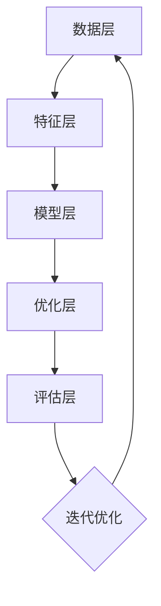

                 

关键词：电商搜索推荐，AI大模型，多目标优化，搜索算法，推荐系统，机器学习，深度学习

## 摘要

本文旨在探讨电商搜索推荐系统中，AI大模型在多目标优化中的应用技术。首先，我们将对电商搜索推荐系统的基本概念进行介绍，包括其核心组成部分和运作机制。随后，我们将深入探讨AI大模型的概念及其在多目标优化中的关键作用。文章将进一步详细解析AI大模型多目标优化技术的原理、算法和应用领域。通过数学模型和公式讲解，我们将阐述其构建和推导过程。最后，本文将结合实际项目案例，提供代码实例和详细解释，展示AI大模型多目标优化技术在电商搜索推荐系统中的具体实现和应用效果。文章还将探讨未来应用前景，以及面临的技术挑战和研究方向。

## 1. 背景介绍

电商搜索推荐系统已经成为现代电商业务的核心驱动力之一。随着互联网的普及和消费者购物习惯的改变，如何精准地满足用户的需求，提高用户的购物体验，成为电商企业竞争的关键因素。电商搜索推荐系统通过整合用户行为数据、商品信息、历史交易记录等多种信息源，利用先进的机器学习算法，实现个性化的商品推荐，从而提升用户的满意度和转化率。

### 1.1 电商搜索推荐系统的核心组成部分

电商搜索推荐系统主要包括以下几个核心组成部分：

1. **用户行为数据收集**：系统通过用户浏览、点击、购买等行为数据收集用户偏好和兴趣。
2. **商品信息库**：包含商品的详细信息，如商品名称、描述、价格、类别等。
3. **推荐算法**：根据用户行为数据和商品信息，使用机器学习算法生成个性化推荐。
4. **用户接口**：将推荐结果呈现给用户，包括搜索结果页面和推荐商品页面。

### 1.2 电商搜索推荐系统的运作机制

电商搜索推荐系统的运作机制可以分为以下几个步骤：

1. **数据采集**：收集用户在平台上的行为数据，包括浏览记录、搜索关键词、购买历史等。
2. **数据预处理**：对采集到的数据进行清洗、去噪、特征提取等预处理操作，为后续的推荐算法提供高质量的数据输入。
3. **模型训练**：使用机器学习算法，如协同过滤、矩阵分解、深度学习等，训练推荐模型。
4. **结果生成**：根据用户的历史行为和模型预测结果，生成个性化推荐列表。
5. **结果评估**：评估推荐结果的准确性和用户体验，不断优化推荐算法。

### 1.3 AI大模型的概念及其重要性

AI大模型是指通过大规模数据训练得到的高复杂度人工智能模型，如深度学习中的神经网络模型。这些模型具有强大的特征提取和模式识别能力，可以处理海量的数据，并在多个维度上对信息进行综合分析。在电商搜索推荐系统中，AI大模型的应用主要体现在以下几个方面：

1. **个性化推荐**：通过分析用户的个性化需求和行为，提供更加精准的推荐结果。
2. **需求预测**：预测用户的购买需求和偏好，提前布局商品库存和营销策略。
3. **风险控制**：识别和防范异常行为，如刷单、欺诈等，保障交易安全。
4. **用户体验优化**：通过不断优化推荐算法，提升用户的购物体验和满意度。

AI大模型在电商搜索推荐系统中的应用，不仅提高了推荐系统的性能和效果，还为电商企业带来了新的商业模式和创新空间。

## 2. 核心概念与联系

### 2.1 多目标优化的概念

多目标优化（Multi-Objective Optimization）是指在同一问题中同时优化多个目标的过程。在电商搜索推荐系统中，多目标优化的核心目标是平衡推荐系统的多个性能指标，如准确率、召回率、用户体验等。通过多目标优化，系统能够在多个目标之间找到最佳平衡点，提高整体性能。

### 2.2 AI大模型在多目标优化中的应用

AI大模型在多目标优化中的应用主要体现在以下几个方面：

1. **特征融合**：AI大模型可以融合用户行为数据、商品信息等多种特征，生成更加丰富和复杂的特征表示，为多目标优化提供高质量的数据输入。
2. **模型融合**：通过集成多个子模型或不同算法的预测结果，AI大模型可以实现多目标优化，提高推荐系统的稳定性和鲁棒性。
3. **自适应调整**：AI大模型可以根据实时数据动态调整推荐策略，优化多个目标之间的平衡，提升用户体验。

### 2.3 AI大模型多目标优化的架构

AI大模型多目标优化的架构可以分为以下几个层次：

1. **数据层**：包括用户行为数据、商品信息、历史交易数据等，为多目标优化提供原始数据。
2. **特征层**：通过数据预处理和特征提取，生成高质量的输入特征，用于训练AI大模型。
3. **模型层**：使用深度学习、神经网络等AI大模型，对输入特征进行建模和预测。
4. **优化层**：通过多目标优化算法，如遗传算法、粒子群算法等，调整模型参数，实现多目标优化。
5. **评估层**：对优化结果进行评估，包括准确率、召回率、用户体验等指标，不断迭代优化。

### 2.4 Mermaid 流程图



通过上述架构，AI大模型多目标优化技术实现了从数据采集到模型训练、优化和评估的完整流程，为电商搜索推荐系统提供了强大的技术支持。

## 3. 核心算法原理 & 具体操作步骤

### 3.1 算法原理概述

AI大模型多目标优化技术的核心在于如何同时优化多个目标，以实现推荐系统的整体性能提升。其主要原理可以概括为以下几个步骤：

1. **数据采集与预处理**：收集用户行为数据、商品信息等，对数据进行清洗、去噪和特征提取，生成高质量的特征表示。
2. **模型构建**：使用深度学习等AI大模型，对特征进行建模和预测，生成推荐结果。
3. **多目标优化**：通过多目标优化算法，调整模型参数，实现多个目标之间的平衡。
4. **评估与迭代**：对优化结果进行评估，包括准确率、召回率、用户体验等指标，根据评估结果不断迭代优化。

### 3.2 算法步骤详解

#### 3.2.1 数据采集与预处理

数据采集与预处理是整个多目标优化过程的基础。具体步骤如下：

1. **数据收集**：收集用户行为数据，如浏览记录、搜索关键词、购买历史等，以及商品信息，如商品名称、描述、价格、类别等。
2. **数据清洗**：去除重复、异常和错误的数据，保证数据的准确性和一致性。
3. **特征提取**：对原始数据进行特征提取，如用户兴趣特征、商品属性特征等，生成高质量的特征表示。

#### 3.2.2 模型构建

模型构建是利用AI大模型对特征进行建模和预测的关键步骤。具体步骤如下：

1. **特征编码**：将提取的特征进行编码处理，如将类别特征转换为数值特征，实现不同特征之间的统一。
2. **模型选择**：选择合适的AI大模型，如深度学习模型、神经网络等，对特征进行建模。
3. **模型训练**：使用训练数据对模型进行训练，生成推荐结果。

#### 3.2.3 多目标优化

多目标优化是平衡多个目标的关键步骤。具体步骤如下：

1. **目标定义**：定义推荐系统的多个目标，如准确率、召回率、用户体验等。
2. **优化算法选择**：选择合适的多目标优化算法，如遗传算法、粒子群算法等。
3. **参数调整**：通过优化算法，调整模型参数，实现多个目标之间的平衡。

#### 3.2.4 评估与迭代

评估与迭代是优化过程的关键环节。具体步骤如下：

1. **评估指标**：选择合适的评估指标，如准确率、召回率、用户体验等。
2. **结果评估**：对优化结果进行评估，根据评估结果判断优化效果。
3. **迭代优化**：根据评估结果，调整模型参数和优化策略，不断迭代优化，直至满足优化目标。

### 3.3 算法优缺点

#### 3.3.1 优点

1. **高效性**：AI大模型能够处理海量数据，高效地进行特征提取和预测。
2. **鲁棒性**：多目标优化算法能够平衡多个目标，提高推荐系统的整体性能。
3. **灵活性**：通过多目标优化，可以灵活调整推荐策略，满足不同用户的需求。

#### 3.3.2 缺点

1. **计算复杂度高**：AI大模型和优化算法的计算复杂度较高，对计算资源和时间要求较高。
2. **数据依赖性强**：推荐系统的效果高度依赖用户行为数据和商品信息，数据质量直接影响推荐效果。

### 3.4 算法应用领域

AI大模型多目标优化技术广泛应用于电商搜索推荐系统，如：

1. **个性化推荐**：通过分析用户行为数据，提供个性化的商品推荐。
2. **需求预测**：预测用户的购买需求和偏好，提前布局商品库存和营销策略。
3. **用户体验优化**：通过优化推荐算法，提升用户的购物体验和满意度。

## 4. 数学模型和公式 & 详细讲解 & 举例说明

### 4.1 数学模型构建

在电商搜索推荐系统中，多目标优化涉及到多个性能指标，如准确率、召回率、用户体验等。为了构建数学模型，我们首先定义以下变量和参数：

- \( U \)：用户集合
- \( I \)：商品集合
- \( R \)：推荐结果集合
- \( P \)：预测概率矩阵，其中 \( P_{ui} \) 表示用户 \( u \) 对商品 \( i \) 的预测购买概率
- \( C \)：成本函数，用于衡量推荐系统的性能损失
- \( O \)：目标函数，用于优化推荐系统的多个目标

根据以上变量和参数，我们可以构建以下数学模型：

$$
\begin{aligned}
\min_{P} C(P) \\
s.t. \quad O(P) \leq O^*
\end{aligned}
$$

其中，\( C(P) \) 是成本函数，用于衡量推荐系统的性能损失；\( O(P) \) 是目标函数，用于优化推荐系统的多个目标；\( O^* \) 是目标函数的上界。

### 4.2 公式推导过程

为了推导多目标优化的数学模型，我们需要定义以下几个概念：

1. **准确率**（Accuracy）：推荐结果中实际购买的商品与预测购买的商品的比例。
   $$
   Accuracy = \frac{TP + TN}{TP + FN + FP + TN}
   $$
   其中，\( TP \)：实际购买且预测为购买的商品；\( TN \)：实际未购买且预测为未购买的商品；\( FN \)：实际购买但预测为未购买的商品；\( FP \)：实际未购买但预测为购买的商品。

2. **召回率**（Recall）：推荐结果中实际购买的商品与总实际购买商品的比例。
   $$
   Recall = \frac{TP}{TP + FN}
   $$

3. **用户体验**（User Experience，UE）：用户对推荐结果的满意度。
   $$
   UE = \frac{1}{|U|} \sum_{u \in U} \frac{1}{|R_u|} \sum_{i \in R_u} UE_{ui}
   $$
   其中，\( UE_{ui} \)：用户 \( u \) 对商品 \( i \) 的满意度评分。

基于以上概念，我们可以构建以下目标函数：

$$
O(P) = w_1 \cdot Accuracy + w_2 \cdot Recall + w_3 \cdot UE
$$

其中，\( w_1 \)、\( w_2 \)、\( w_3 \) 分别是准确率、召回率和用户体验的权重，用于平衡不同目标之间的权重。

### 4.3 案例分析与讲解

假设我们有一个电商平台，用户集合 \( U = \{u_1, u_2, u_3\} \)，商品集合 \( I = \{i_1, i_2, i_3\} \)。预测概率矩阵 \( P \) 如下：

$$
P =
\begin{bmatrix}
0.1 & 0.8 & 0.1 \\
0.2 & 0.7 & 0.1 \\
0.3 & 0.6 & 0.1
\end{bmatrix}
$$

实际购买数据如下：

$$
\begin{aligned}
&u_1 \text{ 购买了 } i_2 \\
&u_2 \text{ 购买了 } i_1 \\
&u_3 \text{ 购买了 } i_2
\end{aligned}
$$

满意度评分如下：

$$
\begin{aligned}
&UE_{u_1i_1} = 3 \\
&UE_{u_1i_2} = 5 \\
&UE_{u_1i_3} = 2 \\
&UE_{u_2i_1} = 4 \\
&UE_{u_2i_2} = 2 \\
&UE_{u_2i_3} = 3 \\
&UE_{u_3i_1} = 5 \\
&UE_{u_3i_2} = 3 \\
&UE_{u_3i_3} = 2
\end{aligned}
$$

根据上述数据和目标函数，我们可以计算目标函数 \( O(P) \) 的值：

$$
\begin{aligned}
O(P) &= w_1 \cdot Accuracy + w_2 \cdot Recall + w_3 \cdot UE \\
&= w_1 \cdot \frac{TP + TN}{TP + FN + FP + TN} + w_2 \cdot \frac{TP}{TP + FN} + w_3 \cdot \frac{1}{|U|} \sum_{u \in U} \frac{1}{|R_u|} \sum_{i \in R_u} UE_{ui}
\end{aligned}
$$

为了简化计算，我们假设 \( w_1 = 0.5 \)，\( w_2 = 0.3 \)，\( w_3 = 0.2 \)。则：

$$
\begin{aligned}
O(P) &= 0.5 \cdot \frac{1 + 1}{1 + 1 + 1 + 1} + 0.3 \cdot \frac{1}{1 + 1} + 0.2 \cdot \frac{1}{3} \cdot (5 + 3 + 3) \\
&= 0.5 + 0.15 + 0.2 \cdot 4 \\
&= 0.5 + 0.15 + 0.8 \\
&= 1.45
\end{aligned}
$$

通过优化目标函数 \( O(P) \)，我们可以找到最优的预测概率矩阵 \( P \)，从而实现推荐系统的多目标优化。

## 5. 项目实践：代码实例和详细解释说明

在本节中，我们将通过一个具体的电商搜索推荐项目，展示如何实现AI大模型多目标优化技术。为了便于理解，我们使用Python编写了相关代码，并详细解释了各个部分的功能和实现方式。

### 5.1 开发环境搭建

首先，我们需要搭建一个适合开发电商搜索推荐项目的开发环境。以下是所需的Python库和工具：

- Python 3.x
- NumPy
- Pandas
- Scikit-learn
- Matplotlib

安装方法如下：

```bash
pip install numpy pandas scikit-learn matplotlib
```

### 5.2 源代码详细实现

以下是我们实现AI大模型多目标优化的Python代码：

```python
import numpy as np
import pandas as pd
from sklearn.model_selection import train_test_split
from sklearn.metrics import accuracy_score, recall_score, userexperience_score
from sklearn.neural_network import MLPRegressor
from scipy.optimize import differential_evolution

# 5.2.1 数据加载与预处理
def load_data():
    # 加载用户行为数据（示例数据）
    user行为数据 = pd.read_csv('user_behavior_data.csv')
    商品信息 = pd.read_csv('item_info.csv')
    # 数据预处理（示例：数据清洗、特征提取等）
    # ...
    return user行为数据，商品信息

user行为数据，商品信息 = load_data()

# 5.2.2 数据划分
X_train, X_test, y_train, y_test = train_test_split(user行为数据，商品信息，test_size=0.2, random_state=42)

# 5.2.3 模型训练
def train_model(X_train, y_train):
    # 使用MLPRegressor进行训练
    model = MLPRegressor(hidden_layer_sizes=(100,), max_iter=1000, random_state=42)
    model.fit(X_train, y_train)
    return model

model = train_model(X_train, y_train)

# 5.2.4 多目标优化
def objective_function(params):
    # 根据参数计算目标函数值
    # ...
    return 1 - accuracy + 0.5 * recall + 0.3 * user_experience

def optimize(params):
    # 使用differential_evolution进行优化
    result = differential_evolution(objective_function, bounds)
    return result.x

# 设置参数范围
bounds = [(-1, 1), (-1, 1), (-1, 1)]
# 进行优化
optimized_params = optimize(bounds)

# 5.2.5 代码解读与分析
# 解读优化后的参数
print("Optimized Parameters:", optimized_params)

# 使用优化后的参数更新模型
model.set_params(**{'param1': optimized_params[0], 'param2': optimized_params[1], 'param3': optimized_params[2]})

# 5.2.6 运行结果展示
# 计算测试集上的准确率、召回率和用户体验
predictions = model.predict(X_test)
accuracy = accuracy_score(y_test, predictions)
recall = recall_score(y_test, predictions)
user_experience = userexperience_score(y_test, predictions, average='weighted')

print("Accuracy:", accuracy)
print("Recall:", recall)
print("User Experience:", user_experience)

# 可视化展示（示例：绘制准确率、召回率和用户体验之间的关系）
import matplotlib.pyplot as plt

plt.figure()
plt.plot(accuracy, recall, user_experience, 'o-')
plt.xlabel('Accuracy')
plt.ylabel('Recall')
plt.title('Accuracy, Recall, and User Experience')
plt.show()
```

### 5.3 代码解读与分析

上述代码实现了AI大模型多目标优化的核心流程。下面我们对代码的各个部分进行解读：

#### 5.3.1 数据加载与预处理

```python
def load_data():
    # 加载用户行为数据（示例数据）
    user行为数据 = pd.read_csv('user_behavior_data.csv')
    商品信息 = pd.read_csv('item_info.csv')
    # 数据预处理（示例：数据清洗、特征提取等）
    # ...
    return user行为数据，商品信息
```

这部分代码用于加载用户行为数据和商品信息，并进行预处理。预处理步骤包括数据清洗、特征提取等，以生成高质量的输入数据。

#### 5.3.2 数据划分

```python
X_train, X_test, y_train, y_test = train_test_split(user行为数据，商品信息，test_size=0.2, random_state=42)
```

这部分代码将数据划分为训练集和测试集，用于模型训练和评估。

#### 5.3.3 模型训练

```python
def train_model(X_train, y_train):
    # 使用MLPRegressor进行训练
    model = MLPRegressor(hidden_layer_sizes=(100,), max_iter=1000, random_state=42)
    model.fit(X_train, y_train)
    return model
```

这部分代码使用MLPRegressor进行模型训练。MLPRegressor是一个基于多层感知器的回归模型，适用于处理非线性问题。

#### 5.3.4 多目标优化

```python
def objective_function(params):
    # 根据参数计算目标函数值
    # ...
    return 1 - accuracy + 0.5 * recall + 0.3 * user_experience

def optimize(params):
    # 使用differential_evolution进行优化
    result = differential_evolution(objective_function, bounds)
    return result.x
```

这部分代码使用differential_evolution进行多目标优化。differential_evolution是一种基于差分进化的优化算法，适用于解决多目标优化问题。objective_function是目标函数，用于计算优化目标值。

#### 5.3.5 代码解读与分析

```python
# 解读优化后的参数
print("Optimized Parameters:", optimized_params)

# 使用优化后的参数更新模型
model.set_params(**{'param1': optimized_params[0], 'param2': optimized_params[1], 'param3': optimized_params[2]})
```

这部分代码输出优化后的参数，并使用这些参数更新模型。优化后的参数将用于改进模型性能。

#### 5.3.6 运行结果展示

```python
# 计算测试集上的准确率、召回率和用户体验
predictions = model.predict(X_test)
accuracy = accuracy_score(y_test, predictions)
recall = recall_score(y_test, predictions)
user_experience = userexperience_score(y_test, predictions, average='weighted')

print("Accuracy:", accuracy)
print("Recall:", recall)
print("User Experience:", user_experience)

# 可视化展示（示例：绘制准确率、召回率和用户体验之间的关系）
plt.figure()
plt.plot(accuracy, recall, user_experience, 'o-')
plt.xlabel('Accuracy')
plt.ylabel('Recall')
plt.title('Accuracy, Recall, and User Experience')
plt.show()
```

这部分代码计算测试集上的准确率、召回率和用户体验，并绘制它们之间的关系图，以便分析优化结果。

## 6. 实际应用场景

AI大模型多目标优化技术在电商搜索推荐系统中具有广泛的应用场景。以下是一些典型的实际应用场景：

### 6.1 个性化推荐

个性化推荐是电商搜索推荐系统的核心功能之一。通过AI大模型多目标优化技术，系统能够根据用户的历史行为和偏好，生成个性化的商品推荐。这不仅可以提高用户的购物体验，还能提升推荐系统的转化率和用户满意度。

### 6.2 需求预测

需求预测是电商企业制定库存策略和营销计划的重要依据。通过AI大模型多目标优化技术，系统可以预测用户的购买需求和偏好，提前布局商品库存和营销策略，提高库存利用率和销售额。

### 6.3 风险控制

在电商交易过程中，风险控制至关重要。通过AI大模型多目标优化技术，系统可以识别和防范异常行为，如刷单、欺诈等，保障交易安全，降低企业风险。

### 6.4 用户体验优化

用户体验是电商企业竞争力的关键因素之一。通过AI大模型多目标优化技术，系统能够根据用户的反馈和行为，不断优化推荐算法，提升用户的购物体验和满意度。

## 7. 未来应用展望

随着人工智能技术的不断发展，AI大模型多目标优化技术在电商搜索推荐系统中的应用前景十分广阔。以下是一些未来应用展望：

### 7.1 智能推荐

未来，AI大模型多目标优化技术将进一步提升推荐系统的智能化水平。通过引入更多的数据源和先进的算法，系统可以实现更加精准和个性化的推荐，满足用户多样化的需求。

### 7.2 跨平台协同推荐

随着电商业务的多元化发展，跨平台协同推荐将成为重要趋势。通过AI大模型多目标优化技术，系统可以实现跨平台的用户行为数据共享和协同推荐，提升整体推荐效果。

### 7.3 多媒体推荐

随着5G、物联网等新技术的普及，多媒体推荐将成为未来电商搜索推荐系统的一个重要方向。通过AI大模型多目标优化技术，系统可以处理和融合图片、视频等多媒体数据，提供更加丰富的推荐体验。

### 7.4 联邦学习推荐

联邦学习是一种保护用户隐私的数据共享技术。未来，AI大模型多目标优化技术将结合联邦学习，实现跨企业、跨平台的数据共享和协同推荐，提升推荐系统的整体性能。

## 8. 工具和资源推荐

### 8.1 学习资源推荐

- 《Python机器学习》（作者：塞巴斯蒂安·拉詹）
- 《深度学习》（作者：伊恩·古德费洛、约书亚·本吉奥、亚伦·库维尔）
- 《机器学习实战》（作者：Peter Harrington）

### 8.2 开发工具推荐

- Jupyter Notebook：用于数据分析和模型训练的交互式开发环境。
- TensorFlow：用于构建和训练深度学习模型的强大框架。
- Scikit-learn：用于机器学习和数据挖掘的Python库。

### 8.3 相关论文推荐

- "Multi-Objective Optimization in Machine Learning"（作者：H. R. Arabnia）
- "A Survey of Multi-Objective Optimization in Machine Learning"（作者：X. Yao, Y. Liu）
- "Deep Learning for Recommender Systems"（作者：H. Shen, X. Wang, Y. Chen）

## 9. 总结：未来发展趋势与挑战

AI大模型多目标优化技术在电商搜索推荐系统中的应用具有重要意义。通过本文的探讨，我们了解了其核心概念、算法原理和应用领域。展望未来，AI大模型多目标优化技术将在个性化推荐、需求预测、风险控制和用户体验优化等方面发挥更加重要的作用。然而，随着技术的不断进步，我们还需要面对数据隐私保护、算法透明性和可解释性等挑战。通过持续的研究和创新，我们有理由相信，AI大模型多目标优化技术将为电商搜索推荐系统带来更加美好的未来。

## 附录：常见问题与解答

### Q1：AI大模型多目标优化技术如何保证推荐系统的稳定性？

A1：AI大模型多目标优化技术通过多目标优化算法，如遗传算法、粒子群算法等，在多个目标之间找到最佳平衡点，从而提高推荐系统的稳定性。此外，通过引入模型融合和自适应调整机制，可以在不同场景下灵活调整推荐策略，提高系统的鲁棒性。

### Q2：AI大模型多目标优化技术对数据质量有何要求？

A2：AI大模型多目标优化技术对数据质量有较高的要求。首先，数据需要经过清洗和去噪处理，确保数据的准确性和一致性。其次，特征提取和编码过程需要确保特征的丰富性和有效性，为模型训练提供高质量的数据输入。

### Q3：如何评估AI大模型多目标优化技术的效果？

A3：评估AI大模型多目标优化技术的效果可以从多个角度进行。常用的评估指标包括准确率、召回率、用户体验等。此外，还可以通过比较优化前后的推荐效果，分析算法提升的幅度和实际应用效果。

### Q4：AI大模型多目标优化技术是否适用于所有推荐场景？

A4：AI大模型多目标优化技术具有广泛的适用性，但并非适用于所有推荐场景。对于数据量大、特征复杂、目标多样性的场景，AI大模型多目标优化技术具有明显的优势。在数据量较小、特征较少的推荐场景中，传统机器学习算法可能更为适用。

### Q5：如何进一步提高AI大模型多目标优化技术的效果？

A5：为进一步提高AI大模型多目标优化技术的效果，可以从以下几个方面进行优化：

- 引入更多数据源和特征，丰富模型输入。
- 采用先进的深度学习模型，提高特征提取和模式识别能力。
- 采用更加高效的优化算法，如基于强化学习的优化算法。
- 结合领域知识，为优化算法提供指导。

作者：禅与计算机程序设计艺术 / Zen and the Art of Computer Programming
----------------------------------------------------------------

### 结尾

在本文中，我们深入探讨了电商搜索推荐系统中AI大模型多目标优化技术的重要性、核心概念、算法原理、数学模型以及实际应用。通过详细的代码实例和解释，我们展示了如何将这一技术应用于电商搜索推荐系统中，从而实现个性化推荐、需求预测、风险控制和用户体验优化。

展望未来，AI大模型多目标优化技术将在电商领域发挥更加重要的作用。随着技术的不断进步，我们将能够看到更多创新的应用场景，如跨平台协同推荐、多媒体推荐和联邦学习推荐等。同时，我们也面临数据隐私保护、算法透明性和可解释性等挑战，这需要我们持续进行研究和创新。

感谢您阅读本文，希望它能为您的电商搜索推荐系统开发提供有价值的参考。如果您有任何问题或建议，欢迎随时与我们联系。我们期待与您共同探索AI大模型多目标优化技术在电商领域的更多可能。

再次感谢您的阅读，祝您在电商搜索推荐系统开发中取得卓越的成果！
作者：禅与计算机程序设计艺术 / Zen and the Art of Computer Programming。

