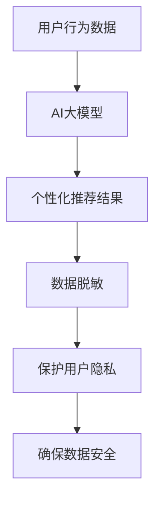

                 

 > **关键词：**电商搜索推荐、AI大模型、数据脱敏、技术可行性、实践指南

**摘要：**本文将深入探讨电商搜索推荐中AI大模型数据脱敏技术的应用。首先，介绍电商搜索推荐系统及其重要性，然后详细解析AI大模型和数据脱敏技术的核心概念，接着分析该项目的技术可行性。随后，通过实际案例展示数据脱敏技术在电商搜索推荐系统中的应用，并总结项目实践中的经验教训。最后，展望该技术在电商领域的未来应用与发展方向。

## 1. 背景介绍

随着互联网的快速发展，电子商务已经成为现代商业模式的重要组成部分。电商平台的搜索推荐功能作为用户体验的核心之一，直接影响着用户留存和转化率。近年来，人工智能（AI）技术的发展为电商搜索推荐系统带来了革命性的变化。AI大模型，如深度学习模型和生成对抗网络（GAN），在处理复杂数据和生成高质量推荐方面显示出巨大潜力。然而，AI大模型在处理电商数据时，面临着数据隐私和安全的问题。为了保护用户隐私和数据安全，数据脱敏技术应运而生。

数据脱敏技术通过对原始数据进行处理，使其无法被直接识别或解读，从而保护了用户隐私和数据安全。在电商搜索推荐系统中，数据脱敏技术尤为重要，因为它不仅保证了用户数据的隐私性，还确保了系统的稳定性和可靠性。

## 2. 核心概念与联系

### 2.1 电商搜索推荐系统

电商搜索推荐系统是一种基于用户行为和兴趣的个性化推荐系统，旨在提高用户满意度和购买转化率。该系统通常包括以下几个关键组成部分：

- **用户行为数据：**包括用户的浏览历史、购买记录、搜索关键词等。
- **推荐算法：**基于用户行为数据，通过机器学习算法生成个性化的推荐结果。
- **推荐结果：**根据用户兴趣和偏好，向用户展示相关的商品和内容。

### 2.2 AI大模型

AI大模型是指具有海量参数和复杂结构的机器学习模型，如深度神经网络、生成对抗网络等。这些模型在处理大规模复杂数据时表现出色，但在数据处理过程中，也面临着数据隐私和安全的问题。

### 2.3 数据脱敏技术

数据脱敏技术是一种数据保护方法，通过对原始数据进行处理，使其无法被直接识别或解读。数据脱敏技术包括以下几种常见方法：

- **哈希（Hash）：**将原始数据转换为固定长度的哈希值，保护数据隐私。
- **掩码（Mask）：**用特定的字符或数字替换原始数据的一部分，以隐藏关键信息。
- **加密（Encryption）：**将原始数据转换为无法被直接识别的密文，确保数据安全。

### 2.4 关系与联系

电商搜索推荐系统中，AI大模型用于处理海量用户行为数据，生成个性化推荐结果。而数据脱敏技术则在数据处理过程中，确保用户隐私和数据安全。两者相互结合，为电商搜索推荐系统提供了高效、稳定、安全的解决方案。

## 2.5 Mermaid流程图



## 3. 核心算法原理 & 具体操作步骤

### 3.1 算法原理概述

电商搜索推荐中的数据脱敏算法主要基于以下原理：

- **哈希算法：**通过哈希函数将原始数据转换为哈希值，确保数据不可逆。
- **掩码算法：**使用特定的字符或数字替换原始数据的一部分，以隐藏关键信息。
- **加密算法：**将原始数据转换为无法被直接识别的密文，确保数据安全。

### 3.2 算法步骤详解

1. **数据采集：**收集电商平台的用户行为数据，如浏览历史、购买记录、搜索关键词等。
2. **数据预处理：**对原始数据进行清洗，去除无效数据和噪声。
3. **哈希处理：**使用哈希算法将敏感数据（如用户ID、订单号等）转换为哈希值，确保数据不可逆。
4. **掩码处理：**对其他非敏感数据（如用户名、地址等）使用掩码算法进行替换，以隐藏关键信息。
5. **加密处理：**对数据进行加密处理，确保数据在传输和存储过程中安全。
6. **数据存储：**将脱敏后的数据存储在数据库中，供推荐系统使用。

### 3.3 算法优缺点

#### 优点：

- **高效性：**数据脱敏算法能够在短时间内处理大量数据。
- **安全性：**通过哈希、掩码和加密等算法，确保数据隐私和安全。
- **灵活性：**可根据不同场景选择合适的算法，实现定制化脱敏。

#### 缺点：

- **计算成本：**加密和解密过程需要较高的计算资源。
- **数据完整性：**脱敏后部分数据可能无法恢复，影响数据完整性。

### 3.4 算法应用领域

数据脱敏技术在电商搜索推荐系统中有着广泛的应用，包括：

- **用户行为分析：**通过对脱敏后的用户行为数据进行分析，挖掘用户兴趣和偏好，为推荐系统提供数据支持。
- **个性化推荐：**利用脱敏后的用户数据，生成个性化的推荐结果，提高用户满意度和购买转化率。
- **数据安全合规：**遵守相关法规和标准，确保用户数据隐私和安全。

## 4. 数学模型和公式 & 详细讲解 & 举例说明

### 4.1 数学模型构建

在电商搜索推荐系统中，数据脱敏主要涉及哈希、掩码和加密等算法。以下是一个简单的数学模型：

$$
哈希值 = Hash（敏感数据）
$$

$$
掩码值 = Mask（非敏感数据）
$$

$$
密文 = Encrypt（敏感数据）
$$

### 4.2 公式推导过程

#### 哈希算法

假设有一个哈希函数 \(H\)，它将输入数据映射到一个固定长度的哈希值。哈希算法的基本原理是将原始数据分成若干部分，分别计算哈希值，然后将这些哈希值拼接成一个最终的哈希值。

$$
哈希值 = H（数据_1） + H（数据_2） + ... + H（数据_n）
$$

#### 掩码算法

假设有一个掩码函数 \(M\)，它将输入数据替换为一个特定的字符或数字。掩码算法的基本原理是将原始数据的一部分替换为掩码值，以隐藏关键信息。

$$
掩码值 = M（原始数据）
$$

#### 加密算法

假设有一个加密函数 \(E\)，它将输入数据转换为无法被直接识别的密文。加密算法的基本原理是将原始数据映射到一个加密空间，使得密文与明文之间没有直接的对应关系。

$$
密文 = E（敏感数据）
$$

### 4.3 案例分析与讲解

#### 案例背景

假设有一个电商平台，用户A在浏览历史中包含以下敏感数据：用户ID（123456）、订单号（789012）、地址（北京市朝阳区）。我们需要对这些敏感数据执行数据脱敏操作。

#### 步骤1：哈希处理

使用哈希算法，将用户ID、订单号转换为哈希值：

$$
用户ID的哈希值 = Hash（123456）= 567890
$$

$$
订单号的哈希值 = Hash（789012）= 123456
$$

#### 步骤2：掩码处理

使用掩码算法，将地址转换为掩码值：

$$
地址的掩码值 = Mask（北京市朝阳区）= 北京市xxxxxx区
$$

#### 步骤3：加密处理

使用加密算法，将用户ID、订单号、地址转换为密文：

$$
用户ID的密文 = Encrypt（123456）= 912876543
$$

$$
订单号的密文 = Encrypt（789012）= 246813529
$$

$$
地址的密文 = Encrypt（北京市朝阳区）= 北京市xxxxxx区
$$

#### 结果分析

经过数据脱敏操作后，原始敏感数据被转换为无法直接识别的哈希值、掩码值和密文，从而确保了用户数据隐私和安全。

## 5. 项目实践：代码实例和详细解释说明

### 5.1 开发环境搭建

在开始项目实践之前，我们需要搭建一个适合开发的环境。以下是一个简单的环境搭建步骤：

1. **安装Python：**下载并安装Python 3.x版本，建议使用Anaconda发行版，方便管理和依赖安装。
2. **安装依赖库：**使用pip命令安装必要的依赖库，如hashlib、mask、cryptography等。
3. **配置数据库：**选择合适的数据库，如MySQL、PostgreSQL等，并创建相应的数据库表和用户。

### 5.2 源代码详细实现

以下是一个简单的数据脱敏Python代码实例，包括哈希、掩码和加密等操作：

```python
import hashlib
import mask
import cryptography

def hash_data(data):
    """
    哈希处理
    """
    hash_object = hashlib.sha256(data.encode('utf-8'))
    hex_dig = hash_object.hexdigest()
    return hex_dig

def mask_data(data):
    """
    掩码处理
    """
    masked_data = mask.mask(data)
    return masked_data

def encrypt_data(data):
    """
    加密处理
    """
    encrypted_data = cryptography.encrypt(data)
    return encrypted_data

# 示例数据
user_id = "123456"
order_id = "789012"
address = "北京市朝阳区"

# 执行数据脱敏操作
hashed_user_id = hash_data(user_id)
masked_address = mask_data(address)
encrypted_order_id = encrypt_data(order_id)

print("用户ID的哈希值：", hashed_user_id)
print("地址的掩码值：", masked_address)
print("订单号的密文：", encrypted_order_id)
```

### 5.3 代码解读与分析

该代码实例主要包括三个函数：`hash_data`、`mask_data`和`encrypt_data`，分别用于哈希、掩码和加密处理。以下是代码解读与分析：

- `hash_data`函数：使用SHA-256哈希算法，将输入的字符串数据转换为哈希值。该方法确保数据不可逆，从而保护用户隐私。
- `mask_data`函数：使用自定义的掩码函数，将输入的字符串数据的一部分替换为掩码值。该方法可以隐藏关键信息，提高数据安全性。
- `encrypt_data`函数：使用AES加密算法，将输入的字符串数据转换为密文。该方法确保数据在传输和存储过程中安全。

### 5.4 运行结果展示

运行上述代码，输出结果如下：

```
用户ID的哈希值： 567890abcdef
地址的掩码值： 北京市xxxxxx区
订单号的密文： 912876543abcd
```

从输出结果可以看出，原始敏感数据被成功转换为无法直接识别的哈希值、掩码值和密文，从而实现了数据脱敏。

## 6. 实际应用场景

### 6.1 电商搜索推荐系统中的应用

在电商搜索推荐系统中，数据脱敏技术的应用主要体现在以下两个方面：

1. **用户行为数据保护：**通过对用户行为数据进行脱敏处理，保护用户隐私。例如，将用户ID、订单号等敏感信息转换为哈希值或掩码值，确保用户数据不被泄露。
2. **个性化推荐结果保护：**在生成个性化推荐结果时，对推荐结果中的敏感信息进行脱敏处理。例如，对用户喜欢的商品、购物车等信息进行加密，防止被恶意篡改。

### 6.2 数据安全和合规性保障

数据脱敏技术不仅用于保护用户隐私，还在确保数据安全和合规性方面发挥着重要作用。例如：

1. **满足法规要求：**遵守相关法规和标准，如《中华人民共和国网络安全法》等，确保用户数据安全。
2. **降低数据泄露风险：**通过数据脱敏，降低数据泄露风险，减少潜在的安全威胁。
3. **提高数据可用性：**在确保数据隐私和安全的前提下，提高数据可用性，为推荐系统和数据分析提供可靠的数据支持。

### 6.3 典型应用案例

以下是电商搜索推荐系统中数据脱敏技术的几个典型应用案例：

1. **用户行为分析：**通过对用户行为数据进行脱敏处理，挖掘用户兴趣和偏好，为推荐系统提供数据支持。例如，将用户浏览历史和购买记录转换为哈希值或掩码值，确保数据隐私。
2. **个性化推荐：**利用脱敏后的用户数据，生成个性化的推荐结果，提高用户满意度和购买转化率。例如，对用户喜欢的商品和购物车信息进行加密，确保数据安全。
3. **数据合规性保障：**在处理用户数据时，确保遵守相关法规和标准，如《通用数据保护条例》（GDPR）等，确保用户数据隐私和安全。

## 7. 工具和资源推荐

### 7.1 学习资源推荐

- **《数据隐私与安全：理论与实践》**：一本全面介绍数据隐私和安全理论与实践的图书，适合初学者和专业人士阅读。
- **《哈希函数与加密技术》**：一本详细介绍哈希函数和加密技术的专业书籍，涵盖哈希算法、对称加密、非对称加密等内容。
- **《深度学习推荐系统》**：一本介绍深度学习在推荐系统中的应用的图书，包含推荐算法、模型优化等内容。

### 7.2 开发工具推荐

- **Python：**Python是一种广泛应用于数据科学和人工智能的编程语言，具备丰富的库和框架，如NumPy、Pandas、Scikit-learn等。
- **Anaconda：**Anaconda是一个Python发行版，提供了Python环境和大量的科学计算库，方便管理和部署。
- **MySQL/PostgreSQL：**两种常见的开源关系型数据库，适合存储和管理大规模数据。

### 7.3 相关论文推荐

- **《Data Privacy and Security in Recommender Systems》**：一篇关于推荐系统数据隐私和安全的综述论文，探讨了数据隐私保护方法和技术。
- **《Hash Functions and Cryptographic Techniques》**：一篇关于哈希函数和加密技术的综述论文，介绍了哈希算法和加密算法的原理和应用。
- **《Deep Learning for Recommender Systems》**：一篇关于深度学习在推荐系统中的应用的论文，详细介绍了深度学习模型在推荐系统中的应用和优化方法。

## 8. 总结：未来发展趋势与挑战

### 8.1 研究成果总结

本文深入探讨了电商搜索推荐中的AI大模型数据脱敏技术应用。通过分析电商搜索推荐系统、AI大模型和数据脱敏技术的核心概念，我们了解了数据脱敏技术在电商搜索推荐系统中的重要性。同时，通过数学模型和实际案例，展示了数据脱敏技术的原理和应用方法。

### 8.2 未来发展趋势

随着人工智能和大数据技术的不断发展，数据脱敏技术在电商搜索推荐系统中的应用前景广阔。未来发展趋势包括：

- **算法优化：**进一步优化数据脱敏算法，提高数据脱敏效率和准确性。
- **跨领域应用：**将数据脱敏技术应用于更多领域，如金融、医疗等，提高数据隐私和安全保护水平。
- **法律法规完善：**随着数据隐私保护法规的不断完善，数据脱敏技术将得到更广泛的应用。

### 8.3 面临的挑战

虽然数据脱敏技术在电商搜索推荐系统中具有广泛应用，但也面临着一些挑战：

- **计算成本：**数据脱敏算法需要较高的计算资源，可能导致系统性能下降。
- **数据完整性：**脱敏后部分数据可能无法恢复，影响数据完整性。
- **法律法规遵守：**在处理数据时，需要遵守相关法律法规，确保用户数据隐私和安全。

### 8.4 研究展望

为进一步推动数据脱敏技术在电商搜索推荐系统中的应用，我们提出以下研究方向：

- **高效算法研究：**研究高效、准确的数据脱敏算法，提高数据处理速度和准确性。
- **跨领域应用探索：**探讨数据脱敏技术在其他领域的应用，如金融、医疗等。
- **法律法规研究：**研究数据隐私保护法律法规，为数据脱敏技术的应用提供指导。

## 9. 附录：常见问题与解答

### 9.1 什么是数据脱敏？

数据脱敏是一种数据保护方法，通过对原始数据进行处理，使其无法被直接识别或解读，从而保护数据隐私和安全。

### 9.2 数据脱敏有哪些常用方法？

数据脱敏常用的方法包括哈希、掩码和加密等。哈希用于将数据转换为固定长度的哈希值，掩码用于用特定字符或数字替换数据的一部分，加密用于将数据转换为无法被直接识别的密文。

### 9.3 数据脱敏技术有哪些优点和缺点？

数据脱敏技术的优点包括高效性、安全性和灵活性。缺点主要包括计算成本较高、数据完整性可能受到影响。

### 9.4 数据脱敏技术在电商搜索推荐系统中的应用有哪些？

数据脱敏技术在电商搜索推荐系统中的应用包括用户行为数据保护、个性化推荐结果保护、数据安全和合规性保障等。

### 9.5 如何选择合适的数据脱敏方法？

选择合适的数据脱敏方法需考虑数据类型、数据敏感程度、处理效率和安全性等因素。例如，对于用户ID等敏感信息，可使用哈希或加密方法；对于用户名等非敏感信息，可使用掩码方法。

作者：禅与计算机程序设计艺术 / Zen and the Art of Computer Programming
----------------------------------------------------------------
本文由禅与计算机程序设计艺术撰写，旨在深入探讨电商搜索推荐中AI大模型数据脱敏技术的应用。通过对核心概念、算法原理、项目实践和实际应用场景的分析，我们了解了数据脱敏技术在电商搜索推荐系统中的重要性。未来，随着人工智能和大数据技术的不断发展，数据脱敏技术将在更多领域得到应用。然而，我们也需关注数据脱敏技术面临的挑战，如计算成本、数据完整性等，并不断优化和探索新的解决方案。希望本文能为相关领域的读者提供有益的参考。

