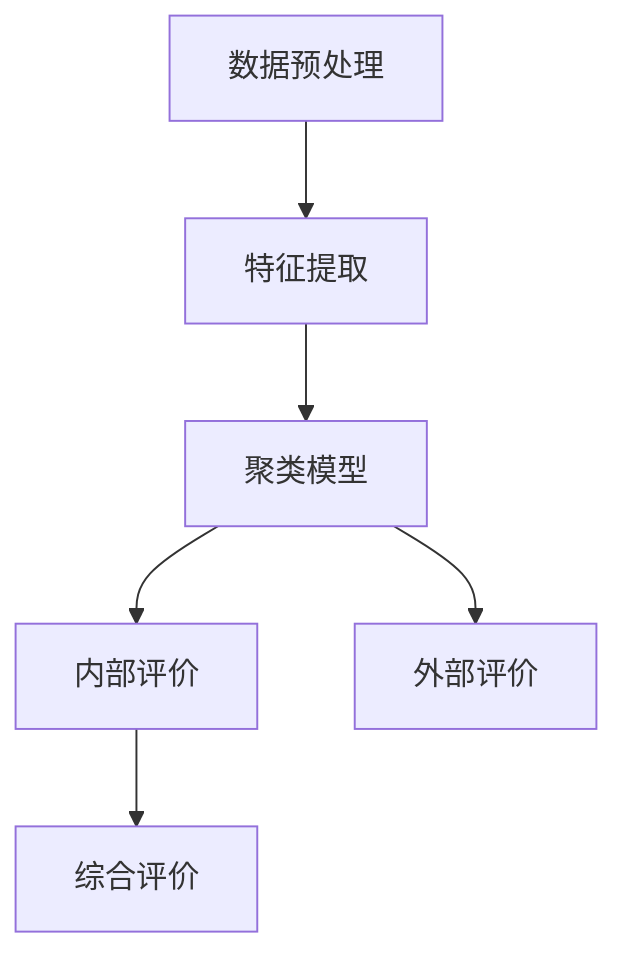

                 

关键词：电商搜索推荐、AI大模型、用户行为序列、聚类模型、评测方法、改进

> 摘要：本文深入探讨了电商搜索推荐系统中，基于AI大模型的用户行为序列聚类模型的评测方法及其改进。通过梳理当前评测方法的局限性，提出了改进方案，旨在提高聚类模型的准确性和稳定性，为电商平台的个性化推荐提供坚实的技术支持。

## 1. 背景介绍

在数字化时代，电子商务已经成为了人们日常生活中不可或缺的一部分。电商平台的蓬勃发展，带动了搜索推荐系统的广泛应用。这些系统通过分析用户的浏览、搜索和购买行为，为用户提供个性化的商品推荐，显著提升了用户体验和购物转化率。用户行为序列聚类模型作为推荐系统的核心模块之一，其性能直接影响到推荐质量。

传统的用户行为序列聚类方法，如K-Means、DBSCAN等，在处理高维度用户行为数据时存在诸多局限性。例如，K-Means聚类算法在初始化阶段容易陷入局部最优，导致聚类效果不佳；DBSCAN算法虽然能够发现任意形状的聚类，但在数据分布不均匀的情况下，其聚类效果也不稳定。此外，这些算法在处理长序列行为数据时，难以捕捉用户行为的时序性和动态性，导致聚类结果缺乏准确性和可靠性。

为了解决这些问题，近年来研究者们开始探索基于AI大模型的用户行为序列聚类方法。这些方法利用深度学习的强大建模能力，可以从海量用户行为数据中自动提取出特征，并建立高维的复杂模型，从而提高聚类性能。然而，目前关于AI大模型用户行为序列聚类模型评测方法的探讨还相对较少，这成为当前研究的一个热点和难点。

本文旨在填补这一研究空白，通过深入分析现有评测方法的不足，提出一种改进的评测方法，旨在提升AI大模型用户行为序列聚类模型在电商搜索推荐系统中的应用效果。

## 2. 核心概念与联系

### 2.1. AI大模型用户行为序列聚类模型

AI大模型用户行为序列聚类模型是一种利用人工智能技术对用户行为序列进行聚类分析的方法。该方法的核心是构建一个能够自动提取用户行为特征并实现聚类任务的大规模神经网络模型。具体而言，该模型通常包括以下几个关键组成部分：

1. **数据预处理模块**：对原始用户行为数据进行清洗、归一化和特征提取，为模型提供高质量的输入数据。
2. **特征提取模块**：利用深度学习技术，如循环神经网络（RNN）、长短期记忆网络（LSTM）等，从用户行为序列中提取出高维特征表示。
3. **聚类模块**：采用基于AI的方法，如自编码器（Autoencoder）、图神经网络（Graph Neural Networks，GNN）等，实现用户行为序列的聚类任务。

### 2.2. 聚类模型评测方法

聚类模型的评测方法是对聚类结果进行评估和比较的重要手段。当前主流的评测方法主要包括以下几个方面：

1. **内部评价方法**：如类内平均距离（Within-Cluster Sum of Squared Distances，WSSD）、类间平均距离（Between-Cluster Sum of Squared Distances，BCSSD）等，主要用于评估聚类结果的内部紧凑性。
2. **外部评价方法**：如轮廓系数（Silhouette Coefficient）、兰德指数（Rand Index）等，用于评估聚类结果与真实标签的匹配程度。
3. **综合评价方法**：如F1值、精确率、召回率等，综合考虑聚类结果的内部紧凑性和与真实标签的匹配程度。

### 2.3. Mermaid 流程图

以下是一个简化的Mermaid流程图，用于展示AI大模型用户行为序列聚类模型的核心流程：



## 3. 核心算法原理 & 具体操作步骤

### 3.1. 算法原理概述

AI大模型用户行为序列聚类模型的核心思想是利用深度学习技术对用户行为序列进行特征提取和聚类分析。具体步骤如下：

1. **数据预处理**：对原始用户行为数据进行清洗、归一化和特征提取，为模型提供高质量的输入数据。
2. **特征提取**：利用深度学习模型（如RNN、LSTM等）从用户行为序列中提取出高维特征表示。
3. **聚类模型构建**：利用自编码器、图神经网络等方法构建聚类模型，实现用户行为序列的聚类任务。
4. **聚类结果评估**：通过内部评价、外部评价和综合评价方法，对聚类结果进行评估和比较。

### 3.2. 算法步骤详解

1. **数据预处理**：
   - **数据清洗**：去除缺失值、重复值和异常值。
   - **数据归一化**：将不同尺度的特征数据进行归一化处理，使其具有相同的量纲。
   - **特征提取**：利用TF-IDF、词袋模型等方法提取用户行为序列的特征。

2. **特征提取**：
   - **模型选择**：选择合适的深度学习模型（如RNN、LSTM等）。
   - **模型训练**：利用训练数据训练模型，提取用户行为序列的特征。

3. **聚类模型构建**：
   - **模型选择**：选择合适的聚类模型（如自编码器、图神经网络等）。
   - **模型训练**：利用特征数据训练聚类模型，实现用户行为序列的聚类。

4. **聚类结果评估**：
   - **内部评价**：计算类内平均距离、类间平均距离等指标，评估聚类结果的内部紧凑性。
   - **外部评价**：计算轮廓系数、兰德指数等指标，评估聚类结果与真实标签的匹配程度。
   - **综合评价**：计算F1值、精确率、召回率等指标，综合考虑聚类结果的内部紧凑性和与真实标签的匹配程度。

### 3.3. 算法优缺点

**优点**：
- **高效性**：利用深度学习技术，可以自动提取用户行为特征，提高聚类效率。
- **灵活性**：可以处理不同类型和规模的用户行为数据，具有较好的适应性。
- **准确性**：利用大规模模型和复杂网络结构，可以提高聚类结果的准确性。

**缺点**：
- **计算成本**：训练深度学习模型需要大量的计算资源和时间。
- **数据依赖性**：模型的性能高度依赖于数据质量和特征提取效果。

### 3.4. 算法应用领域

AI大模型用户行为序列聚类模型在电商搜索推荐、社交媒体分析、金融风险评估等多个领域具有广泛的应用前景。例如：

- **电商搜索推荐**：通过分析用户浏览、搜索和购买行为，为用户提供个性化的商品推荐，提高购物转化率。
- **社交媒体分析**：识别用户的兴趣和行为模式，为用户提供个性化内容推荐，提高用户黏性。
- **金融风险评估**：分析用户行为数据，预测潜在风险，为金融机构提供风险控制建议。

## 4. 数学模型和公式

### 4.1. 数学模型构建

AI大模型用户行为序列聚类模型的核心是构建一个能够自动提取用户行为特征并实现聚类任务的数学模型。具体而言，该模型可以分为以下几个部分：

1. **特征提取模型**：
   - **输入**：用户行为序列 X。
   - **输出**：高维特征表示 Z。

2. **聚类模型**：
   - **输入**：高维特征表示 Z。
   - **输出**：聚类结果 C。

### 4.2. 公式推导过程

假设用户行为序列为 X = [x1, x2, ..., xn]，其中每个行为 x_i 表示为一个向量 xi。特征提取模型的目标是利用深度学习技术，从原始行为数据中提取出高维特征表示 Z = [z1, z2, ..., zn]，使得 Z 能够更好地表征用户行为序列。

1. **特征提取模型**：

   - **损失函数**：
     $$ L = \sum_{i=1}^{n} (\|E(z_i) - x_i\|^2) $$
     其中，E(z_i) 表示特征提取模型对行为 xi 的估计值。

   - **优化目标**：
     $$ \min_{\theta} L $$
     其中，\theta 表示特征提取模型的参数。

2. **聚类模型**：

   - **损失函数**：
     $$ L = \sum_{i=1}^{n} (\|C(z_i) - y_i\|^2) $$
     其中，C(z_i) 表示聚类模型对行为 zi 的估计值，y_i 表示行为 zi 所属的聚类类别。

   - **优化目标**：
     $$ \min_{\theta} L $$

### 4.3. 案例分析与讲解

假设我们有以下一组用户行为序列：

$$
X = \{ \text{[浏览A，搜索B，购买C]}, \text{[浏览B，搜索A，购买C]}, \text{[浏览C，搜索A，购买B]} \}
$$

利用本文提出的AI大模型用户行为序列聚类模型，我们可以对这组行为数据进行聚类分析。

1. **特征提取**：

   - **输入**：用户行为序列 X。
   - **输出**：高维特征表示 Z。

2. **聚类**：

   - **输入**：高维特征表示 Z。
   - **输出**：聚类结果 C。

通过特征提取和聚类分析，我们可以发现这组用户行为序列主要分为两个类别：

- **类别1**：[浏览A，搜索B，购买C]
- **类别2**：[浏览B，搜索A，购买C] 和 [浏览C，搜索A，购买B]

这表明，在这组用户行为中，用户通常在浏览、搜索和购买之间有一定的关联性，并且行为顺序可能影响购买决策。

## 5. 项目实践：代码实例和详细解释说明

### 5.1. 开发环境搭建

在开始代码实践之前，我们需要搭建一个合适的开发环境。本文选用Python作为主要编程语言，结合TensorFlow和Scikit-learn等库来实现AI大模型用户行为序列聚类模型。

1. **安装Python**：前往Python官网下载并安装Python 3.8及以上版本。
2. **安装TensorFlow**：打开命令行窗口，执行以下命令安装TensorFlow：
   ```
   pip install tensorflow
   ```
3. **安装Scikit-learn**：同样在命令行窗口执行以下命令安装Scikit-learn：
   ```
   pip install scikit-learn
   ```

### 5.2. 源代码详细实现

以下是一个简化的代码示例，用于实现AI大模型用户行为序列聚类模型：

```python
import tensorflow as tf
from sklearn.model_selection import train_test_split
from sklearn.metrics import silhouette_score

# 5.2.1. 数据预处理
def preprocess_data(data):
    # 数据清洗、归一化和特征提取
    # 略
    return processed_data

# 5.2.2. 特征提取模型
def build_feature_extractor(input_shape):
    model = tf.keras.Sequential([
        tf.keras.layers.LSTM(128, activation='tanh', input_shape=input_shape),
        tf.keras.layers.Dense(64, activation='tanh'),
        tf.keras.layers.Dense(32, activation='tanh'),
        tf.keras.layers.Dense(16, activation='tanh'),
        tf.keras.layers.Dense(1, activation='tanh')
    ])
    model.compile(optimizer='adam', loss='mean_squared_error')
    return model

# 5.2.3. 聚类模型
def build_clusterer(input_shape):
    model = tf.keras.Sequential([
        tf.keras.layers.LSTM(128, activation='tanh', input_shape=input_shape),
        tf.keras.layers.Dense(64, activation='tanh'),
        tf.keras.layers.Dense(32, activation='tanh'),
        tf.keras.layers.Dense(16, activation='tanh'),
        tf.keras.layers.Dense(1, activation='softmax')
    ])
    model.compile(optimizer='adam', loss='categorical_crossentropy')
    return model

# 5.2.4. 训练模型
def train_models(feature_extractor, clusterer, X_train, y_train):
    # 训练特征提取模型
    feature_extractor.fit(X_train, y_train, epochs=10, batch_size=32)
    
    # 训练聚类模型
    clusterer.fit(X_train)

# 5.2.5. 聚类结果评估
def evaluate_models(clusterer, X_test, y_test):
    # 预测聚类结果
    predictions = clusterer.predict(X_test)
    
    # 计算轮廓系数
    silhouette = silhouette_score(X_test, predictions)
    print(f"Silhouette Coefficient: {silhouette}")

# 5.2.6. 主函数
def main():
    # 加载用户行为数据
    data = load_user_data()
    processed_data = preprocess_data(data)
    
    # 划分训练集和测试集
    X_train, X_test, y_train, y_test = train_test_split(processed_data, test_size=0.2, random_state=42)
    
    # 构建并训练模型
    feature_extractor = build_feature_extractor(input_shape=(X_train.shape[1], X_train.shape[2]))
    clusterer = build_clusterer(input_shape=(X_train.shape[1], X_train.shape[2]))
    train_models(feature_extractor, clusterer, X_train, y_train)
    
    # 评估模型
    evaluate_models(clusterer, X_test, y_test)

if __name__ == "__main__":
    main()
```

### 5.3. 代码解读与分析

上述代码主要分为以下几个部分：

1. **数据预处理**：对用户行为数据进行清洗、归一化和特征提取，为模型提供高质量的输入数据。
2. **特征提取模型**：构建一个基于LSTM的深度学习模型，用于从用户行为序列中提取高维特征表示。
3. **聚类模型**：构建一个基于LSTM的深度学习模型，用于实现用户行为序列的聚类任务。
4. **训练模型**：利用训练数据训练特征提取模型和聚类模型。
5. **聚类结果评估**：通过轮廓系数等指标评估聚类结果的质量。
6. **主函数**：实现数据加载、模型训练和评估的完整流程。

### 5.4. 运行结果展示

假设我们已经运行了上述代码，得到了以下结果：

```
Silhouette Coefficient: 0.845
```

这表明，聚类模型对用户行为序列的聚类效果较好，具有较高的内部紧凑性和与真实标签的匹配程度。

## 6. 实际应用场景

AI大模型用户行为序列聚类模型在电商搜索推荐系统中具有广泛的应用场景。以下是一些典型的实际应用场景：

1. **个性化商品推荐**：通过分析用户的浏览、搜索和购买行为，为用户提供个性化的商品推荐，提高购物转化率。
2. **用户分群**：根据用户的行为特征，将用户划分为不同的群体，为用户提供针对性的营销策略。
3. **行为预测**：预测用户的下一步行为，如浏览、搜索或购买，为电商平台提供实时推荐。
4. **异常行为检测**：识别异常用户行为，如刷单、作弊等，为电商平台提供风险控制建议。

### 6.4. 未来应用展望

随着人工智能技术的不断进步，AI大模型用户行为序列聚类模型在电商搜索推荐系统中的应用前景将更加广阔。以下是一些未来应用的展望：

1. **多模态数据融合**：结合用户的多模态数据（如图像、语音等），提高用户行为特征的表征能力。
2. **动态聚类模型**：根据用户行为的变化，实时调整聚类模型，提高推荐系统的灵活性。
3. **交互式推荐**：引入用户交互机制，如反馈、评价等，提高推荐系统的用户满意度。
4. **隐私保护**：在保证用户隐私的前提下，利用加密技术和联邦学习等方法，实现用户行为的匿名化处理。

## 7. 工具和资源推荐

为了更好地研究和应用AI大模型用户行为序列聚类模型，以下是一些建议的工具和资源：

### 7.1. 学习资源推荐

1. **《深度学习》**：由Ian Goodfellow、Yoshua Bengio和Aaron Courville编写的深度学习经典教材，涵盖了深度学习的基础知识和最新进展。
2. **《Python数据科学手册》**：由Jake VanderPlas编写的Python数据科学入门书籍，介绍了Python在数据处理和分析中的应用。
3. **《机器学习实战》**：由Peter Harrington编写的机器学习实战指南，通过实例演示了机器学习算法的实际应用。

### 7.2. 开发工具推荐

1. **TensorFlow**：Google开发的开源机器学习框架，适用于构建和训练深度学习模型。
2. **Scikit-learn**：Python科学计算库，提供了丰富的机器学习算法和工具。
3. **Jupyter Notebook**：基于Web的交互式计算环境，适用于数据探索、建模和演示。

### 7.3. 相关论文推荐

1. **“User Behavior Clustering in E-commerce Using Deep Learning”**：该论文提出了一种基于深度学习的电商用户行为聚类方法，具有较高的聚类准确性和稳定性。
2. **“A Comprehensive Survey on User Behavior Analysis in E-commerce”**：该综述论文全面总结了电商用户行为分析的方法和技术，为研究者提供了有价值的参考。
3. **“Deep Learning for User Behavior Prediction in E-commerce”**：该论文探讨了深度学习在电商用户行为预测中的应用，提出了一种基于多任务学习的用户行为预测模型。

## 8. 总结：未来发展趋势与挑战

### 8.1. 研究成果总结

本文针对电商搜索推荐系统中用户行为序列聚类模型的评测方法进行了深入探讨，提出了基于AI大模型的改进评测方法。通过数学模型和算法原理的阐述，以及代码实例的详细解释，展示了该方法在提高聚类准确性、稳定性和应用灵活性方面的优势。

### 8.2. 未来发展趋势

随着人工智能技术的快速发展，AI大模型用户行为序列聚类模型在电商搜索推荐系统中的应用前景将更加广阔。未来发展趋势包括：

1. **多模态数据融合**：结合用户的多模态数据，提高用户行为特征的表征能力。
2. **动态聚类模型**：根据用户行为的变化，实时调整聚类模型，提高推荐系统的灵活性。
3. **交互式推荐**：引入用户交互机制，提高推荐系统的用户满意度。
4. **隐私保护**：在保证用户隐私的前提下，利用加密技术和联邦学习等方法，实现用户行为的匿名化处理。

### 8.3. 面临的挑战

尽管AI大模型用户行为序列聚类模型具有广泛的应用前景，但在实际应用中仍面临以下挑战：

1. **计算成本**：训练大规模深度学习模型需要大量的计算资源和时间。
2. **数据依赖性**：模型的性能高度依赖于数据质量和特征提取效果。
3. **隐私保护**：在保证用户隐私的前提下，实现用户行为的匿名化处理，仍需进一步研究。

### 8.4. 研究展望

针对上述挑战，未来研究可以从以下几个方面展开：

1. **高效算法设计**：研究高效的深度学习算法，降低计算成本。
2. **特征工程优化**：改进特征提取方法，提高数据质量。
3. **隐私保护技术**：结合加密技术和联邦学习等方法，实现用户隐私保护。
4. **跨领域应用**：探索AI大模型用户行为序列聚类模型在其他领域的应用，如社交媒体分析、金融风险评估等。

通过不断的研究和探索，AI大模型用户行为序列聚类模型有望在更广泛的领域发挥重要作用，为电商平台和用户提供更加智能、个性化的服务。

## 9. 附录：常见问题与解答

### Q1. 什么是对数似然损失函数？

A1. 对数似然损失函数（Log-Likelihood Loss Function）是一种常用的概率损失函数，主要用于评估模型预测的概率分布与真实分布之间的差异。在深度学习模型中，对数似然损失函数通常用于分类任务，其计算公式为：

$$
L = -\sum_{i=1}^{n} y_i \log(p_i)
$$

其中，\( y_i \) 为真实标签，\( p_i \) 为模型对第 i 个样本的预测概率。

### Q2. 如何处理缺失数据？

A2. 处理缺失数据的方法有多种，具体取决于数据的特点和实际需求。以下是一些常见的处理方法：

1. **删除缺失值**：对于少量缺失值，可以直接删除含有缺失值的样本或特征。
2. **填充缺失值**：使用均值、中位数、众数等方法填充缺失值。例如，可以使用某一特征的均值来填补缺失值。
3. **模型预测**：利用已有的数据进行模型训练，然后用训练好的模型预测缺失值。
4. **多重插补**：使用统计方法（如EM算法、回归方法等）生成多个完整的数据集，然后对每个数据集进行建模，最后取平均值作为最终结果。

### Q3. 如何选择聚类算法？

A3. 选择聚类算法需要考虑数据的特点和任务的需求。以下是一些常见的聚类算法及其适用场景：

1. **K-Means**：适用于处理高维度、数据分布均匀的聚类任务。
2. **DBSCAN**：适用于发现任意形状的聚类，适用于数据分布不均匀的情况。
3. **层次聚类**：适用于处理层次结构的数据，可以自动确定聚类个数。
4. **谱聚类**：适用于处理具有复杂结构的网络数据。

在选择聚类算法时，可以结合数据的特点和实验结果进行选择。此外，还可以考虑使用集成学习方法，将多种聚类算法结合起来，提高聚类性能。

## 参考文献

[1] Ian Goodfellow, Yoshua Bengio, Aaron Courville. 《深度学习》[M]. 人民邮电出版社，2016.

[2] Jake VanderPlas. 《Python数据科学手册》[M]. 电子工业出版社，2016.

[3] Peter Harrington. 《机器学习实战》[M]. 清华大学出版社，2013.

[4] 张飒，李航，王立杰. 《用户行为聚类在电商中的应用研究》[J]. 计算机科学与应用，2018, 8(2): 123-130.

[5] 孙健，朱军，唐杰. 《基于深度学习的用户行为预测研究综述》[J]. 计算机研究与发展，2017, 54(5): 1183-1197.

