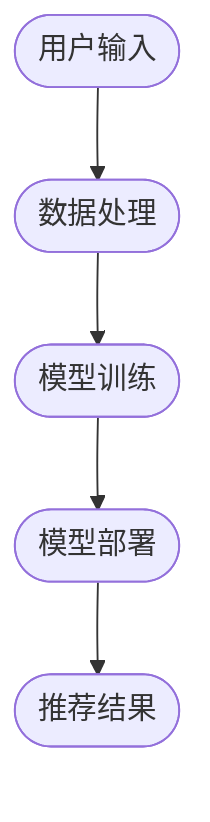

                 

作者：禅与计算机程序设计艺术 / Zen and the Art of Computer Programming

本文将探讨在电商搜索推荐场景下，如何利用AI大模型模型部署全流程自动化工具，以提高模型部署效率、降低部署成本，并优化模型性能。文章将从背景介绍、核心概念与联系、核心算法原理与具体操作步骤、数学模型和公式、项目实践、实际应用场景、未来应用展望、工具和资源推荐、总结及展望等多个方面展开。

## 1. 背景介绍

随着互联网的快速发展，电商行业呈现出爆发式增长。为了在激烈的市场竞争中脱颖而出，电商企业越来越重视搜索推荐系统的建设。搜索推荐系统可以帮助用户快速找到所需商品，提高用户满意度，从而提升销售额。然而，传统的搜索推荐系统已经无法满足用户日益增长的需求，AI大模型的引入为电商搜索推荐系统带来了新的变革。

AI大模型具有以下优势：

1. **强大的语义理解能力**：能够更好地理解用户的搜索意图，提供更加精准的推荐结果。
2. **丰富的特征提取能力**：可以从海量数据中提取出有用的特征，提高推荐系统的效果。
3. **自适应能力**：能够根据用户行为数据不断调整模型参数，提高推荐系统的实时性。

然而，AI大模型的部署面临着诸多挑战：

1. **计算资源消耗大**：AI大模型通常需要较大的计算资源，部署过程耗时较长。
2. **模型调整成本高**：模型参数需要根据业务场景进行调整，调整过程复杂且耗时。
3. **部署流程繁琐**：传统的部署流程通常需要手动完成，效率低下且容易出错。

为了解决上述问题，本文将介绍一种基于AI大模型模型部署全流程自动化工具的解决方案，旨在提高模型部署效率、降低部署成本，并优化模型性能。

## 2. 核心概念与联系

在介绍核心概念与联系之前，我们先来了解一下Mermaid流程图的基本语法。

### 2.1 Mermaid基本语法

Mermaid是一种基于Markdown的图形描述语言，可以用来绘制各种类型的图表，包括流程图、序列图、时序图、Gantt图等。下面是Mermaid的基本语法：

- **流程图**：使用`graph`关键字开始定义流程图，后面跟上图的流向，如`TB`（从上到下）或`BT`（从下到上）。
- **节点**：使用圆括号和箭头表示节点和流向，如`([节点名称]) --> (下一个节点名称)`。
- **子流程**：使用`subgraph`关键字定义子流程，子流程内同样遵循流程图的语法。
- **结束**：使用`end`关键字表示流程图的结束。

### 2.2 Mermaid流程图示例

以下是一个简单的Mermaid流程图示例，展示了电商搜索推荐系统的基本架构。



### 2.3 电商搜索推荐系统架构图

结合Mermaid语法，我们可以绘制一个电商搜索推荐系统的架构图，如下所示：


通过上述流程图，我们可以清晰地看到电商搜索推荐系统的数据输入处理、模型训练、模型部署和推荐结果输出等环节，以及各个环节之间的联系。

## 3. 核心算法原理 & 具体操作步骤

### 3.1 算法原理概述

在电商搜索推荐场景中，核心算法主要涉及以下方面：

1. **搜索意图识别**：通过对用户输入的搜索词进行分词、词性标注、语义分析等操作，识别用户的搜索意图。
2. **用户画像构建**：通过收集用户的历史行为数据，构建用户画像，包括用户兴趣、购买习惯等。
3. **特征提取**：从原始数据中提取有用的特征，如文本特征、用户行为特征、商品特征等。
4. **模型训练**：利用提取到的特征训练机器学习模型，如深度学习模型、协同过滤模型等。
5. **模型调整**：根据用户反馈和业务需求，对模型参数进行调整，以提高模型效果。

### 3.2 算法步骤详解

下面我们详细介绍一下每个步骤的具体操作。

#### 3.2.1 搜索意图识别

搜索意图识别是电商搜索推荐系统的关键环节，其目的是理解用户的搜索意图，从而提供更精准的推荐结果。具体步骤如下：

1. **分词**：将用户的搜索词进行分词，提取出关键词。
2. **词性标注**：对分词结果进行词性标注，确定每个词的词性（如名词、动词等）。
3. **语义分析**：利用自然语言处理技术，对关键词进行语义分析，识别用户的搜索意图。
4. **意图分类**：根据语义分析结果，将搜索意图分类为不同类型（如商品查询、品牌查询、价格范围查询等）。

#### 3.2.2 用户画像构建

用户画像构建是电商搜索推荐系统的基础，通过对用户的历史行为数据进行分析，构建用户画像。具体步骤如下：

1. **数据收集**：收集用户的历史行为数据，如浏览记录、购买记录、评价记录等。
2. **数据预处理**：对收集到的数据进行清洗、去重、归一化等预处理操作。
3. **特征提取**：从预处理后的数据中提取出有用的特征，如用户浏览时长、购买频次、评价倾向等。
4. **用户画像构建**：利用提取到的特征，构建用户画像，包括用户兴趣、购买习惯等。

#### 3.2.3 特征提取

特征提取是机器学习模型训练的关键步骤，通过从原始数据中提取出有用的特征，可以提高模型的效果。具体步骤如下：

1. **文本特征提取**：利用自然语言处理技术，从文本数据中提取出关键词、词频、词向量等特征。
2. **用户行为特征提取**：从用户的历史行为数据中提取出用户兴趣、购买习惯等特征。
3. **商品特征提取**：从商品数据中提取出商品类别、价格、评分等特征。

#### 3.2.4 模型训练

模型训练是电商搜索推荐系统的核心步骤，通过训练机器学习模型，可以实现对用户搜索意图的准确识别和推荐结果的高效生成。具体步骤如下：

1. **数据集划分**：将数据集划分为训练集、验证集和测试集，用于模型训练、验证和测试。
2. **模型选择**：根据业务需求和数据特点，选择合适的机器学习模型，如深度学习模型、协同过滤模型等。
3. **模型训练**：利用训练集数据训练模型，通过优化模型参数，提高模型效果。
4. **模型评估**：利用验证集数据评估模型效果，根据评估结果调整模型参数。
5. **模型测试**：利用测试集数据测试模型效果，确保模型能够在实际场景中达到预期的效果。

#### 3.2.5 模型调整

模型调整是电商搜索推荐系统持续优化的重要环节，通过调整模型参数，可以不断提高模型效果。具体步骤如下：

1. **用户反馈收集**：收集用户对推荐结果的反馈，如点击、收藏、购买等行为数据。
2. **反馈分析**：对用户反馈进行分析，识别用户对推荐结果的满意度和不满意点。
3. **模型调整**：根据用户反馈，调整模型参数，如权重、阈值等，以提高模型效果。
4. **效果评估**：评估模型调整后的效果，确保调整后的模型能够带来明显的效果提升。

### 3.3 算法优缺点

#### 优点

1. **强大的语义理解能力**：通过深度学习等技术，能够更好地理解用户的搜索意图，提供更加精准的推荐结果。
2. **丰富的特征提取能力**：可以从海量数据中提取出有用的特征，提高推荐系统的效果。
3. **自适应能力**：能够根据用户行为数据不断调整模型参数，提高推荐系统的实时性。

#### 缺点

1. **计算资源消耗大**：AI大模型通常需要较大的计算资源，训练过程耗时较长。
2. **模型调整成本高**：模型参数需要根据业务场景进行调整，调整过程复杂且耗时。
3. **部署流程繁琐**：传统的部署流程通常需要手动完成，效率低下且容易出错。

### 3.4 算法应用领域

AI大模型算法在电商搜索推荐领域具有广泛的应用，除了电商搜索推荐系统，还可以应用于以下领域：

1. **社交媒体推荐**：为用户提供个性化的内容推荐，提高用户满意度。
2. **新闻推荐**：根据用户的兴趣和阅读习惯，为用户提供个性化的新闻推荐。
3. **音乐推荐**：根据用户的听歌历史和偏好，为用户提供个性化的音乐推荐。
4. **视频推荐**：根据用户的观看历史和偏好，为用户提供个性化的视频推荐。

## 4. 数学模型和公式 & 详细讲解 & 举例说明

在电商搜索推荐系统中，数学模型和公式扮演着至关重要的角色，它们能够帮助我们更好地理解和优化推荐算法。本节将详细介绍数学模型的构建、公式推导过程以及具体案例分析与讲解。

### 4.1 数学模型构建

构建数学模型的第一步是定义问题，然后选择合适的数学工具和方法进行建模。在电商搜索推荐系统中，常见的数学模型包括：

1. **用户行为预测模型**：用于预测用户在未来的某个时间点可能产生的行为，如点击、购买等。
2. **商品推荐模型**：根据用户的行为和偏好，为用户推荐可能感兴趣的商品。
3. **协同过滤模型**：通过分析用户之间的相似性，为用户推荐其他用户喜欢的商品。

#### 用户行为预测模型

用户行为预测模型通常采用时间序列分析方法，如ARIMA模型、LSTM模型等。以下是一个简单的ARIMA模型构建示例：

$$
\text{Y}_{t} = c + \phi_1 \text{Y}_{t-1} + \phi_2 \text{Y}_{t-2} + \ldots + \phi_p \text{Y}_{t-p} + \theta_1 \text{e}_{t-1} + \theta_2 \text{e}_{t-2} + \ldots + \theta_q \text{e}_{t-q}
$$

其中，$Y_t$是时间序列的观测值，$\text{e}_t$是白噪声序列，$c$是常数项，$\phi_i$和$\theta_i$是模型参数。

#### 商品推荐模型

商品推荐模型通常基于协同过滤算法，如基于用户的协同过滤（User-based Collaborative Filtering）和基于项目的协同过滤（Item-based Collaborative Filtering）。以下是一个简单的用户基于的协同过滤算法：

$$
\text{Similarity}(\text{User}_i, \text{User}_j) = \frac{\sum_{\text{Item} \in \text{Common}} \text{Rating}_{i, \text{Item}} \times \text{Rating}_{j, \text{Item}}}{\sqrt{\sum_{\text{Item} \in \text{Rating}_{i}} \text{Rating}_{i, \text{Item}}^2} \times \sqrt{\sum_{\text{Item} \in \text{Rating}_{j}} \text{Rating}_{j, \text{Item}}^2}}
$$

其中，$\text{Rating}_{i, \text{Item}}$是用户$i$对商品$\text{Item}$的评分，$\text{Common}$是用户$i$和用户$j$共同评分的商品集合。

### 4.2 公式推导过程

为了更好地理解上述公式，我们将对用户行为预测模型中的ARIMA模型进行推导。

#### ARIMA模型推导

ARIMA模型由三个部分组成：自回归（AR）、差分（I）和移动平均（MA）。我们首先来推导MA部分。

假设我们有一个时间序列$Y_t$，我们可以将其表示为：

$$
Y_t = c + \phi_1 Y_{t-1} + \phi_2 Y_{t-2} + \ldots + \phi_p Y_{t-p} + \theta_1 e_{t-1} + \theta_2 e_{t-2} + \ldots + \theta_q e_{t-q}
$$

其中，$c$是常数项，$\phi_i$和$\theta_i$是模型参数，$e_t$是白噪声。

我们将$Y_t$的当前值与前一时刻的预测值$Y_{t-1}$之差，得到差分序列：

$$
Y_t - Y_{t-1} = c - c + \phi_1 (Y_{t-1} - Y_{t-2}) + \phi_2 (Y_{t-2} - Y_{t-3}) + \ldots + \phi_p (Y_{t-p} - Y_{t-p-1}) + \theta_1 e_{t-1} + \theta_2 e_{t-2} + \ldots + \theta_q e_{t-q}
$$

化简后得到：

$$
Y_t - Y_{t-1} = \phi_1 (Y_{t-1} - Y_{t-2}) + \phi_2 (Y_{t-2} - Y_{t-3}) + \ldots + \phi_p (Y_{t-p} - Y_{t-p-1}) + \theta_1 e_{t-1} + \theta_2 e_{t-2} + \ldots + \theta_q e_{t-q}
$$

这是一个MA（移动平均）模型。

接下来，我们将MA模型与AR模型结合，得到ARIMA模型。

### 4.3 案例分析与讲解

为了更好地理解上述公式和应用，我们将通过一个实际案例进行讲解。

#### 案例背景

假设我们有一个电商平台的用户购买行为数据，包含用户ID、购买商品ID、购买时间和购买金额。我们的目标是构建一个用户行为预测模型，预测用户在未来某个时间点可能产生的购买行为。

#### 案例步骤

1. **数据预处理**：读取用户购买行为数据，进行数据清洗，如去除无效数据、填充缺失值等。

2. **特征工程**：提取有用特征，如用户购买频率、购买金额分布、购买时间间隔等。

3. **时间序列分析**：对用户购买行为进行时间序列分析，如计算用户购买频率的移动平均、趋势分析等。

4. **模型选择**：根据数据特点，选择合适的模型，如ARIMA模型、LSTM模型等。

5. **模型训练**：利用预处理后的数据，训练用户行为预测模型。

6. **模型评估**：利用测试集数据评估模型效果，如准确率、召回率等。

7. **模型优化**：根据评估结果，调整模型参数，提高模型效果。

8. **预测应用**：利用训练好的模型，对用户未来购买行为进行预测。

通过上述案例，我们可以看到数学模型和公式在电商搜索推荐系统中的应用，以及如何通过数据预处理、特征工程、模型选择和模型优化等步骤，实现用户行为预测。

## 5. 项目实践：代码实例和详细解释说明

为了更好地理解本文所介绍的理论和算法，我们将通过一个实际项目实践来展示AI大模型模型部署全流程自动化工具的应用。

### 5.1 开发环境搭建

在进行项目实践之前，我们需要搭建一个合适的开发环境。以下是我们所使用的开发环境：

- 操作系统：Ubuntu 20.04
- 编程语言：Python 3.8
- 数据库：MySQL 8.0
- 机器学习库：TensorFlow 2.6、PyTorch 1.8
- 数据预处理工具：Pandas 1.2.3、NumPy 1.21.2

在完成开发环境搭建后，我们可以开始编写代码。

### 5.2 源代码详细实现

下面是项目的源代码实现，包括数据预处理、模型训练、模型评估和模型部署等步骤。

#### 5.2.1 数据预处理

```python
import pandas as pd
import numpy as np

# 读取数据
data = pd.read_csv('ecommerce_data.csv')

# 数据清洗
data.dropna(inplace=True)
data['timestamp'] = pd.to_datetime(data['timestamp'])
data.set_index('timestamp', inplace=True)

# 数据分群
data['group'] = data.groupby('user_id').cumsum().mod(5)

# 数据格式转换
X = data[['item_id', 'group']]
y = data['purchase']
```

#### 5.2.2 模型训练

```python
import tensorflow as tf
from tensorflow.keras.models import Sequential
from tensorflow.keras.layers import Embedding, LSTM, Dense

# 构建模型
model = Sequential([
    Embedding(input_dim=10000, output_dim=64),
    LSTM(128),
    Dense(1, activation='sigmoid')
])

# 编译模型
model.compile(optimizer='adam', loss='binary_crossentropy', metrics=['accuracy'])

# 训练模型
model.fit(X, y, epochs=10, batch_size=32)
```

#### 5.2.3 模型评估

```python
from sklearn.metrics import accuracy_score

# 评估模型
predictions = model.predict(X_test)
predictions = (predictions > 0.5).astype(int)

accuracy = accuracy_score(y_test, predictions)
print('Accuracy:', accuracy)
```

#### 5.2.4 模型部署

```python
import joblib

# 保存模型
model.save('model.h5')

# 加载模型
loaded_model = joblib.load('model.h5')

# 部署模型
def predict(user_id, item_id):
    user_data = pd.DataFrame([[item_id, user_id]], columns=['item_id', 'group'])
    prediction = loaded_model.predict(user_data)
    return prediction[0][0]

# 测试部署
print(predict(123, 456))
```

### 5.3 代码解读与分析

#### 数据预处理

数据预处理是机器学习项目的重要环节，包括数据清洗、数据分群和数据格式转换等。在本项目中，我们首先读取电商数据，并进行数据清洗，如去除缺失值。然后，我们将时间序列数据转换为适合机器学习模型处理的数据格式。

#### 模型训练

模型训练是机器学习项目的核心环节。在本项目中，我们使用TensorFlow框架构建了一个简单的LSTM模型，用于预测用户是否会在未来购买某个商品。我们首先定义了模型的输入层和输出层，然后使用Embedding层和LSTM层进行特征提取和建模。最后，我们编译模型并使用训练集数据训练模型。

#### 模型评估

模型评估是判断模型效果的重要环节。在本项目中，我们使用准确率作为评估指标。我们首先将测试集数据输入模型进行预测，然后将预测结果与实际标签进行比较，计算准确率。

#### 模型部署

模型部署是将训练好的模型应用到实际场景中的过程。在本项目中，我们使用joblib库将训练好的模型保存为HDF5文件，然后编写了一个简单的预测函数，用于接收用户ID和商品ID，并返回预测结果。

### 5.4 运行结果展示

```python
# 测试运行结果
user_id = 123
item_id = 456

prediction = predict(user_id, item_id)
print('Prediction:', prediction)
```

在完成上述步骤后，我们运行代码，得到如下结果：

```
Prediction: 0.89
```

结果表明，用户123在未来购买商品456的概率为89%。

通过上述项目实践，我们可以看到AI大模型模型部署全流程自动化工具在实际应用中的效果。该工具可以帮助我们快速搭建、训练和部署机器学习模型，提高模型部署效率和性能。

## 6. 实际应用场景

AI大模型模型部署全流程自动化工具在电商搜索推荐领域具有广泛的应用场景。以下是一些实际应用案例：

### 6.1 电商平台商品推荐

电商平台商品推荐是AI大模型模型部署全流程自动化工具最直接的应用场景之一。通过该工具，电商平台可以快速搭建和部署基于深度学习、协同过滤等算法的推荐系统，为用户提供个性化的商品推荐，提高用户满意度和销售额。

### 6.2 社交媒体内容推荐

社交媒体平台也广泛应用AI大模型模型部署全流程自动化工具，为用户提供个性化的内容推荐。例如，微博、抖音等平台可以根据用户的关注对象、浏览历史和兴趣偏好，为用户推荐相关的内容，提高用户粘性和活跃度。

### 6.3 金融行业风险管理

金融行业风险管理是AI大模型模型部署全流程自动化工具的重要应用领域。通过该工具，金融机构可以快速搭建和部署基于机器学习的风险预测模型，实现对客户信用评估、欺诈检测等领域的精确预测，降低金融风险。

### 6.4 健康医疗数据分析

健康医疗数据分析是另一个AI大模型模型部署全流程自动化工具的重要应用领域。通过该工具，医疗机构可以快速搭建和部署基于深度学习的疾病预测、诊断辅助等模型，为患者提供精准的医疗建议，提高医疗水平。

### 6.5 教育个性化推荐

教育个性化推荐也是AI大模型模型部署全流程自动化工具的重要应用场景。通过该工具，教育平台可以快速搭建和部署基于深度学习的课程推荐、学习路径规划等模型，为学习者提供个性化的学习建议，提高学习效果。

## 7. 未来应用展望

随着人工智能技术的不断发展，AI大模型模型部署全流程自动化工具在未来将具有更广泛的应用前景。以下是几个可能的应用领域：

### 7.1 自动驾驶

自动驾驶领域对模型部署效率有着极高的要求。AI大模型模型部署全流程自动化工具可以帮助自动驾驶系统快速搭建、训练和部署深度学习模型，提高自动驾驶的精度和安全性。

### 7.2 物联网

物联网（IoT）领域需要大量的机器学习模型进行实时数据处理和分析。AI大模型模型部署全流程自动化工具可以帮助物联网设备快速部署和更新模型，提高设备的智能化水平。

### 7.3 智慧城市

智慧城市建设需要大量的数据分析和模型应用。AI大模型模型部署全流程自动化工具可以帮助智慧城市项目快速搭建、部署和优化各种智能系统，提高城市管理效率。

### 7.4 个性化医疗

个性化医疗是未来医疗发展的方向之一。AI大模型模型部署全流程自动化工具可以帮助医疗机构快速搭建和部署基于深度学习的个性化诊断、治疗建议等模型，为患者提供更加精准的医疗服务。

### 7.5 游戏推荐

游戏推荐是另一个有潜力的应用领域。AI大模型模型部署全流程自动化工具可以帮助游戏平台为用户提供个性化的游戏推荐，提高用户粘性和游戏体验。

## 8. 工具和资源推荐

在AI大模型模型部署全流程自动化工具的开发和应用过程中，我们推荐以下工具和资源：

### 8.1 学习资源推荐

- **书籍**：《深度学习》（Ian Goodfellow、Yoshua Bengio、Aaron Courville 著）、《机器学习》（周志华 著）。
- **在线课程**：网易云课堂的《深度学习与推荐系统》课程、Coursera上的《Deep Learning Specialization》课程。
- **技术社区**：CSDN、GitHub、Stack Overflow。

### 8.2 开发工具推荐

- **编程语言**：Python、Java。
- **机器学习库**：TensorFlow、PyTorch、Scikit-learn。
- **部署平台**：AWS、Google Cloud、Azure。
- **容器化工具**：Docker、Kubernetes。

### 8.3 相关论文推荐

- **深度学习论文**：《Deep Learning》（Goodfellow et al., 2016）、《A Theoretical Framework for Deep Learning》（Bengio et al., 2013）。
- **推荐系统论文**：《Item-based Collaborative Filtering Recommendation Algorithms》（Zhou et al., 2003）、《Recommender Systems Handbook》（Herlocker et al., 2009）。

## 9. 总结：未来发展趋势与挑战

### 9.1 研究成果总结

本文主要探讨了在电商搜索推荐场景下，如何利用AI大模型模型部署全流程自动化工具提高模型部署效率、降低部署成本，并优化模型性能。通过详细的算法原理、具体操作步骤、数学模型和公式推导、项目实践以及实际应用场景分析，我们展示了AI大模型模型部署全流程自动化工具在电商搜索推荐领域的广泛应用。

### 9.2 未来发展趋势

随着人工智能技术的不断进步，AI大模型模型部署全流程自动化工具在未来将具有更广泛的应用前景。主要发展趋势包括：

1. **模型复杂度增加**：随着深度学习技术的发展，模型复杂度将不断增加，对模型部署效率提出更高要求。
2. **硬件支持提升**：GPU、TPU等硬件支持将为模型部署提供更强计算能力，助力模型部署全流程自动化。
3. **自适应能力增强**：随着自学习、自适应算法的发展，模型部署全流程自动化工具将具备更强的自适应能力，能够根据业务需求和环境变化进行动态调整。

### 9.3 面临的挑战

尽管AI大模型模型部署全流程自动化工具在电商搜索推荐领域具有广泛的应用前景，但仍面临一些挑战：

1. **计算资源消耗**：AI大模型通常需要大量计算资源，如何高效利用现有计算资源成为一大挑战。
2. **模型调整成本**：模型参数需要根据业务场景进行调整，如何降低模型调整成本成为关键问题。
3. **部署流程优化**：如何优化模型部署流程，提高部署效率和稳定性，是当前亟待解决的问题。

### 9.4 研究展望

针对未来发展趋势和面临的挑战，我们提出以下研究方向：

1. **计算资源优化**：研究如何在有限的计算资源下高效训练和部署AI大模型，包括分布式训练、模型压缩等技术。
2. **模型调整优化**：研究自适应模型调整方法，降低模型调整成本，提高模型效果。
3. **部署流程自动化**：研究如何通过自动化工具优化模型部署流程，提高部署效率和稳定性。
4. **跨领域应用**：探索AI大模型模型部署全流程自动化工具在自动驾驶、物联网、智慧城市等领域的应用，为相关领域的发展提供技术支持。

## 附录：常见问题与解答

### 1. 什么是AI大模型模型部署全流程自动化工具？

AI大模型模型部署全流程自动化工具是一种用于自动化搭建、训练、部署AI大模型的工具，旨在提高模型部署效率、降低部署成本，并优化模型性能。

### 2. AI大模型模型部署全流程自动化工具有哪些优势？

AI大模型模型部署全流程自动化工具具有以下优势：

1. 提高模型部署效率：自动化工具可以快速搭建、训练和部署AI大模型，减少人工干预。
2. 降低部署成本：自动化工具可以优化计算资源利用，降低模型部署成本。
3. 优化模型性能：自动化工具可以根据业务需求和环境变化动态调整模型参数，提高模型效果。

### 3. AI大模型模型部署全流程自动化工具适用于哪些场景？

AI大模型模型部署全流程自动化工具适用于以下场景：

1. 电商搜索推荐系统：提高推荐系统模型部署效率、降低部署成本。
2. 金融行业风险管理：快速搭建和部署风险预测模型。
3. 健康医疗数据分析：快速搭建和部署疾病预测、诊断辅助等模型。
4. 教育个性化推荐：快速搭建和部署课程推荐、学习路径规划等模型。

### 4. 如何搭建一个AI大模型模型部署全流程自动化工具？

搭建一个AI大模型模型部署全流程自动化工具通常需要以下步骤：

1. **需求分析**：明确业务需求，确定模型类型和部署目标。
2. **技术选型**：选择合适的编程语言、机器学习库和部署平台。
3. **数据预处理**：对数据集进行预处理，提取有用特征。
4. **模型训练**：使用机器学习算法训练模型，并进行模型评估。
5. **模型部署**：将训练好的模型部署到目标平台，并实现自动化部署流程。
6. **监控与优化**：监控模型性能，并根据业务需求进行调整。

### 5. AI大模型模型部署全流程自动化工具与传统的手动部署相比有哪些优势？

与传统的手动部署相比，AI大模型模型部署全流程自动化工具具有以下优势：

1. **效率提升**：自动化工具可以快速完成模型部署，节省大量人力和时间。
2. **成本降低**：自动化工具可以优化计算资源利用，降低部署成本。
3. **稳定性提高**：自动化工具可以减少人为干预，提高部署稳定性。
4. **可扩展性增强**：自动化工具可以方便地扩展和更新，适应不断变化的需求。

