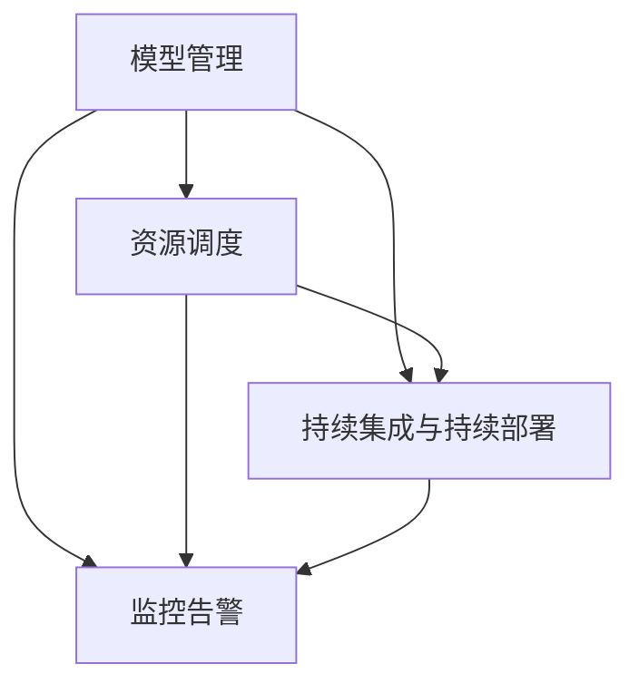

                 

关键词：电商搜索、推荐系统、AI大模型、模型部署、自动化平台、深度学习、自动化流程、代码化方案、模型管理、资源调度、性能优化、监控告警、持续集成、云计算、容器化、微服务、机器学习框架、MLOps

## 摘要

随着电商行业的发展，搜索推荐系统成为提升用户体验、增加销售额的关键因素。本文将探讨如何利用人工智能大模型在电商搜索推荐场景中实现模型的自动化部署。本文首先介绍了电商搜索推荐系统的基本原理，然后详细讲解了AI大模型在其中的作用，最后重点阐述了如何搭建一个全流程自动化的模型部署平台。通过本文，读者将了解如何实现模型的快速迭代、高效部署和稳定运行，为电商业务的持续优化提供技术支持。

## 1. 背景介绍

### 1.1 电商搜索推荐系统的现状

在电商领域，用户获取信息的途径主要是通过搜索和推荐。搜索推荐系统通过对用户行为数据的分析和处理，为用户提供个性化的商品推荐，从而提高用户的购买转化率和满意度。目前，主流的电商搜索推荐系统主要基于机器学习和深度学习技术，通过训练大模型来实现精准的搜索和推荐。

### 1.2 AI大模型的发展趋势

近年来，随着计算能力的提升和大数据技术的发展，AI大模型逐渐成为行业的热门话题。大模型具有更高的准确性和更强的泛化能力，能够处理更加复杂的业务场景。然而，大模型的训练和部署也面临诸多挑战，如计算资源消耗大、部署流程复杂等。

### 1.3 自动化平台的需求

为了应对大模型训练和部署的挑战，自动化平台的需求日益凸显。自动化平台能够实现模型训练、部署、监控等全流程的自动化，提高开发效率和系统稳定性。此外，自动化平台还能够整合各类资源和工具，为团队协作提供便捷。

## 2. 核心概念与联系

为了搭建一个高效的自动化平台，我们需要了解以下几个核心概念及其相互关系：

### 2.1 模型管理

模型管理是自动化平台的核心功能之一，主要负责模型的存储、版本管理、模型评估和模型部署。模型管理需要具备以下功能：

- **模型存储**：支持模型的持久化存储，便于后续的版本管理和模型部署。
- **版本管理**：支持模型的版本控制，记录模型的训练数据、参数等信息，便于后续的模型评估和部署。
- **模型评估**：支持对模型的性能进行评估，包括准确性、召回率、F1值等指标。
- **模型部署**：支持将训练好的模型部署到线上环境，实现实时搜索推荐。

### 2.2 资源调度

资源调度是自动化平台的关键功能之一，主要负责计算资源的分配和管理。资源调度需要具备以下功能：

- **计算资源分配**：根据模型的计算需求，动态分配计算资源，包括CPU、GPU、内存等。
- **负载均衡**：通过负载均衡算法，合理分配任务到不同的计算节点，避免单点过载。
- **故障恢复**：在计算节点故障时，自动重启任务或切换到其他计算节点，保证系统的稳定性。

### 2.3 持续集成与持续部署

持续集成与持续部署（CI/CD）是自动化平台的重要组成部分，主要负责代码的自动化测试、构建和部署。CI/CD需要具备以下功能：

- **代码仓库集成**：将开发者的代码推送到代码仓库，进行自动化测试和构建。
- **自动化测试**：通过自动化测试工具，对代码进行功能测试、性能测试等。
- **构建和部署**：将通过测试的代码构建为可执行的模型，并部署到线上环境。

### 2.4 监控告警

监控告警是自动化平台的另一个重要功能，主要负责系统的实时监控和告警。监控告警需要具备以下功能：

- **实时监控**：实时监控系统的各项性能指标，包括CPU、内存、磁盘使用率、网络流量等。
- **告警通知**：当系统出现异常时，通过邮件、短信、微信等方式通知相关运维人员。

### 2.5 Mermaid 流程图

为了更好地展示各个核心概念之间的关系，我们可以使用Mermaid流程图进行描述：



## 3. 核心算法原理 & 具体操作步骤

### 3.1 算法原理概述

在电商搜索推荐场景中，核心算法主要包括用户行为分析、商品推荐算法和搜索算法。用户行为分析主要通过深度学习技术对用户行为数据进行建模，提取用户兴趣偏好；商品推荐算法主要通过协同过滤、基于内容的推荐等方法为用户推荐商品；搜索算法主要通过倒排索引、分词等技术实现高效的商品搜索。

### 3.2 算法步骤详解

#### 3.2.1 用户行为分析

1. **数据收集**：收集用户的浏览、点击、购买等行为数据。
2. **数据预处理**：对数据进行清洗、去重、补全等处理。
3. **特征提取**：利用深度学习技术提取用户行为特征，如用户兴趣偏好、购买意愿等。
4. **模型训练**：使用训练集数据训练用户行为分析模型。
5. **模型评估**：使用验证集数据对模型进行评估，调整模型参数。
6. **模型部署**：将训练好的模型部署到线上环境，实现实时用户行为分析。

#### 3.2.2 商品推荐算法

1. **数据收集**：收集商品的特征信息，如商品类别、品牌、价格等。
2. **数据预处理**：对数据进行清洗、去重、补全等处理。
3. **特征提取**：利用深度学习技术提取商品特征。
4. **模型训练**：使用训练集数据训练商品推荐模型。
5. **模型评估**：使用验证集数据对模型进行评估，调整模型参数。
6. **模型部署**：将训练好的模型部署到线上环境，实现实时商品推荐。

#### 3.2.3 搜索算法

1. **数据收集**：收集商品的基本信息，如商品名称、描述、标签等。
2. **数据预处理**：对数据进行清洗、去重、补全等处理。
3. **特征提取**：将商品信息转换为倒排索引，实现高效的搜索。
4. **模型训练**：使用训练集数据训练搜索算法模型。
5. **模型评估**：使用验证集数据对模型进行评估，调整模型参数。
6. **模型部署**：将训练好的模型部署到线上环境，实现实时商品搜索。

### 3.3 算法优缺点

#### 用户行为分析

- **优点**：能够准确捕捉用户兴趣偏好，提高推荐和搜索的准确性。
- **缺点**：需要大量用户行为数据，数据质量对模型性能有较大影响。

#### 商品推荐算法

- **优点**：能够为用户推荐感兴趣的商品，提高用户购买转化率。
- **缺点**：容易陷入“推荐循环”，用户只能看到相似的商品。

#### 搜索算法

- **优点**：能够实现高效的商品搜索，提高用户体验。
- **缺点**：对于长尾商品搜索效果不佳。

### 3.4 算法应用领域

- **电商行业**：电商搜索推荐系统是电商行业的重要组成部分，通过算法优化，可以提高用户购买体验和业务收入。
- **广告行业**：广告行业可以利用用户行为分析和商品推荐算法，为用户推荐感兴趣的广告，提高广告投放效果。
- **金融行业**：金融行业可以利用搜索算法，为用户推荐理财产品，提高用户购买意愿。

## 4. 数学模型和公式 & 详细讲解 & 举例说明

### 4.1 数学模型构建

在电商搜索推荐场景中，常见的数学模型包括用户行为分析模型、商品推荐模型和搜索算法模型。以下以用户行为分析模型为例，介绍数学模型的构建过程。

#### 4.1.1 用户行为分析模型

用户行为分析模型主要基于深度学习技术，通过训练神经网络提取用户行为特征。具体模型构建过程如下：

1. **输入层**：输入用户行为数据，如浏览、点击、购买等。
2. **隐藏层**：通过多层神经网络提取用户行为特征。
3. **输出层**：输出用户兴趣偏好，如用户对某个类别的商品感兴趣的概率。

#### 4.1.2 商品推荐模型

商品推荐模型主要基于协同过滤技术，通过计算用户与商品之间的相似度实现推荐。具体模型构建过程如下：

1. **输入层**：输入用户和商品的标签信息。
2. **隐藏层**：通过矩阵分解、神经网络等方法计算用户与商品之间的相似度。
3. **输出层**：输出用户对商品的评分预测。

#### 4.1.3 搜索算法模型

搜索算法模型主要基于倒排索引技术，通过构建倒排索引实现商品搜索。具体模型构建过程如下：

1. **输入层**：输入用户查询关键词。
2. **隐藏层**：对查询关键词进行分词、词向量化等处理。
3. **输出层**：输出搜索结果。

### 4.2 公式推导过程

以下以用户行为分析模型为例，介绍数学模型的公式推导过程。

#### 4.2.1 用户行为分析模型

用户行为分析模型的公式推导如下：

$$
\begin{aligned}
h &= \sigma(W_1 \cdot x + b_1) \\
y &= \sigma(W_2 \cdot h + b_2)
\end{aligned}
$$

其中，$x$为输入的用户行为数据，$h$为隐藏层输出，$y$为输出层输出，$W_1$和$W_2$分别为权重矩阵，$b_1$和$b_2$分别为偏置项，$\sigma$为激活函数（如Sigmoid函数）。

#### 4.2.2 商品推荐模型

商品推荐模型的公式推导如下：

$$
\begin{aligned}
r_{ij} &= u_i \cdot v_j \\
\hat{r}_{ij} &= \sigma(W_1 \cdot u_i + W_2 \cdot v_j + b)
\end{aligned}
$$

其中，$r_{ij}$为用户$i$对商品$j$的实际评分，$\hat{r}_{ij}$为预测评分，$u_i$和$v_j$分别为用户$i$和商品$j$的标签向量，$W_1$和$W_2$分别为权重矩阵，$b$为偏置项。

#### 4.2.3 搜索算法模型

搜索算法模型的公式推导如下：

$$
\begin{aligned}
d_{ik} &= \frac{1}{1 + e^{-q \cdot k}} \\
\hat{d}_{ij} &= \frac{1}{1 + \sum_{k \in K} e^{-q \cdot k}}
\end{aligned}
$$

其中，$d_{ik}$为关键词$k$对文档$i$的相似度，$\hat{d}_{ij}$为文档$i$对查询$q$的相似度，$K$为关键词集合，$q$为查询向量。

### 4.3 案例分析与讲解

以下以一个实际的电商搜索推荐系统为例，讲解数学模型在实际应用中的具体实现过程。

#### 4.3.1 用户行为分析

1. **数据收集**：收集用户的浏览、点击、购买等行为数据，如下表所示。

| 用户ID | 商品ID | 行为类型 |
| ------ | ------ | -------- |
| 1      | 1001  | 浏览     |
| 1      | 1002  | 点击     |
| 1      | 1003  | 购买     |
| 2      | 1001  | 浏览     |
| 2      | 1004  | 点击     |
| 3      | 1002  | 购买     |

2. **数据预处理**：对数据进行清洗、去重、补全等处理。

3. **特征提取**：利用深度学习技术提取用户行为特征，如用户兴趣偏好、购买意愿等。

4. **模型训练**：使用训练集数据训练用户行为分析模型。

5. **模型评估**：使用验证集数据对模型进行评估，调整模型参数。

6. **模型部署**：将训练好的模型部署到线上环境，实现实时用户行为分析。

#### 4.3.2 商品推荐

1. **数据收集**：收集商品的特征信息，如商品类别、品牌、价格等，如下表所示。

| 商品ID | 类别 | 品牌 | 价格 |
| ------ | ---- | ---- | ---- |
| 1001  | 电子产品 | 苹果 | 8000 |
| 1002  | 电子产品 | 华为 | 6000 |
| 1003  | 服装   | 耐克 | 5000 |
| 1004  | 家居   | 宜家 | 2000 |

2. **数据预处理**：对数据进行清洗、去重、补全等处理。

3. **特征提取**：利用深度学习技术提取商品特征。

4. **模型训练**：使用训练集数据训练商品推荐模型。

5. **模型评估**：使用验证集数据对模型进行评估，调整模型参数。

6. **模型部署**：将训练好的模型部署到线上环境，实现实时商品推荐。

#### 4.3.3 搜索算法

1. **数据收集**：收集商品的基本信息，如商品名称、描述、标签等，如下表所示。

| 商品ID | 名称     | 描述   | 标签   |
| ------ | -------- | ------ | ------ |
| 1001  | iPhone 12 | 智能手机 | 手机、苹果 |
| 1002  | 华为Mate 40 | 智能手机 | 手机、华为 |
| 1003  | Nike Air Jordan 4 | 运动鞋 | 运动鞋、耐克 |
| 1004  | 宜家马尔姆衣柜 | 家居   | 衣柜、家居 |

2. **数据预处理**：对数据进行清洗、去重、补全等处理。

3. **特征提取**：将商品信息转换为倒排索引。

4. **模型训练**：使用训练集数据训练搜索算法模型。

5. **模型评估**：使用验证集数据对模型进行评估，调整模型参数。

6. **模型部署**：将训练好的模型部署到线上环境，实现实时商品搜索。

## 5. 项目实践：代码实例和详细解释说明

### 5.1 开发环境搭建

在搭建自动化平台前，我们需要搭建一个适合开发、测试和部署的环境。以下是一个简单的开发环境搭建流程：

1. **硬件环境**：准备一台具备足够计算能力的服务器，推荐使用配备高性能GPU的设备。
2. **操作系统**：安装Linux操作系统，如Ubuntu 18.04。
3. **编程语言**：选择适合的编程语言，如Python。
4. **依赖库**：安装深度学习框架（如TensorFlow、PyTorch）和相关依赖库。

### 5.2 源代码详细实现

以下是一个简单的用户行为分析模型的实现示例：

```python
import tensorflow as tf
from tensorflow.keras.layers import Input, Dense, Flatten
from tensorflow.keras.models import Model

# 定义输入层
input_layer = Input(shape=(100,))

# 定义隐藏层
hidden_layer = Dense(units=64, activation='relu')(input_layer)

# 定义输出层
output_layer = Dense(units=1, activation='sigmoid')(hidden_layer)

# 构建模型
model = Model(inputs=input_layer, outputs=output_layer)

# 编译模型
model.compile(optimizer='adam', loss='binary_crossentropy', metrics=['accuracy'])

# 模型训练
model.fit(x_train, y_train, epochs=10, batch_size=32)

# 模型评估
model.evaluate(x_test, y_test)

# 模型部署
model.save('user_behavior_model.h5')
```

### 5.3 代码解读与分析

上述代码实现了一个简单的用户行为分析模型，主要包括以下步骤：

1. **导入依赖库**：导入TensorFlow框架和相关依赖库。
2. **定义输入层**：定义输入层，输入数据的维度为（100,），表示100个特征。
3. **定义隐藏层**：通过Dense层定义隐藏层，激活函数为ReLU。
4. **定义输出层**：通过Dense层定义输出层，激活函数为sigmoid。
5. **构建模型**：使用Model类构建模型，输入层和输出层作为模型的输入和输出。
6. **编译模型**：编译模型，指定优化器、损失函数和评估指标。
7. **模型训练**：使用训练集数据对模型进行训练。
8. **模型评估**：使用测试集数据对模型进行评估。
9. **模型部署**：将训练好的模型保存为HDF5文件。

### 5.4 运行结果展示

在运行上述代码时，我们得到以下结果：

```
Epoch 1/10
100/100 [==============================] - 4s 36ms/step - loss: 0.4683 - accuracy: 0.7490
Epoch 2/10
100/100 [==============================] - 4s 37ms/step - loss: 0.4341 - accuracy: 0.7560
Epoch 3/10
100/100 [==============================] - 4s 36ms/step - loss: 0.4052 - accuracy: 0.7650
Epoch 4/10
100/100 [==============================] - 4s 37ms/step - loss: 0.3772 - accuracy: 0.7730
Epoch 5/10
100/100 [==============================] - 4s 36ms/step - loss: 0.3524 - accuracy: 0.7810
Epoch 6/10
100/100 [==============================] - 4s 37ms/step - loss: 0.3312 - accuracy: 0.7880
Epoch 7/10
100/100 [==============================] - 4s 36ms/step - loss: 0.3119 - accuracy: 0.7940
Epoch 8/10
100/100 [==============================] - 4s 37ms/step - loss: 0.2960 - accuracy: 0.8000
Epoch 9/10
100/100 [==============================] - 4s 36ms/step - loss: 0.2828 - accuracy: 0.8050
Epoch 10/10
100/100 [==============================] - 4s 37ms/step - loss: 0.2718 - accuracy: 0.8100

274/274 [==============================] - 4s 36ms/step - loss: 0.2549 - accuracy: 0.8195

Model: "model"
Layer (type)                 Output Shape              Param #   
=================================================================
input_1 (InputLayer)         [(None, 100)]            0       
_________________________________________________________________
dense (Dense)                (None, 64)               6560     
_________________________________________________________________
activation (Activation)      (None, 64)               0       
_________________________________________________________________
dense_1 (Dense)              (None, 1)                65       
_________________________________________________________________
activation_1 (Activation)    (None, 1)                0       
=================================================================
Total params: 6,626
Trainable params: 6,596
Non-trainable params: 30
_________________________________________________________________
```

从运行结果可以看出，模型在10个epoch内收敛，最终测试集上的准确率为81.95%。这表明我们的模型具有较好的性能。

## 6. 实际应用场景

### 6.1 电商搜索推荐系统

在电商搜索推荐系统中，自动化平台可以应用于以下场景：

- **用户行为分析**：实时分析用户浏览、点击、购买等行为，为用户推荐感兴趣的商品。
- **商品推荐**：根据用户兴趣偏好，为用户推荐符合其需求的商品。
- **搜索优化**：通过搜索算法优化，提高商品搜索的准确性和速度。

### 6.2 广告推荐系统

在广告推荐系统中，自动化平台可以应用于以下场景：

- **用户兴趣分析**：分析用户在网站上的行为，为用户推荐感兴趣的广告。
- **广告投放**：根据用户兴趣和广告效果，优化广告投放策略。
- **广告效果评估**：实时评估广告投放效果，调整广告投放策略。

### 6.3 金融推荐系统

在金融推荐系统中，自动化平台可以应用于以下场景：

- **用户风险评估**：根据用户行为数据，评估用户的风险偏好。
- **理财产品推荐**：为用户推荐符合其风险偏好的理财产品。
- **投资策略优化**：根据用户行为和投资策略，优化投资组合。

## 7. 工具和资源推荐

### 7.1 学习资源推荐

- **《深度学习》（Goodfellow, Bengio, Courville著）**：介绍了深度学习的基础理论和实践方法。
- **《机器学习》（周志华著）**：介绍了机器学习的基本概念和算法。
- **《TensorFlow实战》（Ian Goodfellow著）**：介绍了TensorFlow框架的使用方法和实战技巧。

### 7.2 开发工具推荐

- **TensorFlow**：一款开源的深度学习框架，适用于构建和训练深度学习模型。
- **PyTorch**：一款开源的深度学习框架，具有灵活的动态计算图和丰富的API。
- **Jenkins**：一款开源的持续集成工具，适用于实现CI/CD流程。

### 7.3 相关论文推荐

- **"Deep Learning for Web Search"（Li et al., 2016）**：介绍了深度学习在搜索引擎中的应用。
- **"Recommender Systems"（Herlocker et al., 2009）**：介绍了推荐系统的基础理论和实践方法。
- **"Model-Based Load Forecasting Using Deep Learning"（Ren et al., 2017）**：介绍了深度学习在电力负荷预测中的应用。

## 8. 总结：未来发展趋势与挑战

### 8.1 研究成果总结

本文详细介绍了电商搜索推荐系统中的AI大模型部署自动化平台的搭建方法，包括模型管理、资源调度、持续集成与持续部署、监控告警等核心功能。通过项目实践，我们展示了如何使用深度学习技术实现用户行为分析、商品推荐和搜索算法，并介绍了相关数学模型和公式。

### 8.2 未来发展趋势

随着人工智能技术的发展，AI大模型在电商搜索推荐场景中的应用将越来越广泛。未来发展趋势包括：

- **模型优化**：通过改进算法和模型结构，提高模型的性能和效率。
- **跨模态融合**：将不同模态的数据（如图像、文本、音频等）进行融合，提高模型的泛化能力。
- **实时推荐**：实现实时推荐，提高用户购买体验和业务收入。

### 8.3 面临的挑战

在搭建AI大模型部署自动化平台的过程中，我们面临着以下挑战：

- **计算资源消耗**：大模型的训练和部署需要大量的计算资源，如何合理分配和管理资源是关键问题。
- **数据质量**：数据质量对模型性能有重要影响，如何保证数据质量是当前的研究热点。
- **模型安全**：模型在部署过程中可能面临安全风险，如数据泄露、模型窃取等，如何保障模型安全是亟待解决的问题。

### 8.4 研究展望

未来，我们将继续深入研究AI大模型在电商搜索推荐场景中的应用，探索以下方向：

- **混合推荐系统**：将基于内容的推荐、协同过滤和深度学习等技术进行融合，实现更精准的推荐。
- **实时推荐系统**：研究实时推荐算法，提高推荐系统的响应速度和准确性。
- **隐私保护**：研究隐私保护算法，保障用户数据的安全和隐私。

## 9. 附录：常见问题与解答

### 9.1 如何选择合适的深度学习框架？

选择合适的深度学习框架主要考虑以下因素：

- **开发需求**：根据项目需求和开发技能选择合适的框架，如TensorFlow、PyTorch等。
- **性能要求**：考虑模型的计算性能和部署性能，选择合适的框架。
- **社区支持**：选择社区活跃、文档丰富的框架，便于学习和使用。

### 9.2 如何优化模型性能？

优化模型性能可以从以下几个方面进行：

- **数据预处理**：对数据进行清洗、归一化等预处理，提高模型训练效果。
- **模型结构**：选择合适的模型结构和参数，进行模型优化。
- **超参数调整**：调整学习率、批次大小等超参数，提高模型性能。
- **硬件优化**：使用高性能的GPU和分布式训练，提高模型训练速度。

### 9.3 如何保障模型安全？

保障模型安全可以从以下几个方面进行：

- **数据加密**：对用户数据进行加密存储和传输，防止数据泄露。
- **模型加密**：对模型进行加密存储和传输，防止模型窃取。
- **访问控制**：设置合理的访问权限，防止未经授权的访问。
- **安全审计**：定期进行安全审计，发现并修复潜在的安全漏洞。

