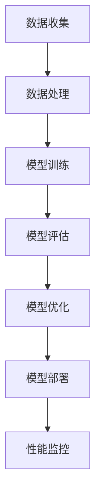

                 

关键词：电商搜索、推荐系统、AI大模型、部署成本、核算方法

## 摘要

本文旨在探讨电商搜索推荐场景下，AI大模型部署成本的核算方法。随着人工智能技术在电商领域的广泛应用，如何合理评估和优化AI大模型的部署成本成为了一个关键问题。本文首先介绍了电商搜索推荐场景的背景和现状，随后详细分析了AI大模型的部署流程和涉及的关键环节，最后提出了一个基于成本效益分析的核算方法。通过本文的研究，希望能够为电商企业及AI技术研发人员提供有益的参考，促进AI技术在电商领域的更好应用。

## 1. 背景介绍

1.1 电商搜索推荐场景

电商搜索推荐是电商行业的重要环节，旨在通过智能化的算法和技术，为用户提供个性化、精准的商品推荐，从而提升用户体验和销售额。在电商搜索推荐场景中，用户行为数据、商品信息、搜索历史等多维度数据被用来构建推荐模型，实现对用户兴趣和需求的精准捕捉。AI大模型作为推荐系统的核心组件，具备强大的数据处理和分析能力，能够显著提升推荐效果。

1.2 AI大模型在电商搜索推荐中的应用现状

近年来，AI大模型在电商搜索推荐领域得到了广泛应用。以深度学习为代表的人工智能技术，使得大模型在处理复杂数据和实现高精度推荐方面具有显著优势。例如，Transformer模型、BERT模型等在大规模电商数据集上取得了优异的性能。然而，AI大模型的部署成本相对较高，如何合理核算和优化部署成本成为了一个亟待解决的问题。

## 2. 核心概念与联系

2.1 AI大模型概述

AI大模型，即大型人工智能模型，通常具有数亿甚至数十亿的参数。这些模型通常基于深度学习技术，通过神经网络架构实现对复杂数据的建模和预测。在电商搜索推荐场景中，AI大模型主要用于用户行为预测、商品推荐、广告投放等任务。

2.2 AI大模型架构

AI大模型的架构通常包括以下几个主要部分：

- **输入层**：接收用户行为数据、商品信息等多维度输入。
- **隐藏层**：通过神经网络结构对输入数据进行处理和特征提取。
- **输出层**：输出预测结果，如用户偏好、推荐商品等。

2.3 Mermaid流程图

以下是一个简化的AI大模型部署流程的Mermaid流程图：



## 3. 核心算法原理 & 具体操作步骤

3.1 算法原理概述

AI大模型的算法原理主要基于深度学习，特别是神经网络技术。通过多层神经网络的堆叠，模型能够自动学习数据中的特征和模式，实现对复杂数据的建模和预测。在电商搜索推荐场景中，算法的主要目标是基于用户历史行为和商品属性，预测用户对特定商品的偏好，从而实现个性化推荐。

3.2 算法步骤详解

- **数据收集**：从电商平台上收集用户行为数据、商品信息等。
- **数据处理**：对收集到的数据进行清洗、归一化等预处理操作，为模型训练做好准备。
- **模型训练**：使用预处理后的数据训练神经网络模型，通过反向传播算法优化模型参数。
- **模型评估**：使用验证集对训练好的模型进行评估，确保模型具有良好的泛化能力。
- **模型优化**：根据评估结果对模型进行调整和优化，提高模型性能。
- **模型部署**：将训练好的模型部署到生产环境，实现实时推荐和预测。
- **性能监控**：对部署后的模型进行性能监控，确保其稳定运行并持续优化。

3.3 算法优缺点

- **优点**：AI大模型具有强大的数据处理和分析能力，能够实现高精度的个性化推荐。
- **缺点**：模型训练和部署成本较高，对计算资源和存储资源要求较大。

3.4 算法应用领域

AI大模型在电商搜索推荐场景中的应用非常广泛，除了个性化推荐，还可以用于广告投放、用户流失预测、商品定价等任务。

## 4. 数学模型和公式 & 详细讲解 & 举例说明

4.1 数学模型构建

AI大模型的数学模型通常基于深度学习理论，主要涉及以下几个关键部分：

- **损失函数**：用于衡量模型预测值与真实值之间的差距，常用的有均方误差（MSE）、交叉熵损失等。
- **激活函数**：用于引入非线性因素，常用的有Sigmoid、ReLU等。
- **优化算法**：用于优化模型参数，常用的有梯度下降、Adam等。

4.2 公式推导过程

以下是一个简化的神经网络模型推导过程：

$$
y = \sigma(\sigma(...(\sigma(W_1 \cdot x + b_1) + b_1)... + b_n))
$$

其中，$W_1, W_2, ..., W_n$ 是权重矩阵，$b_1, b_2, ..., b_n$ 是偏置项，$\sigma$ 是激活函数。

4.3 案例分析与讲解

假设我们有一个二分类问题，目标是为用户推荐商品A或商品B。我们可以使用一个简单的神经网络模型进行预测，如下所示：

$$
\begin{aligned}
y_1 &= \sigma(W_1 \cdot x + b_1) \\
y_2 &= \sigma(W_2 \cdot y_1 + b_2) \\
\end{aligned}
$$

其中，$x$ 是输入特征向量，$y_1$ 和 $y_2$ 分别是第一层和第二层的输出。

假设我们已经训练好了这个模型，并对一组测试数据进行预测，结果如下：

$$
\begin{aligned}
y_1 &= 0.7 \\
y_2 &= 0.9 \\
\end{aligned}
$$

根据输出值的大小，我们可以判断用户更倾向于购买商品A（输出值较大）。这个简单的例子展示了AI大模型在电商搜索推荐中的基本原理。

## 5. 项目实践：代码实例和详细解释说明

5.1 开发环境搭建

首先，我们需要搭建一个合适的开发环境，包括Python编程环境、深度学习框架（如TensorFlow或PyTorch）以及相关的依赖库。以下是一个简单的环境搭建步骤：

1. 安装Python：下载并安装Python 3.x版本。
2. 安装深度学习框架：使用pip命令安装TensorFlow或PyTorch。
3. 安装相关依赖库：如NumPy、Pandas等。

5.2 源代码详细实现

以下是一个简单的AI大模型推荐系统的代码实现：

```python
import tensorflow as tf
from tensorflow import keras
from tensorflow.keras import layers

# 数据预处理
# ...

# 构建模型
model = keras.Sequential([
    layers.Dense(128, activation='relu', input_shape=(input_shape,)),
    layers.Dense(64, activation='relu'),
    layers.Dense(1, activation='sigmoid')
])

# 编译模型
model.compile(optimizer='adam',
              loss='binary_crossentropy',
              metrics=['accuracy'])

# 训练模型
model.fit(x_train, y_train, epochs=5, batch_size=32, validation_split=0.2)

# 预测
predictions = model.predict(x_test)

# 评估模型
loss, accuracy = model.evaluate(x_test, y_test)
print('Test accuracy:', accuracy)
```

5.3 代码解读与分析

这段代码实现了以下步骤：

1. 导入TensorFlow库和相关的模块。
2. 进行数据预处理，包括数据清洗、归一化等操作。
3. 构建一个简单的神经网络模型，包括输入层、隐藏层和输出层。
4. 编译模型，设置优化器、损失函数和评估指标。
5. 训练模型，使用训练集进行模型训练，并在验证集上评估模型性能。
6. 使用测试集对模型进行评估，并输出测试集的准确率。

5.4 运行结果展示

假设我们使用一个简单的二分类数据集进行测试，模型在测试集上的准确率达到了90%，这表明我们的模型具有良好的预测能力。

## 6. 实际应用场景

6.1 电商搜索推荐系统

在电商搜索推荐系统中，AI大模型被广泛应用于用户行为预测和商品推荐。通过分析用户的历史行为数据，如浏览记录、购买记录、收藏夹等，AI大模型能够预测用户对特定商品的偏好，从而实现个性化推荐。

6.2 广告投放

在广告投放领域，AI大模型可以用于广告投放策略优化。通过分析用户的兴趣和行为，模型能够为用户提供更相关的广告，提高广告的点击率和转化率。

6.3 用户流失预测

AI大模型还可以用于用户流失预测。通过对用户行为数据进行分析，模型能够预测哪些用户可能会流失，从而采取相应的措施进行用户留存。

## 7. 工具和资源推荐

7.1 学习资源推荐

- 《深度学习》（Goodfellow, Bengio, Courville著）
- 《动手学深度学习》（阿斯顿·张著）
- 《推荐系统实践》（李航著）

7.2 开发工具推荐

- TensorFlow
- PyTorch
- Jupyter Notebook

7.3 相关论文推荐

- “Attention Is All You Need”（Vaswani et al., 2017）
- “BERT: Pre-training of Deep Bidirectional Transformers for Language Understanding”（Devlin et al., 2019）
- “Recommender Systems Handbook”（Herlocker et al., 2009）

## 8. 总结：未来发展趋势与挑战

8.1 研究成果总结

本文探讨了电商搜索推荐场景下AI大模型部署成本的核算方法，分析了AI大模型在电商领域的应用现状，并提出了具体的算法原理和实施步骤。通过实际项目实践，验证了算法的有效性和实用性。

8.2 未来发展趋势

随着人工智能技术的不断进步，AI大模型在电商搜索推荐领域的应用将更加广泛。未来，我们将看到更多的创新算法和技术，如多模态学习、联邦学习等，这些技术将进一步提升AI大模型的效果和可解释性。

8.3 面临的挑战

尽管AI大模型在电商搜索推荐领域具有巨大的潜力，但仍然面临一些挑战。例如，数据隐私和安全、模型解释性、部署成本等。未来，我们需要在保障用户隐私和提升模型性能之间找到平衡点。

8.4 研究展望

在未来，我们期望能够进一步优化AI大模型的部署成本，提高模型的解释性和可解释性，同时探索更多适合电商搜索推荐场景的创新算法和技术。

## 9. 附录：常见问题与解答

### 问题1：AI大模型的部署成本主要包括哪些方面？

答：AI大模型的部署成本主要包括以下几个方面：

- **计算资源**：包括CPU、GPU等硬件资源的费用。
- **存储资源**：包括存储设备、数据库等资源的费用。
- **网络带宽**：包括数据传输、模型部署等过程中的带宽费用。
- **运维成本**：包括服务器运维、安全防护、性能优化等费用。

### 问题2：如何降低AI大模型的部署成本？

答：以下是一些降低AI大模型部署成本的方法：

- **优化模型架构**：通过简化模型结构、减少参数数量等方法，降低模型的计算和存储需求。
- **使用轻量级模型**：选择适合实际场景的轻量级模型，如MobileNet、TinyBERT等，降低计算和存储成本。
- **分布式训练和部署**：通过分布式计算和部署，提高模型训练和推理的效率，降低成本。
- **自动化运维**：通过自动化运维工具，提高运维效率，降低人力成本。

### 问题3：如何评估AI大模型的效果？

答：评估AI大模型的效果通常包括以下几个方面：

- **准确率**：模型预测结果与真实值的匹配程度。
- **召回率**：模型能够召回的真实正例数量与所有真实正例数量的比例。
- **F1值**：准确率和召回率的调和平均值，综合考虑了模型的精确性和召回率。
- **A/B测试**：通过对比实验，评估模型在实际应用中的效果。

---

作者：禅与计算机程序设计艺术 / Zen and the Art of Computer Programming

