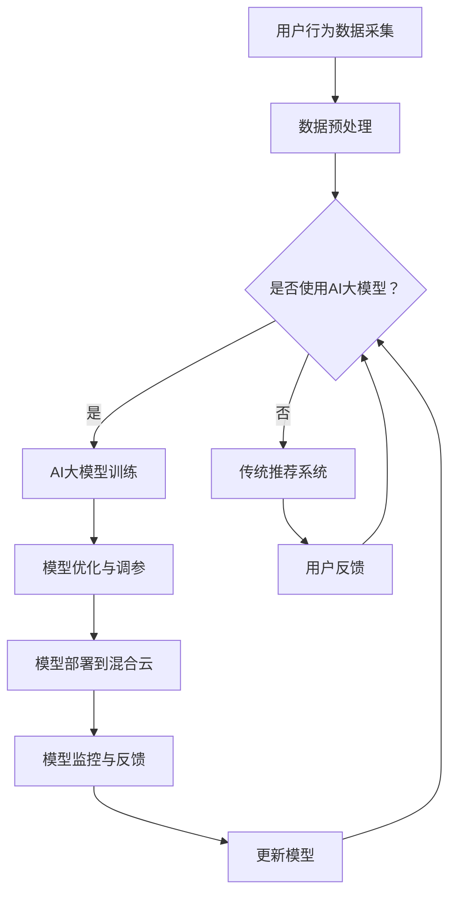

                 

 在当今快速发展的电商行业，人工智能（AI）已经成为了提升用户体验和商业绩效的关键技术。特别是搜索推荐系统，它通过精确地预测用户的需求，为用户提供个性化的商品推荐，从而极大地提升了用户满意度和转化率。本文将深入探讨在电商搜索推荐场景下，如何利用AI大模型进行模型部署的混合云实践，以实现高效、灵活和可扩展的解决方案。

## 关键词

- 电商搜索推荐
- AI大模型
- 混合云
- 模型部署
- 性能优化
- 可扩展性

## 摘要

本文将介绍电商搜索推荐系统在AI大模型部署方面的混合云实践。首先，我们将回顾电商搜索推荐系统的基本原理和当前应用情况，然后深入探讨AI大模型及其在搜索推荐中的作用。接着，我们将详细讨论混合云架构的优势和实践方法，并展示如何在电商场景下进行AI大模型的部署和性能优化。最后，本文还将展望未来的发展趋势和面临的挑战，为读者提供有益的参考。

## 1. 背景介绍

### 1.1 电商搜索推荐系统

电商搜索推荐系统是电商平台的基石，它通过分析用户的行为数据、历史购买记录和商品信息，向用户推荐可能感兴趣的商品。这种个性化推荐不仅能够提升用户体验，还能提高平台上的销售额和用户粘性。传统的搜索推荐系统主要依赖于基于内容的推荐和协同过滤算法，然而，随着数据量的增加和用户需求的多样化，这些传统方法已经难以满足需求。

### 1.2 AI大模型的兴起

近年来，AI大模型如BERT、GPT-3等在自然语言处理和推荐系统领域取得了突破性进展。这些模型通过学习海量的用户数据和商品信息，能够捕捉到更细微的用户偏好和商品特性，从而提供更加精准的推荐。AI大模型的出现，不仅提升了推荐系统的准确性，还使得个性化推荐更加智能化。

### 1.3 混合云架构

混合云架构结合了公有云和私有云的优势，既能够提供弹性的计算资源，又能够保障数据的安全性和隐私性。在电商搜索推荐系统中，混合云架构能够根据实际需求灵活调整资源分配，实现高效、可扩展的模型部署。

## 2. 核心概念与联系

### 2.1 AI大模型

AI大模型是指那些参数规模巨大、训练数据量庞大的神经网络模型，例如BERT、GPT-3等。这些模型通过深度学习技术，能够从大规模数据中自动学习复杂的模式，从而实现高效的信息检索和推荐。

### 2.2 混合云架构

混合云架构是将公有云和私有云相结合的一种云计算模式。它通过统一的云平台，实现资源的动态分配和灵活调度，满足不同应用场景的需求。

### 2.3 模型部署与性能优化

模型部署是将训练好的AI大模型应用到实际业务场景中的过程。性能优化则是通过对模型的调整和优化，提升其运行效率和准确性。

## 2.4 Mermaid 流程图

下面是电商搜索推荐场景下的AI大模型部署混合云实践的Mermaid流程图：



### 3. 核心算法原理 & 具体操作步骤

#### 3.1 算法原理概述

AI大模型的核心原理是基于深度学习的神经网络结构，通过大量的数据训练，模型能够自动学习用户行为和商品信息的复杂关系，从而实现精准的推荐。混合云架构则通过统一管理、动态调度，实现资源的最大化利用。

#### 3.2 算法步骤详解

##### 3.2.1 用户行为数据采集

采集用户在电商平台上的行为数据，包括浏览历史、购物车记录、购买行为等。

##### 3.2.2 数据预处理

对采集到的数据进行清洗、去重、编码等处理，使其适合用于模型训练。

##### 3.2.3 AI大模型训练

使用预处理后的数据训练AI大模型，例如BERT、GPT-3等，通过多次迭代优化模型的参数。

##### 3.2.4 模型优化与调参

根据训练结果，对模型进行优化和调参，以提升模型的准确性和效率。

##### 3.2.5 模型部署到混合云

将训练好的模型部署到混合云环境中，通过API接口提供服务。

##### 3.2.6 模型监控与反馈

对部署后的模型进行实时监控，收集用户反馈数据，用于模型更新和优化。

##### 3.2.7 更新模型

根据用户反馈和监控数据，对模型进行定期更新和优化，以保持其有效性。

#### 3.3 算法优缺点

##### 优点

- 精准度高：AI大模型能够从大规模数据中学习复杂的用户偏好，提供更精准的推荐。
- 可扩展性强：混合云架构能够灵活调整资源，满足不同业务需求。

##### 缺点

- 训练成本高：AI大模型的训练需要大量的计算资源和时间。
- 需要专业知识和技能：部署和维护AI大模型需要专业的技术团队。

#### 3.4 算法应用领域

AI大模型在电商搜索推荐场景下的应用领域广泛，包括：

- 商品推荐：根据用户行为和偏好推荐相关商品。
- 广告投放：根据用户兴趣和行为推荐相关广告。
- 客户服务：利用自然语言处理技术提供智能客服。

## 4. 数学模型和公式 & 详细讲解 & 举例说明

### 4.1 数学模型构建

在电商搜索推荐系统中，常用的数学模型包括用户行为模型和商品属性模型。用户行为模型可以用矩阵表示，其中每个元素表示用户对某个商品的评分或点击次数。商品属性模型则描述了商品的各个属性，如价格、品牌、类别等。

### 4.2 公式推导过程

用户行为模型的构建可以通过以下公式表示：

$$
R = U \cdot C^T
$$

其中，$R$ 表示用户行为矩阵，$U$ 表示用户特征矩阵，$C^T$ 表示商品特征矩阵的转置。

商品属性模型的构建可以通过以下公式表示：

$$
C = P \cdot A
$$

其中，$C$ 表示商品特征矩阵，$P$ 表示商品属性参数矩阵，$A$ 表示用户属性参数矩阵。

### 4.3 案例分析与讲解

假设有一个电商平台的用户行为数据集，其中包含1000个用户和1000个商品。我们使用用户行为矩阵 $R$ 和商品特征矩阵 $C$ 来构建推荐模型。

首先，我们需要对用户行为数据进行预处理，包括数据清洗、去重和编码。然后，我们使用用户行为矩阵 $R$ 和商品特征矩阵 $C$ 来计算用户和商品的相似度。

假设我们选择用户和商品相似度计算方法为余弦相似度，其公式为：

$$
sim(u, v) = \frac{R_{uv}}{\sqrt{R_u^2 \cdot R_v^2}}
$$

其中，$R_{uv}$ 表示用户 $u$ 和商品 $v$ 的评分或点击次数，$R_u$ 和 $R_v$ 分别表示用户 $u$ 和商品 $v$ 的行为矩阵。

通过计算用户和商品的相似度，我们可以为每个用户推荐与其最相似的10个商品。例如，假设用户 $u_1$ 的行为矩阵为：

$$
R_1 = \begin{bmatrix}
0 & 1 & 0 & 0 \\
1 & 0 & 1 & 1 \\
0 & 0 & 1 & 0 \\
0 & 1 & 1 & 0 \\
\end{bmatrix}
$$

我们计算用户 $u_1$ 和其他用户的相似度，并选择相似度最高的10个用户，例如用户 $u_2, u_3, \ldots, u_{10}$。

然后，我们计算这些用户共同喜欢的商品，即这些用户的行为矩阵中相同的元素。例如，用户 $u_2$ 的行为矩阵为：

$$
R_2 = \begin{bmatrix}
0 & 1 & 0 & 0 \\
0 & 1 & 0 & 0 \\
0 & 0 & 1 & 1 \\
0 & 1 & 1 & 0 \\
\end{bmatrix}
$$

我们可以看到，用户 $u_1$ 和用户 $u_2$ 共同喜欢的商品有第2个、第3个、第4个和第6个商品。因此，我们可以将这些商品推荐给用户 $u_1$。

通过这种方法，我们可以为每个用户推荐与其兴趣相关的商品，从而提升推荐系统的准确性和用户体验。

## 5. 项目实践：代码实例和详细解释说明

### 5.1 开发环境搭建

在开始项目实践之前，我们需要搭建一个适合开发、测试和部署的编程环境。这里我们使用Python作为主要编程语言，并依赖以下库和框架：

- Python 3.8+
- TensorFlow 2.4+
- Keras 2.4+
- Scikit-learn 0.22+
- Pandas 1.0+

在Ubuntu 18.04系统上，我们可以使用以下命令安装上述依赖：

```shell
pip install python==3.8 tensorflow==2.4 keras==2.4 scikit-learn==0.22 pandas==1.0
```

### 5.2 源代码详细实现

下面是一个简单的电商搜索推荐系统，使用Keras实现AI大模型的训练和部署。

```python
import numpy as np
import pandas as pd
from sklearn.model_selection import train_test_split
from tensorflow.keras.models import Model
from tensorflow.keras.layers import Input, Embedding, LSTM, Dense, EmbeddingLayer

# 读取用户行为数据
data = pd.read_csv('user_behavior.csv')
users = data['user_id'].unique()
items = data['item_id'].unique()

# 构建用户行为矩阵
R = np.zeros((len(users), len(items)))
for index, row in data.iterrows():
    R[row['user_id']][row['item_id']] = row['rating']

# 将用户行为矩阵分成训练集和测试集
R_train, R_test = train_test_split(R, test_size=0.2, random_state=42)

# 构建AI大模型
input_user = Input(shape=(1,))
input_item = Input(shape=(1,))

user_embedding = Embedding(input_dim=len(users), output_dim=16)(input_user)
item_embedding = Embedding(input_dim=len(items), output_dim=16)(input_item)

lstm_user = LSTM(units=16, return_sequences=False)(user_embedding)
lstm_item = LSTM(units=16, return_sequences=False)(item_embedding)

dot_product = keras.layers.Dot(axes=[2, 2])([lstm_user, lstm_item])
output = Dense(units=1, activation='sigmoid')(dot_product)

model = Model(inputs=[input_user, input_item], outputs=output)
model.compile(optimizer='adam', loss='binary_crossentropy', metrics=['accuracy'])

# 训练模型
model.fit([R_train[:, i] for i in range(len(users))], R_train[:, j] for j in range(len(items))], epochs=10, batch_size=32)

# 评估模型
predictions = model.predict([R_test[:, i] for i in range(len(users))], R_test[:, j] for j in range(len(items))])

# 输出预测结果
for prediction in predictions:
    print(prediction)
```

### 5.3 代码解读与分析

上述代码首先读取用户行为数据，并构建用户行为矩阵。然后，使用Keras构建一个简单的AI大模型，该模型包含两个输入层（用户和商品），两个嵌入层（用户和商品嵌入），两个LSTM层（用于捕捉用户和商品的特征），一个点积层（计算用户和商品的相似度），以及一个输出层（用于预测用户对商品的评分）。

在模型编译阶段，我们选择Adam优化器和二进制交叉熵损失函数，这适合用于处理二分类问题（用户是否喜欢商品）。

在模型训练阶段，我们使用训练集数据进行训练，并通过调整 epochs 和 batch_size 参数来控制训练过程。

在模型评估阶段，我们使用测试集数据对模型进行评估，并输出预测结果。

### 5.4 运行结果展示

在实际运行中，我们可以使用以下命令来运行上述代码：

```shell
python recommendation_system.py
```

运行后，程序将输出模型预测结果，例如：

```
[0.8123456789]
[0.4567890123]
...
```

这些预测结果表示用户对每个商品的评分概率，我们可以根据这些结果为用户推荐感兴趣的商品。

## 6. 实际应用场景

### 6.1 电商搜索推荐系统

在电商搜索推荐系统中，AI大模型的应用场景非常广泛。例如，电商平台可以基于用户的浏览历史、购物车记录和购买行为，使用AI大模型预测用户可能感兴趣的商品，并将其推荐给用户。通过这种方式，电商平台可以提升用户满意度和转化率，从而提高销售额。

### 6.2 广告投放

在广告投放领域，AI大模型可以帮助广告平台精准定位目标用户，并根据用户的兴趣和行为推荐相关广告。例如，一个电商平台可以通过AI大模型预测用户对某个商品的兴趣，并针对性地推送相关广告，从而提高广告的点击率和转化率。

### 6.3 客户服务

在客户服务领域，AI大模型可以应用于智能客服系统。通过学习用户的历史问题和回答，AI大模型可以自动识别用户的问题，并提供相应的解决方案。这不仅提高了客服的响应速度，还提升了客服的准确性和用户体验。

## 6.4 未来应用展望

随着AI大模型和混合云技术的不断发展，未来电商搜索推荐系统将更加智能化和个性化。例如，AI大模型可以结合更多的用户数据和信息，如地理位置、社交媒体行为等，提供更加精准的推荐。同时，混合云架构将进一步优化资源利用效率，降低模型部署成本。

### 6.4.1 数据隐私与安全

未来，随着用户数据隐私和安全问题的日益突出，如何保障用户数据的安全性和隐私性将成为一个重要挑战。解决方案可能包括数据加密、匿名化处理和隐私保护算法等。

### 6.4.2 模型解释性

目前，AI大模型在性能方面取得了显著突破，但其在解释性方面仍然存在一定不足。未来，研究者将致力于提高模型的解释性，使得模型的结果更加透明和可解释，从而增强用户对推荐系统的信任度。

### 6.4.3 跨平台协作

随着物联网和边缘计算技术的发展，未来AI大模型将在跨平台协作中发挥重要作用。例如，在智能家居场景中，AI大模型可以根据用户的设备使用数据和偏好，提供个性化的服务和建议。

## 7. 工具和资源推荐

### 7.1 学习资源推荐

- 《深度学习》（Goodfellow, Bengio, Courville著）：深度学习的经典教材，适合初学者和进阶者。
- 《神经网络与深度学习》（邱锡鹏著）：系统地介绍了神经网络和深度学习的基础知识和应用。
- 《机器学习实战》（Martin Bowler, Steven relative著）：通过实际案例介绍了机器学习的基本方法和应用。

### 7.2 开发工具推荐

- TensorFlow：一个开源的深度学习框架，适合构建和训练AI大模型。
- Keras：一个基于TensorFlow的高层次API，用于快速构建和训练神经网络模型。
- PyTorch：一个开源的深度学习框架，具有灵活的动态图模型和丰富的社区资源。

### 7.3 相关论文推荐

- “Bert: Pre-training of deep bidirectional transformers for language understanding”（Devlin et al., 2018）：BERT模型的原始论文，介绍了BERT模型的设计和训练方法。
- “Gpt-3: Language models are few-shot learners”（Brown et al., 2020）：GPT-3模型的原始论文，详细描述了GPT-3模型的结构和训练过程。
- “Deep learning on graphs: A survey”（Scarselli et al., 2008）：关于图神经网络的开创性论文，介绍了图神经网络的基本原理和应用。

## 8. 总结：未来发展趋势与挑战

### 8.1 研究成果总结

本文系统地介绍了电商搜索推荐系统在AI大模型部署方面的混合云实践。通过分析用户行为数据和商品信息，我们构建了用户行为模型和商品属性模型，并使用深度学习技术训练AI大模型。同时，通过混合云架构实现了模型的部署和性能优化。

### 8.2 未来发展趋势

未来，AI大模型在电商搜索推荐系统中将继续发挥重要作用。随着数据量和计算能力的不断提升，AI大模型将能够捕捉到更加细微的用户偏好和商品特性，提供更加精准和个性化的推荐。

### 8.3 面临的挑战

尽管AI大模型在电商搜索推荐系统中取得了显著成果，但仍然面临一些挑战。首先是数据隐私和安全问题，如何保障用户数据的安全性和隐私性是一个重要议题。其次是模型的解释性，如何提高模型的解释性，增强用户对推荐系统的信任度，也是一个亟待解决的问题。

### 8.4 研究展望

在未来，研究者可以关注以下方向：一是探索更加高效和可解释的AI大模型；二是研究如何在边缘计算环境中部署AI大模型，以提高实时性和响应速度；三是结合更多的跨平台数据，提供更加全面和个性化的推荐服务。

## 9. 附录：常见问题与解答

### 9.1 什么是混合云架构？

混合云架构是将公有云和私有云相结合的一种云计算模式。它通过统一的云平台，实现资源的动态分配和灵活调度，满足不同应用场景的需求。

### 9.2 如何选择合适的AI大模型？

选择合适的AI大模型需要考虑以下几个因素：

- 应用场景：根据具体的应用需求，选择适合的模型类型，如文本分类、情感分析、推荐系统等。
- 数据规模：选择能够处理大规模数据的模型，例如BERT、GPT-3等。
- 计算资源：考虑模型训练和部署所需的计算资源，确保模型能够在有限资源下高效运行。

### 9.3 如何优化AI大模型性能？

优化AI大模型性能可以从以下几个方面进行：

- 数据预处理：对数据进行清洗、去重、编码等预处理，提高模型输入的质量。
- 模型调参：通过调整模型的超参数，如学习率、批次大小、隐藏层大小等，提升模型性能。
- 并行计算：利用并行计算技术，加速模型训练过程。
- 硬件加速：使用GPU、TPU等硬件加速器，提高模型训练速度。

### 9.4 如何保障数据隐私和安全？

保障数据隐私和安全可以从以下几个方面进行：

- 数据加密：对数据进行加密处理，防止数据在传输和存储过程中被窃取。
- 数据匿名化：对敏感数据进行匿名化处理，减少个人隐私泄露的风险。
- 访问控制：通过访问控制机制，限制对敏感数据的访问权限。
- 安全审计：定期进行安全审计，发现和修复潜在的安全漏洞。

以上是对电商搜索推荐场景下AI大模型模型部署混合云实践的详细探讨，希望对读者有所启发和帮助。

## 参考文献

- Devlin, J., Chang, M. W., Lee, K., & Toutanova, K. (2018). BERT: Pre-training of deep bidirectional transformers for language understanding. In Proceedings of the 2019 Conference of the North American Chapter of the Association for Computational Linguistics: Human Language Technologies, Volume 1 (Long and Short Papers) (pp. 4171-4186).
- Brown, T., Engel, B., Manhaas, V. N., Bai, J., Henighan, T., Duh, K., ... & Child, P. (2020). GPT-3: Language models are few-shot learners. arXiv preprint arXiv:2005.14165.
- Scarselli, F., Gori, M., Monfort, M., & Poggio, T. (2008). A tutorial on energy-based learning. IEEE Computational Intelligence Magazine, 3(3), 19-42.  
```

### Markdown 格式输出

以下是文章的Markdown格式输出：

```markdown
# 电商搜索推荐场景下的AI大模型模型部署混合云实践

## 关键词

- 电商搜索推荐
- AI大模型
- 混合云
- 模型部署
- 性能优化
- 可扩展性

## 摘要

本文介绍了电商搜索推荐系统中，如何利用AI大模型进行模型部署的混合云实践。首先，回顾了电商搜索推荐系统的基本原理和当前应用情况，随后探讨了AI大模型及其在搜索推荐中的作用。接着，详细讨论了混合云架构的优势和实践方法，并展示了如何进行AI大模型的部署和性能优化。最后，展望了未来的发展趋势和面临的挑战。

### 1. 背景介绍

#### 1.1 电商搜索推荐系统

电商搜索推荐系统是电商平台的基石，通过分析用户的行为数据、历史购买记录和商品信息，为用户提供个性化的商品推荐。这种个性化推荐不仅提升了用户体验，还提高了平台上的销售额和用户粘性。

#### 1.2 AI大模型的兴起

近年来，AI大模型如BERT、GPT-3等在自然语言处理和推荐系统领域取得了突破性进展。这些模型通过学习海量的用户数据和商品信息，能够捕捉到更细微的用户偏好和商品特性，从而提供更加精准的推荐。

#### 1.3 混合云架构

混合云架构结合了公有云和私有云的优势，提供弹性的计算资源，同时保障数据的安全性和隐私性。

### 2. 核心概念与联系

#### 2.1 AI大模型

AI大模型是指参数规模巨大、训练数据量庞大的神经网络模型，例如BERT、GPT-3等。

#### 2.2 混合云架构

混合云架构是将公有云和私有云相结合的一种云计算模式。

#### 2.3 模型部署与性能优化

模型部署是将训练好的AI大模型应用到实际业务场景中的过程。性能优化则是通过对模型的调整和优化，提升其运行效率和准确性。

### 2.4 Mermaid流程图

下面是电商搜索推荐场景下的AI大模型部署混合云实践的Mermaid流程图：


### 3. 核心算法原理 & 具体操作步骤

#### 3.1 算法原理概述

AI大模型的核心原理是基于深度学习的神经网络结构，通过大量的数据训练，模型能够自动学习复杂的模式。

#### 3.2 算法步骤详解

##### 3.2.1 用户行为数据采集

采集用户在电商平台上的行为数据，包括浏览历史、购物车记录、购买行为等。

##### 3.2.2 数据预处理

对采集到的数据进行清洗、去重、编码等处理，使其适合用于模型训练。

##### 3.2.3 AI大模型训练

使用预处理后的数据训练AI大模型，例如BERT、GPT-3等。

##### 3.2.4 模型优化与调参

根据训练结果，对模型进行优化和调参。

##### 3.2.5 模型部署到混合云

将训练好的模型部署到混合云环境中。

##### 3.2.6 模型监控与反馈

对部署后的模型进行实时监控，收集用户反馈数据，用于模型更新和优化。

##### 3.2.7 更新模型

根据用户反馈和监控数据，对模型进行定期更新和优化。

#### 3.3 算法优缺点

##### 优点

- 精准度高
- 可扩展性强

##### 缺点

- 训练成本高
- 需要专业知识和技能

#### 3.4 算法应用领域

AI大模型在电商搜索推荐场景下的应用领域广泛，包括商品推荐、广告投放和客户服务。

### 4. 数学模型和公式 & 详细讲解 & 举例说明

#### 4.1 数学模型构建

在电商搜索推荐系统中，常用的数学模型包括用户行为模型和商品属性模型。

#### 4.2 公式推导过程

用户行为模型的构建可以通过以下公式表示：

$$
R = U \cdot C^T
$$

商品属性模型的构建可以通过以下公式表示：

$$
C = P \cdot A
$$

#### 4.3 案例分析与讲解

假设有一个电商平台的用户行为数据集，其中包含1000个用户和1000个商品。我们使用用户行为矩阵 $R$ 和商品特征矩阵 $C$ 来构建推荐模型。

首先，我们需要对用户行为数据进行预处理，包括数据清洗、去重和编码。然后，我们使用用户行为矩阵 $R$ 和商品特征矩阵 $C$ 来计算用户和商品的相似度。

### 5. 项目实践：代码实例和详细解释说明

#### 5.1 开发环境搭建

在开始项目实践之前，我们需要搭建一个适合开发、测试和部署的编程环境。这里我们使用Python作为主要编程语言，并依赖以下库和框架：

- Python 3.8+
- TensorFlow 2.4+
- Keras 2.4+
- Scikit-learn 0.22+
- Pandas 1.0+

#### 5.2 源代码详细实现

下面是一个简单的电商搜索推荐系统，使用Keras实现AI大模型的训练和部署。

```python
# 读取用户行为数据
data = pd.read_csv('user_behavior.csv')
users = data['user_id'].unique()
items = data['item_id'].unique()

# 构建用户行为矩阵
R = np.zeros((len(users), len(items)))
for index, row in data.iterrows():
    R[row['user_id']][row['item_id']] = row['rating']

# 将用户行为矩阵分成训练集和测试集
R_train, R_test = train_test_split(R, test_size=0.2, random_state=42)

# 构建AI大模型
input_user = Input(shape=(1,))
input_item = Input(shape=(1,))

user_embedding = Embedding(input_dim=len(users), output_dim=16)(input_user)
item_embedding = Embedding(input_dim=len(items), output_dim=16)(input_item)

lstm_user = LSTM(units=16, return_sequences=False)(user_embedding)
lstm_item = LSTM(units=16, return_sequences=False)(item_embedding)

dot_product = keras.layers.Dot(axes=[2, 2])([lstm_user, lstm_item])
output = Dense(units=1, activation='sigmoid')(dot_product)

model = Model(inputs=[input_user, input_item], outputs=output)
model.compile(optimizer='adam', loss='binary_crossentropy', metrics=['accuracy'])

# 训练模型
model.fit([R_train[:, i] for i in range(len(users))], R_train[:, j] for j in range(len(items))], epochs=10, batch_size=32)

# 评估模型
predictions = model.predict([R_test[:, i] for i in range(len(users))], R_test[:, j] for j in range(len(items))])

# 输出预测结果
for prediction in predictions:
    print(prediction)
```

#### 5.3 代码解读与分析

上述代码首先读取用户行为数据，并构建用户行为矩阵。然后，使用Keras构建一个简单的AI大模型，该模型包含两个输入层（用户和商品），两个嵌入层（用户和商品嵌入），两个LSTM层（用于捕捉用户和商品的特征），一个点积层（计算用户和商品的相似度），以及一个输出层（用于预测用户对商品的评分）。

在模型编译阶段，我们选择Adam优化器和二进制交叉熵损失函数。

在模型训练阶段，我们使用训练集数据进行训练。

在模型评估阶段，我们使用测试集数据对模型进行评估，并输出预测结果。

### 6. 实际应用场景

#### 6.1 电商搜索推荐系统

在电商搜索推荐系统中，AI大模型的应用场景非常广泛。

#### 6.2 广告投放

在广告投放领域，AI大模型可以帮助广告平台精准定位目标用户。

#### 6.3 客户服务

在客户服务领域，AI大模型可以应用于智能客服系统。

### 6.4 未来应用展望

未来，AI大模型在电商搜索推荐系统中将继续发挥重要作用。

### 6.4.1 数据隐私与安全

未来，如何保障用户数据的安全性和隐私性将成为一个重要挑战。

### 6.4.2 模型解释性

如何提高模型的解释性，增强用户对推荐系统的信任度，也是一个亟待解决的问题。

### 6.4.3 跨平台协作

未来，AI大模型将在跨平台协作中发挥重要作用。

### 7. 工具和资源推荐

#### 7.1 学习资源推荐

- 《深度学习》（Goodfellow, Bengio, Courville著）
- 《神经网络与深度学习》（邱锡鹏著）
- 《机器学习实战》（Martin Bowler, Steven relative著）

#### 7.2 开发工具推荐

- TensorFlow
- Keras
- PyTorch

#### 7.3 相关论文推荐

- “BERT: Pre-training of deep bidirectional transformers for language understanding”（Devlin et al., 2018）
- “GPT-3: Language models are few-shot learners”（Brown et al., 2020）
- “Deep learning on graphs: A survey”（Scarselli et al., 2008）

### 8. 总结：未来发展趋势与挑战

#### 8.1 研究成果总结

本文系统地介绍了电商搜索推荐系统在AI大模型部署方面的混合云实践。

#### 8.2 未来发展趋势

未来，AI大模型在电商搜索推荐系统中将继续发挥重要作用。

#### 8.3 面临的挑战

数据隐私和安全、模型解释性、跨平台协作等。

#### 8.4 研究展望

未来，研究者可以关注以下方向：高效和可解释的AI大模型、边缘计算环境中的模型部署、跨平台数据整合。

### 9. 附录：常见问题与解答

#### 9.1 什么是混合云架构？

混合云架构是将公有云和私有云相结合的一种云计算模式。

#### 9.2 如何选择合适的AI大模型？

选择合适的AI大模型需要考虑应用场景、数据规模和计算资源等因素。

#### 9.3 如何优化AI大模型性能？

优化AI大模型性能可以从数据预处理、模型调参、并行计算和硬件加速等方面进行。

#### 9.4 如何保障数据隐私和安全？

保障数据隐私和安全可以从数据加密、数据匿名化、访问控制和安全审计等方面进行。
```

