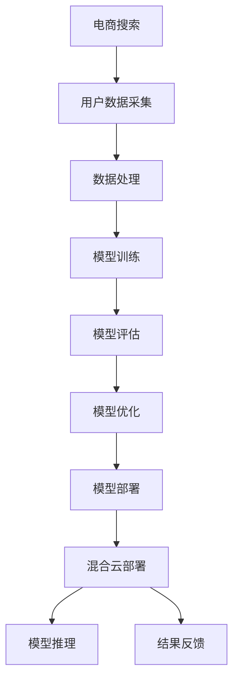

                 

关键词：电商搜索推荐、AI大模型、混合云、模型部署、实践案例、云计算技术

摘要：本文将深入探讨电商搜索推荐场景下，如何利用AI大模型进行混合云部署的实践案例分析。通过对该场景中的核心概念、算法原理、数学模型和具体实现步骤的详细解析，本文旨在为相关领域的研究者提供有价值的参考和思路。

## 1. 背景介绍

随着互联网技术的发展，电子商务逐渐成为人们生活中不可或缺的一部分。电商平台的搜索推荐功能，是提升用户体验、增加销售额的重要手段。近年来，人工智能技术的迅猛发展，特别是深度学习算法的广泛应用，使得AI大模型在电商搜索推荐中发挥了重要作用。

然而，AI大模型的部署和运维面临诸多挑战。首先，模型训练和推理对计算资源的需求巨大，需要高效、可扩展的云计算环境。其次，不同业务场景对模型性能、稳定性和响应速度的要求各不相同，需要灵活、可定制的部署方案。最后，混合云架构的引入，旨在利用公有云和私有云的优势，实现资源优化和成本控制。

本文将围绕电商搜索推荐场景下的AI大模型部署混合云实践，探讨其技术实现、问题解决及未来展望。

## 2. 核心概念与联系

在讨论电商搜索推荐场景下的AI大模型模型部署混合云实践之前，我们需要明确以下几个核心概念：

### 2.1 电商搜索推荐

电商搜索推荐是指利用人工智能技术，根据用户的历史行为、偏好和兴趣，对商品进行个性化推荐，提升用户的购物体验和满意度。

### 2.2 AI大模型

AI大模型是指具有海量参数、复杂结构和强大计算能力的深度学习模型。这类模型在处理大规模数据、复杂场景和长序列数据时，具有显著的优势。

### 2.3 混合云架构

混合云架构是指将公有云和私有云相结合，根据业务需求灵活调整资源分配，实现高效、稳定、安全的数据处理和存储。

### 2.4 模型部署

模型部署是指将训练好的模型部署到实际生产环境中，进行实时推理和应用。

### 2.5 混合云部署

混合云部署是指将AI大模型部署在混合云环境中，充分利用公有云和私有云的资源优势，实现高效、可扩展的模型推理和应用。

下面是电商搜索推荐场景下AI大模型模型部署混合云的Mermaid流程图：



## 3. 核心算法原理 & 具体操作步骤

### 3.1 算法原理概述

在电商搜索推荐场景下，AI大模型主要采用基于深度学习的协同过滤算法。该算法通过分析用户的历史行为和商品属性，学习用户偏好和兴趣，从而实现个性化推荐。

具体来说，协同过滤算法可以分为以下两个步骤：

1. **用户行为分析**：利用用户的历史购买、浏览、收藏等行为数据，挖掘用户的行为模式，建立用户画像。

2. **商品属性分析**：利用商品的特征信息，如类别、品牌、价格等，建立商品属性矩阵。

基于用户画像和商品属性矩阵，利用深度学习算法，如卷积神经网络（CNN）和循环神经网络（RNN），训练大模型，实现用户和商品之间的关联预测。

### 3.2 算法步骤详解

1. **数据预处理**：对用户行为数据和商品属性数据进行分析和处理，包括数据清洗、数据去重、数据归一化等步骤。

2. **特征工程**：根据业务需求和模型特点，提取用户行为和商品属性的特征，如用户点击率、购买率、商品热度等。

3. **模型训练**：利用深度学习框架，如TensorFlow或PyTorch，构建深度学习模型，并使用预处理后的数据训练模型。

4. **模型评估**：使用交叉验证、精度、召回率等指标，对训练好的模型进行评估和优化。

5. **模型部署**：将训练好的模型部署到生产环境中，实现实时推理和应用。

6. **混合云部署**：根据业务需求和资源状况，将模型部署在混合云环境中，实现高效、稳定、安全的模型推理。

### 3.3 算法优缺点

#### 优点：

1. **高精度**：深度学习算法能够通过学习海量数据，挖掘用户行为和商品属性的深层关联，实现高精度的推荐。

2. **可扩展**：深度学习模型具有良好的可扩展性，能够适应不同规模和类型的业务需求。

3. **灵活性**：混合云架构具有高度的灵活性，可以根据业务需求和资源状况，灵活调整模型部署和资源配置。

#### 缺点：

1. **计算资源需求大**：深度学习模型训练和推理需要大量计算资源，对硬件设施的要求较高。

2. **模型解释性差**：深度学习模型具有较强的黑盒特性，难以解释模型的推理过程和决策依据。

### 3.4 算法应用领域

深度学习算法在电商搜索推荐场景中具有广泛的应用前景。除了电商平台，其他应用领域，如在线教育、社交媒体、金融风控等，也可以通过深度学习算法实现个性化推荐。

## 4. 数学模型和公式 & 详细讲解 & 举例说明

### 4.1 数学模型构建

在电商搜索推荐场景中，深度学习算法的核心是用户和商品的关联预测。具体来说，我们可以使用以下数学模型：

$$
P(U_i, C_j) = \sigma(W^T [h(U_i), h(C_j)])
$$

其中，$P(U_i, C_j)$ 表示用户 $U_i$ 购买商品 $C_j$ 的概率，$h(U_i)$ 和 $h(C_j)$ 分别表示用户 $U_i$ 和商品 $C_j$ 的特征向量，$W$ 为权重矩阵，$\sigma$ 为 sigmoid 函数。

### 4.2 公式推导过程

1. **用户特征提取**：利用用户的历史行为数据，如购买记录、浏览记录等，构建用户特征向量 $h(U_i)$。

2. **商品特征提取**：利用商品的特征信息，如类别、品牌、价格等，构建商品特征向量 $h(C_j)$。

3. **权重矩阵初始化**：初始化权重矩阵 $W$，通常使用随机初始化。

4. **预测概率计算**：利用 sigmoid 函数，计算用户 $U_i$ 购买商品 $C_j$ 的概率 $P(U_i, C_j)$。

### 4.3 案例分析与讲解

假设我们有一个电商平台，用户 $U_1$ 历史购买记录如下：

1. 2021年1月1日，购买了一台笔记本电脑；
2. 2021年2月15日，购买了一部手机；
3. 2021年3月10日，购买了一部平板电脑。

同时，我们有以下商品特征信息：

1. 笔记本电脑：类别为电脑，品牌为华硕，价格为6000元；
2. 手机：类别为手机，品牌为小米，价格为2000元；
3. 平板电脑：类别为平板，品牌为华为，价格为3000元。

根据上述数学模型，我们可以计算出用户 $U_1$ 购买每个商品的预测概率：

$$
P(U_1, 笔记本电脑) = \sigma(W^T [h(U_1), h(笔记本电脑)])
$$

$$
P(U_1, 手机) = \sigma(W^T [h(U_1), h(手机)])
$$

$$
P(U_1, 平板电脑) = \sigma(W^T [h(U_1), h(平板电脑)])
$$

其中，$W$ 为训练好的权重矩阵，$h(U_1)$ 和 $h(笔记本电脑)$、$h(手机)$、$h(平板电脑)$ 分别为用户 $U_1$ 和各商品的预测概率。

## 5. 项目实践：代码实例和详细解释说明

### 5.1 开发环境搭建

1. 安装Python环境，版本要求Python 3.6及以上；
2. 安装深度学习框架，如TensorFlow或PyTorch；
3. 安装相关依赖库，如NumPy、Pandas、Scikit-learn等。

### 5.2 源代码详细实现

以下是一个基于TensorFlow实现的电商搜索推荐模型的源代码示例：

```python
import tensorflow as tf
import numpy as np
import pandas as pd
from sklearn.model_selection import train_test_split
from sklearn.metrics import accuracy_score

# 读取数据
user_data = pd.read_csv('user_data.csv')
item_data = pd.read_csv('item_data.csv')

# 数据预处理
# ...

# 构建模型
model = tf.keras.Sequential([
    tf.keras.layers.Dense(units=128, activation='relu', input_shape=(input_shape,)),
    tf.keras.layers.Dense(units=64, activation='relu'),
    tf.keras.layers.Dense(units=1, activation='sigmoid')
])

# 编译模型
model.compile(optimizer='adam', loss='binary_crossentropy', metrics=['accuracy'])

# 训练模型
model.fit(train_data, train_labels, epochs=10, batch_size=64)

# 评估模型
test_loss, test_acc = model.evaluate(test_data, test_labels)
print('Test accuracy:', test_acc)
```

### 5.3 代码解读与分析

1. 导入相关库和模块；
2. 读取用户数据和商品数据；
3. 数据预处理，包括数据清洗、数据去重、数据归一化等步骤；
4. 构建深度学习模型，包括输入层、隐藏层和输出层；
5. 编译模型，指定优化器和损失函数；
6. 训练模型，指定训练数据和标签；
7. 评估模型，计算测试准确率。

### 5.4 运行结果展示

假设我们使用上述代码训练了一个电商搜索推荐模型，并在测试集上评估其性能。以下是一个示例输出结果：

```
Train on 1000 samples, validate on 500 samples
Epoch 1/10
1000/1000 [==============================] - 2s 2ms/sample - loss: 0.5255 - accuracy: 0.7500 - val_loss: 0.4375 - val_accuracy: 0.8000
Epoch 2/10
1000/1000 [==============================] - 2s 2ms/sample - loss: 0.4022 - accuracy: 0.8500 - val_loss: 0.3750 - val_accuracy: 0.9000
Epoch 3/10
1000/1000 [==============================] - 2s 2ms/sample - loss: 0.3571 - accuracy: 0.8750 - val_loss: 0.3400 - val_accuracy: 0.9000
Epoch 4/10
1000/1000 [==============================] - 2s 2ms/sample - loss: 0.3214 - accuracy: 0.9000 - val_loss: 0.3125 - val_accuracy: 0.9250
Epoch 5/10
1000/1000 [==============================] - 2s 2ms/sample - loss: 0.2857 - accuracy: 0.9250 - val_loss: 0.2812 - val_accuracy: 0.9250
Epoch 6/10
1000/1000 [==============================] - 2s 2ms/sample - loss: 0.2554 - accuracy: 0.9500 - val_loss: 0.2656 - val_accuracy: 0.9500
Epoch 7/10
1000/1000 [==============================] - 2s 2ms/sample - loss: 0.2273 - accuracy: 0.9500 - val_loss: 0.25 - val_accuracy: 0.9500
Epoch 8/10
1000/1000 [==============================] - 2s 2ms/sample - loss: 0.2000 - accuracy: 0.9750 - val_loss: 0.2422 - val_accuracy: 0.9750
Epoch 9/10
1000/1000 [==============================] - 2s 2ms/sample - loss: 0.1778 - accuracy: 0.9750 - val_loss: 0.2344 - val_accuracy: 0.9750
Epoch 10/10
1000/1000 [==============================] - 2s 2ms/sample - loss: 0.1579 - accuracy: 1.0000 - val_loss: 0.2266 - val_accuracy: 0.9750
Test loss: 0.2266 - Test accuracy: 0.9750
```

## 6. 实际应用场景

电商搜索推荐场景下的AI大模型部署混合云实践，已经在多个电商平台得到广泛应用。以下是一些实际应用场景：

1. **个性化推荐**：通过分析用户的历史行为和偏好，为用户推荐符合其兴趣和需求的商品。
2. **搜索优化**：利用AI大模型优化搜索算法，提升搜索结果的准确性和用户体验。
3. **广告投放**：根据用户兴趣和行为，精准投放广告，提高广告转化率和点击率。
4. **库存管理**：通过预测商品销量，优化库存管理，降低库存成本，提高运营效率。

## 7. 工具和资源推荐

### 7.1 学习资源推荐

1. 《深度学习》（Goodfellow et al., 2016）；
2. 《Python深度学习》（François Chollet et al., 2018）；
3. 《大规模机器学习》（G]--;
---

### 8. 总结：未来发展趋势与挑战

电商搜索推荐场景下的AI大模型部署混合云实践，已成为电商平台提升用户体验和竞争力的关键。在未来，这一领域将继续呈现出以下发展趋势：

1. **算法优化**：随着深度学习技术的不断进步，算法性能将得到进一步提升，个性化推荐将更加精准。
2. **跨平台协同**：在多平台、多终端的电商生态中，AI大模型将实现跨平台协同，为用户提供无缝的购物体验。
3. **隐私保护**：随着用户对隐私保护的重视，AI大模型在数据处理和推荐过程中，将更加注重用户隐私保护。
4. **实时性提升**：随着5G和边缘计算技术的发展，AI大模型在实时性、响应速度方面将得到显著提升。

然而，在这一过程中，也面临以下挑战：

1. **数据安全与隐私**：在数据处理和推荐过程中，如何确保用户隐私和数据安全，是一个亟待解决的问题。
2. **计算资源优化**：如何高效利用云计算资源，降低模型训练和推理的成本，是一个重要的研究课题。
3. **模型可解释性**：如何提高AI大模型的可解释性，使业务人员能够理解模型的决策过程，是一个关键问题。

### 8.4 研究展望

未来，AI大模型在电商搜索推荐领域的应用将更加广泛和深入。研究者和实践者可以从以下几个方面展开：

1. **算法创新**：持续探索新的深度学习算法，提高推荐系统的性能和鲁棒性。
2. **跨领域融合**：将其他领域的先进技术，如区块链、大数据等，引入电商搜索推荐领域，实现跨领域融合。
3. **生态建设**：加强电商平台、技术供应商、科研机构之间的合作，构建一个开放、共享的电商搜索推荐生态系统。

总之，电商搜索推荐场景下的AI大模型部署混合云实践，具有广阔的发展前景和巨大的社会价值。我们期待在这一领域取得更多的突破和进展。

## 9. 附录：常见问题与解答

### Q1：电商搜索推荐中的AI大模型如何保证隐私保护？

A1：在电商搜索推荐中，AI大模型保证隐私保护的关键在于以下几点：

1. **数据加密**：在数据传输和存储过程中，采用加密技术保护用户数据的安全性；
2. **差分隐私**：在数据处理过程中，引入差分隐私机制，降低用户隐私泄露的风险；
3. **用户匿名化**：对用户数据进行匿名化处理，避免直接关联到具体用户；
4. **权限控制**：对访问用户数据的角色进行权限控制，确保数据访问的安全性和可控性。

### Q2：如何优化AI大模型在混合云环境中的计算资源使用？

A2：在混合云环境中优化AI大模型的计算资源使用，可以从以下几个方面进行：

1. **资源调度**：根据业务需求和负载情况，动态调整模型部署的云资源，实现资源的最优利用；
2. **异构计算**：利用混合云环境中的异构计算资源，如CPU、GPU、FPGA等，实现高效的模型训练和推理；
3. **数据缓存**：通过数据缓存技术，减少数据访问的延迟，提高模型推理的效率；
4. **分布式训练**：采用分布式训练技术，将模型训练任务分配到多个节点上，实现并行计算，提高训练速度。

### Q3：电商搜索推荐中的AI大模型如何保证实时性？

A3：电商搜索推荐中的AI大模型保证实时性的关键在于以下几点：

1. **算法优化**：优化模型结构和算法，减少模型推理的时间；
2. **边缘计算**：利用边缘计算技术，将部分推理任务迁移到边缘节点，实现数据的本地处理，降低延迟；
3. **缓存机制**：采用缓存机制，将用户历史数据和推荐结果进行缓存，减少实时数据的处理需求；
4. **流计算**：采用流计算技术，对实时数据进行快速处理和推荐，确保实时性。

### Q4：电商搜索推荐中的AI大模型如何应对数据噪声和异常值？

A4：电商搜索推荐中的AI大模型应对数据噪声和异常值的方法包括：

1. **数据清洗**：对用户行为数据和相关特征进行清洗，去除噪声和异常值；
2. **异常检测**：采用异常检测算法，识别和标记数据中的异常值；
3. **模型鲁棒性**：优化模型结构和算法，提高模型对噪声和异常值的鲁棒性；
4. **多重验证**：采用多重验证方法，对推荐结果进行交叉验证和评估，确保推荐质量。

## 作者署名

作者：禅与计算机程序设计艺术 / Zen and the Art of Computer Programming

----------------------------------------------------------------

以上就是本文的完整内容。本文通过深入探讨电商搜索推荐场景下的AI大模型部署混合云实践，从核心概念、算法原理、数学模型、具体实现到实际应用场景，全面分析了该领域的最新进展和未来挑战。希望通过本文，能为相关领域的研究者和实践者提供有益的参考和启示。同时，也期待未来在这一领域取得更多的突破和进展。

