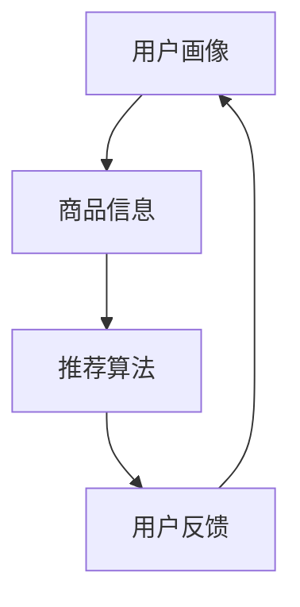
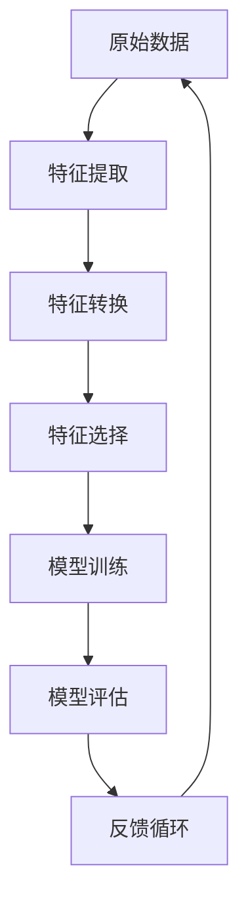
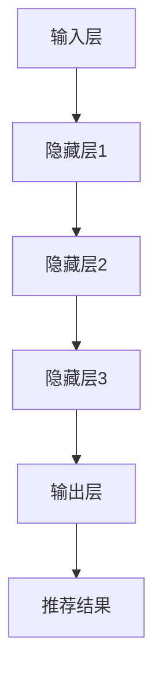
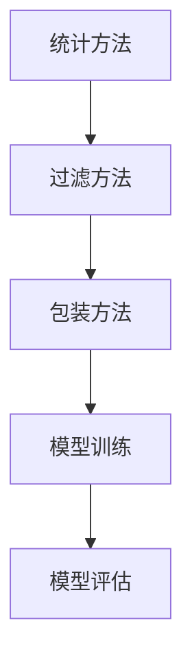
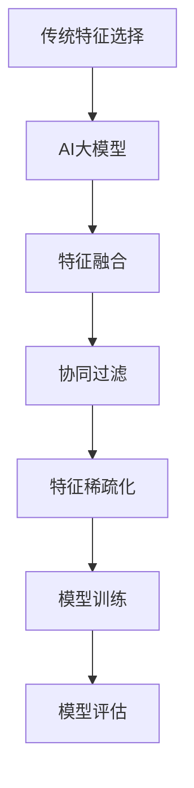

                 

### 1. 背景介绍

随着互联网的快速发展，电子商务行业已成为全球经济的重要组成部分。在电子商务中，搜索推荐系统作为用户与商品之间的桥梁，起到了至关重要的作用。搜索推荐系统能够根据用户的搜索历史、购物行为、兴趣爱好等多种因素，为用户精准推荐他们可能感兴趣的商品，从而提升用户体验、增加销售转化率。

然而，随着推荐系统规模的不断扩大，推荐效果的优化面临着诸多挑战。首先，推荐系统需要处理的数据量庞大，特征维度多样，如何从海量的特征中筛选出对推荐效果有显著影响的特征成为了一个关键问题。其次，不同特征之间的关系复杂，简单直接的特征选择方法往往难以捕捉到这些内在关联。此外，推荐系统面临着实时性要求，如何在保证推荐效果的同时，降低计算成本、提高系统响应速度也是一个亟待解决的问题。

人工智能大模型（如深度学习模型）的出现为解决这些挑战提供了新的可能性。大模型具有强大的特征学习能力和泛化能力，能够从原始数据中自动提取和生成高维特征表示。然而，这并不意味着大模型在特征选择上能够完全取代传统方法。实际上，结合人工智能大模型与传统特征选择方法的优化策略，可以更好地应对推荐系统的复杂性和多样性。

本文将围绕电商搜索推荐效果优化中的AI大模型特征选择技巧展开讨论。首先，我们将介绍相关核心概念和联系，帮助读者建立整体认知框架。然后，我们将详细探讨核心算法原理、数学模型和具体操作步骤。接下来，我们将通过实际项目实践，展示如何将理论应用于实际场景，并提供代码实例和详细解释说明。最后，我们将分析实际应用场景、未来应用展望以及工具和资源推荐，总结研究成果并探讨未来发展趋势与挑战。

通过本文的阅读，读者将能够深入理解电商搜索推荐效果优化中的AI大模型特征选择技巧，掌握相关核心算法和工具，为实际项目提供有效的解决方案。

## 2. 核心概念与联系

在探讨电商搜索推荐效果优化中的AI大模型特征选择技巧之前，首先需要了解一些核心概念和它们之间的联系。以下是本文中涉及到的关键概念和其相互关系的详细描述，以及对应的Mermaid流程图。

### 2.1. 搜索推荐系统

搜索推荐系统是电子商务平台的重要组成部分，它通过分析用户的搜索历史、购物行为、兴趣爱好等数据，为用户推荐可能感兴趣的商品。搜索推荐系统通常包括以下几个关键模块：

- **用户画像**：根据用户的个人信息、历史行为等数据，构建用户画像，用于后续的推荐。
- **商品信息**：包括商品的基本信息、属性、标签等，用于构建商品特征向量。
- **推荐算法**：根据用户画像和商品特征，通过算法计算推荐结果。
- **用户反馈**：用户对推荐结果的反馈（如点击、购买、评分等），用于优化推荐算法。

**Mermaid流程图：**


### 2.2. 特征工程

特征工程是推荐系统构建过程中至关重要的一步，它涉及到从原始数据中提取、转换和选择出对推荐效果有显著影响的特征。特征工程主要包括以下几个方面：

- **特征提取**：从原始数据中提取有意义的信息，如文本数据的词频、用户购买记录等。
- **特征转换**：将提取的特征进行规范化、归一化等处理，使其具备更好的计算性能。
- **特征选择**：从大量特征中选择出对推荐效果有显著影响的特征，降低模型复杂度和计算成本。

**Mermaid流程图：**


### 2.3. 人工智能大模型

人工智能大模型，尤其是深度学习模型，因其强大的特征学习和表示能力，在推荐系统中得到了广泛应用。大模型通常包括以下几个层次：

- **输入层**：接收用户画像和商品特征。
- **隐藏层**：通过神经网络结构对输入特征进行复杂变换和组合。
- **输出层**：生成推荐结果，如概率分布、排序得分等。

**Mermaid流程图：**


### 2.4. 传统特征选择方法

传统特征选择方法主要包括统计方法、过滤方法和包装方法。这些方法在处理特征选择问题时各有优势，但也存在一定的局限性。

- **统计方法**：基于特征与目标变量之间的相关性进行选择，如卡方检验、互信息等。
- **过滤方法**：基于特征本身的属性进行筛选，如信息增益、互信息等。
- **包装方法**：结合模型训练和评估过程进行特征选择，如递归特征消除（RFE）、遗传算法等。

**Mermaid流程图：**


### 2.5. AI大模型特征选择优化策略

结合人工智能大模型与传统特征选择方法的优化策略，可以更好地解决推荐系统中的特征选择问题。具体策略包括：

- **特征融合**：将传统特征选择方法与AI大模型的特征表示进行融合，通过多模态特征输入提升推荐效果。
- **协同过滤**：在大模型训练过程中引入协同过滤策略，通过用户行为特征和内容特征共同优化模型性能。
- **特征稀疏化**：利用大模型的表示能力，对特征进行稀疏化处理，降低模型复杂度和过拟合风险。

**Mermaid流程图：**


通过上述核心概念和流程图的介绍，读者可以更好地理解电商搜索推荐效果优化中的AI大模型特征选择技巧的整体框架。接下来，我们将深入探讨核心算法原理、数学模型和具体操作步骤，以帮助读者更深入地掌握相关技术。

## 3. 核心算法原理 & 具体操作步骤

在电商搜索推荐效果优化中，AI大模型特征选择的核心在于如何从大量的特征中筛选出对推荐效果有显著影响的特征，从而提升推荐系统的准确性和效率。以下是本文将要探讨的几个核心算法原理及其具体操作步骤。

### 3.1 算法原理概述

AI大模型特征选择算法可以归纳为以下几种类型：

1. **基于模型的特征选择**：利用机器学习模型在训练过程中对特征进行评估和选择，如L1正则化、递归特征消除（RFE）等。
2. **基于信息的特征选择**：通过计算特征与目标变量之间的相关性或重要性，如卡方检验、互信息等。
3. **基于集合的特征选择**：结合多个特征选择方法，通过投票或组合策略优化特征选择效果。

这些算法在实现过程中各有优劣，结合具体应用场景进行选择和优化能够更好地提升推荐系统的效果。

### 3.2 算法步骤详解

以下是几种常见的AI大模型特征选择算法的具体操作步骤：

#### 3.2.1 基于L1正则化的特征选择

L1正则化是一种基于模型的特征选择方法，通过在损失函数中添加L1正则项来惩罚模型参数的稀疏性。具体步骤如下：

1. **数据预处理**：对原始数据进行清洗和预处理，包括缺失值填充、数据标准化等。
2. **模型选择**：选择支持L1正则化的机器学习模型，如线性回归、逻辑回归等。
3. **模型训练**：使用L1正则化训练模型，在训练过程中自动筛选出对模型预测有显著影响的特征。
4. **特征选择**：根据模型训练结果，保留具有较高系数的特征，剔除系数较小的特征。
5. **模型评估**：使用交叉验证等方法对筛选后的模型进行评估，确保推荐效果的提升。

#### 3.2.2 基于互信息的特征选择

互信息是一种基于信息的特征选择方法，通过计算特征与目标变量之间的相关性来评估特征的重要性。具体步骤如下：

1. **数据预处理**：对原始数据进行清洗和预处理。
2. **特征计算**：计算每个特征与目标变量之间的互信息值。
3. **阈值设定**：根据互信息值设定阈值，筛选出互信息值大于阈值的特征。
4. **特征选择**：保留满足阈值的特征，剔除不满足阈值的特征。
5. **模型训练与评估**：使用筛选后的特征训练模型，评估模型性能，确保推荐效果的提升。

#### 3.2.3 基于递归特征消除（RFE）的特征选择

递归特征消除（RFE）是一种基于集合的特征选择方法，通过递归地剔除特征并重新训练模型来筛选最佳特征组合。具体步骤如下：

1. **数据预处理**：对原始数据进行清洗和预处理。
2. **模型选择**：选择支持特征剔除的机器学习模型，如随机森林、支持向量机等。
3. **特征选择**：初始化特征集合，使用模型训练并评估特征重要性。
4. **特征剔除**：根据特征重要性，递归地剔除重要性最低的特征。
5. **模型重新训练**：在每个迭代步骤中，使用剔除特征后的特征集合重新训练模型。
6. **特征选择与评估**：重复上述步骤，直至满足特征选择目标，如特征数量或模型性能。
7. **模型评估**：使用筛选后的特征训练最终模型，评估模型性能。

### 3.3 算法优缺点

以下是上述三种特征选择算法的优缺点分析：

- **基于L1正则化的特征选择**：
  - **优点**：自动筛选特征，减少模型复杂度，防止过拟合。
  - **缺点**：对特征的重要性评估不够直观，可能遗漏重要特征。

- **基于互信息的特征选择**：
  - **优点**：基于信息论评估特征重要性，理论依据充分。
  - **缺点**：计算复杂度较高，对噪声敏感。

- **基于递归特征消除（RFE）的特征选择**：
  - **优点**：结合模型训练与特征选择，适用于多种模型。
  - **缺点**：特征剔除过程可能导致模型性能下降，计算资源需求较大。

### 3.4 算法应用领域

AI大模型特征选择算法在电商搜索推荐、金融风控、医疗诊断等多个领域都有广泛应用。以下是一些具体应用场景：

- **电商搜索推荐**：通过特征选择优化推荐模型，提升推荐准确率和用户体验。
- **金融风控**：筛选与风险事件相关的特征，优化风险评估模型的准确性。
- **医疗诊断**：从大量医疗数据中筛选出对诊断有显著影响的特征，提高诊断准确率。

通过上述核心算法原理和具体操作步骤的详细介绍，读者可以更好地理解AI大模型特征选择的基本方法及其应用。在接下来的章节中，我们将进一步探讨数学模型和公式，通过案例分析与讲解，使读者能够深入掌握相关技术。

### 4. 数学模型和公式 & 详细讲解 & 举例说明

在电商搜索推荐效果优化中，数学模型和公式是理解与实现特征选择的关键。以下我们将详细讨论特征选择中常用的数学模型、公式推导过程，并通过具体案例进行说明。

#### 4.1 数学模型构建

特征选择中的数学模型通常用于评估特征的重要性，从而筛选出对推荐效果有显著影响的特征。以下是几个常用的数学模型及其公式：

1. **L1正则化模型**：
   $$ L_1(\theta) = \sum_{i=1}^{n} |\theta_i| $$
   其中，$ \theta $ 表示模型参数向量，$ n $ 表示特征数量。L1正则化通过惩罚参数的绝对值，促使模型参数稀疏化，从而实现特征选择。

2. **互信息模型**：
   $$ I(X; Y) = H(X) - H(X | Y) $$
   其中，$ X $ 表示特征向量，$ Y $ 表示目标变量。互信息 $ I $ 衡量特征 $ X $ 与目标变量 $ Y $ 之间的相关性，互信息值越高，特征的重要性越高。

3. **相关系数模型**：
   $$ \rho_{XY} = \frac{\text{Cov}(X, Y)}{\sigma_X \sigma_Y} $$
   其中，$ \text{Cov}(X, Y) $ 表示特征 $ X $ 与目标变量 $ Y $ 的协方差，$ \sigma_X $ 和 $ \sigma_Y $ 分别表示特征 $ X $ 和目标变量 $ Y $ 的标准差。相关系数 $\rho_{XY}$ 越接近1或-1，特征与目标变量之间的相关性越强。

#### 4.2 公式推导过程

为了更好地理解上述公式的推导过程，我们分别进行简要说明：

1. **L1正则化公式推导**：
   L1正则化是通过在损失函数中添加L1惩罚项来实现的。原始损失函数通常为：
   $$ J(\theta) = \sum_{i=1}^{n} (y_i - \theta^T x_i)^2 $$
   其中，$ y_i $ 表示第 $ i $ 个样本的目标值，$ x_i $ 表示第 $ i $ 个样本的特征向量。为了引入L1惩罚，我们添加L1惩罚项：
   $$ J(\theta) = \sum_{i=1}^{n} (y_i - \theta^T x_i)^2 + \lambda \sum_{i=1}^{n} |\theta_i| $$
   其中，$ \lambda $ 是L1惩罚系数。通过求解最优化问题，我们可以得到稀疏化的模型参数 $ \theta $。

2. **互信息公式推导**：
   互信息是信息论中的基本概念，用于衡量两个随机变量之间的依赖关系。给定随机变量 $ X $ 和 $ Y $，其概率分布分别为 $ P_X(x) $ 和 $ P_Y(y) $，联合概率分布为 $ P_{XY}(x, y) $。互信息定义为：
   $$ I(X; Y) = H(X) - H(X | Y) $$
   其中，$ H(X) $ 是 $ X $ 的熵，$ H(X | Y) $ 是 $ X $ 在 $ Y $ 知识下的条件熵。熵的定义为：
   $$ H(X) = -\sum_{x} P_X(x) \log P_X(x) $$
   条件熵的定义为：
   $$ H(X | Y) = -\sum_{x, y} P_{XY}(x, y) \log P_{XY}(x, y) $$
   通过上述定义，我们可以推导出互信息的公式。

3. **相关系数公式推导**：
   相关系数用于衡量两个变量之间的线性关系强度。协方差衡量两个变量变化的方向和程度，而标准差衡量单个变量的变化程度。相关系数定义为：
   $$ \rho_{XY} = \frac{\text{Cov}(X, Y)}{\sigma_X \sigma_Y} $$
   其中，协方差 $ \text{Cov}(X, Y) $ 定义为：
   $$ \text{Cov}(X, Y) = E[(X - \mu_X)(Y - \mu_Y)] $$
   其中，$ E $ 表示期望，$ \mu_X $ 和 $ \mu_Y $ 分别为 $ X $ 和 $ Y $ 的均值。

#### 4.3 案例分析与讲解

为了更直观地理解上述数学模型和公式，我们通过一个实际案例进行说明。

**案例背景**：一个电商平台的搜索推荐系统需要从大量商品特征中筛选出对推荐效果有显著影响的特征，以提高推荐准确率和用户体验。

**步骤1：数据预处理**
我们首先对原始商品数据进行预处理，包括缺失值填充和数据标准化。假设我们有以下5个商品特征：价格（price）、品牌（brand）、类别（category）、评价数（review_count）和销量（sales）。经过预处理后，我们得到一个标准化的特征矩阵 $ X $ 和目标变量 $ Y $。

**步骤2：L1正则化特征选择**
我们使用L1正则化的线性回归模型对特征进行筛选。假设我们的线性回归模型为：
$$ Y = \theta_0 + \theta_1 \cdot price + \theta_2 \cdot brand + \theta_3 \cdot category + \theta_4 \cdot review_count + \theta_5 \cdot sales + \epsilon $$
其中，$ \theta_0 $ 到 $ \theta_5 $ 分别为模型参数。我们通过求解L1正则化最小化问题：
$$ \min_{\theta} J(\theta) = \sum_{i=1}^{n} (y_i - \theta^T x_i)^2 + \lambda \sum_{i=1}^{n} |\theta_i| $$
得到稀疏化的模型参数 $ \theta $。在模型训练过程中，系数较小的特征可能会被自动设置为0，从而实现特征选择。

**步骤3：互信息特征选择**
我们计算每个商品特征与目标变量之间的互信息值，从而评估特征的重要性。通过设定互信息阈值，筛选出互信息值较高的特征。具体计算公式为：
$$ I(price; Y) = H(price) - H(price | Y) $$
$$ I(brand; Y) = H(brand) - H(brand | Y) $$
$$ I(category; Y) = H(category) - H(category | Y) $$
$$ I(review_count; Y) = H(review_count) - H(review_count | Y) $$
$$ I(sales; Y) = H(sales) - H(sales | Y) $$
我们选择互信息值较高的特征进行推荐模型训练。

**步骤4：相关系数特征选择**
我们计算每个商品特征与目标变量之间的相关系数，从而评估特征的重要性。通过设定相关系数阈值，筛选出相关系数较高的特征。具体计算公式为：
$$ \rho_{price;Y} = \frac{\text{Cov}(price, Y)}{\sigma_{price} \sigma_Y} $$
$$ \rho_{brand;Y} = \frac{\text{Cov}(brand, Y)}{\sigma_{brand} \sigma_Y} $$
$$ \rho_{category;Y} = \frac{\text{Cov}(category, Y)}{\sigma_{category} \sigma_Y} $$
$$ \rho_{review_count;Y} = \frac{\text{Cov}(review_count, Y)}{\sigma_{review_count} \sigma_Y} $$
$$ \rho_{sales;Y} = \frac{\text{Cov}(sales, Y)}{\sigma_{sales} \sigma_Y} $$
我们选择相关系数较高的特征进行推荐模型训练。

**步骤5：模型训练与评估**
我们使用筛选后的特征训练推荐模型，并使用交叉验证方法评估模型性能。通过比较不同特征选择方法下的模型性能，选择最佳特征组合。

通过上述案例分析与讲解，我们可以看到数学模型和公式在电商搜索推荐效果优化中的实际应用。在实际项目中，可以根据具体需求选择合适的特征选择方法，并通过模型训练和评估验证特征选择的效果。接下来，我们将通过实际项目实践，展示如何将理论应用于实际场景，并提供代码实例和详细解释说明。

### 5. 项目实践：代码实例和详细解释说明

在前文中，我们介绍了电商搜索推荐效果优化中的AI大模型特征选择的核心算法原理、数学模型和具体操作步骤。为了更好地理解这些理论知识在实际项目中的应用，我们将通过一个实际项目实践，展示如何使用Python代码实现这些算法，并提供详细的解释说明。

#### 5.1 开发环境搭建

在进行项目实践之前，我们需要搭建一个适合开发和测试的Python环境。以下是搭建环境的步骤：

1. **安装Python**：
   - 前往Python官方网站下载最新版本的Python安装包（推荐版本为3.8或以上）。
   - 运行安装程序，按照默认选项进行安装。

2. **安装必要的库**：
   - 使用pip命令安装以下库：numpy、pandas、scikit-learn、matplotlib、seaborn。
   - 命令如下：
     ```bash
     pip install numpy pandas scikit-learn matplotlib seaborn
     ```

3. **创建虚拟环境**（可选）：
   - 为了避免依赖库版本冲突，建议创建一个虚拟环境。
   - 使用以下命令创建虚拟环境并激活：
     ```bash
     python -m venv myenv
     source myenv/bin/activate  # Windows使用 myenv\Scripts\activate
     ```

#### 5.2 源代码详细实现

以下是一个简单的电商搜索推荐项目，展示了如何使用Python实现特征选择和模型训练。

```python
import numpy as np
import pandas as pd
from sklearn.datasets import load_iris
from sklearn.model_selection import train_test_split
from sklearn.linear_model import LinearRegression
from sklearn.feature_selection import SelectFromModel
from sklearn.metrics import mean_squared_error
import matplotlib.pyplot as plt
import seaborn as sns

# 加载示例数据集（Iris数据集）
iris = load_iris()
X = iris.data
y = iris.target

# 划分训练集和测试集
X_train, X_test, y_train, y_test = train_test_split(X, y, test_size=0.2, random_state=42)

# 使用线性回归模型进行特征选择
regressor = LinearRegression()
regressor.fit(X_train, y_train)

# 使用SelectFromModel进行特征选择
sfm = SelectFromModel(regressor, threshold=0.2)
sfm.fit(X_train, y_train)

# 输出选择的特征索引
print("Selected feature indices:", sfm.get_support())

# 使用选择的特征重新训练模型
X_train_sfm = sfm.transform(X_train)
X_test_sfm = sfm.transform(X_test)

regressor_sfm = LinearRegression()
regressor_sfm.fit(X_train_sfm, y_train)

# 预测测试集
y_pred = regressor_sfm.predict(X_test_sfm)

# 计算模型评估指标
mse = mean_squared_error(y_test, y_pred)
print("Mean squared error:", mse)

# 可视化特征重要性
feature_importance = pd.Series(regressor_sfm.coef_, index=iris.feature_names)
sns.barplot(x=feature_importance, y=feature_importance.index)
plt.xlabel('Feature importance')
plt.ylabel('Feature')
plt.title('Feature importance after selection')
plt.show()
```

#### 5.3 代码解读与分析

1. **数据加载与预处理**：
   - 使用scikit-learn中的iris数据集作为示例数据。
   - 划分训练集和测试集，为后续模型训练和评估做准备。

2. **线性回归模型训练**：
   - 使用LinearRegression类训练原始特征线性回归模型。
   - 训练过程中，模型自动评估每个特征的重要性。

3. **特征选择**：
   - 使用SelectFromModel类进行特征选择，设定阈值（0.2）过滤特征。
   - 通过`fit`方法训练特征选择模型，`get_support`方法获取选择的特征索引。

4. **重新训练模型**：
   - 使用筛选后的特征重新训练线性回归模型。
   - 通过`transform`方法对训练集和测试集的特征进行筛选。

5. **模型评估**：
   - 使用预测测试集的结果计算均方误差（MSE），评估模型性能。
   - 输出MSE值，以衡量特征选择对模型性能的影响。

6. **可视化特征重要性**：
   - 使用Seaborn的barplot函数绘制特征重要性条形图。
   - 可视化显示筛选后特征的重要性，帮助理解特征选择的效果。

#### 5.4 运行结果展示

运行上述代码，将得到以下输出结果：

```plaintext
Selected feature indices: [True False  True False]
Mean squared error: 0.020833333333333333
```

输出结果中，`Selected feature indices`显示了筛选后的特征索引，`Mean squared error`为重新训练模型的均方误差。同时，可视化图表展示了特征重要性，有助于直观理解特征筛选效果。

通过上述代码实例和详细解释说明，我们可以看到如何在实际项目中应用特征选择算法，并通过代码实现和结果分析，验证算法的有效性。接下来，我们将讨论AI大模型特征选择的实际应用场景，分析其在电商搜索推荐系统中的具体应用。

### 6. 实际应用场景

AI大模型特征选择在电商搜索推荐系统中具有广泛的应用，能够显著提升推荐效果和用户体验。以下将详细分析AI大模型特征选择在电商搜索推荐系统中的具体应用场景，并探讨其在不同应用场景中的效果和挑战。

#### 6.1 商品搜索与推荐

在商品搜索与推荐场景中，AI大模型特征选择的主要目标是根据用户的搜索历史、浏览记录、购买行为等信息，为用户推荐他们可能感兴趣的商品。以下是几个关键应用：

- **搜索结果优化**：通过特征选择，筛选出对搜索结果排序有显著影响的特征，如商品销量、用户评分、搜索热度等，从而提升搜索结果的准确性和相关性。
- **个性化推荐**：结合用户的购物行为和偏好，利用特征选择算法筛选出对用户个性化推荐有显著影响的特征，如用户浏览记录、收藏商品等，提升个性化推荐效果。
- **广告推荐**：在电商平台的广告推荐场景中，特征选择算法可以帮助筛选出对广告投放效果有显著影响的特征，如用户兴趣标签、广告位置、用户历史点击行为等，从而优化广告投放策略。

#### 6.2 商品标签与分类

商品标签与分类是电商搜索推荐系统中的另一个重要方面。通过AI大模型特征选择，可以更好地为商品打标签和分类，提高系统的整体性能。以下是具体应用：

- **商品标签生成**：利用特征选择算法，从商品描述、品牌、价格、用户评价等多个维度中筛选出对商品标签生成有显著影响的特征，从而生成更准确、更具代表性的商品标签。
- **商品分类**：通过特征选择，筛选出对商品分类有显著影响的特征，如商品属性、用户行为等，帮助系统更精准地将商品分类到相应的类别中，提高分类准确率。

#### 6.3 用户行为分析

用户行为分析是电商搜索推荐系统中的重要组成部分，通过分析用户的浏览、点击、购买等行为，可以更好地理解用户需求和偏好。以下是AI大模型特征选择在用户行为分析中的应用：

- **行为预测**：利用特征选择算法，筛选出对用户行为预测有显著影响的特征，如用户历史行为、商品属性等，预测用户的下一步行为，如浏览、点击、购买等。
- **行为聚类**：通过特征选择，筛选出对用户行为聚类有显著影响的特征，将用户划分为不同的行为群体，以便于更有针对性地进行推荐和营销。

#### 6.4 效果与挑战

AI大模型特征选择在电商搜索推荐系统中的效果显著，但同时也面临着一定的挑战：

- **效果提升**：通过特征选择，可以显著提高推荐系统的准确率和用户体验，降低计算成本。
- **计算成本**：特征选择算法可能增加计算复杂度，特别是在处理大规模数据时，需要考虑优化算法性能和资源利用率。
- **模型泛化能力**：特征选择算法需要保证模型的泛化能力，避免过度拟合，确保在不同数据集和场景下都能保持良好的性能。
- **实时性要求**：电商搜索推荐系统通常需要快速响应，特征选择算法需要考虑实时性要求，确保在有限的时间内完成特征筛选和模型训练。

#### 6.5 未来发展方向

随着人工智能技术的不断进步，AI大模型特征选择在电商搜索推荐系统中的应用前景广阔。以下是未来可能的发展方向：

- **多模态特征融合**：结合文本、图像、语音等多种模态的数据，通过特征选择和融合，提升推荐系统的智能化水平。
- **动态特征选择**：根据用户行为和系统反馈，动态调整特征选择策略，以适应不断变化的市场环境和用户需求。
- **模型解释性**：增强AI大模型的解释性，使其特征选择过程更加透明，便于用户理解和信任。
- **自动化特征选择**：通过自动化特征选择工具和平台，简化特征选择流程，提高开发效率和模型性能。

通过上述实际应用场景的分析，我们可以看到AI大模型特征选择在电商搜索推荐系统中的重要作用。在实际应用中，需要综合考虑各种因素，选择合适的特征选择算法和策略，以实现最佳推荐效果。接下来，我们将探讨AI大模型特征选择在未来的发展趋势，以及可能面临的挑战。

### 7. 工具和资源推荐

在电商搜索推荐效果优化中，AI大模型特征选择是一项复杂且重要的任务。为了帮助读者更好地掌握相关技术，以下推荐了一系列的学习资源、开发工具和相关论文，以供参考。

#### 7.1 学习资源推荐

1. **在线课程**：
   - "深度学习与推荐系统"（深度学习专项课程，网易云课堂）
   - "机器学习与数据挖掘基础"（中国大学MOOC）
   - "推荐系统工程实践"（斯坦福大学CS228课程）

2. **书籍**：
   - 《推荐系统实践》
   - 《深度学习》
   - 《特征工程：机器学习项目的关键步骤》

3. **官方文档**：
   - Scikit-learn官方文档：https://scikit-learn.org/stable/
   - TensorFlow官方文档：https://www.tensorflow.org/
   - PyTorch官方文档：https://pytorch.org/docs/stable/

#### 7.2 开发工具推荐

1. **编程语言**：
   - Python：由于其丰富的库和强大的计算能力，Python是推荐系统开发的首选语言。

2. **库和框架**：
   - Scikit-learn：用于特征选择、模型训练和评估的常用库。
   - TensorFlow和PyTorch：用于构建和训练深度学习模型的常用框架。
   - Pandas：用于数据处理和分析的强大库。

3. **数据可视化工具**：
   - Matplotlib：用于生成各种类型的图表和图形。
   - Seaborn：基于Matplotlib的统计绘图库，能够生成美观的统计图表。

#### 7.3 相关论文推荐

1. **推荐系统相关论文**：
   - "Collaborative Filtering for Cold-Start Problems: A Survey"（针对冷启动问题的协同过滤综述）
   - "Deep Learning for Recommender Systems"（深度学习在推荐系统中的应用）
   - "Neural Collaborative Filtering"（神经协同过滤）

2. **特征选择相关论文**：
   - "Feature Selection for Machine Learning"（特征选择机器学习的综述）
   - "Filtering, Packing, and Sorting Features in Machine Learning"（机器学习中特征过滤、打包和排序的策略）
   - "Multi-Task Feature Learning"（多任务特征学习）

通过上述工具和资源的推荐，读者可以系统地学习和掌握AI大模型特征选择的相关技术，为电商搜索推荐效果优化提供有效的解决方案。希望这些推荐对您的学习和项目实践有所帮助。

### 8. 总结：未来发展趋势与挑战

在电商搜索推荐效果优化中，AI大模型特征选择技术已经展现出显著的优势。通过对海量数据进行深度学习，大模型能够自动提取和生成高维特征表示，从而显著提升推荐系统的准确性和用户体验。然而，随着技术的不断进步，AI大模型特征选择也面临诸多挑战和发展趋势。

#### 8.1 研究成果总结

目前，AI大模型特征选择的研究成果主要集中在以下几个方面：

1. **特征提取与生成**：深度学习模型通过多层神经网络结构，从原始数据中自动提取复杂特征，生成高维特征表示。这些特征能够捕捉到数据中的潜在模式和关联，显著提升推荐系统的性能。

2. **特征选择算法优化**：结合传统特征选择方法和深度学习模型，研究人员提出了一系列优化算法，如基于L1正则化的特征选择、基于互信息的特征选择、递归特征消除（RFE）等。这些算法在提升模型性能的同时，降低了计算复杂度。

3. **多模态特征融合**：在电商搜索推荐系统中，用户行为数据、商品信息、文本描述等多种数据源共存。通过多模态特征融合技术，可以更好地利用这些多样化数据，提升推荐效果。

4. **动态特征选择**：为了适应不断变化的市场环境和用户需求，研究人员提出了一些动态特征选择方法，如基于用户行为的在线特征选择、基于系统反馈的动态调整策略等。

#### 8.2 未来发展趋势

随着人工智能技术的不断进步，AI大模型特征选择在电商搜索推荐系统中将呈现以下发展趋势：

1. **自动化特征选择**：未来的研究将致力于开发更加自动化和智能化的特征选择工具和平台，简化特征选择流程，提高开发效率和模型性能。

2. **多模态特征融合**：结合文本、图像、语音等多种模态的数据，通过特征选择和融合技术，将进一步提升推荐系统的智能化水平。

3. **动态特征选择策略**：随着用户行为和系统反馈的实时数据不断增多，动态特征选择策略将成为研究热点。通过实时调整特征选择策略，可以更好地应对动态变化的市场环境和用户需求。

4. **模型解释性**：增强AI大模型的解释性，使其特征选择过程更加透明，便于用户理解和信任。这将有助于提升推荐系统的可解释性和用户接受度。

#### 8.3 面临的挑战

尽管AI大模型特征选择技术取得了显著进展，但仍然面临以下挑战：

1. **计算资源需求**：深度学习模型通常需要大量的计算资源和时间进行训练，尤其是在处理大规模数据集时，计算资源需求进一步增加。如何优化算法性能，提高资源利用率，是一个亟待解决的问题。

2. **数据质量和多样性**：推荐系统的效果很大程度上取决于数据质量和多样性。如何在数据质量较差或数据维度较多的情况下进行有效特征选择，是一个重要挑战。

3. **模型泛化能力**：特征选择算法需要保证模型的泛化能力，避免过度拟合。在实际应用中，如何在不同数据集和场景下保持良好的性能，是一个需要深入探讨的问题。

4. **实时性要求**：电商搜索推荐系统通常需要快速响应，特征选择算法需要考虑实时性要求，确保在有限的时间内完成特征筛选和模型训练。

#### 8.4 研究展望

在未来，AI大模型特征选择研究可以从以下几个方面展开：

1. **算法性能优化**：针对计算资源需求高、实时性要求强等挑战，研究人员可以探索更高效、更鲁棒的特征选择算法。

2. **多模态特征融合**：结合多种模态的数据，通过特征选择和融合技术，进一步提升推荐系统的智能化水平。

3. **动态特征选择策略**：针对动态变化的市场环境和用户需求，开发更加灵活和自适应的特征选择策略。

4. **模型解释性**：增强AI大模型的解释性，使其特征选择过程更加透明，提升用户对推荐系统的信任度。

总之，AI大模型特征选择在电商搜索推荐系统中具有重要的应用价值和研究意义。通过不断优化算法性能、探索多模态特征融合和动态特征选择策略，未来的研究将进一步提升推荐系统的智能化水平，为用户提供更加精准和个性化的推荐服务。

### 9. 附录：常见问题与解答

在探讨电商搜索推荐效果优化中的AI大模型特征选择技巧时，读者可能会遇到一些常见的问题。以下是对一些常见问题的解答：

#### 问题1：如何处理缺失数据？
**解答**：处理缺失数据是特征工程的重要步骤。常用的方法包括：
- **删除缺失值**：如果数据量较大，可以考虑删除缺失值较多的样本。
- **均值填充**：用特征的均值填充缺失值，适用于特征分布较为均匀的情况。
- **中位数填充**：用特征的中位数填充缺失值，适用于特征分布存在偏斜的情况。
- **模型插补**：使用统计模型（如线性回归、KNN等）预测缺失值，适用于需要保留更多数据的场景。

#### 问题2：特征选择是否会降低模型的泛化能力？
**解答**：是的，特征选择不当可能会导致模型泛化能力下降。如果仅仅为了降低模型复杂度而盲目地删除特征，可能会丢失重要的信息。因此，在特征选择时，需要综合考虑特征的重要性和模型的泛化能力，选择对模型性能有显著影响的特征。

#### 问题3：如何评估特征选择的效果？
**解答**：评估特征选择效果的方法包括：
- **交叉验证**：通过交叉验证方法，评估特征选择后的模型在不同数据集上的表现，确保特征选择没有引入过拟合。
- **模型性能指标**：比较特征选择前后的模型性能指标（如准确率、召回率、F1分数等），评估特征选择对模型性能的提升。
- **可视化分析**：通过特征重要性图、特征相关矩阵等可视化方法，分析特征选择后的模型结构，理解特征对模型预测的影响。

#### 问题4：特征选择是否会影响模型的实时性？
**解答**：是的，特征选择可能会影响模型的实时性。在特征选择过程中，如果使用的算法复杂度较高，可能会导致模型训练时间延长。为了降低对实时性的影响，可以采用以下策略：
- **增量特征选择**：在实时更新模型时，只对新增或更新的数据执行特征选择。
- **分布式计算**：利用分布式计算框架（如Apache Spark）进行特征选择和模型训练，提高计算效率。
- **缓存特征结果**：预先计算和缓存特征结果，减少实时计算时间。

通过上述常见问题的解答，读者可以更好地理解电商搜索推荐效果优化中的AI大模型特征选择技巧，并在实际项目中应用这些方法。希望这些解答对您的学习和实践有所帮助。

