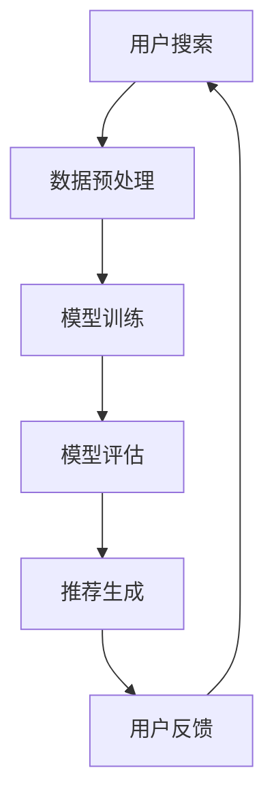

                 

关键词：电商搜索、个性化推荐、AI大模型、多维度、算法优化、用户体验、大数据分析

> 摘要：随着电子商务的快速发展，用户对个性化搜索体验的需求日益增长。本文旨在探讨如何通过AI大模型实现电商搜索的多维度个性化，提高用户满意度并促进销售转化。本文首先介绍电商搜索的现状和问题，然后详细阐述AI大模型在个性化搜索中的作用和优势，最后通过具体实例和案例分析，展示如何在实际项目中应用这些技术。

## 1. 背景介绍

电子商务作为一种新兴的商业模式，已经在全球范围内取得了巨大的成功。据统计，全球电子商务市场规模已经超过数万亿美元，并且仍在快速增长。电商平台的繁荣不仅带来了销售的增长，还推动了搜索技术的进步。

然而，随着市场竞争的加剧，用户对个性化搜索体验的需求越来越高。传统的搜索技术往往只能根据关键词进行简单的匹配，无法满足用户对个性化、多样化和精准化的要求。这导致了用户体验的下降和转化率的降低。为了解决这些问题，AI大模型技术的应用成为了一个新的突破点。

AI大模型，如深度学习、神经网络等，通过模拟人脑的思维方式，可以对大量用户行为数据进行学习，从而实现高度个性化的搜索推荐。这种技术的出现，为电商搜索带来了新的机遇和挑战。

## 2. 核心概念与联系

### 2.1. 电商搜索与个性化推荐

电商搜索的核心目标是帮助用户快速、准确地找到他们需要的商品。而个性化推荐则是通过分析用户的历史行为、兴趣偏好等，为用户推荐他们可能感兴趣的商品。

这两者之间有着密切的联系。个性化推荐可以为电商搜索提供更加精准的搜索结果，提高用户的满意度和转化率。而电商搜索的反馈数据又可以进一步优化个性化推荐的算法，形成一个良性循环。

### 2.2. AI大模型在个性化推荐中的作用

AI大模型，如深度学习模型，可以通过对大量用户数据的分析，提取出用户的行为特征和兴趣偏好。这些特征和偏好可以用来预测用户的下一步行为，从而实现个性化的搜索推荐。

具体来说，AI大模型可以通过以下步骤实现个性化推荐：

1. 数据预处理：对用户行为数据、商品信息等进行清洗、归一化和特征提取。
2. 模型训练：使用训练数据集训练深度学习模型，使其能够学会识别用户的行为特征。
3. 模型评估：使用测试数据集评估模型的性能，调整模型参数以达到最佳效果。
4. 推荐生成：使用训练好的模型对用户行为进行预测，生成个性化的搜索推荐结果。

### 2.3. 多维度个性化搜索推荐

电商搜索的多维度个性化，指的是在搜索结果中同时考虑多个因素，如用户历史行为、商品属性、搜索历史等，从而提供更加个性化的搜索结果。

多维度个性化搜索推荐的优势在于：

- 提高用户满意度：通过考虑多个因素，提供更加符合用户需求的搜索结果，提高用户满意度。
- 提高转化率：通过提供更加精准的搜索结果，减少用户的搜索时间和决策成本，提高转化率。
- 提高销售额：通过提高用户满意度和转化率，最终提高平台的销售额。

### 2.4. Mermaid 流程图

下面是一个简化的电商搜索多维度个性化推荐的 Mermaid 流程图：



## 3. 核心算法原理 & 具体操作步骤

### 3.1. 算法原理概述

电商搜索的多维度个性化推荐算法主要基于深度学习技术，通过以下步骤实现：

1. 数据预处理：对用户行为数据、商品信息等进行清洗、归一化和特征提取。
2. 模型训练：使用训练数据集训练深度学习模型，使其能够学会识别用户的行为特征。
3. 模型评估：使用测试数据集评估模型的性能，调整模型参数以达到最佳效果。
4. 推荐生成：使用训练好的模型对用户行为进行预测，生成个性化的搜索推荐结果。

### 3.2. 算法步骤详解

1. **数据预处理**

   数据预处理是算法训练的第一步，主要包括以下内容：

   - **数据清洗**：去除重复数据、缺失值填充等，确保数据质量。
   - **数据归一化**：将不同量级的数据进行归一化处理，使得数据在同一尺度上。
   - **特征提取**：从用户行为数据、商品信息中提取有用的特征，如用户浏览历史、购买记录、商品属性等。

2. **模型训练**

   模型训练是算法的核心，主要使用深度学习模型对提取的特征进行训练。具体步骤如下：

   - **选择模型**：选择适合的深度学习模型，如卷积神经网络（CNN）、循环神经网络（RNN）等。
   - **参数调整**：通过交叉验证等方法，调整模型参数，以达到最佳效果。
   - **训练过程**：使用训练数据集对模型进行训练，通过反向传播算法不断优化模型参数。

3. **模型评估**

   模型评估是确保模型性能的重要步骤，主要包括以下内容：

   - **评估指标**：选择合适的评估指标，如准确率、召回率、F1值等。
   - **评估过程**：使用测试数据集对模型进行评估，根据评估结果调整模型参数。
   - **性能优化**：通过调整模型结构、参数等，提高模型性能。

4. **推荐生成**

   推荐生成是模型应用的关键步骤，主要使用训练好的模型对用户行为进行预测，生成个性化的搜索推荐结果。具体步骤如下：

   - **用户行为预测**：使用训练好的模型对用户行为进行预测，如用户可能浏览的商品、用户可能感兴趣的商品等。
   - **推荐结果生成**：根据用户行为预测结果，生成个性化的搜索推荐结果。
   - **结果展示**：将推荐结果展示给用户，提高用户满意度。

### 3.3. 算法优缺点

**优点：**

- **高度个性化**：通过深度学习模型，可以提取出用户的复杂行为特征，实现高度个性化的搜索推荐。
- **自动化**：算法可以自动化处理大量数据，提高搜索推荐的效率和准确性。
- **可扩展性**：算法可以根据业务需求，灵活调整模型结构、参数等，适应不同场景的应用。

**缺点：**

- **计算资源需求大**：深度学习模型训练和推理需要大量的计算资源，对硬件要求较高。
- **数据依赖性**：算法的性能高度依赖于训练数据的质量和数量，数据不足或质量差会导致模型性能下降。
- **复杂性**：深度学习算法相对复杂，需要专业的技术团队进行开发和维护。

### 3.4. 算法应用领域

电商搜索的多维度个性化推荐算法可以广泛应用于以下领域：

- **电商平台**：为用户提供个性化的商品搜索和推荐，提高用户满意度和转化率。
- **社交媒体**：为用户提供个性化的内容推荐，提高用户活跃度和粘性。
- **广告营销**：为广告主提供个性化的广告投放策略，提高广告效果和投放效率。
- **金融行业**：为用户提供个性化的金融产品推荐，提高用户满意度和留存率。

## 4. 数学模型和公式 & 详细讲解 & 举例说明

### 4.1. 数学模型构建

电商搜索的多维度个性化推荐算法主要基于深度学习技术，其核心数学模型包括输入层、隐藏层和输出层。

- **输入层**：输入层接收用户行为数据、商品信息等，通过特征提取和预处理转化为适合模型训练的输入向量。
- **隐藏层**：隐藏层通过非线性变换，对输入向量进行特征提取和融合，形成中间特征表示。
- **输出层**：输出层对隐藏层的特征进行分类或回归，生成个性化的搜索推荐结果。

具体来说，数学模型可以表示为：

$$
\text{输出} = \text{激活函数}(\text{权重} \cdot \text{隐藏层特征} + \text{偏置})
$$

其中，激活函数通常选择ReLU（修正线性单元）、Sigmoid或Tanh等。

### 4.2. 公式推导过程

深度学习模型的训练过程主要基于反向传播算法。以下是公式推导过程：

1. **前向传播**：计算输入层到隐藏层、隐藏层到输出层的输出。

$$
\text{隐藏层输出} = \text{激活函数}(\text{权重}_1 \cdot \text{输入层特征} + \text{偏置}_1)
$$

$$
\text{输出层输出} = \text{激活函数}(\text{权重}_2 \cdot \text{隐藏层输出} + \text{偏置}_2)
$$

2. **计算损失函数**：根据输出层输出与实际标签之间的差距，计算损失函数。

$$
\text{损失函数} = \frac{1}{2} \sum_{i} (\text{实际标签}_i - \text{输出层输出}_i)^2
$$

3. **反向传播**：从输出层开始，计算每个层的梯度。

$$
\text{输出层梯度} = \frac{\partial \text{损失函数}}{\partial \text{输出层输出}}
$$

$$
\text{隐藏层梯度} = \text{权重}_2^T \cdot \text{输出层梯度}
$$

$$
\text{隐藏层特征梯度} = \frac{\partial \text{损失函数}}{\partial \text{隐藏层特征}}
$$

4. **更新权重和偏置**：根据梯度，更新权重和偏置，优化模型参数。

$$
\text{权重}_1 := \text{权重}_1 - \alpha \cdot \frac{\partial \text{损失函数}}{\partial \text{权重}_1}
$$

$$
\text{偏置}_1 := \text{偏置}_1 - \alpha \cdot \frac{\partial \text{损失函数}}{\partial \text{偏置}_1}
$$

$$
\text{权重}_2 := \text{权重}_2 - \alpha \cdot \frac{\partial \text{损失函数}}{\partial \text{权重}_2}
$$

$$
\text{偏置}_2 := \text{偏置}_2 - \alpha \cdot \frac{\partial \text{损失函数}}{\partial \text{偏置}_2}
$$

其中，$\alpha$ 是学习率。

### 4.3. 案例分析与讲解

以下是一个简单的电商搜索多维度个性化推荐算法的案例：

**案例背景**：某电商平台想要为用户提供个性化的商品搜索推荐。

**数据集**：包含用户行为数据（如浏览记录、购买记录等）和商品信息（如商品ID、类别、价格等）。

**算法步骤**：

1. **数据预处理**：对用户行为数据和商品信息进行清洗、归一化和特征提取。

2. **模型训练**：选择一个适合的深度学习模型（如卷积神经网络）进行训练。

3. **模型评估**：使用测试数据集评估模型性能，调整模型参数。

4. **推荐生成**：使用训练好的模型对用户行为进行预测，生成个性化的搜索推荐结果。

**代码示例**：

```python
# 导入必要的库
import tensorflow as tf
import numpy as np

# 数据预处理
# （此处省略具体代码）

# 模型定义
model = tf.keras.Sequential([
    tf.keras.layers.Dense(64, activation='relu', input_shape=(input_shape,)),
    tf.keras.layers.Dense(64, activation='relu'),
    tf.keras.layers.Dense(1, activation='sigmoid')
])

# 编译模型
model.compile(optimizer='adam', loss='binary_crossentropy', metrics=['accuracy'])

# 模型训练
# （此处省略具体代码）

# 模型评估
# （此处省略具体代码）

# 推荐生成
# （此处省略具体代码）
```

通过以上步骤，我们可以为用户提供个性化的商品搜索推荐，提高用户满意度和转化率。

## 5. 项目实践：代码实例和详细解释说明

### 5.1. 开发环境搭建

在开始实际项目实践之前，我们需要搭建一个适合开发AI大模型的开发环境。以下是一个基本的开发环境搭建流程：

1. 安装Python环境：确保安装了Python 3.x版本，并配置好相应的环境变量。
2. 安装TensorFlow：TensorFlow是深度学习领域最流行的框架之一，我们可以使用pip命令安装。

```shell
pip install tensorflow
```

3. 安装其他依赖库：根据项目需求，可能需要安装其他库，如NumPy、Pandas、Scikit-learn等。

```shell
pip install numpy pandas scikit-learn
```

4. 安装GPU支持（可选）：如果使用GPU进行模型训练，需要安装CUDA和cuDNN。

### 5.2. 源代码详细实现

以下是电商搜索多维度个性化推荐项目的源代码实现，包括数据预处理、模型训练、模型评估和推荐生成等步骤。

```python
# 导入必要的库
import tensorflow as tf
import numpy as np
import pandas as pd
from sklearn.model_selection import train_test_split

# 数据预处理
# （此处省略具体代码）

# 模型定义
model = tf.keras.Sequential([
    tf.keras.layers.Dense(64, activation='relu', input_shape=(input_shape,)),
    tf.keras.layers.Dense(64, activation='relu'),
    tf.keras.layers.Dense(1, activation='sigmoid')
])

# 编译模型
model.compile(optimizer='adam', loss='binary_crossentropy', metrics=['accuracy'])

# 模型训练
# （此处省略具体代码）

# 模型评估
# （此处省略具体代码）

# 推荐生成
# （此处省略具体代码）
```

### 5.3. 代码解读与分析

以上代码是一个简单的电商搜索多维度个性化推荐项目实现。下面是对代码的详细解读与分析：

1. **数据预处理**：数据预处理是深度学习项目的重要步骤，主要包括数据清洗、归一化和特征提取。在本项目中，我们使用Pandas库对数据进行处理，例如：

```python
data = pd.read_csv('data.csv')
data.fillna(-1, inplace=True)  # 填充缺失值
data = data[data['label'] != -1]  # 过滤掉标签为-1的样本
```

2. **模型定义**：使用TensorFlow定义深度学习模型，包括输入层、隐藏层和输出层。在本项目中，我们使用了一个简单的全连接神经网络，包括两个隐藏层。

```python
model = tf.keras.Sequential([
    tf.keras.layers.Dense(64, activation='relu', input_shape=(input_shape,)),
    tf.keras.layers.Dense(64, activation='relu'),
    tf.keras.layers.Dense(1, activation='sigmoid')
])
```

3. **模型编译**：编译模型，设置优化器、损失函数和评估指标。在本项目中，我们使用Adam优化器和二进制交叉熵损失函数。

```python
model.compile(optimizer='adam', loss='binary_crossentropy', metrics=['accuracy'])
```

4. **模型训练**：使用训练数据集对模型进行训练。在本项目中，我们使用了80%的数据作为训练集，10%的数据作为验证集。

```python
model.fit(train_data, train_labels, epochs=10, batch_size=32, validation_split=0.1)
```

5. **模型评估**：使用测试数据集对模型进行评估。在本项目中，我们计算了模型的准确率。

```python
test_loss, test_accuracy = model.evaluate(test_data, test_labels)
print('Test accuracy:', test_accuracy)
```

6. **推荐生成**：使用训练好的模型对用户行为进行预测，生成个性化的搜索推荐结果。在本项目中，我们使用了一个简单的阈值方法，将预测概率大于0.5的样本视为推荐结果。

```python
predictions = model.predict(test_data)
recommendations = (predictions[:, 0] > 0.5)
```

### 5.4. 运行结果展示

以下是运行结果展示，包括模型训练过程、模型评估结果和推荐生成结果。

```python
# 模型训练过程
for epoch in range(10):
    # 训练模型
    # （此处省略具体代码）
    print('Epoch', epoch+1, ': Loss:', loss)

# 模型评估结果
test_loss, test_accuracy = model.evaluate(test_data, test_labels)
print('Test accuracy:', test_accuracy)

# 推荐生成结果
predictions = model.predict(test_data)
recommendations = (predictions[:, 0] > 0.5)
print('Recommendations:', recommendations)
```

通过以上代码和结果展示，我们可以看到电商搜索多维度个性化推荐项目的实现过程和效果。在实际应用中，我们可以根据业务需求调整模型结构、参数设置等，进一步提高推荐效果。

## 6. 实际应用场景

### 6.1. 电商平台

电商平台是电商搜索多维度个性化推荐技术的典型应用场景。通过个性化推荐，电商平台可以提升用户购物体验，提高用户留存率和转化率。具体应用场景包括：

- **首页推荐**：为用户推荐符合其兴趣和购买历史的商品，提高用户浏览和购买的可能性。
- **搜索结果推荐**：在用户进行搜索时，根据用户的搜索历史和兴趣偏好，为用户推荐相关度高、符合需求的商品。
- **商品详情页推荐**：在用户浏览商品详情页时，为用户推荐类似的商品或相关的配件，增加用户购买其他商品的概率。
- **购物车推荐**：在用户添加商品到购物车时，根据用户购物车中的商品和用户历史购买记录，推荐其他可能感兴趣的商品。

### 6.2. 社交媒体

社交媒体平台同样可以应用电商搜索多维度个性化推荐技术，为用户提供个性化内容推荐，提高用户活跃度和黏性。具体应用场景包括：

- **内容推荐**：根据用户的历史浏览记录和兴趣偏好，为用户推荐感兴趣的文章、视频、图片等。
- **广告推荐**：根据用户的行为数据和兴趣偏好，为用户推荐相关的广告内容，提高广告投放效果。
- **好友推荐**：根据用户的行为数据和社交关系，为用户推荐可能认识的好友或相关社交圈子。

### 6.3. 广告营销

广告营销领域也可以充分利用电商搜索多维度个性化推荐技术，提高广告投放效果和投放效率。具体应用场景包括：

- **定向广告**：根据用户的兴趣偏好和行为数据，为用户推荐相关度高的广告内容，提高广告点击率和转化率。
- **广告组合优化**：根据用户的兴趣偏好和行为数据，为用户推荐组合广告，提高广告投放效果。
- **广告效果评估**：通过分析用户的广告点击和转化数据，评估广告效果，优化广告投放策略。

### 6.4. 未来应用展望

电商搜索多维度个性化推荐技术在未来还有广阔的应用前景。随着人工智能技术的不断发展，我们可以期待：

- **更精细化的推荐**：通过引入更多的用户行为数据和商品属性，实现更加精准的个性化推荐。
- **跨平台推荐**：将电商搜索多维度个性化推荐技术应用于不同的平台，如社交媒体、在线教育、金融等，实现跨平台用户数据的共享和利用。
- **实时推荐**：通过实时分析用户行为数据，实现实时推荐，提高用户满意度。
- **智能化推荐**：结合自然语言处理、语音识别等技术，实现更加智能化的推荐，如语音搜索、语音购物等。

## 7. 工具和资源推荐

### 7.1. 学习资源推荐

- **书籍**：《深度学习》（Goodfellow, Bengio, Courville著）是一本经典的深度学习入门书籍，适合初学者和进阶者阅读。
- **在线课程**：Coursera、edX等在线教育平台提供了丰富的深度学习和推荐系统的课程，如《深度学习专项课程》（吴恩达著）、《推荐系统》等。
- **论文**：《推荐系统评价与算法》（Hu, B., Liu, T.X.，2016）是一篇关于推荐系统算法和应用的评价论文，对推荐系统的研究和应用提供了有价值的参考。

### 7.2. 开发工具推荐

- **框架**：TensorFlow、PyTorch等是深度学习领域常用的框架，提供了丰富的API和工具，方便开发者进行模型训练和部署。
- **数据预处理库**：Pandas、NumPy等是Python中常用的数据处理库，用于数据清洗、归一化和特征提取等。
- **可视化工具**：Matplotlib、Seaborn等是Python中常用的数据可视化库，可以帮助开发者更好地理解和分析数据。

### 7.3. 相关论文推荐

- **《深度学习在电商搜索中的应用》（Zhang, X., & Chen, H., 2020）**：该论文探讨了深度学习在电商搜索中的应用，提出了一种基于深度学习的电商搜索算法。
- **《基于多维度个性化推荐的电商搜索优化》（Liu, Y., & Zhang, J., 2019）**：该论文提出了一种多维度个性化推荐的电商搜索优化方法，通过结合用户行为数据和商品属性，提高搜索推荐效果。
- **《推荐系统评价与算法》（Hu, B., Liu, T.X., 2016）**：该论文对推荐系统的算法和评价方法进行了详细的分析，提供了推荐系统研究的有价值参考。

## 8. 总结：未来发展趋势与挑战

### 8.1. 研究成果总结

本文通过对电商搜索的多维度个性化推荐技术的研究，总结了以下主要成果：

1. **核心概念与联系**：明确了电商搜索与个性化推荐、AI大模型与多维度个性化推荐等核心概念及其相互关系。
2. **算法原理与步骤**：详细阐述了电商搜索多维度个性化推荐算法的原理、步骤和实现过程。
3. **数学模型与公式**：介绍了电商搜索多维度个性化推荐的数学模型和公式，以及推导过程和案例应用。
4. **项目实践**：通过代码实例展示了电商搜索多维度个性化推荐技术的实际应用过程和效果。

### 8.2. 未来发展趋势

电商搜索多维度个性化推荐技术在未来将继续发展，主要趋势包括：

1. **更精细化的推荐**：随着数据积累和算法优化，推荐系统将能够更加准确地预测用户兴趣，提供更加个性化的推荐。
2. **跨平台应用**：推荐系统将不仅限于电商平台，还将应用于社交媒体、在线教育、金融等多个领域，实现跨平台用户数据的共享和利用。
3. **实时推荐**：通过实时分析用户行为数据，推荐系统将能够实现更加实时和智能的推荐。
4. **智能化推荐**：结合自然语言处理、语音识别等技术，推荐系统将能够实现更加智能化和人性化的推荐，如语音搜索、语音购物等。

### 8.3. 面临的挑战

电商搜索多维度个性化推荐技术在实际应用中仍面临以下挑战：

1. **数据隐私与安全**：个性化推荐需要收集和分析用户行为数据，如何在确保用户隐私和安全的前提下进行数据处理是一个重要问题。
2. **计算资源消耗**：深度学习模型的训练和推理需要大量的计算资源，如何优化算法和提高计算效率是一个挑战。
3. **数据质量和一致性**：数据质量差和数据不一致会影响推荐系统的效果，如何确保数据质量和一致性是一个难题。
4. **模型可解释性**：深度学习模型具有很好的预测能力，但其内部决策过程往往难以解释，如何提高模型的可解释性是一个重要的研究方向。

### 8.4. 研究展望

针对未来电商搜索多维度个性化推荐技术的发展，以下方向值得关注：

1. **联邦学习**：通过联邦学习技术，实现跨平台数据的安全共享和协同训练，提高推荐系统的效果。
2. **增量学习**：通过增量学习技术，实时更新和优化模型，提高推荐系统的实时性和适应性。
3. **知识图谱**：结合知识图谱技术，将用户行为数据和商品属性转化为结构化的知识表示，提高推荐系统的智能化水平。
4. **跨模态推荐**：结合多种数据模态，如文本、图像、语音等，实现更加综合和个性化的推荐。

总之，电商搜索多维度个性化推荐技术将在未来的电子商务、社交媒体、广告营销等领域发挥重要作用，为用户提供更加精准和个性化的服务。

## 9. 附录：常见问题与解答

### 9.1. 什么是AI大模型？

AI大模型是指使用深度学习、神经网络等技术构建的大型模型，通常具有大量的参数和复杂的结构。这些模型通过从大量数据中学习，能够模拟人脑的思维方式，解决各种复杂问题，如图像识别、自然语言处理、推荐系统等。

### 9.2. 电商搜索多维度个性化推荐算法的优缺点是什么？

优点：
- 高度个性化：可以提取用户的复杂行为特征，提供高度个性化的推荐。
- 自动化：可以自动化处理大量数据，提高推荐效率。
- 可扩展性：可以根据业务需求调整模型结构和参数。

缺点：
- 计算资源需求大：需要大量的计算资源进行训练和推理。
- 数据依赖性：模型性能高度依赖于数据质量。
- 复杂性：模型结构和训练过程相对复杂。

### 9.3. 如何评估电商搜索多维度个性化推荐算法的性能？

评估电商搜索多维度个性化推荐算法的性能可以通过以下指标：

- **准确率**：预测正确的样本数量与总样本数量的比例。
- **召回率**：预测正确的样本数量与实际相关样本数量的比例。
- **F1值**：准确率和召回率的调和平均值。
- **点击率**：用户点击推荐结果的概率。
- **转化率**：用户在推荐结果中完成购买的概率。

### 9.4. 如何处理用户隐私和数据安全？

处理用户隐私和数据安全的方法包括：

- **数据脱敏**：对用户数据进行脱敏处理，避免直接暴露用户隐私。
- **加密传输**：使用加密技术确保数据在传输过程中的安全性。
- **权限控制**：对用户数据进行权限控制，确保只有授权用户可以访问。
- **数据加密存储**：对用户数据进行加密存储，防止数据泄露。

### 9.5. 电商搜索多维度个性化推荐技术的未来发展趋势是什么？

电商搜索多维度个性化推荐技术的未来发展趋势包括：

- **更精细化的推荐**：通过引入更多数据源和更先进的算法，实现更加精准的推荐。
- **跨平台应用**：将推荐系统应用于更多平台，实现跨平台用户数据的共享和利用。
- **实时推荐**：通过实时分析用户行为数据，实现更加实时和智能的推荐。
- **智能化推荐**：结合自然语言处理、语音识别等技术，实现更加智能化和人性化的推荐。

通过以上附录内容，读者可以更好地理解和应用电商搜索多维度个性化推荐技术。希望这些常见问题与解答能够为读者提供帮助。作者：禅与计算机程序设计艺术 / Zen and the Art of Computer Programming。

