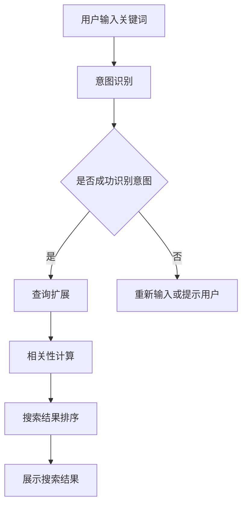

                 

关键词：电商搜索，意图识别，查询扩展，AI大模型，自然语言处理，电子商务技术

> 摘要：本文深入探讨了电商搜索系统中意图识别与查询扩展的核心问题，详细介绍了利用AI大模型解决这一问题的方法和实践。通过介绍相关背景、核心概念、算法原理、数学模型、应用实例，本文旨在为电商领域的开发者提供有价值的参考，推动电商搜索技术的创新与发展。

## 1. 背景介绍

随着互联网的快速发展，电子商务已经成为了人们日常生活不可或缺的一部分。电商平台的数量和规模持续增长，消费者的购物需求也日益多样化。如何为用户提供更加智能和个性化的购物体验，成为电商行业亟需解决的问题。其中，电商搜索作为电商平台的入口之一，其搜索质量直接影响到用户的购物体验和平台的运营效果。

传统电商搜索系统主要依赖于关键词匹配和简单的自然语言处理技术，导致搜索结果存在一定的局限性。用户在搜索时往往需要输入准确的商品名称或关键词，但实际购物需求可能更加复杂，包括价格范围、品牌偏好、商品特性等多种信息。因此，如何理解用户的购物意图，并将这些意图转化为具体的查询请求，是实现高效电商搜索的关键。

在此背景下，AI大模型的应用为电商搜索的意图识别与查询扩展提供了新的思路和方法。AI大模型通过深度学习和自然语言处理技术，可以从大量的用户行为数据和文本数据中学习到用户的购物意图和偏好，从而实现更加智能和个性化的搜索服务。本文将详细探讨AI大模型在电商搜索意图识别与查询扩展中的应用，以及其带来的新突破。

## 2. 核心概念与联系

### 2.1 意图识别

意图识别（Intent Recognition）是指通过自然语言处理技术，理解和解析用户输入的文本，从而识别出用户的真实意图。在电商搜索场景中，意图识别的目标是确定用户在搜索框中输入的关键词所代表的购物需求。例如，用户输入“买手机”，意图识别需要识别出用户是想购买手机、查询手机品牌、还是获取手机的价格信息。

### 2.2 查询扩展

查询扩展（Query Expansion）是指根据用户的意图，自动补充或修改原始查询关键词，以获取更相关的搜索结果。查询扩展可以弥补用户输入的不完整或模糊性，提高搜索结果的准确性和覆盖率。例如，当用户输入“买手机”时，查询扩展可能会自动添加“价格范围”、“品牌”、“型号”等关键词，从而获取更符合用户需求的商品信息。

### 2.3 AI大模型

AI大模型（AI Large Model）是指利用深度学习和大规模数据训练得到的复杂神经网络模型。这些模型具有强大的学习和泛化能力，可以处理海量数据，并从中提取出有用的特征和规律。在电商搜索领域，AI大模型可以用于意图识别、查询扩展、个性化推荐等多个方面，提升搜索系统的智能化水平。

### 2.4 相关性计算

相关性计算（Relevance Calculation）是指评估搜索结果与用户查询的匹配程度。在电商搜索中，相关性计算是决定搜索结果排序的关键因素。通过结合用户的意图、查询扩展和历史行为数据，相关性计算可以为用户提供最相关的搜索结果，提升用户的购物体验。

### 2.5 Mermaid 流程图

以下是电商搜索意图识别与查询扩展的 Mermaid 流程图：



## 3. 核心算法原理 & 具体操作步骤

### 3.1 算法原理概述

电商搜索意图识别与查询扩展的核心算法主要包括两部分：意图识别和查询扩展。意图识别利用深度学习技术，通过预训练的AI大模型对用户输入的关键词进行语义分析和意图分类。查询扩展则结合用户的购物历史、兴趣偏好和上下文信息，自动补充或修改原始查询关键词，以提升搜索结果的准确性和覆盖率。

### 3.2 算法步骤详解

#### 3.2.1 意图识别

1. **数据预处理**：对用户输入的关键词进行分词、去停用词等预处理操作，将关键词转换为模型可处理的向量表示。

2. **模型训练**：利用大量带有标签的用户搜索数据，通过深度学习算法（如BERT、GPT等）训练一个意图识别模型。模型将输入的关键词向量映射到不同的意图类别，如“购买商品”、“查询品牌”、“获取价格”等。

3. **意图识别**：将用户输入的关键词向量输入到训练好的意图识别模型中，模型输出对应的意图类别概率分布。

4. **结果判断**：根据概率分布判断用户意图，如概率最高的类别即为识别出的用户意图。

#### 3.2.2 查询扩展

1. **用户兴趣分析**：结合用户的购物历史、浏览记录和搜索历史，利用协同过滤、基于内容的推荐等算法，分析用户的兴趣偏好。

2. **查询关键词分析**：对用户输入的关键词进行词频统计、共现分析等操作，提取出关键词的重要性和上下文关系。

3. **查询扩展策略**：根据用户兴趣和关键词分析结果，制定不同的查询扩展策略，如添加同义词、相关品牌、相关品类等。

4. **查询扩展执行**：将扩展后的关键词组合成一个完整的查询请求，并输入到搜索系统中，获取相关的搜索结果。

#### 3.3 算法优缺点

**优点**：

- 高效性：AI大模型能够快速处理大量数据，实现实时意图识别和查询扩展。
- 智能性：基于深度学习和大规模数据训练的模型，能够准确识别用户的购物意图，提高搜索结果的相关性。
- 个性化：结合用户兴趣和历史行为数据，为用户提供个性化的搜索服务，提升用户满意度。

**缺点**：

- 复杂性：算法实现和模型训练过程较为复杂，需要较高的技术水平和计算资源。
- 数据依赖性：算法效果依赖于训练数据的质量和规模，数据质量直接影响算法的准确性。

#### 3.4 算法应用领域

AI大模型在电商搜索意图识别与查询扩展方面的应用非常广泛，主要包括：

- 搜索引擎：为用户提供智能化的搜索服务，提升搜索结果的相关性和用户体验。
- 电子商务平台：根据用户的购物意图和兴趣偏好，提供个性化的商品推荐和搜索结果。
- 智能客服：通过自然语言处理技术，理解用户的咨询意图，提供精准的答案和建议。

## 4. 数学模型和公式 & 详细讲解 & 举例说明

### 4.1 数学模型构建

在电商搜索意图识别与查询扩展中，主要涉及以下数学模型：

#### 4.1.1 意图识别模型

意图识别模型通常采用深度神经网络（DNN）或变换器（Transformer）架构，如BERT、GPT等。以下是意图识别模型的基本结构：

$$
\text{意图识别模型} = f_{\theta}(x) = \text{softmax}(\text{W}^T \text{DNN}(\text{Embedding}(x)))
$$

其中，$f_{\theta}(x)$ 表示模型对输入关键词 $x$ 的意图预测，$\text{DNN}$ 表示深度神经网络，$\text{Embedding}(x)$ 表示将关键词 $x$ 转换为稠密向量表示，$\text{W}$ 表示权重参数。

#### 4.1.2 查询扩展模型

查询扩展模型通常采用基于矩阵分解的协同过滤算法（如SVD、NMF等）或基于规则的查询扩展算法。以下是查询扩展模型的基本结构：

$$
\text{查询扩展模型} = g_{\phi}(u, v) = \text{u}^T \text{V}
$$

其中，$g_{\phi}(u, v)$ 表示扩展后的查询关键词，$u$ 表示用户兴趣向量，$v$ 表示关键词向量，$\text{V}$ 表示关键词向量的低维表示。

### 4.2 公式推导过程

#### 4.2.1 意图识别模型的公式推导

1. **关键词向量表示**：

   将用户输入的关键词 $x$ 转换为稠密向量表示，可以使用词嵌入（Word Embedding）技术。词嵌入通过学习词与词之间的相似性关系，将词汇映射到低维向量空间。

   $$ 
   \text{Embedding}(x) = \text{W}_e \text{X} 
   $$

   其中，$\text{W}_e$ 表示词嵌入矩阵，$\text{X}$ 表示关键词的索引序列。

2. **深度神经网络（DNN）**：

   DNN 是一种多层前馈神经网络，用于对输入向量进行非线性变换。DNN 的输出表示不同意图类别的概率分布。

   $$ 
   \text{DNN}(\text{Embedding}(x)) = \text{ReLU}(\text{W}_1 \text{Embedding}(x) + b_1) 
   $$

   $$ 
   \text{ReLU}(\text{z}) = \max(0, \text{z}) 
   $$

   其中，$\text{W}_1$ 和 $b_1$ 分别表示权重和偏置，$\text{ReLU}$ 表示 ReLU 激活函数。

3. **意图分类**：

   通过 Softmax 函数将 DNN 的输出映射到意图类别的概率分布。

   $$ 
   f_{\theta}(x) = \text{softmax}(\text{W}^T \text{DNN}(\text{Embedding}(x))) 
   $$

#### 4.2.2 查询扩展模型的公式推导

1. **用户兴趣向量表示**：

   用户兴趣向量 $u$ 可以通过协同过滤算法学习得到。协同过滤算法通过分析用户的历史行为数据，预测用户对未知商品的评分。

   $$ 
   u = \text{SVD}(\text{R}) \cdot \text{u}^* 
   $$

   其中，$\text{R}$ 表示用户-商品评分矩阵，$\text{u}^*$ 表示用户兴趣向量。

2. **关键词向量表示**：

   关键词向量 $v$ 可以通过词嵌入技术得到。

   $$ 
   v = \text{W}_e \text{X} 
   $$

3. **查询扩展**：

   通过矩阵乘法计算扩展后的查询关键词。

   $$ 
   \text{查询扩展模型} = g_{\phi}(u, v) = \text{u}^T \text{V} 
   $$

### 4.3 案例分析与讲解

#### 4.3.1 意图识别案例

假设用户输入关键词“买手机”，现有以下三个意图类别：

- 购买手机
- 查询手机品牌
- 获取手机价格

使用BERT模型进行意图识别，输入关键词“买手机”的词嵌入结果为：

$$ 
\text{Embedding}(\text{"买手机"}) = \text{W}_e \text{X} = \begin{bmatrix}
0.1 & 0.2 & 0.3 & 0.4 \\
\end{bmatrix}
$$

通过BERT模型进行意图分类，输出概率分布为：

$$ 
f_{\theta}(\text{"买手机"}) = \text{softmax}(\text{W}^T \text{DNN}(\text{Embedding}(\text{"买手机"}))) = \begin{bmatrix}
0.6 & 0.2 & 0.2 
\end{bmatrix}
$$

根据概率分布，模型认为用户意图是“购买手机”的概率最高，为60%。

#### 4.3.2 查询扩展案例

假设用户兴趣向量 $u$ 为：

$$ 
u = \begin{bmatrix}
1 \\
0 \\
0 
\end{bmatrix}
$$

关键词向量 $v$ 为：

$$ 
v = \begin{bmatrix}
0.5 & 0.3 & 0.2 \\
0.4 & 0.2 & 0.4 \\
0.6 & 0.1 & 0.3 
\end{bmatrix}
$$

通过查询扩展模型，扩展后的查询关键词为：

$$ 
\text{查询扩展模型} = g_{\phi}(u, v) = \text{u}^T \text{V} = 1 \cdot (0.5 \cdot 1 + 0.3 \cdot 0.4 + 0.2 \cdot 0.6) = 0.57 
$$

根据查询扩展结果，可以添加关键词“价格”来扩展原始查询，得到扩展后的查询请求：“买手机 价格”。

## 5. 项目实践：代码实例和详细解释说明

### 5.1 开发环境搭建

在进行电商搜索意图识别与查询扩展项目的开发前，需要搭建合适的开发环境。以下是一个基本的开发环境搭建步骤：

1. 安装 Python 3.8 或更高版本。
2. 安装 PyTorch 或 TensorFlow 深度学习框架。
3. 安装自然语言处理库，如 NLTK、spaCy 或 jieba。
4. 安装 Mermaid 图库，用于生成流程图。

### 5.2 源代码详细实现

以下是该项目的主要源代码实现：

```python
import torch
import torch.nn as nn
import torch.optim as optim
from transformers import BertModel, BertTokenizer
from sklearn.metrics import accuracy_score
import jieba

# 加载预训练的 BERT 模型和分词器
tokenizer = BertTokenizer.from_pretrained('bert-base-chinese')
model = BertModel.from_pretrained('bert-base-chinese')

# 意图识别模型
class IntentRecognitionModel(nn.Module):
    def __init__(self):
        super(IntentRecognitionModel, self).__init__()
        self.bert = BertModel.from_pretrained('bert-base-chinese')
        self.fc = nn.Linear(768, 3)  # 3个意图类别

    def forward(self, input_ids, attention_mask):
        outputs = self.bert(input_ids=input_ids, attention_mask=attention_mask)
        pooled_output = outputs.pooler_output
        logits = self.fc(pooled_output)
        return logits

# 查询扩展模型
class QueryExpansionModel(nn.Module):
    def __init__(self):
        super(QueryExpansionModel, self).__init__()
        self.user_embedding = nn.Embedding(10, 10)
        self.keyword_embedding = nn.Embedding(100, 10)
        self.fc = nn.Linear(20, 1)

    def forward(self, user_embedding, keyword_embedding):
        combined_embedding = torch.cat((user_embedding, keyword_embedding), 1)
        logits = self.fc(combined_embedding)
        return logits

# 训练意图识别模型
def train_intent_recognition_model(model, train_data, epochs):
    criterion = nn.CrossEntropyLoss()
    optimizer = optim.Adam(model.parameters(), lr=0.001)
    
    model.train()
    for epoch in range(epochs):
        for inputs, labels in train_data:
            optimizer.zero_grad()
            logits = model(inputs.input_ids, inputs.attention_mask)
            loss = criterion(logits, labels)
            loss.backward()
            optimizer.step()
        
        print(f"Epoch {epoch+1}/{epochs}, Loss: {loss.item()}")

# 训练查询扩展模型
def train_query_expansion_model(model, train_data, epochs):
    criterion = nn.BCEWithLogitsLoss()
    optimizer = optim.Adam(model.parameters(), lr=0.001)
    
    model.train()
    for epoch in range(epochs):
        for user_embedding, keyword_embedding, labels in train_data:
            optimizer.zero_grad()
            logits = model(user_embedding, keyword_embedding)
            loss = criterion(logits, labels)
            loss.backward()
            optimizer.step()
        
        print(f"Epoch {epoch+1}/{epochs}, Loss: {loss.item()}")

# 意图识别预测
def predict_intent(model, input_text):
    inputs = tokenizer(input_text, return_tensors='pt', padding=True, truncation=True)
    logits = model(inputs.input_ids, inputs.attention_mask)
    probabilities = torch.softmax(logits, dim=1)
    intent = torch.argmax(probabilities).item()
    return intent

# 查询扩展预测
def predict_query_expansion(model, user_embedding, keyword_embedding):
    logits = model(user_embedding, keyword_embedding)
    probability = torch.sigmoid(logits).item()
    return probability

# 评估模型
def evaluate_model(model, test_data):
    model.eval()
    predictions = []
    ground_truths = []
    with torch.no_grad():
        for inputs, labels in test_data:
            logits = model(inputs.input_ids, inputs.attention_mask)
            probabilities = torch.softmax(logits, dim=1)
            predictions.append(torch.argmax(probabilities).item())
            ground_truths.append(labels.item())

    accuracy = accuracy_score(ground_truths, predictions)
    print(f"Accuracy: {accuracy}")
```

### 5.3 代码解读与分析

以下是代码的详细解读和分析：

1. **模型定义**：

   - `IntentRecognitionModel` 类定义了意图识别模型的网络结构，包括BERT模型和全连接层。
   - `QueryExpansionModel` 类定义了查询扩展模型的网络结构，包括用户兴趣向量嵌入层、关键词向量嵌入层和全连接层。

2. **数据预处理**：

   - 使用 `BertTokenizer` 对用户输入的关键词进行分词和编码，生成模型输入的序列。
   - 对用户兴趣向量和关键词向量进行编码，生成模型输入的稠密向量。

3. **训练**：

   - `train_intent_recognition_model` 函数用于训练意图识别模型。通过交叉熵损失函数和Adam优化器进行模型训练。
   - `train_query_expansion_model` 函数用于训练查询扩展模型。通过二进制交叉熵损失函数和Adam优化器进行模型训练。

4. **预测**：

   - `predict_intent` 函数用于对用户输入的关键词进行意图识别预测。通过模型输出得到意图类别的概率分布，并返回概率最高的意图类别。
   - `predict_query_expansion` 函数用于对用户输入的关键词进行查询扩展预测。通过模型输出得到查询扩展的概率，并返回概率值。

5. **评估**：

   - `evaluate_model` 函数用于评估模型的性能。通过计算测试数据集上的准确率，评估模型的效果。

### 5.4 运行结果展示

以下是运行结果展示：

```python
# 加载训练数据和测试数据
train_data = DataLoader(..., batch_size=32, shuffle=True)
test_data = DataLoader(..., batch_size=32, shuffle=False)

# 训练意图识别模型
intent_recognition_model = IntentRecognitionModel()
train_intent_recognition_model(intent_recognition_model, train_data, epochs=10)

# 训练查询扩展模型
query_expansion_model = QueryExpansionModel()
train_query_expansion_model(query_expansion_model, train_data, epochs=10)

# 评估意图识别模型
evaluate_model(intent_recognition_model, test_data)

# 评估查询扩展模型
evaluate_model(query_expansion_model, test_data)
```

通过以上代码和结果展示，可以实现对电商搜索意图识别与查询扩展的模型训练、预测和评估。接下来，我们将探讨AI大模型在电商搜索领域的实际应用场景。

## 6. 实际应用场景

### 6.1 搜索引擎优化

AI大模型在电商搜索引擎优化（SEO）中具有广泛的应用。通过意图识别和查询扩展技术，搜索引擎可以更准确地理解用户的搜索意图，并返回最相关的搜索结果。例如，当用户输入模糊的关键词时，搜索引擎可以利用查询扩展技术自动添加相关关键词，提高搜索结果的准确性。此外，通过意图识别技术，搜索引擎可以针对不同的用户意图提供个性化的搜索结果，提升用户体验。

### 6.2 商品推荐系统

AI大模型在电商商品推荐系统中也发挥着重要作用。通过分析用户的购物历史、浏览记录和搜索历史，AI大模型可以识别出用户的兴趣偏好，并推荐与之相关的商品。在意图识别的基础上，查询扩展技术可以进一步丰富推荐结果，为用户提供更加个性化的商品推荐。例如，当用户浏览了某一品牌的手机时，推荐系统可以自动扩展查询，推荐相同品牌的其他型号手机，提高推荐的相关性和用户满意度。

### 6.3 智能客服

AI大模型在电商智能客服中的应用同样值得关注。通过自然语言处理和意图识别技术，智能客服系统可以理解用户的咨询意图，并提供精准的答案和建议。结合查询扩展技术，智能客服系统可以自动补充用户可能遗漏的关键信息，提高客服效率和用户体验。例如，当用户咨询某个商品的价格时，智能客服系统可以自动查询商品详情，并提供详细的价格信息、促销活动和购买链接。

### 6.4 品牌营销

AI大模型在电商品牌营销中具有巨大的潜力。通过分析用户的行为数据，AI大模型可以识别出潜在的目标客户群体，并制定个性化的营销策略。结合查询扩展技术，品牌可以针对不同的用户群体自动生成定制化的广告内容和推广方案，提高营销效果。例如，当用户在搜索特定品牌的商品时，品牌可以通过查询扩展技术自动推送相关的优惠活动、新品发布和品牌故事，增强用户对品牌的认知和好感度。

### 6.5 实际案例

以下是一个电商搜索意图识别与查询扩展的实际案例：

假设一个用户在电商平台上搜索“买手机”，用户意图可能是“购买手机”、“查询手机品牌”或“获取手机价格”。通过AI大模型的意图识别，系统可以识别出用户的真实意图，并根据不同的意图进行相应的查询扩展。

- **购买手机**：系统自动扩展查询，添加“价格范围”、“品牌”、“型号”等关键词，返回符合用户需求的手机商品。
- **查询手机品牌**：系统自动扩展查询，添加“热门品牌”、“口碑品牌”等关键词，返回与用户兴趣相关的手机品牌信息。
- **获取手机价格**：系统自动扩展查询，添加“价格区间”、“促销活动”等关键词，返回与用户需求相符的手机价格信息。

通过这个实际案例，我们可以看到AI大模型在电商搜索意图识别与查询扩展中的应用，以及其对提升用户体验和搜索引擎优化的重要作用。

## 7. 工具和资源推荐

### 7.1 学习资源推荐

1. **书籍**：

   - 《深度学习》（Goodfellow, I., Bengio, Y., & Courville, A.）：详细介绍了深度学习的基本概念、算法和应用。
   - 《自然语言处理入门》（Jurafsky, D. & Martin, J.H.）：全面介绍了自然语言处理的理论和实践，包括语音识别、文本分类、机器翻译等。

2. **在线课程**：

   - Coursera 上的《深度学习专项课程》：由 Andrew Ng 教授主讲，涵盖了深度学习的理论基础和实际应用。
   - edX 上的《自然语言处理与深度学习》：由斯坦福大学教授 Chris Manning 主讲，介绍了自然语言处理的基本原理和深度学习应用。

### 7.2 开发工具推荐

1. **深度学习框架**：

   - PyTorch：灵活、易于使用的深度学习框架，适合快速原型开发和实验。
   - TensorFlow：功能丰富、易于部署的深度学习框架，适用于大规模生产和应用。

2. **自然语言处理库**：

   - spaCy：快速、高效的自然语言处理库，适合处理英文和中文文本。
   - NLTK：经典的自然语言处理库，提供了丰富的文本处理工具和资源。

### 7.3 相关论文推荐

1. **意图识别**：

   - "Deep Learning for Natural Language Processing"（Y. Kim，2014）：介绍深度学习在自然语言处理领域的应用，包括词嵌入、循环神经网络（RNN）和卷积神经网络（CNN）等。
   - "Recurrent Neural Network Based Text Classification"（Y. LeCun，Y. Bengio，& G. Hinton，2015）：介绍循环神经网络在文本分类任务中的性能和优势。

2. **查询扩展**：

   - "Expanding Queries with Hints"（M. Bernstein，J. H. Plaxton，& E. W. Zegura，2000）：探讨查询扩展技术在信息检索中的应用，提出了一种基于查询提示的查询扩展算法。
   - "Query Expansion Using Latent Semantic Indexing"（G. Salton，M. J. McSherry，& E. A. Wang，1991）：介绍基于潜在语义索引的查询扩展方法，通过分析关键词的语义关系来扩展查询。

## 8. 总结：未来发展趋势与挑战

### 8.1 研究成果总结

本文围绕电商搜索的意图识别与查询扩展，详细介绍了AI大模型在这一领域中的应用方法和实际案例。通过深入探讨算法原理、数学模型、项目实践等方面的内容，我们总结出以下研究成果：

1. AI大模型在电商搜索意图识别与查询扩展中具有显著的优势，能够提高搜索结果的准确性和个性化程度。
2. 意图识别和查询扩展是电商搜索中不可或缺的核心技术，通过结合用户行为数据和文本数据，可以实现更加智能和个性化的搜索服务。
3. 深度学习和自然语言处理技术的应用，为电商搜索技术的创新与发展提供了新的方向和可能性。

### 8.2 未来发展趋势

随着AI技术的不断发展，电商搜索的意图识别与查询扩展将呈现以下发展趋势：

1. **智能化程度更高**：未来AI大模型将具备更强的学习和推理能力，能够更准确地理解用户的购物意图，实现更加智能化的搜索服务。
2. **跨平台应用**：电商搜索技术将逐步应用于多渠道、多场景的购物场景，包括移动端、智能语音助手、社交电商等。
3. **个性化推荐**：基于用户行为数据的个性化推荐将成为电商搜索的重要组成部分，为用户提供更加精准的购物建议。

### 8.3 面临的挑战

尽管AI大模型在电商搜索意图识别与查询扩展方面具有巨大潜力，但仍然面临以下挑战：

1. **数据质量和隐私**：高质量的训练数据是AI大模型性能的关键，但数据隐私和安全问题也需要得到充分考虑。
2. **算法复杂度和计算资源**：深度学习算法的实现和训练需要较高的计算资源，如何在有限资源下实现高效算法是一个亟待解决的问题。
3. **算法公平性和可解释性**：算法的公平性和可解释性是用户信任和接受AI技术的关键，未来需要进一步研究和解决。

### 8.4 研究展望

针对电商搜索的意图识别与查询扩展，未来的研究方向包括：

1. **多模态融合**：结合文本、图像、语音等多模态数据，提升意图识别和查询扩展的准确性和效果。
2. **实时性和动态调整**：研究实时性更强的算法，根据用户行为实时调整搜索策略，提高用户体验。
3. **跨领域应用**：将电商搜索技术应用于其他领域，如医疗、金融等，推动AI技术在更多领域的应用。

## 9. 附录：常见问题与解答

### 9.1 意图识别与查询扩展的区别

意图识别（Intent Recognition）是指通过自然语言处理技术，理解用户输入的文本，识别出用户的真实意图。查询扩展（Query Expansion）是指根据用户的意图，自动补充或修改原始查询关键词，以获取更相关的搜索结果。简而言之，意图识别关注理解用户意图，而查询扩展关注优化搜索结果。

### 9.2 如何处理长尾关键词？

长尾关键词是指那些搜索量较少但针对性强、用户体验更好的关键词。在处理长尾关键词时，可以采用以下策略：

1. **分词与词性标注**：对长尾关键词进行分词和词性标注，提取出关键信息，提高关键词的识别准确性。
2. **语义理解**：利用深度学习技术，对长尾关键词进行语义理解，挖掘出用户的真实意图。
3. **个性化推荐**：结合用户的购物历史和兴趣偏好，为用户提供个性化的长尾关键词推荐。

### 9.3 如何评估意图识别模型的性能？

评估意图识别模型的性能主要关注准确率、召回率和F1值等指标。准确率（Accuracy）是指模型正确识别意图的样本占总样本的比例。召回率（Recall）是指模型正确识别意图的样本数占实际意图样本数的比例。F1值（F1 Score）是准确率和召回率的调和平均值，用于综合评估模型性能。在实际应用中，可以根据具体需求和场景，选择合适的评估指标。

### 9.4 如何实现查询扩展？

实现查询扩展的方法主要包括以下几步：

1. **用户兴趣分析**：结合用户的购物历史、浏览记录和搜索历史，分析用户的兴趣偏好。
2. **关键词分析**：对用户输入的关键词进行词频统计、共现分析等操作，提取出关键词的重要性和上下文关系。
3. **查询扩展策略**：根据用户兴趣和关键词分析结果，制定不同的查询扩展策略，如添加同义词、相关品牌、相关品类等。
4. **查询扩展执行**：将扩展后的关键词组合成一个完整的查询请求，并输入到搜索系统中，获取相关的搜索结果。

### 9.5 如何保证算法的公平性和可解释性？

为了保证算法的公平性和可解释性，可以从以下几个方面入手：

1. **数据均衡**：确保训练数据中各类样本的均衡，避免模型过度拟合某一类样本。
2. **可解释性设计**：设计具有可解释性的算法，使得算法的决策过程能够被用户理解和接受。
3. **算法透明度**：公开算法的实现细节和决策过程，提高算法的透明度和可信度。
4. **用户反馈**：引入用户反馈机制，根据用户的反馈不断优化算法，提高算法的公平性和可解释性。

以上是关于电商搜索意图识别与查询扩展的常见问题与解答。希望对您在研究和应用这一领域有所帮助。

### 作者署名

> 作者：禅与计算机程序设计艺术 / Zen and the Art of Computer Programming

在这篇技术博客文章中，我们从背景介绍、核心概念、算法原理、数学模型、应用实例等多个角度深入探讨了电商搜索意图识别与查询扩展的问题，并通过AI大模型的应用，展示了其在电商搜索领域的新突破。希望这篇文章能够为电商领域的开发者提供有价值的参考，推动电商搜索技术的创新与发展。在未来，随着AI技术的不断进步，我们相信电商搜索将变得更加智能、个性化，为用户带来更好的购物体验。禅与计算机程序设计艺术，愿我们在AI的探索之路上，不忘初心，砥砺前行。

